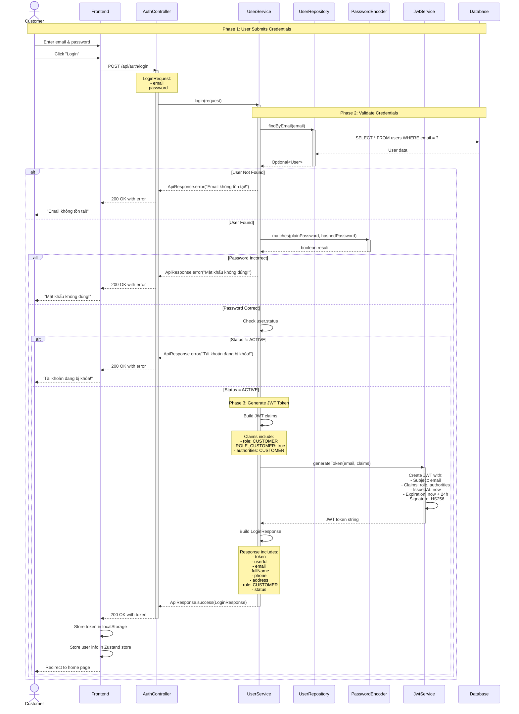
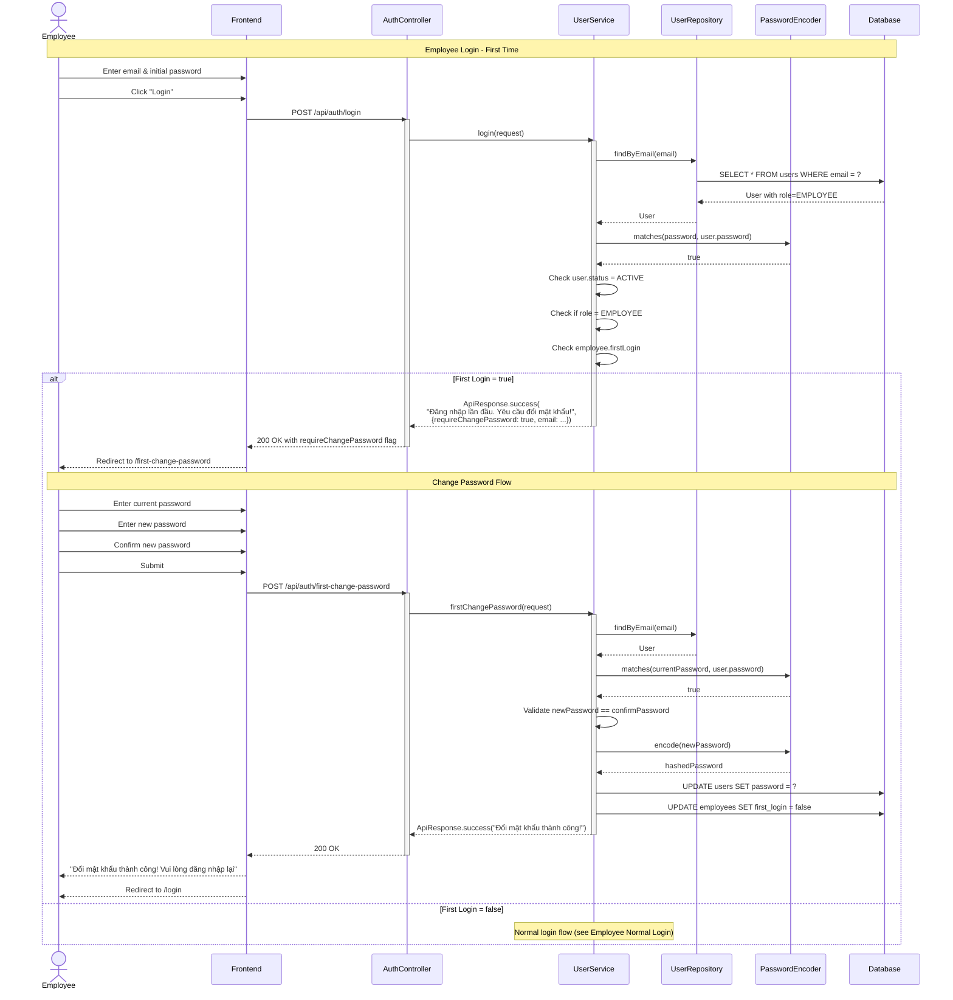
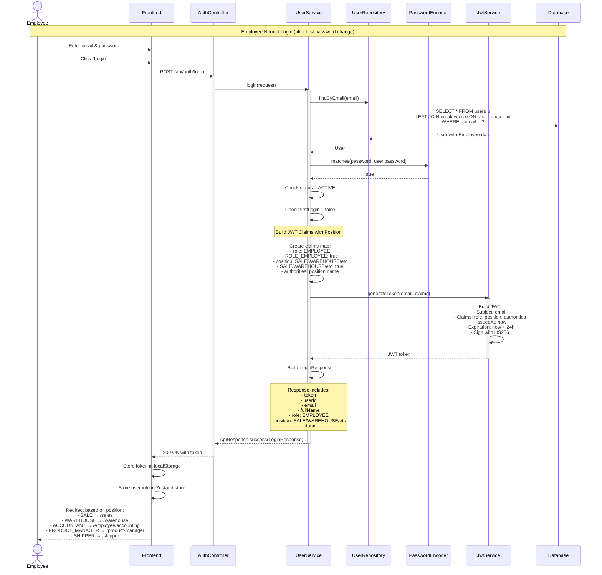
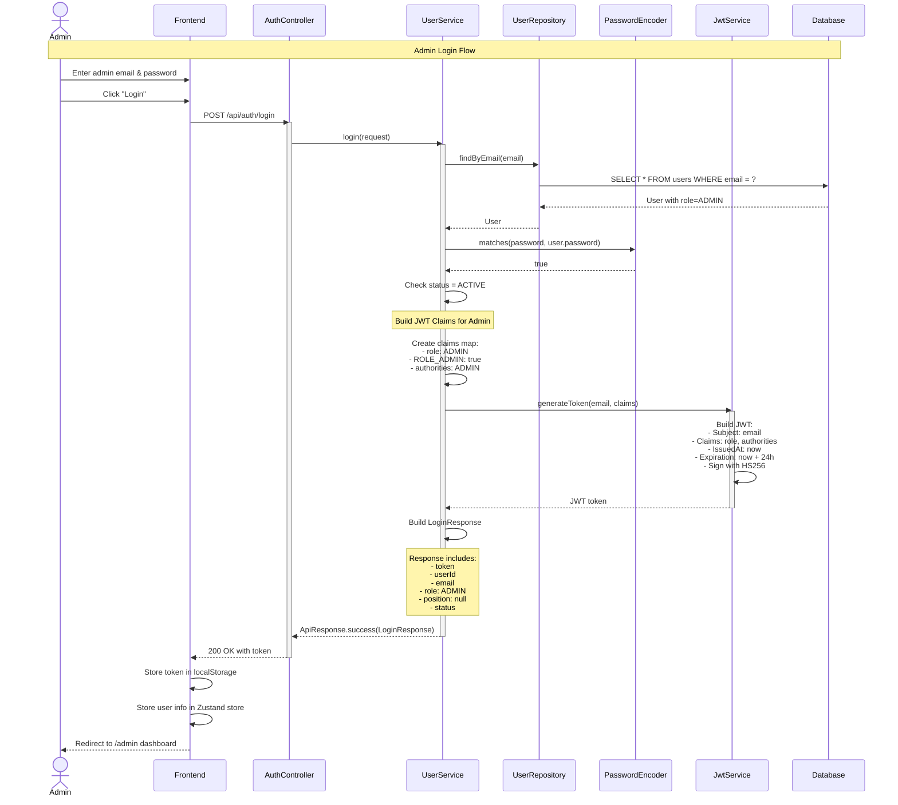
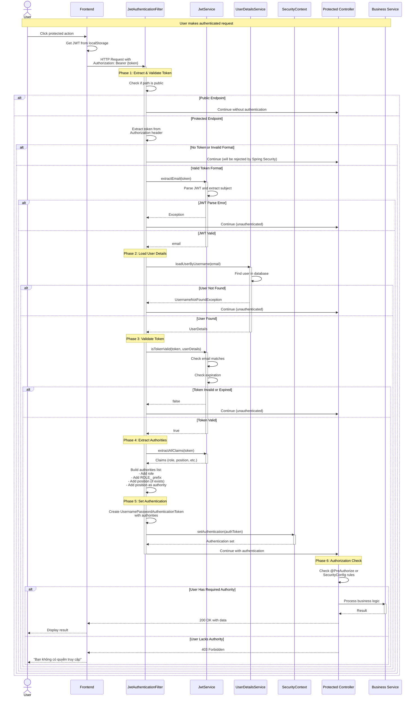
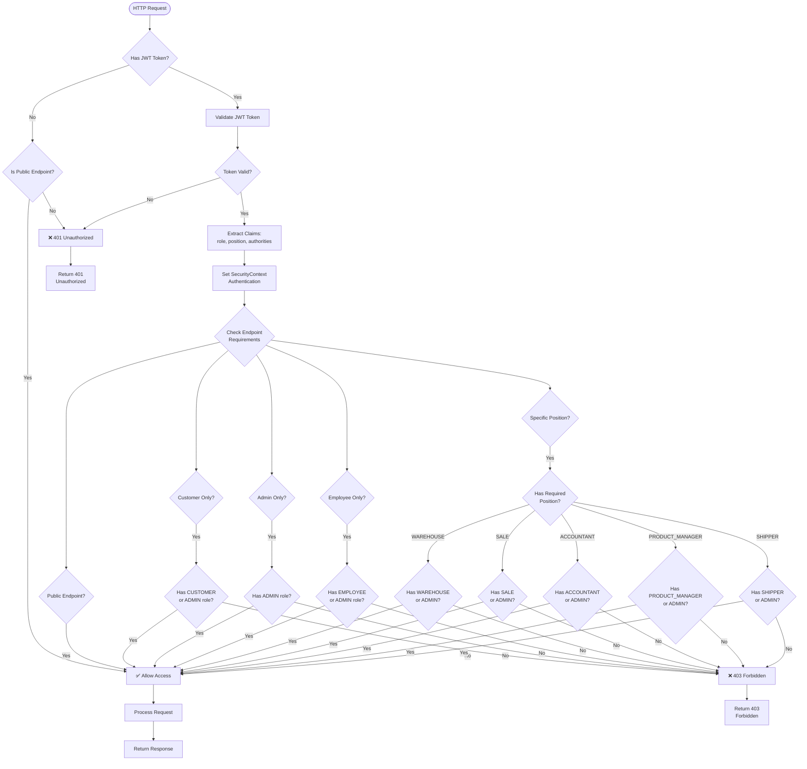
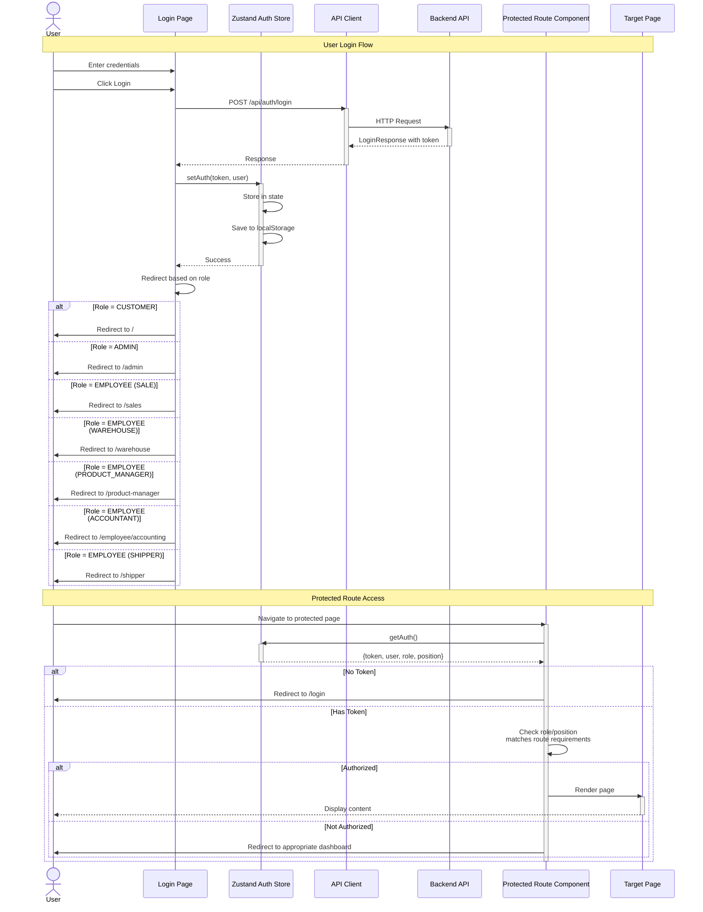

# Authentication & Authorization Flow

## Overview

Tài liệu này mô tả chi tiết luồng xác thực (Authentication) và phân quyền (Authorization) trong hệ thống TMDT, bao gồm:
- Sequence diagram cho Login và JWT generation
- Role-based access control (RBAC) matrix
- Mô tả chi tiết permissions cho từng role/position

## 1. Authentication Flow - Login và JWT Generation

### 1.1. Sơ Đồ Tuần Tự - Customer Login Flow




### 1.2. Sơ Đồ Tuần Tự - Employee Login Flow (First Time)




### 1.3. Sơ Đồ Tuần Tự - Employee Normal Login Flow




### 1.4. Sơ Đồ Tuần Tự - Admin Login Flow




## 2. JWT Token Structure

### 2.1. JWT Token Components

```
Header:
{
  "alg": "HS256",
  "typ": "JWT"
}

Payload (Claims):
{
  "sub": "user@example.com",           // Subject: user email
  "role": "EMPLOYEE",                   // User role
  "ROLE_EMPLOYEE": true,                // Spring Security role format
  "position": "SALE",                   // Employee position (if applicable)
  "SALE": true,                         // Position authority
  "authorities": "SALE",                // Authorities string
  "iat": 1703001234,                    // Issued at timestamp
  "exp": 1703087634                     // Expiration timestamp (24h later)
}

Signature:
HMACSHA256(
  base64UrlEncode(header) + "." + base64UrlEncode(payload),
  secret_key
)
```

### 2.2. JWT Claims by Role

#### Customer JWT Claims
```json
{
  "sub": "customer@example.com",
  "role": "CUSTOMER",
  "ROLE_CUSTOMER": true,
  "authorities": "CUSTOMER",
  "iat": 1703001234,
  "exp": 1703087634
}
```

#### Admin JWT Claims
```json
{
  "sub": "admin@example.com",
  "role": "ADMIN",
  "ROLE_ADMIN": true,
  "authorities": "ADMIN",
  "iat": 1703001234,
  "exp": 1703087634
}
```

#### Employee JWT Claims (with Position)
```json
{
  "sub": "employee@example.com",
  "role": "EMPLOYEE",
  "ROLE_EMPLOYEE": true,
  "position": "WAREHOUSE",
  "WAREHOUSE": true,
  "authorities": "WAREHOUSE",
  "iat": 1703001234,
  "exp": 1703087634
}
```


## 3. Authorization Flow - Request Processing

### 3.1. Sơ Đồ Tuần Tự - JWT Validation và Authorization




## 4. Role-Based Access Control (RBAC) Matrix

### 4.1. System Roles và Positions

#### Roles (3 loại chính)
1. **CUSTOMER** - Khách hàng
2. **ADMIN** - Quản trị viên hệ thống
3. **EMPLOYEE** - Nhân viên (có position cụ thể)

#### Employee Positions (6 loại)
1. **SALE** - Nhân viên bán hàng
2. **CSKH** - Chăm sóc khách hàng
3. **PRODUCT_MANAGER** - Quản lý sản phẩm
4. **WAREHOUSE** - Nhân viên kho
5. **ACCOUNTANT** - Kế toán
6. **SHIPPER** - Nhân viên giao hàng

### 4.2. Access Control Matrix - API Endpoints

| Module | Endpoint | CUSTOMER | ADMIN | SALE | WAREHOUSE | PRODUCT_MANAGER | ACCOUNTANT | SHIPPER | CSKH |
|--------|----------|----------|-------|------|-----------|-----------------|------------|---------|------|
| **Authentication** |
| POST /api/auth/login | ✅ | ✅ | ✅ | ✅ | ✅ | ✅ | ✅ | ✅ |
| POST /api/auth/register/send-otp | ✅ | ✅ | ✅ | ✅ | ✅ | ✅ | ✅ | ✅ |
| POST /api/auth/register/verify-otp | ✅ | ✅ | ✅ | ✅ | ✅ | ✅ | ✅ | ✅ |
| POST /api/auth/first-change-password | ❌ | ❌ | ✅ | ✅ | ✅ | ✅ | ✅ | ✅ |
| **Products (Public)** |
| GET /api/products | ✅ | ✅ | ✅ | ✅ | ✅ | ✅ | ✅ | ✅ |
| GET /api/products/{id} | ✅ | ✅ | ✅ | ✅ | ✅ | ✅ | ✅ | ✅ |
| GET /api/products/{id}/images | ✅ | ✅ | ✅ | ✅ | ✅ | ✅ | ✅ | ✅ |
| **Products (Management)** |
| GET /api/products/warehouse/** | ❌ | ✅ | ❌ | ❌ | ✅ | ❌ | ❌ | ❌ |
| POST /api/products/publish | ❌ | ✅ | ❌ | ❌ | ✅ | ❌ | ❌ | ❌ |
| POST /api/products/*/images | ❌ | ✅ | ❌ | ❌ | ✅ | ❌ | ❌ | ❌ |
| PUT /api/products/*/images/*/primary | ❌ | ✅ | ❌ | ❌ | ✅ | ❌ | ❌ | ❌ |
| DELETE /api/products/images/* | ❌ | ✅ | ❌ | ❌ | ✅ | ❌ | ❌ | ❌ |
| **Categories** |
| GET /api/categories | ✅ | ✅ | ✅ | ✅ | ✅ | ✅ | ✅ | ✅ |
| GET /api/categories/{id} | ✅ | ✅ | ✅ | ✅ | ✅ | ✅ | ✅ | ✅ |
| POST /api/categories | ❌ | ✅ | ❌ | ❌ | ✅ | ❌ | ❌ | ❌ |
| PUT /api/categories/{id} | ❌ | ✅ | ❌ | ❌ | ✅ | ❌ | ❌ | ❌ |
| DELETE /api/categories/{id} | ❌ | ✅ | ❌ | ❌ | ✅ | ❌ | ❌ | ❌ |
| **Cart** |
| GET /api/cart | ✅ | ✅ | ❌ | ❌ | ❌ | ❌ | ❌ | ❌ |
| POST /api/cart/add | ✅ | ✅ | ❌ | ❌ | ❌ | ❌ | ❌ | ❌ |
| PUT /api/cart/update | ✅ | ✅ | ❌ | ❌ | ❌ | ❌ | ❌ | ❌ |
| DELETE /api/cart/remove/{id} | ✅ | ✅ | ❌ | ❌ | ❌ | ❌ | ❌ | ❌ |
| **Orders (Customer)** |
| POST /api/orders/create | ✅ | ✅ | ❌ | ❌ | ❌ | ❌ | ❌ | ❌ |
| GET /api/orders/my-orders | ✅ | ✅ | ❌ | ❌ | ❌ | ❌ | ❌ | ❌ |
| GET /api/orders/{id} | ✅ | ✅ | ✅ | ❌ | ❌ | ❌ | ✅ | ❌ |
| **Orders (Management)** |
| GET /api/admin/orders | ❌ | ✅ | ✅ | ❌ | ❌ | ❌ | ✅ | ❌ |
| GET /api/admin/orders/by-status | ❌ | ✅ | ✅ | ❌ | ❌ | ❌ | ✅ | ❌ |
| PUT /api/admin/orders/{id}/status | ❌ | ✅ | ✅ | ❌ | ❌ | ❌ | ❌ | ❌ |
| PUT /api/admin/orders/{id}/cancel | ❌ | ✅ | ✅ | ❌ | ❌ | ❌ | ❌ | ❌ |
| **Inventory** |
| GET /api/inventory/stock | ❌ | ✅ | ❌ | ✅ | ✅ | ❌ | ❌ | ❌ |
| POST /api/inventory/import | ❌ | ✅ | ❌ | ✅ | ❌ | ❌ | ❌ | ❌ |
| POST /api/inventory/export | ❌ | ✅ | ❌ | ✅ | ❌ | ❌ | ❌ | ❌ |
| GET /api/inventory/transactions | ❌ | ✅ | ❌ | ✅ | ❌ | ❌ | ❌ | ❌ |
| POST /api/inventory/import/excel | ❌ | ✅ | ❌ | ✅ | ❌ | ❌ | ❌ | ❌ |
| **Shipping** |
| GET /api/shipping/provinces | ✅ | ✅ | ✅ | ✅ | ✅ | ✅ | ✅ | ✅ |
| GET /api/shipping/districts/** | ✅ | ✅ | ✅ | ✅ | ✅ | ✅ | ✅ | ✅ |
| GET /api/shipping/wards/** | ✅ | ✅ | ✅ | ✅ | ✅ | ✅ | ✅ | ✅ |
| POST /api/shipping/calculate-fee | ✅ | ✅ | ✅ | ✅ | ✅ | ✅ | ✅ | ✅ |
| POST /api/shipping/create-ghn-order | ❌ | ✅ | ✅ | ❌ | ❌ | ❌ | ✅ | ❌ |
| GET /api/shipping/tracking/{code} | ❌ | ✅ | ✅ | ❌ | ❌ | ❌ | ✅ | ❌ |
| **Accounting** |
| GET /api/accounting/transactions | ❌ | ✅ | ❌ | ❌ | ❌ | ✅ | ❌ | ❌ |
| GET /api/accounting/reports | ❌ | ✅ | ❌ | ❌ | ❌ | ✅ | ❌ | ❌ |
| GET /api/accounting/payables | ❌ | ✅ | ❌ | ❌ | ❌ | ✅ | ❌ | ❌ |
| POST /api/accounting/payables/payment | ❌ | ✅ | ❌ | ❌ | ❌ | ✅ | ❌ | ❌ |
| GET /api/accounting/reconciliation | ❌ | ✅ | ❌ | ❌ | ❌ | ✅ | ❌ | ❌ |
| **Payment** |
| GET /api/payment/{code}/status | ✅ | ✅ | ✅ | ✅ | ✅ | ✅ | ✅ | ✅ |
| POST /api/payment/sepay/webhook | ✅ | ✅ | ✅ | ✅ | ✅ | ✅ | ✅ | ✅ |
| **Dashboard** |
| GET /api/dashboard/stats | ❌ | ✅ | ✅ | ✅ | ✅ | ✅ | ✅ | ✅ |
| GET /api/dashboard/revenue | ❌ | ✅ | ✅ | ❌ | ❌ | ✅ | ❌ | ❌ |
| **Employee Registration** |
| POST /api/employee-registration/apply | ✅ | ✅ | ✅ | ✅ | ✅ | ✅ | ✅ | ✅ |
| GET /api/employee-registration/pending | ❌ | ✅ | ❌ | ❌ | ❌ | ❌ | ❌ | ❌ |
| POST /api/employee-registration/approve/{id} | ❌ | ✅ | ❌ | ❌ | ❌ | ❌ | ❌ | ❌ |
| **Admin Only** |
| GET /api/admin/** | ❌ | ✅ | ❌ | ❌ | ❌ | ❌ | ❌ | ❌ |

**Legend:**
- ✅ = Có quyền truy cập (Allowed)
- ❌ = Không có quyền (Denied - 403 Forbidden)


### 4.3. Frontend Route Access Control

| Route | CUSTOMER | ADMIN | SALE | WAREHOUSE | PRODUCT_MANAGER | ACCOUNTANT | SHIPPER |
|-------|----------|-------|------|-----------|-----------------|------------|---------|
| / (Home) | ✅ | ✅ | ✅ | ✅ | ✅ | ✅ | ✅ |
| /products | ✅ | ✅ | ✅ | ✅ | ✅ | ✅ | ✅ |
| /products/{id} | ✅ | ✅ | ✅ | ✅ | ✅ | ✅ | ✅ |
| /cart | ✅ | ✅ | ❌ | ❌ | ❌ | ❌ | ❌ |
| /checkout | ✅ | ✅ | ❌ | ❌ | ❌ | ❌ | ❌ |
| /orders | ✅ | ✅ | ❌ | ❌ | ❌ | ❌ | ❌ |
| /orders/{id} | ✅ | ✅ | ❌ | ❌ | ❌ | ❌ | ❌ |
| /profile | ✅ | ✅ | ✅ | ✅ | ✅ | ✅ | ✅ |
| **Admin Routes** |
| /admin | ❌ | ✅ | ❌ | ❌ | ❌ | ❌ | ❌ |
| /admin/products | ❌ | ✅ | ❌ | ❌ | ❌ | ❌ | ❌ |
| /admin/categories | ❌ | ✅ | ❌ | ❌ | ❌ | ❌ | ❌ |
| /admin/inventory | ❌ | ✅ | ❌ | ❌ | ❌ | ❌ | ❌ |
| /admin/accounting | ❌ | ✅ | ❌ | ❌ | ❌ | ❌ | ❌ |
| /admin/employee-approval | ❌ | ✅ | ❌ | ❌ | ❌ | ❌ | ❌ |
| **Sales Routes** |
| /sales | ❌ | ✅ | ✅ | ❌ | ❌ | ❌ | ❌ |
| /sales/orders | ❌ | ✅ | ✅ | ❌ | ❌ | ❌ | ❌ |
| /sales/export | ❌ | ✅ | ✅ | ❌ | ❌ | ❌ | ❌ |
| **Warehouse Routes** |
| /warehouse | ❌ | ✅ | ❌ | ✅ | ❌ | ❌ | ❌ |
| /warehouse/inventory | ❌ | ✅ | ❌ | ✅ | ❌ | ❌ | ❌ |
| /warehouse/import | ❌ | ✅ | ❌ | ✅ | ❌ | ❌ | ❌ |
| /warehouse/export | ❌ | ✅ | ❌ | ✅ | ❌ | ❌ | ❌ |
| /warehouse/orders | ❌ | ✅ | ❌ | ✅ | ❌ | ❌ | ❌ |
| **Product Manager Routes** |
| /product-manager | ❌ | ✅ | ❌ | ❌ | ✅ | ❌ | ❌ |
| /product-manager/products | ❌ | ✅ | ❌ | ❌ | ✅ | ❌ | ❌ |
| /product-manager/categories | ❌ | ✅ | ❌ | ❌ | ✅ | ❌ | ❌ |
| /product-manager/inventory | ❌ | ✅ | ❌ | ❌ | ✅ | ❌ | ❌ |
| **Accountant Routes** |
| /employee/accounting | ❌ | ✅ | ❌ | ❌ | ❌ | ✅ | ❌ |
| /employee/accounting/transactions | ❌ | ✅ | ❌ | ❌ | ❌ | ✅ | ❌ |
| /employee/accounting/payables | ❌ | ✅ | ❌ | ❌ | ❌ | ✅ | ❌ |
| /employee/accounting/reconciliation | ❌ | ✅ | ❌ | ❌ | ❌ | ✅ | ❌ |
| **Shipper Routes** |
| /shipper | ❌ | ✅ | ❌ | ❌ | ❌ | ❌ | ✅ |
| **Employee Routes** |
| /employee | ❌ | ✅ | ✅ | ✅ | ✅ | ✅ | ✅ |
| /employee/orders | ❌ | ✅ | ✅ | ✅ | ✅ | ✅ | ✅ |
| /employee/customers | ❌ | ✅ | ✅ | ✅ | ✅ | ✅ | ✅ |


## 5. Detailed Permission Descriptions

### 5.1. CUSTOMER Role

**Mô tả**: Khách hàng sử dụng hệ thống để mua sắm sản phẩm

**Quyền hạn**:
- ✅ Xem danh sách sản phẩm và chi tiết sản phẩm
- ✅ Thêm sản phẩm vào giỏ hàng
- ✅ Cập nhật và xóa sản phẩm trong giỏ hàng
- ✅ Đặt hàng (tạo order)
- ✅ Xem danh sách đơn hàng của mình
- ✅ Xem chi tiết đơn hàng
- ✅ Thanh toán online qua SePay
- ✅ Kiểm tra trạng thái thanh toán
- ✅ Xem và cập nhật thông tin cá nhân
- ✅ Đổi mật khẩu

**Hạn chế**:
- ❌ Không thể truy cập các chức năng quản lý (admin, warehouse, accounting)
- ❌ Không thể xem đơn hàng của khách hàng khác
- ❌ Không thể thay đổi trạng thái đơn hàng
- ❌ Không thể quản lý sản phẩm, danh mục, kho hàng

**Use Cases**:
1. Browse và tìm kiếm sản phẩm
2. Thêm sản phẩm vào giỏ hàng
3. Checkout và đặt hàng
4. Thanh toán online
5. Theo dõi đơn hàng
6. Quản lý thông tin cá nhân

---

### 5.2. ADMIN Role

**Mô tả**: Quản trị viên hệ thống có quyền truy cập toàn bộ chức năng

**Quyền hạn**:
- ✅ Tất cả quyền của CUSTOMER
- ✅ Quản lý sản phẩm (CRUD)
- ✅ Quản lý danh mục (CRUD)
- ✅ Quản lý kho hàng (nhập/xuất)
- ✅ Quản lý đơn hàng (xem tất cả, cập nhật trạng thái, hủy)
- ✅ Quản lý kế toán (xem báo cáo, giao dịch, công nợ)
- ✅ Quản lý nhân viên (duyệt đăng ký, tạo tài khoản)
- ✅ Xem dashboard và báo cáo tổng hợp
- ✅ Quản lý vận chuyển (tạo đơn GHN, theo dõi)
- ✅ Quản lý thanh toán và đối soát
- ✅ Truy cập tất cả các module

**Hạn chế**:
- Không có hạn chế (full access)

**Use Cases**:
1. Quản lý toàn bộ hệ thống
2. Duyệt đăng ký nhân viên
3. Xem báo cáo tổng hợp
4. Xử lý các vấn đề đặc biệt
5. Cấu hình hệ thống
6. Giám sát hoạt động

---

### 5.3. SALE Position (Employee)

**Mô tả**: Nhân viên bán hàng xử lý đơn hàng từ khách hàng

**Quyền hạn**:
- ✅ Xem danh sách đơn hàng
- ✅ Xem chi tiết đơn hàng
- ✅ Xác nhận đơn hàng (PENDING → CONFIRMED)
- ✅ Hủy đơn hàng (với lý do)
- ✅ Lọc đơn hàng theo trạng thái
- ✅ Tạo đơn vận chuyển GHN
- ✅ Theo dõi trạng thái vận chuyển
- ✅ Xem thông tin khách hàng
- ✅ Xem dashboard (số liệu bán hàng)

**Hạn chế**:
- ❌ Không thể quản lý sản phẩm
- ❌ Không thể quản lý kho hàng
- ❌ Không thể xem báo cáo kế toán
- ❌ Không thể duyệt nhân viên
- ❌ Không thể xuất kho (chỉ warehouse mới xuất)

**Workflow**:
1. Nhận đơn hàng mới (status: PENDING hoặc CONFIRMED)
2. Kiểm tra thông tin đơn hàng
3. Xác nhận đơn hàng
4. Chờ warehouse xuất kho (READY_TO_SHIP)
5. Tạo đơn GHN để giao hàng
6. Theo dõi trạng thái giao hàng

**Business Rules**:
- Chỉ có thể xác nhận đơn hàng đã thanh toán (COD hoặc Online paid)
- Không thể hủy đơn đã ở trạng thái SHIPPING
- Phải có lý do khi hủy đơn hàng

---

### 5.4. WAREHOUSE Position (Employee)

**Mô tả**: Nhân viên kho quản lý nhập/xuất hàng và tồn kho

**Quyền hạn**:
- ✅ Xem tồn kho (inventory stock)
- ✅ Nhập hàng (create import transaction)
- ✅ Nhập hàng qua Excel
- ✅ Xuất hàng cho đơn hàng (create export transaction)
- ✅ Quét QR code serial number
- ✅ Xem lịch sử giao dịch kho
- ✅ Xem danh sách đơn hàng cần xuất
- ✅ Cập nhật trạng thái đơn hàng (CONFIRMED → READY_TO_PICK → READY_TO_SHIP)
- ✅ Xem báo cáo tồn kho
- ✅ Quản lý nhà cung cấp (suppliers)

**Hạn chế**:
- ❌ Không thể xác nhận đơn hàng (chỉ sales)
- ❌ Không thể tạo đơn GHN (chỉ sales/shipper)
- ❌ Không thể xem báo cáo kế toán
- ❌ Không thể quản lý sản phẩm (chỉ product manager)

**Workflow - Nhập Kho**:
1. Tải file Excel với thông tin sản phẩm
2. Hệ thống parse và validate
3. Tạo import transaction
4. Hoàn tất nhập kho
5. Tồn kho được cập nhật tự động

**Workflow - Xuất Kho**:
1. Nhận đơn hàng đã xác nhận (CONFIRMED)
2. Tạo export transaction
3. Quét QR code serial number cho từng sản phẩm
4. Hoàn tất xuất kho
5. Đơn hàng chuyển sang READY_TO_SHIP
6. Tồn kho giảm tự động

**Business Rules**:
- Không thể xuất kho nếu không đủ available quantity
- Mỗi sản phẩm phải có serial number khi xuất
- Serial number không được trùng lặp
- Phải hoàn tất export transaction để cập nhật tồn kho

---

### 5.5. PRODUCT_MANAGER Position (Employee)

**Mô tả**: Quản lý sản phẩm và danh mục

**Quyền hạn**:
- ✅ Quản lý sản phẩm (CRUD)
- ✅ Quản lý danh mục (CRUD)
- ✅ Upload và quản lý hình ảnh sản phẩm
- ✅ Đặt hình ảnh chính (primary image)
- ✅ Sắp xếp thứ tự hình ảnh
- ✅ Publish/unpublish sản phẩm
- ✅ Quản lý specifications sản phẩm
- ✅ Xem tồn kho (read-only)
- ✅ Xem danh sách sản phẩm warehouse

**Hạn chế**:
- ❌ Không thể nhập/xuất kho (chỉ warehouse)
- ❌ Không thể xử lý đơn hàng
- ❌ Không thể xem báo cáo kế toán
- ❌ Không thể tạo đơn vận chuyển

**Workflow**:
1. Tạo/cập nhật sản phẩm
2. Upload hình ảnh sản phẩm
3. Thêm specifications
4. Publish sản phẩm để hiển thị cho khách hàng
5. Quản lý danh mục và phân loại

**Business Rules**:
- Sản phẩm phải có ít nhất 1 hình ảnh
- Sản phẩm phải thuộc 1 danh mục
- Chỉ sản phẩm published mới hiển thị cho khách hàng

---

### 5.6. ACCOUNTANT Position (Employee)

**Mô tả**: Kế toán quản lý tài chính và công nợ

**Quyền hạn**:
- ✅ Xem tất cả giao dịch tài chính (financial transactions)
- ✅ Xem báo cáo doanh thu
- ✅ Xem báo cáo lợi nhuận
- ✅ Quản lý công nợ nhà cung cấp (supplier payables)
- ✅ Ghi nhận thanh toán cho nhà cung cấp
- ✅ Đối soát thanh toán (reconciliation)
- ✅ Xem báo cáo thuế
- ✅ Quản lý tài khoản ngân hàng
- ✅ Xem lịch sử thanh toán SePay
- ✅ Xem báo cáo kế toán nâng cao

**Hạn chế**:
- ❌ Không thể xử lý đơn hàng
- ❌ Không thể quản lý kho
- ❌ Không thể quản lý sản phẩm
- ❌ Không thể tạo đơn vận chuyển

**Workflow - Ghi Nhận Doanh Thu**:
1. Đơn hàng chuyển sang DELIVERED
2. Hệ thống tự động tạo financial transaction (REVENUE)
3. Accountant xem và đối soát

**Workflow - Quản Lý Công Nợ**:
1. Warehouse nhập hàng với supplier
2. Hệ thống tự động tạo supplier payable
3. Accountant xem danh sách công nợ
4. Ghi nhận thanh toán cho supplier
5. Công nợ giảm tự động

**Workflow - Đối Soát Thanh Toán**:
1. Xem danh sách thanh toán SePay
2. So sánh với bank statement
3. Đánh dấu đã đối soát
4. Xử lý các giao dịch chưa khớp

**Business Rules**:
- Doanh thu chỉ được ghi nhận khi đơn hàng DELIVERED
- Công nợ được tạo tự động khi nhập hàng có supplier
- Không thể xóa giao dịch tài chính (chỉ có thể tạo giao dịch điều chỉnh)

---

### 5.7. SHIPPER Position (Employee)

**Mô tả**: Nhân viên giao hàng xử lý vận chuyển

**Quyền hạn**:
- ✅ Xem danh sách đơn hàng cần giao (READY_TO_SHIP, SHIPPING)
- ✅ Xem chi tiết đơn hàng
- ✅ Tạo đơn GHN
- ✅ Theo dõi trạng thái vận chuyển
- ✅ Xem thông tin địa chỉ giao hàng
- ✅ Cập nhật trạng thái giao hàng

**Hạn chế**:
- ❌ Không thể xác nhận đơn hàng
- ❌ Không thể xuất kho
- ❌ Không thể xem báo cáo kế toán
- ❌ Không thể quản lý sản phẩm

**Workflow**:
1. Nhận đơn hàng READY_TO_SHIP
2. Tạo đơn GHN với thông tin giao hàng
3. Nhận mã vận đơn GHN
4. Theo dõi trạng thái qua GHN webhook
5. Xác nhận giao hàng thành công

**Business Rules**:
- Chỉ có thể tạo đơn GHN cho đơn hàng READY_TO_SHIP
- Địa chỉ giao hàng phải hợp lệ (có province/district/ward code)
- Không thể hủy đơn GHN đã tạo (phải liên hệ GHN)

---

### 5.8. CSKH Position (Employee)

**Mô tả**: Chăm sóc khách hàng

**Quyền hạn**:
- ✅ Xem thông tin khách hàng
- ✅ Xem lịch sử đơn hàng của khách hàng
- ✅ Hỗ trợ khách hàng qua chat/email
- ✅ Xem dashboard

**Hạn chế**:
- ❌ Không thể xử lý đơn hàng
- ❌ Không thể quản lý kho
- ❌ Không thể xem báo cáo kế toán chi tiết

**Use Cases**:
1. Hỗ trợ khách hàng giải đáp thắc mắc
2. Xem lịch sử đơn hàng để hỗ trợ
3. Chuyển vấn đề phức tạp cho bộ phận liên quan


## 6. Security Implementation Details

### 6.1. Password Security

**Hashing Algorithm**: BCrypt
- Sử dụng BCryptPasswordEncoder từ Spring Security
- Tự động thêm salt ngẫu nhiên
- Cost factor: 10 (default)
- Không thể reverse engineer password từ hash

**Password Storage**:
```java
// Khi tạo user mới
String hashedPassword = passwordEncoder.encode(plainPassword);
user.setPassword(hashedPassword);

// Khi verify password
boolean matches = passwordEncoder.matches(plainPassword, hashedPassword);
```

**Password Policy**:
- Minimum length: 6 characters (có thể cấu hình)
- Yêu cầu đổi mật khẩu lần đầu cho employee
- Không lưu trữ plain text password

---

### 6.2. JWT Security

**Token Generation**:
- Algorithm: HS256 (HMAC with SHA-256)
- Secret key: Lưu trong application.properties (app.jwt.secret)
- Expiration: 24 hours (86400000 ms)
- Claims: role, position, authorities

**Token Validation**:
```java
public boolean isTokenValid(String token, UserDetails userDetails) {
    String email = extractEmail(token);
    Date expiration = extractClaim(token, Claims::getExpiration);
    return email.equals(userDetails.getUsername()) && 
           expiration.after(new Date());
}
```

**Security Best Practices**:
- Token chỉ được gửi qua HTTPS trong production
- Token được lưu trong localStorage (frontend)
- Token được gửi trong Authorization header: `Bearer {token}`
- Token không chứa sensitive data (chỉ có email, role, position)
- Token có expiration time để giảm thiểu rủi ro nếu bị đánh cắp

---

### 6.3. Session Management

**Stateless Authentication**:
- Không sử dụng server-side session
- SessionCreationPolicy: STATELESS
- Mỗi request phải có JWT token
- Không có session cookie

**Token Refresh**:
- Hiện tại: Token hết hạn sau 24h, user phải login lại
- Future enhancement: Implement refresh token mechanism

---

### 6.4. CORS Configuration

**Allowed Origins**:
- Development: localhost:3000
- Production: Specific domain hoặc ngrok URL
- Webhook endpoints: Allow all origins (for GHN, SePay)

**Allowed Methods**:
- GET, POST, PUT, DELETE, OPTIONS

**Allowed Headers**:
- All headers (*)
- Đặc biệt: Authorization, Content-Type

**Credentials**:
- allowCredentials: true (cho phép gửi cookies nếu cần)
- Webhook endpoints: false (không cần credentials)

---

### 6.5. Input Validation

**Email Validation**:
- Format: RFC 5322 compliant
- Unique constraint trong database
- Case-insensitive comparison

**Password Validation**:
- Minimum length check
- Confirmation password match
- Current password verification khi đổi mật khẩu

**Address Validation**:
- Province/District/Ward code phải tồn tại trong database
- Detailed address không được rỗng
- Format validation cho phone number

---

### 6.6. Error Handling

**Authentication Errors**:
- Invalid credentials: "Email không tồn tại!" hoặc "Mật khẩu không đúng!"
- Account locked: "Tài khoản đang bị khóa!"
- Token expired: 401 Unauthorized
- Invalid token: 401 Unauthorized

**Authorization Errors**:
- Insufficient permissions: 403 Forbidden
- Resource not found: 404 Not Found
- Invalid request: 400 Bad Request

**Security Considerations**:
- Không tiết lộ thông tin chi tiết về lỗi authentication
- Log tất cả failed login attempts
- Rate limiting cho login endpoint (future enhancement)

---

### 6.7. Webhook Security

**SePay Webhook**:
- Signature verification (nếu SePay cung cấp)
- Idempotency check (tránh xử lý duplicate webhook)
- IP whitelist (nếu SePay cung cấp IP cố định)

**GHN Webhook**:
- Signature verification theo GHN documentation
- Validate order code tồn tại trong hệ thống
- Idempotency check

**General Webhook Security**:
- HTTPS only trong production
- Validate payload structure
- Log tất cả webhook requests
- Return appropriate HTTP status codes


## 7. Authorization Decision Flow

### 7.1. Sơ Đồ Quyết Định - Endpoint Access



### 7.2. Authorization Examples

#### Example 1: Customer Accessing Cart
```
Request: GET /api/cart
Headers: Authorization: Bearer {customer_token}

Flow:
1. Extract token → Valid
2. Extract claims → role: CUSTOMER
3. Check endpoint → Requires CUSTOMER or ADMIN
4. User has CUSTOMER → ✅ Allow
5. Return cart data
```

#### Example 2: Employee Accessing Admin Endpoint
```
Request: GET /api/admin/products
Headers: Authorization: Bearer {employee_token}

Flow:
1. Extract token → Valid
2. Extract claims → role: EMPLOYEE, position: WAREHOUSE
3. Check endpoint → Requires ADMIN only
4. User has EMPLOYEE (not ADMIN) → ❌ Deny
5. Return 403 Forbidden
```

#### Example 3: Warehouse Staff Accessing Inventory
```
Request: POST /api/inventory/import
Headers: Authorization: Bearer {warehouse_token}

Flow:
1. Extract token → Valid
2. Extract claims → role: EMPLOYEE, position: WAREHOUSE
3. Check endpoint → Requires WAREHOUSE or ADMIN
4. User has WAREHOUSE → ✅ Allow
5. Process import request
```

#### Example 4: Admin Accessing Any Endpoint
```
Request: POST /api/accounting/transactions
Headers: Authorization: Bearer {admin_token}

Flow:
1. Extract token → Valid
2. Extract claims → role: ADMIN
3. Check endpoint → Requires ACCOUNTANT or ADMIN
4. User has ADMIN → ✅ Allow (Admin has all permissions)
5. Process transaction request
```

#### Example 5: Unauthenticated User Accessing Public Endpoint
```
Request: GET /api/products
Headers: (no Authorization header)

Flow:
1. No token → Check if public
2. Endpoint is public → ✅ Allow
3. Return product list
```

#### Example 6: Expired Token
```
Request: GET /api/orders/my-orders
Headers: Authorization: Bearer {expired_token}

Flow:
1. Extract token → Parse successful
2. Validate token → Expiration check fails
3. Token invalid → ❌ Deny
4. Return 401 Unauthorized
```


## 8. Frontend Authentication Flow

### 8.1. Sơ Đồ Tuần Tự - Frontend Login và Route Protection



### 8.2. Frontend Auth Store (Zustand)

```typescript
interface AuthState {
  token: string | null;
  user: {
    id: number;
    email: string;
    fullName: string;
    role: 'CUSTOMER' | 'ADMIN' | 'EMPLOYEE';
    position?: 'SALE' | 'WAREHOUSE' | 'PRODUCT_MANAGER' | 'ACCOUNTANT' | 'SHIPPER' | 'CSKH';
    status: string;
  } | null;
  isAuthenticated: boolean;
  
  // Actions
  setAuth: (token: string, user: any) => void;
  logout: () => void;
  checkAuth: () => void;
}

// Implementation
const useAuthStore = create<AuthState>((set) => ({
  token: null,
  user: null,
  isAuthenticated: false,
  
  setAuth: (token, user) => {
    localStorage.setItem('token', token);
    localStorage.setItem('user', JSON.stringify(user));
    set({ token, user, isAuthenticated: true });
  },
  
  logout: () => {
    localStorage.removeItem('token');
    localStorage.removeItem('user');
    set({ token: null, user: null, isAuthenticated: false });
  },
  
  checkAuth: () => {
    const token = localStorage.getItem('token');
    const userStr = localStorage.getItem('user');
    if (token && userStr) {
      const user = JSON.parse(userStr);
      set({ token, user, isAuthenticated: true });
    }
  }
}));
```

### 8.3. API Client with Token Injection

```typescript
// API client automatically adds token to requests
const api = axios.create({
  baseURL: process.env.NEXT_PUBLIC_API_URL,
});

// Request interceptor - add token
api.interceptors.request.use((config) => {
  const token = localStorage.getItem('token');
  if (token) {
    config.headers.Authorization = `Bearer ${token}`;
  }
  return config;
});

// Response interceptor - handle 401
api.interceptors.response.use(
  (response) => response,
  (error) => {
    if (error.response?.status === 401) {
      // Token expired or invalid
      useAuthStore.getState().logout();
      window.location.href = '/login';
    }
    return Promise.reject(error);
  }
);
```

### 8.4. Protected Route Component

```typescript
interface ProtectedRouteProps {
  children: React.ReactNode;
  allowedRoles?: string[];
  allowedPositions?: string[];
}

const ProtectedRoute: React.FC<ProtectedRouteProps> = ({
  children,
  allowedRoles,
  allowedPositions
}) => {
  const { isAuthenticated, user } = useAuthStore();
  const router = useRouter();
  
  useEffect(() => {
    if (!isAuthenticated) {
      router.push('/login');
      return;
    }
    
    // Check role
    if (allowedRoles && !allowedRoles.includes(user.role)) {
      router.push(getDefaultRoute(user.role, user.position));
      return;
    }
    
    // Check position (for employees)
    if (allowedPositions && user.role === 'EMPLOYEE') {
      if (!allowedPositions.includes(user.position)) {
        router.push(getDefaultRoute(user.role, user.position));
        return;
      }
    }
  }, [isAuthenticated, user, router]);
  
  if (!isAuthenticated) {
    return <div>Loading...</div>;
  }
  
  return <>{children}</>;
};
```


## 9. Security Considerations và Best Practices

### 9.1. Authentication Security

**✅ Implemented**:
- BCrypt password hashing với automatic salt
- JWT token với expiration (24h)
- HTTPS trong production (recommended)
- Stateless authentication (không dùng server session)
- First-time password change cho employee
- Account status check (ACTIVE/LOCKED)

**⚠️ Recommendations for Production**:
- Implement refresh token mechanism
- Add rate limiting cho login endpoint (prevent brute force)
- Implement account lockout sau N failed attempts
- Add CAPTCHA cho login form
- Log tất cả authentication events
- Implement password complexity requirements
- Add password expiration policy
- Implement 2FA (Two-Factor Authentication)

---

### 9.2. Authorization Security

**✅ Implemented**:
- Role-based access control (RBAC)
- Position-based permissions cho employees
- JWT claims validation
- Spring Security method-level security
- Frontend route protection

**⚠️ Recommendations**:
- Implement attribute-based access control (ABAC) cho fine-grained permissions
- Add resource-level permissions (e.g., user can only edit their own orders)
- Implement permission caching để improve performance
- Add audit logging cho sensitive operations
- Implement principle of least privilege

---

### 9.3. Token Security

**✅ Implemented**:
- HS256 signing algorithm
- Token expiration
- Claims validation
- Secure token storage (localStorage)

**⚠️ Recommendations**:
- Consider using RS256 (asymmetric) thay vì HS256 (symmetric)
- Implement token refresh mechanism
- Add token revocation/blacklist
- Consider using httpOnly cookies thay vì localStorage (XSS protection)
- Implement token rotation
- Add jti (JWT ID) claim để track tokens

---

### 9.4. Data Security

**✅ Implemented**:
- Password hashing (không lưu plain text)
- Input validation
- SQL injection prevention (JPA/Hibernate)
- CORS configuration

**⚠️ Recommendations**:
- Implement data encryption at rest
- Add field-level encryption cho sensitive data
- Implement data masking trong logs
- Add input sanitization để prevent XSS
- Implement CSRF protection cho state-changing operations
- Add SQL injection testing
- Implement secure file upload validation

---

### 9.5. API Security

**✅ Implemented**:
- JWT authentication
- Role-based authorization
- CORS configuration
- Error handling (không expose sensitive info)

**⚠️ Recommendations**:
- Implement API rate limiting
- Add request size limits
- Implement API versioning
- Add request/response logging
- Implement API key management cho external integrations
- Add webhook signature verification
- Implement idempotency keys cho critical operations

---

### 9.6. Monitoring và Auditing

**⚠️ Recommendations**:
- Implement comprehensive audit logging:
  - Who (user)
  - What (action)
  - When (timestamp)
  - Where (IP address, location)
  - Result (success/failure)
- Log tất cả authentication attempts
- Log tất cả authorization failures
- Log tất cả sensitive operations (order creation, payment, etc.)
- Implement real-time alerting cho suspicious activities
- Add security dashboard
- Implement log retention policy
- Add SIEM integration

---

### 9.7. Compliance và Standards

**Recommendations**:
- Follow OWASP Top 10 guidelines
- Implement GDPR compliance (nếu có EU customers):
  - Right to access
  - Right to erasure
  - Data portability
  - Consent management
- Implement PCI DSS compliance (nếu xử lý card payments)
- Add privacy policy và terms of service
- Implement data retention policies
- Add cookie consent management

---

### 9.8. Incident Response

**Recommendations**:
- Develop incident response plan
- Implement security incident detection
- Add automated alerting
- Create runbook cho common security incidents
- Implement backup và disaster recovery
- Add security testing (penetration testing, vulnerability scanning)
- Conduct regular security audits
- Implement bug bounty program

---

### 9.9. Development Security

**Recommendations**:
- Implement secure coding guidelines
- Add security code review process
- Use dependency scanning (detect vulnerable libraries)
- Implement secrets management (không commit secrets vào git)
- Add pre-commit hooks cho security checks
- Implement secure CI/CD pipeline
- Add security testing trong CI/CD
- Use environment variables cho sensitive config

---

### 9.10. User Education

**Recommendations**:
- Provide security awareness training cho employees
- Add password strength indicator
- Implement security notifications (login from new device, etc.)
- Add security tips trong UI
- Implement phishing awareness training
- Add security FAQ
- Provide incident reporting mechanism


## 10. Summary

### 10.1. Key Points

**Authentication**:
- Hệ thống sử dụng JWT-based authentication
- 3 loại role chính: CUSTOMER, ADMIN, EMPLOYEE
- Employee có 6 positions: SALE, WAREHOUSE, PRODUCT_MANAGER, ACCOUNTANT, SHIPPER, CSKH
- Password được hash bằng BCrypt
- Token có expiration 24 hours
- Employee phải đổi mật khẩu lần đầu

**Authorization**:
- Role-based access control (RBAC)
- Position-based permissions cho employees
- Admin có full access
- Mỗi position có quyền hạn cụ thể theo chức năng nghiệp vụ
- Frontend và backend đều có route/endpoint protection

**Security**:
- Stateless authentication (không dùng session)
- JWT token trong Authorization header
- CORS configuration cho cross-origin requests
- Input validation và error handling
- Webhook security cho GHN và SePay

### 10.2. Authentication Flow Summary

1. **Login**: User nhập credentials → Backend validate → Generate JWT → Return token
2. **Token Storage**: Frontend lưu token trong localStorage và Zustand store
3. **Request**: Frontend gửi request với token trong Authorization header
4. **Validation**: Backend validate token và extract claims
5. **Authorization**: Backend check role/position có quyền truy cập endpoint không
6. **Response**: Return data hoặc 403 Forbidden

### 10.3. Role Hierarchy

```
ADMIN (Full Access)
├── All CUSTOMER permissions
├── All EMPLOYEE permissions
└── Admin-only features

EMPLOYEE (Position-based)
├── SALE: Order management, shipping
├── WAREHOUSE: Inventory management
├── PRODUCT_MANAGER: Product & category management
├── ACCOUNTANT: Financial management
├── SHIPPER: Delivery management
└── CSKH: Customer support

CUSTOMER (Limited Access)
├── Browse products
├── Shopping cart
├── Place orders
└── View own orders
```

### 10.4. Validation Requirements (Requirements 10.1-10.5)

Tài liệu này đáp ứng đầy đủ các yêu cầu từ Requirements Document:

**Requirement 10.1**: ✅ WHEN a user logs in, THE System SHALL authenticate credentials and return JWT token with role information
- Implemented: Login flow với JWT generation
- Documented: Section 1.1, 1.3, 1.4

**Requirement 10.2**: ✅ WHEN a user accesses a protected endpoint, THE System SHALL verify JWT token and check role permissions
- Implemented: JwtAuthenticationFilter và SecurityConfig
- Documented: Section 3.1, 7.1

**Requirement 10.3**: ✅ WHEN a user attempts to access unauthorized feature, THE System SHALL return HTTP 403 Forbidden
- Implemented: Spring Security authorization
- Documented: Section 7.1, 7.2

**Requirement 10.4**: ✅ WHEN an admin creates employee account, THE System SHALL assign position and set initial password
- Implemented: Employee registration flow
- Documented: Section 5.3-5.8

**Requirement 10.5**: ✅ WHEN an employee logs in for the first time, THE System SHALL require password change before accessing other features
- Implemented: First-time password change flow
- Documented: Section 1.2

---

## Kết Luận

Hệ thống authentication và authorization được thiết kế với:
- **Bảo mật cao**: JWT, BCrypt, role-based access control
- **Linh hoạt**: Position-based permissions cho employees
- **Dễ mở rộng**: Có thể thêm roles/positions mới
- **Tuân thủ best practices**: Spring Security, stateless authentication
- **User-friendly**: First-time password change, clear error messages

Tài liệu này cung cấp đầy đủ thông tin về authentication flow, authorization matrix, và security implementation để phục vụ cho báo cáo đồ án.

