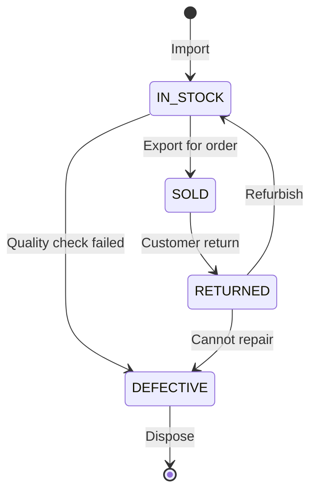

# Database Design Decisions - Hệ Thống TMDT

## Tổng Quan

Tài liệu này phân tích chi tiết các quyết định thiết kế database cho hệ thống thương mại điện tử, bao gồm:
- Lý do tách biệt warehouse_products và products
- Chiến lược tracking serial numbers
- Quản lý inventory stock (onHand, reserved, available)
- Supplier payable và payment tracking
- Indexing strategy và performance considerations

**Validates Requirements**: 3.1-3.5, 4.1-4.5, 9.1-9.5, 13.1-13.5

---

## 1. Tách Biệt warehouse_products và products

### 1.1. Quyết Định Thiết Kế

Hệ thống sử dụng **2 bảng riêng biệt** để quản lý sản phẩm:

```
warehouse_products (Quản lý kho - Internal)
    ↕ (1-1 relationship)
products (Hiển thị khách hàng - Public)
```

**Cấu trúc**:

```java
// Bảng warehouse_products - Quản lý nội bộ
@Entity
@Table(name = "warehouse_products")
public class WarehouseProduct {
    private Long id;
    private String sku;              // Mã SKU nội bộ
    private String internalName;     // Tên kỹ thuật
    private String techSpecsJson;    // Thông số kỹ thuật
    private Supplier supplier;       // Nhà cung cấp
    private LocalDateTime lastImportDate;
    
    // Relationships
    private Product product;         // 1-1 với products
    private List<ProductDetail> serials;  // Tracking serial
    private List<ProductSpecification> specifications;
}

// Bảng products - Hiển thị public
@Entity
@Table(name = "products")
public class Product {
    private Long id;
    private String name;             // Tên marketing
    private Double price;            // Giá bán
    private String sku;              // SKU public
    private String description;      // Mô tả cho khách
    private Category category;
    private List<ProductImage> images;
    
    private Long stockQuantity;      // Tồn kho hiển thị
    private Long reservedQuantity;   // Đang giữ chỗ
    
    private WarehouseProduct warehouseProduct;  // Link to warehouse
    private Boolean active;          // Đang bán hay không
}
```

### 1.2. Lý Do Thiết Kế

#### 1.2.1. Separation of Concerns (Tách biệt trách nhiệm)

**warehouse_products**: Quản lý nội bộ
- Giá nhập (import price) - Thông tin nhạy cảm
- Thông tin nhà cung cấp
- Thông số kỹ thuật chi tiết
- Serial number tracking
- Lịch sử nhập kho

**products**: Hiển thị công khai
- Giá bán (sale price) - Thông tin marketing
- Mô tả sản phẩm hấp dẫn
- Hình ảnh đẹp
- Danh mục (category)
- Trạng thái active/inactive

**Ví dụ thực tế**:
```
WarehouseProduct:
  sku: "WH-IPHONE15-001"
  internalName: "iPhone 15 Pro Max 256GB Natural Titanium"
  supplier: "Apple Vietnam"
  importPrice: 25,000,000 VND  ← Không public
  
Product:
  sku: "IPHONE15-PRO-MAX-256"
  name: "iPhone 15 Pro Max 256GB"
  price: 29,990,000 VND  ← Public
  description: "Siêu phẩm công nghệ..."
  active: true
```


#### 1.2.2. Flexibility (Tính linh hoạt)

**Scenario 1: Sản phẩm chưa publish**
```
WarehouseProduct (id=1, sku="WH-NEW-001") ← Đã nhập kho
    ↓
Product = NULL  ← Chưa tạo, chưa bán
```
- Warehouse staff nhập hàng trước
- Product manager review và tạo product sau
- Không bắt buộc phải publish ngay

**Scenario 2: Thay đổi giá bán**
```sql
-- Thay đổi giá bán không ảnh hưởng warehouse
UPDATE products SET price = 27990000 WHERE id = 1;

-- Giá nhập vẫn giữ nguyên trong warehouse_products
SELECT importPrice FROM product_details 
WHERE warehouse_product_id = 1;
-- Kết quả: 25000000 (không đổi)
```

**Scenario 3: Một warehouse product → Nhiều products**
```
WarehouseProduct (sku="WH-IPHONE15-256")
    ↓
    ├─ Product (sku="IPHONE15-256-TITAN", name="iPhone 15 Pro Max Titan")
    ├─ Product (sku="IPHONE15-256-BLACK", name="iPhone 15 Pro Max Black")
    └─ Product (sku="IPHONE15-256-BUNDLE", name="iPhone 15 Bundle Set")
```
- Cùng 1 sản phẩm kho
- Nhiều cách bán khác nhau (màu, bundle)
- Giá khác nhau

#### 1.2.3. Security (Bảo mật)

**API Endpoints tách biệt**:

```java
// Public API - Customers
@GetMapping("/api/products")
public List<ProductResponse> getProducts() {
    // Chỉ trả về: name, price, description, images
    // KHÔNG trả về: importPrice, supplier, cost
}

// Internal API - Warehouse Staff
@GetMapping("/api/warehouse/products")
@PreAuthorize("hasRole('WAREHOUSE')")
public List<WarehouseProductResponse> getWarehouseProducts() {
    // Trả về đầy đủ: importPrice, supplier, cost, serials
}
```

**Database-level security**:
- Warehouse tables: Chỉ warehouse staff access
- Product tables: Public read, admin write
- Giá nhập không bao giờ expose qua public API

#### 1.2.4. Data Integrity (Toàn vẹn dữ liệu)

**Cascade rules**:
```java
@OneToOne(mappedBy = "warehouseProduct", cascade = CascadeType.ALL)
private Product product;
```

**Khi xóa warehouse_product**:
- Product cũng bị xóa (cascade)
- Đảm bảo không có product "mồ côi"
- Maintain referential integrity

**Khi xóa product**:
- Warehouse_product vẫn tồn tại
- Có thể tạo product mới từ warehouse_product
- Không mất dữ liệu kho

### 1.3. Trade-offs và Limitations

#### Ưu điểm:
✅ Tách biệt rõ ràng giữa quản lý kho và bán hàng
✅ Bảo mật thông tin nhạy cảm (giá nhập, supplier)
✅ Linh hoạt trong việc publish/unpublish sản phẩm
✅ Dễ dàng thay đổi giá bán mà không ảnh hưởng kho
✅ Hỗ trợ nhiều cách bán từ 1 sản phẩm kho

#### Nhược điểm:
❌ Phức tạp hơn: Phải maintain 2 bảng
❌ Join operations: Cần join khi cần cả 2 loại thông tin
❌ Đồng bộ: Phải đảm bảo consistency giữa 2 bảng
❌ Learning curve: Developer mới cần thời gian hiểu

#### Alternatives không chọn:

**Option 1: Chỉ dùng 1 bảng products**
```java
@Entity
public class Product {
    private String publicName;
    private String internalName;
    private Double salePrice;
    private Double importPrice;  // ← Dễ bị expose
    private Boolean isPublic;
}
```
- Pros: Đơn giản hơn
- Cons: Khó bảo mật, dễ expose giá nhập

**Option 2: Dùng inheritance (Single Table)**
```java
@Entity
@Inheritance(strategy = InheritanceType.SINGLE_TABLE)
public abstract class BaseProduct { }

@Entity
public class WarehouseProduct extends BaseProduct { }

@Entity
public class PublicProduct extends BaseProduct { }
```
- Pros: Ít bảng hơn
- Cons: Nhiều null columns, khó query

### 1.4. Best Practices

**1. Luôn tạo warehouse_product trước**:
```java
// Step 1: Import vào kho
WarehouseProduct wp = warehouseService.importProduct(importRequest);

// Step 2: Review và publish
Product p = productService.publishProduct(wp.getId(), publishRequest);
```

**2. Sync stock quantity**:
```java
// Khi cập nhật inventory
public void updateStock(Long warehouseProductId, Long quantity) {
    // Update warehouse
    inventoryStock.setOnHand(quantity);
    
    // Sync to product
    if (warehouseProduct.getProduct() != null) {
        warehouseProduct.getProduct().setStockQuantity(quantity);
    }
}
```

**3. Soft delete cho products**:
```java
// Không xóa hẳn, chỉ set active = false
product.setActive(false);
// Warehouse product vẫn tồn tại, có thể reactive sau
```

---

## 2. Chiến Lược Tracking Serial Numbers

### 2.1. Quyết Định Thiết Kế

Hệ thống sử dụng bảng **product_details** để tracking từng serial/IMEI riêng biệt:

```
warehouse_products (1) ←→ (N) product_details
```

**Cấu trúc**:

```java
@Entity
@Table(name = "product_details", 
       uniqueConstraints = @UniqueConstraint(columnNames = "serial_number"))
public class ProductDetail {
    private Long id;
    
    @Column(unique = true, nullable = false)
    private String serialNumber;     // IMEI/Serial duy nhất
    
    private Double importPrice;      // Giá nhập của serial này
    private Double salePrice;        // Giá bán thực tế
    private LocalDateTime importDate;
    
    @Enumerated(EnumType.STRING)
    private ProductStatus status;    // IN_STOCK, SOLD, DEFECTIVE, RETURNED
    
    @ManyToOne
    private WarehouseProduct warehouseProduct;
    
    @ManyToOne
    private PurchaseOrderItem purchaseOrderItem;  // Nhập từ PO nào
    
    private Integer warrantyMonths;
    private Long soldOrderId;        // Bán cho order nào
    private LocalDateTime soldDate;
}

enum ProductStatus {
    IN_STOCK,      // Còn trong kho
    SOLD,          // Đã bán
    DEFECTIVE,     // Hỏng
    RETURNED       // Trả lại
}
```


### 2.2. Lý Do Thiết Kế

#### 2.2.1. Granular Tracking (Theo dõi chi tiết)

**Mỗi serial = 1 row riêng biệt**:

```sql
-- Ví dụ: Nhập 100 iPhone
INSERT INTO product_details (serial_number, warehouse_product_id, status)
VALUES 
  ('IMEI001', 1, 'IN_STOCK'),
  ('IMEI002', 1, 'IN_STOCK'),
  ('IMEI003', 1, 'IN_STOCK'),
  ...
  ('IMEI100', 1, 'IN_STOCK');
```

**Lợi ích**:
- Biết chính xác serial nào còn, serial nào đã bán
- Tracking từng unit vật lý cụ thể
- Hỗ trợ warranty theo serial
- Audit trail đầy đủ

**Query ví dụ**:
```sql
-- Tìm tất cả serial còn trong kho
SELECT serial_number FROM product_details
WHERE warehouse_product_id = 1 AND status = 'IN_STOCK';

-- Tìm serial đã bán cho order cụ thể
SELECT serial_number FROM product_details
WHERE sold_order_id = 12345;

-- Tìm serial hỏng cần xử lý
SELECT serial_number, import_date FROM product_details
WHERE status = 'DEFECTIVE';
```

#### 2.2.2. Traceability (Truy xuất nguồn gốc)

**Liên kết với Purchase Order**:

```
PurchaseOrder (PO-20241223-001)
    ↓
PurchaseOrderItem (iPhone 15, quantity=50, unit_cost=25M)
    ↓
ProductDetail (IMEI001, import_price=25M, purchase_order_item_id=123)
```

**Truy vấn nguồn gốc**:
```java
public PurchaseOrderInfo getSerialOrigin(String serialNumber) {
    ProductDetail detail = productDetailRepo.findBySerialNumber(serialNumber);
    PurchaseOrderItem item = detail.getPurchaseOrderItem();
    PurchaseOrder po = item.getPurchaseOrder();
    
    return new PurchaseOrderInfo(
        po.getPoCode(),
        po.getSupplier().getName(),
        detail.getImportDate(),
        detail.getImportPrice()
    );
}
```

**Use cases**:
- Recall sản phẩm: Tìm tất cả serial từ PO có vấn đề
- Warranty claims: Xác định ngày nhập để tính warranty
- Supplier analysis: Đánh giá chất lượng theo supplier

#### 2.2.3. Status Management (Quản lý trạng thái)

**State transitions**:



**Implementation**:
```java
public void updateSerialStatus(String serialNumber, ProductStatus newStatus) {
    ProductDetail detail = findBySerialNumber(serialNumber);
    
    // Validate transition
    if (!isValidTransition(detail.getStatus(), newStatus)) {
        throw new InvalidStatusTransitionException();
    }
    
    detail.setStatus(newStatus);
    
    // Update timestamps
    if (newStatus == ProductStatus.SOLD) {
        detail.setSoldDate(LocalDateTime.now());
    }
    
    productDetailRepo.save(detail);
}
```

**Query theo status**:
```sql
-- Inventory report
SELECT 
    wp.sku,
    wp.internal_name,
    COUNT(CASE WHEN pd.status = 'IN_STOCK' THEN 1 END) as in_stock,
    COUNT(CASE WHEN pd.status = 'SOLD' THEN 1 END) as sold,
    COUNT(CASE WHEN pd.status = 'DEFECTIVE' THEN 1 END) as defective,
    COUNT(CASE WHEN pd.status = 'RETURNED' THEN 1 END) as returned
FROM warehouse_products wp
LEFT JOIN product_details pd ON pd.warehouse_product_id = wp.id
GROUP BY wp.id;
```

#### 2.2.4. Individual Pricing (Giá riêng từng serial)

**Scenario: Giá nhập thay đổi theo thời gian**

```
Batch 1 (Jan 2024): Import 50 units @ 25M/unit
Batch 2 (Feb 2024): Import 50 units @ 26M/unit (giá tăng)
Batch 3 (Mar 2024): Import 50 units @ 24M/unit (giá giảm)
```

**Tracking**:
```sql
-- Batch 1
INSERT INTO product_details (serial_number, import_price, import_date)
VALUES ('IMEI001', 25000000, '2024-01-15'), ...;

-- Batch 2
INSERT INTO product_details (serial_number, import_price, import_date)
VALUES ('IMEI051', 26000000, '2024-02-15'), ...;

-- Batch 3
INSERT INTO product_details (serial_number, import_price, import_date)
VALUES ('IMEI101', 24000000, '2024-03-15'), ...;
```

**Profit calculation**:
```java
public BigDecimal calculateOrderProfit(Long orderId) {
    List<OrderItem> items = orderItemRepo.findByOrderId(orderId);
    
    BigDecimal totalProfit = BigDecimal.ZERO;
    for (OrderItem item : items) {
        // Lấy serial đã xuất cho item này
        ProductDetail detail = productDetailRepo
            .findBySerialNumber(item.getSerialNumber());
        
        // Profit = Sale price - Import price
        BigDecimal profit = item.getPrice()
            .subtract(detail.getImportPrice());
        
        totalProfit = totalProfit.add(profit);
    }
    
    return totalProfit;
}
```

### 2.3. Export Order Integration

**Khi xuất kho cho đơn hàng**:

```java
public void exportForOrder(Long orderId) {
    Order order = orderRepo.findById(orderId);
    ExportOrder exportOrder = new ExportOrder();
    
    for (OrderItem item : order.getItems()) {
        // Lấy serial available
        List<ProductDetail> availableSerials = productDetailRepo
            .findByWarehouseProductIdAndStatus(
                item.getProduct().getWarehouseProduct().getId(),
                ProductStatus.IN_STOCK
            )
            .stream()
            .limit(item.getQuantity())
            .collect(Collectors.toList());
        
        // Assign serial cho order item
        for (ProductDetail serial : availableSerials) {
            serial.setStatus(ProductStatus.SOLD);
            serial.setSoldOrderId(orderId);
            serial.setSoldDate(LocalDateTime.now());
            serial.setSalePrice(item.getPrice());
            
            // Lưu serial vào order item
            item.setSerialNumber(serial.getSerialNumber());
        }
        
        // Tạo export order item
        ExportOrderItem exportItem = new ExportOrderItem();
        exportItem.setSerialNumbers(
            availableSerials.stream()
                .map(ProductDetail::getSerialNumber)
                .collect(Collectors.joining(","))
        );
        exportOrder.getItems().add(exportItem);
    }
    
    exportOrderRepo.save(exportOrder);
}
```

### 2.4. Trade-offs và Alternatives

#### Ưu điểm:
✅ Tracking chi tiết từng unit vật lý
✅ Truy xuất nguồn gốc đầy đủ
✅ Hỗ trợ warranty theo serial
✅ Audit trail hoàn chỉnh
✅ Tính profit chính xác theo từng serial

#### Nhược điểm:
❌ Nhiều rows: 1000 units = 1000 rows
❌ Storage overhead: Tốn nhiều disk space
❌ Performance: Cần index tốt cho queries
❌ Complexity: Phức tạp hơn so với aggregate

#### Alternative 1: JSON Array

```java
@Entity
public class WarehouseProduct {
    @Column(columnDefinition = "JSON")
    private String serialsJson;  // ["IMEI001", "IMEI002", ...]
}
```

**Pros**: Ít rows hơn, đơn giản hơn
**Cons**: 
- Không có referential integrity
- Khó query serial cụ thể
- Không tracking status riêng
- Không có foreign key constraints

#### Alternative 2: Aggregate Tracking

```java
@Entity
public class InventoryStock {
    private Long totalQuantity;
    private Long soldQuantity;
    private Long defectiveQuantity;
}
```

**Pros**: Rất đơn giản, ít rows
**Cons**:
- Không biết serial cụ thể nào đã bán
- Không truy xuất nguồn gốc
- Không hỗ trợ warranty
- Không tính profit chính xác

### 2.5. Performance Optimization

**Indexes quan trọng**:
```sql
CREATE INDEX idx_serial_number ON product_details(serial_number);
CREATE INDEX idx_status ON product_details(status);
CREATE INDEX idx_warehouse_product ON product_details(warehouse_product_id);
CREATE INDEX idx_sold_order ON product_details(sold_order_id);
CREATE COMPOSITE INDEX idx_warehouse_status 
    ON product_details(warehouse_product_id, status);
```

**Query optimization**:
```java
// BAD: N+1 query
List<ProductDetail> serials = productDetailRepo.findAll();
for (ProductDetail serial : serials) {
    WarehouseProduct wp = serial.getWarehouseProduct(); // N queries
}

// GOOD: Eager loading
@Query("SELECT pd FROM ProductDetail pd " +
       "JOIN FETCH pd.warehouseProduct " +
       "WHERE pd.status = :status")
List<ProductDetail> findByStatusWithWarehouse(@Param("status") ProductStatus status);
```

**Pagination cho large datasets**:
```java
Page<ProductDetail> findByWarehouseProductId(
    Long warehouseProductId, 
    Pageable pageable
);
```

---

## 3. Inventory Stock Management (onHand, reserved, available)

### 3.1. Quyết Định Thiết Kế

Hệ thống sử dụng **3 số liệu** để quản lý tồn kho:

```java
@Entity
@Table(name = "inventory_stock")
public class InventoryStock {
    @ManyToOne
    private WarehouseProduct warehouseProduct;
    
    private Long onHand = 0L;      // Tổng số thực tế trong kho
    private Long reserved = 0L;    // Đã giữ chỗ cho orders
    private Long damaged = 0L;     // Hỏng, không bán được
    
    // Calculated fields
    @Transient
    public Long getSellable() {
        return Math.max(onHand - reserved - damaged, 0L);
    }
    
    @Transient
    public Long getAvailable() {
        return onHand - reserved;
    }
}
```

**Công thức**:
```
sellable = onHand - reserved - damaged
available = onHand - reserved
```


### 3.2. Lý Do Thiết Kế

#### 3.2.1. Prevent Overselling (Ngăn bán quá số lượng)

**Problem**: Nếu chỉ dùng 1 số quantity:

```java
// BAD: Race condition
Product product = productRepo.findById(1);
if (product.getQuantity() >= orderQuantity) {
    // Thread 1 checks: quantity = 10, order = 5 ✓
    // Thread 2 checks: quantity = 10, order = 8 ✓
    // Both pass! But 10 < 5 + 8 = 13 ❌
    
    product.setQuantity(product.getQuantity() - orderQuantity);
    // Overselling!
}
```

**Solution**: Sử dụng reserved:

```java
// GOOD: Reserve stock when order created
@Transactional
public void createOrder(OrderRequest request) {
    for (OrderItem item : request.getItems()) {
        InventoryStock stock = stockRepo.findByProductId(item.getProductId());
        
        // Check sellable (not just onHand)
        if (stock.getSellable() < item.getQuantity()) {
            throw new InsufficientStockException();
        }
        
        // Reserve stock atomically
        stock.setReserved(stock.getReserved() + item.getQuantity());
        stockRepo.save(stock);
    }
    
    // Create order
    Order order = new Order();
    orderRepo.save(order);
}
```

**Flow**:
```
Initial: onHand=100, reserved=0, damaged=0, sellable=100

Customer A orders 30:
  → reserved += 30
  → onHand=100, reserved=30, damaged=0, sellable=70

Customer B orders 50:
  → reserved += 50
  → onHand=100, reserved=80, damaged=0, sellable=20

Customer C orders 30:
  → sellable=20 < 30 ❌
  → Reject order (prevent overselling)
```

#### 3.2.2. Accurate Availability (Tính chính xác)

**Scenario: Hàng đang giữ chỗ**

```sql
-- Tình huống thực tế
onHand = 100      -- Tổng trong kho
reserved = 30     -- Đã đặt trước (orders chưa xuất)
damaged = 5       -- Hỏng
sellable = 65     -- Có thể bán = 100 - 30 - 5
```

**Hiển thị cho khách hàng**:
```java
@GetMapping("/api/products/{id}")
public ProductResponse getProduct(@PathVariable Long id) {
    Product product = productRepo.findById(id);
    InventoryStock stock = stockRepo.findByProductId(id);
    
    return ProductResponse.builder()
        .name(product.getName())
        .price(product.getPrice())
        .stockQuantity(stock.getSellable())  // Hiển thị sellable
        .inStock(stock.getSellable() > 0)
        .build();
}
```

**Lợi ích**:
- Khách hàng thấy số lượng chính xác có thể mua
- Không hiển thị hàng đã giữ chỗ
- Không hiển thị hàng hỏng
- Tránh customer disappointment

#### 3.2.3. Warehouse Operations (Vận hành kho)

**Import Flow**:
```java
public void importProducts(ImportRequest request) {
    for (ImportItem item : request.getItems()) {
        InventoryStock stock = getOrCreateStock(item.getProductId());
        
        // Increase onHand
        stock.setOnHand(stock.getOnHand() + item.getQuantity());
        
        // reserved và damaged không đổi
        stockRepo.save(stock);
    }
}
```

**Export Flow**:
```java
public void exportForOrder(Long orderId) {
    Order order = orderRepo.findById(orderId);
    
    for (OrderItem item : order.getItems()) {
        InventoryStock stock = stockRepo.findByProductId(item.getProductId());
        
        // Decrease both onHand and reserved
        stock.setOnHand(stock.getOnHand() - item.getQuantity());
        stock.setReserved(stock.getReserved() - item.getQuantity());
        
        stockRepo.save(stock);
    }
}
```

**Cancel Order Flow**:
```java
public void cancelOrder(Long orderId) {
    Order order = orderRepo.findById(orderId);
    
    for (OrderItem item : order.getItems()) {
        InventoryStock stock = stockRepo.findByProductId(item.getProductId());
        
        // Release reserved stock
        stock.setReserved(stock.getReserved() - item.getQuantity());
        
        // onHand không đổi (chưa xuất kho)
        stockRepo.save(stock);
    }
}
```

**Quality Check Flow**:
```java
public void markAsDamaged(Long productId, Long quantity) {
    InventoryStock stock = stockRepo.findByProductId(productId);
    
    // Increase damaged
    stock.setDamaged(stock.getDamaged() + quantity);
    
    // onHand không đổi (vẫn trong kho)
    // sellable tự động giảm
    stockRepo.save(stock);
}
```

#### 3.2.4. Audit Trail (Theo dõi thay đổi)

**Inventory Transaction Log**:
```java
@Entity
public class InventoryTransaction {
    private Long id;
    private Long productId;
    private TransactionType type;  // IMPORT, EXPORT, RESERVE, RELEASE, DAMAGE
    private Long quantityChange;
    private Long onHandBefore;
    private Long onHandAfter;
    private Long reservedBefore;
    private Long reservedAfter;
    private String reason;
    private LocalDateTime createdAt;
}
```

**Logging changes**:
```java
public void updateStock(InventoryStock stock, Long quantityChange, TransactionType type) {
    // Snapshot before
    Long onHandBefore = stock.getOnHand();
    Long reservedBefore = stock.getReserved();
    
    // Update
    stock.setOnHand(stock.getOnHand() + quantityChange);
    stockRepo.save(stock);
    
    // Log transaction
    InventoryTransaction txn = InventoryTransaction.builder()
        .productId(stock.getWarehouseProduct().getId())
        .type(type)
        .quantityChange(quantityChange)
        .onHandBefore(onHandBefore)
        .onHandAfter(stock.getOnHand())
        .reservedBefore(reservedBefore)
        .reservedAfter(stock.getReserved())
        .createdAt(LocalDateTime.now())
        .build();
    
    transactionRepo.save(txn);
}
```

### 3.3. Concurrency Control

**Problem: Race conditions**

```java
// Thread 1: Order 50 units
stock.setReserved(stock.getReserved() + 50);

// Thread 2: Order 60 units (concurrent)
stock.setReserved(stock.getReserved() + 60);

// Result: Lost update! Only one update persists
```

**Solution 1: Optimistic Locking**

```java
@Entity
public class InventoryStock {
    @Version
    private Long version;  // JPA optimistic locking
    
    private Long onHand;
    private Long reserved;
}

// Usage
try {
    stock.setReserved(stock.getReserved() + quantity);
    stockRepo.save(stock);
} catch (OptimisticLockException e) {
    // Retry
    stock = stockRepo.findById(stock.getId());
    stock.setReserved(stock.getReserved() + quantity);
    stockRepo.save(stock);
}
```

**Solution 2: Pessimistic Locking**

```java
@Lock(LockModeType.PESSIMISTIC_WRITE)
@Query("SELECT s FROM InventoryStock s WHERE s.id = :id")
InventoryStock findByIdForUpdate(@Param("id") Long id);

// Usage
@Transactional
public void reserveStock(Long productId, Long quantity) {
    InventoryStock stock = stockRepo.findByIdForUpdate(productId);
    
    if (stock.getSellable() < quantity) {
        throw new InsufficientStockException();
    }
    
    stock.setReserved(stock.getReserved() + quantity);
    stockRepo.save(stock);
}
```

**Solution 3: Database-level atomic update**

```sql
-- Atomic update with check
UPDATE inventory_stock
SET reserved = reserved + ?
WHERE warehouse_product_id = ?
  AND (on_hand - reserved - damaged) >= ?;

-- Check affected rows
IF @@ROWCOUNT = 0 THEN
    THROW 'Insufficient stock';
END IF;
```

### 3.4. Reporting và Analytics

**Inventory Report**:
```sql
SELECT 
    wp.sku,
    wp.internal_name,
    ist.on_hand,
    ist.reserved,
    ist.damaged,
    (ist.on_hand - ist.reserved - ist.damaged) as sellable,
    CASE 
        WHEN (ist.on_hand - ist.reserved - ist.damaged) = 0 THEN 'OUT_OF_STOCK'
        WHEN (ist.on_hand - ist.reserved - ist.damaged) < 10 THEN 'LOW_STOCK'
        ELSE 'IN_STOCK'
    END as stock_status
FROM warehouse_products wp
JOIN inventory_stock ist ON ist.warehouse_product_id = wp.id
ORDER BY sellable ASC;
```

**Stock Movement Report**:
```sql
SELECT 
    DATE(created_at) as date,
    SUM(CASE WHEN type = 'IMPORT' THEN quantity_change ELSE 0 END) as imported,
    SUM(CASE WHEN type = 'EXPORT' THEN quantity_change ELSE 0 END) as exported,
    SUM(CASE WHEN type = 'DAMAGE' THEN quantity_change ELSE 0 END) as damaged
FROM inventory_transactions
WHERE product_id = ?
  AND created_at BETWEEN ? AND ?
GROUP BY DATE(created_at);
```

### 3.5. Trade-offs

#### Ưu điểm:
✅ Ngăn overselling hiệu quả
✅ Tính toán chính xác số lượng có thể bán
✅ Tracking hàng hỏng riêng biệt
✅ Hỗ trợ audit và reconciliation
✅ Dễ dàng debug khi có vấn đề

#### Nhược điểm:
❌ Phức tạp hơn so với 1 số quantity
❌ Cần careful concurrency control
❌ Nhiều updates khi order lifecycle thay đổi

#### Alternative không chọn:

**Option 1: Chỉ dùng quantity**
```java
private Long quantity;  // Đơn giản nhưng dễ oversell
```

**Option 2: Dùng 2 số (quantity + reserved)**
```java
private Long quantity;
private Long reserved;
// Không tracking damaged riêng
```

---

## 4. Supplier Payable và Payment Tracking

### 4.1. Quyết Định Thiết Kế

Hệ thống tách biệt **supplier_payables** (công nợ) và **supplier_payments** (thanh toán):

```
suppliers (1) ←→ (N) supplier_payables (1) ←→ (N) supplier_payments
```

**Cấu trúc**:

```java
@Entity
@Table(name = "supplier_payables")
public class SupplierPayable {
    private Long id;
    private String payableCode;
    
    @ManyToOne
    private Supplier supplier;
    
    @ManyToOne
    private PurchaseOrder purchaseOrder;
    
    private BigDecimal totalAmount;      // Tổng công nợ
    private BigDecimal paidAmount;       // Đã trả
    private BigDecimal remainingAmount;  // Còn nợ
    
    @Enumerated(EnumType.STRING)
    private PayableStatus status;  // UNPAID, PARTIAL, PAID, OVERDUE
    
    private LocalDate invoiceDate;
    private LocalDate dueDate;
    private Integer paymentTermDays;
}

@Entity
@Table(name = "supplier_payments")
public class SupplierPayment {
    private Long id;
    private String paymentCode;
    
    @ManyToOne
    private SupplierPayable payable;
    
    private BigDecimal amount;
    private LocalDate paymentDate;
    
    @Enumerated(EnumType.STRING)
    private PaymentMethod paymentMethod;  // CASH, BANK_TRANSFER, CHECK
    
    private String referenceNumber;
    private String note;
}
```


### 4.2. Lý Do Thiết Kế

#### 4.2.1. Flexible Payment Terms (Điều khoản thanh toán linh hoạt)

**Scenario 1: Trả góp nhiều lần**

```
Purchase Order: 100,000,000 VND
Payment Terms: 30-60-90 days

SupplierPayable (total=100M, paid=0, remaining=100M, status=UNPAID)
    ↓
    ├─ Payment 1 (30M, date=2024-01-30, method=BANK_TRANSFER)
    │  → paid=30M, remaining=70M, status=PARTIAL
    │
    ├─ Payment 2 (40M, date=2024-02-28, method=BANK_TRANSFER)
    │  → paid=70M, remaining=30M, status=PARTIAL
    │
    └─ Payment 3 (30M, date=2024-03-31, method=BANK_TRANSFER)
       → paid=100M, remaining=0, status=PAID
```

**Implementation**:
```java
@Transactional
public void recordPayment(Long payableId, PaymentRequest request) {
    SupplierPayable payable = payableRepo.findById(payableId);
    
    // Validate amount
    if (request.getAmount().compareTo(payable.getRemainingAmount()) > 0) {
        throw new PaymentExceedsBalanceException();
    }
    
    // Create payment record
    SupplierPayment payment = SupplierPayment.builder()
        .payable(payable)
        .amount(request.getAmount())
        .paymentDate(request.getPaymentDate())
        .paymentMethod(request.getPaymentMethod())
        .referenceNumber(request.getReferenceNumber())
        .build();
    
    paymentRepo.save(payment);
    
    // Update payable
    payable.setPaidAmount(payable.getPaidAmount().add(request.getAmount()));
    payable.setRemainingAmount(payable.getRemainingAmount().subtract(request.getAmount()));
    
    // Update status
    if (payable.getRemainingAmount().compareTo(BigDecimal.ZERO) == 0) {
        payable.setStatus(PayableStatus.PAID);
    } else {
        payable.setStatus(PayableStatus.PARTIAL);
    }
    
    payableRepo.save(payable);
    
    // Create accounting entry
    accountingService.recordSupplierPayment(payment);
}
```

#### 4.2.2. Accurate Balance Tracking (Theo dõi số dư chính xác)

**Auto-calculation**:
```java
// Tính toán tự động từ payments
public void recalculatePayable(Long payableId) {
    SupplierPayable payable = payableRepo.findById(payableId);
    
    // Sum all payments
    BigDecimal totalPaid = paymentRepo
        .findByPayableId(payableId)
        .stream()
        .map(SupplierPayment::getAmount)
        .reduce(BigDecimal.ZERO, BigDecimal::add);
    
    // Update payable
    payable.setPaidAmount(totalPaid);
    payable.setRemainingAmount(
        payable.getTotalAmount().subtract(totalPaid)
    );
    
    payableRepo.save(payable);
}
```

**Validation**:
```sql
-- Check consistency
SELECT 
    sp.payable_code,
    sp.total_amount,
    sp.paid_amount,
    sp.remaining_amount,
    COALESCE(SUM(spm.amount), 0) as actual_paid,
    sp.paid_amount - COALESCE(SUM(spm.amount), 0) as discrepancy
FROM supplier_payables sp
LEFT JOIN supplier_payments spm ON spm.payable_id = sp.id
GROUP BY sp.id
HAVING discrepancy != 0;
```

#### 4.2.3. Complete Audit Trail (Lịch sử đầy đủ)

**Payment history**:
```java
@GetMapping("/api/payables/{id}/history")
public PayableHistoryResponse getPaymentHistory(@PathVariable Long id) {
    SupplierPayable payable = payableRepo.findById(id);
    List<SupplierPayment> payments = paymentRepo.findByPayableId(id);
    
    return PayableHistoryResponse.builder()
        .payableCode(payable.getPayableCode())
        .supplier(payable.getSupplier().getName())
        .totalAmount(payable.getTotalAmount())
        .paidAmount(payable.getPaidAmount())
        .remainingAmount(payable.getRemainingAmount())
        .payments(payments.stream()
            .map(p -> PaymentInfo.builder()
                .paymentCode(p.getPaymentCode())
                .amount(p.getAmount())
                .paymentDate(p.getPaymentDate())
                .paymentMethod(p.getPaymentMethod())
                .referenceNumber(p.getReferenceNumber())
                .build())
            .collect(Collectors.toList()))
        .build();
}
```

**Timeline view**:
```
Payable: PAY-2024-001 (Total: 100M)
│
├─ 2024-01-15: Created (PO-2024-001)
│  Status: UNPAID, Remaining: 100M
│
├─ 2024-01-30: Payment 1 (30M, BANK_TRANSFER, Ref: TXN001)
│  Status: PARTIAL, Remaining: 70M
│
├─ 2024-02-28: Payment 2 (40M, BANK_TRANSFER, Ref: TXN002)
│  Status: PARTIAL, Remaining: 30M
│
└─ 2024-03-31: Payment 3 (30M, BANK_TRANSFER, Ref: TXN003)
   Status: PAID, Remaining: 0M
```

#### 4.2.4. Aging Analysis (Phân tích công nợ theo thời gian)

**Query**:
```sql
SELECT 
    s.name as supplier_name,
    sp.payable_code,
    sp.total_amount,
    sp.remaining_amount,
    sp.due_date,
    DATEDIFF(CURDATE(), sp.due_date) as days_overdue,
    CASE 
        WHEN sp.status = 'PAID' THEN 'Paid'
        WHEN DATEDIFF(CURDATE(), sp.due_date) <= 0 THEN 'Current'
        WHEN DATEDIFF(CURDATE(), sp.due_date) <= 30 THEN '1-30 days'
        WHEN DATEDIFF(CURDATE(), sp.due_date) <= 60 THEN '31-60 days'
        WHEN DATEDIFF(CURDATE(), sp.due_date) <= 90 THEN '61-90 days'
        ELSE '90+ days'
    END as aging_bucket
FROM supplier_payables sp
JOIN suppliers s ON s.id = sp.supplier_id
WHERE sp.status != 'PAID'
ORDER BY days_overdue DESC;
```

**Report**:
```
Supplier Payables Aging Report
Date: 2024-12-23

Supplier         | Current | 1-30  | 31-60 | 61-90 | 90+   | Total
-----------------|---------|-------|-------|-------|-------|--------
Apple Vietnam    | 50M     | 30M   | 0     | 0     | 0     | 80M
Samsung VN       | 100M    | 50M   | 20M   | 0     | 0     | 170M
LG Electronics   | 0       | 0     | 10M   | 5M    | 2M    | 17M
-----------------|---------|-------|-------|-------|-------|--------
Total            | 150M    | 80M   | 30M   | 5M    | 2M    | 267M
```

### 4.3. Integration với Accounting

**Automatic accounting entries**:

```java
@Service
public class AccountingService {
    
    // Khi tạo payable (nhập hàng)
    public void recordSupplierPayable(SupplierPayable payable) {
        FinancialTransaction txn = FinancialTransaction.builder()
            .transactionCode("TXN-" + UUID.randomUUID())
            .type(TransactionType.EXPENSE)
            .category(TransactionCategory.COST_OF_GOODS)
            .amount(payable.getTotalAmount())
            .description("Supplier payable: " + payable.getPayableCode())
            .transactionDate(LocalDateTime.now())
            .build();
        
        transactionRepo.save(txn);
    }
    
    // Khi thanh toán
    public void recordSupplierPayment(SupplierPayment payment) {
        FinancialTransaction txn = FinancialTransaction.builder()
            .transactionCode("TXN-" + UUID.randomUUID())
            .type(TransactionType.EXPENSE)
            .category(TransactionCategory.SUPPLIER_PAYMENT)
            .amount(payment.getAmount())
            .description("Payment to supplier: " + payment.getPaymentCode())
            .transactionDate(LocalDateTime.now())
            .build();
        
        transactionRepo.save(txn);
    }
}
```

**Cash flow tracking**:
```sql
-- Cash outflow report
SELECT 
    DATE(sp.payment_date) as date,
    s.name as supplier,
    sp.amount,
    sp.payment_method,
    sp.reference_number
FROM supplier_payments sp
JOIN supplier_payables spa ON spa.id = sp.payable_id
JOIN suppliers s ON s.id = spa.supplier_id
WHERE sp.payment_date BETWEEN ? AND ?
ORDER BY sp.payment_date DESC;
```

### 4.4. Overdue Management

**Auto-update status**:
```java
@Scheduled(cron = "0 0 1 * * *")  // Run daily at 1 AM
public void updateOverduePayables() {
    LocalDate today = LocalDate.now();
    
    List<SupplierPayable> payables = payableRepo
        .findByStatusInAndDueDateBefore(
            Arrays.asList(PayableStatus.UNPAID, PayableStatus.PARTIAL),
            today
        );
    
    for (SupplierPayable payable : payables) {
        payable.setStatus(PayableStatus.OVERDUE);
        payableRepo.save(payable);
        
        // Send notification
        notificationService.notifyOverduePayable(payable);
    }
}
```

**Alert system**:
```java
public void checkUpcomingPayments() {
    LocalDate today = LocalDate.now();
    LocalDate nextWeek = today.plusDays(7);
    
    List<SupplierPayable> upcoming = payableRepo
        .findByStatusInAndDueDateBetween(
            Arrays.asList(PayableStatus.UNPAID, PayableStatus.PARTIAL),
            today,
            nextWeek
        );
    
    for (SupplierPayable payable : upcoming) {
        emailService.sendPaymentReminder(
            payable.getSupplier().getEmail(),
            payable
        );
    }
}
```

### 4.5. Trade-offs

#### Ưu điểm:
✅ Hỗ trợ trả góp linh hoạt
✅ Lịch sử thanh toán đầy đủ
✅ Tính toán số dư chính xác
✅ Aging analysis chi tiết
✅ Audit trail hoàn chỉnh

#### Nhược điểm:
❌ Phức tạp hơn so với 1 bảng
❌ Cần maintain consistency giữa payable và payments
❌ Nhiều queries khi cần aggregate data

#### Alternative không chọn:

**Option 1: Chỉ dùng 1 bảng payables**
```java
@Entity
public class SupplierPayable {
    private BigDecimal totalAmount;
    private BigDecimal paidAmount;
    private String paymentHistory;  // JSON string
}
```
- Pros: Đơn giản hơn
- Cons: Mất lịch sử chi tiết, khó query, không có referential integrity

---

## 5. Indexing Strategy và Performance Considerations

### 5.1. Primary Indexes

**Auto-created indexes**:
```sql
-- Primary keys (auto-indexed)
CREATE INDEX pk_users ON users(id);
CREATE INDEX pk_products ON products(id);
CREATE INDEX pk_orders ON orders(id);
-- ... all primary keys

-- Unique constraints (auto-indexed)
CREATE UNIQUE INDEX uk_users_email ON users(email);
CREATE UNIQUE INDEX uk_products_sku ON products(sku);
CREATE UNIQUE INDEX uk_orders_code ON orders(order_code);
CREATE UNIQUE INDEX uk_serial_number ON product_details(serial_number);
```

### 5.2. Foreign Key Indexes

**Relationship indexes**:
```sql
-- Auth module
CREATE INDEX idx_customers_user ON customers(user_id);
CREATE INDEX idx_employees_user ON employees(user_id);

-- Product module
CREATE INDEX idx_products_category ON products(category_id);
CREATE INDEX idx_products_warehouse ON products(warehouse_product_id);
CREATE INDEX idx_product_images_product ON product_images(product_id);

-- Order module
CREATE INDEX idx_orders_customer ON orders(customer_id);
CREATE INDEX idx_order_items_order ON order_items(order_id);
CREATE INDEX idx_order_items_product ON order_items(product_id);

-- Inventory module
CREATE INDEX idx_inventory_stock_warehouse ON inventory_stock(warehouse_product_id);
CREATE INDEX idx_product_details_warehouse ON product_details(warehouse_product_id);
CREATE INDEX idx_warehouse_products_supplier ON warehouse_products(supplier_id);

-- Accounting module
CREATE INDEX idx_payables_supplier ON supplier_payables(supplier_id);
CREATE INDEX idx_payables_po ON supplier_payables(purchase_order_id);
CREATE INDEX idx_payments_payable ON supplier_payments(payable_id);
```

**Lý do**: Tăng tốc JOIN operations và foreign key lookups

### 5.3. Query-Specific Indexes

**Status and filter indexes**:
```sql
-- Order queries
CREATE INDEX idx_orders_status ON orders(status);
CREATE INDEX idx_orders_payment_status ON orders(payment_status);
CREATE INDEX idx_orders_created_at ON orders(created_at);

-- Product queries
CREATE INDEX idx_products_active ON products(active);
CREATE INDEX idx_categories_active ON categories(active);

-- Inventory queries
CREATE INDEX idx_product_details_status ON product_details(status);
CREATE INDEX idx_export_orders_status ON export_orders(status);

-- Accounting queries
CREATE INDEX idx_payables_status ON supplier_payables(status);
CREATE INDEX idx_payables_due_date ON supplier_payables(due_date);
CREATE INDEX idx_financial_txn_date ON financial_transaction(transaction_date);
```

**Use cases**:
```sql
-- Fast status filtering
SELECT * FROM orders WHERE status = 'PENDING_PAYMENT';

-- Date range queries
SELECT * FROM financial_transaction 
WHERE transaction_date BETWEEN '2024-01-01' AND '2024-12-31';

-- Active products only
SELECT * FROM products WHERE active = true;
```

### 5.4. Composite Indexes

**Multi-column indexes for common queries**:

```sql
-- Order queries: customer + status
CREATE INDEX idx_orders_customer_status 
ON orders(customer_id, status);

-- Product queries: category + active
CREATE INDEX idx_products_category_active 
ON products(category_id, active);

-- Inventory: warehouse + status
CREATE INDEX idx_product_details_warehouse_status 
ON product_details(warehouse_product_id, status);

-- Payables: supplier + status
CREATE INDEX idx_payables_supplier_status 
ON supplier_payables(supplier_id, status);

-- Financial: date + type
CREATE INDEX idx_financial_date_type 
ON financial_transaction(transaction_date, type);
```

**Query optimization**:
```sql
-- Uses composite index
EXPLAIN SELECT * FROM orders 
WHERE customer_id = 123 AND status = 'CONFIRMED';

-- Index scan instead of full table scan
-- key: idx_orders_customer_status
-- rows: 10 (instead of 100000)
```


### 5.5. Covering Indexes

**Include frequently accessed columns**:

```sql
-- Order list query
CREATE INDEX idx_orders_list 
ON orders(customer_id, status, created_at, order_code, total);

-- Query can be satisfied entirely from index
SELECT order_code, total, created_at 
FROM orders 
WHERE customer_id = 123 AND status = 'CONFIRMED'
ORDER BY created_at DESC;
```

**Benefits**:
- No need to access table data
- Faster query execution
- Reduced I/O operations

### 5.6. Full-Text Search Indexes

**Product search**:
```sql
-- MySQL Full-Text Index
CREATE FULLTEXT INDEX idx_products_search 
ON products(name, description);

-- Usage
SELECT * FROM products 
WHERE MATCH(name, description) AGAINST('iPhone 15' IN NATURAL LANGUAGE MODE);
```

**Alternative: Elasticsearch**:
```java
// For better search performance
@Document(indexName = "products")
public class ProductSearchDocument {
    @Id
    private Long id;
    
    @Field(type = FieldType.Text, analyzer = "vietnamese")
    private String name;
    
    @Field(type = FieldType.Text, analyzer = "vietnamese")
    private String description;
    
    @Field(type = FieldType.Keyword)
    private String sku;
}
```

### 5.7. Index Maintenance

**Monitor index usage**:
```sql
-- MySQL: Check index statistics
SELECT 
    TABLE_NAME,
    INDEX_NAME,
    SEQ_IN_INDEX,
    COLUMN_NAME,
    CARDINALITY
FROM information_schema.STATISTICS
WHERE TABLE_SCHEMA = 'ecommerce_db'
ORDER BY TABLE_NAME, INDEX_NAME, SEQ_IN_INDEX;

-- Check unused indexes
SELECT 
    object_name,
    index_name,
    index_type
FROM performance_schema.table_io_waits_summary_by_index_usage
WHERE index_name IS NOT NULL
  AND count_star = 0
ORDER BY object_name;
```

**Rebuild indexes periodically**:
```sql
-- Optimize tables (rebuild indexes)
OPTIMIZE TABLE products;
OPTIMIZE TABLE orders;
OPTIMIZE TABLE inventory_stock;
```

### 5.8. Query Performance Optimization

#### 5.8.1. Avoid N+1 Queries

**BAD: N+1 problem**:
```java
// 1 query to get orders
List<Order> orders = orderRepo.findAll();

// N queries to get customer for each order
for (Order order : orders) {
    Customer customer = order.getCustomer();  // Lazy load
    System.out.println(customer.getFullName());
}
// Total: 1 + N queries
```

**GOOD: Eager loading**:
```java
@Query("SELECT o FROM Order o " +
       "JOIN FETCH o.customer " +
       "JOIN FETCH o.items")
List<Order> findAllWithDetails();

// Only 1 query with JOINs
```

#### 5.8.2. Use Pagination

**BAD: Load all data**:
```java
List<Order> orders = orderRepo.findAll();  // 100,000 rows!
```

**GOOD: Paginate**:
```java
Page<Order> orders = orderRepo.findAll(
    PageRequest.of(0, 20, Sort.by("createdAt").descending())
);
// Only 20 rows per page
```

#### 5.8.3. Use Projections

**BAD: Select all columns**:
```java
@Query("SELECT o FROM Order o WHERE o.customerId = :customerId")
List<Order> findByCustomerId(@Param("customerId") Long customerId);
// Loads all columns and relationships
```

**GOOD: Select only needed columns**:
```java
@Query("SELECT new OrderSummaryDTO(o.orderCode, o.total, o.status, o.createdAt) " +
       "FROM Order o WHERE o.customerId = :customerId")
List<OrderSummaryDTO> findSummaryByCustomerId(@Param("customerId") Long customerId);
// Only 4 columns
```

#### 5.8.4. Batch Operations

**BAD: Individual inserts**:
```java
for (ProductDetail serial : serials) {
    productDetailRepo.save(serial);  // N queries
}
```

**GOOD: Batch insert**:
```java
productDetailRepo.saveAll(serials);  // 1 batch query

// Or use JDBC batch
jdbcTemplate.batchUpdate(
    "INSERT INTO product_details (serial_number, warehouse_product_id) VALUES (?, ?)",
    serials,
    100,  // batch size
    (ps, serial) -> {
        ps.setString(1, serial.getSerialNumber());
        ps.setLong(2, serial.getWarehouseProduct().getId());
    }
);
```

### 5.9. Caching Strategy

**Application-level caching**:
```java
@Cacheable(value = "products", key = "#id")
public Product getProductById(Long id) {
    return productRepo.findById(id).orElseThrow();
}

@CacheEvict(value = "products", key = "#product.id")
public Product updateProduct(Product product) {
    return productRepo.save(product);
}
```

**Redis caching**:
```java
@Service
public class ProductCacheService {
    @Autowired
    private RedisTemplate<String, Product> redisTemplate;
    
    public Product getProduct(Long id) {
        String key = "product:" + id;
        
        // Try cache first
        Product cached = redisTemplate.opsForValue().get(key);
        if (cached != null) {
            return cached;
        }
        
        // Load from DB
        Product product = productRepo.findById(id).orElseThrow();
        
        // Cache for 1 hour
        redisTemplate.opsForValue().set(key, product, 1, TimeUnit.HOURS);
        
        return product;
    }
}
```

### 5.10. Database Connection Pooling

**HikariCP configuration**:
```properties
# application.properties
spring.datasource.hikari.maximum-pool-size=20
spring.datasource.hikari.minimum-idle=5
spring.datasource.hikari.connection-timeout=30000
spring.datasource.hikari.idle-timeout=600000
spring.datasource.hikari.max-lifetime=1800000
```

**Monitoring**:
```java
@Component
public class DataSourceHealthIndicator implements HealthIndicator {
    @Autowired
    private DataSource dataSource;
    
    @Override
    public Health health() {
        try {
            HikariDataSource hikari = (HikariDataSource) dataSource;
            HikariPoolMXBean pool = hikari.getHikariPoolMXBean();
            
            return Health.up()
                .withDetail("active", pool.getActiveConnections())
                .withDetail("idle", pool.getIdleConnections())
                .withDetail("total", pool.getTotalConnections())
                .withDetail("waiting", pool.getThreadsAwaitingConnection())
                .build();
        } catch (Exception e) {
            return Health.down(e).build();
        }
    }
}
```

### 5.11. Partitioning Strategy (Future Enhancement)

**Candidates for partitioning**:

#### 5.11.1. Orders Table - Range Partitioning by Date

```sql
-- Partition by year
ALTER TABLE orders PARTITION BY RANGE (YEAR(created_at)) (
    PARTITION p2023 VALUES LESS THAN (2024),
    PARTITION p2024 VALUES LESS THAN (2025),
    PARTITION p2025 VALUES LESS THAN (2026),
    PARTITION p_future VALUES LESS THAN MAXVALUE
);
```

**Benefits**:
- Faster queries on recent data
- Easy to archive old partitions
- Better maintenance (optimize specific partitions)

#### 5.11.2. Financial Transactions - Range Partitioning

```sql
-- Partition by month
ALTER TABLE financial_transaction 
PARTITION BY RANGE (TO_DAYS(transaction_date)) (
    PARTITION p202401 VALUES LESS THAN (TO_DAYS('2024-02-01')),
    PARTITION p202402 VALUES LESS THAN (TO_DAYS('2024-03-01')),
    -- ... monthly partitions
);
```

#### 5.11.3. Product Details - List Partitioning by Status

```sql
-- Partition by status
ALTER TABLE product_details PARTITION BY LIST COLUMNS(status) (
    PARTITION p_in_stock VALUES IN ('IN_STOCK'),
    PARTITION p_sold VALUES IN ('SOLD'),
    PARTITION p_defective VALUES IN ('DEFECTIVE', 'RETURNED')
);
```

**Benefits**:
- Most queries focus on IN_STOCK
- Faster scans on active inventory
- Separate maintenance for sold items

### 5.12. Performance Monitoring

**Slow query log**:
```sql
-- Enable slow query log
SET GLOBAL slow_query_log = 'ON';
SET GLOBAL long_query_time = 2;  -- Log queries > 2 seconds
SET GLOBAL log_queries_not_using_indexes = 'ON';

-- Analyze slow queries
SELECT 
    query_time,
    lock_time,
    rows_examined,
    rows_sent,
    sql_text
FROM mysql.slow_log
ORDER BY query_time DESC
LIMIT 10;
```

**EXPLAIN analysis**:
```sql
-- Analyze query execution plan
EXPLAIN SELECT o.*, c.full_name 
FROM orders o
JOIN customers c ON c.id = o.customer_id
WHERE o.status = 'CONFIRMED'
  AND o.created_at >= '2024-01-01';

-- Look for:
-- - type: Should be 'ref' or 'range', not 'ALL'
-- - key: Should use an index
-- - rows: Should be small
-- - Extra: Avoid 'Using filesort', 'Using temporary'
```

---

## 6. Kết Luận

### 6.1. Tổng Kết Các Quyết Định Thiết Kế

| Quyết Định | Lý Do Chính | Trade-off |
|------------|-------------|-----------|
| **Tách warehouse_products và products** | Separation of concerns, Security, Flexibility | Phức tạp hơn, cần maintain 2 bảng |
| **Serial tracking với product_details** | Granular tracking, Traceability, Warranty support | Nhiều rows, storage overhead |
| **3 số liệu inventory (onHand, reserved, damaged)** | Prevent overselling, Accurate availability | Phức tạp hơn, cần concurrency control |
| **Tách payables và payments** | Flexible payment terms, Complete audit trail | Phức tạp hơn, nhiều queries |
| **Comprehensive indexing** | Query performance, Fast lookups | Storage overhead, maintenance cost |

### 6.2. Điểm Mạnh của Thiết Kế

✅ **Data Integrity**: Foreign keys, constraints, validation đầy đủ
✅ **Audit Trail**: Complete tracking cho mọi transaction
✅ **Scalability**: Có thể mở rộng với partitioning, caching
✅ **Security**: Tách biệt data nhạy cảm, role-based access
✅ **Flexibility**: Dễ dàng thay đổi business logic
✅ **Performance**: Indexes hợp lý, query optimization
✅ **Maintainability**: Clear structure, well-documented

### 6.3. Limitations và Future Improvements

#### Current Limitations:
❌ Chưa có partitioning cho large tables
❌ Chưa có caching layer (Redis)
❌ Chưa có read replicas cho scaling
❌ Chưa có full-text search engine (Elasticsearch)
❌ Chưa có archive strategy cho old data

#### Future Enhancements:

**Phase 1: Performance (3-6 months)**
- Implement Redis caching cho frequently accessed data
- Add read replicas cho reporting queries
- Optimize slow queries identified in production

**Phase 2: Scalability (6-12 months)**
- Partition large tables (orders, financial_transactions)
- Implement Elasticsearch cho product search
- Add CDN cho product images

**Phase 3: Advanced Features (12+ months)**
- Archive old data to separate database
- Implement data warehouse cho analytics
- Add real-time reporting với streaming

### 6.4. Best Practices Summary

**Development**:
1. Always use transactions for multi-table operations
2. Implement optimistic locking for concurrent updates
3. Use DTOs for API responses (don't expose entities)
4. Write integration tests for critical flows
5. Monitor slow queries and optimize regularly

**Operations**:
1. Regular database backups (daily full, hourly incremental)
2. Monitor connection pool usage
3. Review and optimize indexes quarterly
4. Archive old data annually
5. Capacity planning based on growth trends

**Security**:
1. Never expose sensitive data (import prices, supplier info)
2. Use parameterized queries (prevent SQL injection)
3. Implement row-level security where needed
4. Audit access to sensitive tables
5. Encrypt sensitive columns (if required)

### 6.5. Metrics và KPIs

**Performance Metrics**:
- Average query response time: < 100ms
- 95th percentile response time: < 500ms
- Database CPU usage: < 70%
- Connection pool utilization: < 80%
- Slow query count: < 10 per day

**Data Quality Metrics**:
- Inventory accuracy: > 99%
- Order fulfillment rate: > 95%
- Payment reconciliation accuracy: 100%
- Data consistency checks: Pass daily

**Scalability Metrics**:
- Orders per day: Current 1000, Target 10000
- Products in catalog: Current 5000, Target 50000
- Concurrent users: Current 100, Target 1000
- Database size: Current 10GB, Target 100GB

---

## Tài Liệu Tham Khảo

### Database Design Principles
- Martin Fowler - Patterns of Enterprise Application Architecture
- MySQL High Performance (3rd Edition) - Baron Schwartz
- Database Design for Mere Mortals - Michael J. Hernandez

### Performance Optimization
- MySQL Performance Tuning - Peter Zaitsev
- High Performance MySQL - Baron Schwartz, Peter Zaitsev
- Effective MySQL: Optimizing SQL Statements - Ronald Bradford

### E-commerce Specific
- Building Scalable E-commerce Systems - Various Authors
- Inventory Management Best Practices
- Financial Accounting for E-commerce

---

**Document Version**: 1.0
**Last Updated**: December 23, 2024
**Author**: System Architecture Team
**Status**: ✅ Complete

