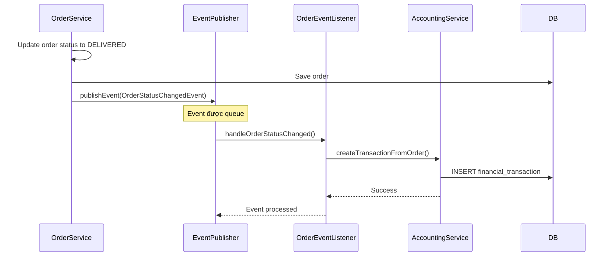

# Phân Tích Design Patterns Được Sử Dụng

## Tổng Quan

Hệ thống thương mại điện tử được xây dựng dựa trên các design patterns phổ biến và best practices trong phát triển phần mềm. Tài liệu này phân tích chi tiết các patterns được áp dụng, lý do lựa chọn, và cách triển khai cụ thể trong hệ thống.

## 1. Repository Pattern (Data Access Layer)

### Mô Tả

Repository Pattern cung cấp một lớp trừu tượng giữa business logic và data access logic. Pattern này đóng gói logic truy xuất dữ liệu và cung cấp interface đơn giản cho các service layer.

### Triển Khai Trong Hệ Thống

```java
@Repository
public interface OrderRepository extends JpaRepository<Order, Long> {
    Optional<Order> findByOrderCode(String orderCode);
    Optional<Order> findByGhnOrderCode(String ghnOrderCode);
    List<Order> findByCustomerId(Long customerId);
    List<Order> findByStatus(OrderStatus status);
    
    @Query("SELECT o FROM Order o WHERE o.createdAt BETWEEN :startDate AND :endDate " +
           "AND o.paymentStatus = com.doan.WEB_TMDT.module.order.entity.PaymentStatus.PAID")
    List<Order> findPaidOrdersBetween(@Param("startDate") LocalDateTime startDate, 
                                      @Param("endDate") LocalDateTime endDate);
}
```

### Lý Do Lựa Chọn


1. **Tách biệt concerns**: Business logic không cần biết chi tiết về cách dữ liệu được lưu trữ hay truy xuất
2. **Dễ dàng testing**: Service layer có thể được test với mock repositories
3. **Tái sử dụng code**: Các query phức tạp được định nghĩa một lần và tái sử dụng nhiều nơi
4. **Maintainability**: Thay đổi database schema chỉ ảnh hưởng đến repository layer
5. **Spring Data JPA**: Framework cung cấp implementation tự động cho các method chuẩn

### Ví Dụ Sử Dụng

```java
@Service
@RequiredArgsConstructor
public class OrderServiceImpl implements OrderService {
    private final OrderRepository orderRepository;
    
    @Override
    public ApiResponse getMyOrders(Long customerId) {
        List<Order> orders = orderRepository.findByCustomerId(customerId);
        // Business logic processing...
        return ApiResponse.success("Danh sách đơn hàng", responses);
    }
}
```

### Lợi Ích Thực Tế

- **Warehouse queries**: Query phức tạp để lấy đơn hàng chưa xuất kho
- **Accounting queries**: Tính toán doanh thu theo khoảng thời gian
- **Custom queries**: Sử dụng @Query annotation cho các truy vấn đặc biệt


## 2. Service Layer Pattern (Business Logic)

### Mô Tả

Service Layer Pattern đóng gói business logic của ứng dụng và cung cấp interface cho presentation layer (controllers). Pattern này đảm bảo business rules được thực thi nhất quán và có thể tái sử dụng.

### Triển Khai Trong Hệ Thống

```java
public interface OrderService {
    ApiResponse createOrderFromCart(Long customerId, CreateOrderRequest request);
    ApiResponse updateOrderStatus(Long orderId, String status);
    ApiResponse cancelOrder(Long orderId, String reason);
    ApiResponse getMyOrders(Long customerId);
}

@Service
@RequiredArgsConstructor
public class OrderServiceImpl implements OrderService {
    private final OrderRepository orderRepository;
    private final CartRepository cartRepository;
    private final PaymentService paymentService;
    private final ShippingService shippingService;
    private final ApplicationEventPublisher eventPublisher;
    
    @Override
    @Transactional
    public ApiResponse createOrderFromCart(Long customerId, CreateOrderRequest request) {
        // 1. Validate customer
        // 2. Validate cart
        // 3. Validate stock
        // 4. Calculate totals
        // 5. Create order
        // 6. Reserve stock
        // 7. Clear cart
        // 8. Return response
    }
}
```

### Lý Do Lựa Chọn


1. **Centralized business logic**: Tất cả business rules được quản lý tập trung
2. **Transaction management**: @Transactional annotation đảm bảo data consistency
3. **Reusability**: Business logic có thể được gọi từ nhiều controllers khác nhau
4. **Testability**: Service layer có thể được unit test độc lập
5. **Separation of concerns**: Controllers chỉ xử lý HTTP, services xử lý business logic

### Các Service Chính Trong Hệ Thống

#### OrderService
- Quản lý vòng đời đơn hàng (tạo, cập nhật, hủy)
- Validate business rules (stock availability, address validation)
- Tích hợp với các services khác (Payment, Shipping, Inventory)

#### InventoryService
- Quản lý nhập/xuất kho
- Tracking serial numbers
- Stock reservation và release

#### ShippingService
- Tích hợp GHN API
- Tính phí vận chuyển
- Tracking đơn hàng

#### AccountingService
- Ghi nhận giao dịch tài chính
- Quản lý công nợ nhà cung cấp
- Tạo báo cáo tài chính

#### PaymentService
- Xử lý thanh toán online (SePay)
- Xác thực webhook
- Quản lý trạng thái thanh toán

### Ví Dụ Business Logic Phức Tạp

```java
@Override
@Transactional
public ApiResponse createOrderFromCart(Long customerId, CreateOrderRequest request) {
    // Validate stock for all items
    for (CartItem cartItem : cart.getItems()) {
        Product product = cartItem.getProduct();
        if (product.getStockQuantity() < cartItem.getQuantity()) {
            return ApiResponse.error("Sản phẩm không đủ số lượng");
        }
    }
    
    // Reserve stock (không trừ stockQuantity ngay)
    for (CartItem cartItem : cart.getItems()) {
        Product product = cartItem.getProduct();
        Long currentReserved = product.getReservedQuantity() != null 
            ? product.getReservedQuantity() : 0L;
        product.setReservedQuantity(currentReserved + cartItem.getQuantity());
    }
    
    // Xác định initial status dựa trên payment method
    OrderStatus initialStatus = "SEPAY".equals(request.getPaymentMethod()) 
        ? OrderStatus.PENDING_PAYMENT 
        : OrderStatus.CONFIRMED;
}
```


## 3. DTO Pattern (Data Transfer Object)

### Mô Tả

DTO Pattern sử dụng các object đơn giản để transfer data giữa các layers hoặc qua network. DTOs không chứa business logic, chỉ chứa data và getters/setters.

### Triển Khai Trong Hệ Thống

```java
@Data
@Builder
@NoArgsConstructor
@AllArgsConstructor
public class OrderResponse {
    private Long orderId;
    private String orderCode;
    private String status;
    private String paymentStatus;
    private String paymentMethod;
    
    // Customer info
    private Long customerId;
    private String customerName;
    private String customerPhone;
    private String customerEmail;
    
    // Address details
    private String province;
    private String district;
    private String ward;
    private String wardName;
    private String address;
    
    // Items and pricing
    private List<OrderItemResponse> items;
    private Double subtotal;
    private Double shippingFee;
    private Double total;
    
    // Timestamps
    private LocalDateTime createdAt;
    private LocalDateTime deliveredAt;
}
```

### Lý Do Lựa Chọn


1. **Decoupling**: Entity classes không bị expose trực tiếp ra ngoài
2. **Security**: Ẩn các trường nhạy cảm (password, internal IDs)
3. **Flexibility**: Response có thể chứa data từ nhiều entities khác nhau
4. **API versioning**: Dễ dàng tạo các version khác nhau của API
5. **Performance**: Chỉ transfer data cần thiết, giảm payload size

### Các Loại DTO Trong Hệ Thống

#### Request DTOs
```java
@Data
public class CreateOrderRequest {
    private String province;
    private String district;
    private String ward;
    private String wardName;
    private String address;
    private String note;
    private String paymentMethod;
    private Double shippingFee;
}
```

#### Response DTOs
```java
@Data
@Builder
public class OrderItemResponse {
    private Long itemId;
    private Long productId;
    private String productName;
    private String productImage;
    private String productSku;
    private Double price;
    private Integer quantity;
    private Double subtotal;
    private String serialNumber;
}
```

### Mapping Entity to DTO

```java
private OrderResponse toOrderResponse(Order order) {
    List<OrderItemResponse> items = order.getItems().stream()
            .map(this::toOrderItemResponse)
            .collect(Collectors.toList());

    Customer customer = order.getCustomer();
    
    return OrderResponse.builder()
            .orderId(order.getId())
            .orderCode(order.getOrderCode())
            .status(order.getStatus().name())
            .customerName(customer.getFullName())
            .items(items)
            .total(order.getTotal())
            .build();
}
```

### Lợi Ích Thực Tế

- **Aggregation**: OrderResponse kết hợp data từ Order, Customer, User, OrderItem
- **Transformation**: Enum values được convert sang String
- **Computed fields**: Available quantity = onHand - reserved - damaged
- **Nested structures**: Order chứa list of OrderItemResponse


## 4. Event-Driven Pattern (Accounting Automation)

### Mô Tả

Event-Driven Pattern cho phép các components giao tiếp với nhau thông qua events thay vì direct method calls. Pattern này giảm coupling giữa các modules và cho phép xử lý bất đồng bộ.

### Triển Khai Trong Hệ Thống

#### Event Definition
```java
public class OrderStatusChangedEvent extends ApplicationEvent {
    private final Order order;
    private final OrderStatus oldStatus;
    private final OrderStatus newStatus;
    
    public OrderStatusChangedEvent(Object source, Order order, 
                                   OrderStatus oldStatus, OrderStatus newStatus) {
        super(source);
        this.order = order;
        this.oldStatus = oldStatus;
        this.newStatus = newStatus;
    }
}
```

#### Event Publisher (trong OrderService)
```java
@Service
@RequiredArgsConstructor
public class OrderServiceImpl implements OrderService {
    private final ApplicationEventPublisher eventPublisher;
    
    private void publishOrderStatusChangeEvent(Order order, 
                                               OrderStatus oldStatus, 
                                               OrderStatus newStatus) {
        try {
            OrderStatusChangedEvent event = new OrderStatusChangedEvent(
                this, order, oldStatus, newStatus);
            eventPublisher.publishEvent(event);
            log.info("Published OrderStatusChangedEvent for order: {}", 
                order.getOrderCode());
        } catch (Exception e) {
            log.error("Failed to publish event", e);
            // Don't fail the order process if event publishing fails
        }
    }
}
```

#### Event Listener (trong Accounting Module)
```java
@Component
@RequiredArgsConstructor
@Slf4j
public class OrderEventListener {
    private final FinancialTransactionService financialTransactionService;

    @TransactionalEventListener
    public void handleOrderStatusChanged(OrderStatusChangedEvent event) {
        Order order = event.getOrder();
        OrderStatus newStatus = event.getNewStatus();
        
        // Tạo giao dịch tài chính khi đơn hàng DELIVERED
        if (newStatus == OrderStatus.DELIVERED) {
            financialTransactionService.createTransactionFromOrder(
                order.getOrderCode());
            log.info("Created financial transactions for order: {}", 
                order.getOrderCode());
        }
        
        // Tạo giao dịch hoàn tiền khi đơn hàng CANCELLED
        if (newStatus == OrderStatus.CANCELLED && 
            order.getPaymentStatus() == PaymentStatus.PAID) {
            financialTransactionService.createRefundTransaction(
                order.getOrderCode(), 
                String.valueOf(order.getTotal()));
        }
    }
}
```

### Lý Do Lựa Chọn


1. **Loose coupling**: Order module không cần biết về Accounting module
2. **Separation of concerns**: Accounting logic tách biệt khỏi order processing
3. **Extensibility**: Dễ dàng thêm listeners mới mà không sửa code cũ
4. **Reliability**: Nếu accounting fails, order process vẫn thành công
5. **Asynchronous processing**: @TransactionalEventListener cho phép xử lý sau khi transaction commit

### Luồng Hoạt Động



### Các Events Trong Hệ Thống

1. **OrderStatusChangedEvent**: Khi trạng thái đơn hàng thay đổi
   - Trigger: Order status update
   - Listeners: AccountingService (ghi nhận doanh thu/hoàn tiền)

2. **PaymentCompletedEvent**: Khi thanh toán hoàn tất
   - Trigger: SePay webhook
   - Listeners: OrderService (update order status), AccountingService (ghi nhận thu)

3. **InventoryExportedEvent**: Khi xuất kho hoàn tất
   - Trigger: Export order completion
   - Listeners: OrderService (update to READY_TO_SHIP)

### Lợi Ích Thực Tế

- **Automatic accounting**: Không cần gọi accounting service manually
- **Audit trail**: Mọi thay đổi quan trọng đều được log
- **Error isolation**: Lỗi trong accounting không ảnh hưởng order flow
- **Future extensibility**: Dễ dàng thêm notifications, analytics, etc.


## 5. Strategy Pattern (Payment Methods)

### Mô Tả

Strategy Pattern định nghĩa một family of algorithms, đóng gói từng algorithm, và làm cho chúng có thể thay thế lẫn nhau. Pattern này cho phép algorithm thay đổi độc lập với clients sử dụng nó.

### Triển Khai Trong Hệ Thống

#### Payment Method Enum
```java
public enum PaymentMethod {
    COD,      // Cash on Delivery
    SEPAY,    // SePay bank transfer
    VNPAY,    // VNPay (future)
    MOMO      // MoMo wallet (future)
}
```

#### Strategy Interface (Implicit)
```java
public interface PaymentService {
    ApiResponse createPayment(CreatePaymentRequest request, Long userId);
    ApiResponse handleWebhook(WebhookRequest request);
    ApiResponse checkPaymentStatus(String paymentCode);
}
```

#### Concrete Strategy: COD Payment
```java
@Override
@Transactional
public ApiResponse createOrderFromCart(Long customerId, CreateOrderRequest request) {
    // ...
    
    if ("COD".equals(request.getPaymentMethod())) {
        // COD strategy: Tự động xác nhận đơn hàng
        initialStatus = OrderStatus.CONFIRMED;
        confirmedTime = LocalDateTime.now();
        
        // Không cần tạo payment record
        // Không cần QR code
        // Thanh toán khi giao hàng
    }
    
    // ...
}
```

#### Concrete Strategy: SePay Payment
```java
@Override
@Transactional
public ApiResponse createPayment(CreatePaymentRequest request, Long userId) {
    // SePay strategy: Tạo QR code và chờ webhook
    
    // 1. Generate payment code
    String paymentCode = generatePaymentCode();
    
    // 2. Get bank account configuration
    BankAccount bankAccount = bankAccountRepository.findByIsDefaultTrue()
        .orElse(null);
    
    // 3. Generate QR Code URL
    String qrCodeUrl = generateSepayQrCode(
        paymentCode, 
        request.getAmount(), 
        bankAccount.getBankCode(),
        bankAccount.getAccountNumber(),
        bankAccount.getAccountName()
    );
    
    // 4. Create payment record
    Payment payment = Payment.builder()
        .paymentCode(paymentCode)
        .method(PaymentMethod.SEPAY)
        .status(PaymentStatus.PENDING)
        .sepayQrCode(qrCodeUrl)
        .build();
    
    return ApiResponse.success("Tạo thanh toán thành công", response);
}

@Override
@Transactional
public ApiResponse handleSepayWebhook(SepayWebhookRequest request) {
    // SePay webhook processing
    String paymentCode = extractPaymentCode(request.getContent());
    Payment payment = paymentRepository.findByPaymentCode(paymentCode)
        .orElseThrow();
    
    // Verify amount
    if (Math.abs(request.getAmount() - payment.getAmount()) < 0.01) {
        payment.setStatus(PaymentStatus.COMPLETED);
        order.setPaymentStatus(PaymentStatus.PAID);
        order.setStatus(OrderStatus.CONFIRMED);
    }
    
    return ApiResponse.success("Webhook processed");
}
```

### Lý Do Lựa Chọn


1. **Flexibility**: Dễ dàng thêm payment methods mới (VNPay, MoMo)
2. **Open/Closed Principle**: Thêm strategy mới không cần sửa code cũ
3. **Runtime selection**: Payment method được chọn lúc runtime
4. **Encapsulation**: Mỗi payment method có logic riêng biệt
5. **Testability**: Có thể test từng payment strategy độc lập

### So Sánh Các Payment Strategies

| Aspect | COD Strategy | SePay Strategy |
|--------|-------------|----------------|
| **Initial Order Status** | CONFIRMED | PENDING_PAYMENT |
| **Payment Record** | Không cần | Cần tạo |
| **QR Code** | Không | Có |
| **Webhook** | Không | Có |
| **Payment Timing** | Khi giao hàng | Trước khi xác nhận |
| **Stock Reservation** | Ngay lập tức | Ngay lập tức |
| **Risk** | Cao (có thể từ chối nhận) | Thấp (đã thanh toán) |

### Luồng Xử Lý Theo Strategy

#### COD Flow
```
Customer checkout 
  → Select COD
  → Order created (CONFIRMED)
  → Stock reserved
  → Warehouse exports
  → Shipper delivers
  → Customer pays cash
  → Order DELIVERED
  → Accounting records revenue
```

#### SePay Flow
```
Customer checkout
  → Select Online Payment
  → Order created (PENDING_PAYMENT)
  → Stock reserved
  → Generate QR code
  → Customer scans & transfers
  → SePay webhook received
  → Verify payment
  → Order → CONFIRMED
  → Accounting records payment
  → Warehouse exports
  → Shipper delivers
  → Order DELIVERED
```

### Extensibility: Thêm Strategy Mới

Để thêm VNPay payment method:

```java
// 1. Add enum value
public enum PaymentMethod {
    COD,
    SEPAY,
    VNPAY  // New
}

// 2. Add VNPay-specific fields to Payment entity
@Entity
public class Payment {
    // ...
    private String vnpayTransactionNo;
    private String vnpayBankCode;
    private String vnpayCardType;
}

// 3. Implement VNPay strategy in PaymentService
@Override
public ApiResponse createVNPayPayment(CreatePaymentRequest request) {
    // VNPay-specific logic
    String vnpayUrl = generateVNPayUrl(request);
    // ...
}

@Override
public ApiResponse handleVNPayCallback(VNPayCallbackRequest request) {
    // VNPay callback processing
    // ...
}
```

### Lợi Ích Thực Tế

- **Multi-payment support**: Hệ thống hỗ trợ nhiều phương thức thanh toán
- **Business flexibility**: Có thể enable/disable payment methods dễ dàng
- **A/B testing**: Test hiệu quả của các payment methods khác nhau
- **Regional support**: Thêm payment methods phù hợp với từng khu vực


## 6. Các Design Patterns Bổ Sung

### 6.1. Dependency Injection Pattern

#### Mô Tả
Spring Framework sử dụng Dependency Injection để quản lý dependencies giữa các components.

#### Triển Khai
```java
@Service
@RequiredArgsConstructor  // Lombok generates constructor
public class OrderServiceImpl implements OrderService {
    // Dependencies được inject qua constructor
    private final OrderRepository orderRepository;
    private final CartRepository cartRepository;
    private final PaymentService paymentService;
    private final ShippingService shippingService;
    private final ApplicationEventPublisher eventPublisher;
}
```

#### Lợi Ích
- **Loose coupling**: Components không tạo dependencies trực tiếp
- **Testability**: Dễ dàng inject mock objects trong tests
- **Configuration**: Dependencies được configure tập trung
- **Lifecycle management**: Spring quản lý object lifecycle

### 6.2. Builder Pattern

#### Mô Tả
Builder Pattern tách biệt construction của complex object khỏi representation của nó.

#### Triển Khai
```java
@Data
@Builder
public class OrderResponse {
    private Long orderId;
    private String orderCode;
    private String status;
    // ... many fields
}

// Usage
OrderResponse response = OrderResponse.builder()
    .orderId(order.getId())
    .orderCode(order.getOrderCode())
    .status(order.getStatus().name())
    .customerName(customer.getFullName())
    .items(items)
    .total(order.getTotal())
    .build();
```

#### Lợi Ích
- **Readability**: Code dễ đọc và maintain
- **Immutability**: Objects có thể được tạo immutable
- **Optional parameters**: Không cần nhiều constructors
- **Validation**: Có thể validate trong build() method

### 6.3. Facade Pattern

#### Mô Tả
Facade Pattern cung cấp unified interface cho một tập hợp interfaces trong subsystem.

#### Triển Khai
```java
@Service
@RequiredArgsConstructor
public class OrderServiceImpl implements OrderService {
    // OrderService acts as a facade
    private final OrderRepository orderRepository;
    private final CartRepository cartRepository;
    private final PaymentService paymentService;
    private final ShippingService shippingService;
    private final InventoryService inventoryService;
    
    @Override
    public ApiResponse createOrderFromCart(Long customerId, 
                                          CreateOrderRequest request) {
        // Facade coordinates multiple subsystems
        Customer customer = customerRepository.findById(customerId);
        Cart cart = cartRepository.findByCustomerId(customerId);
        inventoryService.checkStockAvailability(cart.getItems());
        inventoryService.reserveStock(cart.getItems());
        Order order = createOrder(customer, cart, request);
        if (isOnlinePayment) {
            paymentService.createPayment(order);
        }
        return ApiResponse.success(order);
    }
}
```

#### Lợi Ích
- **Simplified interface**: Client chỉ cần gọi một method
- **Reduced coupling**: Client không cần biết về subsystems
- **Layered architecture**: Clear separation between layers

### 6.4. Template Method Pattern (Implicit)

#### Mô Tả
Template Method định nghĩa skeleton của algorithm, để subclasses override các bước cụ thể.

#### Triển Khai (trong Spring Data JPA)
```java
@Repository
public interface OrderRepository extends JpaRepository<Order, Long> {
    // JpaRepository provides template methods:
    // - save()
    // - findById()
    // - findAll()
    // - delete()
    
    // Custom query methods
    List<Order> findByCustomerId(Long customerId);
}
```

#### Lợi Ích
- **Code reuse**: Common operations được implement một lần
- **Consistency**: Tất cả repositories có cùng interface
- **Extensibility**: Có thể override hoặc thêm methods mới

### 6.5. Observer Pattern (via Spring Events)

#### Mô Tả
Observer Pattern định nghĩa one-to-many dependency giữa objects.

#### Triển Khai
```java
// Subject
@Service
public class OrderServiceImpl {
    private final ApplicationEventPublisher eventPublisher;
    
    public void updateOrderStatus(Order order, OrderStatus newStatus) {
        order.setStatus(newStatus);
        orderRepository.save(order);
        
        // Notify observers
        eventPublisher.publishEvent(
            new OrderStatusChangedEvent(this, order, oldStatus, newStatus)
        );
    }
}

// Observer
@Component
public class OrderEventListener {
    @EventListener
    public void handleOrderStatusChanged(OrderStatusChangedEvent event) {
        // React to status change
    }
}
```

#### Lợi Ích
- **Decoupling**: Subject không cần biết về observers
- **Dynamic subscription**: Observers có thể subscribe/unsubscribe runtime
- **Broadcast**: Một event có thể có nhiều listeners


## 7. Tổng Kết và Đánh Giá

### 7.1. Bảng Tổng Hợp Design Patterns

| Pattern | Module | Mục Đích | Lợi Ích Chính |
|---------|--------|----------|---------------|
| **Repository** | Data Access | Trừu tượng hóa data access | Tách biệt business logic và database |
| **Service Layer** | Business Logic | Đóng gói business rules | Tái sử dụng, transaction management |
| **DTO** | Data Transfer | Transfer data giữa layers | Security, decoupling, flexibility |
| **Event-Driven** | Accounting | Loose coupling giữa modules | Extensibility, reliability |
| **Strategy** | Payment | Multiple payment methods | Flexibility, open/closed principle |
| **Dependency Injection** | All | Quản lý dependencies | Testability, loose coupling |
| **Builder** | DTOs | Construct complex objects | Readability, immutability |
| **Facade** | Services | Simplified interface | Reduced complexity |
| **Template Method** | Repositories | Reusable algorithms | Code reuse, consistency |
| **Observer** | Events | React to state changes | Decoupling, broadcast |

### 7.2. Kiến Trúc Tổng Thể

```
┌─────────────────────────────────────────────────────────────┐
│                     Presentation Layer                       │
│                    (Controllers + DTOs)                      │
│                         Facade                               │
└─────────────────────────────────────────────────────────────┘
                              ↓
┌─────────────────────────────────────────────────────────────┐
│                     Business Logic Layer                     │
│                  (Services + Strategy Pattern)               │
│              Dependency Injection + Events                   │
└─────────────────────────────────────────────────────────────┘
                              ↓
┌─────────────────────────────────────────────────────────────┐
│                     Data Access Layer                        │
│              (Repositories + Template Method)                │
└─────────────────────────────────────────────────────────────┘
                              ↓
┌─────────────────────────────────────────────────────────────┐
│                         Database                             │
│                      (MySQL + JPA)                           │
└─────────────────────────────────────────────────────────────┘

         ┌──────────────────────────────────┐
         │      Event Bus (Observer)        │
         │  OrderEventListener              │
         │  PaymentEventListener            │
         └──────────────────────────────────┘
```

### 7.3. Điểm Mạnh Của Thiết Kế

1. **Maintainability**: Code được tổ chức rõ ràng theo layers và patterns
2. **Testability**: Mỗi component có thể test độc lập
3. **Scalability**: Dễ dàng thêm features mới mà không ảnh hưởng code cũ
4. **Reusability**: Business logic được tái sử dụng qua nhiều endpoints
5. **Separation of Concerns**: Mỗi layer có responsibility rõ ràng
6. **Loose Coupling**: Components giao tiếp qua interfaces và events
7. **Extensibility**: Dễ dàng thêm payment methods, shipping providers, etc.

### 7.4. Hạn Chế và Cải Tiến

#### Hạn Chế Hiện Tại

1. **Strategy Pattern chưa hoàn chỉnh**: Payment strategies được implement inline thay vì separate classes
2. **Thiếu Caching**: Không có caching layer cho frequently accessed data
3. **Error Handling**: Chưa có centralized error handling strategy
4. **Validation**: Validation logic nằm rải rác trong services

#### Đề Xuất Cải Tiến

1. **Implement Strategy Pattern đầy đủ**:
```java
public interface PaymentStrategy {
    PaymentResponse createPayment(Order order);
    void handleCallback(CallbackRequest request);
}

@Component("COD")
public class CODPaymentStrategy implements PaymentStrategy { }

@Component("SEPAY")
public class SepayPaymentStrategy implements PaymentStrategy { }

@Service
public class PaymentService {
    private final Map<String, PaymentStrategy> strategies;
    
    public PaymentResponse processPayment(Order order, String method) {
        return strategies.get(method).createPayment(order);
    }
}
```

2. **Thêm Caching Layer**:
```java
@Service
public class ProductService {
    @Cacheable(value = "products", key = "#id")
    public Product getProductById(Long id) {
        return productRepository.findById(id);
    }
}
```

3. **Centralized Validation**:
```java
@Component
public class OrderValidator {
    public void validateCreateOrder(CreateOrderRequest request) {
        // Centralized validation logic
    }
}
```

4. **Circuit Breaker Pattern** cho external APIs:
```java
@Service
public class ShippingService {
    @CircuitBreaker(name = "ghn", fallbackMethod = "fallbackCreateOrder")
    public GHNOrderResponse createGHNOrder(Order order) {
        // Call GHN API
    }
    
    public GHNOrderResponse fallbackCreateOrder(Order order, Exception e) {
        // Fallback logic
    }
}
```

### 7.5. Kết Luận

Hệ thống được thiết kế dựa trên các design patterns proven và best practices trong software engineering. Việc áp dụng đúng các patterns giúp:

- **Code quality**: Dễ đọc, dễ maintain, dễ test
- **Team collaboration**: Developers dễ hiểu và làm việc với code
- **Business agility**: Nhanh chóng adapt với requirements mới
- **Technical debt**: Giảm thiểu technical debt trong tương lai

Các patterns được chọn phù hợp với:
- **Domain**: E-commerce với nhiều business rules phức tạp
- **Scale**: Medium-scale application với potential to grow
- **Team**: Development team familiar với Spring Boot ecosystem
- **Timeline**: Balance giữa quality và time-to-market

