# Design Document - Hệ Thống Thương Mại Điện Tử

## Overview

Tài liệu này mô tả thiết kế chi tiết của hệ thống thương mại điện tử bao gồm:
- Kịch bản chuẩn và ngoại lệ cho từng luồng nghiệp vụ
- Sơ đồ thực thể quan hệ (ERD)
- Sơ đồ tuần tự (Sequence Diagrams) cho các luồng chính

Hệ thống được xây dựng với kiến trúc phân tầng (Layered Architecture) sử dụng Spring Boot cho backend và Next.js cho frontend.

## Architecture

### High-Level Architecture

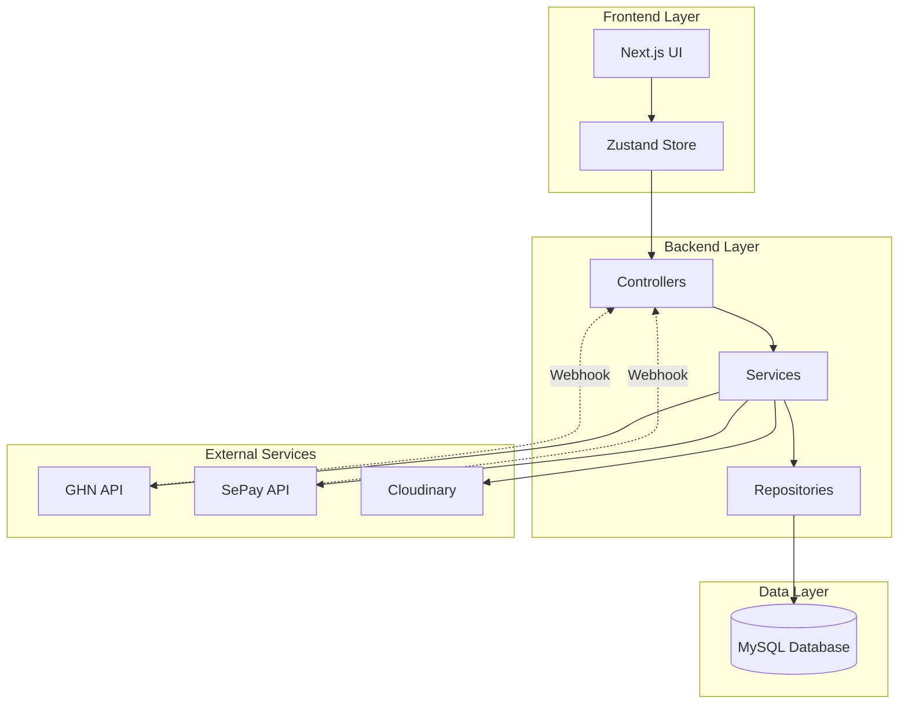
```mermaid
graph TB
    subgraph "Frontend Layer"
        UI[Next.js UI]
        Store[Zustand Store]
    end
    
    subgraph "Backend Layer"
        Controller[Controllers]
        Service[Services]
        Repository[Repositories]
    end
    
    subgraph "External Services"
        GHN[GHN API]
        SePay[SePay API]
        Cloudinary[Cloudinary]
    end
    
    subgraph "Data Layer"
        MySQL[(MySQL Database)]
    end
    
    UI --> Store
    Store --> Controller
    Controller --> Service
    Service --> Repository
    Repository --> MySQL
    Service --> GHN
    Service --> SePay
    Service --> Cloudinary
    GHN -.Webhook.-> Controller
    SePay -.Webhook.-> Controller
```

### Technology Stack

- **Backend**: Spring Boot 3.x, Java 17
- **Frontend**: Next.js 14, React, TypeScript
- **Database**: MySQL 8.0
- **Authentication**: JWT
- **File Storage**: Cloudinary
- **Payment**: SePay
- **Shipping**: GHN (Giao Hàng Nhanh)

## Components and Interfaces

### Module Structure


```
com.doan.WEB_TMDT
├── module
│   ├── auth          # Xác thực & phân quyền
│   ├── product       # Quản lý sản phẩm
│   ├── cart          # Giỏ hàng
│   ├── order         # Đơn hàng
│   ├── payment       # Thanh toán
│   ├── inventory     # Quản lý kho
│   ├── shipping      # Vận chuyển
│   ├── accounting    # Kế toán
│   └── webhook       # Webhook handlers
├── security          # JWT & Authentication
├── config            # Configuration classes
└── common            # Shared utilities
```

### Key Interfaces

#### OrderService
```java
public interface OrderService {
    OrderResponse createOrder(OrderRequest request);
    OrderResponse updateOrderStatus(Long orderId, OrderStatus newStatus);
    List<OrderResponse> getOrdersByStatus(OrderStatus status);
    OrderResponse getOrderById(Long orderId);
    void cancelOrder(Long orderId, String reason);
}
```

#### InventoryService
```java
public interface InventoryService {
    ExportOrderResponse createExportOrder(ExportOrderRequest request);
    void completeExportOrder(Long exportOrderId);
    ImportOrderResponse createImportOrder(ImportOrderRequest request);
    InventoryStockResponse getStockByProduct(Long productId);
    void reserveStock(Long productId, Integer quantity);
    void releaseStock(Long productId, Integer quantity);
}
```

#### ShippingService
```java
public interface ShippingService {
    GHNOrderResponse createGHNOrder(Long orderId);
    void updateShippingStatus(String ghnOrderCode, String status);
    GHNTrackingResponse getTrackingInfo(String ghnOrderCode);
}
```

#### AccountingService
```java
public interface AccountingService {
    void recordRevenue(Long orderId);
    void recordPayment(Long paymentId);
    void recordSupplierPayable(Long purchaseOrderId);
    void recordSupplierPayment(Long paymentId);
    FinancialReportResponse generateReport(LocalDate startDate, LocalDate endDate);
}
```

## Data Models

### Core Entities

#### Order Entity
```java
@Entity
@Table(name = "orders")
public class Order {
    @Id
    @GeneratedValue(strategy = GenerationType.IDENTITY)
    private Long id;
    
    @Column(unique = true, nullable = false)
    private String orderCode;
    
    @ManyToOne
    @JoinColumn(name = "customer_id")
    private Customer customer;
    
    @Enumerated(EnumType.STRING)
    private OrderStatus status;
    
    @Enumerated(EnumType.STRING)
    private PaymentStatus paymentStatus;
    
    private String paymentMethod;
    private Double total;
    private Double shippingFee;
    private String shippingAddress;
    
    @Column(name = "ghn_order_code")
    private String ghnOrderCode;
    
    @OneToMany(mappedBy = "order", cascade = CascadeType.ALL)
    private List<OrderItem> items;
    
    private LocalDateTime createdAt;
    private LocalDateTime confirmedAt;
    private LocalDateTime deliveredAt;
}
```


#### Inventory Entities
```java
@Entity
@Table(name = "warehouse_products")
public class WarehouseProduct {
    @Id
    @GeneratedValue(strategy = GenerationType.IDENTITY)
    private Long id;
    
    @Column(unique = true)
    private String sku;
    
    private String internalName;
    
    @ManyToOne
    @JoinColumn(name = "supplier_id")
    private Supplier supplier;
    
    @OneToOne(mappedBy = "warehouseProduct")
    private InventoryStock stock;
}

@Entity
@Table(name = "inventory_stock")
public class InventoryStock {
    @Id
    @GeneratedValue(strategy = GenerationType.IDENTITY)
    private Long id;
    
    @OneToOne
    @JoinColumn(name = "warehouse_product_id")
    private WarehouseProduct warehouseProduct;
    
    private Long onHand;      // Tổng số lượng
    private Long reserved;    // Số lượng đã đặt trước
    private Long damaged;     // Số lượng hỏng
    
    // available = onHand - reserved - damaged
    public Long getAvailable() {
        return onHand - reserved - damaged;
    }
}

@Entity
@Table(name = "export_orders")
public class ExportOrder {
    @Id
    @GeneratedValue(strategy = GenerationType.IDENTITY)
    private Long id;
    
    @Column(unique = true)
    private String exportCode;
    
    @Enumerated(EnumType.STRING)
    private ExportStatus status;
    
    @ManyToOne
    @JoinColumn(name = "order_id")
    private Order order;
    
    @OneToMany(mappedBy = "exportOrder")
    private List<ExportOrderItem> items;
    
    private String createdBy;
    private LocalDateTime exportDate;
}
```

#### Accounting Entities
```java
@Entity
@Table(name = "financial_transaction")
public class FinancialTransaction {
    @Id
    @GeneratedValue(strategy = GenerationType.IDENTITY)
    private Long id;
    
    private String transactionCode;
    private String orderId;
    
    @Enumerated(EnumType.STRING)
    private TransactionType type; // REVENUE, EXPENSE, REFUND
    
    @Enumerated(EnumType.STRING)
    private TransactionCategory category;
    
    private BigDecimal amount;
    private String description;
    private LocalDateTime transactionDate;
}

@Entity
@Table(name = "supplier_payables")
public class SupplierPayable {
    @Id
    @GeneratedValue(strategy = GenerationType.IDENTITY)
    private Long id;
    
    private String payableCode;
    
    @ManyToOne
    @JoinColumn(name = "supplier_id")
    private Supplier supplier;
    
    @ManyToOne
    @JoinColumn(name = "purchase_order_id")
    private PurchaseOrder purchaseOrder;
    
    private BigDecimal totalAmount;
    private BigDecimal paidAmount;
    private BigDecimal remainingAmount;
    
    @Enumerated(EnumType.STRING)
    private PayableStatus status;
    
    private LocalDate invoiceDate;
    private LocalDate dueDate;
}
```


## Luồng 1: Quản Lý Đơn Hàng (Order Management)

### Sơ Đồ Tuần Tự Chi Tiết - Luồng Đặt Hàng

#### 1.0.1. Sơ Đồ Tổng Quan - Customer Checkout Flow


```mermaid
sequenceDiagram
    actor Customer
    participant UI as Frontend
    participant CartCtrl as CartController
    participant OrderCtrl as OrderController
    participant OrderSvc as OrderService
    participant PaymentSvc as PaymentService
    participant InvSvc as InventoryService
    participant SePay as SePay API
    participant DB as Database
    
    Note over Customer,DB: Phase 1: Browse & Add to Cart
    Customer->>UI: Browse products
    Customer->>UI: Add product to cart
    UI->>CartCtrl: POST /api/cart/add
    activate CartCtrl
    CartCtrl->>DB: INSERT/UPDATE cart_items
    CartCtrl-->>UI: Cart updated
    deactivate CartCtrl
    
    Note over Customer,DB: Phase 2: Checkout & Address Validation
    Customer->>UI: Go to checkout
    UI->>UI: Display cart summary
    Customer->>UI: Enter shipping address
    Note over UI: Province, District, Ward,<br/>Detailed Address
    
    Customer->>UI: Select payment method
    Note over UI: COD or Online Payment
    
    Customer->>UI: Click "Place Order"
    
    alt Payment Method = COD
        UI->>OrderCtrl: POST /api/orders/create (COD)
        activate OrderCtrl
        OrderCtrl->>OrderSvc: createOrder(request)
        activate OrderSvc
        
        OrderSvc->>OrderSvc: validateAddress()
        OrderSvc->>OrderSvc: validateCartItems()
        
        OrderSvc->>InvSvc: checkStockAvailability()
        activate InvSvc
        InvSvc->>DB: SELECT inventory_stock
        
        alt Insufficient Stock
            InvSvc-->>OrderSvc: InsufficientStockException
            OrderSvc-->>OrderCtrl: Error Response
            OrderCtrl-->>UI: 400 Bad Request
            UI-->>Customer: "Sản phẩm X không đủ hàng"
        else Stock Available
            InvSvc-->>OrderSvc: Stock OK
            deactivate InvSvc
            
            OrderSvc->>InvSvc: reserveStock()
            activate InvSvc
            InvSvc->>DB: UPDATE inventory_stock<br/>(reserved += quantity)
            deactivate InvSvc
            
            OrderSvc->>DB: BEGIN TRANSACTION
            OrderSvc->>DB: INSERT orders<br/>(status=CONFIRMED, payment_method=COD)
            OrderSvc->>DB: INSERT order_items
            OrderSvc->>DB: DELETE cart_items
            OrderSvc->>DB: COMMIT
            
            OrderSvc-->>OrderCtrl: OrderResponse
            deactivate OrderSvc
            OrderCtrl-->>UI: 200 OK with order
            deactivate OrderCtrl
            UI-->>Customer: "Đặt hàng thành công"
        end
        
    else Payment Method = Online
        UI->>OrderCtrl: POST /api/orders/create (Online)
        activate OrderCtrl
        OrderCtrl->>OrderSvc: createOrder(request)
        activate OrderSvc
        
        OrderSvc->>OrderSvc: validateAddress()
        OrderSvc->>OrderSvc: validateCartItems()
        
        OrderSvc->>InvSvc: checkStockAvailability()
        activate InvSvc
        InvSvc->>DB: SELECT inventory_stock
        
        alt Insufficient Stock
            InvSvc-->>OrderSvc: InsufficientStockException
            OrderSvc-->>OrderCtrl: Error Response
            OrderCtrl-->>UI: 400 Bad Request
            UI-->>Customer: "Sản phẩm X không đủ hàng"
        else Stock Available
            InvSvc-->>OrderSvc: Stock OK
            deactivate InvSvc
            
            OrderSvc->>InvSvc: reserveStock()
            activate InvSvc
            InvSvc->>DB: UPDATE inventory_stock<br/>(reserved += quantity)
            deactivate InvSvc
            
            OrderSvc->>DB: BEGIN TRANSACTION
            OrderSvc->>DB: INSERT orders<br/>(status=PENDING_PAYMENT, payment_method=ONLINE)
            OrderSvc->>DB: INSERT order_items
            OrderSvc->>DB: COMMIT
            
            OrderSvc->>PaymentSvc: createPayment(orderId)
            activate PaymentSvc
            
            PaymentSvc->>DB: INSERT payments<br/>(status=PENDING, expired_at=now+15min)
            
            PaymentSvc->>SePay: Generate QR code
            activate SePay
            SePay-->>PaymentSvc: QR code URL
            deactivate SePay
            
            PaymentSvc->>DB: UPDATE payments SET qr_code
            PaymentSvc-->>OrderSvc: PaymentResponse
            deactivate PaymentSvc
            
            OrderSvc-->>OrderCtrl: OrderResponse with payment
            deactivate OrderSvc
            OrderCtrl-->>UI: 200 OK
            deactivate OrderCtrl
            
            UI-->>Customer: Display QR code
            
            Note over Customer,SePay: Customer scans QR and transfers money
            Customer->>SePay: Bank transfer
            
            Note over SePay,DB: Webhook processing (async)
            SePay->>OrderCtrl: POST /api/webhook/sepay
            activate OrderCtrl
            OrderCtrl->>PaymentSvc: handleWebhook()
            activate PaymentSvc
            
            PaymentSvc->>PaymentSvc: verifySignature()
            PaymentSvc->>DB: SELECT payment by code
            
            alt Amount Match
                PaymentSvc->>DB: UPDATE payments (status=COMPLETED)
                PaymentSvc->>DB: UPDATE orders<br/>(status=CONFIRMED, payment_status=PAID)
                PaymentSvc->>DB: DELETE cart_items
                PaymentSvc->>DB: INSERT financial_transaction
                PaymentSvc-->>OrderCtrl: Success
            else Amount Mismatch
                PaymentSvc->>DB: UPDATE payments (status=FAILED)
                PaymentSvc->>PaymentSvc: alertAccountant()
                PaymentSvc-->>OrderCtrl: Success (but flagged)
            end
            
            deactivate PaymentSvc
            OrderCtrl-->>SePay: 200 OK
            deactivate OrderCtrl
            
            Note over UI,Customer: Frontend polls payment status
            UI->>OrderCtrl: GET /api/payments/{id}/status
            OrderCtrl-->>UI: Payment COMPLETED
            UI-->>Customer: "Thanh toán thành công"
        end
    end
```

#### 1.0.2. Sơ Đồ Chi Tiết - Address Validation

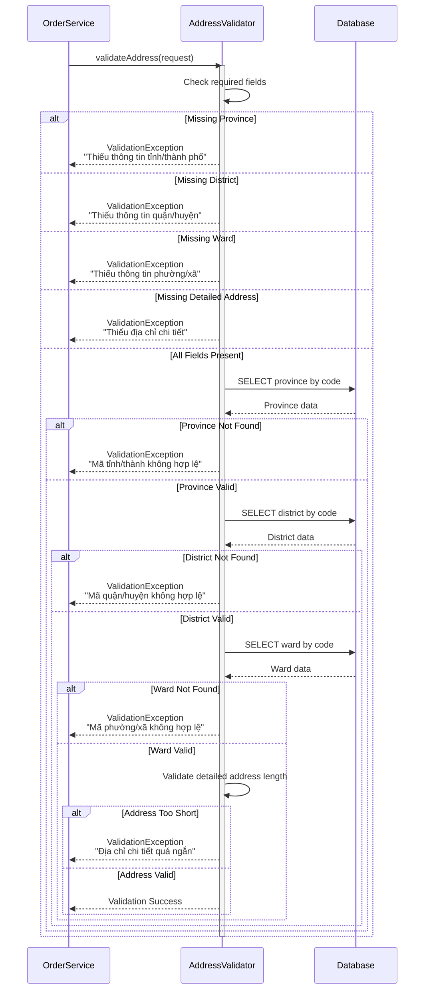
```mermaid
sequenceDiagram
    participant OrderSvc as OrderService
    participant Validator as AddressValidator
    participant DB as Database
    
    OrderSvc->>Validator: validateAddress(request)
    activate Validator
    
    Validator->>Validator: Check required fields
    
    alt Missing Province
        Validator-->>OrderSvc: ValidationException<br/>"Thiếu thông tin tỉnh/thành phố"
    else Missing District
        Validator-->>OrderSvc: ValidationException<br/>"Thiếu thông tin quận/huyện"
    else Missing Ward
        Validator-->>OrderSvc: ValidationException<br/>"Thiếu thông tin phường/xã"
    else Missing Detailed Address
        Validator-->>OrderSvc: ValidationException<br/>"Thiếu địa chỉ chi tiết"
    else All Fields Present
        Validator->>DB: SELECT province by code
        DB-->>Validator: Province data
        
        alt Province Not Found
            Validator-->>OrderSvc: ValidationException<br/>"Mã tỉnh/thành không hợp lệ"
        else Province Valid
            Validator->>DB: SELECT district by code
            DB-->>Validator: District data
            
            alt District Not Found
                Validator-->>OrderSvc: ValidationException<br/>"Mã quận/huyện không hợp lệ"
            else District Valid
                Validator->>DB: SELECT ward by code
                DB-->>Validator: Ward data
                
                alt Ward Not Found
                    Validator-->>OrderSvc: ValidationException<br/>"Mã phường/xã không hợp lệ"
                else Ward Valid
                    Validator->>Validator: Validate detailed address length
                    
                    alt Address Too Short
                        Validator-->>OrderSvc: ValidationException<br/>"Địa chỉ chi tiết quá ngắn"
                    else Address Valid
                        Validator-->>OrderSvc: Validation Success
                    end
                end
            end
        end
    end
    
    deactivate Validator
```

#### 1.0.3. Sơ Đồ Chi Tiết - Stock Validation & Reservation

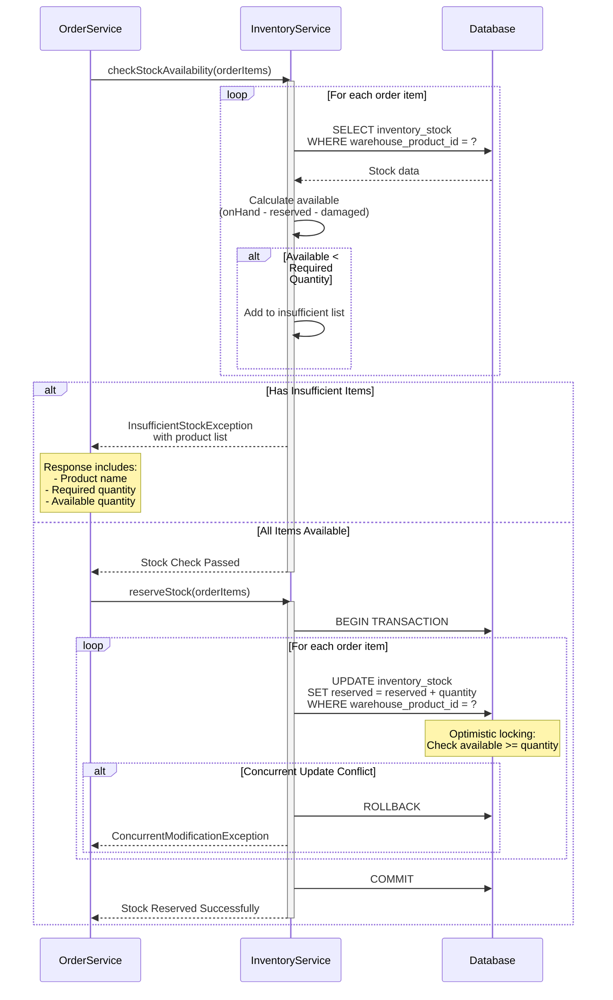
```mermaid
sequenceDiagram
    participant OrderSvc as OrderService
    participant InvSvc as InventoryService
    participant DB as Database
    
    OrderSvc->>InvSvc: checkStockAvailability(orderItems)
    activate InvSvc
    
    loop For each order item
        InvSvc->>DB: SELECT inventory_stock<br/>WHERE warehouse_product_id = ?
        DB-->>InvSvc: Stock data
        
        InvSvc->>InvSvc: Calculate available<br/>(onHand - reserved - damaged)
        
        alt Available < Required Quantity
            InvSvc->>InvSvc: Add to insufficient list
        end
    end
    
    alt Has Insufficient Items
        InvSvc-->>OrderSvc: InsufficientStockException<br/>with product list
        Note over OrderSvc: Response includes:<br/>- Product name<br/>- Required quantity<br/>- Available quantity
    else All Items Available
        InvSvc-->>OrderSvc: Stock Check Passed
        deactivate InvSvc
        
        OrderSvc->>InvSvc: reserveStock(orderItems)
        activate InvSvc
        
        InvSvc->>DB: BEGIN TRANSACTION
        
        loop For each order item
            InvSvc->>DB: UPDATE inventory_stock<br/>SET reserved = reserved + quantity<br/>WHERE warehouse_product_id = ?
            
            Note over DB: Optimistic locking:<br/>Check available >= quantity
            
            alt Concurrent Update Conflict
                InvSvc->>DB: ROLLBACK
                InvSvc-->>OrderSvc: ConcurrentModificationException
            end
        end
        
        InvSvc->>DB: COMMIT
        InvSvc-->>OrderSvc: Stock Reserved Successfully
        deactivate InvSvc
    end
```

#### 1.0.4. Sơ Đồ Chi Tiết - Payment Timeout Handling

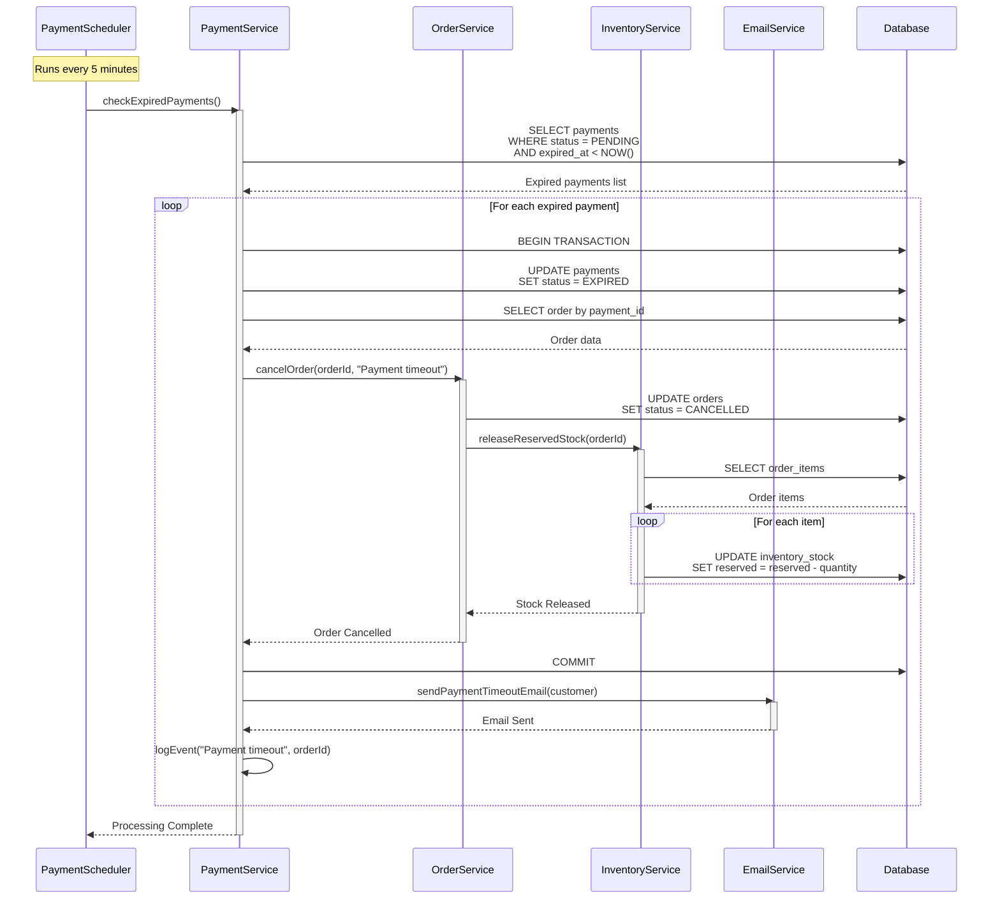
```mermaid
sequenceDiagram
    participant Scheduler as PaymentScheduler
    participant PaymentSvc as PaymentService
    participant OrderSvc as OrderService
    participant InvSvc as InventoryService
    participant EmailSvc as EmailService
    participant DB as Database
    
    Note over Scheduler: Runs every 5 minutes
    
    Scheduler->>PaymentSvc: checkExpiredPayments()
    activate PaymentSvc
    
    PaymentSvc->>DB: SELECT payments<br/>WHERE status = PENDING<br/>AND expired_at < NOW()
    DB-->>PaymentSvc: Expired payments list
    
    loop For each expired payment
        PaymentSvc->>DB: BEGIN TRANSACTION
        
        PaymentSvc->>DB: UPDATE payments<br/>SET status = EXPIRED
        
        PaymentSvc->>DB: SELECT order by payment_id
        DB-->>PaymentSvc: Order data
        
        PaymentSvc->>OrderSvc: cancelOrder(orderId, "Payment timeout")
        activate OrderSvc
        
        OrderSvc->>DB: UPDATE orders<br/>SET status = CANCELLED
        
        OrderSvc->>InvSvc: releaseReservedStock(orderId)
        activate InvSvc
        
        InvSvc->>DB: SELECT order_items
        DB-->>InvSvc: Order items
        
        loop For each item
            InvSvc->>DB: UPDATE inventory_stock<br/>SET reserved = reserved - quantity
        end
        
        InvSvc-->>OrderSvc: Stock Released
        deactivate InvSvc
        
        OrderSvc-->>PaymentSvc: Order Cancelled
        deactivate OrderSvc
        
        PaymentSvc->>DB: COMMIT
        
        PaymentSvc->>EmailSvc: sendPaymentTimeoutEmail(customer)
        activate EmailSvc
        EmailSvc-->>PaymentSvc: Email Sent
        deactivate EmailSvc
        
        PaymentSvc->>PaymentSvc: logEvent("Payment timeout", orderId)
    end
    
    PaymentSvc-->>Scheduler: Processing Complete
    deactivate PaymentSvc
```

#### 1.0.5. Sơ Đồ Chi Tiết - Error Handling Scenarios


```mermaid
sequenceDiagram
    actor Customer
    participant UI as Frontend
    participant OrderCtrl as OrderController
    participant OrderSvc as OrderService
    participant DB as Database
    
    Note over Customer,DB: Scenario 1: Validation Errors
    
    Customer->>UI: Submit order with invalid data
    UI->>OrderCtrl: POST /api/orders/create
    activate OrderCtrl
    
    OrderCtrl->>OrderSvc: createOrder(request)
    activate OrderSvc
    
    alt Missing Required Field
        OrderSvc->>OrderSvc: validate()
        OrderSvc-->>OrderCtrl: ValidationException<br/>"Thiếu trường bắt buộc: X"
        OrderCtrl-->>UI: 400 Bad Request<br/>{"field": "X", "message": "..."}
        UI-->>Customer: Highlight field X in red
        
    else Invalid Address
        OrderSvc->>OrderSvc: validateAddress()
        OrderSvc-->>OrderCtrl: ValidationException<br/>"Địa chỉ không hợp lệ"
        OrderCtrl-->>UI: 400 Bad Request
        UI-->>Customer: Show address error
        
    else Empty Cart
        OrderSvc->>DB: SELECT cart_items
        DB-->>OrderSvc: Empty result
        OrderSvc-->>OrderSvc: validate()
        OrderSvc-->>OrderCtrl: ValidationException<br/>"Giỏ hàng trống"
        OrderCtrl-->>UI: 400 Bad Request
        UI-->>Customer: "Vui lòng thêm sản phẩm vào giỏ"
        
    else Invalid Product Price
        OrderSvc->>DB: SELECT products
        DB-->>OrderSvc: Product data
        OrderSvc->>OrderSvc: validatePrices()
        OrderSvc-->>OrderCtrl: ValidationException<br/>"Giá sản phẩm đã thay đổi"
        OrderCtrl-->>UI: 400 Bad Request
        UI-->>Customer: "Giá đã thay đổi, vui lòng kiểm tra lại"
    end
    
    deactivate OrderSvc
    deactivate OrderCtrl
    
    Note over Customer,DB: Scenario 2: Database Errors
    
    Customer->>UI: Submit valid order
    UI->>OrderCtrl: POST /api/orders/create
    activate OrderCtrl
    
    OrderCtrl->>OrderSvc: createOrder(request)
    activate OrderSvc
    
    OrderSvc->>DB: BEGIN TRANSACTION
    OrderSvc->>DB: INSERT orders
    
    alt Database Connection Lost
        DB-->>OrderSvc: SQLException
        OrderSvc->>DB: ROLLBACK
        OrderSvc->>OrderSvc: logError()
        OrderSvc-->>OrderCtrl: DatabaseException<br/>"Lỗi hệ thống"
        OrderCtrl-->>UI: 500 Internal Server Error
        UI-->>Customer: "Lỗi hệ thống, vui lòng thử lại"
        
    else Deadlock Detected
        DB-->>OrderSvc: DeadlockException
        OrderSvc->>DB: ROLLBACK
        OrderSvc->>OrderSvc: retry(3 times)
        
        alt Retry Success
            OrderSvc->>DB: INSERT orders (retry)
            OrderSvc->>DB: COMMIT
            OrderSvc-->>OrderCtrl: OrderResponse
            OrderCtrl-->>UI: 200 OK
            UI-->>Customer: "Đặt hàng thành công"
        else Retry Failed
            OrderSvc-->>OrderCtrl: DatabaseException
            OrderCtrl-->>UI: 500 Internal Server Error
            UI-->>Customer: "Lỗi hệ thống, vui lòng thử lại"
        end
    end
    
    deactivate OrderSvc
    deactivate OrderCtrl
    
    Note over Customer,DB: Scenario 3: External Service Errors
    
    Customer->>UI: Submit order with online payment
    UI->>OrderCtrl: POST /api/orders/create
    activate OrderCtrl
    
    OrderCtrl->>OrderSvc: createOrder(request)
    activate OrderSvc
    
    OrderSvc->>DB: INSERT orders
    OrderSvc->>DB: INSERT payments
    
    OrderSvc->>OrderSvc: generateQRCode()
    
    alt SePay API Timeout
        OrderSvc->>OrderSvc: callSePayAPI()
        Note over OrderSvc: Timeout after 10s
        OrderSvc->>OrderSvc: logError()
        OrderSvc-->>OrderCtrl: ExternalServiceException<br/>"Không thể tạo QR code"
        OrderCtrl-->>UI: 503 Service Unavailable
        UI-->>Customer: "Dịch vụ thanh toán tạm thời không khả dụng"
        
    else SePay API Error
        OrderSvc->>OrderSvc: callSePayAPI()
        OrderSvc-->>OrderCtrl: ExternalServiceException<br/>"Lỗi từ SePay"
        OrderCtrl-->>UI: 502 Bad Gateway
        UI-->>Customer: "Lỗi thanh toán, vui lòng thử lại"
    end
    
    deactivate OrderSvc
    deactivate OrderCtrl
```

### 1.1. Kịch Bản Chuẩn (Happy Path)

**Mô tả**: Khách hàng đặt hàng thành công và đơn hàng được xử lý qua các trạng thái

**Các bước**:
1. Khách hàng browse sản phẩm và thêm vào giỏ hàng
2. Khách hàng vào trang checkout, nhập thông tin giao hàng (tỉnh/quận/phường/địa chỉ)
3. Khách hàng chọn phương thức thanh toán (COD hoặc Online)
4. Hệ thống tạo đơn hàng với trạng thái PENDING_PAYMENT (nếu online) hoặc CONFIRMED (nếu COD)
5. Sales staff xác nhận đơn → Status: CONFIRMED
6. Warehouse staff tạo phiếu xuất kho → Status: READY_TO_PICK
7. Warehouse hoàn tất xuất kho → Status: READY_TO_SHIP
8. Tạo đơn GHN → Status: SHIPPING
9. GHN giao hàng thành công → Status: DELIVERED
10. Hệ thống ghi nhận doanh thu tự động

**Điều kiện tiên quyết**:
- Khách hàng đã đăng ký tài khoản
- Sản phẩm có đủ tồn kho
- Địa chỉ giao hàng hợp lệ

**Kết quả mong đợi**:
- Đơn hàng được tạo thành công
- Trạng thái chuyển đổi đúng quy trình
- Tồn kho được cập nhật chính xác
- Doanh thu được ghi nhận

### 1.2. Kịch Bản Ngoại Lệ (Exception Scenarios)

#### Exception 1.1: Sản phẩm hết hàng khi checkout
**Trigger**: Khách hàng checkout nhưng sản phẩm đã hết trong lúc đó

**Xử lý**:
1. Hệ thống kiểm tra tồn kho trước khi tạo đơn
2. Nếu không đủ hàng, hiển thị thông báo lỗi cụ thể
3. Đề xuất khách hàng cập nhật số lượng hoặc xóa sản phẩm
4. Không tạo đơn hàng

**Kết quả**: Đơn hàng không được tạo, khách hàng được thông báo rõ ràng

#### Exception 1.2: Địa chỉ giao hàng không hợp lệ
**Trigger**: Khách hàng nhập địa chỉ không đầy đủ hoặc sai format

**Xử lý**:
1. Validate các trường bắt buộc: province, district, ward, address
2. Kiểm tra province/district/ward code có tồn tại trong hệ thống
3. Hiển thị lỗi validation cụ thể cho từng trường
4. Yêu cầu khách hàng sửa lại

**Kết quả**: Đơn hàng không được tạo cho đến khi địa chỉ hợp lệ

#### Exception 1.3: Thanh toán online timeout
**Trigger**: Khách hàng chọn thanh toán online nhưng không hoàn tất trong thời gian quy định

**Xử lý**:
1. Đơn hàng được tạo với status PENDING_PAYMENT
2. Payment record có expiredAt timestamp
3. Scheduler job kiểm tra và tự động hủy đơn quá hạn
4. Gửi email thông báo cho khách hàng

**Kết quả**: Đơn hàng chuyển sang CANCELLED, tồn kho được giải phóng

#### Exception 1.4: Hủy đơn sau khi đã xuất kho
**Trigger**: Khách hàng hoặc staff yêu cầu hủy đơn ở trạng thái READY_TO_SHIP

**Xử lý**:
1. Kiểm tra trạng thái hiện tại
2. Nếu đã xuất kho (có export order), cần hủy phiếu xuất trước
3. Hoàn trả số lượng vào available quantity
4. Cập nhật trạng thái đơn hàng thành CANCELLED
5. Ghi nhận lý do hủy

**Kết quả**: Đơn hàng bị hủy, tồn kho được khôi phục

#### Exception 1.5: GHN từ chối đơn hàng
**Trigger**: Tạo đơn GHN nhưng API trả về lỗi (địa chỉ không hỗ trợ, vượt quá trọng lượng, etc.)

**Xử lý**:
1. Bắt exception từ GHN API
2. Parse error message từ GHN
3. Giữ nguyên trạng thái READY_TO_SHIP
4. Hiển thị lỗi chi tiết cho staff
5. Cho phép staff sửa thông tin và thử lại

**Kết quả**: Đơn hàng vẫn ở READY_TO_SHIP, chờ xử lý thủ công


### 1.3. Sơ Đồ Tuần Tự - Tạo Đơn Hàng

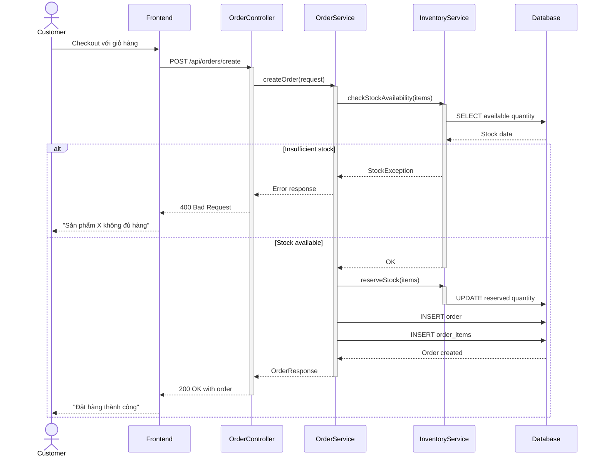
```mermaid
sequenceDiagram
    actor Customer
    participant UI as Frontend
    participant OrderCtrl as OrderController
    participant OrderSvc as OrderService
    participant InvSvc as InventoryService
    participant DB as Database
    
    Customer->>UI: Checkout với giỏ hàng
    UI->>OrderCtrl: POST /api/orders/create
    activate OrderCtrl
    
    OrderCtrl->>OrderSvc: createOrder(request)
    activate OrderSvc
    
    OrderSvc->>InvSvc: checkStockAvailability(items)
    activate InvSvc
    InvSvc->>DB: SELECT available quantity
    DB-->>InvSvc: Stock data
    
    alt Insufficient stock
        InvSvc-->>OrderSvc: StockException
        OrderSvc-->>OrderCtrl: Error response
        OrderCtrl-->>UI: 400 Bad Request
        UI-->>Customer: "Sản phẩm X không đủ hàng"
    else Stock available
        InvSvc-->>OrderSvc: OK
        deactivate InvSvc
        
        OrderSvc->>InvSvc: reserveStock(items)
        activate InvSvc
        InvSvc->>DB: UPDATE reserved quantity
        deactivate InvSvc
        
        OrderSvc->>DB: INSERT order
        OrderSvc->>DB: INSERT order_items
        DB-->>OrderSvc: Order created
        
        OrderSvc-->>OrderCtrl: OrderResponse
        deactivate OrderSvc
        OrderCtrl-->>UI: 200 OK with order
        deactivate OrderCtrl
        UI-->>Customer: "Đặt hàng thành công"
    end
```

### 1.4. Sơ Đồ Tuần Tự - Xử Lý Trạng Thái Đơn Hàng

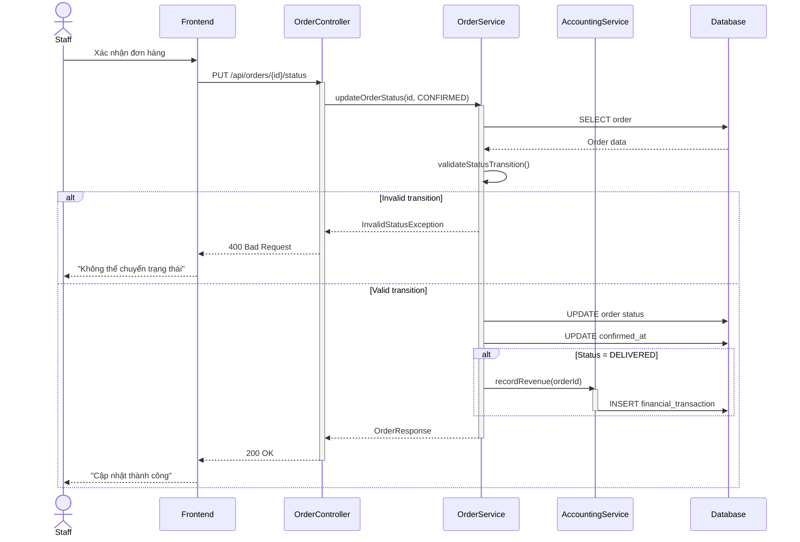
```mermaid
sequenceDiagram
    actor Staff
    participant UI as Frontend
    participant OrderCtrl as OrderController
    participant OrderSvc as OrderService
    participant AcctSvc as AccountingService
    participant DB as Database
    
    Staff->>UI: Xác nhận đơn hàng
    UI->>OrderCtrl: PUT /api/orders/{id}/status
    activate OrderCtrl
    
    OrderCtrl->>OrderSvc: updateOrderStatus(id, CONFIRMED)
    activate OrderSvc
    
    OrderSvc->>DB: SELECT order
    DB-->>OrderSvc: Order data
    
    OrderSvc->>OrderSvc: validateStatusTransition()
    
    alt Invalid transition
        OrderSvc-->>OrderCtrl: InvalidStatusException
        OrderCtrl-->>UI: 400 Bad Request
        UI-->>Staff: "Không thể chuyển trạng thái"
    else Valid transition
        OrderSvc->>DB: UPDATE order status
        OrderSvc->>DB: UPDATE confirmed_at
        
        alt Status = DELIVERED
            OrderSvc->>AcctSvc: recordRevenue(orderId)
            activate AcctSvc
            AcctSvc->>DB: INSERT financial_transaction
            deactivate AcctSvc
        end
        
        OrderSvc-->>OrderCtrl: OrderResponse
        deactivate OrderSvc
        OrderCtrl-->>UI: 200 OK
        deactivate OrderCtrl
        UI-->>Staff: "Cập nhật thành công"
    end
```


## Luồng 2: Quản Lý Kho (Warehouse Management)

### 2.1. Kịch Bản Chuẩn - Nhập Kho

**Mô tả**: Warehouse staff nhập hàng vào kho thông qua Excel import

**Các bước**:
1. Warehouse staff tải file Excel với thông tin sản phẩm
2. Hệ thống parse file Excel, validate dữ liệu
3. Tạo Purchase Order với status CREATED
4. Tạo các Purchase Order Items
5. Tạo hoặc cập nhật Warehouse Products
6. Cập nhật Inventory Stock (tăng onHand và available)
7. Nếu có supplier, tạo Supplier Payable
8. Ghi nhận bút toán kế toán (nếu có giá trị)

**Điều kiện tiên quyết**:
- User có quyền WAREHOUSE hoặc ADMIN
- File Excel đúng format
- Dữ liệu hợp lệ (SKU, quantity, price)

**Kết quả mong đợi**:
- Purchase Order được tạo
- Tồn kho được cập nhật
- Công nợ NCC được ghi nhận (nếu có)

### 2.2. Kịch Bản Chuẩn - Xuất Kho

**Mô tả**: Warehouse staff xuất hàng cho đơn hàng

**Các bước**:
1. Warehouse staff chọn đơn hàng CONFIRMED
2. Hệ thống kiểm tra available quantity cho tất cả items
3. Tạo Export Order với status PENDING
4. Tạo Export Order Items
5. Warehouse staff quét QR code hoặc nhập serial numbers
6. Hoàn tất xuất kho
7. Giảm available quantity và onHand
8. Cập nhật order status thành READY_TO_SHIP
9. Cập nhật product_details status thành SOLD

**Điều kiện tiên quyết**:
- Đơn hàng ở trạng thái CONFIRMED
- Đủ available quantity
- Serial numbers hợp lệ (nếu tracking serial)

**Kết quả mong đợi**:
- Export Order được tạo và hoàn tất
- Tồn kho giảm chính xác
- Đơn hàng chuyển sang READY_TO_SHIP

### 2.3. Kịch Bản Ngoại Lệ

#### Exception 2.1: File Excel sai format
**Trigger**: Upload file không đúng cấu trúc

**Xử lý**:
1. Validate headers của file Excel
2. Kiểm tra các cột bắt buộc: SKU, Name, Quantity, Price
3. Trả về lỗi chi tiết: thiếu cột nào, dòng nào sai
4. Không tạo Purchase Order

**Kết quả**: Import thất bại, hiển thị lỗi cụ thể

#### Exception 2.2: Duplicate SKU trong file
**Trigger**: File Excel có nhiều dòng cùng SKU

**Xử lý**:
1. Detect duplicate SKU trong quá trình parse
2. Có thể merge quantity hoặc báo lỗi (tùy business rule)
3. Hiện tại: Báo lỗi và yêu cầu sửa file

**Kết quả**: Import thất bại, yêu cầu file không có duplicate

#### Exception 2.3: Không đủ hàng để xuất
**Trigger**: Tạo export order nhưng available quantity < required

**Xử lý**:
1. Validate từng item trước khi tạo export order
2. Trả về danh sách sản phẩm thiếu hàng với số lượng cần/có
3. Không tạo export order
4. Đề xuất giảm số lượng hoặc chờ nhập thêm

**Kết quả**: Export order không được tạo, staff được thông báo rõ ràng

#### Exception 2.4: Serial number không hợp lệ
**Trigger**: Quét QR code nhưng serial không tồn tại hoặc đã được sử dụng

**Xử lý**:
1. Validate serial number với database
2. Kiểm tra status của product_detail
3. Nếu không tồn tại: "Serial không tìm thấy"
4. Nếu đã SOLD: "Serial đã được xuất trong đơn X"
5. Cho phép quét lại

**Kết quả**: Serial không hợp lệ bị reject, yêu cầu quét serial khác

#### Exception 2.5: Hủy phiếu xuất sau khi hoàn tất
**Trigger**: Cần hủy export order đã COMPLETED (do hủy đơn hàng)

**Xử lý**:
1. Kiểm tra export order có liên kết với order nào
2. Chỉ cho phép hủy nếu order chưa SHIPPING
3. Hoàn trả available quantity và onHand
4. Cập nhật product_details status về IN_STOCK
5. Cập nhật export order status thành CANCELLED

**Kết quả**: Phiếu xuất bị hủy, tồn kho được khôi phục


### 2.4. Sơ Đồ Tuần Tự - Nhập Kho qua Excel

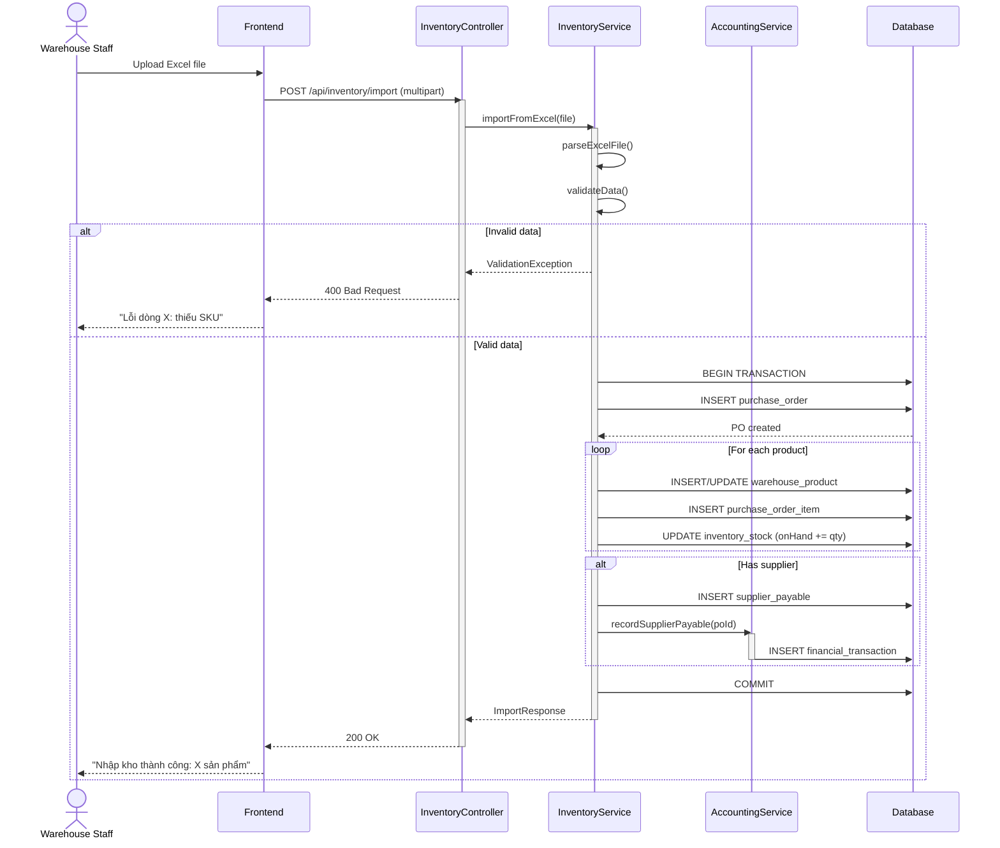
```mermaid
sequenceDiagram
    actor Staff as Warehouse Staff
    participant UI as Frontend
    participant InvCtrl as InventoryController
    participant InvSvc as InventoryService
    participant AcctSvc as AccountingService
    participant DB as Database
    
    Staff->>UI: Upload Excel file
    UI->>InvCtrl: POST /api/inventory/import (multipart)
    activate InvCtrl
    
    InvCtrl->>InvSvc: importFromExcel(file)
    activate InvSvc
    
    InvSvc->>InvSvc: parseExcelFile()
    InvSvc->>InvSvc: validateData()
    
    alt Invalid data
        InvSvc-->>InvCtrl: ValidationException
        InvCtrl-->>UI: 400 Bad Request
        UI-->>Staff: "Lỗi dòng X: thiếu SKU"
    else Valid data
        InvSvc->>DB: BEGIN TRANSACTION
        
        InvSvc->>DB: INSERT purchase_order
        DB-->>InvSvc: PO created
        
        loop For each product
            InvSvc->>DB: INSERT/UPDATE warehouse_product
            InvSvc->>DB: INSERT purchase_order_item
            InvSvc->>DB: UPDATE inventory_stock (onHand += qty)
        end
        
        alt Has supplier
            InvSvc->>DB: INSERT supplier_payable
            InvSvc->>AcctSvc: recordSupplierPayable(poId)
            activate AcctSvc
            AcctSvc->>DB: INSERT financial_transaction
            deactivate AcctSvc
        end
        
        InvSvc->>DB: COMMIT
        
        InvSvc-->>InvCtrl: ImportResponse
        deactivate InvSvc
        InvCtrl-->>UI: 200 OK
        deactivate InvCtrl
        UI-->>Staff: "Nhập kho thành công: X sản phẩm"
    end
```

### 2.5. Sơ Đồ Tuần Tự - Xuất Kho

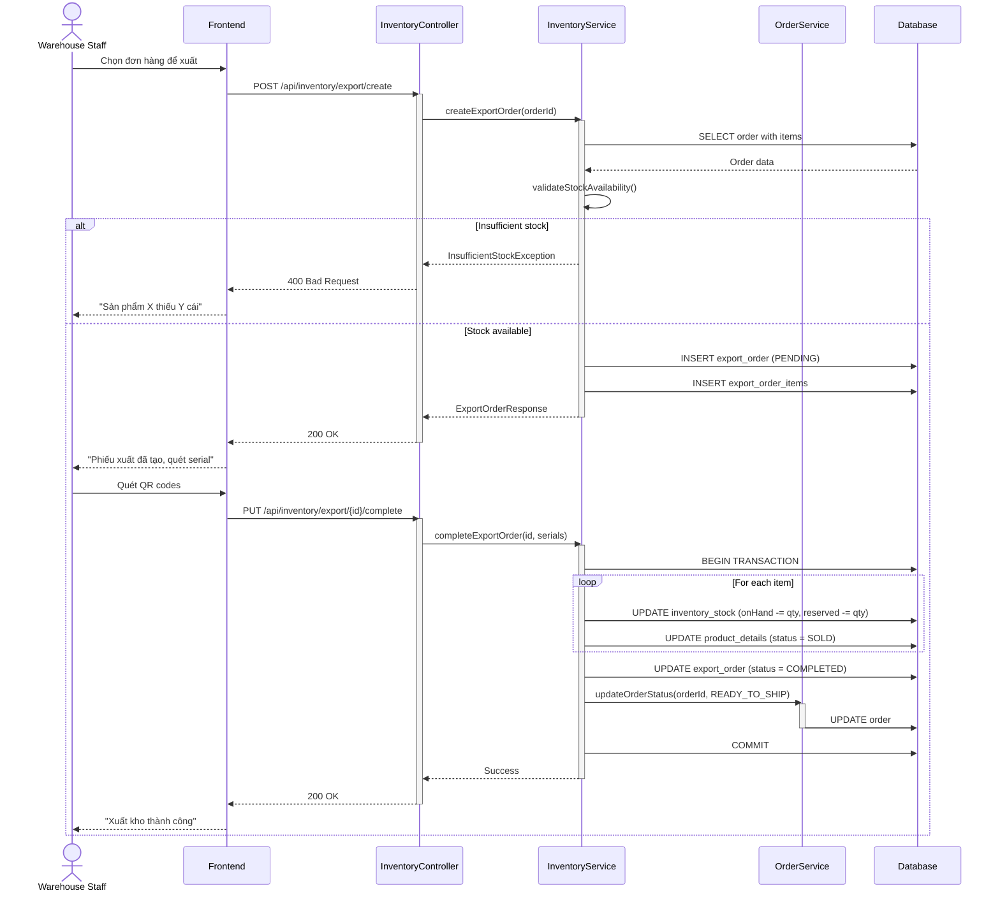
```mermaid
sequenceDiagram
    actor Staff as Warehouse Staff
    participant UI as Frontend
    participant InvCtrl as InventoryController
    participant InvSvc as InventoryService
    participant OrderSvc as OrderService
    participant DB as Database
    
    Staff->>UI: Chọn đơn hàng để xuất
    UI->>InvCtrl: POST /api/inventory/export/create
    activate InvCtrl
    
    InvCtrl->>InvSvc: createExportOrder(orderId)
    activate InvSvc
    
    InvSvc->>DB: SELECT order with items
    DB-->>InvSvc: Order data
    
    InvSvc->>InvSvc: validateStockAvailability()
    
    alt Insufficient stock
        InvSvc-->>InvCtrl: InsufficientStockException
        InvCtrl-->>UI: 400 Bad Request
        UI-->>Staff: "Sản phẩm X thiếu Y cái"
    else Stock available
        InvSvc->>DB: INSERT export_order (PENDING)
        InvSvc->>DB: INSERT export_order_items
        
        InvSvc-->>InvCtrl: ExportOrderResponse
        deactivate InvSvc
        InvCtrl-->>UI: 200 OK
        deactivate InvCtrl
        
        UI-->>Staff: "Phiếu xuất đã tạo, quét serial"
        
        Staff->>UI: Quét QR codes
        UI->>InvCtrl: PUT /api/inventory/export/{id}/complete
        activate InvCtrl
        
        InvCtrl->>InvSvc: completeExportOrder(id, serials)
        activate InvSvc
        
        InvSvc->>DB: BEGIN TRANSACTION
        
        loop For each item
            InvSvc->>DB: UPDATE inventory_stock (onHand -= qty, reserved -= qty)
            InvSvc->>DB: UPDATE product_details (status = SOLD)
        end
        
        InvSvc->>DB: UPDATE export_order (status = COMPLETED)
        
        InvSvc->>OrderSvc: updateOrderStatus(orderId, READY_TO_SHIP)
        activate OrderSvc
        OrderSvc->>DB: UPDATE order
        deactivate OrderSvc
        
        InvSvc->>DB: COMMIT
        
        InvSvc-->>InvCtrl: Success
        deactivate InvSvc
        InvCtrl-->>UI: 200 OK
        deactivate InvCtrl
        UI-->>Staff: "Xuất kho thành công"
    end
```


## Luồng 3: Tích Hợp GHN Vận Chuyển

### 3.1. Kịch Bản Chuẩn

**Mô tả**: Tạo đơn vận chuyển GHN và theo dõi trạng thái

**Các bước**:
1. Đơn hàng đạt trạng thái READY_TO_SHIP
2. Staff chọn tạo đơn GHN
3. Hệ thống chuẩn bị dữ liệu:
   - Địa chỉ giao hàng (province_code, district_code, ward_code)
   - Thông tin sản phẩm (tên, số lượng, giá trị)
   - COD amount (nếu thanh toán COD)
   - Service type (Express, Standard)
4. Gọi GHN API: POST /v2/shipping-order/create
5. GHN trả về order_code
6. Lưu ghnOrderCode vào database
7. Cập nhật order status thành SHIPPING
8. GHN gửi webhook khi có cập nhật trạng thái
9. Hệ thống xử lý webhook và cập nhật order status

**Điều kiện tiên quyết**:
- Order ở trạng thái READY_TO_SHIP
- Địa chỉ có đầy đủ province/district/ward code
- GHN API token hợp lệ
- Shop ID đã được cấu hình

**Kết quả mong đợi**:
- Đơn GHN được tạo thành công
- Order status chuyển sang SHIPPING
- Tracking code được lưu

### 3.2. Kịch Bản Ngoại Lệ

#### Exception 3.1: Địa chỉ không hợp lệ với GHN
**Trigger**: GHN API trả về lỗi "Address not supported"

**Xử lý**:
1. Bắt GHNException từ API response
2. Parse error message từ GHN
3. Giữ nguyên order status READY_TO_SHIP
4. Hiển thị lỗi: "GHN không hỗ trợ giao đến địa chỉ này"
5. Đề xuất staff kiểm tra lại ward/district code
6. Cho phép thử lại sau khi sửa

**Kết quả**: Đơn GHN không được tạo, order vẫn READY_TO_SHIP

#### Exception 3.2: Vượt quá trọng lượng/kích thước
**Trigger**: GHN từ chối do package quá lớn/nặng

**Xử lý**:
1. Parse error từ GHN về weight/dimension limit
2. Hiển thị thông báo cụ thể
3. Đề xuất chia đơn thành nhiều package
4. Hoặc chuyển sang dịch vụ vận chuyển khác

**Kết quả**: Đơn GHN không được tạo, cần xử lý thủ công

#### Exception 3.3: GHN API timeout
**Trigger**: Request đến GHN quá 30s không response

**Xử lý**:
1. Catch SocketTimeoutException
2. Không chắc đơn đã tạo hay chưa
3. Gọi GHN API kiểm tra: GET /v2/shipping-order/detail
4. Nếu đã tạo: Lưu order_code và cập nhật status
5. Nếu chưa tạo: Cho phép retry
6. Log chi tiết để debug

**Kết quả**: Xử lý idempotent, không tạo duplicate orders

#### Exception 3.4: Webhook signature không hợp lệ
**Trigger**: Nhận webhook nhưng signature sai

**Xử lý**:
1. Verify signature bằng secret key
2. Nếu sai: Log warning và return 401
3. Không xử lý data từ webhook
4. GHN sẽ retry sau 5 phút

**Kết quả**: Webhook bị reject, chờ retry hợp lệ

#### Exception 3.5: Webhook với order_code không tồn tại
**Trigger**: GHN gửi webhook cho order không có trong DB

**Xử lý**:
1. Tìm order theo ghnOrderCode
2. Nếu không tìm thấy: Log error với order_code
3. Return 404 để GHN biết
4. Có thể là order của môi trường khác (test/prod)

**Kết quả**: Webhook bị bỏ qua, log để investigate


### 3.3. Sơ Đồ Tuần Tự - Tạo Đơn GHN

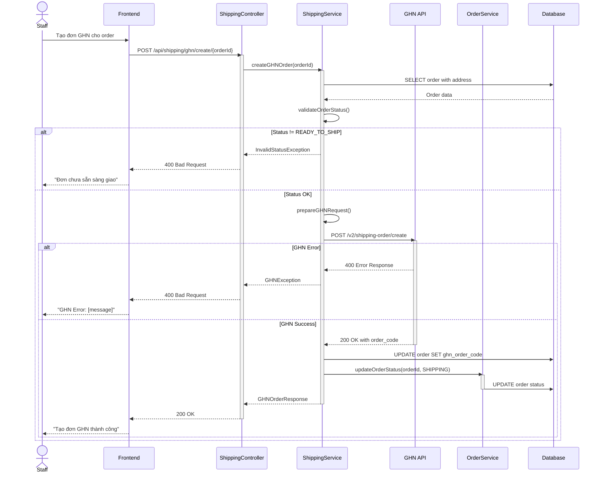
```mermaid
sequenceDiagram
    actor Staff
    participant UI as Frontend
    participant ShipCtrl as ShippingController
    participant ShipSvc as ShippingService
    participant GHN as GHN API
    participant OrderSvc as OrderService
    participant DB as Database
    
    Staff->>UI: Tạo đơn GHN cho order
    UI->>ShipCtrl: POST /api/shipping/ghn/create/{orderId}
    activate ShipCtrl
    
    ShipCtrl->>ShipSvc: createGHNOrder(orderId)
    activate ShipSvc
    
    ShipSvc->>DB: SELECT order with address
    DB-->>ShipSvc: Order data
    
    ShipSvc->>ShipSvc: validateOrderStatus()
    
    alt Status != READY_TO_SHIP
        ShipSvc-->>ShipCtrl: InvalidStatusException
        ShipCtrl-->>UI: 400 Bad Request
        UI-->>Staff: "Đơn chưa sẵn sàng giao"
    else Status OK
        ShipSvc->>ShipSvc: prepareGHNRequest()
        
        ShipSvc->>GHN: POST /v2/shipping-order/create
        activate GHN
        
        alt GHN Error
            GHN-->>ShipSvc: 400 Error Response
            ShipSvc-->>ShipCtrl: GHNException
            ShipCtrl-->>UI: 400 Bad Request
            UI-->>Staff: "GHN Error: [message]"
        else GHN Success
            GHN-->>ShipSvc: 200 OK with order_code
            deactivate GHN
            
            ShipSvc->>DB: UPDATE order SET ghn_order_code
            ShipSvc->>OrderSvc: updateOrderStatus(orderId, SHIPPING)
            activate OrderSvc
            OrderSvc->>DB: UPDATE order status
            deactivate OrderSvc
            
            ShipSvc-->>ShipCtrl: GHNOrderResponse
            deactivate ShipSvc
            ShipCtrl-->>UI: 200 OK
            deactivate ShipCtrl
            UI-->>Staff: "Tạo đơn GHN thành công"
        end
    end
```

### 3.4. Sơ Đồ Tuần Tự - Xử Lý Webhook GHN

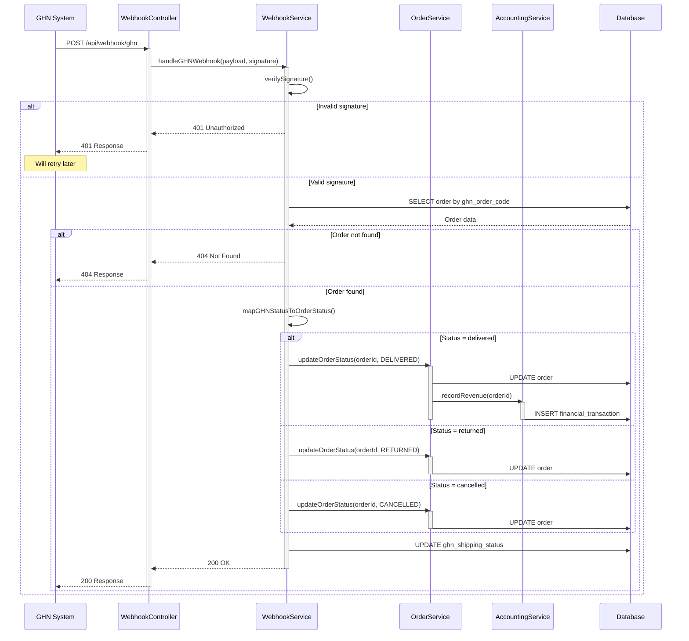
```mermaid
sequenceDiagram
    participant GHN as GHN System
    participant WebhookCtrl as WebhookController
    participant WebhookSvc as WebhookService
    participant OrderSvc as OrderService
    participant AcctSvc as AccountingService
    participant DB as Database
    
    GHN->>WebhookCtrl: POST /api/webhook/ghn
    activate WebhookCtrl
    
    WebhookCtrl->>WebhookSvc: handleGHNWebhook(payload, signature)
    activate WebhookSvc
    
    WebhookSvc->>WebhookSvc: verifySignature()
    
    alt Invalid signature
        WebhookSvc-->>WebhookCtrl: 401 Unauthorized
        WebhookCtrl-->>GHN: 401 Response
        Note over GHN: Will retry later
    else Valid signature
        WebhookSvc->>DB: SELECT order by ghn_order_code
        DB-->>WebhookSvc: Order data
        
        alt Order not found
            WebhookSvc-->>WebhookCtrl: 404 Not Found
            WebhookCtrl-->>GHN: 404 Response
        else Order found
            WebhookSvc->>WebhookSvc: mapGHNStatusToOrderStatus()
            
            alt Status = delivered
                WebhookSvc->>OrderSvc: updateOrderStatus(orderId, DELIVERED)
                activate OrderSvc
                OrderSvc->>DB: UPDATE order
                OrderSvc->>AcctSvc: recordRevenue(orderId)
                activate AcctSvc
                AcctSvc->>DB: INSERT financial_transaction
                deactivate AcctSvc
                deactivate OrderSvc
            else Status = returned
                WebhookSvc->>OrderSvc: updateOrderStatus(orderId, RETURNED)
                activate OrderSvc
                OrderSvc->>DB: UPDATE order
                deactivate OrderSvc
            else Status = cancelled
                WebhookSvc->>OrderSvc: updateOrderStatus(orderId, CANCELLED)
                activate OrderSvc
                OrderSvc->>DB: UPDATE order
                deactivate OrderSvc
            end
            
            WebhookSvc->>DB: UPDATE ghn_shipping_status
            
            WebhookSvc-->>WebhookCtrl: 200 OK
            deactivate WebhookSvc
            WebhookCtrl-->>GHN: 200 Response
            deactivate WebhookCtrl
        end
    end
```


## Luồng 4: Thanh Toán Online SePay

### 4.1. Kịch Bản Chuẩn

**Mô tả**: Khách hàng thanh toán online qua SePay

**Các bước**:
1. Khách hàng chọn phương thức thanh toán Online tại checkout
2. Hệ thống tạo order với status PENDING_PAYMENT
3. Tạo Payment record với:
   - Unique payment_code
   - Amount = order total
   - Method = SEPAY
   - Status = PENDING
   - Expired_at = now + 15 minutes
4. Gọi SePay API để generate QR code
5. Hiển thị QR code cho khách hàng
6. Khách hàng quét QR và chuyển khoản
7. SePay gửi webhook khi nhận được tiền
8. Hệ thống verify webhook signature
9. Match transaction với payment record (theo content/amount)
10. Cập nhật payment status = COMPLETED
11. Cập nhật order payment_status = PAID
12. Cập nhật order status = CONFIRMED
13. Ghi nhận bút toán kế toán (thu tiền)

**Điều kiện tiên quyết**:
- Bank account đã được cấu hình với SePay token
- Order total > 0
- Payment chưa expired

**Kết quả mong đợi**:
- Payment được tạo và hoàn tất
- Order được xác nhận tự động
- Bút toán kế toán được ghi nhận

### 4.2. Kịch Bản Ngoại Lệ

#### Exception 4.1: Payment timeout
**Trigger**: Khách hàng không thanh toán trong 15 phút

**Xử lý**:
1. Scheduler job chạy mỗi 5 phút
2. Tìm payments có status PENDING và expired_at < now
3. Cập nhật payment status = EXPIRED
4. Cập nhật order status = CANCELLED
5. Giải phóng reserved stock
6. Gửi email thông báo cho khách hàng

**Kết quả**: Payment expired, order cancelled, stock released

#### Exception 4.2: Số tiền chuyển không khớp
**Trigger**: SePay webhook với amount != order total

**Xử lý**:
1. So sánh webhook amount với payment amount
2. Nếu khác nhau:
   - Log warning với chi tiết
   - Cập nhật payment status = FAILED
   - Set failure_reason = "Amount mismatch"
   - Không tự động confirm order
   - Tạo alert cho accountant
3. Accountant xử lý thủ công

**Kết quả**: Payment failed, cần xử lý thủ công

#### Exception 4.3: Duplicate webhook
**Trigger**: SePay gửi webhook nhiều lần cho cùng transaction

**Xử lý**:
1. Check payment status trước khi xử lý
2. Nếu đã COMPLETED: Return 200 OK ngay (idempotent)
3. Không xử lý lại
4. Log info để tracking

**Kết quả**: Webhook được accept nhưng không xử lý lại

#### Exception 4.4: Không match được payment
**Trigger**: Webhook với content không khớp payment_code nào

**Xử lý**:
1. Parse content từ webhook
2. Tìm payment theo payment_code trong content
3. Nếu không tìm thấy:
   - Log error với full webhook data
   - Lưu vào bảng unmatched_transactions
   - Return 200 OK (để SePay không retry)
   - Alert accountant để xử lý thủ công

**Kết quả**: Transaction được log, cần xử lý thủ công

#### Exception 4.5: Multiple bank accounts
**Trigger**: Hệ thống có nhiều tài khoản ngân hàng

**Xử lý**:
1. Webhook chứa account_number
2. Match với bank_accounts table
3. Ghi nhận transaction vào đúng bank account
4. Cập nhật balance của account đó
5. Tạo financial_transaction với bank_account_id

**Kết quả**: Transaction được ghi nhận vào đúng tài khoản


### 4.3. Sơ Đồ Tuần Tự - Thanh Toán SePay

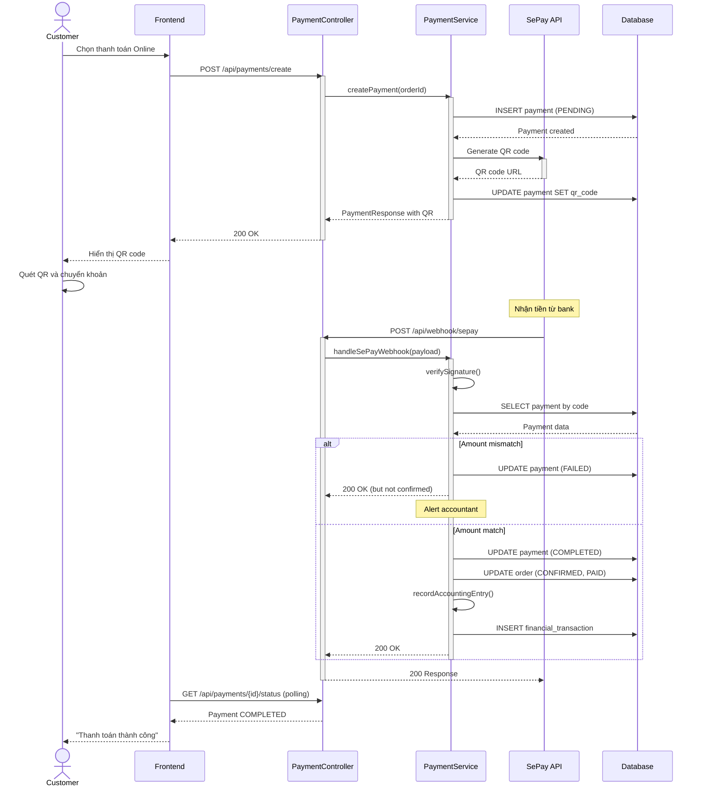
```mermaid
sequenceDiagram
    actor Customer
    participant UI as Frontend
    participant PayCtrl as PaymentController
    participant PaySvc as PaymentService
    participant SePay as SePay API
    participant DB as Database
    
    Customer->>UI: Chọn thanh toán Online
    UI->>PayCtrl: POST /api/payments/create
    activate PayCtrl
    
    PayCtrl->>PaySvc: createPayment(orderId)
    activate PaySvc
    
    PaySvc->>DB: INSERT payment (PENDING)
    DB-->>PaySvc: Payment created
    
    PaySvc->>SePay: Generate QR code
    activate SePay
    SePay-->>PaySvc: QR code URL
    deactivate SePay
    
    PaySvc->>DB: UPDATE payment SET qr_code
    
    PaySvc-->>PayCtrl: PaymentResponse with QR
    deactivate PaySvc
    PayCtrl-->>UI: 200 OK
    deactivate PayCtrl
    
    UI-->>Customer: Hiển thị QR code
    
    Customer->>Customer: Quét QR và chuyển khoản
    
    Note over SePay: Nhận tiền từ bank
    
    SePay->>PayCtrl: POST /api/webhook/sepay
    activate PayCtrl
    
    PayCtrl->>PaySvc: handleSePayWebhook(payload)
    activate PaySvc
    
    PaySvc->>PaySvc: verifySignature()
    PaySvc->>DB: SELECT payment by code
    DB-->>PaySvc: Payment data
    
    alt Amount mismatch
        PaySvc->>DB: UPDATE payment (FAILED)
        PaySvc-->>PayCtrl: 200 OK (but not confirmed)
        Note over PaySvc: Alert accountant
    else Amount match
        PaySvc->>DB: UPDATE payment (COMPLETED)
        PaySvc->>DB: UPDATE order (CONFIRMED, PAID)
        
        PaySvc->>PaySvc: recordAccountingEntry()
        PaySvc->>DB: INSERT financial_transaction
        
        PaySvc-->>PayCtrl: 200 OK
    end
    
    deactivate PaySvc
    PayCtrl-->>SePay: 200 Response
    deactivate PayCtrl
    
    UI->>PayCtrl: GET /api/payments/{id}/status (polling)
    PayCtrl-->>UI: Payment COMPLETED
    UI-->>Customer: "Thanh toán thành công"
```


## Luồng 5: Kế Toán Tự Động

### 5.1. Kịch Bản Chuẩn

**Mô tả**: Hệ thống tự động ghi nhận các bút toán kế toán

**Các loại ghi nhận tự động**:

#### 5.1.1. Ghi nhận doanh thu (khi đơn DELIVERED)
```
Event: Order status → DELIVERED
Action:
  - Tạo financial_transaction
  - Type: REVENUE
  - Category: SALES
  - Amount: order.total - order.shippingFee
  - Description: "Doanh thu đơn hàng {orderCode}"
```

#### 5.1.2. Ghi nhận phí vận chuyển
```
Event: Order status → DELIVERED
Action:
  - Tạo financial_transaction
  - Type: EXPENSE
  - Category: SHIPPING
  - Amount: order.shippingFee
  - Description: "Phí vận chuyển đơn {orderCode}"
```

#### 5.1.3. Ghi nhận thu tiền online
```
Event: Payment status → COMPLETED
Action:
  - Tạo financial_transaction
  - Type: REVENUE
  - Category: PAYMENT_FEE (nếu có phí)
  - Amount: payment.amount
  - Description: "Thu tiền online đơn {orderCode}"
```

#### 5.1.4. Ghi nhận công nợ NCC
```
Event: Purchase Order created with supplier
Action:
  - Tạo supplier_payable
  - Total_amount: sum(items.quantity * items.unitCost)
  - Paid_amount: 0
  - Remaining_amount: total_amount
  - Status: UNPAID
  - Due_date: invoice_date + payment_term_days
```

#### 5.1.5. Ghi nhận thanh toán NCC
```
Event: Supplier payment recorded
Action:
  - Tạo supplier_payment
  - Cập nhật supplier_payable:
    - paid_amount += payment.amount
    - remaining_amount = total_amount - paid_amount
    - status = (remaining_amount == 0) ? PAID : PARTIAL
  - Tạo financial_transaction
  - Type: EXPENSE
  - Category: COST_OF_GOODS
```

### 5.2. Kịch Bản Ngoại Lệ

#### Exception 5.1: Ghi nhận bút toán thất bại
**Trigger**: Lỗi database khi tạo financial_transaction

**Xử lý**:
1. Catch exception trong AccountingService
2. Log error với đầy đủ context (orderId, amount, etc.)
3. Không rollback business transaction (order vẫn DELIVERED)
4. Tạo alert cho accountant
5. Accountant có thể tạo bút toán thủ công sau

**Kết quả**: Business flow tiếp tục, bút toán được tạo sau

#### Exception 5.2: Duplicate accounting entry
**Trigger**: Event được trigger nhiều lần (retry, bug)

**Xử lý**:
1. Check xem đã có transaction với orderId chưa
2. Nếu có: Skip và return success (idempotent)
3. Log warning để investigate
4. Không tạo duplicate entry

**Kết quả**: Chỉ có 1 bút toán duy nhất

#### Exception 5.3: Số liệu không khớp
**Trigger**: Order total != sum(order_items.subtotal)

**Xử lý**:
1. Validate trước khi ghi nhận
2. Nếu không khớp: Log error
3. Tạo financial_transaction với note "Cần kiểm tra"
4. Alert accountant
5. Accountant điều chỉnh thủ công

**Kết quả**: Bút toán được tạo nhưng có flag cần review


### 5.3. Sơ Đồ Tuần Tự - Ghi Nhận Doanh Thu

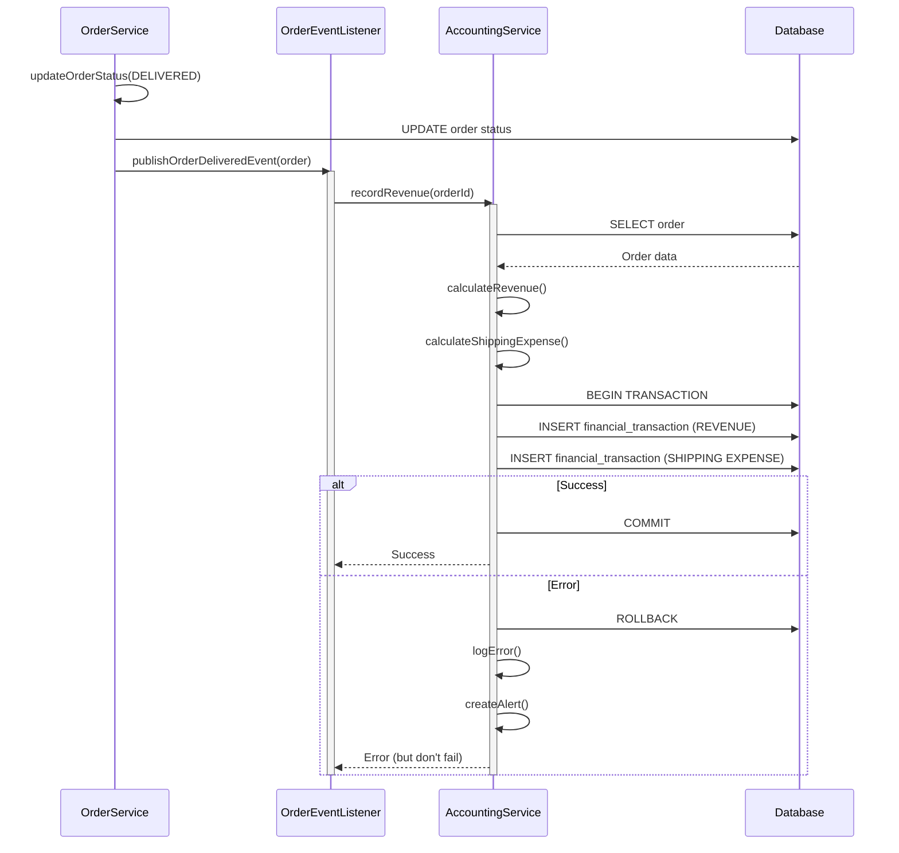
```mermaid
sequenceDiagram
    participant OrderSvc as OrderService
    participant EventListener as OrderEventListener
    participant AcctSvc as AccountingService
    participant DB as Database
    
    OrderSvc->>OrderSvc: updateOrderStatus(DELIVERED)
    OrderSvc->>DB: UPDATE order status
    
    OrderSvc->>EventListener: publishOrderDeliveredEvent(order)
    activate EventListener
    
    EventListener->>AcctSvc: recordRevenue(orderId)
    activate AcctSvc
    
    AcctSvc->>DB: SELECT order
    DB-->>AcctSvc: Order data
    
    AcctSvc->>AcctSvc: calculateRevenue()
    AcctSvc->>AcctSvc: calculateShippingExpense()
    
    AcctSvc->>DB: BEGIN TRANSACTION
    
    AcctSvc->>DB: INSERT financial_transaction (REVENUE)
    AcctSvc->>DB: INSERT financial_transaction (SHIPPING EXPENSE)
    
    alt Success
        AcctSvc->>DB: COMMIT
        AcctSvc-->>EventListener: Success
    else Error
        AcctSvc->>DB: ROLLBACK
        AcctSvc->>AcctSvc: logError()
        AcctSvc->>AcctSvc: createAlert()
        AcctSvc-->>EventListener: Error (but don't fail)
    end
    
    deactivate AcctSvc
    deactivate EventListener
```

### 5.4. Sơ Đồ Tuần Tự - Quản Lý Công Nợ NCC

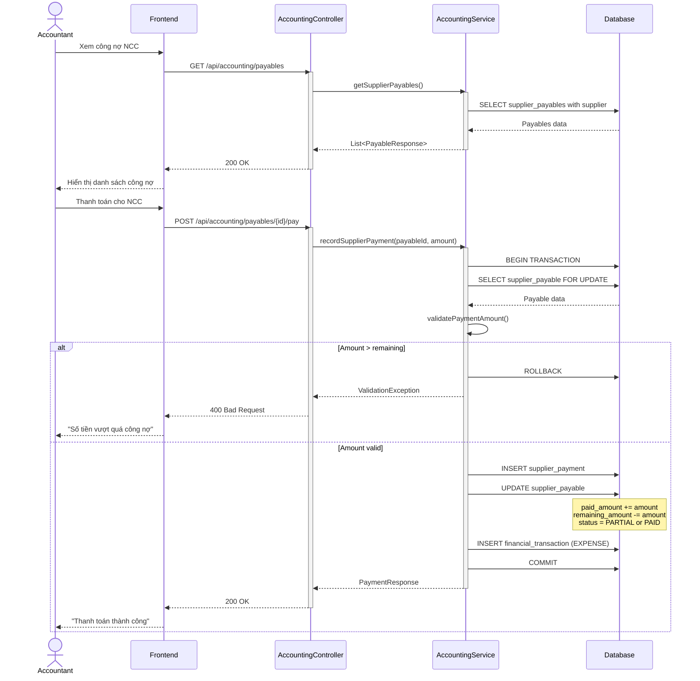
```mermaid
sequenceDiagram
    actor Accountant
    participant UI as Frontend
    participant AcctCtrl as AccountingController
    participant AcctSvc as AccountingService
    participant DB as Database
    
    Accountant->>UI: Xem công nợ NCC
    UI->>AcctCtrl: GET /api/accounting/payables
    activate AcctCtrl
    
    AcctCtrl->>AcctSvc: getSupplierPayables()
    activate AcctSvc
    
    AcctSvc->>DB: SELECT supplier_payables with supplier
    DB-->>AcctSvc: Payables data
    
    AcctSvc-->>AcctCtrl: List<PayableResponse>
    deactivate AcctSvc
    AcctCtrl-->>UI: 200 OK
    deactivate AcctCtrl
    
    UI-->>Accountant: Hiển thị danh sách công nợ
    
    Accountant->>UI: Thanh toán cho NCC
    UI->>AcctCtrl: POST /api/accounting/payables/{id}/pay
    activate AcctCtrl
    
    AcctCtrl->>AcctSvc: recordSupplierPayment(payableId, amount)
    activate AcctSvc
    
    AcctSvc->>DB: BEGIN TRANSACTION
    
    AcctSvc->>DB: SELECT supplier_payable FOR UPDATE
    DB-->>AcctSvc: Payable data
    
    AcctSvc->>AcctSvc: validatePaymentAmount()
    
    alt Amount > remaining
        AcctSvc->>DB: ROLLBACK
        AcctSvc-->>AcctCtrl: ValidationException
        AcctCtrl-->>UI: 400 Bad Request
        UI-->>Accountant: "Số tiền vượt quá công nợ"
    else Amount valid
        AcctSvc->>DB: INSERT supplier_payment
        
        AcctSvc->>DB: UPDATE supplier_payable
        Note over DB: paid_amount += amount<br/>remaining_amount -= amount<br/>status = PARTIAL or PAID
        
        AcctSvc->>DB: INSERT financial_transaction (EXPENSE)
        
        AcctSvc->>DB: COMMIT
        
        AcctSvc-->>AcctCtrl: PaymentResponse
        deactivate AcctSvc
        AcctCtrl-->>UI: 200 OK
        deactivate AcctCtrl
        UI-->>Accountant: "Thanh toán thành công"
    end
```


## Luồng 6: Phân Quyền và Bảo Mật

### 6.1. Kịch Bản Chuẩn

**Mô tả**: Xác thực và phân quyền người dùng

**Các bước đăng nhập**:
1. User nhập email/password
2. Hệ thống validate credentials
3. Tạo JWT token với claims:
   - userId
   - email
   - role (CUSTOMER, EMPLOYEE, ADMIN)
   - position (nếu là EMPLOYEE)
4. Trả về token cho client
5. Client lưu token vào localStorage
6. Mỗi request gửi token trong Authorization header
7. Backend verify token và extract user info
8. Check permissions cho endpoint

**Phân quyền theo role**:

```
CUSTOMER:
  - Browse products
  - Manage cart
  - Create orders
  - View own orders
  - Make payments

EMPLOYEE (SALE):
  - View all orders
  - Confirm orders (PENDING → CONFIRMED)
  - Mark orders as READY_TO_PICK

EMPLOYEE (WAREHOUSE):
  - View orders CONFIRMED, READY_TO_PICK
  - Create import/export transactions
  - Manage inventory
  - Scan serial numbers

EMPLOYEE (SHIPPER):
  - View orders READY_TO_SHIP, SHIPPING
  - Update delivery status
  - Confirm delivery

EMPLOYEE (ACCOUNTANT):
  - View financial reports
  - Manage supplier payables
  - Reconcile payments
  - View all transactions

ADMIN:
  - All permissions
  - Manage users
  - Manage employees
  - System configuration
```

### 6.2. Kịch Bản Ngoại Lệ

#### Exception 6.1: Token expired
**Trigger**: JWT token đã hết hạn

**Xử lý**:
1. JwtAuthenticationFilter catch ExpiredJwtException
2. Return 401 Unauthorized
3. Frontend detect 401
4. Redirect to login page
5. Clear localStorage
6. User phải đăng nhập lại

**Kết quả**: User bị logout, cần đăng nhập lại

#### Exception 6.2: Insufficient permissions
**Trigger**: User cố truy cập endpoint không có quyền

**Xử lý**:
1. SecurityConfig check role/position
2. Nếu không đủ quyền: throw AccessDeniedException
3. GlobalExceptionHandler catch và return 403
4. Frontend hiển thị "Bạn không có quyền truy cập"

**Kết quả**: Request bị reject với 403

#### Exception 6.3: First login password change
**Trigger**: Employee đăng nhập lần đầu

**Xử lý**:
1. Check employee.firstLogin flag
2. Nếu true: Return special response
3. Frontend redirect to /first-change-password
4. Employee phải đổi password
5. Update firstLogin = false
6. Sau đó mới cho truy cập hệ thống

**Kết quả**: Employee bắt buộc đổi password lần đầu

#### Exception 6.4: Concurrent login sessions
**Trigger**: User đăng nhập từ nhiều device

**Xử lý**:
1. Hiện tại: Cho phép multiple sessions
2. Mỗi session có token riêng
3. Không có session management
4. Tương lai: Có thể implement single session

**Kết quả**: Multiple sessions được phép


### 6.3. Sơ Đồ Tuần Tự - Xác Thực và Phân Quyền

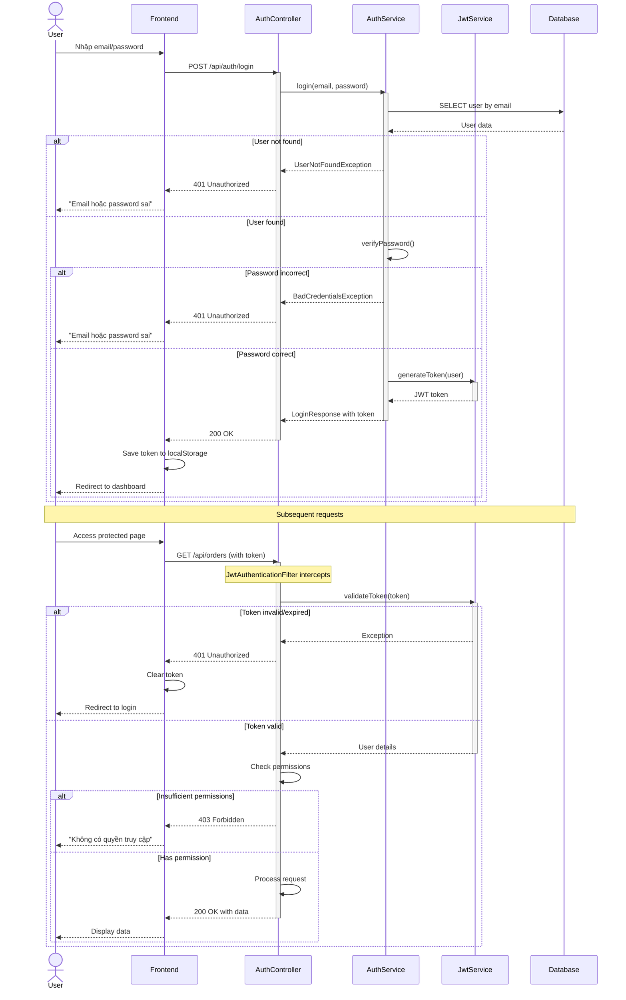
```mermaid
sequenceDiagram
    actor User
    participant UI as Frontend
    participant AuthCtrl as AuthController
    participant AuthSvc as AuthService
    participant JwtSvc as JwtService
    participant DB as Database
    
    User->>UI: Nhập email/password
    UI->>AuthCtrl: POST /api/auth/login
    activate AuthCtrl
    
    AuthCtrl->>AuthSvc: login(email, password)
    activate AuthSvc
    
    AuthSvc->>DB: SELECT user by email
    DB-->>AuthSvc: User data
    
    alt User not found
        AuthSvc-->>AuthCtrl: UserNotFoundException
        AuthCtrl-->>UI: 401 Unauthorized
        UI-->>User: "Email hoặc password sai"
    else User found
        AuthSvc->>AuthSvc: verifyPassword()
        
        alt Password incorrect
            AuthSvc-->>AuthCtrl: BadCredentialsException
            AuthCtrl-->>UI: 401 Unauthorized
            UI-->>User: "Email hoặc password sai"
        else Password correct
            AuthSvc->>JwtSvc: generateToken(user)
            activate JwtSvc
            JwtSvc-->>AuthSvc: JWT token
            deactivate JwtSvc
            
            AuthSvc-->>AuthCtrl: LoginResponse with token
            deactivate AuthSvc
            AuthCtrl-->>UI: 200 OK
            deactivate AuthCtrl
            
            UI->>UI: Save token to localStorage
            UI-->>User: Redirect to dashboard
        end
    end
    
    Note over User,DB: Subsequent requests
    
    User->>UI: Access protected page
    UI->>AuthCtrl: GET /api/orders (with token)
    activate AuthCtrl
    
    Note over AuthCtrl: JwtAuthenticationFilter intercepts
    
    AuthCtrl->>JwtSvc: validateToken(token)
    activate JwtSvc
    
    alt Token invalid/expired
        JwtSvc-->>AuthCtrl: Exception
        AuthCtrl-->>UI: 401 Unauthorized
        UI->>UI: Clear token
        UI-->>User: Redirect to login
    else Token valid
        JwtSvc-->>AuthCtrl: User details
        deactivate JwtSvc
        
        AuthCtrl->>AuthCtrl: Check permissions
        
        alt Insufficient permissions
            AuthCtrl-->>UI: 403 Forbidden
            UI-->>User: "Không có quyền truy cập"
        else Has permission
            AuthCtrl->>AuthCtrl: Process request
            AuthCtrl-->>UI: 200 OK with data
            deactivate AuthCtrl
            UI-->>User: Display data
        end
    end
```


## Sơ Đồ Thực Thể Quan Hệ (ERD)

### ERD Tổng Quan

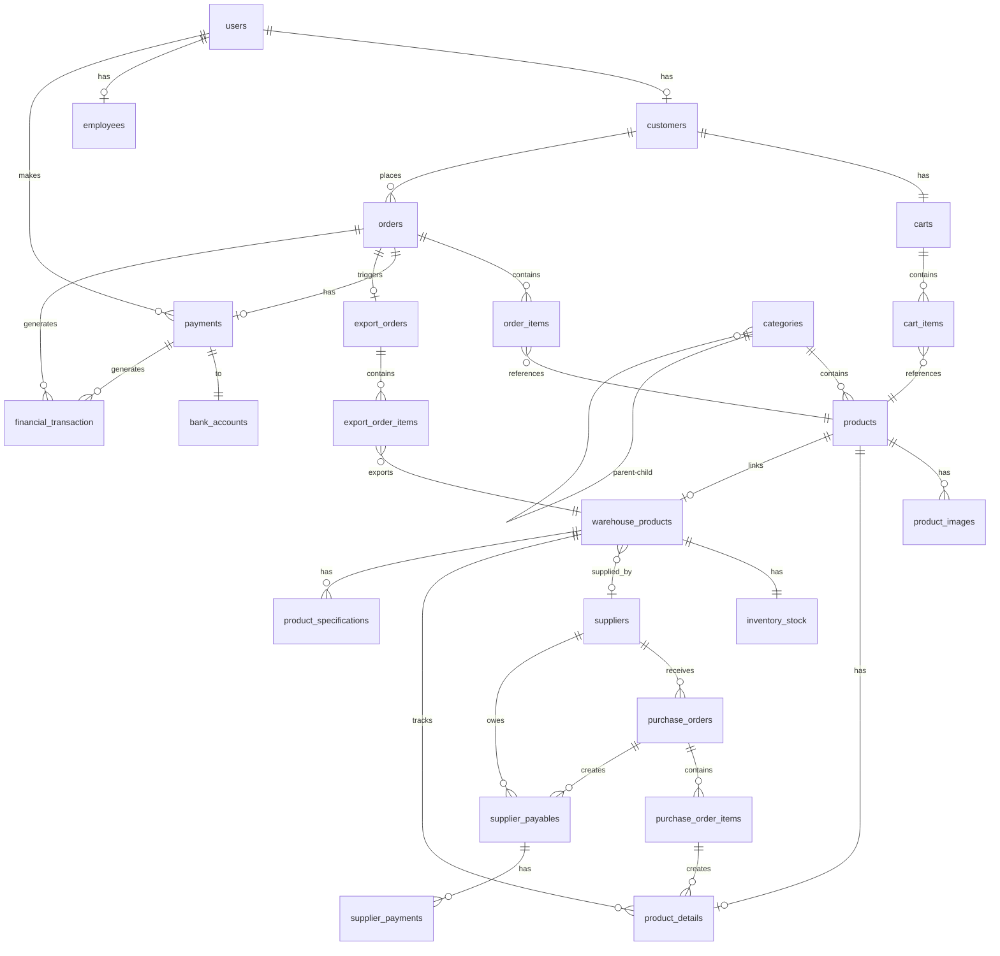
```mermaid
erDiagram
    users ||--o| customers : "has"
    users ||--o| employees : "has"
    users ||--o{ payments : "makes"
    
    customers ||--|| carts : "has"
    customers ||--o{ orders : "places"
    
    carts ||--o{ cart_items : "contains"
    cart_items }o--|| products : "references"
    
    orders ||--o{ order_items : "contains"
    orders ||--o| payments : "has"
    orders ||--o| export_orders : "triggers"
    
    order_items }o--|| products : "references"
    
    categories ||--o{ products : "contains"
    categories ||--o{ categories : "parent-child"
    
    products ||--o{ product_images : "has"
    products ||--o| product_details : "has"
    products ||--o| warehouse_products : "links"
    
    warehouse_products ||--|| inventory_stock : "has"
    warehouse_products }o--o| suppliers : "supplied_by"
    warehouse_products ||--o{ product_details : "tracks"
    warehouse_products ||--o{ product_specifications : "has"
    
    suppliers ||--o{ purchase_orders : "receives"
    suppliers ||--o{ supplier_payables : "owes"
    
    purchase_orders ||--o{ purchase_order_items : "contains"
    purchase_orders ||--o{ supplier_payables : "creates"
    
    purchase_order_items ||--o{ product_details : "creates"
    
    export_orders ||--o{ export_order_items : "contains"
    export_order_items }o--|| warehouse_products : "exports"
    
    supplier_payables ||--o{ supplier_payments : "has"
    
    payments ||--|| bank_accounts : "to"
    
    orders ||--o{ financial_transaction : "generates"
    payments ||--o{ financial_transaction : "generates"
```

### ERD Chi Tiết - Module Auth

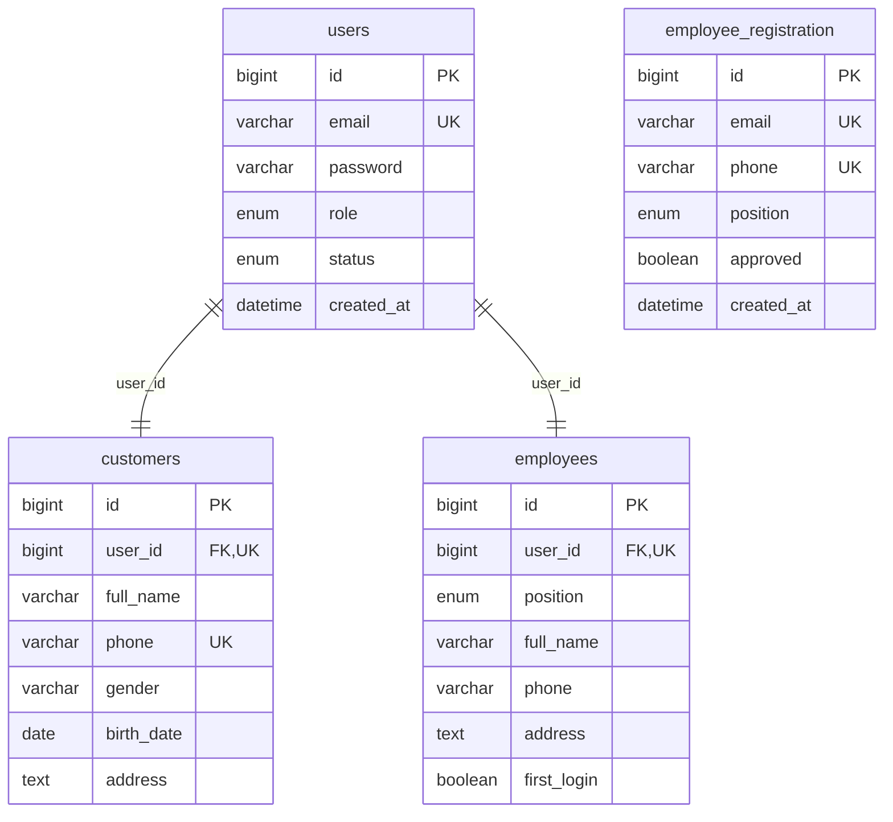
```mermaid
erDiagram
    users {
        bigint id PK
        varchar email UK
        varchar password
        enum role
        enum status
        datetime created_at
    }
    
    customers {
        bigint id PK
        bigint user_id FK,UK
        varchar full_name
        varchar phone UK
        varchar gender
        date birth_date
        text address
    }
    
    employees {
        bigint id PK
        bigint user_id FK,UK
        enum position
        varchar full_name
        varchar phone
        text address
        boolean first_login
    }
    
    employee_registration {
        bigint id PK
        varchar email UK
        varchar phone UK
        enum position
        boolean approved
        datetime created_at
    }
    
    users ||--|| customers : "user_id"
    users ||--|| employees : "user_id"
```

### ERD Chi Tiết - Module Order & Payment

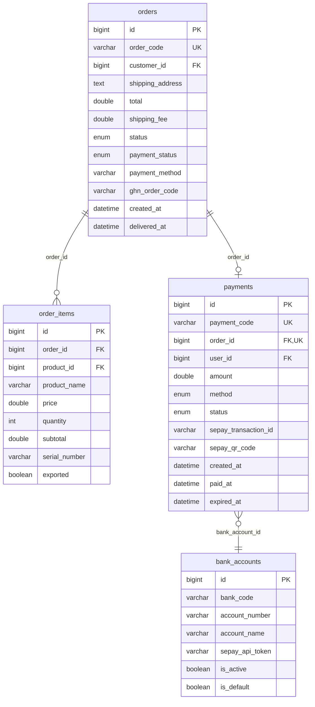
```mermaid
erDiagram
    orders {
        bigint id PK
        varchar order_code UK
        bigint customer_id FK
        text shipping_address
        double total
        double shipping_fee
        enum status
        enum payment_status
        varchar payment_method
        varchar ghn_order_code
        datetime created_at
        datetime delivered_at
    }
    
    order_items {
        bigint id PK
        bigint order_id FK
        bigint product_id FK
        varchar product_name
        double price
        int quantity
        double subtotal
        varchar serial_number
        boolean exported
    }
    
    payments {
        bigint id PK
        varchar payment_code UK
        bigint order_id FK,UK
        bigint user_id FK
        double amount
        enum method
        enum status
        varchar sepay_transaction_id
        varchar sepay_qr_code
        datetime created_at
        datetime paid_at
        datetime expired_at
    }
    
    bank_accounts {
        bigint id PK
        varchar bank_code
        varchar account_number
        varchar account_name
        varchar sepay_api_token
        boolean is_active
        boolean is_default
    }
    
    orders ||--o{ order_items : "order_id"
    orders ||--o| payments : "order_id"
    payments }o--|| bank_accounts : "bank_account_id"
```


### ERD Chi Tiết - Module Inventory

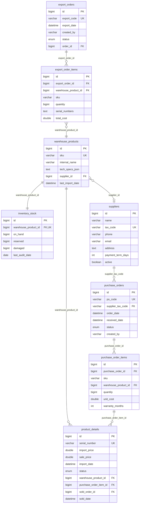
```mermaid
erDiagram
    warehouse_products {
        bigint id PK
        varchar sku UK
        varchar internal_name
        text tech_specs_json
        bigint supplier_id FK
        datetime last_import_date
    }
    
    inventory_stock {
        bigint id PK
        bigint warehouse_product_id FK,UK
        bigint on_hand
        bigint reserved
        bigint damaged
        date last_audit_date
    }
    
    suppliers {
        bigint id PK
        varchar name
        varchar tax_code UK
        varchar phone
        varchar email
        text address
        int payment_term_days
        boolean active
    }
    
    purchase_orders {
        bigint id PK
        varchar po_code UK
        varchar supplier_tax_code FK
        datetime order_date
        datetime received_date
        enum status
        varchar created_by
    }
    
    purchase_order_items {
        bigint id PK
        bigint purchase_order_id FK
        varchar sku
        bigint warehouse_product_id FK
        bigint quantity
        double unit_cost
        int warranty_months
    }
    
    product_details {
        bigint id PK
        varchar serial_number UK
        double import_price
        double sale_price
        datetime import_date
        enum status
        bigint warehouse_product_id FK
        bigint purchase_order_item_id FK
        bigint sold_order_id FK
        datetime sold_date
    }
    
    export_orders {
        bigint id PK
        varchar export_code UK
        datetime export_date
        varchar created_by
        enum status
        bigint order_id FK
    }
    
    export_order_items {
        bigint id PK
        bigint export_order_id FK
        bigint warehouse_product_id FK
        varchar sku
        bigint quantity
        text serial_numbers
        double total_cost
    }
    
    warehouse_products ||--|| inventory_stock : "warehouse_product_id"
    warehouse_products }o--o| suppliers : "supplier_id"
    warehouse_products ||--o{ product_details : "warehouse_product_id"
    
    suppliers ||--o{ purchase_orders : "supplier_tax_code"
    purchase_orders ||--o{ purchase_order_items : "purchase_order_id"
    purchase_order_items ||--o{ product_details : "purchase_order_item_id"
    
    export_orders ||--o{ export_order_items : "export_order_id"
    export_order_items }o--|| warehouse_products : "warehouse_product_id"
```

### ERD Chi Tiết - Module Accounting

```mermaid
erDiagram
    financial_transaction {
        bigint id PK
        varchar transaction_code
        varchar order_id
        enum type
        enum category
        decimal amount
        text description
        datetime transaction_date
        varchar created_by
        datetime created_at
    }
    
    supplier_payables {
        bigint id PK
        varchar payable_code UK
        bigint supplier_id FK
        bigint purchase_order_id FK
        decimal total_amount
        decimal paid_amount
        decimal remaining_amount
        enum status
        date invoice_date
        date due_date
        int payment_term_days
        datetime created_at
    }
    
    supplier_payments {
        bigint id PK
        varchar payment_code UK
        bigint payable_id FK
        decimal amount
        date payment_date
        enum payment_method
        varchar reference_number
        text note
        datetime created_at
        varchar created_by
    }
    
    payment_reconciliation {
        bigint id PK
        varchar order_id
        varchar transaction_id
        varchar gateway
        decimal system_amount
        decimal gateway_amount
        decimal discrepancy
        enum status
        datetime transaction_date
        datetime reconciled_at
        varchar reconciled_by
    }
    
    accounting_period {
        bigint id PK
        varchar name
        date start_date
        date end_date
        enum status
        decimal total_revenue
        int total_orders
        decimal discrepancy_amount
        double discrepancy_rate
        varchar closed_by
        datetime closed_at
    }
    
    tax_report {
        bigint id PK
        varchar report_code
        date period_start
        date period_end
        enum tax_type
        decimal taxable_revenue
        decimal tax_rate
        decimal tax_amount
        decimal paid_tax
        decimal remaining_tax
        enum status
        varchar submitted_by
        datetime submitted_at
    }
    
    supplier_payables ||--o{ supplier_payments : "payable_id"
```


## Luồng Tích Hợp End-to-End

### Sơ Đồ Tổng Quan - Từ Đặt Hàng Đến Giao Hàng

```mermaid
sequenceDiagram
    actor Customer
    actor SalesStaff
    actor WarehouseStaff
    participant System
    participant GHN
    participant SePay
    participant Accounting
    
    Customer->>System: 1. Browse & Add to cart
    Customer->>System: 2. Checkout (address, payment)
    
    alt Payment = Online
        System->>SePay: 3a. Generate QR code
        SePay-->>Customer: Show QR
        Customer->>SePay: 3b. Transfer money
        SePay->>System: 3c. Webhook (payment confirmed)
        System->>System: Status: CONFIRMED
    else Payment = COD
        System->>System: Status: CONFIRMED
    end
    
    SalesStaff->>System: 4. Review & confirm order
    System->>System: Status: CONFIRMED
    
    WarehouseStaff->>System: 5. Create export order
    System->>System: Check stock availability
    System->>System: Status: READY_TO_PICK
    
    WarehouseStaff->>System: 6. Scan serials & complete export
    System->>System: Decrease inventory
    System->>System: Status: READY_TO_SHIP
    
    WarehouseStaff->>System: 7. Create GHN order
    System->>GHN: Create shipping order
    GHN-->>System: Order code
    System->>System: Status: SHIPPING
    
    GHN->>GHN: 8. Deliver package
    GHN->>System: 9. Webhook (delivered)
    System->>System: Status: DELIVERED
    
    System->>Accounting: 10. Record revenue
    Accounting->>Accounting: Create financial transactions
    
    System->>Customer: 11. Notification (delivered)
```

## Error Handling Strategy

### Retry Mechanism

**Webhook Processing**:
- GHN webhook: Return 5xx để trigger retry
- SePay webhook: Return 200 để tránh duplicate
- Idempotency: Check trước khi xử lý

**External API Calls**:
- GHN API: Retry 3 lần với exponential backoff
- SePay API: Retry 2 lần
- Cloudinary: Retry 3 lần

**Database Transactions**:
- Optimistic locking cho inventory updates
- Pessimistic locking (SELECT FOR UPDATE) cho critical sections
- Transaction isolation level: READ_COMMITTED

### Logging Strategy

**Log Levels**:
```
ERROR: System errors, exceptions, failed transactions
WARN: Business rule violations, validation failures
INFO: Important business events (order created, payment completed)
DEBUG: Detailed flow information (development only)
```

**Log Context**:
- Request ID (UUID) cho mỗi request
- User ID/Email
- Order ID/Code
- Timestamp
- Stack trace (cho errors)

**Log Aggregation**:
- Centralized logging (future: ELK stack)
- Log rotation: Daily
- Retention: 30 days


## Testing Strategy

### Unit Testing

**Coverage Target**: 70% cho business logic

**Test Categories**:
1. Service Layer Tests
   - OrderService: Order creation, status transitions
   - InventoryService: Stock management, reservations
   - AccountingService: Transaction recording
   - PaymentService: Payment processing

2. Repository Tests
   - Custom query methods
   - Complex joins
   - Aggregations

3. Utility Tests
   - Date calculations
   - Price calculations
   - Validation logic

**Testing Framework**:
- JUnit 5
- Mockito for mocking
- Spring Boot Test
- H2 in-memory database for integration tests

### Integration Testing

**API Integration Tests**:
```java
@SpringBootTest(webEnvironment = WebEnvironment.RANDOM_PORT)
@AutoConfigureMockMvc
class OrderIntegrationTest {
    
    @Test
    void shouldCreateOrderSuccessfully() {
        // Given: Customer with cart
        // When: POST /api/orders/create
        // Then: Order created with PENDING status
        // And: Stock reserved
    }
    
    @Test
    void shouldRejectOrderWhenInsufficientStock() {
        // Given: Product with low stock
        // When: POST /api/orders/create with high quantity
        // Then: 400 Bad Request
        // And: Error message about insufficient stock
    }
}
```

**External Service Integration**:
- Mock GHN API responses
- Mock SePay webhook calls
- Test error scenarios

### End-to-End Testing

**Critical User Flows**:
1. Complete order flow (browse → checkout → payment → delivery)
2. Warehouse flow (import → export → ship)
3. Accounting flow (order → payment → revenue recording)

**Testing Tools**:
- Selenium/Playwright for UI testing
- Postman/Newman for API testing
- Test data fixtures

### Performance Testing

**Load Testing Scenarios**:
- 100 concurrent users browsing products
- 50 concurrent checkouts
- 20 concurrent warehouse operations

**Performance Targets**:
- API response time: < 500ms (p95)
- Page load time: < 2s
- Database query time: < 100ms

**Tools**:
- JMeter for load testing
- New Relic/DataDog for monitoring (future)


## Correctness Properties

*A property is a characteristic or behavior that should hold true across all valid executions of a system-essentially, a formal statement about what the system should do. Properties serve as the bridge between human-readable specifications and machine-verifiable correctness guarantees.*

### Property 1: Order Creation Consistency
*For any* valid cart with available products, creating an order should result in an order with initial status matching the payment method (PENDING_PAYMENT for online, CONFIRMED for COD) and all cart items correctly transferred to order items.
**Validates: Requirements 1.1, 1.3**

### Property 2: Address Validation Completeness
*For any* order creation request, if any required address field (province, district, ward, detailed address) is missing or invalid, the system should reject the order creation and return a specific error message identifying the invalid field.
**Validates: Requirements 1.2**

### Property 3: Order Code Uniqueness
*For any* set of orders created in the system, all order codes should be unique - no two orders should ever have the same order code.
**Validates: Requirements 1.4**

### Property 4: Status Transition Validity
*For any* order status update, the transition should only succeed if it follows valid state machine rules (e.g., PENDING→CONFIRMED is valid, PENDING→SHIPPING is invalid), otherwise the system should reject with an error.
**Validates: Requirements 2.1, 2.5**

### Property 5: Inventory Import Atomicity
*For any* completed import transaction, the inventory stock's onHand and available quantities should increase by exactly the imported quantity, and if the import has a supplier, a corresponding supplier payable should be created.
**Validates: Requirements 3.2, 3.3**

### Property 6: Export Stock Validation
*For any* export order creation attempt, if any product's available quantity is less than the requested quantity, the system should reject the export and return the list of products with insufficient stock.
**Validates: Requirements 4.1**

### Property 7: Export Completion Consistency
*For any* completed export order, the inventory stock's available quantity and onHand should both decrease by the exported quantity, and the associated order status should transition to READY_TO_SHIP.
**Validates: Requirements 4.3**

### Property 8: GHN Order Data Completeness
*For any* GHN order creation request, the payload should contain all required fields: province_code, district_code, ward_code, detailed address, product information, COD amount (if applicable), and service type.
**Validates: Requirements 5.2**

### Property 9: GHN Order Creation Side Effects
*For any* successful GHN order creation, the system should store the returned ghnOrderCode in the order record and update the order status to SHIPPING atomically.
**Validates: Requirements 5.3**

### Property 10: Webhook Delivery Processing
*For any* valid GHN webhook indicating delivery success, the system should update the order status to DELIVERED and trigger revenue recognition in the accounting system.
**Validates: Requirements 6.2, 7.1**

### Property 11: Payment Webhook Matching
*For any* SePay webhook received, the system should successfully match it to an existing payment record using the payment code in the transaction content, and verify the amount matches before confirming payment.
**Validates: Requirements 8.3**

### Property 12: Payment Confirmation Atomicity
*For any* confirmed payment, the system should atomically update both the payment status to COMPLETED and the order payment_status to PAID, and create a corresponding financial transaction record.
**Validates: Requirements 8.4**

### Property 13: Inventory Quantity Relationship
*For any* warehouse product at any point in time, the relationship (available = onHand - reserved - damaged) should always hold true, and available quantity should never be negative.
**Validates: Requirements 9.1, 9.2**

### Property 14: Authorization Enforcement
*For any* protected API endpoint access, if the JWT token is invalid/expired or the user's role lacks the required permission, the system should return 401 (unauthorized) or 403 (forbidden) respectively and deny access.
**Validates: Requirements 10.2**

### Property 15: Revenue Calculation Accuracy
*For any* date range, the revenue report should calculate total revenue as the sum of (order.total - order.shippingFee) for all orders with status DELIVERED and deliveredAt within the date range.
**Validates: Requirements 11.2**

### Property 16: Product Creation Validation
*For any* product creation attempt, if any required field (name, category, price, or images) is missing, the system should reject the creation and return a validation error specifying which fields are missing.
**Validates: Requirements 12.1**

### Property 17: Supplier Payment Consistency
*For any* supplier payment recorded, the supplier payable's paid_amount should increase by the payment amount, remaining_amount should decrease by the same amount, and a financial transaction of type EXPENSE should be created.
**Validates: Requirements 13.2**

### Property 18: Serial Number Uniqueness
*For any* set of serial numbers generated or used in the system, all serial numbers should be unique - no serial number should be assigned to multiple product units or used in multiple export transactions.
**Validates: Requirements 15.1**

# Additional Business Flows for Design Document

## Luồng 7: Quản Lý Sản Phẩm (Product Management)

### 7.1. Kịch Bản Chuẩn

**Mô tả**: Admin/Product Manager quản lý catalog sản phẩm

**Các bước tạo sản phẩm**:
1. Admin truy cập trang quản lý sản phẩm
2. Click "Tạo sản phẩm mới"
3. Nhập thông tin bắt buộc:
   - Tên sản phẩm
   - Category
   - Giá bán
   - Mô tả
4. Upload ít nhất 1 ảnh sản phẩm
5. Upload lên Cloudinary
6. Lưu URL ảnh vào database
7. Tạo product record
8. Nếu có nhiều ảnh: Lưu vào product_images table
9. Đánh dấu ảnh chính (is_primary = true)
10. Product được tạo với status ACTIVE

**Điều kiện tiên quyết**:
- User có role ADMIN hoặc PRODUCT_MANAGER
- Category đã tồn tại
- File ảnh hợp lệ (jpg, png, webp)

**Kết quả mong đợi**:
- Product được tạo thành công
- Ảnh được upload lên Cloudinary
- Product hiển thị trên website


### 7.2. Kịch Bản Ngoại Lệ

#### Exception 7.1: Thiếu thông tin bắt buộc
**Trigger**: Tạo product nhưng thiếu name, category, price hoặc image

**Xử lý**:
1. Validate tất cả required fields
2. Trả về 400 Bad Request
3. Error message chi tiết: "Thiếu trường X"
4. Frontend highlight các trường lỗi
5. User sửa và submit lại

**Kết quả**: Product không được tạo, validation error rõ ràng

#### Exception 7.2: Upload ảnh thất bại
**Trigger**: Cloudinary API error hoặc network timeout

**Xử lý**:
1. Catch CloudinaryException
2. Retry upload 3 lần
3. Nếu vẫn fail: Rollback transaction
4. Không tạo product record
5. Hiển thị lỗi: "Không thể upload ảnh, vui lòng thử lại"

**Kết quả**: Product không được tạo, user thử lại

#### Exception 7.3: Duplicate product name
**Trigger**: Tạo product với tên đã tồn tại

**Xử lý**:
1. Check unique constraint trên name
2. Nếu duplicate: Trả về 409 Conflict
3. Suggest thêm variant hoặc đổi tên
4. Cho phép user sửa tên

**Kết quả**: Product không được tạo, user đổi tên


## Luồng 8: Dashboard và Báo Cáo (Dashboard & Reporting)

### 8.1. Kịch Bản Chuẩn

**Mô tả**: User xem dashboard và báo cáo theo role

**Dashboard theo role**:

**Admin Dashboard**:
- Tổng doanh thu (theo ngày/tuần/tháng)
- Số đơn hàng (total, pending, confirmed, delivered)
- Tồn kho cảnh báo (low stock products)
- Công nợ NCC chưa thanh toán
- Top selling products
- Revenue chart (line chart theo thời gian)

**Sales Dashboard**:
- Đơn hàng cần xử lý (PENDING, CONFIRMED)
- Đơn hàng hôm nay
- Conversion rate
- Customer statistics

**Warehouse Dashboard**:
- Tồn kho hiện tại
- Phiếu nhập/xuất pending
- Low stock alerts
- Inventory turnover

**Accountant Dashboard**:
- Doanh thu/Chi phí hôm nay
- Công nợ NCC
- Payment reconciliation status
- Profit margin

**Các bước xem báo cáo**:
1. User truy cập dashboard
2. Hệ thống check role
3. Load statistics phù hợp với role
4. Hiển thị charts và metrics
5. User có thể filter theo date range
6. Export báo cáo ra Excel/PDF (optional)


### 8.2. Kịch Bản Ngoại Lệ

#### Exception 8.1: Báo cáo quá lớn (timeout)
**Trigger**: Generate report cho date range rộng (> 1 năm)

**Xử lý**:
1. Set timeout 30s cho query
2. Nếu timeout: Return partial results
3. Suggest user thu hẹp date range
4. Hoặc schedule background job để generate
5. Email kết quả khi xong

**Kết quả**: User nhận được suggestion hoặc async report

#### Exception 8.2: Không có dữ liệu
**Trigger**: Date range không có transactions

**Xử lý**:
1. Query trả về empty result
2. Hiển thị "Không có dữ liệu trong khoảng thời gian này"
3. Suggest expand date range
4. Show empty state UI

**Kết quả**: User biết không có data, không phải lỗi hệ thống

## Luồng 9: Đối Soát Công Nợ NCC (Supplier Payable Reconciliation)

### 9.1. Kịch Bản Chuẩn

**Mô tả**: Accountant đối soát và thanh toán công nợ NCC

**Các bước**:
1. Accountant truy cập trang Supplier Payables
2. Xem danh sách công nợ:
   - Supplier name
   - Total amount
   - Paid amount
   - Remaining amount
   - Due date
   - Status (UNPAID, PARTIAL, PAID, OVERDUE)
3. Filter theo supplier, status, due date
4. Chọn payable cần thanh toán
5. Nhập số tiền thanh toán
6. Chọn payment method (Bank Transfer, Cash, Check)
7. Nhập reference number (nếu có)
8. Confirm payment
9. Hệ thống:
   - Tạo supplier_payment record
   - Cập nhật payable (paid_amount, remaining_amount, status)
   - Tạo financial_transaction (EXPENSE)
10. In phiếu chi (optional)


### 9.2. Kịch Bản Ngoại Lệ

#### Exception 9.1: Thanh toán vượt quá công nợ
**Trigger**: Payment amount > remaining amount

**Xử lý**:
1. Validate payment amount
2. Nếu > remaining: Return 400 Bad Request
3. Error: "Số tiền thanh toán vượt quá công nợ còn lại"
4. Show remaining amount
5. User sửa lại số tiền

**Kết quả**: Payment không được tạo, user nhập đúng số tiền

#### Exception 9.2: Aging analysis
**Trigger**: Accountant xem báo cáo công nợ theo độ tuổi

**Xử lý**:
1. Group payables theo aging buckets:
   - Current (chưa đến hạn)
   - 1-30 days overdue
   - 31-60 days overdue
   - 61-90 days overdue
   - 90+ days overdue
2. Calculate total cho mỗi bucket
3. Highlight overdue items
4. Sort by due date

**Kết quả**: Accountant thấy rõ công nợ cần ưu tiên

## Luồng 10: Multi-Account Banking

### 10.1. Kịch Bản Chuẩn

**Mô tả**: Hệ thống quản lý nhiều tài khoản ngân hàng

**Các bước cấu hình**:
1. Admin truy cập Bank Accounts management
2. Add new bank account:
   - Bank code (VCB, TCB, MB, etc.)
   - Account number
   - Account name
   - SePay API token (unique per account)
   - Set as default (yes/no)
   - Set as active (yes/no)
3. Save configuration
4. Test connection với SePay API
5. Nếu OK: Account ready to use


**Xử lý webhook với multiple accounts**:
1. SePay webhook chứa account_number
2. Match với bank_accounts table
3. Identify which account received payment
4. Create payment record với bank_account_id
5. Update balance của account đó
6. Create financial_transaction linked to bank_account

### 10.2. Kịch Bản Ngoại Lệ

#### Exception 10.1: Webhook với account không tồn tại
**Trigger**: Webhook có account_number không match

**Xử lý**:
1. Search bank_accounts by account_number
2. Nếu không tìm thấy:
   - Log warning với account_number
   - Return 404 to SePay
   - Alert admin
   - Có thể là account của môi trường khác

**Kết quả**: Webhook bị reject, admin investigate

#### Exception 10.2: Deactivate bank account
**Trigger**: Admin deactivate một account đang dùng

**Xử lý**:
1. Set is_active = false
2. Không cho tạo payment mới với account này
3. Existing payments vẫn valid
4. Historical transactions vẫn giữ nguyên
5. Có thể reactivate sau

**Kết quả**: Account bị vô hiệu hóa, data preserved


## Luồng 11: Serial Number Tracking

### 11.1. Kịch Bản Chuẩn

**Mô tả**: Tracking sản phẩm qua serial number/QR code

**Các bước generate serial**:
1. Khi tạo export order, system generate serial numbers
2. Format: {SKU}-{YYYYMMDD}-{SEQUENCE}
   - Ví dụ: LAPTOP001-20241223-00001
3. Tạo product_details records:
   - serial_number (unique)
   - warehouse_product_id
   - import_price
   - sale_price
   - status = IN_STOCK
4. Generate QR code cho mỗi serial
5. QR code chứa: serial_number, product_name, price
6. In QR code labels

**Scanning workflow**:
1. Warehouse staff scan QR code
2. Decode serial number
3. Validate với database:
   - Serial tồn tại?
   - Status = IN_STOCK?
   - Thuộc warehouse_product đúng không?
4. Nếu OK: Add vào export order
5. Update product_detail status = RESERVED
6. Khi complete export:
   - Update status = SOLD
   - Set sold_order_id
   - Set sold_date


### 11.2. Kịch Bản Ngoại Lệ

#### Exception 11.1: Serial đã được sử dụng
**Trigger**: Scan serial có status = SOLD

**Xử lý**:
1. Check product_detail status
2. Nếu SOLD:
   - Show error: "Serial đã được xuất trong đơn {orderCode}"
   - Show sold_date
   - Không cho add vào export
3. Staff scan serial khác

**Kết quả**: Serial bị reject, tránh duplicate

#### Exception 11.2: Serial không tồn tại
**Trigger**: Scan QR code không valid

**Xử lý**:
1. Decode QR code
2. Search product_details by serial_number
3. Nếu không tìm thấy:
   - Error: "Serial không tồn tại trong hệ thống"
   - Có thể là QR code bị hỏng
   - Hoặc serial của sản phẩm khác
4. Staff check lại QR code

**Kết quả**: Serial bị reject, staff verify

#### Exception 11.3: Serial không khớp product
**Trigger**: Scan serial của product A cho export order của product B

**Xử lý**:
1. Check serial's warehouse_product_id
2. Compare với export_order_item's warehouse_product_id
3. Nếu không khớp:
   - Error: "Serial thuộc sản phẩm {productName}, không phải {expectedProduct}"
   - Highlight sản phẩm đúng cần scan
4. Staff scan đúng serial

**Kết quả**: Tránh xuất nhầm sản phẩm

