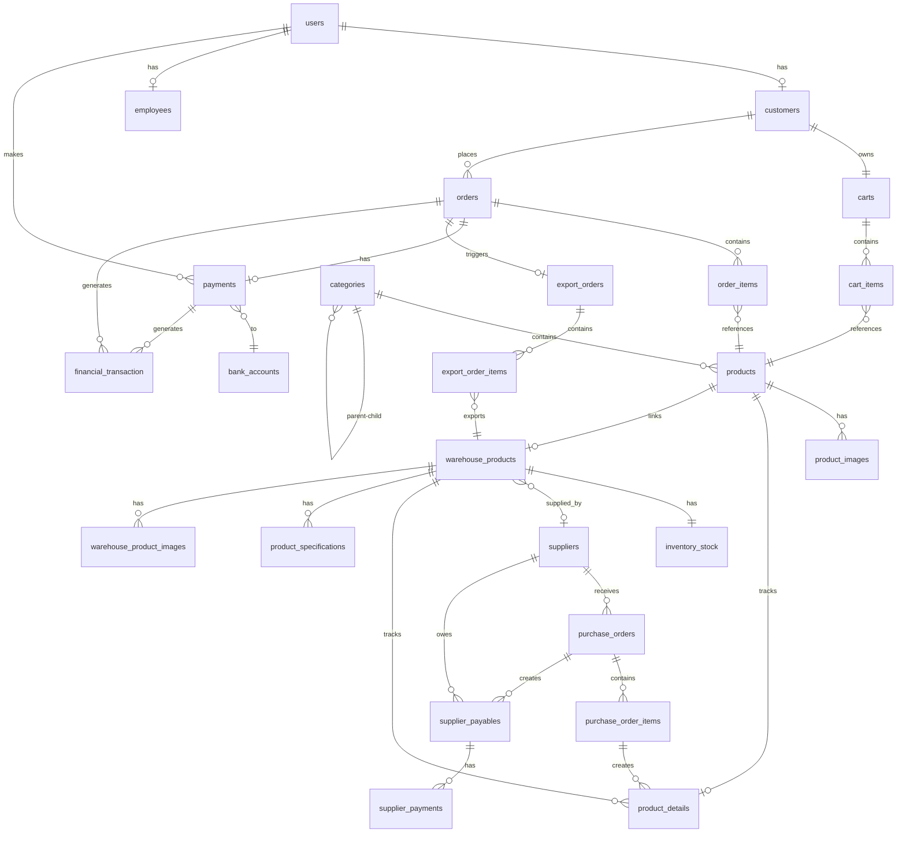

# ERD và Phân Tích Quan Hệ - Hệ Thống TMDT

## 1. Tổng Quan Database

Hệ thống sử dụng **MySQL 8.0** với **30 bảng** được tổ chức thành 7 modules chức năng:

| Module | Số Bảng | Mục Đích |
|--------|---------|----------|
| Auth | 5 | Quản lý người dùng, xác thực, phân quyền |
| Product | 3 | Quản lý sản phẩm và danh mục |
| Cart | 2 | Giỏ hàng của khách hàng |
| Order | 2 | Đơn hàng và chi tiết đơn |
| Payment | 2 | Thanh toán và tài khoản ngân hàng |
| Inventory | 10 | Quản lý kho, nhập/xuất, NCC |
| Accounting | 6 | Kế toán, công nợ, báo cáo tài chính |

**Tổng cộng**: 30 bảng, 150+ cột, 50+ foreign keys


## 2. ERD Tổng Quan




## 3. Phân Tích Chi Tiết Các Quan Hệ

### 3.1. Module Auth - Quan Hệ Người Dùng

#### Relationship 1: users (1) ↔ (1) customers
**Loại**: One-to-One (Mandatory)
**Foreign Key**: `customers.user_id → users.id`
**Cascade**: ON DELETE CASCADE

**Ý nghĩa business**:
- Mỗi user với role CUSTOMER phải có đúng 1 customer record
- Customer record chứa thông tin bổ sung: full_name, phone, address, birth_date
- Khi xóa user, customer record cũng bị xóa (cascade)
- Đảm bảo tính toàn vẹn: Không có customer nào không có user

**Ví dụ**:
```
User (id=1, email="customer@example.com", role=CUSTOMER)
  ↓
Customer (id=1, user_id=1, full_name="Nguyễn Văn A", phone="0901234567")
```

#### Relationship 2: users (1) ↔ (1) employees
**Loại**: One-to-One (Mandatory)
**Foreign Key**: `employees.user_id → users.id`
**Cascade**: ON DELETE CASCADE

**Ý nghĩa business**:
- Mỗi user với role EMPLOYEE phải có đúng 1 employee record
- Employee record chứa: position (SALE, WAREHOUSE, etc.), first_login flag
- Position xác định quyền truy cập các chức năng
- first_login = true yêu cầu đổi password lần đầu

**Ví dụ**:
```
User (id=2, email="warehouse@company.com", role=EMPLOYEE)
  ↓
Employee (id=1, user_id=2, position=WAREHOUSE, first_login=true)
```

#### Relationship 3: users (1) ↔ (N) payments
**Loại**: One-to-Many
**Foreign Key**: `payments.user_id → users.id`

**Ý nghĩa business**:
- Một user có thể tạo nhiều payments
- Tracking ai tạo payment (customer hoặc admin)
- Hỗ trợ audit trail và báo cáo

### 3.2. Module Product - Quan Hệ Sản Phẩm

#### Relationship 4: categories (1) ↔ (N) categories (Self-Join)
**Loại**: One-to-Many (Self-referencing)
**Foreign Key**: `categories.parent_id → categories.id`
**Cascade**: ON DELETE SET NULL

**Ý nghĩa business**:
- Hỗ trợ category hierarchy (danh mục cha-con)
- Ví dụ: Điện tử → Laptop → Laptop Gaming
- parent_id = NULL: Category gốc (root)
- Khi xóa parent, children vẫn tồn tại nhưng parent_id = NULL

**Ví dụ**:
```
Category (id=1, name="Điện tử", parent_id=NULL)
  ↓
Category (id=2, name="Laptop", parent_id=1)
  ↓
Category (id=3, name="Laptop Gaming", parent_id=2)
```

#### Relationship 5: categories (1) ↔ (N) products
**Loại**: One-to-Many
**Foreign Key**: `products.category_id → categories.id`

**Ý nghĩa business**:
- Mỗi product thuộc về 1 category
- Category giúp tổ chức và filter sản phẩm
- Hỗ trợ navigation và SEO

#### Relationship 6: products (1) ↔ (N) product_images
**Loại**: One-to-Many
**Foreign Key**: `product_images.product_id → products.id`
**Cascade**: ON DELETE CASCADE

**Ý nghĩa business**:
- Một product có thể có nhiều ảnh
- is_primary = true: Ảnh chính hiển thị đầu tiên
- display_order: Thứ tự hiển thị ảnh
- Khi xóa product, tất cả ảnh cũng bị xóa

**Ví dụ**:
```
Product (id=1, name="iPhone 15")
  ↓
  ├─ ProductImage (id=1, is_primary=true, display_order=0, url="front.jpg")
  ├─ ProductImage (id=2, is_primary=false, display_order=1, url="back.jpg")
  └─ ProductImage (id=3, is_primary=false, display_order=2, url="side.jpg")
```

#### Relationship 7: products (1) ↔ (1) warehouse_products
**Loại**: One-to-One (Optional)
**Foreign Key**: `products.warehouse_product_id → warehouse_products.id`

**Ý nghĩa business**:
- Tách biệt sản phẩm public (products) và sản phẩm kho (warehouse_products)
- products: Hiển thị cho khách hàng, có giá bán
- warehouse_products: Quản lý nội bộ, có giá nhập, supplier
- Linh hoạt: Có thể có warehouse_product chưa publish ra products

**Ví dụ**:
```
WarehouseProduct (id=1, sku="WH-IPHONE15", internal_name="iPhone 15 Pro Max")
  ↑
Product (id=1, warehouse_product_id=1, name="iPhone 15 Pro Max", price=29990000)
```


### 3.3. Module Cart & Order - Quan Hệ Giỏ Hàng và Đơn Hàng

#### Relationship 8: customers (1) ↔ (1) carts
**Loại**: One-to-One (Mandatory)
**Foreign Key**: `carts.customer_id → customers.id`
**Cascade**: ON DELETE CASCADE

**Ý nghĩa business**:
- Mỗi customer có đúng 1 giỏ hàng persistent
- Giỏ hàng tồn tại xuyên suốt các session
- Khi customer đăng nhập, giỏ hàng được restore
- Unique constraint đảm bảo không duplicate cart

#### Relationship 9: carts (1) ↔ (N) cart_items
**Loại**: One-to-Many
**Foreign Key**: `cart_items.cart_id → carts.id`
**Cascade**: ON DELETE CASCADE

**Ý nghĩa business**:
- Một giỏ hàng chứa nhiều items
- Mỗi item: product_id, quantity, price (snapshot)
- Price được snapshot để tránh thay đổi giá ảnh hưởng giỏ hàng
- Khi xóa cart, tất cả items cũng bị xóa

#### Relationship 10: customers (1) ↔ (N) orders
**Loại**: One-to-Many
**Foreign Key**: `orders.customer_id → customers.id`

**Ý nghĩa business**:
- Một customer có thể đặt nhiều đơn hàng
- Tracking lịch sử mua hàng
- Hỗ trợ customer analytics và marketing

#### Relationship 11: orders (1) ↔ (N) order_items
**Loại**: One-to-Many
**Foreign Key**: `order_items.order_id → orders.id`
**Cascade**: ON DELETE CASCADE

**Ý nghĩa business**:
- Một đơn hàng chứa nhiều sản phẩm
- Snapshot thông tin: product_name, price (tại thời điểm đặt)
- serial_number: Tracking serial cụ thể được xuất
- reserved/exported flags: Tracking trạng thái inventory

**Ví dụ**:
```
Order (id=1, order_code="ORD-20241223-001", total=50000000)
  ↓
  ├─ OrderItem (id=1, product_name="iPhone 15", price=29990000, quantity=1)
  ├─ OrderItem (id=2, product_name="AirPods Pro", price=6990000, quantity=2)
  └─ OrderItem (id=3, product_name="Case", price=500000, quantity=2)
```

#### Relationship 12: orders (1) ↔ (1) payments
**Loại**: One-to-One (Optional)
**Foreign Key**: `payments.order_id → orders.id` (UNIQUE)
**Cascade**: ON DELETE CASCADE

**Ý nghĩa business**:
- Mỗi order có tối đa 1 payment record
- COD orders: Không có payment record hoặc có với method=COD
- Online payment: Có payment record với QR code, transaction info
- Unique constraint đảm bảo không duplicate payment

### 3.4. Module Inventory - Quan Hệ Quản Lý Kho

#### Relationship 13: warehouse_products (1) ↔ (1) inventory_stock
**Loại**: One-to-One (Mandatory)
**Foreign Key**: `inventory_stock.warehouse_product_id → warehouse_products.id` (UNIQUE)

**Ý nghĩa business**:
- Mỗi warehouse_product có đúng 1 inventory_stock record
- Tracking 3 số liệu quan trọng:
  - **on_hand**: Tổng số lượng thực tế trong kho
  - **reserved**: Số lượng đã được đặt trước (cho orders)
  - **damaged**: Số lượng hỏng
- **available = on_hand - reserved - damaged**: Số lượng có thể bán
- Unique constraint đảm bảo không duplicate stock record

**Ví dụ**:
```
WarehouseProduct (id=1, sku="IPHONE15-001")
  ↓
InventoryStock (id=1, warehouse_product_id=1, on_hand=100, reserved=20, damaged=5)
  → available = 100 - 20 - 5 = 75
```

#### Relationship 14: warehouse_products (N) ↔ (1) suppliers
**Loại**: Many-to-One (Optional)
**Foreign Key**: `warehouse_products.supplier_id → suppliers.id`

**Ý nghĩa business**:
- Một supplier cung cấp nhiều products
- Một product có thể có 1 supplier chính (hoặc không)
- Tracking nguồn gốc sản phẩm
- Hỗ trợ quản lý công nợ và đặt hàng

#### Relationship 15: suppliers (1) ↔ (N) purchase_orders
**Loại**: One-to-Many
**Foreign Key**: `purchase_orders.supplier_tax_code → suppliers.tax_code`

**Ý nghĩa business**:
- Một supplier có nhiều purchase orders (đơn nhập hàng)
- Sử dụng tax_code thay vì id để đảm bảo tính duy nhất theo pháp luật
- Tracking lịch sử nhập hàng từ supplier
- Hỗ trợ phân tích supplier performance

#### Relationship 16: purchase_orders (1) ↔ (N) purchase_order_items
**Loại**: One-to-Many
**Foreign Key**: `purchase_order_items.purchase_order_id → purchase_orders.id`

**Ý nghĩa business**:
- Một PO chứa nhiều items (sản phẩm khác nhau)
- Mỗi item: SKU, quantity, unit_cost, warranty_months
- unit_cost: Giá nhập từ supplier
- Tracking chi tiết từng sản phẩm trong đơn nhập

**Ví dụ**:
```
PurchaseOrder (id=1, po_code="PO-20241223-001", supplier="Apple VN")
  ↓
  ├─ POItem (id=1, sku="IPHONE15", quantity=50, unit_cost=25000000)
  ├─ POItem (id=2, sku="AIRPODS", quantity=100, unit_cost=5000000)
  └─ POItem (id=3, sku="CASE", quantity=200, unit_cost=300000)
```

#### Relationship 17: warehouse_products (1) ↔ (N) product_details
**Loại**: One-to-Many
**Foreign Key**: `product_details.warehouse_product_id → warehouse_products.id`

**Ý nghĩa business**:
- Tracking từng serial/IMEI riêng biệt
- Mỗi product_detail = 1 unit vật lý cụ thể
- Tracking: import_price, sale_price, status, sold_order_id
- Hỗ trợ warranty tracking và truy xuất nguồn gốc

**Ví dụ**:
```
WarehouseProduct (id=1, sku="IPHONE15")
  ↓
  ├─ ProductDetail (id=1, serial="IMEI001", status=IN_STOCK)
  ├─ ProductDetail (id=2, serial="IMEI002", status=SOLD, sold_order_id=123)
  └─ ProductDetail (id=3, serial="IMEI003", status=DEFECTIVE)
```


#### Relationship 18: purchase_order_items (1) ↔ (N) product_details
**Loại**: One-to-Many (Optional)
**Foreign Key**: `product_details.purchase_order_item_id → purchase_order_items.id`

**Ý nghĩa business**:
- Liên kết serial với đơn nhập cụ thể
- Tracking nguồn gốc: Serial này nhập từ PO nào
- Hỗ trợ warranty: Biết ngày nhập để tính warranty
- Optional: Có thể có product_detail không liên kết PO (tồn kho cũ)

#### Relationship 19: export_orders (1) ↔ (N) export_order_items
**Loại**: One-to-Many
**Foreign Key**: `export_order_items.export_order_id → export_orders.id`

**Ý nghĩa business**:
- Một phiếu xuất chứa nhiều items
- Mỗi item: SKU, quantity, serial_numbers (comma-separated)
- Tracking chi tiết hàng xuất
- Liên kết với order_id để biết xuất cho đơn nào

#### Relationship 20: export_orders (N) ↔ (1) orders
**Loại**: Many-to-One (Optional)
**Foreign Key**: `export_orders.order_id → orders.id`

**Ý nghĩa business**:
- Một order có thể có nhiều export orders (xuất nhiều lần)
- Export order có thể không liên kết order (xuất hủy, bảo hành)
- Tracking lý do xuất: reason field
- Hỗ trợ audit trail cho inventory

### 3.5. Module Accounting - Quan Hệ Kế Toán

#### Relationship 21: suppliers (1) ↔ (N) supplier_payables
**Loại**: One-to-Many
**Foreign Key**: `supplier_payables.supplier_id → suppliers.id`

**Ý nghĩa business**:
- Một supplier có nhiều khoản công nợ
- Mỗi payable từ 1 purchase order
- Tracking: total_amount, paid_amount, remaining_amount
- Status: UNPAID, PARTIAL, PAID, OVERDUE
- Hỗ trợ quản lý cash flow

**Ví dụ**:
```
Supplier (id=1, name="Apple VN")
  ↓
  ├─ Payable (id=1, total=1000M, paid=500M, remaining=500M, status=PARTIAL)
  ├─ Payable (id=2, total=2000M, paid=2000M, remaining=0, status=PAID)
  └─ Payable (id=3, total=1500M, paid=0, remaining=1500M, status=OVERDUE)
```

#### Relationship 22: purchase_orders (1) ↔ (N) supplier_payables
**Loại**: One-to-Many
**Foreign Key**: `supplier_payables.purchase_order_id → purchase_orders.id`

**Ý nghĩa business**:
- Mỗi PO tạo ra 1 hoặc nhiều payables
- Có thể chia nhỏ công nợ theo kỳ thanh toán
- Liên kết chặt chẽ giữa nhập hàng và công nợ
- Hỗ trợ reconciliation

#### Relationship 23: supplier_payables (1) ↔ (N) supplier_payments
**Loại**: One-to-Many
**Foreign Key**: `supplier_payments.payable_id → supplier_payables.id`

**Ý nghĩa business**:
- Một payable có thể được thanh toán nhiều lần (trả góp)
- Mỗi payment: amount, payment_date, payment_method
- Tự động cập nhật paid_amount và remaining_amount
- Tracking lịch sử thanh toán chi tiết

**Ví dụ**:
```
SupplierPayable (id=1, total=10000000, paid=6000000, remaining=4000000)
  ↓
  ├─ Payment (id=1, amount=3000000, date=2024-01-15, method=BANK_TRANSFER)
  ├─ Payment (id=2, amount=2000000, date=2024-02-15, method=BANK_TRANSFER)
  └─ Payment (id=3, amount=1000000, date=2024-03-15, method=CASH)
```

#### Relationship 24: orders (1) ↔ (N) financial_transaction
**Loại**: One-to-Many
**Foreign Key**: `financial_transaction.order_id → orders.order_code` (String)

**Ý nghĩa business**:
- Một order tạo ra nhiều transactions:
  - REVENUE: Doanh thu từ bán hàng
  - EXPENSE: Phí vận chuyển
  - REFUND: Hoàn tiền (nếu hủy)
- Tự động tạo khi order DELIVERED
- Hỗ trợ báo cáo tài chính và audit

#### Relationship 25: payments (1) ↔ (N) financial_transaction
**Loại**: One-to-Many
**Foreign Key**: `financial_transaction.order_id` references `payments.payment_code`

**Ý nghĩa business**:
- Payment tạo transaction khi COMPLETED
- Category: PAYMENT_FEE (nếu có phí gateway)
- Tracking thu tiền từ khách hàng
- Reconciliation với bank statements

### 3.6. Module Payment - Quan Hệ Thanh Toán

#### Relationship 26: payments (N) ↔ (1) bank_accounts
**Loại**: Many-to-One (Optional)
**Foreign Key**: `payments.sepay_account_number → bank_accounts.account_number`

**Ý nghĩa business**:
- Hỗ trợ multi-account banking
- Mỗi payment vào 1 bank account cụ thể
- Tracking balance theo từng account
- Webhook matching: Dựa vào account_number


## 4. Constraints và Indexes Quan Trọng

### 4.1. Unique Constraints

| Bảng | Cột | Mục Đích |
|------|-----|----------|
| users | email | Đảm bảo email duy nhất, dùng để login |
| customers | user_id | 1-1 relationship với users |
| customers | phone | Không duplicate số điện thoại |
| employees | user_id | 1-1 relationship với users |
| products | sku | Mã sản phẩm duy nhất |
| warehouse_products | sku | Mã kho duy nhất |
| orders | order_code | Mã đơn hàng duy nhất |
| payments | payment_code | Mã thanh toán duy nhất |
| payments | order_id | 1-1 với orders |
| product_details | serial_number | Serial/IMEI duy nhất |
| suppliers | tax_code | Mã số thuế duy nhất |
| purchase_orders | po_code | Mã PO duy nhất |
| export_orders | export_code | Mã phiếu xuất duy nhất |
| supplier_payables | payable_code | Mã công nợ duy nhất |
| inventory_stock | warehouse_product_id | 1-1 với warehouse_products |

### 4.2. Indexes Quan Trọng

#### Performance Indexes
```sql
-- Auth module
CREATE INDEX idx_users_email ON users(email);
CREATE INDEX idx_users_role ON users(role);

-- Product module
CREATE INDEX idx_products_category ON products(category_id);
CREATE INDEX idx_products_sku ON products(sku);
CREATE INDEX idx_products_active ON products(active);
CREATE INDEX idx_categories_parent ON categories(parent_id);

-- Order module
CREATE INDEX idx_orders_customer ON orders(customer_id);
CREATE INDEX idx_orders_code ON orders(order_code);
CREATE INDEX idx_orders_status ON orders(status);
CREATE INDEX idx_orders_created_at ON orders(created_at);

-- Inventory module
CREATE INDEX idx_warehouse_products_sku ON warehouse_products(sku);
CREATE INDEX idx_warehouse_products_supplier ON warehouse_products(supplier_id);
CREATE INDEX idx_product_details_serial ON product_details(serial_number);
CREATE INDEX idx_product_details_status ON product_details(status);

-- Accounting module
CREATE INDEX idx_financial_transaction_order ON financial_transaction(order_id);
CREATE INDEX idx_financial_transaction_date ON financial_transaction(transaction_date);
CREATE INDEX idx_supplier_payables_supplier ON supplier_payables(supplier_id);
CREATE INDEX idx_supplier_payables_status ON supplier_payables(status);
```

**Lý do**:
- **Email, SKU, Serial**: Tìm kiếm nhanh theo unique identifiers
- **Foreign Keys**: Tăng tốc JOIN operations
- **Status, Active**: Filter theo trạng thái (queries phổ biến)
- **Date fields**: Range queries và reporting
- **Category, Supplier**: Navigation và filtering

### 4.3. Cascade Rules

| Relationship | ON DELETE | Lý Do |
|--------------|-----------|-------|
| users → customers | CASCADE | Xóa user thì xóa customer info |
| users → employees | CASCADE | Xóa user thì xóa employee info |
| orders → order_items | CASCADE | Xóa order thì xóa items |
| orders → payments | CASCADE | Xóa order thì xóa payment |
| carts → cart_items | CASCADE | Xóa cart thì xóa items |
| products → product_images | CASCADE | Xóa product thì xóa ảnh |
| categories → categories | SET NULL | Xóa parent, children vẫn tồn tại |
| suppliers → warehouse_products | SET NULL | Xóa supplier, products vẫn tồn tại |


## 5. Quyết Định Thiết Kế Database

### 5.1. Tách Biệt warehouse_products và products

**Quyết định**: Sử dụng 2 bảng riêng biệt thay vì 1 bảng

**Lý do**:
1. **Separation of Concerns**:
   - `warehouse_products`: Quản lý nội bộ, giá nhập, supplier
   - `products`: Hiển thị public, giá bán, marketing info

2. **Flexibility**:
   - Có thể có warehouse_product chưa publish
   - Có thể có product không tracking warehouse (digital goods)
   - Dễ dàng thay đổi giá bán mà không ảnh hưởng kho

3. **Security**:
   - Giá nhập, supplier info không expose ra public API
   - Tách biệt quyền truy cập: Warehouse staff vs Customers

**Trade-off**:
- Phức tạp hơn: Cần maintain 2 bảng
- Join operations: Cần join khi cần cả 2 loại info
- Đồng bộ: Cần đảm bảo consistency giữa 2 bảng

### 5.2. Serial Number Tracking với product_details

**Quyết định**: Mỗi serial là 1 row riêng trong product_details

**Lý do**:
1. **Granular Tracking**:
   - Theo dõi từng unit vật lý cụ thể
   - Biết serial nào đã bán, cho order nào
   - Tracking warranty theo từng serial

2. **Traceability**:
   - Biết serial nhập từ PO nào, ngày nào
   - Tracking import_price và sale_price riêng
   - Hỗ trợ recall và warranty claims

3. **Status Management**:
   - IN_STOCK, SOLD, DEFECTIVE, RETURNED
   - Dễ dàng query "serial nào available"
   - Audit trail đầy đủ

**Trade-off**:
- Nhiều rows: 1000 units = 1000 rows
- Storage: Tốn nhiều space hơn
- Performance: Cần index tốt cho serial_number

**Alternative không chọn**: Lưu serials dạng JSON array
- Pros: Ít rows hơn
- Cons: Khó query, không có referential integrity, khó tracking status

### 5.3. Inventory Stock Management

**Quyết định**: Sử dụng 3 số liệu: on_hand, reserved, damaged

**Lý do**:
1. **Accurate Availability**:
   ```
   available = on_hand - reserved - damaged
   ```
   - on_hand: Tổng số thực tế trong kho
   - reserved: Đã đặt trước cho orders chưa xuất
   - damaged: Hỏng, không bán được

2. **Prevent Overselling**:
   - Khi tạo order: reserved += quantity
   - Khi xuất kho: on_hand -= quantity, reserved -= quantity
   - Chỉ cho đặt hàng nếu available > 0

3. **Audit Trail**:
   - Biết rõ tại sao available thấp
   - Tracking hàng hỏng riêng
   - Hỗ trợ inventory reconciliation

**Alternative không chọn**: Chỉ dùng 1 số quantity
- Pros: Đơn giản hơn
- Cons: Không biết hàng đang giữ, dễ oversell

### 5.4. Supplier Payable Management

**Quyết định**: Tách supplier_payables và supplier_payments

**Lý do**:
1. **Flexible Payment Terms**:
   - Có thể trả góp nhiều lần
   - Tracking từng lần thanh toán
   - Hỗ trợ aging analysis

2. **Accurate Balance**:
   ```
   remaining_amount = total_amount - sum(payments.amount)
   ```
   - Tự động tính toán
   - Không bao giờ sai lệch

3. **Audit Trail**:
   - Lịch sử thanh toán đầy đủ
   - Biết thanh toán khi nào, bằng gì
   - Hỗ trợ reconciliation với bank

**Alternative không chọn**: Chỉ dùng 1 bảng với paid_amount
- Pros: Đơn giản hơn
- Cons: Mất lịch sử thanh toán, khó audit

### 5.5. Financial Transaction Logging

**Quyết định**: Tự động tạo financial_transaction cho mọi business event

**Lý do**:
1. **Complete Audit Trail**:
   - Mọi giao dịch đều được log
   - Không thể xóa hoặc sửa (append-only)
   - Hỗ trợ forensic accounting

2. **Automated Reporting**:
   - Báo cáo tài chính từ transactions
   - Không cần tính toán phức tạp
   - Real-time financial data

3. **Reconciliation**:
   - So sánh với bank statements
   - Detect discrepancies
   - Audit compliance

**Implementation**:
- Event-driven: OrderEventListener
- Idempotent: Check duplicate trước khi tạo
- Non-blocking: Không fail business transaction nếu logging fail


## 6. Chiến Lược Indexing và Performance

### 6.1. Composite Indexes

```sql
-- Order queries thường filter theo customer + status
CREATE INDEX idx_orders_customer_status ON orders(customer_id, status);

-- Product queries thường filter theo category + active
CREATE INDEX idx_products_category_active ON products(category_id, active);

-- Financial reporting: date range + type
CREATE INDEX idx_financial_date_type ON financial_transaction(transaction_date, type);

-- Supplier payables: supplier + status (cho aging analysis)
CREATE INDEX idx_payables_supplier_status ON supplier_payables(supplier_id, status);
```

**Lý do**:
- Tăng tốc queries phổ biến
- Reduce index scans
- Support covering indexes

### 6.2. Partitioning Strategy (Future)

**Candidates cho partitioning**:

1. **financial_transaction** - Partition by transaction_date (monthly)
   - Lý do: Bảng lớn, queries thường theo date range
   - Strategy: RANGE partitioning

2. **orders** - Partition by created_at (yearly)
   - Lý do: Historical data ít truy cập
   - Strategy: RANGE partitioning

3. **product_details** - Partition by status
   - Lý do: Chỉ quan tâm IN_STOCK cho queries thường xuyên
   - Strategy: LIST partitioning

### 6.3. Query Optimization Patterns

#### Pattern 1: Eager Loading với JPA
```java
@Query("SELECT o FROM Order o " +
       "LEFT JOIN FETCH o.items " +
       "LEFT JOIN FETCH o.customer " +
       "WHERE o.id = :id")
Order findByIdWithDetails(@Param("id") Long id);
```
**Lý do**: Tránh N+1 query problem

#### Pattern 2: Pagination cho Large Tables
```java
Page<Order> findByCustomerId(Long customerId, Pageable pageable);
```
**Lý do**: Không load toàn bộ data vào memory

#### Pattern 3: Projection cho Reporting
```java
@Query("SELECT new OrderSummaryDTO(o.orderCode, o.total, o.status) " +
       "FROM Order o WHERE o.createdAt BETWEEN :start AND :end")
List<OrderSummaryDTO> getOrderSummary(@Param("start") LocalDateTime start,
                                       @Param("end") LocalDateTime end);
```
**Lý do**: Chỉ select columns cần thiết, giảm data transfer

## 7. Data Integrity và Validation

### 7.1. Database-Level Constraints

```sql
-- Check constraints
ALTER TABLE inventory_stock 
ADD CONSTRAINT chk_stock_non_negative 
CHECK (on_hand >= 0 AND reserved >= 0 AND damaged >= 0);

ALTER TABLE supplier_payables
ADD CONSTRAINT chk_payable_amounts
CHECK (paid_amount >= 0 AND remaining_amount >= 0 
       AND paid_amount <= total_amount);

-- Unique constraints
ALTER TABLE products 
ADD CONSTRAINT uk_product_sku UNIQUE (sku);

ALTER TABLE product_details
ADD CONSTRAINT uk_serial_number UNIQUE (serial_number);
```

### 7.2. Application-Level Validation

**JPA Annotations**:
```java
@Entity
public class Order {
    @NotNull
    @Size(min = 10, max = 50)
    private String orderCode;
    
    @NotNull
    @Positive
    private Double total;
    
    @NotNull
    @Enumerated(EnumType.STRING)
    private OrderStatus status;
}
```

**Business Logic Validation**:
- Validate status transitions (state machine)
- Check stock availability before order creation
- Verify payment amount matches order total
- Validate address completeness

### 7.3. Soft Delete Strategy

**Bảng sử dụng soft delete**:
- products: `active` flag
- categories: `active` flag
- suppliers: `active` flag

**Lý do**:
- Preserve historical data
- Maintain referential integrity
- Support audit và reporting
- Có thể restore nếu cần

**Bảng sử dụng hard delete**:
- cart_items: Temporary data
- otp_verification: Expired data
- employee_registration: After approval

## 8. Kết Luận

### 8.1. Điểm Mạnh của Thiết Kế

1. **Normalized Design**: Tuân thủ 3NF, giảm redundancy
2. **Clear Separation**: Modules rõ ràng, dễ maintain
3. **Audit Trail**: Complete tracking cho mọi transaction
4. **Flexibility**: Dễ dàng mở rộng và thay đổi
5. **Performance**: Indexes hợp lý, support common queries
6. **Data Integrity**: Constraints và validation đầy đủ

### 8.2. Trade-offs và Limitations

1. **Complexity**: 30 bảng, nhiều relationships
2. **Join Operations**: Một số queries cần nhiều joins
3. **Storage**: Serial tracking tốn nhiều space
4. **Learning Curve**: Cần thời gian để hiểu toàn bộ schema

### 8.3. Future Improvements

1. **Partitioning**: Cho large tables (orders, transactions)
2. **Caching**: Redis cho frequently accessed data
3. **Read Replicas**: Separate read/write workloads
4. **Archive Strategy**: Move old data to archive tables
5. **Full-text Search**: Elasticsearch cho product search

### 8.4. Thống Kê Tổng Quan

| Metric | Value |
|--------|-------|
| Tổng số bảng | 30 |
| Tổng số cột | 150+ |
| Tổng số foreign keys | 50+ |
| Tổng số indexes | 40+ |
| Tổng số unique constraints | 15+ |
| Modules | 7 |
| Relationships | 26 major |

Database schema này cung cấp nền tảng vững chắc cho hệ thống TMDT với khả năng mở rộng và maintain tốt.
