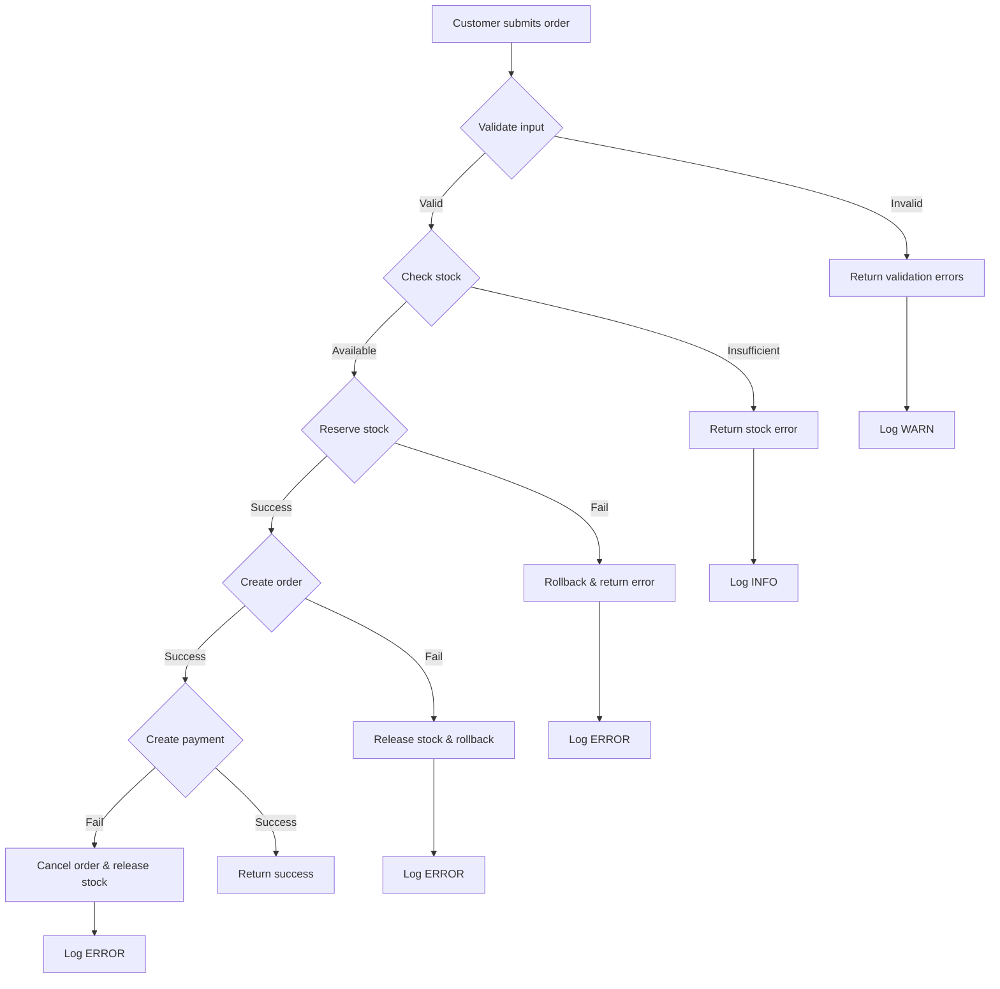
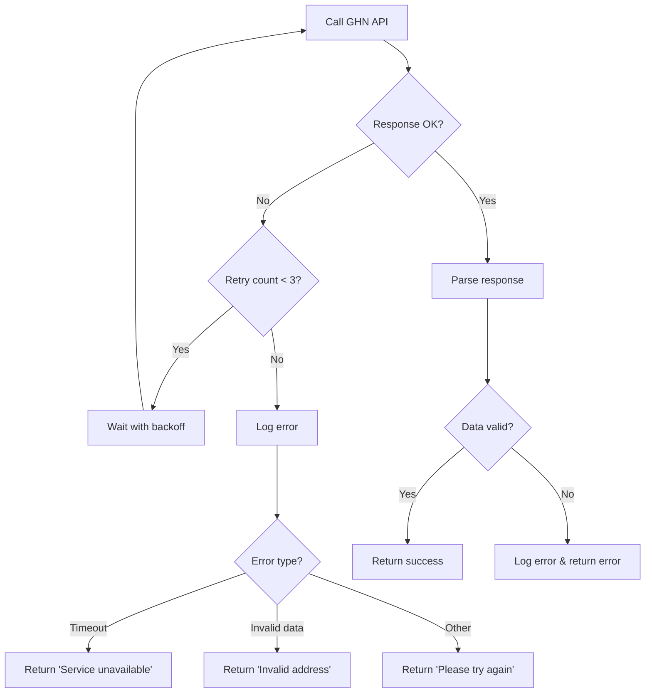

# Phân Tích Chiến Lược Xử Lý Lỗi (Error Handling Strategy Analysis)

## Tổng Quan

Tài liệu này phân tích chi tiết chiến lược xử lý lỗi được áp dụng trong hệ thống thương mại điện tử, bao gồm:
- Exception handling strategy
- Retry mechanisms cho external APIs
- Transaction management và rollback
- Error logging và monitoring
- User-friendly error messages

## 1. Exception Handling Strategy

### 1.1. Kiến Trúc Xử Lý Exception

Hệ thống sử dụng **Global Exception Handler** với `@RestControllerAdvice` để xử lý tập trung các exception:

```java
@Slf4j
@RestControllerAdvice
public class GlobalExceptionHandler {
    
    @ExceptionHandler(RuntimeException.class)
    @ResponseStatus(HttpStatus.BAD_REQUEST)
    public ApiResponse handleRuntimeException(RuntimeException e) {
        log.error("Runtime exception: {}", e.getMessage(), e);
        return ApiResponse.error(e.getMessage());
    }
    
    @ExceptionHandler(MethodArgumentNotValidException.class)
    @ResponseStatus(HttpStatus.BAD_REQUEST)
    public ApiResponse handleValidationException(MethodArgumentNotValidException e) {
        Map<String, String> errors = new HashMap<>();
        e.getBindingResult().getAllErrors().forEach(error -> {
            String fieldName = ((FieldError) error).getField();
            String errorMessage = error.getDefaultMessage();
            errors.put(fieldName, errorMessage);
        });
        log.error("Validation error: {}", errors);
        return ApiResponse.error("Dữ liệu không hợp lệ", errors);
    }
    
    @ExceptionHandler(Exception.class)
    @ResponseStatus(HttpStatus.INTERNAL_SERVER_ERROR)
    public ApiResponse handleException(Exception e) {
        log.error("Unexpected exception: {}", e.getMessage(), e);
        return ApiResponse.error("Có lỗi xảy ra, vui lòng thử lại sau");
    }
}
```

### 1.2. Phân Loại Exception

#### 1.2.1. Business Logic Exceptions
**Mục đích**: Xử lý các lỗi nghiệp vụ có thể dự đoán được

**Ví dụ**:
```java
// Insufficient stock
if (product.getStockQuantity() < cartItem.getQuantity()) {
    return ApiResponse.error("Sản phẩm " + product.getName() + " không đủ số lượng");
}

// Invalid order status transition
if (order.getStatus() == OrderStatus.DELIVERED) {
    return ApiResponse.error("Không thể hủy đơn hàng đã giao thành công");
}

// Duplicate serial number
if (productDetailRepository.existsBySerialNumber(sn)) {
    throw new RuntimeException("Serial " + sn + " đã tồn tại trong hệ thống!");
}
```

**Đặc điểm**:
- Trả về HTTP 400 Bad Request
- Message rõ ràng, hướng dẫn user cách khắc phục
- Không cần retry
- Log ở level WARN hoặc INFO

#### 1.2.2. Validation Exceptions
**Mục đích**: Xử lý lỗi validation dữ liệu đầu vào

**Ví dụ**:
```java
// Address validation
if (provinceName == null || districtName == null || wardName == null) {
    throw new ValidationException("Thiếu thông tin địa chỉ");
}

// Required field validation
if (req.getSupplier() == null || req.getSupplier().getTaxCode() == null) {
    throw new IllegalArgumentException("Thiếu thông tin nhà cung cấp hoặc mã số thuế");
}
```

**Đặc điểm**:
- Sử dụng Bean Validation (`@Valid`, `@NotNull`, `@NotEmpty`)
- GlobalExceptionHandler bắt `MethodArgumentNotValidException`
- Trả về map chi tiết lỗi từng field
- HTTP 400 Bad Request

#### 1.2.3. External Service Exceptions
**Mục đích**: Xử lý lỗi từ các dịch vụ bên ngoài (GHN, SePay, Cloudinary)

**Ví dụ**:
```java
// GHN API error
try {
    Map<String, Object> response = restTemplate.postForObject(url, entity, Map.class);
    if (response == null || !response.get("code").equals(200)) {
        log.error("❌ GHN API returned unexpected response");
        throw new RuntimeException("GHN API không trả về phí vận chuyển hợp lệ");
    }
} catch (Exception e) {
    log.error("❌ Error calling GHN API: " + e.getMessage(), e);
    throw new RuntimeException("Lỗi khi tạo đơn hàng GHN: " + e.getMessage());
}
```

**Đặc điểm**:
- Wrap exception từ external service
- Log đầy đủ stack trace
- Trả về message thân thiện cho user
- HTTP 502 Bad Gateway hoặc 503 Service Unavailable
- **Cần có retry mechanism**

#### 1.2.4. Database Exceptions
**Mục đích**: Xử lý lỗi database (constraint violation, deadlock, connection timeout)

**Ví dụ**:
```java
@Override
@Transactional
public ApiResponse completePurchaseOrder(CompletePORequest req) {
    try {
        return doCompletePurchaseOrder(req);
    } catch (DataIntegrityViolationException e) {
        log.error("Lỗi trùng lặp serial khi nhập hàng", e);
        String message = e.getMessage();
        if (message != null && message.contains("Duplicate entry")) {
            return ApiResponse.error("Serial bị trùng lặp! Vui lòng kiểm tra lại.");
        }
        return ApiResponse.error("Lỗi dữ liệu: " + e.getMessage());
    }
}
```

**Đặc điểm**:
- Sử dụng `@Transactional` để auto-rollback
- Parse error message để trả về thông báo rõ ràng
- Log ở level ERROR với full stack trace
- HTTP 500 Internal Server Error
- Có thể retry với exponential backoff (cho deadlock)

### 1.3. Exception Handling Best Practices

#### ✅ Đúng:
```java
// 1. Specific exception với message rõ ràng
throw new RuntimeException("Không tìm thấy đơn hàng với mã: " + orderCode);

// 2. Log trước khi throw
log.error("Failed to create GHN order for order {}: {}", orderId, e.getMessage(), e);
throw new RuntimeException("Không thể tạo đơn vận chuyển");

// 3. Graceful degradation
try {
    OrderStatusChangedEvent event = new OrderStatusChangedEvent(this, order, oldStatus, newStatus);
    eventPublisher.publishEvent(event);
} catch (Exception e) {
    log.error("Failed to publish event", e);
    // Don't fail the order process if event publishing fails
}
```

#### ❌ Sai:
```java
// 1. Catch exception nhưng không xử lý
catch (Exception e) {
    // Do nothing - NEVER DO THIS!
}

// 2. Throw exception chung chung
throw new Exception("Error");

// 3. Expose internal details
throw new RuntimeException("SQLException: " + e.getSQLState());
```

## 2. Retry Mechanisms cho External APIs

### 2.1. Chiến Lược Retry

Hệ thống hiện tại **CHƯA** implement retry mechanism tự động. Đây là điểm cần cải thiện.

### 2.2. Đề Xuất Retry Strategy

#### 2.2.1. Exponential Backoff với Jitter

```java
@Service
public class RetryableShippingService {
    
    @Retryable(
        value = {RestClientException.class, ResourceAccessException.class},
        maxAttempts = 3,
        backoff = @Backoff(
            delay = 1000,  // 1 second
            multiplier = 2,  // 2x each retry
            maxDelay = 10000  // max 10 seconds
        )
    )
    public CreateGHNOrderResponse createGHNOrderWithRetry(CreateGHNOrderRequest request) {
        return createGHNOrder(request);
    }
    
    @Recover
    public CreateGHNOrderResponse recoverFromGHNError(
            RestClientException e, 
            CreateGHNOrderRequest request) {
        log.error("All retry attempts failed for GHN order creation", e);
        throw new RuntimeException("Dịch vụ vận chuyển tạm thời không khả dụng. Vui lòng thử lại sau.");
    }
}
```

#### 2.2.2. Circuit Breaker Pattern

```java
@Service
public class ResilientShippingService {
    
    @CircuitBreaker(
        name = "ghnService",
        fallbackMethod = "fallbackCreateGHNOrder"
    )
    public CreateGHNOrderResponse createGHNOrder(CreateGHNOrderRequest request) {
        // Call GHN API
    }
    
    public CreateGHNOrderResponse fallbackCreateGHNOrder(
            CreateGHNOrderRequest request, 
            Exception e) {
        log.error("Circuit breaker activated for GHN service", e);
        // Return cached response or queue for later processing
        return CreateGHNOrderResponse.builder()
                .status("PENDING")
                .message("Đơn vận chuyển đang được xử lý")
                .build();
    }
}
```

### 2.3. Retry Configuration

**application.properties**:
```properties
# Resilience4j Circuit Breaker
resilience4j.circuitbreaker.instances.ghnService.slidingWindowSize=10
resilience4j.circuitbreaker.instances.ghnService.failureRateThreshold=50
resilience4j.circuitbreaker.instances.ghnService.waitDurationInOpenState=30s
resilience4j.circuitbreaker.instances.ghnService.permittedNumberOfCallsInHalfOpenState=3

# Resilience4j Retry
resilience4j.retry.instances.ghnService.maxAttempts=3
resilience4j.retry.instances.ghnService.waitDuration=1s
resilience4j.retry.instances.ghnService.exponentialBackoffMultiplier=2
resilience4j.retry.instances.ghnService.retryExceptions=\
  org.springframework.web.client.RestClientException,\
  org.springframework.web.client.ResourceAccessException

# Timeout
resilience4j.timelimiter.instances.ghnService.timeoutDuration=10s
```

### 2.4. Idempotency cho Retry

**Vấn đề**: Retry có thể tạo duplicate requests

**Giải pháp**: Implement idempotency key

```java
public CreateGHNOrderResponse createGHNOrder(CreateGHNOrderRequest request) {
    // Generate idempotency key
    String idempotencyKey = generateIdempotencyKey(request);
    
    // Check if request already processed
    Optional<GHNOrderCache> cached = ghnOrderCacheRepository
            .findByIdempotencyKey(idempotencyKey);
    
    if (cached.isPresent()) {
        log.info("Returning cached GHN order response for key: {}", idempotencyKey);
        return cached.get().getResponse();
    }
    
    // Make API call
    CreateGHNOrderResponse response = callGHNApi(request);
    
    // Cache response
    ghnOrderCacheRepository.save(GHNOrderCache.builder()
            .idempotencyKey(idempotencyKey)
            .response(response)
            .createdAt(LocalDateTime.now())
            .build());
    
    return response;
}

private String generateIdempotencyKey(CreateGHNOrderRequest request) {
    String data = request.getOrderId() + "|" + 
                  request.getToPhone() + "|" + 
                  request.getCodAmount();
    return DigestUtils.md5DigestAsHex(data.getBytes());
}
```

## 3. Transaction Management và Rollback

### 3.1. Declarative Transaction Management

Hệ thống sử dụng Spring `@Transactional` annotation:

```java
@Override
@Transactional
public ApiResponse createOrderFromCart(Long customerId, CreateOrderRequest request) {
    // 1. Validate
    // 2. Reserve stock
    // 3. Create order
    // 4. Create order items
    // 5. Clear cart
    
    // Nếu bất kỳ bước nào fail → auto rollback
}
```

### 3.2. Transaction Propagation

#### 3.2.1. REQUIRED (Default)
```java
@Transactional(propagation = Propagation.REQUIRED)
public void createOrder() {
    // Join existing transaction or create new one
}
```

#### 3.2.2. REQUIRES_NEW
```java
@Transactional(propagation = Propagation.REQUIRES_NEW)
public void logAuditEvent() {
    // Always create new transaction
    // Commit even if parent transaction rolls back
}
```

#### 3.2.3. NESTED
```java
@Transactional(propagation = Propagation.NESTED)
public void createPayment() {
    // Create savepoint
    // Can rollback to savepoint without affecting parent
}
```

### 3.3. Rollback Rules

```java
@Transactional(
    rollbackFor = {Exception.class},  // Rollback for all exceptions
    noRollbackFor = {ValidationException.class}  // Don't rollback for validation errors
)
public void processOrder() {
    // Business logic
}
```

### 3.4. Manual Transaction Control

```java
@Autowired
private PlatformTransactionManager transactionManager;

public void complexOperation() {
    TransactionDefinition def = new DefaultTransactionDefinition();
    TransactionStatus status = transactionManager.getTransaction(def);
    
    try {
        // Step 1
        orderRepository.save(order);
        
        // Step 2
        inventoryService.reserveStock(items);
        
        // Step 3
        paymentService.createPayment(order);
        
        transactionManager.commit(status);
    } catch (Exception e) {
        log.error("Error in complex operation", e);
        transactionManager.rollback(status);
        throw e;
    }
}
```

### 3.5. Distributed Transaction Considerations

**Vấn đề**: Hệ thống có nhiều external services (GHN, SePay) → không thể dùng ACID transaction

**Giải pháp**: Saga Pattern

#### 3.5.1. Choreography-based Saga
```java
// Order Service
@Transactional
public void createOrder(OrderRequest request) {
    Order order = orderRepository.save(buildOrder(request));
    eventPublisher.publishEvent(new OrderCreatedEvent(order));
}

// Inventory Service
@EventListener
@Transactional
public void handleOrderCreated(OrderCreatedEvent event) {
    try {
        reserveStock(event.getOrder());
        eventPublisher.publishEvent(new StockReservedEvent(event.getOrder()));
    } catch (Exception e) {
        eventPublisher.publishEvent(new StockReservationFailedEvent(event.getOrder()));
    }
}

// Shipping Service
@EventListener
@Transactional
public void handleStockReserved(StockReservedEvent event) {
    try {
        createGHNOrder(event.getOrder());
        eventPublisher.publishEvent(new ShippingCreatedEvent(event.getOrder()));
    } catch (Exception e) {
        eventPublisher.publishEvent(new ShippingCreationFailedEvent(event.getOrder()));
    }
}

// Compensation handlers
@EventListener
@Transactional
public void handleShippingCreationFailed(ShippingCreationFailedEvent event) {
    // Compensate: Release reserved stock
    inventoryService.releaseStock(event.getOrder());
    // Cancel order
    orderService.cancelOrder(event.getOrder().getId());
}
```

#### 3.5.2. Orchestration-based Saga
```java
@Service
public class OrderSagaOrchestrator {
    
    public void executeOrderSaga(OrderRequest request) {
        SagaContext context = new SagaContext();
        
        try {
            // Step 1: Create order
            Order order = orderService.createOrder(request);
            context.setOrder(order);
            
            // Step 2: Reserve stock
            inventoryService.reserveStock(order);
            context.setStockReserved(true);
            
            // Step 3: Create payment
            Payment payment = paymentService.createPayment(order);
            context.setPayment(payment);
            
            // Step 4: Create shipping
            shippingService.createGHNOrder(order);
            context.setShippingCreated(true);
            
            // Success
            orderService.confirmOrder(order.getId());
            
        } catch (Exception e) {
            log.error("Saga failed, executing compensation", e);
            compensate(context);
            throw new SagaExecutionException("Order creation failed", e);
        }
    }
    
    private void compensate(SagaContext context) {
        if (context.isShippingCreated()) {
            shippingService.cancelGHNOrder(context.getOrder());
        }
        if (context.getPayment() != null) {
            paymentService.cancelPayment(context.getPayment().getId());
        }
        if (context.isStockReserved()) {
            inventoryService.releaseStock(context.getOrder());
        }
        if (context.getOrder() != null) {
            orderService.cancelOrder(context.getOrder().getId());
        }
    }
}
```

## 4. Error Logging và Monitoring

### 4.1. Logging Strategy

#### 4.1.1. Log Levels

**ERROR**: Lỗi nghiêm trọng cần xử lý ngay
```java
log.error("❌ Failed to create GHN order for order {}: {}", orderId, e.getMessage(), e);
```

**WARN**: Lỗi có thể recover, cần theo dõi
```java
log.warn("⚠️ Could not get lead time from GHN, using default: {}", e.getMessage());
```

**INFO**: Thông tin quan trọng về flow
```java
log.info("✅ Order created: {}", orderCode);
log.info("📦 GHN order created: {}", ghnOrderCode);
```

**DEBUG**: Chi tiết để debug
```java
log.debug("Request body: {}", requestBody);
log.debug("Response: {}", response);
```

#### 4.1.2. Structured Logging

```java
// Bad: String concatenation
log.error("Error creating order " + orderId + " for customer " + customerId);

// Good: Parameterized logging
log.error("Error creating order {} for customer {}", orderId, customerId);

// Better: Structured logging with MDC
MDC.put("orderId", orderId.toString());
MDC.put("customerId", customerId.toString());
MDC.put("action", "CREATE_ORDER");
log.error("Error creating order", e);
MDC.clear();
```

#### 4.1.3. Correlation ID

```java
@Component
public class CorrelationIdFilter extends OncePerRequestFilter {
    
    @Override
    protected void doFilterInternal(
            HttpServletRequest request,
            HttpServletResponse response,
            FilterChain filterChain) throws ServletException, IOException {
        
        String correlationId = request.getHeader("X-Correlation-ID");
        if (correlationId == null) {
            correlationId = UUID.randomUUID().toString();
        }
        
        MDC.put("correlationId", correlationId);
        response.setHeader("X-Correlation-ID", correlationId);
        
        try {
            filterChain.doFilter(request, response);
        } finally {
            MDC.clear();
        }
    }
}
```

### 4.2. Monitoring và Alerting

#### 4.2.1. Metrics Collection

```java
@Service
public class MetricsService {
    
    private final MeterRegistry meterRegistry;
    
    public void recordOrderCreation(boolean success) {
        Counter.builder("orders.created")
                .tag("status", success ? "success" : "failure")
                .register(meterRegistry)
                .increment();
    }
    
    public void recordGHNApiCall(String endpoint, boolean success, long duration) {
        Timer.builder("ghn.api.calls")
                .tag("endpoint", endpoint)
                .tag("status", success ? "success" : "failure")
                .register(meterRegistry)
                .record(duration, TimeUnit.MILLISECONDS);
    }
    
    public void recordInventoryLevel(String sku, long quantity) {
        Gauge.builder("inventory.level", () -> quantity)
                .tag("sku", sku)
                .register(meterRegistry);
    }
}
```

#### 4.2.2. Health Checks

```java
@Component
public class GHNHealthIndicator implements HealthIndicator {
    
    private final ShippingService shippingService;
    
    @Override
    public Health health() {
        try {
            // Ping GHN API
            shippingService.getProvinces();
            return Health.up()
                    .withDetail("ghn", "Available")
                    .build();
        } catch (Exception e) {
            return Health.down()
                    .withDetail("ghn", "Unavailable")
                    .withDetail("error", e.getMessage())
                    .build();
        }
    }
}
```

#### 4.2.3. Alert Rules

**Prometheus Alert Rules**:
```yaml
groups:
  - name: ecommerce_alerts
    rules:
      - alert: HighOrderFailureRate
        expr: rate(orders_created{status="failure"}[5m]) > 0.1
        for: 5m
        labels:
          severity: critical
        annotations:
          summary: "High order failure rate detected"
          description: "Order failure rate is {{ $value }} per second"
      
      - alert: GHNServiceDown
        expr: up{job="ghn-health-check"} == 0
        for: 2m
        labels:
          severity: critical
        annotations:
          summary: "GHN service is down"
          description: "GHN API has been unavailable for 2 minutes"
      
      - alert: LowInventory
        expr: inventory_level < 10
        for: 1h
        labels:
          severity: warning
        annotations:
          summary: "Low inventory for {{ $labels.sku }}"
          description: "Only {{ $value }} units left"
```

## 5. User-Friendly Error Messages

### 5.1. Error Message Guidelines

#### ✅ Đúng:
```java
// Specific và actionable
"Sản phẩm 'iPhone 15 Pro Max' không đủ số lượng. Còn lại: 5, yêu cầu: 10"

// Hướng dẫn cách khắc phục
"Địa chỉ giao hàng không hợp lệ. Vui lòng chọn Tỉnh/Thành phố, Quận/Huyện, và Phường/Xã từ danh sách"

// Thời gian dự kiến
"Dịch vụ thanh toán tạm thời không khả dụng. Vui lòng thử lại sau 5 phút"
```

#### ❌ Sai:
```java
// Quá kỹ thuật
"NullPointerException at line 245"

// Không rõ ràng
"Error occurred"

// Expose internal details
"SQLException: Duplicate entry '12345' for key 'PRIMARY'"
```

### 5.2. Error Response Format

```java
@Data
@Builder
public class ErrorResponse {
    private String code;           // ERROR_CODE_001
    private String message;        // User-friendly message
    private String detail;         // Technical detail (optional)
    private LocalDateTime timestamp;
    private String path;           // Request path
    private Map<String, String> fieldErrors;  // Validation errors
    private String correlationId;  // For tracking
}
```

**Ví dụ**:
```json
{
  "code": "INSUFFICIENT_STOCK",
  "message": "Sản phẩm 'iPhone 15 Pro Max' không đủ số lượng",
  "detail": "Available: 5, Required: 10",
  "timestamp": "2024-01-15T10:30:00",
  "path": "/api/orders/create",
  "correlationId": "abc-123-def-456"
}
```

### 5.3. Internationalization (i18n)

```java
@Service
public class ErrorMessageService {
    
    @Autowired
    private MessageSource messageSource;
    
    public String getMessage(String code, Object[] args, Locale locale) {
        return messageSource.getMessage(code, args, locale);
    }
}
```

**messages_vi.properties**:
```properties
error.insufficient.stock=Sản phẩm {0} không đủ số lượng. Còn lại: {1}, yêu cầu: {2}
error.invalid.address=Địa chỉ giao hàng không hợp lệ
error.ghn.unavailable=Dịch vụ vận chuyển tạm thời không khả dụng
error.payment.timeout=Thanh toán quá hạn. Vui lòng đặt hàng lại
```

**messages_en.properties**:
```properties
error.insufficient.stock=Product {0} is out of stock. Available: {1}, Required: {2}
error.invalid.address=Invalid shipping address
error.ghn.unavailable=Shipping service temporarily unavailable
error.payment.timeout=Payment timeout. Please place order again
```

## 6. Error Handling Flow Diagrams

### 6.1. Order Creation Error Flow



### 6.2. GHN API Error Flow



## 7. Recommendations và Best Practices

### 7.1. Immediate Improvements

1. **Implement Retry Mechanism**
   - Add Spring Retry or Resilience4j
   - Configure exponential backoff
   - Implement circuit breaker

2. **Add Idempotency Keys**
   - For all external API calls
   - Store in cache/database
   - TTL: 24 hours

3. **Improve Error Messages**
   - Create error code enum
   - Implement i18n
   - Add actionable guidance

4. **Enhanced Logging**
   - Add correlation IDs
   - Use structured logging
   - Implement MDC

5. **Monitoring Dashboard**
   - Setup Prometheus + Grafana
   - Create alert rules
   - Monitor key metrics

### 7.2. Long-term Improvements

1. **Distributed Tracing**
   - Implement Zipkin/Jaeger
   - Trace requests across services
   - Visualize latency

2. **Saga Pattern**
   - For distributed transactions
   - Implement compensation logic
   - Use event sourcing

3. **Dead Letter Queue**
   - For failed async operations
   - Retry with backoff
   - Manual intervention UI

4. **Chaos Engineering**
   - Test failure scenarios
   - Verify resilience
   - Improve recovery

### 7.3. Error Handling Checklist

- [ ] All exceptions are logged with appropriate level
- [ ] User-facing errors are friendly and actionable
- [ ] Sensitive information is not exposed
- [ ] Transactions are properly managed
- [ ] External API calls have retry logic
- [ ] Idempotency is implemented for critical operations
- [ ] Monitoring and alerting are configured
- [ ] Error responses follow consistent format
- [ ] Correlation IDs are used for tracking
- [ ] Circuit breakers protect against cascading failures

## 8. Kết Luận

Hệ thống hiện tại đã có foundation tốt cho error handling với:
- Global exception handler
- Transaction management
- Comprehensive logging
- User-friendly error messages

Tuy nhiên, cần cải thiện:
- Retry mechanisms cho external APIs
- Circuit breaker pattern
- Distributed transaction handling (Saga)
- Monitoring và alerting
- Idempotency keys

Việc implement các improvements này sẽ giúp hệ thống:
- Resilient hơn với external service failures
- Dễ debug và troubleshoot
- Better user experience
- Reduced downtime
- Faster incident response
