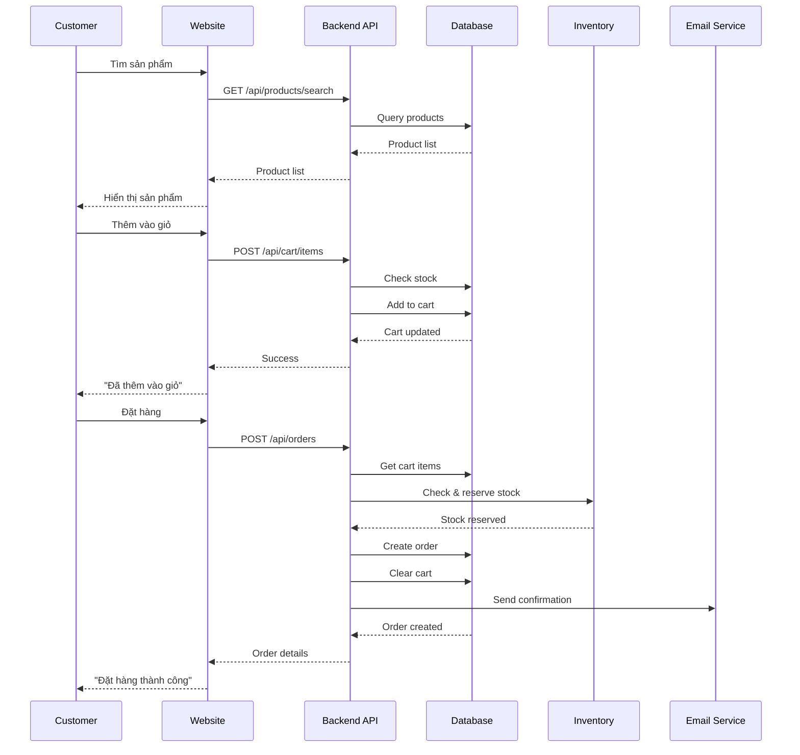
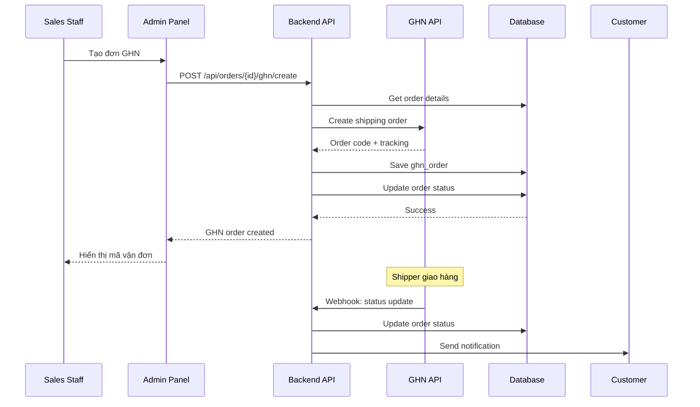

# Kịch Bản Sử Dụng - Hệ Thống Quản Lý Sản Phẩm và Đơn Hàng

## Tổng Quan

Tài liệu này mô tả các kịch bản sử dụng (use cases) chi tiết cho phần quản lý sản phẩm, giỏ hàng, đặt hàng và giao hàng.

**Actors (Người dùng)**:
- **Khách hàng (Customer)**: Người mua hàng
- **Nhân viên bán hàng (Sales)**: Xử lý đơn hàng
- **Nhân viên kho (Warehouse)**: Xuất kho
- **Shipper**: Giao hàng
- **Admin**: Quản trị hệ thống

---

## 1. Module Quản Lý Sản Phẩm

### UC-01: Khách Hàng Tìm Kiếm Sản Phẩm

**Actor**: Khách hàng

**Mô tả**: Khách hàng tìm kiếm sản phẩm theo từ khóa, danh mục, khoảng giá

**Điều kiện tiên quyết**: 
- Khách hàng truy cập website
- Có sản phẩm trong hệ thống

**Luồng chính**:
1. Khách hàng truy cập trang chủ hoặc trang sản phẩm
2. Khách hàng nhập từ khóa vào ô tìm kiếm (VD: "iPhone 15")
3. Hệ thống hiển thị danh sách sản phẩm phù hợp
4. Khách hàng có thể lọc thêm theo:
   - Danh mục (VD: Điện thoại > Smartphone)
   - Khoảng giá (VD: 20-30 triệu)
   - Sắp xếp (Giá tăng/giảm, Mới nhất)
5. Hệ thống cập nhật kết quả theo bộ lọc
6. Khách hàng xem danh sách sản phẩm (20 sản phẩm/trang)

**Luồng thay thế**:
- **3a**: Không tìm thấy sản phẩm
  - Hệ thống hiển thị "Không tìm thấy sản phẩm phù hợp"
  - Gợi ý sản phẩm tương tự hoặc phổ biến

**Kết quả**: Khách hàng thấy danh sách sản phẩm phù hợp

**Dữ liệu mẫu**:
```
Input: 
  - keyword: "iPhone"
  - category: "Điện thoại"
  - minPrice: 20000000
  - maxPrice: 30000000

Output:
  - iPhone 15 - 29,990,000đ
  - iPhone 14 Pro - 27,990,000đ
  - iPhone 14 - 22,990,000đ
```

---

### UC-02: Khách Hàng Xem Chi Tiết Sản Phẩm

**Actor**: Khách hàng

**Mô tả**: Khách hàng xem thông tin chi tiết của một sản phẩm

**Điều kiện tiên quyết**: 
- Sản phẩm tồn tại và đang active

**Luồng chính**:
1. Khách hàng click vào một sản phẩm từ danh sách
2. Hệ thống hiển thị trang chi tiết sản phẩm bao gồm:
   - Tên sản phẩm
   - Giá bán
   - Mô tả chi tiết
   - Hình ảnh (gallery với nhiều ảnh)
   - Số lượng còn lại
   - Thông số kỹ thuật (nếu có)
3. Khách hàng có thể:
   - Xem các ảnh khác nhau
   - Đọc mô tả
   - Chọn số lượng muốn mua
4. Khách hàng click "Thêm vào giỏ hàng"

**Luồng thay thế**:
- **2a**: Sản phẩm hết hàng
  - Hiển thị "Hết hàng"
  - Nút "Thêm vào giỏ" bị disable
  - Hiển thị "Nhận thông báo khi có hàng"

**Kết quả**: Khách hàng hiểu rõ về sản phẩm và có thể thêm vào giỏ

---

## 2. Module Giỏ Hàng

### UC-03: Khách Hàng Thêm Sản Phẩm Vào Giỏ Hàng

**Actor**: Khách hàng (đã đăng nhập)

**Mô tả**: Khách hàng thêm sản phẩm vào giỏ hàng

**Điều kiện tiên quyết**: 
- Khách hàng đã đăng nhập
- Sản phẩm còn hàng

**Luồng chính**:
1. Khách hàng ở trang chi tiết sản phẩm
2. Khách hàng chọn số lượng (mặc định = 1)
3. Khách hàng click "Thêm vào giỏ hàng"
4. Hệ thống kiểm tra:
   - Sản phẩm còn tồn kho
   - Số lượng yêu cầu <= số lượng available
5. Hệ thống thêm sản phẩm vào giỏ:
   - Nếu sản phẩm đã có trong giỏ: Cộng thêm số lượng
   - Nếu chưa có: Tạo mới cart_item
6. Hệ thống hiển thị thông báo "Đã thêm vào giỏ hàng"
7. Icon giỏ hàng cập nhật số lượng items

**Luồng thay thế**:
- **4a**: Không đủ hàng
  - Hiển thị "Chỉ còn X sản phẩm"
  - Không cho thêm vào giỏ
- **4b**: Khách hàng chưa đăng nhập
  - Chuyển đến trang đăng nhập
  - Sau khi đăng nhập, tự động thêm vào giỏ

**Kết quả**: Sản phẩm được thêm vào giỏ hàng

**Dữ liệu mẫu**:
```
Request:
  - productId: 1
  - quantity: 2

Response:
  - cartId: 123
  - totalItems: 5
  - totalAmount: 59,980,000đ
```


---

### UC-04: Khách Hàng Xem và Quản Lý Giỏ Hàng

**Actor**: Khách hàng (đã đăng nhập)

**Mô tả**: Khách hàng xem, cập nhật, xóa sản phẩm trong giỏ

**Luồng chính**:
1. Khách hàng click vào icon giỏ hàng
2. Hệ thống hiển thị danh sách sản phẩm trong giỏ:
   - Hình ảnh sản phẩm
   - Tên sản phẩm
   - Giá
   - Số lượng (có thể tăng/giảm)
   - Thành tiền
   - Nút xóa
3. Khách hàng có thể:
   - Thay đổi số lượng (click +/-)
   - Xóa sản phẩm (click icon thùng rác)
4. Hệ thống tự động cập nhật tổng tiền
5. Khách hàng click "Thanh toán" để đặt hàng

**Luồng thay thế**:
- **3a**: Giỏ hàng trống
  - Hiển thị "Giỏ hàng trống"
  - Hiển thị nút "Tiếp tục mua sắm"
- **3b**: Thay đổi số lượng vượt quá tồn kho
  - Hiển thị cảnh báo "Chỉ còn X sản phẩm"
  - Giữ nguyên số lượng cũ

**Kết quả**: Khách hàng quản lý được giỏ hàng

---

## 3. Module Đặt Hàng

### UC-05: Khách Hàng Đặt Hàng

**Actor**: Khách hàng (đã đăng nhập)

**Mô tả**: Khách hàng tạo đơn hàng từ giỏ hàng

**Điều kiện tiên quyết**: 
- Khách hàng đã đăng nhập
- Giỏ hàng có ít nhất 1 sản phẩm
- Tất cả sản phẩm còn đủ hàng

**Luồng chính**:
1. Khách hàng ở trang giỏ hàng
2. Khách hàng click "Thanh toán"
3. Hệ thống chuyển đến trang đặt hàng
4. Khách hàng nhập thông tin:
   - Họ tên người nhận
   - Số điện thoại
   - Địa chỉ giao hàng (Tỉnh/Thành, Quận/Huyện, Phường/Xã, Địa chỉ cụ thể)
   - Ghi chú (optional)
5. Khách hàng chọn phương thức thanh toán:
   - COD (Thanh toán khi nhận hàng)
   - Chuyển khoản ngân hàng
6. Hệ thống tính phí vận chuyển (nếu có)
7. Hệ thống hiển thị tổng kết:
   - Tổng tiền hàng
   - Phí vận chuyển
   - Tổng thanh toán
8. Khách hàng xác nhận đặt hàng
9. Hệ thống:
   - Kiểm tra lại tồn kho
   - Reserve stock (reserved += quantity)
   - Tạo đơn hàng (status = PENDING)
   - Tạo order_items
   - Xóa giỏ hàng
10. Hệ thống hiển thị thông báo thành công và mã đơn hàng
11. Gửi email xác nhận đơn hàng

**Luồng thay thế**:
- **9a**: Hết hàng trong lúc đặt
  - Hiển thị "Sản phẩm X đã hết hàng"
  - Không tạo đơn
  - Yêu cầu cập nhật giỏ hàng
- **9b**: Chọn thanh toán chuyển khoản
  - Hiển thị QR code thanh toán
  - Hiển thị thông tin tài khoản
  - Đơn hàng chờ xác nhận thanh toán

**Kết quả**: Đơn hàng được tạo thành công

**Dữ liệu mẫu**:
```
Input:
  - shippingAddress: "123 Nguyễn Văn Linh, P.Tân Phú, Q.7, TP.HCM"
  - phone: "0901234567"
  - paymentMethod: "COD"
  - notes: "Giao giờ hành chính"

Output:
  - orderCode: "ORD-20241224-001"
  - total: 59,980,000đ
  - shippingFee: 30,000đ
  - grandTotal: 60,010,000đ
  - status: "PENDING"
```


---

### UC-06: Khách Hàng Xem Lịch Sử Đơn Hàng

**Actor**: Khách hàng (đã đăng nhập)

**Mô tả**: Khách hàng xem danh sách và chi tiết đơn hàng đã đặt

**Luồng chính**:
1. Khách hàng vào trang "Đơn hàng của tôi"
2. Hệ thống hiển thị danh sách đơn hàng:
   - Mã đơn hàng
   - Ngày đặt
   - Tổng tiền
   - Trạng thái
3. Khách hàng có thể lọc theo trạng thái:
   - Chờ xác nhận
   - Đang xử lý
   - Đang giao
   - Đã giao
   - Đã hủy
4. Khách hàng click vào một đơn để xem chi tiết
5. Hệ thống hiển thị:
   - Thông tin đơn hàng
   - Danh sách sản phẩm
   - Địa chỉ giao hàng
   - Trạng thái hiện tại
   - Lịch sử trạng thái
6. Khách hàng có thể hủy đơn (nếu status = PENDING)

**Kết quả**: Khách hàng theo dõi được đơn hàng

---

## 4. Module Xử Lý Đơn Hàng (Sales/Admin)

### UC-07: Nhân Viên Xác Nhận Đơn Hàng

**Actor**: Nhân viên bán hàng / Admin

**Mô tả**: Nhân viên xác nhận đơn hàng mới

**Điều kiện tiên quyết**: 
- Có đơn hàng mới (status = PENDING)
- Nhân viên có quyền xử lý đơn

**Luồng chính**:
1. Nhân viên đăng nhập vào admin panel
2. Hệ thống hiển thị danh sách đơn hàng mới
3. Nhân viên click vào đơn hàng để xem chi tiết
4. Nhân viên kiểm tra:
   - Thông tin khách hàng
   - Sản phẩm đặt
   - Địa chỉ giao hàng
   - Tồn kho
5. Nhân viên click "Xác nhận đơn hàng"
6. Hệ thống:
   - Cập nhật status = CONFIRMED
   - Gửi thông báo cho khách hàng
   - Gửi thông báo cho kho để chuẩn bị hàng

**Luồng thay thế**:
- **5a**: Nhân viên hủy đơn
  - Nhập lý do hủy
  - Cập nhật status = CANCELLED
  - Giải phóng reserved stock
  - Gửi thông báo cho khách hàng

**Kết quả**: Đơn hàng được xác nhận và chuyển sang kho

---

### UC-08: Nhân Viên Kho Xuất Hàng

**Actor**: Nhân viên kho

**Mô tả**: Nhân viên kho xuất hàng cho đơn đã xác nhận

**Điều kiện tiên quyết**: 
- Đơn hàng đã được xác nhận (status = CONFIRMED)

**Luồng chính**:
1. Nhân viên kho vào trang "Đơn hàng chờ xuất"
2. Hệ thống hiển thị danh sách đơn CONFIRMED
3. Nhân viên chọn đơn hàng cần xuất
4. Hệ thống hiển thị danh sách sản phẩm cần xuất
5. Nhân viên quét serial/IMEI của từng sản phẩm
6. Hệ thống kiểm tra serial:
   - Serial tồn tại
   - Serial đúng sản phẩm
   - Serial chưa bán (status = IN_STOCK)
7. Nhân viên xác nhận xuất kho
8. Hệ thống:
   - Tạo export_order
   - Cập nhật product_details.status = SOLD
   - Cập nhật inventory_stock (on_hand -= quantity, reserved -= quantity)
   - Cập nhật order.status = READY_TO_SHIP
   - Gán serial vào order_items
9. In phiếu xuất kho

**Luồng thay thế**:
- **6a**: Serial không hợp lệ
  - Hiển thị cảnh báo
  - Yêu cầu quét lại
- **6b**: Không đủ hàng
  - Thông báo cho sales
  - Chờ nhập hàng hoặc hủy đơn

**Kết quả**: Hàng được xuất kho, đơn sẵn sàng giao

---

## 5. Module Giao Hàng

### UC-09: Tạo Đơn Giao Hàng Nhanh (GHN)

**Actor**: Nhân viên bán hàng / Admin

**Mô tả**: Tạo đơn giao hàng qua GHN

**Điều kiện tiên quyết**: 
- Đơn hàng đã xuất kho (status = READY_TO_SHIP)
- Địa chỉ giao hàng hợp lệ

**Luồng chính**:
1. Nhân viên vào chi tiết đơn hàng
2. Nhân viên click "Tạo đơn GHN"
3. Hệ thống hiển thị form xác nhận:
   - Thông tin người nhận
   - Địa chỉ
   - Sản phẩm
   - Cân nặng, kích thước (có thể chỉnh sửa)
4. Nhân viên xác nhận
5. Hệ thống gọi GHN API:
   - Tạo đơn giao hàng
   - Nhận mã vận đơn GHN
6. Hệ thống:
   - Lưu ghn_order
   - Cập nhật order.status = SHIPPING
   - Cập nhật order.shipping_method = GHN
7. Hiển thị mã vận đơn và link tracking
8. In phiếu giao hàng GHN

**Luồng thay thế**:
- **5a**: GHN API lỗi
  - Hiển thị thông báo lỗi
  - Cho phép thử lại
  - Hoặc chọn shipper riêng

**Kết quả**: Đơn được tạo trên GHN, bắt đầu giao hàng

**Dữ liệu mẫu**:
```
Request to GHN:
  - to_name: "Nguyễn Văn A"
  - to_phone: "0901234567"
  - to_address: "123 Nguyễn Văn Linh"
  - to_ward_code: "20308"
  - to_district_id: 1442
  - cod_amount: 60010000
  - weight: 500
  - length: 20
  - width: 15
  - height: 10

Response from GHN:
  - order_code: "GHN123456"
  - expected_delivery_time: "2024-12-26 17:00:00"
  - total_fee: 30000
```


---

### UC-10: Gán Đơn Cho Shipper Riêng

**Actor**: Nhân viên bán hàng / Admin

**Mô tả**: Gán đơn hàng cho shipper của cửa hàng

**Điều kiện tiên quyết**: 
- Đơn hàng đã xuất kho (status = READY_TO_SHIP)
- Có shipper available

**Luồng chính**:
1. Nhân viên vào chi tiết đơn hàng
2. Nhân viên click "Gán shipper"
3. Hệ thống hiển thị danh sách shipper:
   - Tên shipper
   - Số đơn đang giao
   - Trạng thái (Available/Busy)
4. Nhân viên chọn shipper
5. Hệ thống:
   - Cập nhật order.assigned_shipper_id
   - Cập nhật order.status = SHIPPING
   - Cập nhật order.shipping_method = INTERNAL
   - Gửi thông báo cho shipper
6. Shipper nhận thông báo trên app

**Kết quả**: Đơn được gán cho shipper, bắt đầu giao hàng

---

### UC-11: Shipper Giao Hàng Thành Công

**Actor**: Shipper

**Mô tả**: Shipper giao hàng và cập nhật trạng thái

**Điều kiện tiên quyết**: 
- Đơn hàng đã được gán cho shipper
- Shipper có app mobile

**Luồng chính**:
1. Shipper mở app và xem danh sách đơn cần giao
2. Shipper chọn đơn hàng
3. Hệ thống hiển thị:
   - Thông tin người nhận
   - Địa chỉ (có link Google Maps)
   - Sản phẩm
   - Số tiền cần thu (nếu COD)
4. Shipper click "Bắt đầu giao"
5. Shipper đến địa chỉ và giao hàng
6. Shipper click "Đã giao hàng"
7. Hệ thống yêu cầu:
   - Chụp ảnh xác nhận (optional)
   - Xác nhận đã thu tiền (nếu COD)
8. Shipper xác nhận
9. Hệ thống:
   - Cập nhật order.status = DELIVERED
   - Tạo financial_transaction (REVENUE)
   - Gửi thông báo cho khách hàng
   - Giải phóng shipper

**Luồng thay thế**:
- **6a**: Giao hàng thất bại
  - Shipper chọn lý do (Khách không nhận, Sai địa chỉ, etc.)
  - Chụp ảnh bằng chứng
  - Cập nhật status = FAILED_DELIVERY
  - Thông báo cho sales xử lý
- **6b**: Khách hẹn giao lại
  - Shipper ghi chú thời gian hẹn
  - Giữ nguyên status = SHIPPING
  - Đơn vẫn trong danh sách cần giao

**Kết quả**: Đơn hàng hoàn thành, khách nhận được hàng

---

### UC-12: Cập Nhật Trạng Thái Từ GHN Webhook

**Actor**: Hệ thống GHN (tự động)

**Mô tả**: GHN gửi webhook cập nhật trạng thái đơn hàng

**Luồng chính**:
1. GHN gửi webhook đến endpoint `/api/webhooks/ghn`
2. Hệ thống verify signature
3. Hệ thống parse dữ liệu:
   - order_code
   - status
   - timestamp
4. Hệ thống tìm ghn_order theo order_code
5. Hệ thống cập nhật:
   - ghn_order.status
   - order.status (mapping từ GHN status)
6. Hệ thống gửi thông báo cho khách hàng
7. Nếu status = delivered:
   - Tạo financial_transaction
   - Đánh dấu hoàn thành

**Mapping trạng thái**:
```
GHN Status → Order Status
ready_to_pick → READY_TO_SHIP
picking → SHIPPING
delivering → SHIPPING
delivered → DELIVERED
return → CANCELLED
cancel → CANCELLED
```

**Kết quả**: Trạng thái đơn hàng được đồng bộ tự động

---

## 6. Kịch Bản Ngoại Lệ

### UC-13: Khách Hàng Hủy Đơn Hàng

**Actor**: Khách hàng

**Điều kiện**: Đơn hàng status = PENDING hoặc CONFIRMED

**Luồng chính**:
1. Khách hàng vào chi tiết đơn hàng
2. Khách hàng click "Hủy đơn hàng"
3. Hệ thống yêu cầu chọn lý do hủy:
   - Đặt nhầm
   - Tìm được giá rẻ hơn
   - Không cần nữa
   - Khác (nhập lý do)
4. Khách hàng xác nhận hủy
5. Hệ thống:
   - Cập nhật order.status = CANCELLED
   - Giải phóng reserved stock
   - Hoàn tiền (nếu đã thanh toán)
   - Gửi thông báo

**Kết quả**: Đơn hàng bị hủy, stock được giải phóng

---

### UC-14: Xử Lý Đơn Hàng Hết Hàng

**Actor**: Nhân viên bán hàng

**Điều kiện**: Đơn hàng đã xác nhận nhưng phát hiện hết hàng

**Luồng chính**:
1. Nhân viên kho báo hết hàng
2. Nhân viên sales liên hệ khách hàng
3. Đưa ra các lựa chọn:
   - Chờ nhập hàng (ước tính X ngày)
   - Đổi sản phẩm tương tự
   - Hủy đơn và hoàn tiền
4. Khách hàng chọn phương án
5. Nhân viên xử lý theo lựa chọn:
   - Nếu chờ: Ghi chú vào đơn
   - Nếu đổi: Cập nhật order_items
   - Nếu hủy: Hủy đơn và hoàn tiền

**Kết quả**: Vấn đề được xử lý, khách hàng hài lòng

---

## 7. Sequence Diagrams

### 7.1. Luồng Đặt Hàng Hoàn Chỉnh



### 7.2. Luồng Giao Hàng GHN



---

## 8. Tổng Kết

### 8.1. Danh Sách Use Cases

| ID | Use Case | Actor | Priority |
|----|----------|-------|----------|
| UC-01 | Tìm kiếm sản phẩm | Customer | High |
| UC-02 | Xem chi tiết sản phẩm | Customer | High |
| UC-03 | Thêm vào giỏ hàng | Customer | High |
| UC-04 | Quản lý giỏ hàng | Customer | High |
| UC-05 | Đặt hàng | Customer | High |
| UC-06 | Xem lịch sử đơn hàng | Customer | Medium |
| UC-07 | Xác nhận đơn hàng | Sales/Admin | High |
| UC-08 | Xuất kho | Warehouse | High |
| UC-09 | Tạo đơn GHN | Sales/Admin | High |
| UC-10 | Gán shipper riêng | Sales/Admin | Medium |
| UC-11 | Giao hàng thành công | Shipper | High |
| UC-12 | Webhook GHN | System | High |
| UC-13 | Hủy đơn hàng | Customer | Medium |
| UC-14 | Xử lý hết hàng | Sales | Low |

### 8.2. Actors và Quyền

| Actor | Quyền |
|-------|-------|
| Customer | Tìm kiếm, xem sản phẩm, quản lý giỏ hàng, đặt hàng, xem đơn hàng |
| Sales | Xác nhận đơn, tạo đơn GHN, gán shipper, xử lý hủy đơn |
| Warehouse | Xuất kho, quét serial, in phiếu xuất |
| Shipper | Xem đơn được gán, cập nhật trạng thái giao hàng |
| Admin | Tất cả quyền |

### 8.3. Trạng Thái Đơn Hàng

```
PENDING → CONFIRMED → READY_TO_SHIP → SHIPPING → DELIVERED
   ↓           ↓              ↓            ↓
CANCELLED   CANCELLED    CANCELLED    CANCELLED
```
