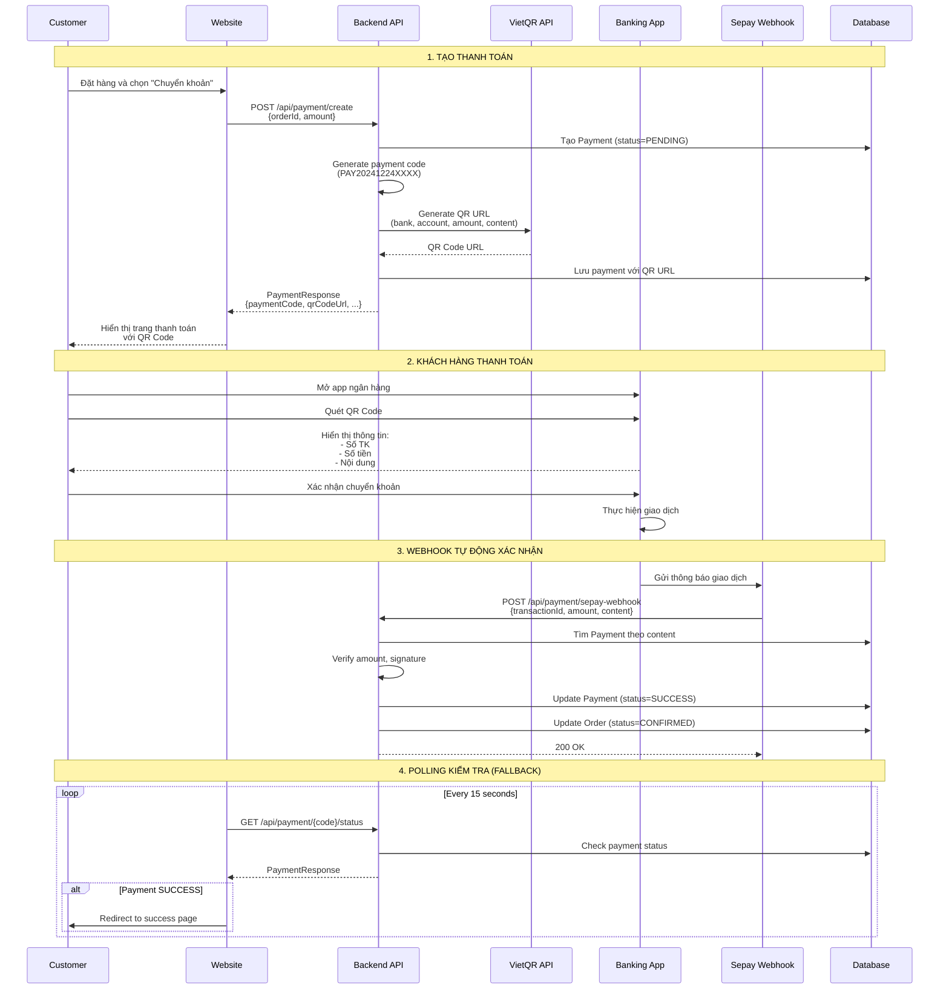

# Luồng Thanh Toán QR Code với Sepay

## Tổng Quan

Hệ thống sử dụng **VietQR** để tạo mã QR thanh toán và **Sepay Webhook** để nhận thông báo thanh toán tự động từ ngân hàng.

### Công Nghệ Sử Dụng

| Thành Phần | Công Nghệ | Mục Đích |
|------------|-----------|----------|
| **QR Code Generator** | VietQR API | Tạo mã QR thanh toán chuẩn ngân hàng VN |
| **Payment Gateway** | Sepay Webhook | Nhận thông báo giao dịch tự động |
| **Frontend Display** | React + Next.js | Hiển thị QR code và thông tin thanh toán |
| **Backend Processing** | Spring Boot | Xử lý logic thanh toán |

---

## 1. Luồng Thanh Toán Tổng Quan



---

## 2. Backend - Tạo Thanh Toán và QR Code

### 2.1. File: `PaymentServiceImpl.java`

#### Phương Thức Tạo Thanh Toán

```java
@Override
@Transactional
public ApiResponse createPayment(CreatePaymentRequest request, Long userId) {
    // 1. Validate order
    Order order = orderRepository.findById(request.getOrderId())
            .orElseThrow(() -> new RuntimeException("Không tìm thấy đơn hàng"));

    // 2. Verify ownership
    User user = userRepository.findById(userId)
            .orElseThrow(() -> new RuntimeException("Không tìm thấy người dùng"));
    
    if (!order.getCustomer().getUser().getId().equals(userId)) {
        return ApiResponse.error("Bạn không có quyền thanh toán đơn hàng này");
    }

    // 3. Check if payment already exists
    if (paymentRepository.findByOrderId(order.getId()).isPresent()) {
        return ApiResponse.error("Đơn hàng này đã có thanh toán");
    }

    // 4. Generate payment code (PAY20241224XXXX)
    String paymentCode = generatePaymentCode();

    // 5. Get bank account from database
    BankAccount bankAccount = bankAccountRepository.findByIsDefaultTrue()
            .orElse(null);
    
    String bankCode = bankAccount != null ? bankAccount.getBankCode() : sepayBankCode;
    String accountNumber = bankAccount != null ? bankAccount.getAccountNumber() : sepayAccountNumber;
    String accountName = bankAccount != null ? bankAccount.getAccountName() : sepayAccountName;

    // 6. Generate QR Code URL
    String qrCodeUrl = generateSepayQrCode(
        paymentCode, 
        request.getAmount(), 
        bankCode, 
        accountNumber, 
        accountName
    );

    // 7. Create payment entity
    Payment payment = Payment.builder()
            .paymentCode(paymentCode)
            .order(order)
            .user(user)
            .amount(request.getAmount())
            .method(PaymentMethod.SEPAY)
            .status(PaymentStatus.PENDING)
            .sepayBankCode(bankCode)
            .sepayAccountNumber(accountNumber)
            .sepayAccountName(accountName)
            .sepayContent(paymentCode)
            .sepayQrCode(qrCodeUrl)
            .build();

    Payment savedPayment = paymentRepository.save(payment);

    // 8. Update order
    order.setPaymentId(savedPayment.getId());
    order.setPaymentStatus(PaymentStatus.PENDING);
    orderRepository.save(order);

    // 9. Return response
    return ApiResponse.success("Tạo thanh toán thành công", toPaymentResponse(savedPayment));
}
```

#### Phương Thức Tạo Mã QR

```java
private String generateSepayQrCode(
    String content, 
    Double amount, 
    String bankCode, 
    String accountNumber, 
    String accountName
) {
    // Convert amount to VND (no decimal)
    long amountInVnd = Math.round(amount * amountMultiplier);
    
    log.info("Generating QR code - Bank: {}, Account: {}, Amount: {} VND", 
             bankCode, accountNumber, amountInVnd);
    
    // VietQR API format
    // Template: qr_only - chỉ có mã QR, không có text
    return String.format(
            "https://img.vietqr.io/image/%s-%s-qr_only.jpg?amount=%d&addInfo=%s&accountName=%s",
            bankCode,                           // Mã ngân hàng (VD: MBBank, VCB)
            accountNumber,                      // Số tài khoản
            amountInVnd,                        // Số tiền (VND)
            content,                            // Nội dung CK (payment code)
            accountName.replace(" ", "%20")     // Tên tài khoản (URL encoded)
    );
}
```

**Ví dụ URL được tạo:**
```
https://img.vietqr.io/image/MBBank-3333315012003-qr_only.jpg?amount=60010000&addInfo=PAY20241224001&accountName=LE%20MINH%20VUONG
```

#### Phương Thức Tạo Payment Code

```java
private String generatePaymentCode() {
    // Format: PAY + YYYYMMDD + 4 số random
    String date = LocalDate.now().format(DateTimeFormatter.ofPattern("yyyyMMdd"));
    int random = new Random().nextInt(9999);
    String code = "PAY" + date + String.format("%04d", random);

    // Check if exists (retry if duplicate)
    if (paymentRepository.existsByPaymentCode(code)) {
        return generatePaymentCode();
    }

    return code; // VD: PAY202412240123
}
```

---

## 3. Frontend - Hiển Thị QR Code

### 3.1. File: `app/payment/[orderCode]/page.tsx`

#### Component Chính

```typescript
export default function PaymentPage() {
  const [payment, setPayment] = useState<any>(null)
  const [order, setOrder] = useState<any>(null)
  const [timeLeft, setTimeLeft] = useState(900) // 15 phút
  const [checking, setChecking] = useState(false)
  
  // Load payment info khi vào trang
  useEffect(() => {
    loadPaymentInfo()
    startPolling() // Bắt đầu polling
  }, [])
  
  // Countdown timer
  useEffect(() => {
    if (timeLeft <= 0) {
      handleExpired()
      return
    }
    const timer = setInterval(() => {
      setTimeLeft(prev => prev - 1)
    }, 1000)
    return () => clearInterval(timer)
  }, [timeLeft])
}
```

#### Load Payment Info

```typescript
const loadPaymentInfo = async () => {
  try {
    const orderCode = params.orderCode as string
    
    // 1. Load order details
    const orderResponse = await fetch(
      `http://localhost:8080/api/orders/code/${orderCode}`,
      {
        headers: {
          'Authorization': `Bearer ${localStorage.getItem('auth_token')}`
        }
      }
    )
    const orderData = await orderResponse.json()
    setOrder(orderData.data)
    
    // 2. Load payment info
    const paymentResponse = await fetch(
      `http://localhost:8080/api/payment/order/${orderData.data.orderId}`,
      {
        headers: {
          'Authorization': `Bearer ${localStorage.getItem('auth_token')}`
        }
      }
    )
    const paymentData = await paymentResponse.json()
    setPayment(paymentData.data)
    
    // 3. Check if already paid
    if (paymentData.data.status === 'SUCCESS') {
      router.push(`/orders/${orderCode}?success=true`)
    }
  } catch (error) {
    toast.error('Lỗi khi tải thông tin thanh toán')
  }
}
```

#### Hiển Thị QR Code

```tsx
{/* QR Code - Clean & Minimal */}
<div className="flex flex-col items-center mb-6">
  <div className="relative">
    {/* QR Container */}
    <div className="bg-white p-8 rounded-2xl shadow-xl border-4 border-blue-500">
      
    </div>
  </div>
</div>
```

**Kết quả:**
- QR code kích thước 320x320px
- Border màu xanh dương
- Shadow để nổi bật
- Load ngay lập tức (eager loading)

#### Hiển Thị Thông Tin Chuyển Khoản

```tsx
{/* Bank Info */}
<div className="space-y-3">
  {/* Ngân hàng */}
  <div className="flex justify-between items-center p-3 bg-gray-50 rounded-lg">
    <div>
      <div className="text-sm text-gray-600">Ngân hàng</div>
      <div className="font-medium">{payment.bankCode}</div>
    </div>
  </div>

  {/* Số tài khoản */}
  <div className="flex justify-between items-center p-3 bg-gray-50 rounded-lg">
    <div>
      <div className="text-sm text-gray-600">Số tài khoản</div>
      <div className="font-medium">{payment.accountNumber}</div>
    </div>
    <button onClick={() => copyToClipboard(payment.accountNumber, 'số tài khoản')}>
      <FiCopy size={20} />
    </button>
  </div>

  {/* Nội dung chuyển khoản - QUAN TRỌNG */}
  <div className="flex justify-between items-center p-3 bg-yellow-50 rounded-lg border border-yellow-200">
    <div>
      <div className="text-sm text-gray-600">Nội dung chuyển khoản</div>
      <div className="font-bold text-red-600">{payment.content}</div>
    </div>
    <button onClick={() => copyToClipboard(payment.content, 'nội dung')}>
      <FiCopy size={20} />
    </button>
  </div>
</div>
```

---

## 4. Polling - Kiểm Tra Trạng Thái Tự Động

### 4.1. Start Polling

```typescript
const startPolling = () => {
  console.log('🚀 Starting polling - will check every 15 seconds')
  let pollCount = 0
  const maxPolls = 40 // 40 * 15s = 10 phút max
  
  // Poll every 15 seconds
  pollingInterval.current = setInterval(async () => {
    pollCount++
    
    // Stop after max attempts
    if (pollCount >= maxPolls) {
      clearInterval(pollingInterval.current)
      return
    }
    
    await checkPaymentStatus()
  }, 15000) // 15 giây
}
```

### 4.2. Check Payment Status

```typescript
const checkPaymentStatus = async () => {
  if (checking || !payment) return

  setChecking(true)
  try {
    // No auth needed (public endpoint)
    const response = await fetch(
      `http://localhost:8080/api/payment/${payment.paymentCode}/status`
    )
    
    if (response.ok) {
      const data = await response.json()
      setPayment(data.data)
      
      // Check if completed
      if (data.data.status === 'SUCCESS') {
        handlePaymentSuccess()
      }
    }
  } catch (error) {
    console.error('Error checking payment status:', error)
  } finally {
    setChecking(false)
  }
}
```

### 4.3. Handle Success

```typescript
const handlePaymentSuccess = () => {
  // Stop polling
  if (pollingInterval.current) {
    clearInterval(pollingInterval.current)
  }

  toast.success('Thanh toán thành công!')
  
  // Redirect to success page
  setTimeout(() => {
    router.push(`/orders/${params.orderCode}?success=true`)
  }, 1500)
}
```

---

## 5. Sepay Webhook - Xác Nhận Tự Động

### 5.1. Webhook Endpoint

```java
@PostMapping("/sepay-webhook")
public ApiResponse handleSepayWebhook(@RequestBody SepayWebhookRequest request) {
    log.info("Received SePay webhook: {}", request);

    try {
        // 1. Validate content contains "PAY"
        String content = request.getContent();
        if (content == null || !content.contains("PAY")) {
            return ApiResponse.error("Nội dung không chứa mã thanh toán");
        }

        // 2. Extract payment code
        String paymentCode = extractPaymentCode(content);
        
        // 3. Find payment
        Payment payment = paymentRepository.findByPaymentCode(paymentCode)
                .orElseThrow(() -> new RuntimeException("Không tìm thấy thanh toán"));

        // 4. Verify signature (if configured)
        BankAccount bankAccount = bankAccountRepository.findByIsDefaultTrue().orElse(null);
        if (bankAccount != null && bankAccount.getSepayApiToken() != null) {
            if (!verifySignature(request, bankAccount.getSepayApiToken())) {
                return ApiResponse.error("Chữ ký không hợp lệ");
            }
        }

        // 5. Check if already processed
        if (payment.getStatus() == PaymentStatus.SUCCESS) {
            return ApiResponse.success("Thanh toán đã được xử lý");
        }

        // 6. Verify amount
        if (!payment.getAmount().equals(request.getAmount())) {
            return ApiResponse.error("Số tiền không khớp");
        }

        // 7. Update payment
        payment.setStatus(PaymentStatus.SUCCESS);
        payment.setSepayTransactionId(request.getTransactionId());
        payment.setPaidAt(LocalDateTime.now());
        paymentRepository.save(payment);

        // 8. Update order
        Order order = payment.getOrder();
        order.setPaymentStatus(PaymentStatus.PAID);
        order.setStatus(OrderStatus.CONFIRMED);
        order.setConfirmedAt(LocalDateTime.now());
        orderRepository.save(order);

        // 9. Publish event for accounting
        eventPublisher.publishEvent(
            new OrderStatusChangedEvent(this, order, oldStatus, order.getStatus())
        );

        return ApiResponse.success("Xử lý thanh toán thành công");

    } catch (Exception e) {
        log.error("Error processing SePay webhook", e);
        return ApiResponse.error("Lỗi xử lý webhook: " + e.getMessage());
    }
}
```

### 5.2. Extract Payment Code

```java
private String extractPaymentCode(String content) {
    // Content có thể là: "PAY202412240123" hoặc "PAY202412240123 FT2533.."
    
    int index = content.indexOf("PAY");
    if (index != -1) {
        // Lấy từ vị trí PAY, tối đa 15 ký tự
        int endIndex = Math.min(index + 15, content.length());
        String extracted = content.substring(index, endIndex).split("\\s+")[0];
        return extracted;
    }
    
    return content.trim();
}
```

---

## 6. Configuration

### 6.1. File: `application.properties`

```properties
# SePay Configuration
sepay.merchant-id=SP-TEST-LQB926AA
sepay.secret-key=spsk_test_G9NcwYj2Qd2HK32rWxLd9zazg38DQSUE
sepay.api-url=https://api-staging.sepay.vn/v2/payment-qr

# Bank Account Info (for QR Code)
sepay.bank.code=MBBank
sepay.bank.account.number=3333315012003
sepay.bank.account.name=LE MINH VUONG

# API Secret for webhook verification
sepay.api.secret=spsk_test_G9NcwYj2Qd2HK32rWxLd9zazg38DQSUE

# Amount multiplier
sepay.amount.multiplier=1
```

---

## 7. Database Schema

### 7.1. Bảng `payments`

```sql
CREATE TABLE payments (
    id BIGINT PRIMARY KEY AUTO_INCREMENT,
    payment_code VARCHAR(50) UNIQUE NOT NULL,
    order_id BIGINT NOT NULL,
    user_id BIGINT NOT NULL,
    amount DOUBLE NOT NULL,
    method VARCHAR(20) NOT NULL,
    status VARCHAR(20) NOT NULL,
    
    -- Sepay fields
    sepay_bank_code VARCHAR(20),
    sepay_account_number VARCHAR(50),
    sepay_account_name VARCHAR(255),
    sepay_content VARCHAR(255),
    sepay_qr_code TEXT,
    sepay_transaction_id VARCHAR(100),
    sepay_response TEXT,
    
    -- Timestamps
    created_at TIMESTAMP DEFAULT CURRENT_TIMESTAMP,
    expired_at TIMESTAMP,
    paid_at TIMESTAMP,
    
    FOREIGN KEY (order_id) REFERENCES orders(id),
    FOREIGN KEY (user_id) REFERENCES users(id)
);
```

---

## 8. Kết Luận

### 8.1. Ưu Điểm

1. **Tự động hóa hoàn toàn**: Webhook tự động xác nhận thanh toán
2. **UX tốt**: QR code dễ quét, thông tin rõ ràng
3. **Fallback polling**: Đảm bảo không bỏ sót thanh toán
4. **Bảo mật**: Verify signature, check amount
5. **Linh hoạt**: Hỗ trợ nhiều tài khoản ngân hàng

### 8.2. Luồng Hoạt Động

```
1. Customer đặt hàng → Tạo Payment (PENDING)
2. Generate QR code với VietQR API
3. Hiển thị QR code cho customer
4. Customer quét QR và chuyển khoản
5. Ngân hàng → Sepay → Webhook → Backend
6. Backend verify và update Payment (SUCCESS)
7. Update Order (CONFIRMED)
8. Frontend polling phát hiện → Redirect success page
```

### 8.3. Thời Gian Xử Lý

- **Tạo QR code**: < 1 giây
- **Webhook nhận thông báo**: 5-30 giây sau khi CK
- **Polling interval**: 15 giây
- **Timeout thanh toán**: 15 phút
