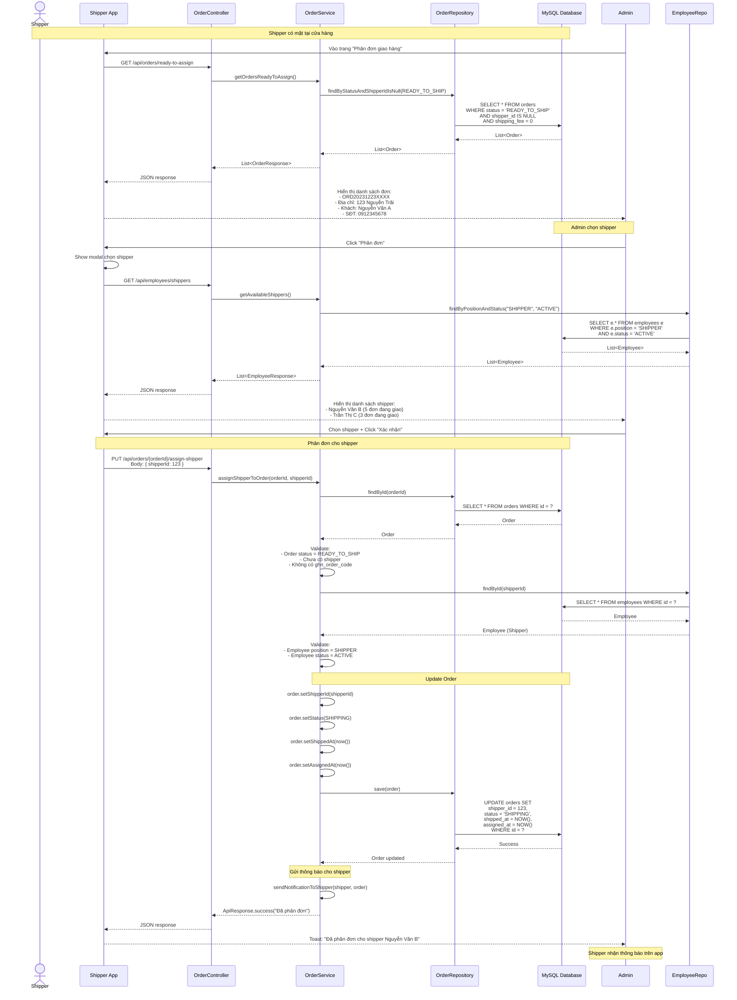

# Luồng Shipper Nhận Đơn Tự Động

## Tổng Quan

Shipper tự nhận đơn khi có mặt tại cửa hàng. Mỗi ca chỉ có 1 shipper, không cần admin phân đơn.

---

## ĐIỀU KIỆN

### Đơn nào shipper có thể nhận?

1. **Đơn nội thành Hà Nội** (không dùng GHN)
2. **Đơn miễn phí ship** (shipping_fee = 0)
3. **Status = READY_TO_SHIP** (đã xuất kho)
4. **Chưa có shipper_id** (chưa ai nhận)

### Đơn nào dùng GHN?

1. **Đơn ngoại thành** (tỉnh khác)
2. **Có phí ship** (shipping_fee > 0)
3. **Tự động tạo GHN order** khi xuất kho

---

## SƠ ĐỒ TUẦN TỰ



---

## CHI TIẾT IMPLEMENTATION

### 1. API Endpoints

#### 1.1. Lấy danh sách đơn chưa phân

**Endpoint**: `GET /api/orders/ready-to-assign`

**Controller**:
```java
@GetMapping("/ready-to-assign")
@PreAuthorize("hasAnyAuthority('ADMIN', 'MANAGER')")
public ApiResponse getOrdersReadyToAssign() {
    return orderService.getOrdersReadyToAssign();
}
```

**Service**:
```java
public ApiResponse getOrdersReadyToAssign() {
    List<Order> orders = orderRepository.findByStatusAndShipperIdIsNullAndShippingFeeEquals(
        OrderStatus.READY_TO_SHIP, 0.0
    );
    
    List<OrderResponse> responses = orders.stream()
        .map(this::toOrderResponse)
        .collect(Collectors.toList());
    
    return ApiResponse.success("Danh sách đơn chưa phân", responses);
}
```

**Repository**:
```java
List<Order> findByStatusAndShipperIdIsNullAndShippingFeeEquals(
    OrderStatus status, Double shippingFee
);
```

**SQL**:
```sql
SELECT * FROM orders 
WHERE status = 'READY_TO_SHIP'
  AND shipper_id IS NULL
  AND shipping_fee = 0
  AND ghn_order_code IS NULL
ORDER BY created_at ASC;
```

---

#### 1.2. Lấy danh sách shipper

**Endpoint**: `GET /api/employees/shippers`

**Controller**:
```java
@GetMapping("/shippers")
@PreAuthorize("hasAnyAuthority('ADMIN', 'MANAGER')")
public ApiResponse getAvailableShippers() {
    return employeeService.getAvailableShippers();
}
```

**Service**:
```java
public ApiResponse getAvailableShippers() {
    List<Employee> shippers = employeeRepository.findByPositionAndStatus(
        Position.SHIPPER, EmployeeStatus.ACTIVE
    );
    
    List<ShipperResponse> responses = shippers.stream()
        .map(shipper -> {
            // Đếm số đơn đang giao
            long activeOrders = orderRepository.countByShipperIdAndStatusIn(
                shipper.getId(), 
                Arrays.asList(OrderStatus.SHIPPING, OrderStatus.READY_TO_SHIP)
            );
            
            return ShipperResponse.builder()
                .shipperId(shipper.getId())
                .fullName(shipper.getFullName())
                .phone(shipper.getPhone())
                .activeOrdersCount(activeOrders)
                .build();
        })
        .collect(Collectors.toList());
    
    return ApiResponse.success("Danh sách shipper", responses);
}
```

**Repository**:
```java
List<Employee> findByPositionAndStatus(Position position, EmployeeStatus status);

long countByShipperIdAndStatusIn(Long shipperId, List<OrderStatus> statuses);
```

**SQL**:
```sql
-- Get shippers
SELECT * FROM employees 
WHERE position = 'SHIPPER'
  AND status = 'ACTIVE';

-- Count active orders per shipper
SELECT COUNT(*) FROM orders 
WHERE shipper_id = ?
  AND status IN ('SHIPPING', 'READY_TO_SHIP');
```

---

#### 1.3. Phân đơn cho shipper

**Endpoint**: `PUT /api/orders/{orderId}/assign-shipper`

**Request Body**:
```json
{
  "shipperId": 123
}
```

**Controller**:
```java
@PutMapping("/{orderId}/assign-shipper")
@PreAuthorize("hasAnyAuthority('ADMIN', 'MANAGER')")
public ApiResponse assignShipperToOrder(
    @PathVariable Long orderId,
    @RequestBody AssignShipperRequest request
) {
    return orderService.assignShipperToOrder(orderId, request.getShipperId());
}
```

**Service**:
```java
@Transactional
public ApiResponse assignShipperToOrder(Long orderId, Long shipperId) {
    // 1. Get order
    Order order = orderRepository.findById(orderId)
        .orElseThrow(() -> new RuntimeException("Không tìm thấy đơn hàng"));
    
    // 2. Validate order
    if (order.getStatus() != OrderStatus.READY_TO_SHIP) {
        return ApiResponse.error("Đơn hàng chưa sẵn sàng giao");
    }
    
    if (order.getShipperId() != null) {
        return ApiResponse.error("Đơn hàng đã được phân cho shipper khác");
    }
    
    if (order.getGhnOrderCode() != null) {
        return ApiResponse.error("Đơn hàng đang giao qua GHN");
    }
    
    // 3. Get shipper
    Employee shipper = employeeRepository.findById(shipperId)
        .orElseThrow(() -> new RuntimeException("Không tìm thấy shipper"));
    
    // 4. Validate shipper
    if (shipper.getPosition() != Position.SHIPPER) {
        return ApiResponse.error("Nhân viên không phải shipper");
    }
    
    if (shipper.getStatus() != EmployeeStatus.ACTIVE) {
        return ApiResponse.error("Shipper không hoạt động");
    }
    
    // 5. Update order
    order.setShipperId(shipperId);
    order.setStatus(OrderStatus.SHIPPING);
    order.setShippedAt(LocalDateTime.now());
    order.setAssignedAt(LocalDateTime.now());
    
    orderRepository.save(order);
    
    // 6. Send notification to shipper
    sendNotificationToShipper(shipper, order);
    
    log.info("Assigned order {} to shipper {}", order.getOrderCode(), shipper.getFullName());
    
    return ApiResponse.success("Đã phân đơn cho shipper " + shipper.getFullName());
}
```

**SQL**:
```sql
UPDATE orders 
SET shipper_id = 123,
    status = 'SHIPPING',
    shipped_at = NOW(),
    assigned_at = NOW()
WHERE id = ?;
```

---

### 2. Database Schema

**orders table** (thêm columns):
```sql
ALTER TABLE orders 
ADD COLUMN shipper_id BIGINT,
ADD COLUMN assigned_at DATETIME,
ADD FOREIGN KEY (shipper_id) REFERENCES employees(id);
```

**employees table**:
```sql
CREATE TABLE employees (
    id BIGINT PRIMARY KEY AUTO_INCREMENT,
    full_name VARCHAR(255),
    phone VARCHAR(20),
    position ENUM('ADMIN', 'MANAGER', 'WAREHOUSE', 'SHIPPER', 'SALES'),
    status ENUM('ACTIVE', 'INACTIVE'),
    created_at DATETIME
);
```

---

### 3. DTOs

**AssignShipperRequest**:
```java
@Data
public class AssignShipperRequest {
    @NotNull(message = "Shipper ID không được để trống")
    private Long shipperId;
}
```

**ShipperResponse**:
```java
@Data
@Builder
public class ShipperResponse {
    private Long shipperId;
    private String fullName;
    private String phone;
    private Long activeOrdersCount; // Số đơn đang giao
}
```

---

### 4. Frontend Flow

#### 4.1. Trang phân đơn

**URL**: `/admin/assign-orders`

**UI**:
```
┌─────────────────────────────────────────────────┐
│ Phân Đơn Giao Hàng                              │
├─────────────────────────────────────────────────┤
│                                                 │
│ Đơn hàng chưa phân (5)                         │
│                                                 │
│ ┌─────────────────────────────────────────┐   │
│ │ ORD20231223001                          │   │
│ │ Khách: Nguyễn Văn A - 0912345678       │   │
│ │ Địa chỉ: 123 Nguyễn Trãi, Thanh Xuân   │   │
│ │ Tổng tiền: 500,000đ                     │   │
│ │                    [Phân đơn]           │   │
│ └─────────────────────────────────────────┘   │
│                                                 │
│ ┌─────────────────────────────────────────┐   │
│ │ ORD20231223002                          │   │
│ │ ...                                     │   │
│ └─────────────────────────────────────────┘   │
└─────────────────────────────────────────────────┘
```

#### 4.2. Modal chọn shipper

```
┌─────────────────────────────────────┐
│ Chọn Shipper                        │
├─────────────────────────────────────┤
│                                     │
│ ○ Nguyễn Văn B (5 đơn đang giao)  │
│ ○ Trần Thị C (3 đơn đang giao)    │
│ ○ Lê Văn D (7 đơn đang giao)      │
│                                     │
│        [Hủy]    [Xác nhận]         │
└─────────────────────────────────────┘
```

---

## SHIPPER APP

### 1. Shipper xem đơn được phân

**Endpoint**: `GET /api/orders/my-deliveries`

**Service**:
```java
public ApiResponse getMyDeliveries(Long shipperId) {
    List<Order> orders = orderRepository.findByShipperIdAndStatusIn(
        shipperId,
        Arrays.asList(OrderStatus.SHIPPING, OrderStatus.READY_TO_SHIP)
    );
    
    return ApiResponse.success("Đơn hàng của bạn", orders);
}
```

### 2. Shipper cập nhật trạng thái

**Endpoint**: `PUT /api/orders/{orderId}/update-delivery-status`

**Request**:
```json
{
  "status": "DELIVERED",
  "note": "Đã giao hàng thành công",
  "deliveredAt": "2023-12-23T15:30:00"
}
```

---

## TÓM TẮT

**Luồng phân đơn**:
1. Admin vào trang "Phân đơn giao hàng"
2. Hệ thống hiển thị đơn READY_TO_SHIP, chưa có shipper, shipping_fee = 0
3. Admin click "Phân đơn" → Chọn shipper
4. Hệ thống update order: shipper_id, status = SHIPPING
5. Shipper nhận thông báo trên app
6. Shipper giao hàng và cập nhật trạng thái

**Key points**:
- Chỉ phân đơn nội thành (không dùng GHN)
- Hiển thị số đơn đang giao của mỗi shipper
- Shipper có app riêng để xem và cập nhật đơn

---

**Document Version**: 1.0  
**Last Updated**: 2024-12-25
