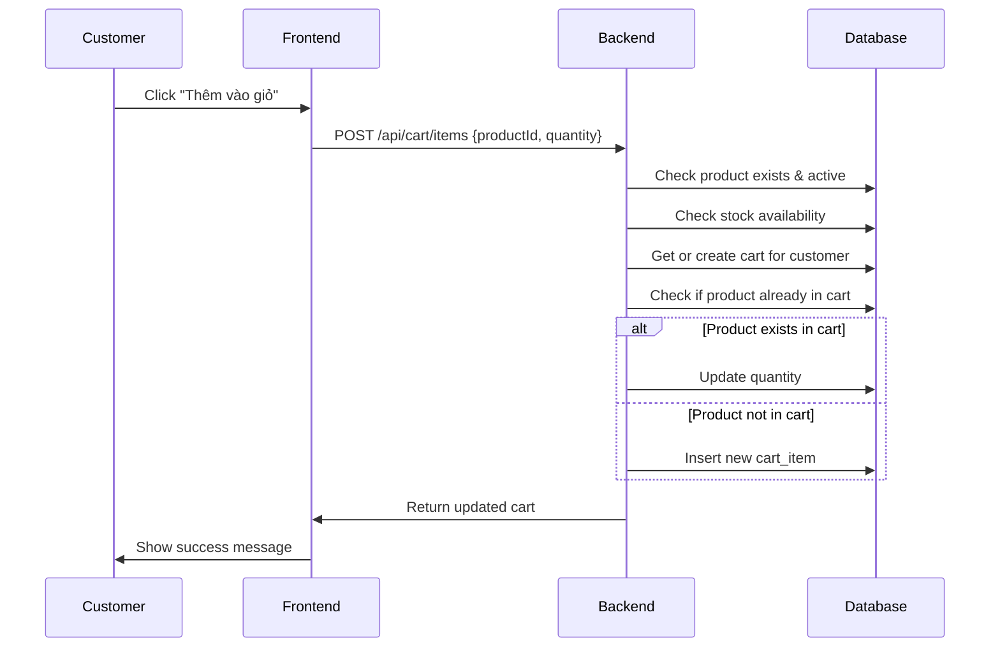
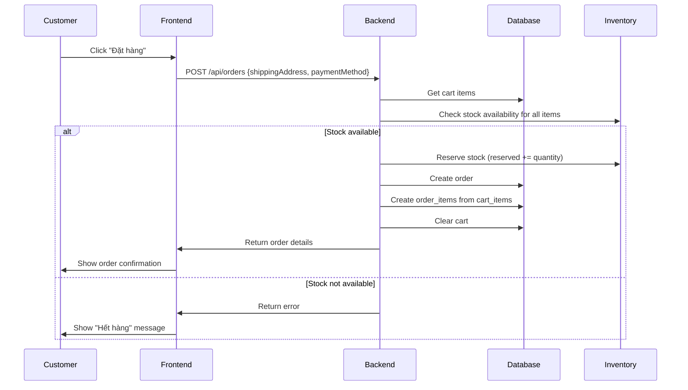
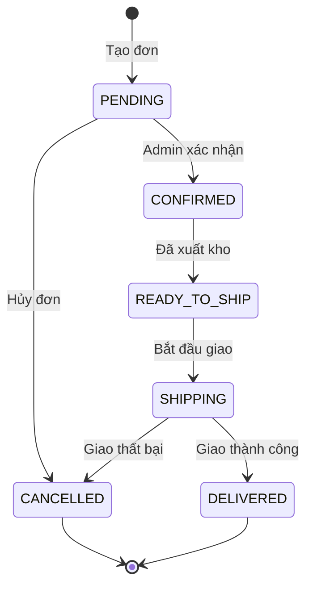
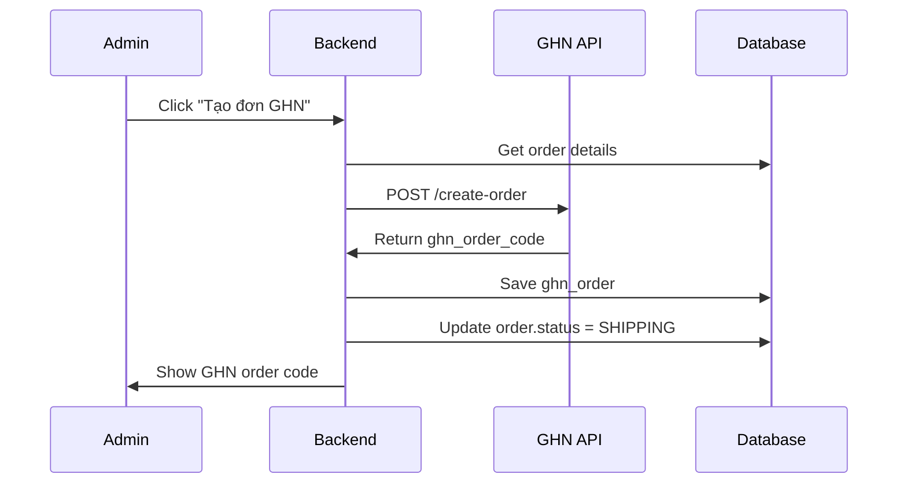
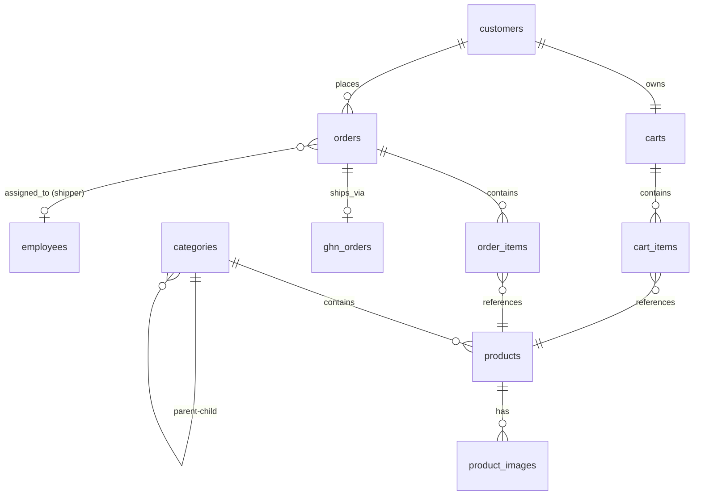

# Phân Tích Thiết Kế - Phần Quản Lý Sản Phẩm và Đơn Hàng

## Phạm Vi Trách Nhiệm

Phần này bao gồm các chức năng:
1. **Quản lý sản phẩm**: Hiển thị, tìm kiếm, phân loại sản phẩm
2. **Giỏ hàng**: Khách hàng thêm sản phẩm vào giỏ
3. **Đặt hàng**: Tạo đơn hàng từ giỏ hàng
4. **Tìm kiếm sản phẩm**: Tìm kiếm và lọc sản phẩm
5. **Giao hàng**: Tích hợp GHN và shipper riêng

---

## 1. Module Product - Quản Lý Sản Phẩm

### 1.1. Cấu Trúc Bảng

#### Bảng `categories` - Danh Mục Sản Phẩm
```sql
CREATE TABLE categories (
    id BIGINT PRIMARY KEY AUTO_INCREMENT,
    name VARCHAR(100) NOT NULL,
    description TEXT,
    parent_id BIGINT,
    active BOOLEAN DEFAULT TRUE,
    created_at TIMESTAMP DEFAULT CURRENT_TIMESTAMP,
    updated_at TIMESTAMP DEFAULT CURRENT_TIMESTAMP ON UPDATE CURRENT_TIMESTAMP,
    FOREIGN KEY (parent_id) REFERENCES categories(id) ON DELETE SET NULL
);
```

**Đặc điểm**:
- Hỗ trợ **danh mục phân cấp** (parent-child)
- `parent_id = NULL`: Danh mục gốc
- Soft delete với `active` flag

**Ví dụ phân cấp**:
```
Điện tử (parent_id=NULL)
  └─ Laptop (parent_id=1)
      └─ Laptop Gaming (parent_id=2)
```

#### Bảng `products` - Sản Phẩm
```sql
CREATE TABLE products (
    id BIGINT PRIMARY KEY AUTO_INCREMENT,
    sku VARCHAR(50) UNIQUE NOT NULL,
    name VARCHAR(255) NOT NULL,
    description TEXT,
    price DOUBLE NOT NULL,
    category_id BIGINT,
    warehouse_product_id BIGINT,
    active BOOLEAN DEFAULT TRUE,
    created_at TIMESTAMP DEFAULT CURRENT_TIMESTAMP,
    updated_at TIMESTAMP DEFAULT CURRENT_TIMESTAMP ON UPDATE CURRENT_TIMESTAMP,
    FOREIGN KEY (category_id) REFERENCES categories(id),
    FOREIGN KEY (warehouse_product_id) REFERENCES warehouse_products(id)
);
```

**Đặc điểm**:
- `sku`: Mã sản phẩm duy nhất
- `price`: Giá bán cho khách hàng
- `warehouse_product_id`: Liên kết với kho (optional)
- Soft delete với `active` flag

#### Bảng `product_images` - Hình Ảnh Sản Phẩm
```sql
CREATE TABLE product_images (
    id BIGINT PRIMARY KEY AUTO_INCREMENT,
    product_id BIGINT NOT NULL,
    image_url VARCHAR(500) NOT NULL,
    is_primary BOOLEAN DEFAULT FALSE,
    display_order INT DEFAULT 0,
    created_at TIMESTAMP DEFAULT CURRENT_TIMESTAMP,
    FOREIGN KEY (product_id) REFERENCES products(id) ON DELETE CASCADE
);
```

**Đặc điểm**:
- Một sản phẩm có **nhiều ảnh**
- `is_primary = true`: Ảnh chính hiển thị đầu tiên
- `display_order`: Thứ tự hiển thị

### 1.2. Quan Hệ Trong Module Product

#### Relationship 1: categories (1) ↔ (N) categories (Self-Join)
**Loại**: One-to-Many (Self-referencing)
**Foreign Key**: `categories.parent_id → categories.id`

**Ý nghĩa**:
- Hỗ trợ danh mục phân cấp nhiều tầng
- Khi xóa parent, children vẫn tồn tại (SET NULL)
- Hỗ trợ navigation menu và breadcrumb

**Ví dụ**:
```
Category (id=1, name="Điện tử", parent_id=NULL)
  ↓
Category (id=2, name="Laptop", parent_id=1)
  ↓
Category (id=3, name="Laptop Gaming", parent_id=2)
```

#### Relationship 2: categories (1) ↔ (N) products
**Loại**: One-to-Many
**Foreign Key**: `products.category_id → categories.id`

**Ý nghĩa**:
- Mỗi sản phẩm thuộc 1 danh mục
- Hỗ trợ filter và tìm kiếm theo danh mục
- Hỗ trợ SEO và navigation

#### Relationship 3: products (1) ↔ (N) product_images
**Loại**: One-to-Many
**Foreign Key**: `product_images.product_id → products.id`

**Ý nghĩa**:
- Một sản phẩm có nhiều ảnh
- Cascade delete: Xóa product → xóa tất cả ảnh
- Hỗ trợ gallery và zoom ảnh

**Ví dụ**:
```
Product (id=1, name="iPhone 15")
  ↓
  ├─ ProductImage (id=1, is_primary=true, display_order=0, url="front.jpg")
  ├─ ProductImage (id=2, is_primary=false, display_order=1, url="back.jpg")
  └─ ProductImage (id=3, is_primary=false, display_order=2, url="side.jpg")
```

### 1.3. Chức Năng Tìm Kiếm Sản Phẩm

#### API Endpoint
```
GET /api/products/search?keyword=iphone&category=2&minPrice=10000000&maxPrice=30000000&page=0&size=20
```

#### Query Logic
```java
@Query("SELECT p FROM Product p " +
       "WHERE p.active = true " +
       "AND (:keyword IS NULL OR p.name LIKE %:keyword% OR p.description LIKE %:keyword%) " +
       "AND (:categoryId IS NULL OR p.category.id = :categoryId) " +
       "AND (:minPrice IS NULL OR p.price >= :minPrice) " +
       "AND (:maxPrice IS NULL OR p.price <= :maxPrice)")
Page<Product> searchProducts(@Param("keyword") String keyword,
                             @Param("categoryId") Long categoryId,
                             @Param("minPrice") Double minPrice,
                             @Param("maxPrice") Double maxPrice,
                             Pageable pageable);
```

#### Indexes Cần Thiết
```sql
CREATE INDEX idx_products_name ON products(name);
CREATE INDEX idx_products_category ON products(category_id);
CREATE INDEX idx_products_price ON products(price);
CREATE INDEX idx_products_active ON products(active);
CREATE INDEX idx_products_category_active ON products(category_id, active);
```

---

## 2. Module Cart - Giỏ Hàng

### 2.1. Cấu Trúc Bảng

#### Bảng `carts` - Giỏ Hàng
```sql
CREATE TABLE carts (
    id BIGINT PRIMARY KEY AUTO_INCREMENT,
    customer_id BIGINT UNIQUE NOT NULL,
    created_at TIMESTAMP DEFAULT CURRENT_TIMESTAMP,
    updated_at TIMESTAMP DEFAULT CURRENT_TIMESTAMP ON UPDATE CURRENT_TIMESTAMP,
    FOREIGN KEY (customer_id) REFERENCES customers(id) ON DELETE CASCADE
);
```

**Đặc điểm**:
- Mỗi customer có **đúng 1 giỏ hàng** (UNIQUE constraint)
- Persistent cart: Tồn tại xuyên suốt các session
- Cascade delete: Xóa customer → xóa cart

#### Bảng `cart_items` - Sản Phẩm Trong Giỏ
```sql
CREATE TABLE cart_items (
    id BIGINT PRIMARY KEY AUTO_INCREMENT,
    cart_id BIGINT NOT NULL,
    product_id BIGINT NOT NULL,
    quantity INT NOT NULL DEFAULT 1,
    price DOUBLE NOT NULL,
    created_at TIMESTAMP DEFAULT CURRENT_TIMESTAMP,
    updated_at TIMESTAMP DEFAULT CURRENT_TIMESTAMP ON UPDATE CURRENT_TIMESTAMP,
    FOREIGN KEY (cart_id) REFERENCES carts(id) ON DELETE CASCADE,
    FOREIGN KEY (product_id) REFERENCES products(id)
);
```

**Đặc điểm**:
- `price`: Snapshot giá tại thời điểm thêm vào giỏ
- `quantity`: Số lượng sản phẩm
- Cascade delete: Xóa cart → xóa tất cả items

### 2.2. Quan Hệ Trong Module Cart

#### Relationship 1: customers (1) ↔ (1) carts
**Loại**: One-to-One (Mandatory)
**Foreign Key**: `carts.customer_id → customers.id`

**Ý nghĩa**:
- Mỗi customer có đúng 1 giỏ hàng
- Giỏ hàng được tạo tự động khi customer đăng ký
- Khi login, giỏ hàng được restore

#### Relationship 2: carts (1) ↔ (N) cart_items
**Loại**: One-to-Many
**Foreign Key**: `cart_items.cart_id → carts.id`

**Ý nghĩa**:
- Một giỏ hàng chứa nhiều items
- Price được snapshot để tránh thay đổi giá ảnh hưởng
- Cascade delete: Xóa cart → xóa items

#### Relationship 3: cart_items (N) ↔ (1) products
**Loại**: Many-to-One
**Foreign Key**: `cart_items.product_id → products.id`

**Ý nghĩa**:
- Mỗi cart item tham chiếu đến 1 product
- Không cascade: Xóa product không xóa cart item (cần handle riêng)

### 2.3. Luồng Thêm Sản Phẩm Vào Giỏ



#### API Endpoint
```java
@PostMapping("/api/cart/items")
public ResponseEntity<CartDTO> addToCart(@RequestBody AddToCartRequest request) {
    // 1. Validate product exists and active
    // 2. Check stock availability
    // 3. Get or create cart
    // 4. Add or update cart item
    // 5. Return updated cart
}
```

---

## 3. Module Order - Đặt Hàng

### 3.1. Cấu Trúc Bảng

#### Bảng `orders` - Đơn Hàng
```sql
CREATE TABLE orders (
    id BIGINT PRIMARY KEY AUTO_INCREMENT,
    order_code VARCHAR(50) UNIQUE NOT NULL,
    customer_id BIGINT NOT NULL,
    total DOUBLE NOT NULL,
    status VARCHAR(50) NOT NULL,
    shipping_address TEXT NOT NULL,
    shipping_method VARCHAR(50),
    shipping_fee DOUBLE DEFAULT 0,
    payment_method VARCHAR(50),
    notes TEXT,
    created_at TIMESTAMP DEFAULT CURRENT_TIMESTAMP,
    updated_at TIMESTAMP DEFAULT CURRENT_TIMESTAMP ON UPDATE CURRENT_TIMESTAMP,
    FOREIGN KEY (customer_id) REFERENCES customers(id)
);
```

**Đặc điểm**:
- `order_code`: Mã đơn hàng duy nhất (format: ORD-YYYYMMDD-XXX)
- `status`: PENDING, CONFIRMED, READY_TO_SHIP, SHIPPING, DELIVERED, CANCELLED
- `shipping_method`: GHN hoặc INTERNAL (shipper riêng)
- `shipping_address`: Địa chỉ giao hàng đầy đủ

#### Bảng `order_items` - Chi Tiết Đơn Hàng
```sql
CREATE TABLE order_items (
    id BIGINT PRIMARY KEY AUTO_INCREMENT,
    order_id BIGINT NOT NULL,
    product_id BIGINT NOT NULL,
    product_name VARCHAR(255) NOT NULL,
    quantity INT NOT NULL,
    price DOUBLE NOT NULL,
    serial_number VARCHAR(100),
    reserved BOOLEAN DEFAULT FALSE,
    exported BOOLEAN DEFAULT FALSE,
    created_at TIMESTAMP DEFAULT CURRENT_TIMESTAMP,
    FOREIGN KEY (order_id) REFERENCES orders(id) ON DELETE CASCADE,
    FOREIGN KEY (product_id) REFERENCES products(id)
);
```

**Đặc điểm**:
- `product_name`, `price`: Snapshot tại thời điểm đặt hàng
- `serial_number`: Serial cụ thể được xuất (nếu có)
- `reserved`: Đã giữ hàng trong kho
- `exported`: Đã xuất kho

### 3.2. Quan Hệ Trong Module Order

#### Relationship 1: customers (1) ↔ (N) orders
**Loại**: One-to-Many
**Foreign Key**: `orders.customer_id → customers.id`

**Ý nghĩa**:
- Một customer có thể đặt nhiều đơn hàng
- Tracking lịch sử mua hàng
- Hỗ trợ customer analytics

#### Relationship 2: orders (1) ↔ (N) order_items
**Loại**: One-to-Many
**Foreign Key**: `order_items.order_id → orders.id`

**Ý nghĩa**:
- Một đơn hàng chứa nhiều sản phẩm
- Cascade delete: Xóa order → xóa items
- Snapshot thông tin để tránh thay đổi sau này

**Ví dụ**:
```
Order (id=1, order_code="ORD-20241223-001", total=50000000)
  ↓
  ├─ OrderItem (id=1, product_name="iPhone 15", price=29990000, quantity=1)
  ├─ OrderItem (id=2, product_name="AirPods Pro", price=6990000, quantity=2)
  └─ OrderItem (id=3, product_name="Case", price=500000, quantity=2)
```

### 3.3. Luồng Đặt Hàng



#### API Endpoint
```java
@PostMapping("/api/orders")
@Transactional
public ResponseEntity<OrderDTO> createOrder(@RequestBody CreateOrderRequest request) {
    // 1. Get cart items
    // 2. Validate stock availability
    // 3. Reserve stock
    // 4. Create order
    // 5. Create order items
    // 6. Clear cart
    // 7. Return order
}
```

### 3.4. Trạng Thái Đơn Hàng (Order Status)



**Mô tả trạng thái**:
- **PENDING**: Đơn mới tạo, chờ xác nhận
- **CONFIRMED**: Admin đã xác nhận, chờ xuất kho
- **READY_TO_SHIP**: Đã xuất kho, sẵn sàng giao
- **SHIPPING**: Đang giao hàng
- **DELIVERED**: Đã giao thành công
- **CANCELLED**: Đã hủy

---

## 4. Module Shipping - Giao Hàng

### 4.1. Tích Hợp Giao Hàng Nhanh (GHN)

#### Bảng `ghn_orders` - Đơn GHN
```sql
CREATE TABLE ghn_orders (
    id BIGINT PRIMARY KEY AUTO_INCREMENT,
    order_id BIGINT UNIQUE NOT NULL,
    ghn_order_code VARCHAR(100) UNIQUE,
    status VARCHAR(50),
    expected_delivery_time TIMESTAMP,
    total_fee DOUBLE,
    created_at TIMESTAMP DEFAULT CURRENT_TIMESTAMP,
    updated_at TIMESTAMP DEFAULT CURRENT_TIMESTAMP ON UPDATE CURRENT_TIMESTAMP,
    FOREIGN KEY (order_id) REFERENCES orders(id)
);
```

**Đặc điểm**:
- `ghn_order_code`: Mã đơn từ GHN
- `status`: Trạng thái từ GHN webhook
- `total_fee`: Phí vận chuyển từ GHN

#### Luồng Tạo Đơn GHN



#### API Endpoint
```java
@PostMapping("/api/orders/{orderId}/ghn/create")
public ResponseEntity<GhnOrderDTO> createGhnOrder(@PathVariable Long orderId) {
    // 1. Get order details
    // 2. Call GHN API to create order
    // 3. Save ghn_order record
    // 4. Update order status
    // 5. Return GHN order details
}
```

#### GHN Webhook - Cập Nhật Trạng Thái

```java
@PostMapping("/api/webhooks/ghn")
public ResponseEntity<Void> handleGhnWebhook(@RequestBody GhnWebhookRequest request) {
    // 1. Verify webhook signature
    // 2. Find ghn_order by order_code
    // 3. Update ghn_order status
    // 4. Update order status based on GHN status
    // 5. Send notification to customer
}
```

**Mapping trạng thái GHN → Order**:
- `ready_to_pick` → `READY_TO_SHIP`
- `picking` → `SHIPPING`
- `delivering` → `SHIPPING`
- `delivered` → `DELIVERED`
- `return` → `CANCELLED`

### 4.2. Shipper Riêng (Internal Shipping)

#### Bảng `employees` - Nhân Viên
```sql
CREATE TABLE employees (
    id BIGINT PRIMARY KEY AUTO_INCREMENT,
    user_id BIGINT UNIQUE NOT NULL,
    position VARCHAR(50) NOT NULL,
    first_login BOOLEAN DEFAULT TRUE,
    created_at TIMESTAMP DEFAULT CURRENT_TIMESTAMP,
    FOREIGN KEY (user_id) REFERENCES users(id) ON DELETE CASCADE
);
```

**Position**: SHIPPER (và các vị trí khác: SALE, WAREHOUSE, ADMIN)

#### Gán Đơn Cho Shipper

```java
@PutMapping("/api/orders/{orderId}/assign-shipper")
public ResponseEntity<OrderDTO> assignShipper(
    @PathVariable Long orderId,
    @RequestParam Long shipperId
) {
    // 1. Validate shipper exists and position = SHIPPER
    // 2. Update order.assigned_shipper_id
    // 3. Update order.status = SHIPPING
    // 4. Send notification to shipper
    // 5. Return updated order
}
```

#### Shipper App - Cập Nhật Trạng Thái

```java
@PutMapping("/api/orders/{orderId}/delivery-status")
public ResponseEntity<OrderDTO> updateDeliveryStatus(
    @PathVariable Long orderId,
    @RequestParam String status
) {
    // 1. Validate shipper is assigned to this order
    // 2. Update order status
    // 3. If DELIVERED: Create financial transaction
    // 4. Send notification to customer
    // 5. Return updated order
}
```

---

## 5. Indexes và Performance

### 5.1. Indexes Quan Trọng

```sql
-- Product search
CREATE INDEX idx_products_name ON products(name);
CREATE INDEX idx_products_category ON products(category_id);
CREATE INDEX idx_products_price ON products(price);
CREATE INDEX idx_products_active ON products(active);
CREATE INDEX idx_products_category_active ON products(category_id, active);

-- Order queries
CREATE INDEX idx_orders_customer ON orders(customer_id);
CREATE INDEX idx_orders_code ON orders(order_code);
CREATE INDEX idx_orders_status ON orders(status);
CREATE INDEX idx_orders_created_at ON orders(created_at);
CREATE INDEX idx_orders_customer_status ON orders(customer_id, status);

-- Cart queries
CREATE INDEX idx_cart_items_cart ON cart_items(cart_id);
CREATE INDEX idx_cart_items_product ON cart_items(product_id);
```

### 5.2. Query Optimization

#### Eager Loading để tránh N+1 Problem
```java
@Query("SELECT o FROM Order o " +
       "LEFT JOIN FETCH o.items " +
       "LEFT JOIN FETCH o.customer " +
       "WHERE o.id = :id")
Order findByIdWithDetails(@Param("id") Long id);
```

#### Pagination cho Danh Sách Sản Phẩm
```java
@GetMapping("/api/products")
public Page<ProductDTO> getProducts(
    @RequestParam(required = false) String keyword,
    @RequestParam(required = false) Long categoryId,
    @PageableDefault(size = 20) Pageable pageable
) {
    return productService.searchProducts(keyword, categoryId, pageable);
}
```

---

## 6. Validation và Business Rules

### 6.1. Product Validation

```java
@Entity
public class Product {
    @NotNull
    @Size(min = 3, max = 50)
    private String sku;
    
    @NotNull
    @Size(min = 3, max = 255)
    private String name;
    
    @NotNull
    @Positive
    private Double price;
    
    @NotNull
    private Long categoryId;
}
```

### 6.2. Order Validation

```java
// Check stock before creating order
public void validateStockAvailability(List<CartItem> items) {
    for (CartItem item : items) {
        int available = inventoryService.getAvailableQuantity(item.getProductId());
        if (available < item.getQuantity()) {
            throw new InsufficientStockException(
                "Sản phẩm " + item.getProductName() + " chỉ còn " + available
            );
        }
    }
}
```

### 6.3. Cart Business Rules

1. **Giới hạn số lượng**: Tối đa 99 sản phẩm mỗi loại
2. **Check stock**: Không cho thêm vào giỏ nếu hết hàng
3. **Price snapshot**: Lưu giá tại thời điểm thêm vào giỏ
4. **Auto cleanup**: Xóa items của sản phẩm không còn active

---

## 7. ERD Tổng Quan Phần Này



---

## 8. Kết Luận

### 8.1. Điểm Mạnh

1. **Tách biệt rõ ràng**: Product, Cart, Order là 3 modules độc lập
2. **Snapshot data**: Price và product info được lưu tại thời điểm giao dịch
3. **Flexible shipping**: Hỗ trợ cả GHN và shipper riêng
4. **Scalable search**: Indexes tối ưu cho tìm kiếm sản phẩm
5. **Data integrity**: Cascade rules và constraints đầy đủ

### 8.2. Các Chức Năng Chính

| Chức Năng | API Endpoint | Method |
|-----------|--------------|--------|
| Tìm kiếm sản phẩm | `/api/products/search` | GET |
| Chi tiết sản phẩm | `/api/products/{id}` | GET |
| Thêm vào giỏ | `/api/cart/items` | POST |
| Xem giỏ hàng | `/api/cart` | GET |
| Đặt hàng | `/api/orders` | POST |
| Xem đơn hàng | `/api/orders/{id}` | GET |
| Tạo đơn GHN | `/api/orders/{id}/ghn/create` | POST |
| Gán shipper | `/api/orders/{id}/assign-shipper` | PUT |
| Cập nhật trạng thái | `/api/orders/{id}/delivery-status` | PUT |

### 8.3. Thống Kê

| Metric | Value |
|--------|-------|
| Số bảng | 8 |
| Số relationships | 10 |
| Số indexes | 15+ |
| Số API endpoints | 9+ |
