# Sơ Đồ Tuần Tự - Luồng Kế Toán (Accounting Flow)

## Tổng Quan

Tài liệu này mô tả chi tiết các luồng kế toán tự động trong hệ thống TMDT, bao gồm:
1. Ghi nhận doanh thu tự động (Automatic Revenue Recognition)
2. Quản lý công nợ nhà cung cấp (Supplier Payable Management)
3. Cơ chế event-driven accounting entries

Hệ thống kế toán được thiết kế theo mô hình event-driven, tự động ghi nhận các bút toán khi có sự kiện nghiệp vụ xảy ra.

## 1. Ghi Nhận Doanh Thu Tự Động (Automatic Revenue Recognition)

### 1.1. Kịch Bản Chuẩn

**Mô tả**: Hệ thống tự động ghi nhận doanh thu khi đơn hàng được thanh toán online

**Trigger Events**:
- Order status chuyển sang CONFIRMED và payment_status = PAID (từ SePay webhook) → Tạo revenue + payment fee
- Order status chuyển sang DELIVERED/COMPLETED (từ GHN webhook) → **KHÔNG** tạo tự động (cần tạo thủ công)

**Các bước xử lý (cho thanh toán online)**:
1. PaymentService nhận webhook từ SePay
2. Cập nhật payment và order status
3. Publish OrderStatusChangedEvent
4. OrderEventListener nhận event
5. Tạo financial_transaction trực tiếp vào database
6. Tạo financial_transaction với type = REVENUE, category = SALES
7. Tạo financial_transaction với type = EXPENSE, category = PAYMENT_FEE (2%)
8. Log kết quả

**Các bước xử lý (cho đơn COD/GHN delivered)**:
1. WebhookService nhận webhook từ GHN
2. Cập nhật order status = DELIVERED
3. **KHÔNG** publish event
4. **KHÔNG** tạo financial transactions tự động
5. Accountant cần tạo bút toán thủ công

**Điều kiện tiên quyết**:
- Order đã được tạo và có order_code hợp lệ
- Order có total amount > 0
- Payment webhook có amount khớp với order total

**Kết quả mong đợi**:
- Financial transactions được tạo thành công (cho online payment)
- Doanh thu được ghi nhận chính xác
- Chi phí cổng thanh toán được ghi nhận (2%)
- Đơn COD cần xử lý thủ công


### 1.2. Sơ Đồ Tuần Tự - Ghi Nhận Doanh Thu Khi Đơn Hàng DELIVERED hoặc COMPLETED

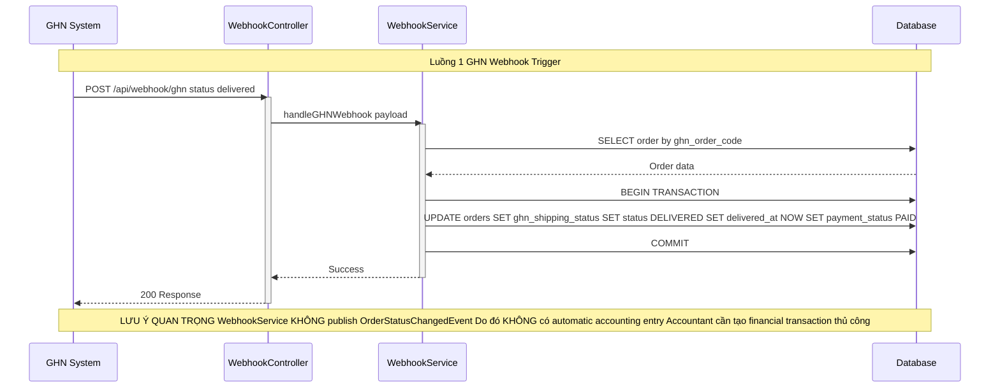
```mermaid
sequenceDiagram
    participant GHN as GHN System
    participant WebhookCtrl as WebhookController
    participant WebhookSvc as WebhookService
    participant DB as Database
    
    Note over GHN,DB: Luồng 1 GHN Webhook Trigger
    
    GHN->>WebhookCtrl: POST /api/webhook/ghn status delivered
    activate WebhookCtrl
    
    WebhookCtrl->>WebhookSvc: handleGHNWebhook payload
    activate WebhookSvc
    
    WebhookSvc->>DB: SELECT order by ghn_order_code
    DB-->>WebhookSvc: Order data
    
    WebhookSvc->>DB: BEGIN TRANSACTION
    
    WebhookSvc->>DB: UPDATE orders SET ghn_shipping_status SET status DELIVERED SET delivered_at NOW SET payment_status PAID
    
    WebhookSvc->>DB: COMMIT
    
    WebhookSvc-->>WebhookCtrl: Success
    deactivate WebhookSvc
    
    WebhookCtrl-->>GHN: 200 Response
    deactivate WebhookCtrl
    
    Note over GHN,DB: LƯU Ý QUAN TRỌNG WebhookService KHÔNG publish OrderStatusChangedEvent Do đó KHÔNG có automatic accounting entry Accountant cần tạo financial transaction thủ công
```

**Lưu ý quan trọng**: 
- WebhookService chỉ cập nhật order status trong database
- **KHÔNG** publish OrderStatusChangedEvent
- **KHÔNG** trigger OrderEventListener
- **KHÔNG** tạo automatic financial transactions
- Accountant cần tạo bút toán thủ công cho đơn hàng COD/delivered


### 1.3. Sơ Đồ Tuần Tự - Ghi Nhận Doanh Thu Khi Thanh Toán Online

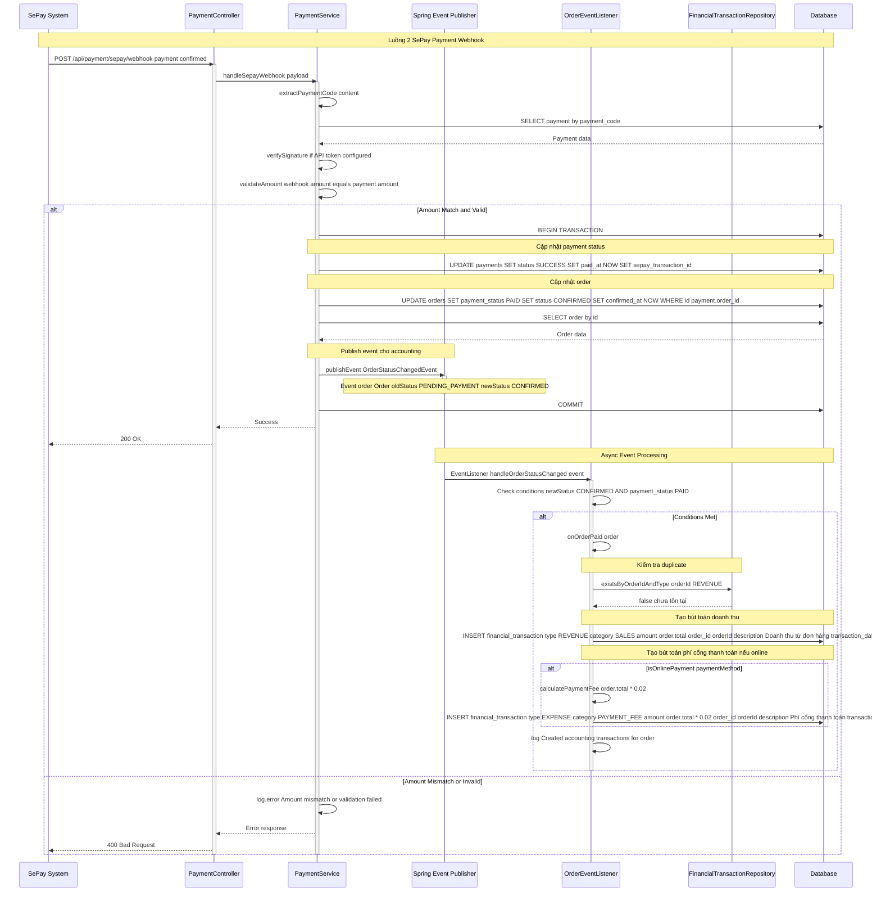
```mermaid
sequenceDiagram
    participant SePay as SePay System
    participant WebhookCtrl as PaymentController
    participant PaymentSvc as PaymentService
    participant EventPublisher as Spring Event Publisher
    participant EventListener as OrderEventListener
    participant FinTxnRepo as FinancialTransactionRepository
    participant DB as Database
    
    Note over SePay,DB: Luồng 2 SePay Payment Webhook
    
    SePay->>WebhookCtrl: POST /api/payment/sepay/webhook payment confirmed
    activate WebhookCtrl
    
    WebhookCtrl->>PaymentSvc: handleSepayWebhook payload
    activate PaymentSvc
    
    PaymentSvc->>PaymentSvc: extractPaymentCode content
    PaymentSvc->>DB: SELECT payment by payment_code
    DB-->>PaymentSvc: Payment data
    
    PaymentSvc->>PaymentSvc: verifySignature if API token configured
    
    PaymentSvc->>PaymentSvc: validateAmount webhook amount equals payment amount
    
    alt Amount Match and Valid
        PaymentSvc->>DB: BEGIN TRANSACTION
        
        Note over PaymentSvc,DB: Cập nhật payment status
        
        PaymentSvc->>DB: UPDATE payments SET status SUCCESS SET paid_at NOW SET sepay_transaction_id
        
        Note over PaymentSvc,DB: Cập nhật order
        
        PaymentSvc->>DB: UPDATE orders SET payment_status PAID SET status CONFIRMED SET confirmed_at NOW WHERE id payment.order_id
        
        PaymentSvc->>DB: SELECT order by id
        DB-->>PaymentSvc: Order data
        
        Note over PaymentSvc,EventPublisher: Publish event cho accounting
        
        PaymentSvc->>EventPublisher: publishEvent OrderStatusChangedEvent
        activate EventPublisher
        Note over EventPublisher: Event order Order oldStatus PENDING_PAYMENT newStatus CONFIRMED
        deactivate EventPublisher
        
        PaymentSvc->>DB: COMMIT
        
        PaymentSvc-->>WebhookCtrl: Success
        WebhookCtrl-->>SePay: 200 OK
        
        Note over EventPublisher,DB: Async Event Processing
        
        EventPublisher->>EventListener: EventListener handleOrderStatusChanged event
        activate EventListener
        
        EventListener->>EventListener: Check conditions newStatus CONFIRMED AND payment_status PAID
        
        alt Conditions Met
            EventListener->>EventListener: onOrderPaid order
            
            Note over EventListener,FinTxnRepo: Kiểm tra duplicate
            
            EventListener->>FinTxnRepo: existsByOrderIdAndType orderId REVENUE
            FinTxnRepo-->>EventListener: false chưa tồn tại
            
            Note over EventListener,DB: Tạo bút toán doanh thu
            
            EventListener->>DB: INSERT financial_transaction type REVENUE category SALES amount order.total order_id orderId description Doanh thu từ đơn hàng transaction_date NOW created_by SYSTEM
            
            Note over EventListener,DB: Tạo bút toán phí cổng thanh toán nếu online
            
            alt isOnlinePayment paymentMethod
                EventListener->>EventListener: calculatePaymentFee order.total * 0.02
                
                EventListener->>DB: INSERT financial_transaction type EXPENSE category PAYMENT_FEE amount order.total * 0.02 order_id orderId description Phí cổng thanh toán transaction_date NOW created_by SYSTEM
            end
            
            EventListener->>EventListener: log Created accounting transactions for order
        end
        
        deactivate EventListener
        
    else Amount Mismatch or Invalid
        PaymentSvc->>PaymentSvc: log.error Amount mismatch or validation failed
        
        PaymentSvc-->>WebhookCtrl: Error response
        WebhookCtrl-->>SePay: 400 Bad Request
    end
    
    deactivate PaymentSvc
    deactivate WebhookCtrl
```


### 1.4. Sơ Đồ Tuần Tự - Xử Lý Hoàn Tiền (Refund)

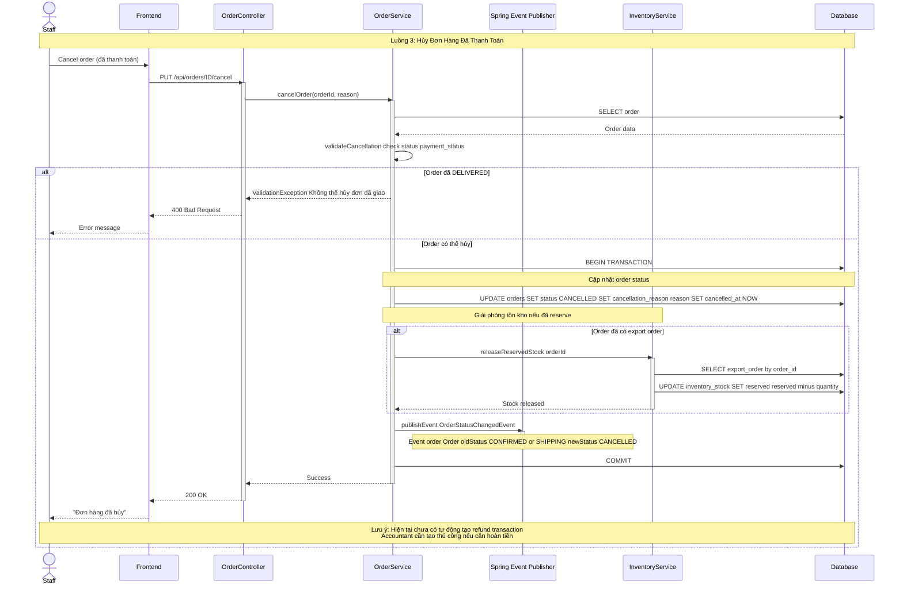
```mermaid
sequenceDiagram
    actor Staff
    participant UI as Frontend
    participant OrderCtrl as OrderController
    participant OrderSvc as OrderService
    participant EventPublisher as Spring Event Publisher
    participant InvSvc as InventoryService
    participant DB as Database
    
    Note over Staff,DB: Luồng 3: Hủy Đơn Hàng Đã Thanh Toán
    
    Staff->>UI: Cancel order (đã thanh toán)
    UI->>OrderCtrl: PUT /api/orders/ID/cancel
    activate OrderCtrl
    
    OrderCtrl->>OrderSvc: cancelOrder(orderId, reason)
    activate OrderSvc
    
    OrderSvc->>DB: SELECT order
    DB-->>OrderSvc: Order data
    
    OrderSvc->>OrderSvc: validateCancellation check status payment_status
    
    alt Order đã DELIVERED
        OrderSvc-->>OrderCtrl: ValidationException Không thể hủy đơn đã giao
        OrderCtrl-->>UI: 400 Bad Request
        UI-->>Staff: Error message
    else Order có thể hủy
        OrderSvc->>DB: BEGIN TRANSACTION
        
        Note over OrderSvc,DB: Cập nhật order status
        
        OrderSvc->>DB: UPDATE orders SET status CANCELLED SET cancellation_reason reason SET cancelled_at NOW
        
        Note over OrderSvc,InvSvc: Giải phóng tồn kho nếu đã reserve
        
        alt Order đã có export order
            OrderSvc->>InvSvc: releaseReservedStock orderId
            activate InvSvc
            
            InvSvc->>DB: SELECT export_order by order_id
            InvSvc->>DB: UPDATE inventory_stock SET reserved reserved minus quantity
            
            InvSvc-->>OrderSvc: Stock released
            deactivate InvSvc
        end
        
        OrderSvc->>EventPublisher: publishEvent OrderStatusChangedEvent
        activate EventPublisher
        Note over EventPublisher: Event order Order oldStatus CONFIRMED or SHIPPING newStatus CANCELLED
        deactivate EventPublisher
        
        OrderSvc->>DB: COMMIT
        
        OrderSvc-->>OrderCtrl: Success
        deactivate OrderSvc
        OrderCtrl-->>UI: 200 OK
        deactivate OrderCtrl
        UI-->>Staff: "Đơn hàng đã hủy"
        
        Note over Staff,DB: Lưu ý: Hiện tại chưa có tự động tạo refund transaction<br/>Accountant cần tạo thủ công nếu cần hoàn tiền
    end
```


## 2. Quản Lý Công Nợ Nhà Cung Cấp (Supplier Payable Management)

### 2.1. Kịch Bản Chuẩn

**Mô tả**: Hệ thống tự động tạo công nợ NCC khi nhập hàng và quản lý thanh toán

**Trigger Events**:
- Purchase Order được tạo với supplier information
- Accountant ghi nhận thanh toán cho NCC

**Các bước xử lý**:
1. Warehouse staff import products via Excel với supplier info
2. Hệ thống tạo Purchase Order
3. Tạo Supplier Payable record
4. Accountant xem danh sách công nợ
5. Accountant ghi nhận thanh toán
6. Cập nhật payable status
7. Tạo financial transaction (EXPENSE)

**Điều kiện tiên quyết**:
- Supplier đã được tạo trong hệ thống
- Purchase Order có total amount > 0
- Payment amount <= remaining amount

**Kết quả mong đợi**:
- Supplier payable được tạo và cập nhật chính xác
- Financial transactions được ghi nhận
- Công nợ được theo dõi đầy đủ

### 2.2. Sơ Đồ Tuần Tự - Tạo Công Nợ NCC Khi Nhập Hàng

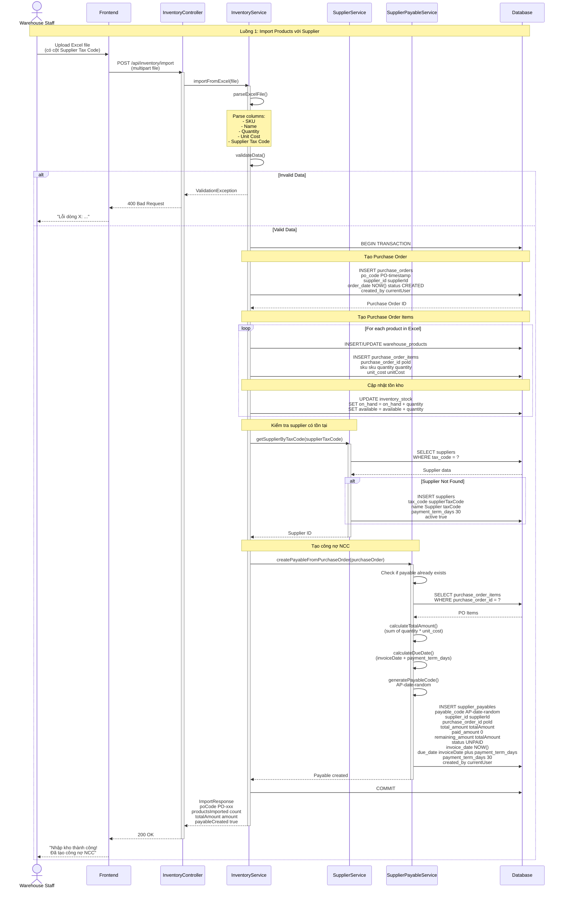
```mermaid
sequenceDiagram
    actor Staff as Warehouse Staff
    participant UI as Frontend
    participant InvCtrl as InventoryController
    participant InvSvc as InventoryService
    participant SupplierSvc as SupplierService
    participant PayableSvc as SupplierPayableService
    participant DB as Database
    
    Note over Staff,DB: Luồng 1: Import Products với Supplier
    
    Staff->>UI: Upload Excel file<br/>(có cột Supplier Tax Code)
    UI->>InvCtrl: POST /api/inventory/import<br/>(multipart file)
    activate InvCtrl
    
    InvCtrl->>InvSvc: importFromExcel(file)
    activate InvSvc
    
    InvSvc->>InvSvc: parseExcelFile()
    Note over InvSvc: Parse columns:<br/>- SKU<br/>- Name<br/>- Quantity<br/>- Unit Cost<br/>- Supplier Tax Code
    
    InvSvc->>InvSvc: validateData()
    
    alt Invalid Data
        InvSvc-->>InvCtrl: ValidationException
        InvCtrl-->>UI: 400 Bad Request
        UI-->>Staff: "Lỗi dòng X: ..."
    else Valid Data
        InvSvc->>DB: BEGIN TRANSACTION
        
        Note over InvSvc,DB: Tạo Purchase Order
        
        InvSvc->>DB: INSERT purchase_orders<br/>po_code PO-timestamp<br/>supplier_id supplierId<br/>order_date NOW() status CREATED<br/>created_by currentUser
        DB-->>InvSvc: Purchase Order ID
        
        Note over InvSvc,DB: Tạo Purchase Order Items
        
        loop For each product in Excel
            InvSvc->>DB: INSERT/UPDATE warehouse_products
            InvSvc->>DB: INSERT purchase_order_items<br/>purchase_order_id poId<br/>sku sku quantity quantity<br/>unit_cost unitCost
            
            Note over InvSvc,DB: Cập nhật tồn kho
            
            InvSvc->>DB: UPDATE inventory_stock<br/>SET on_hand = on_hand + quantity<br/>SET available = available + quantity
        end
        
        Note over InvSvc,SupplierSvc: Kiểm tra supplier có tồn tại
        
        InvSvc->>SupplierSvc: getSupplierByTaxCode(supplierTaxCode)
        activate SupplierSvc
        
        SupplierSvc->>DB: SELECT suppliers<br/>WHERE tax_code = ?
        DB-->>SupplierSvc: Supplier data
        
        alt Supplier Not Found
            SupplierSvc->>DB: INSERT suppliers<br/>tax_code supplierTaxCode<br/>name Supplier taxCode<br/>payment_term_days 30<br/>active true
        end
        
        SupplierSvc-->>InvSvc: Supplier ID
        deactivate SupplierSvc
        
        Note over InvSvc,PayableSvc: Tạo công nợ NCC
        
        InvSvc->>PayableSvc: createPayableFromPurchaseOrder(purchaseOrder)
        activate PayableSvc
        
        PayableSvc->>PayableSvc: Check if payable already exists
        
        PayableSvc->>DB: SELECT purchase_order_items<br/>WHERE purchase_order_id = ?
        DB-->>PayableSvc: PO Items
        
        PayableSvc->>PayableSvc: calculateTotalAmount()<br/>(sum of quantity * unit_cost)
        
        PayableSvc->>PayableSvc: calculateDueDate()<br/>(invoiceDate + payment_term_days)
        
        PayableSvc->>PayableSvc: generatePayableCode()<br/>AP-date-random
        
        PayableSvc->>DB: INSERT supplier_payables<br/>payable_code AP-date-random<br/>supplier_id supplierId<br/>purchase_order_id poId<br/>total_amount totalAmount<br/>paid_amount 0<br/>remaining_amount totalAmount<br/>status UNPAID<br/>invoice_date NOW()<br/>due_date invoiceDate plus payment_term_days<br/>payment_term_days 30<br/>created_by currentUser
        
        PayableSvc-->>InvSvc: Payable created
        deactivate PayableSvc
        
        InvSvc->>DB: COMMIT
        
        InvSvc-->>InvCtrl: ImportResponse<br/>poCode PO-xxx<br/>productsImported count<br/>totalAmount amount<br/>payableCreated true
        deactivate InvSvc
        
        InvCtrl-->>UI: 200 OK
        deactivate InvCtrl
        UI-->>Staff: "Nhập kho thành công!<br/>Đã tạo công nợ NCC"
    end
```


### 2.3. Sơ Đồ Tuần Tự - Thanh Toán Công Nợ NCC

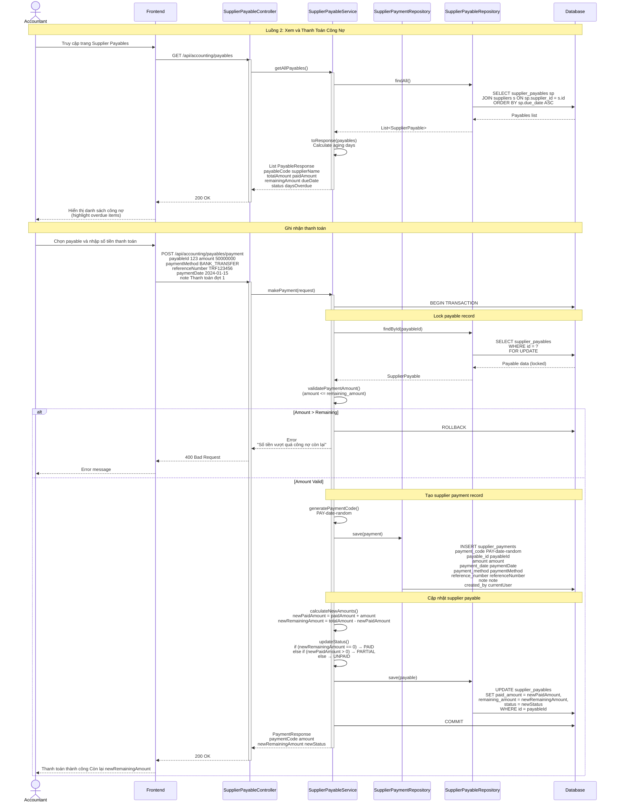
```mermaid
sequenceDiagram
    actor Accountant
    participant UI as Frontend
    participant PayableCtrl as SupplierPayableController
    participant PayableSvc as SupplierPayableService
    participant PaymentRepo as SupplierPaymentRepository
    participant PayableRepo as SupplierPayableRepository
    participant DB as Database
    
    Note over Accountant,DB: Luồng 2: Xem và Thanh Toán Công Nợ
    
    Accountant->>UI: Truy cập trang Supplier Payables
    UI->>PayableCtrl: GET /api/accounting/payables
    activate PayableCtrl
    
    PayableCtrl->>PayableSvc: getAllPayables()
    activate PayableSvc
    
    PayableSvc->>PayableRepo: findAll()
    PayableRepo->>DB: SELECT supplier_payables sp<br/>JOIN suppliers s ON sp.supplier_id = s.id<br/>ORDER BY sp.due_date ASC
    DB-->>PayableRepo: Payables list
    PayableRepo-->>PayableSvc: List<SupplierPayable>
    
    PayableSvc->>PayableSvc: toResponse(payables)<br/>Calculate aging days
    
    PayableSvc-->>PayableCtrl: List PayableResponse<br/>payableCode supplierName<br/>totalAmount paidAmount<br/>remainingAmount dueDate<br/>status daysOverdue
    deactivate PayableSvc
    
    PayableCtrl-->>UI: 200 OK
    deactivate PayableCtrl
    
    UI-->>Accountant: Hiển thị danh sách công nợ<br/>(highlight overdue items)
    
    Note over Accountant,DB: Ghi nhận thanh toán
    
    Accountant->>UI: Chọn payable và nhập số tiền thanh toán
    UI->>PayableCtrl: POST /api/accounting/payables/payment<br/>payableId 123 amount 50000000<br/>paymentMethod BANK_TRANSFER<br/>referenceNumber TRF123456<br/>paymentDate 2024-01-15<br/>note Thanh toán đợt 1
    activate PayableCtrl
    
    PayableCtrl->>PayableSvc: makePayment(request)
    activate PayableSvc
    
    PayableSvc->>DB: BEGIN TRANSACTION
    
    Note over PayableSvc,DB: Lock payable record
    
    PayableSvc->>PayableRepo: findById(payableId)
    PayableRepo->>DB: SELECT supplier_payables<br/>WHERE id = ?<br/>FOR UPDATE
    DB-->>PayableRepo: Payable data (locked)
    PayableRepo-->>PayableSvc: SupplierPayable
    
    PayableSvc->>PayableSvc: validatePaymentAmount()<br/>(amount <= remaining_amount)
    
    alt Amount > Remaining
        PayableSvc->>DB: ROLLBACK
        PayableSvc-->>PayableCtrl: Error<br/>"Số tiền vượt quá công nợ còn lại"
        PayableCtrl-->>UI: 400 Bad Request
        UI-->>Accountant: Error message
    else Amount Valid
        Note over PayableSvc,DB: Tạo supplier payment record
        
        PayableSvc->>PayableSvc: generatePaymentCode()<br/>PAY-date-random
        
        PayableSvc->>PaymentRepo: save(payment)
        PaymentRepo->>DB: INSERT supplier_payments<br/>payment_code PAY-date-random<br/>payable_id payableId<br/>amount amount<br/>payment_date paymentDate<br/>payment_method paymentMethod<br/>reference_number referenceNumber<br/>note note<br/>created_by currentUser
        
        Note over PayableSvc,DB: Cập nhật supplier payable
        
        PayableSvc->>PayableSvc: calculateNewAmounts()<br/>newPaidAmount = paidAmount + amount<br/>newRemainingAmount = totalAmount - newPaidAmount
        
        PayableSvc->>PayableSvc: updateStatus()<br/>if (newRemainingAmount == 0) → PAID<br/>else if (newPaidAmount > 0) → PARTIAL<br/>else → UNPAID
        
        PayableSvc->>PayableRepo: save(payable)
        PayableRepo->>DB: UPDATE supplier_payables<br/>SET paid_amount = newPaidAmount,<br/>    remaining_amount = newRemainingAmount,<br/>    status = newStatus<br/>WHERE id = payableId
        
        PayableSvc->>DB: COMMIT
        
        PayableSvc-->>PayableCtrl: PaymentResponse<br/>paymentCode amount<br/>newRemainingAmount newStatus
        deactivate PayableSvc
        
        PayableCtrl-->>UI: 200 OK
        deactivate PayableCtrl
        
        UI-->>Accountant: Thanh toán thành công Còn lại newRemainingAmount
    end
```


## 3. Event-Driven Accounting Architecture

### 3.1. Tổng Quan Kiến Trúc

Hệ thống kế toán sử dụng kiến trúc event-driven để tự động hóa việc ghi nhận các bút toán:

**Ưu điểm**:
1. **Decoupling**: Business logic (Order, Payment) tách biệt với Accounting logic
2. **Asynchronous**: Không block business transactions nếu accounting fails
3. **Auditable**: Mọi event đều được log và có thể replay
4. **Scalable**: Dễ dàng thêm listeners mới cho các yêu cầu kế toán khác

**Components**:
- **Event Publishers**: OrderService, PaymentService, InventoryService
- **Event Listeners**: OrderEventListener, PaymentEventListener
- **Event Types**: OrderStatusChangedEvent, PaymentCompletedEvent
- **Transaction Services**: FinancialTransactionService, SupplierPayableService

### 3.2. Sơ Đồ Kiến Trúc Event-Driven

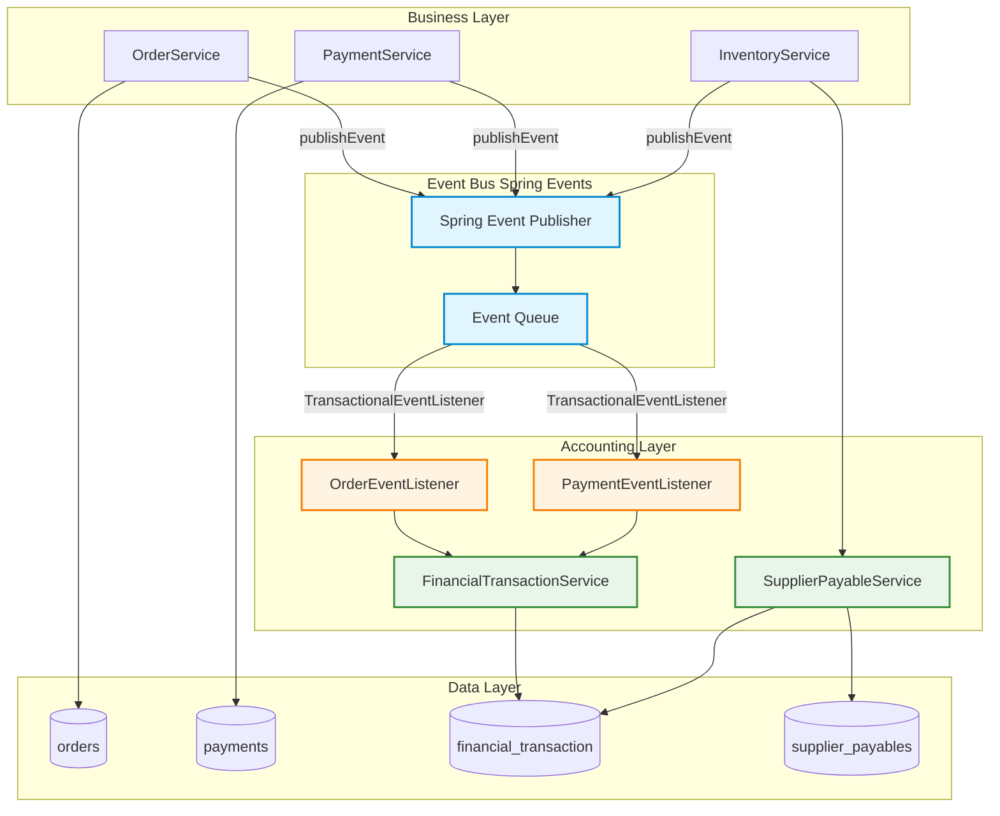
```mermaid
graph TB
    subgraph Business_Layer[Business Layer]
        OrderSvc[OrderService]
        PaymentSvc[PaymentService]
        InvSvc[InventoryService]
    end
    
    subgraph Event_Bus[Event Bus Spring Events]
        EventPublisher[Spring Event Publisher]
        EventQueue[Event Queue]
    end
    
    subgraph Accounting_Layer[Accounting Layer]
        OrderListener[OrderEventListener]
        PaymentListener[PaymentEventListener]
        FinTxnSvc[FinancialTransactionService]
        PayableSvc[SupplierPayableService]
    end
    
    subgraph Data_Layer[Data Layer]
        OrderDB[(orders)]
        PaymentDB[(payments)]
        FinTxnDB[(financial_transaction)]
        PayableDB[(supplier_payables)]
    end
    
    OrderSvc -->|publishEvent| EventPublisher
    PaymentSvc -->|publishEvent| EventPublisher
    InvSvc -->|publishEvent| EventPublisher
    
    EventPublisher --> EventQueue
    
    EventQueue -->|TransactionalEventListener| OrderListener
    EventQueue -->|TransactionalEventListener| PaymentListener
    
    OrderListener --> FinTxnSvc
    PaymentListener --> FinTxnSvc
    InvSvc --> PayableSvc
    
    FinTxnSvc --> FinTxnDB
    PayableSvc --> PayableDB
    PayableSvc --> FinTxnDB
    
    OrderSvc --> OrderDB
    PaymentSvc --> PaymentDB
    
    classDef eventStyle fill:#e1f5ff,stroke:#0288d1,stroke-width:2px
    classDef listenerStyle fill:#fff4e1,stroke:#f57c00,stroke-width:2px
    classDef serviceStyle fill:#e8f5e9,stroke:#388e3c,stroke-width:2px
    
    class EventPublisher,EventQueue eventStyle
    class OrderListener,PaymentListener listenerStyle
    class FinTxnSvc,PayableSvc serviceStyle
```

### 3.3. Sơ Đồ Tuần Tự - Event Flow Chi Tiết

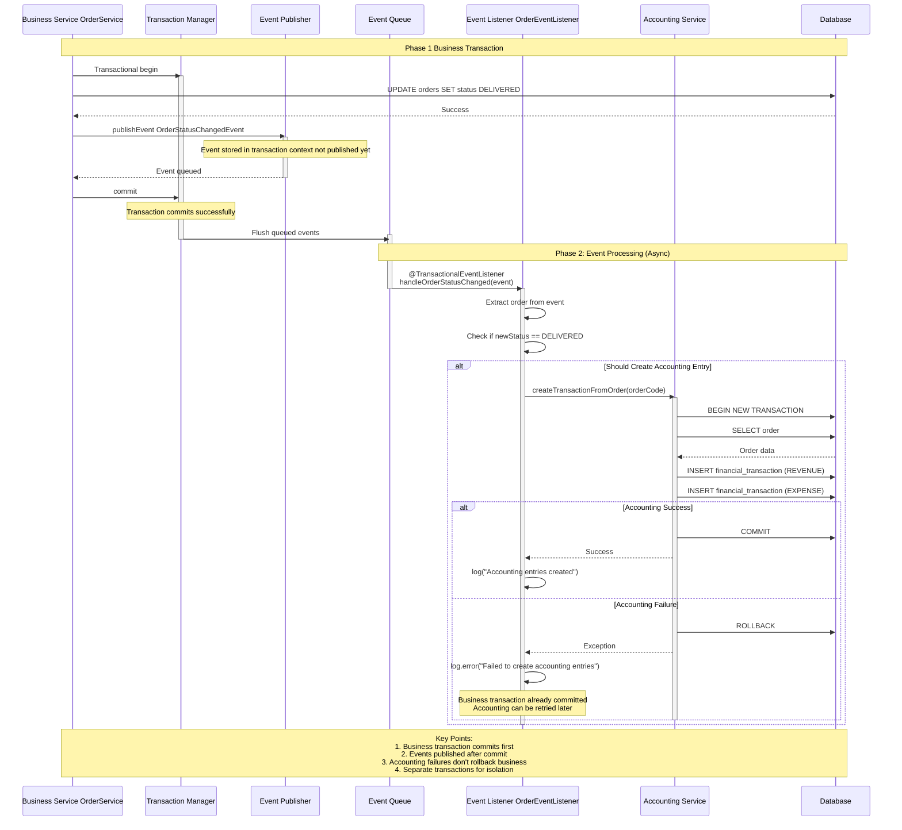
```mermaid
sequenceDiagram
    participant BizSvc as Business Service OrderService
    participant TxnMgr as Transaction Manager
    participant EventPub as Event Publisher
    participant EventQueue as Event Queue
    participant Listener as Event Listener OrderEventListener
    participant AcctSvc as Accounting Service
    participant DB as Database
    
    Note over BizSvc,DB: Phase 1 Business Transaction
    
    BizSvc->>TxnMgr: Transactional begin
    activate TxnMgr
    
    BizSvc->>DB: UPDATE orders SET status DELIVERED
    DB-->>BizSvc: Success
    
    BizSvc->>EventPub: publishEvent OrderStatusChangedEvent
    activate EventPub
    
    Note over EventPub: Event stored in transaction context not published yet
    
    EventPub-->>BizSvc: Event queued
    deactivate EventPub
    
    BizSvc->>TxnMgr: commit
    
    Note over TxnMgr: Transaction commits successfully
    
    TxnMgr->>EventQueue: Flush queued events
    activate EventQueue
    deactivate TxnMgr
    
    Note over EventQueue,DB: Phase 2: Event Processing (Async)
    
    EventQueue->>Listener: @TransactionalEventListener<br/>handleOrderStatusChanged(event)
    deactivate EventQueue
    activate Listener
    
    Listener->>Listener: Extract order from event
    Listener->>Listener: Check if newStatus == DELIVERED
    
    alt Should Create Accounting Entry
        Listener->>AcctSvc: createTransactionFromOrder(orderCode)
        activate AcctSvc
        
        AcctSvc->>DB: BEGIN NEW TRANSACTION
        
        AcctSvc->>DB: SELECT order
        DB-->>AcctSvc: Order data
        
        AcctSvc->>DB: INSERT financial_transaction (REVENUE)
        AcctSvc->>DB: INSERT financial_transaction (EXPENSE)
        
        alt Accounting Success
            AcctSvc->>DB: COMMIT
            AcctSvc-->>Listener: Success
            Listener->>Listener: log("Accounting entries created")
        else Accounting Failure
            AcctSvc->>DB: ROLLBACK
            AcctSvc-->>Listener: Exception
            Listener->>Listener: log.error("Failed to create accounting entries")
            Note over Listener: Business transaction already committed<br/>Accounting can be retried later
        end
        
        deactivate AcctSvc
    end
    
    deactivate Listener
    
    Note over BizSvc,DB: Key Points:<br/>1. Business transaction commits first<br/>2. Events published after commit<br/>3. Accounting failures don't rollback business<br/>4. Separate transactions for isolation
```


### 3.4. Event Types và Handlers

#### OrderStatusChangedEvent

```java
public class OrderStatusChangedEvent {
    private Order order;
    private OrderStatus oldStatus;
    private OrderStatus newStatus;
    private LocalDateTime timestamp;
}
```

**Triggers**:
- Order status changes from any state to another
- Published by OrderService.updateOrderStatus()

**Handlers**:
- OrderEventListener.handleOrderStatusChanged()
  - If newStatus == CONFIRMED && paymentStatus == PAID → Create revenue transaction + payment fee (if online)
  - If newStatus == DELIVERED or COMPLETED → Create shipping expense transaction
  - Idempotent: Check existsByOrderIdAndType/Category before creating

#### PaymentCompletedEvent

**Lưu ý**: Hiện tại hệ thống chưa có PaymentCompletedEvent riêng biệt. 

**Luồng xử lý thực tế**:
1. PaymentService nhận webhook từ SePay
2. Cập nhật payment status = SUCCESS
3. Cập nhật order payment_status = PAID
4. **Cập nhật order status = CONFIRMED trực tiếp** (không gọi OrderService)
5. PaymentService tự publish OrderStatusChangedEvent
6. OrderEventListener xử lý và tạo accounting transactions

**Điểm quan trọng**: PaymentService không gọi OrderService.updateOrderStatus(), mà tự cập nhật order và publish event trực tiếp. Điều này đảm bảo toàn bộ luồng thanh toán nằm trong một transaction duy nhất.

### 3.5. Error Handling Strategy

#### Scenario 1: Accounting Service Failure

**Problem**: Financial transaction creation fails due to database error

**Handling**:
```java
@EventListener
@Transactional
public void handleOrderStatusChanged(OrderStatusChangedEvent event) {
    try {
        // Create financial transactions
        createRevenueTransaction(order);
        createShippingExpenseTransaction(order);
        log.info("Created financial transactions for order: {}", orderCode);
    } catch (Exception e) {
        log.error("Failed to create financial transactions for order: {}", orderCode, e);
        // Business transaction already committed
        // Error is logged for investigation
        // Accountant can create entry manually if needed
    }
}
```

**Result**:
- Business transaction (order status update) is NOT rolled back
- Error is logged for investigation
- Accountant can create entry manually
- System remains consistent

#### Scenario 2: Duplicate Event Processing

**Problem**: Event listener is triggered multiple times for same event

**Handling**:
```java
private void onOrderPaid(Order order) {
    // Check if transaction already exists
    boolean exists = transactionRepository.existsByOrderIdAndType(
        order.getId(), 
        TransactionType.REVENUE
    );
    
    if (exists) {
        log.info("Transaction already exists for order {}", order.getId());
        return; // Idempotent - skip duplicate
    }
    
    // Create new transaction
    createRevenueTransaction(order);
}
```

**Result**:
- Idempotent operation prevents duplicates
- Only one financial transaction per order
- Safe to retry

#### Scenario 3: Event Processing Timeout

**Lưu ý**: Hiện tại OrderEventListener không sử dụng @Async và không có timeout configuration. Event processing là synchronous trong cùng transaction context.

**Handling hiện tại**:
```java
@EventListener
@Transactional
public void handleOrderStatusChanged(OrderStatusChangedEvent event) {
    // Synchronous processing
    // If takes too long, will block but won't timeout
    // Transaction timeout is controlled by Spring's default settings
}
```

**Khuyến nghị cải tiến** (nếu cần):
```java
@EventListener
@Async
@Transactional(timeout = 30)
public void handleOrderStatusChanged(OrderStatusChangedEvent event) {
    // Async processing with timeout
    // Won't block business flow
}
```ailed events can be retried via scheduled job

### 3.6. Monitoring và Auditing

#### Accounting Event Log

**Lưu ý**: Hiện tại hệ thống chưa có bảng accounting_event_log để tracking events.

**Khuyến nghị cải tiến**:
```sql
CREATE TABLE accounting_event_log (
    id BIGINT PRIMARY KEY AUTO_INCREMENT,
    event_type VARCHAR(50) NOT NULL,
    order_id VARCHAR(50),
    event_data JSON,
    processing_status ENUM('PENDING', 'PROCESSED', 'FAILED'),
    error_message TEXT,
    created_at TIMESTAMP DEFAULT CURRENT_TIMESTAMP,
    processed_at TIMESTAMP,
    retry_count INT DEFAULT 0
);
```

**Usage**:
- Log all accounting events before processing
- Track processing status
- Enable retry for failed events
- Audit trail for compliance

#### Retry Mechanism

**Lưu ý**: Hiện tại hệ thống chưa có scheduled job để retry failed events.

**Khuyến nghị cải tiến**:
```java
@Scheduled(fixedDelay = 300000) // Every 5 minutes
public void retryFailedAccountingEvents() {
    List<AccountingEventLog> failedEvents = eventLogRepository
        .findByProcessingStatusAndRetryCountLessThan(
            ProcessingStatus.FAILED, 
            MAX_RETRY_COUNT
        );
    
    for (AccountingEventLog eventLog : failedEvents) {
        try {
            reprocessEvent(eventLog);
            eventLog.setProcessingStatus(ProcessingStatus.PROCESSED);
            eventLog.setProcessedAt(LocalDateTime.now());
        } catch (Exception e) {
            eventLog.setRetryCount(eventLog.getRetryCount() + 1);
            eventLog.setErrorMessage(e.getMessage());
        }
        eventLogRepository.save(eventLog);
    }
}
```


## 4. Kịch Bản Ngoại Lệ (Exception Scenarios)

### 4.1. Exception: Ghi Nhận Bút Toán Thất Bại

**Trigger**: Database error khi tạo financial_transaction

**Xử lý**:
1. Catch exception trong OrderEventListener
2. Log error với đầy đủ context (orderId, amount, stacktrace)
3. Không rollback business transaction (order vẫn DELIVERED/CONFIRMED)
4. Error được log để investigation
5. Accountant có thể tạo thủ công nếu cần

**Kết quả**: 
- Business flow tiếp tục
- Bút toán có thể được tạo thủ công sau
- System remains consistent

### 4.2. Exception: Duplicate Accounting Entry

**Trigger**: Event được trigger nhiều lần (retry, bug)

**Xử lý**:
1. Check xem đã có transaction với orderId và type/category chưa
2. Nếu có: Skip và return (idempotent)
3. Log warning để investigate
4. Không tạo duplicate entry

**Kết quả**: Chỉ có 1 bút toán duy nhất cho mỗi order + type/category

### 4.3. Exception: Số Liệu Không Khớp

**Trigger**: Order total != sum(order_items.subtotal)

**Xử lý hiện tại**:
- Không có validation
- Financial transaction dựa trên order.total
- Không kiểm tra consistency với order items

**Khuyến nghị**: Thêm validation trước khi tạo transaction

### 4.3. Exception: Số Liệu Không Khớp

**Trigger**: Order total != sum(order_items.subtotal)

**Xử lý**:
1. Validate trước khi ghi nhận
2. Nếu không khớp: Log error với chi tiết
3. Tạo financial_transaction với note "Cần kiểm tra"
4. Set flag needs_review = true
5. Alert accountant
6. Accountant điều chỉnh thủ công

**Kết quả**: Bút toán được tạo nhưng có flag cần review

#### Scenario 4: Thanh Toán NCC Vượt Quá Công Nợ

**Problem**: Payment amount > remaining_amount

**Handling**:
```java
public ApiResponse makePayment(CreatePaymentRequest request) {
    SupplierPayable payable = payableRepository.findById(request.getPayableId())
        .orElseThrow(() -> new RuntimeException("Không tìm thấy công nợ"));

    // Validate payment amount
    if (request.getAmount().compareTo(payable.getRemainingAmount()) > 0) {
        return ApiResponse.error("Số tiền thanh toán vượt quá số tiền còn nợ");
    }
    
    // Process payment...
}
```

**Result**:
- Payment không được tạo
- Return 400 Bad Request với message rõ ràng
- Frontend hiển thị remaining amount
- User sửa lại số tiền

#### Scenario 5: Concurrent Payment Processing

**Problem**: Hai accountants thanh toán cùng lúc cho cùng payable

**Handling**:
```java
@Transactional
public ApiResponse makePayment(CreatePaymentRequest request) {
    // Database transaction with default isolation level
    // JPA will handle concurrent access
    
    SupplierPayable payable = payableRepository.findById(request.getPayableId())
        .orElseThrow(() -> new RuntimeException("Không tìm thấy công nợ"));
    
    // Validate amount (with latest data from DB)
    if (request.getAmount().compareTo(payable.getRemainingAmount()) > 0) {
        return ApiResponse.error("Số tiền thanh toán vượt quá số tiền còn nợ");
    }
    
    // Update payable
    payable.setPaidAmount(payable.getPaidAmount().add(request.getAmount()));
    payable.setRemainingAmount(payable.getRemainingAmount().subtract(request.getAmount()));
    payable.updateStatus();
    
    payableRepository.save(payable);
    // Transaction commits
}
```

**Lưu ý**: 
- Hiện tại không sử dụng SELECT FOR UPDATE
- Dựa vào transaction isolation level mặc định của database
- Có thể xảy ra race condition trong trường hợp concurrent access

**Khuyến nghị cải tiến**:
```java
// Thêm @Lock annotation
@Lock(LockModeType.PESSIMISTIC_WRITE)
Optional<SupplierPayable> findById(Long id);
```

**Result**:
- Với cải tiến: Tránh overpayment, data consistency được đảm bảo
- Hiện tại: Có thể xảy ra race condition nếu 2 payments cùng lúc

## 5. Tạo Bút Toán Thủ Công (Manual Transaction Creation)

### 5.1. Sơ Đồ Tuần Tự - Tạo Bút Toán Thủ Công

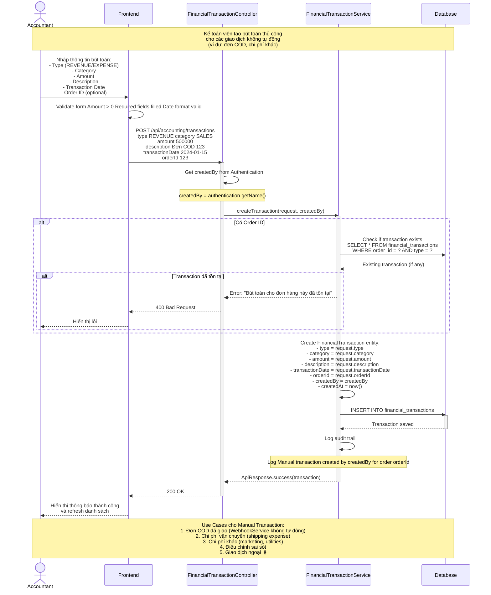
```mermaid
sequenceDiagram
    actor Accountant
    participant UI as Frontend
    participant TxnCtrl as FinancialTransactionController
    participant TxnSvc as FinancialTransactionService
    participant DB as Database
    
    Note over Accountant,DB: Kế toán viên tạo bút toán thủ công<br/>cho các giao dịch không tự động<br/>(ví dụ: đơn COD, chi phí khác)
    
    Accountant->>UI: Nhập thông tin bút toán:<br/>- Type (REVENUE/EXPENSE)<br/>- Category<br/>- Amount<br/>- Description<br/>- Transaction Date<br/>- Order ID (optional)
    
    UI->>UI: Validate form Amount > 0 Required fields filled Date format valid
    
    UI->>TxnCtrl: POST /api/accounting/transactions<br/>type REVENUE category SALES<br/>amount 500000<br/>description Đơn COD 123<br/>transactionDate 2024-01-15<br/>orderId 123
    activate TxnCtrl
    
    TxnCtrl->>TxnCtrl: Get createdBy from Authentication
    Note over TxnCtrl: createdBy = authentication.getName()
    
    TxnCtrl->>TxnSvc: createTransaction(request, createdBy)
    activate TxnSvc
    
    alt Có Order ID
        TxnSvc->>DB: Check if transaction exists<br/>SELECT * FROM financial_transactions<br/>WHERE order_id = ? AND type = ?
        DB-->>TxnSvc: Existing transaction (if any)
        
        alt Transaction đã tồn tại
            TxnSvc-->>TxnCtrl: Error: "Bút toán cho đơn hàng này đã tồn tại"
            TxnCtrl-->>UI: 400 Bad Request
            UI-->>Accountant: Hiển thị lỗi
        end
    end
    
    TxnSvc->>TxnSvc: Create FinancialTransaction entity:<br/>- type = request.type<br/>- category = request.category<br/>- amount = request.amount<br/>- description = request.description<br/>- transactionDate = request.transactionDate<br/>- orderId = request.orderId<br/>- createdBy = createdBy<br/>- createdAt = now()
    
    TxnSvc->>DB: INSERT INTO financial_transactions
    activate DB
    DB-->>TxnSvc: Transaction saved
    deactivate DB
    
    TxnSvc->>TxnSvc: Log audit trail
    Note over TxnSvc: Log Manual transaction created by createdBy for order orderId
    
    TxnSvc-->>TxnCtrl: ApiResponse.success(transaction)
    deactivate TxnSvc
    
    TxnCtrl-->>UI: 200 OK
    deactivate TxnCtrl
    
    UI-->>Accountant: Hiển thị thông báo thành công<br/>và refresh danh sách
    
    Note over Accountant,DB: Use Cases cho Manual Transaction:<br/>1. Đơn COD đã giao (WebhookService không tự động)<br/>2. Chi phí vận chuyển (shipping expense)<br/>3. Chi phí khác (marketing, utilities)<br/>4. Điều chỉnh sai sót<br/>5. Giao dịch ngoại lệ
```

### 5.2. Validation Rules

**Frontend Validation**:
- Amount phải > 0
- Type phải là REVENUE hoặc EXPENSE
- Category phải hợp lệ (SALES, SHIPPING, PAYMENT_FEE, OTHER)
- Description không được để trống
- Transaction Date không được trong tương lai
- Nếu có Order ID, phải là số nguyên dương

**Backend Validation**:
- Check duplicate: Nếu có orderId, kiểm tra đã có transaction với orderId + type chưa
- Validate enum values (Type, Category)
- Validate amount > 0
- Validate date format

**Business Rules**:
- Chỉ ADMIN và ACCOUNTANT mới có quyền tạo manual transaction
- Mỗi order chỉ có 1 transaction cho mỗi type (REVENUE/EXPENSE)
- Transaction date có thể là quá khứ (để điều chỉnh)
- Created_by được lấy từ authentication (audit trail)

### 5.3. Common Use Cases

#### 5.3.1. Tạo Revenue cho Đơn COD
```
Type: REVENUE
Category: SALES
Amount: Order total
Description: "Doanh thu đơn COD #[orderId] - [customerName]"
Order ID: [orderId]
Transaction Date: Delivery date
```

#### 5.3.2. Tạo Shipping Expense
```
Type: EXPENSE
Category: SHIPPING
Amount: Shipping fee
Description: "Chi phí vận chuyển đơn #[orderId]"
Order ID: [orderId]
Transaction Date: Delivery date
```

#### 5.3.3. Tạo Chi Phí Khác
```
Type: EXPENSE
Category: OTHER
Amount: Expense amount
Description: "Chi phí [mô tả cụ thể]"
Order ID: null
Transaction Date: Expense date
```

## 6. Quản Lý Kỳ Kế Toán (Accounting Period Management)

### 6.1. Sơ Đồ Tuần Tự - Đóng Kỳ Kế Toán

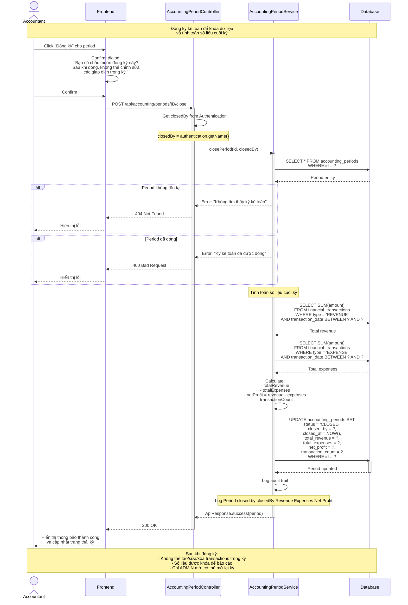
```mermaid
sequenceDiagram
    actor Accountant
    participant UI as Frontend
    participant PeriodCtrl as AccountingPeriodController
    participant PeriodSvc as AccountingPeriodService
    participant DB as Database
    
    Note over Accountant,DB: Đóng kỳ kế toán để khóa dữ liệu<br/>và tính toán số liệu cuối kỳ
    
    Accountant->>UI: Click "Đóng kỳ" cho period
    
    UI->>UI: Confirm dialog:<br/>"Bạn có chắc muốn đóng kỳ này?<br/>Sau khi đóng, không thể chỉnh sửa<br/>các giao dịch trong kỳ."
    
    Accountant->>UI: Confirm
    
    UI->>PeriodCtrl: POST /api/accounting/periods/ID/close
    activate PeriodCtrl
    
    PeriodCtrl->>PeriodCtrl: Get closedBy from Authentication
    Note over PeriodCtrl: closedBy = authentication.getName()
    
    PeriodCtrl->>PeriodSvc: closePeriod(id, closedBy)
    activate PeriodSvc
    
    PeriodSvc->>DB: SELECT * FROM accounting_periods<br/>WHERE id = ?
    DB-->>PeriodSvc: Period entity
    
    alt Period không tồn tại
        PeriodSvc-->>PeriodCtrl: Error: "Không tìm thấy kỳ kế toán"
        PeriodCtrl-->>UI: 404 Not Found
        UI-->>Accountant: Hiển thị lỗi
    end
    
    alt Period đã đóng
        PeriodSvc-->>PeriodCtrl: Error: "Kỳ kế toán đã được đóng"
        PeriodCtrl-->>UI: 400 Bad Request
        UI-->>Accountant: Hiển thị lỗi
    end
    
    Note over PeriodSvc: Tính toán số liệu cuối kỳ
    
    PeriodSvc->>DB: SELECT SUM(amount)<br/>FROM financial_transactions<br/>WHERE type = 'REVENUE'<br/>AND transaction_date BETWEEN ? AND ?
    DB-->>PeriodSvc: Total revenue
    
    PeriodSvc->>DB: SELECT SUM(amount)<br/>FROM financial_transactions<br/>WHERE type = 'EXPENSE'<br/>AND transaction_date BETWEEN ? AND ?
    DB-->>PeriodSvc: Total expenses
    
    PeriodSvc->>PeriodSvc: Calculate:<br/>- totalRevenue<br/>- totalExpenses<br/>- netProfit = revenue - expenses<br/>- transactionCount
    
    PeriodSvc->>DB: UPDATE accounting_periods SET<br/>status = 'CLOSED',<br/>closed_by = ?,<br/>closed_at = NOW(),<br/>total_revenue = ?,<br/>total_expenses = ?,<br/>net_profit = ?,<br/>transaction_count = ?<br/>WHERE id = ?
    activate DB
    DB-->>PeriodSvc: Period updated
    deactivate DB
    
    PeriodSvc->>PeriodSvc: Log audit trail
    Note over PeriodSvc: Log Period closed by closedBy Revenue Expenses Net Profit
    
    PeriodSvc-->>PeriodCtrl: ApiResponse.success(period)
    deactivate PeriodSvc
    
    PeriodCtrl-->>UI: 200 OK
    deactivate PeriodCtrl
    
    UI-->>Accountant: Hiển thị thông báo thành công<br/>và cập nhật trạng thái kỳ
    
    Note over Accountant,DB: Sau khi đóng kỳ:<br/>- Không thể tạo/sửa/xóa transactions trong kỳ<br/>- Số liệu được khóa để báo cáo<br/>- Chỉ ADMIN mới có thể mở lại kỳ
```

### 6.2. Sơ Đồ Tuần Tự - Mở Lại Kỳ Kế Toán

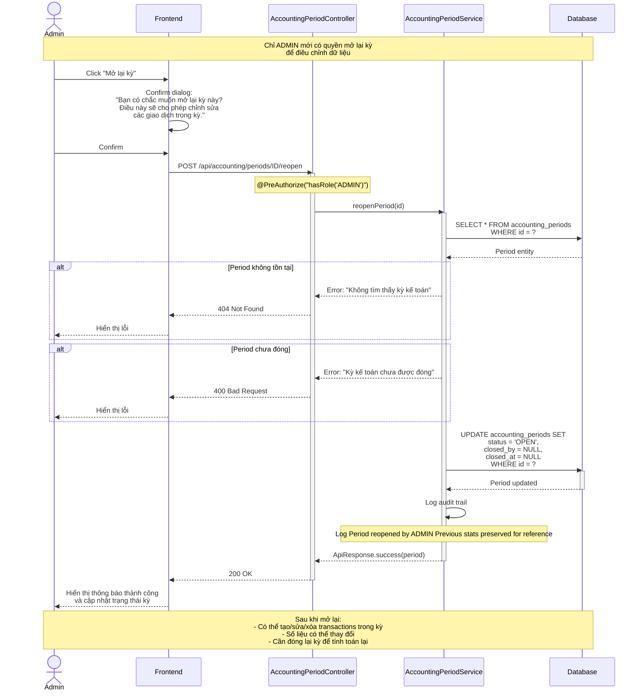
```mermaid
sequenceDiagram
    actor Admin
    participant UI as Frontend
    participant PeriodCtrl as AccountingPeriodController
    participant PeriodSvc as AccountingPeriodService
    participant DB as Database
    
    Note over Admin,DB: Chỉ ADMIN mới có quyền mở lại kỳ<br/>để điều chỉnh dữ liệu
    
    Admin->>UI: Click "Mở lại kỳ"
    
    UI->>UI: Confirm dialog:<br/>"Bạn có chắc muốn mở lại kỳ này?<br/>Điều này sẽ cho phép chỉnh sửa<br/>các giao dịch trong kỳ."
    
    Admin->>UI: Confirm
    
    UI->>PeriodCtrl: POST /api/accounting/periods/ID/reopen
    activate PeriodCtrl
    
    Note over PeriodCtrl: @PreAuthorize("hasRole('ADMIN')")
    
    PeriodCtrl->>PeriodSvc: reopenPeriod(id)
    activate PeriodSvc
    
    PeriodSvc->>DB: SELECT * FROM accounting_periods<br/>WHERE id = ?
    DB-->>PeriodSvc: Period entity
    
    alt Period không tồn tại
        PeriodSvc-->>PeriodCtrl: Error: "Không tìm thấy kỳ kế toán"
        PeriodCtrl-->>UI: 404 Not Found
        UI-->>Admin: Hiển thị lỗi
    end
    
    alt Period chưa đóng
        PeriodSvc-->>PeriodCtrl: Error: "Kỳ kế toán chưa được đóng"
        PeriodCtrl-->>UI: 400 Bad Request
        UI-->>Admin: Hiển thị lỗi
    end
    
    PeriodSvc->>DB: UPDATE accounting_periods SET<br/>status = 'OPEN',<br/>closed_by = NULL,<br/>closed_at = NULL<br/>WHERE id = ?
    activate DB
    DB-->>PeriodSvc: Period updated
    deactivate DB
    
    PeriodSvc->>PeriodSvc: Log audit trail
    Note over PeriodSvc: Log Period reopened by ADMIN Previous stats preserved for reference
    
    PeriodSvc-->>PeriodCtrl: ApiResponse.success(period)
    deactivate PeriodSvc
    
    PeriodCtrl-->>UI: 200 OK
    deactivate PeriodCtrl
    
    UI-->>Admin: Hiển thị thông báo thành công<br/>và cập nhật trạng thái kỳ
    
    Note over Admin,DB: Sau khi mở lại:<br/>- Có thể tạo/sửa/xóa transactions trong kỳ<br/>- Số liệu có thể thay đổi<br/>- Cần đóng lại kỳ để tính toán lại
```

### 6.3. Business Rules

**Đóng Kỳ (Close Period)**:
- Chỉ ADMIN và ACCOUNTANT có quyền đóng kỳ
- Kỳ phải ở trạng thái OPEN
- Tự động tính toán: total_revenue, total_expenses, net_profit, transaction_count
- Lưu thông tin người đóng (closed_by) và thời gian (closed_at)
- Sau khi đóng, không thể tạo/sửa/xóa transactions trong kỳ

**Mở Lại Kỳ (Reopen Period)**:
- Chỉ ADMIN có quyền mở lại kỳ (security measure)
- Kỳ phải ở trạng thái CLOSED
- Clear closed_by và closed_at
- Giữ nguyên số liệu đã tính (để tham khảo)
- Sau khi mở lại, có thể chỉnh sửa transactions
- Cần đóng lại để tính toán lại số liệu

**Tính Toán Kỳ (Calculate Period Stats)**:
- Có thể tính toán bất kỳ lúc nào (không cần đóng kỳ)
- Dùng để xem preview số liệu trước khi đóng kỳ
- Không lưu vào database, chỉ return response

## 7. Báo Cáo Kế Toán (Accounting Reports)

### 7.1. Sơ Đồ Tuần Tự - Tạo Báo Cáo Tài Chính


```mermaid
sequenceDiagram
    actor Accountant
    participant UI as Frontend
    participant FSCtrl as FinancialStatementController
    participant FSSvc as FinancialStatementService
    participant DB as Database
    
    Note over Accountant,DB: Tạo báo cáo tài chính tổng hợp<br/>từ financial_transactions
    
    Accountant->>UI: Chọn date range:<br/>- Start Date: 2024-01-01<br/>- End Date: 2024-01-31
    
    UI->>UI: Validate:<br/>- startDate < endDate<br/>- Range <= 1 year
    
    UI->>FSCtrl: GET /api/accounting/financial-statement<br/>?startDate=2024-01-01<br/>&endDate=2024-01-31
    activate FSCtrl
    
    FSCtrl->>FSCtrl: Validate date range
    
    alt Invalid date range
        FSCtrl-->>UI: 400 Bad Request<br/>"Ngày bắt đầu phải trước ngày kết thúc"
        UI-->>Accountant: Hiển thị lỗi
    end
    
    alt Range > 1 year
        FSCtrl-->>UI: 400 Bad Request<br/>"Khoảng thời gian không được vượt quá 1 năm"
        UI-->>Accountant: Hiển thị lỗi
    end
    
    FSCtrl->>FSSvc: getFinancialStatement(startDate, endDate)
    activate FSSvc
    
    Note over FSSvc: Query Revenue Transactions
    
    FSSvc->>DB: SELECT *<br/>FROM financial_transactions<br/>WHERE type = 'REVENUE'<br/>AND transaction_date BETWEEN ? AND ?<br/>ORDER BY transaction_date
    DB-->>FSSvc: Revenue transactions
    
    FSSvc->>FSSvc: Calculate revenue by category:<br/>- SALES: Sum of sales revenue<br/>- OTHER: Sum of other revenue
    
    Note over FSSvc: Query Expense Transactions
    
    FSSvc->>DB: SELECT *<br/>FROM financial_transactions<br/>WHERE type = 'EXPENSE'<br/>AND transaction_date BETWEEN ? AND ?<br/>ORDER BY transaction_date
    DB-->>FSSvc: Expense transactions
    
    FSSvc->>FSSvc: Calculate expenses by category:<br/>- SHIPPING: Sum of shipping costs<br/>- PAYMENT_FEE: Sum of payment fees<br/>- OTHER: Sum of other expenses
    
    Note over FSSvc: Calculate Summary
    
    FSSvc->>FSSvc: Calculate:<br/>- totalRevenue = sum(revenue)<br/>- totalExpenses = sum(expenses)<br/>- grossProfit = revenue - expenses<br/>- profitMargin = (profit / revenue) * 100
    
    FSSvc->>FSSvc: Build FinancialStatementResponse:<br/>- summary (totals)<br/>- revenueByCategory<br/>- expensesByCategory<br/>- transactions (detail list)<br/>- period (startDate, endDate)
    
    FSSvc-->>FSCtrl: ApiResponse.success(statement)
    deactivate FSSvc
    
    FSCtrl-->>UI: 200 OK
    deactivate FSCtrl
    
    UI->>UI: Render report:<br/>- Summary cards<br/>- Revenue chart<br/>- Expense chart<br/>- Transaction table
    
    UI-->>Accountant: Hiển thị báo cáo tài chính
    
    Note over Accountant,DB: Các báo cáo khác
    
    alt Báo Cáo Doanh Thu
        Accountant->>UI: Click "Báo cáo doanh thu"
        UI->>FSCtrl: GET /api/accounting/financial-statement/revenue
        FSCtrl->>FSSvc: getRevenueReport(startDate, endDate)
        Note over FSSvc: Chỉ query REVENUE transactions<br/>Group by category và date
        FSSvc-->>FSCtrl: Revenue report
        FSCtrl-->>UI: 200 OK
        UI-->>Accountant: Hiển thị báo cáo doanh thu
    end
    
    alt Báo Cáo Chi Phí
        Accountant->>UI: Click "Báo cáo chi phí"
        UI->>FSCtrl: GET /api/accounting/financial-statement/expenses
        FSCtrl->>FSSvc: getExpenseReport(startDate, endDate)
        Note over FSSvc: Chỉ query EXPENSE transactions<br/>Group by category và date
        FSSvc-->>FSCtrl: Expense report
        FSCtrl-->>UI: 200 OK
        UI-->>Accountant: Hiển thị báo cáo chi phí
    end
    
    alt Báo Cáo Lợi Nhuận
        Accountant->>UI: Click "Báo cáo lợi nhuận"
        UI->>FSCtrl: GET /api/accounting/financial-statement/profit
        FSCtrl->>FSSvc: getProfitReport(startDate, endDate)
        Note over FSSvc: Calculate profit by period:<br/>- Daily profit<br/>- Cumulative profit<br/>- Profit trend
        FSSvc-->>FSCtrl: Profit report
        FSCtrl-->>UI: 200 OK
        UI-->>Accountant: Hiển thị báo cáo lợi nhuận
    end
    
    alt Báo Cáo Dòng Tiền
        Accountant->>UI: Click "Báo cáo dòng tiền"
        UI->>FSCtrl: GET /api/accounting/financial-statement/cash-flow
        FSCtrl->>FSSvc: getCashFlowReport(startDate, endDate)
        Note over FSSvc: Calculate cash flow:<br/>- Cash in (revenue)<br/>- Cash out (expenses)<br/>- Net cash flow<br/>- Running balance
        FSSvc-->>FSCtrl: Cash flow report
        FSCtrl-->>UI: 200 OK
        UI-->>Accountant: Hiển thị báo cáo dòng tiền
    end
```

### 7.2. Các Loại Báo Cáo

#### 7.2.1. Báo Cáo Tổng Hợp (Financial Statement)
**Endpoint**: `GET /api/accounting/financial-statement`

**Nội dung**:
- Tổng doanh thu (total revenue)
- Tổng chi phí (total expenses)
- Lợi nhuận gộp (gross profit)
- Tỷ suất lợi nhuận (profit margin)
- Phân tích theo category
- Danh sách transactions chi tiết

**Use Case**: Xem tổng quan tài chính trong một khoảng thời gian

#### 7.2.2. Báo Cáo Doanh Thu (Revenue Report)
**Endpoint**: `GET /api/accounting/financial-statement/revenue`

**Nội dung**:
- Doanh thu theo category (SALES, OTHER)
- Doanh thu theo ngày/tuần/tháng
- Trend analysis
- Top revenue sources

**Use Case**: Phân tích nguồn doanh thu và xu hướng

#### 7.2.3. Báo Cáo Chi Phí (Expense Report)
**Endpoint**: `GET /api/accounting/financial-statement/expenses`

**Nội dung**:
- Chi phí theo category (SHIPPING, PAYMENT_FEE, OTHER)
- Chi phí theo ngày/tuần/tháng
- Cost breakdown
- Expense trend

**Use Case**: Kiểm soát chi phí và tối ưu hóa

#### 7.2.4. Báo Cáo Lợi Nhuận (Profit Report)
**Endpoint**: `GET /api/accounting/financial-statement/profit`

**Nội dung**:
- Lợi nhuận theo ngày
- Lợi nhuận tích lũy
- Profit margin trend
- Comparison với kỳ trước

**Use Case**: Đánh giá hiệu quả kinh doanh

#### 7.2.5. Báo Cáo Dòng Tiền (Cash Flow Report)
**Endpoint**: `GET /api/accounting/financial-statement/cash-flow`

**Nội dung**:
- Cash in (doanh thu)
- Cash out (chi phí)
- Net cash flow
- Running balance
- Cash flow forecast

**Use Case**: Quản lý dòng tiền và thanh khoản

#### 7.2.6. Dashboard Tổng Quan
**Endpoint**: `GET /api/accounting/financial-statement/dashboard`

**Nội dung**:
- Số liệu tháng hiện tại
- So sánh với tháng trước
- Key metrics (revenue, expenses, profit)
- Quick stats

**Use Case**: Xem nhanh tình hình tài chính hiện tại

#### 7.2.7. Báo Cáo Theo Kỳ
**Endpoints**:
- Monthly: `GET /api/accounting/financial-statement/monthly/{year}/{month}`
- Quarterly: `GET /api/accounting/financial-statement/quarterly/{year}/{quarter}`
- Yearly: `GET /api/accounting/financial-statement/yearly/{year}`

**Use Case**: Báo cáo định kỳ theo tháng/quý/năm

### 7.3. Validation và Business Rules

**Date Range Validation**:
- startDate phải trước endDate
- Range không được vượt quá 1 năm
- Date format: ISO 8601 (YYYY-MM-DD)

**Authorization**:
- Chỉ ADMIN và ACCOUNTANT có quyền xem báo cáo
- `@PreAuthorize("hasAnyAuthority('ADMIN', 'ACCOUNTANT')")`

**Data Source**:
- Tất cả báo cáo đều query từ `financial_transactions` table
- Real-time data (không cache)
- Filtered by transaction_date

**Performance**:
- Index trên transaction_date và type
- Limit range để tránh query quá lớn
- Có thể thêm pagination cho transaction list

## 7A. Báo Cáo Nâng Cao (Advanced Reports)

### 7A.1. Tổng Quan

AdvancedReportService cung cấp các báo cáo phân tích chuyên sâu hơn so với FinancialStatementService:

**Điểm khác biệt**:
- **FinancialStatementService**: Báo cáo tổng hợp cơ bản (revenue, expenses, profit)
- **AdvancedReportService**: Phân tích chi tiết với breakdown, margins, cash flow

**Các loại báo cáo**:
1. **Profit & Loss Report**: Báo cáo lãi lỗ chi tiết với margins
2. **Cash Flow Report**: Báo cáo dòng tiền theo hoạt động
3. **Expense Analysis**: Phân tích chi phí theo category với percentage

### 7A.2. Sơ Đồ Tuần Tự - Tạo Báo Cáo Lãi Lỗ Chi Tiết

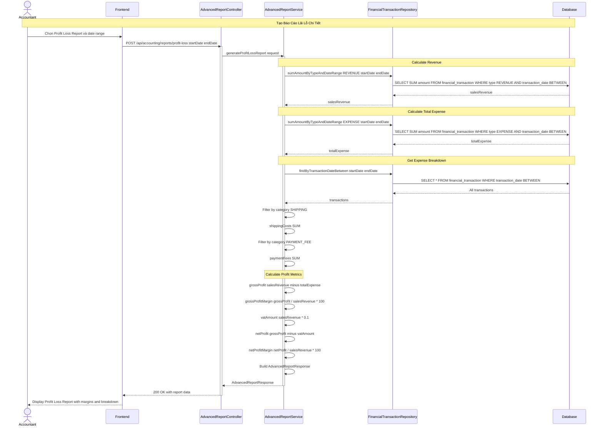
```mermaid
sequenceDiagram
    actor Accountant
    participant UI as Frontend
    participant AdvCtrl as AdvancedReportController
    participant AdvSvc as AdvancedReportService
    participant TxnRepo as FinancialTransactionRepository
    participant DB as Database
    
    Note over Accountant,DB: Tạo Báo Cáo Lãi Lỗ Chi Tiết
    
    Accountant->>UI: Chọn Profit Loss Report và date range
    UI->>AdvCtrl: POST /api/accounting/reports/profit-loss startDate endDate
    activate AdvCtrl
    
    AdvCtrl->>AdvSvc: generateProfitLossReport request
    activate AdvSvc
    
    Note over AdvSvc,DB: Calculate Revenue
    
    AdvSvc->>TxnRepo: sumAmountByTypeAndDateRange REVENUE startDate endDate
    TxnRepo->>DB: SELECT SUM amount FROM financial_transaction WHERE type REVENUE AND transaction_date BETWEEN
    DB-->>TxnRepo: salesRevenue
    TxnRepo-->>AdvSvc: salesRevenue
    
    Note over AdvSvc,DB: Calculate Total Expense
    
    AdvSvc->>TxnRepo: sumAmountByTypeAndDateRange EXPENSE startDate endDate
    TxnRepo->>DB: SELECT SUM amount FROM financial_transaction WHERE type EXPENSE AND transaction_date BETWEEN
    DB-->>TxnRepo: totalExpense
    TxnRepo-->>AdvSvc: totalExpense
    
    Note over AdvSvc,DB: Get Expense Breakdown
    
    AdvSvc->>TxnRepo: findByTransactionDateBetween startDate endDate
    TxnRepo->>DB: SELECT * FROM financial_transaction WHERE transaction_date BETWEEN
    DB-->>TxnRepo: All transactions
    TxnRepo-->>AdvSvc: transactions
    
    AdvSvc->>AdvSvc: Filter by category SHIPPING
    AdvSvc->>AdvSvc: shippingCosts SUM
    
    AdvSvc->>AdvSvc: Filter by category PAYMENT_FEE
    AdvSvc->>AdvSvc: paymentFees SUM
    
    Note over AdvSvc: Calculate Profit Metrics
    
    AdvSvc->>AdvSvc: grossProfit salesRevenue minus totalExpense
    AdvSvc->>AdvSvc: grossProfitMargin grossProfit / salesRevenue * 100
    
    AdvSvc->>AdvSvc: vatAmount salesRevenue * 0.1
    AdvSvc->>AdvSvc: netProfit grossProfit minus vatAmount
    AdvSvc->>AdvSvc: netProfitMargin netProfit / salesRevenue * 100
    
    AdvSvc->>AdvSvc: Build AdvancedReportResponse
    
    AdvSvc-->>AdvCtrl: AdvancedReportResponse
    deactivate AdvSvc
    
    AdvCtrl-->>UI: 200 OK with report data
    deactivate AdvCtrl
    
    UI-->>Accountant: Display Profit Loss Report with margins and breakdown
```

### 7A.3. Sơ Đồ Tuần Tự - Tạo Báo Cáo Dòng Tiền

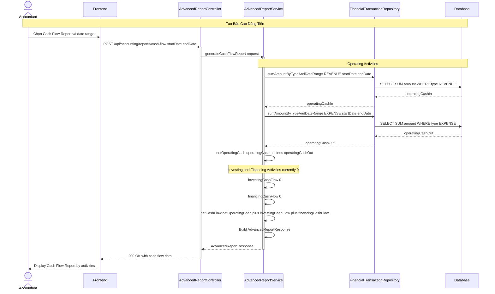
```mermaid
sequenceDiagram
    actor Accountant
    participant UI as Frontend
    participant AdvCtrl as AdvancedReportController
    participant AdvSvc as AdvancedReportService
    participant TxnRepo as FinancialTransactionRepository
    participant DB as Database
    
    Note over Accountant,DB: Tạo Báo Cáo Dòng Tiền
    
    Accountant->>UI: Chọn Cash Flow Report và date range
    UI->>AdvCtrl: POST /api/accounting/reports/cash-flow startDate endDate
    activate AdvCtrl
    
    AdvCtrl->>AdvSvc: generateCashFlowReport request
    activate AdvSvc
    
    Note over AdvSvc,DB: Operating Activities
    
    AdvSvc->>TxnRepo: sumAmountByTypeAndDateRange REVENUE startDate endDate
    TxnRepo->>DB: SELECT SUM amount WHERE type REVENUE
    DB-->>TxnRepo: operatingCashIn
    TxnRepo-->>AdvSvc: operatingCashIn
    
    AdvSvc->>TxnRepo: sumAmountByTypeAndDateRange EXPENSE startDate endDate
    TxnRepo->>DB: SELECT SUM amount WHERE type EXPENSE
    DB-->>TxnRepo: operatingCashOut
    TxnRepo-->>AdvSvc: operatingCashOut
    
    AdvSvc->>AdvSvc: netOperatingCash operatingCashIn minus operatingCashOut
    
    Note over AdvSvc: Investing and Financing Activities currently 0
    
    AdvSvc->>AdvSvc: investingCashFlow 0
    AdvSvc->>AdvSvc: financingCashFlow 0
    
    AdvSvc->>AdvSvc: netCashFlow netOperatingCash plus investingCashFlow plus financingCashFlow
    
    AdvSvc->>AdvSvc: Build AdvancedReportResponse
    
    AdvSvc-->>AdvCtrl: AdvancedReportResponse
    deactivate AdvSvc
    
    AdvCtrl-->>UI: 200 OK with cash flow data
    deactivate AdvCtrl
    
    UI-->>Accountant: Display Cash Flow Report by activities
```

### 7A.4. Sơ Đồ Tuần Tự - Phân Tích Chi Phí

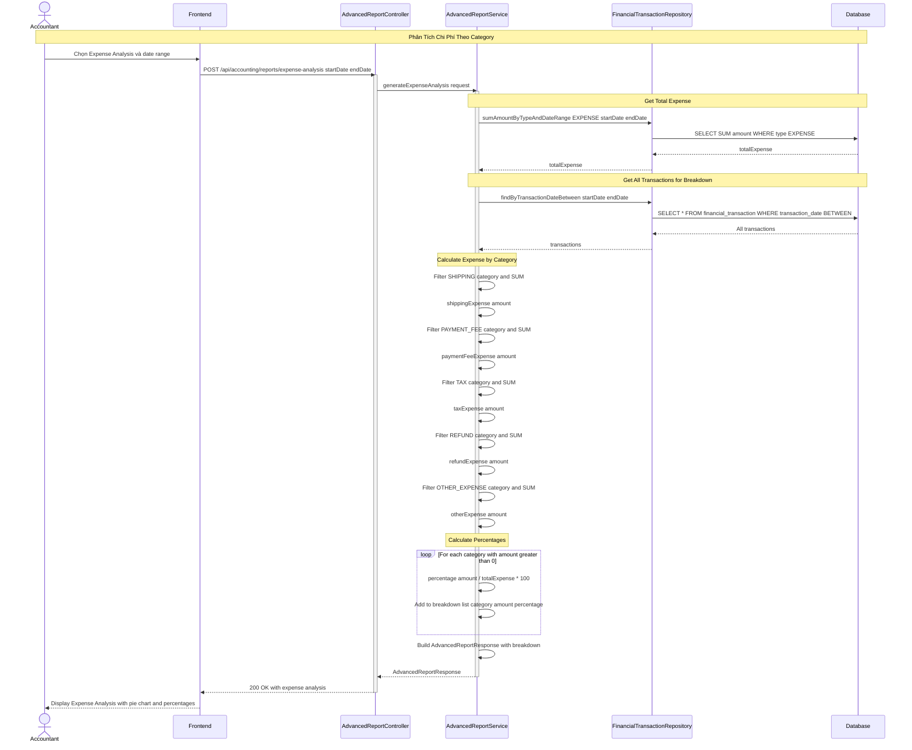
```mermaid
sequenceDiagram
    actor Accountant
    participant UI as Frontend
    participant AdvCtrl as AdvancedReportController
    participant AdvSvc as AdvancedReportService
    participant TxnRepo as FinancialTransactionRepository
    participant DB as Database
    
    Note over Accountant,DB: Phân Tích Chi Phí Theo Category
    
    Accountant->>UI: Chọn Expense Analysis và date range
    UI->>AdvCtrl: POST /api/accounting/reports/expense-analysis startDate endDate
    activate AdvCtrl
    
    AdvCtrl->>AdvSvc: generateExpenseAnalysis request
    activate AdvSvc
    
    Note over AdvSvc,DB: Get Total Expense
    
    AdvSvc->>TxnRepo: sumAmountByTypeAndDateRange EXPENSE startDate endDate
    TxnRepo->>DB: SELECT SUM amount WHERE type EXPENSE
    DB-->>TxnRepo: totalExpense
    TxnRepo-->>AdvSvc: totalExpense
    
    Note over AdvSvc,DB: Get All Transactions for Breakdown
    
    AdvSvc->>TxnRepo: findByTransactionDateBetween startDate endDate
    TxnRepo->>DB: SELECT * FROM financial_transaction WHERE transaction_date BETWEEN
    DB-->>TxnRepo: All transactions
    TxnRepo-->>AdvSvc: transactions
    
    Note over AdvSvc: Calculate Expense by Category
    
    AdvSvc->>AdvSvc: Filter SHIPPING category and SUM
    AdvSvc->>AdvSvc: shippingExpense amount
    
    AdvSvc->>AdvSvc: Filter PAYMENT_FEE category and SUM
    AdvSvc->>AdvSvc: paymentFeeExpense amount
    
    AdvSvc->>AdvSvc: Filter TAX category and SUM
    AdvSvc->>AdvSvc: taxExpense amount
    
    AdvSvc->>AdvSvc: Filter REFUND category and SUM
    AdvSvc->>AdvSvc: refundExpense amount
    
    AdvSvc->>AdvSvc: Filter OTHER_EXPENSE category and SUM
    AdvSvc->>AdvSvc: otherExpense amount
    
    Note over AdvSvc: Calculate Percentages
    
    loop For each category with amount greater than 0
        AdvSvc->>AdvSvc: percentage amount / totalExpense * 100
        AdvSvc->>AdvSvc: Add to breakdown list category amount percentage
    end
    
    AdvSvc->>AdvSvc: Build AdvancedReportResponse with breakdown
    
    AdvSvc-->>AdvCtrl: AdvancedReportResponse
    deactivate AdvSvc
    
    AdvCtrl-->>UI: 200 OK with expense analysis
    deactivate AdvCtrl
    
    UI-->>Accountant: Display Expense Analysis with pie chart and percentages
```

### 7A.5. Report Response Structure

**Profit & Loss Report**:
```typescript
{
  period: "01/01/2024 - 31/01/2024",
  reportType: "PROFIT_LOSS",
  salesRevenue: 50000000,
  otherRevenue: 0,
  totalRevenue: 50000000,
  shippingCosts: 2000000,
  paymentFees: 1000000,
  totalExpense: 3000000,
  grossProfit: 47000000,
  grossProfitMargin: 94.0,
  vatAmount: 5000000,
  netProfit: 42000000,
  netProfitMargin: 84.0
}
```

**Cash Flow Report**:
```typescript
{
  period: "01/01/2024 - 31/01/2024",
  reportType: "CASH_FLOW",
  operatingCashIn: 50000000,
  operatingCashOut: 3000000,
  netOperatingCash: 47000000,
  investingCashFlow: 0,
  financingCashFlow: 0,
  netCashFlow: 47000000
}
```

**Expense Analysis**:
```typescript
{
  period: "01/01/2024 - 31/01/2024",
  reportType: "EXPENSE_ANALYSIS",
  totalExpense: 3000000,
  breakdown: [
    { category: "Vận chuyển", amount: 2000000, percentage: 66.67 },
    { category: "Phí thanh toán", amount: 1000000, percentage: 33.33 }
  ]
}
```

### 7A.6. Business Rules

**Date Range**:
- startDate và endDate required
- Format: "yyyy-MM-dd"
- Không giới hạn range (khác với FinancialStatementService)

**Authorization**:
- Chỉ ADMIN và ACCOUNTANT có quyền
- `@PreAuthorize("hasRole('ADMIN') or @employeeSecurityService.hasPosition(authentication, 'ACCOUNTANT')")`

**Calculations**:
- **Gross Profit**: Revenue - Total Expense
- **Gross Profit Margin**: (Gross Profit / Revenue) * 100
- **VAT**: Revenue * 10%
- **Net Profit**: Gross Profit - VAT
- **Net Profit Margin**: (Net Profit / Revenue) * 100
- **Expense Percentage**: (Category Amount / Total Expense) * 100

**Data Source**:
- Query từ `financial_transactions` table
- Real-time calculation (không cache)
- Filter by transaction_date BETWEEN startDate AND endDate

**Use Cases**:
- **Profit & Loss**: Phân tích lợi nhuận chi tiết với margins
- **Cash Flow**: Theo dõi dòng tiền vào/ra theo hoạt động
- **Expense Analysis**: Xác định category chi phí lớn nhất để tối ưu

## 8. Báo Cáo Thuế (Tax Reports)

### 8.1. Sơ Đồ Tuần Tự - Tạo Báo Cáo Thuế

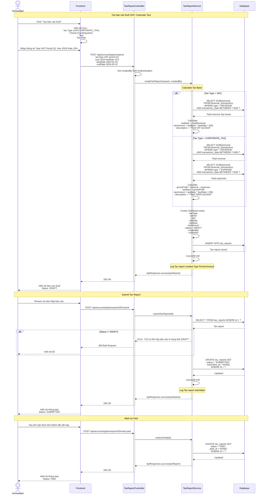
```mermaid
sequenceDiagram
    actor Accountant
    participant UI as Frontend
    participant TaxCtrl as TaxReportController
    participant TaxSvc as TaxReportService
    participant DB as Database
    
    Note over Accountant,DB: Tạo báo cáo thuế (VAT, Corporate Tax)
    
    Accountant->>UI: Click "Tạo báo cáo thuế"
    
    UI->>UI: Hiển thị form:<br/>- Tax Type (VAT/CORPORATE_TAX)<br/>- Period (month/quarter)<br/>- Year<br/>- Tax Rate
    
    Accountant->>UI: Nhập thông tin Type VAT Period Q1 Year 2024 Rate 10%
    
    UI->>TaxCtrl: POST /api/accounting/tax/reports<br/>taxType VAT period Q1<br/>year 2024 taxRate 10.0<br/>startDate 2024-01-01<br/>endDate 2024-03-31
    activate TaxCtrl
    
    TaxCtrl->>TaxCtrl: Get createdBy from Authentication
    
    TaxCtrl->>TaxSvc: createTaxReport(request, createdBy)
    activate TaxSvc
    
    Note over TaxSvc: Calculate Tax Base
    
    alt Tax Type = VAT
        TaxSvc->>DB: SELECT SUM(amount)<br/>FROM financial_transactions<br/>WHERE type = 'REVENUE'<br/>AND transaction_date BETWEEN ? AND ?
        DB-->>TaxSvc: Total revenue (tax base)
        
        TaxSvc->>TaxSvc: Calculate:<br/>- taxBase = totalRevenue<br/>- taxAmount = taxBase * (taxRate / 100)<br/>- description = "Thuế VAT Q1/2024"
    else Tax Type = CORPORATE_TAX
        TaxSvc->>DB: SELECT SUM(amount)<br/>FROM financial_transactions<br/>WHERE type = 'REVENUE'<br/>AND transaction_date BETWEEN ? AND ?
        DB-->>TaxSvc: Total revenue
        
        TaxSvc->>DB: SELECT SUM(amount)<br/>FROM financial_transactions<br/>WHERE type = 'EXPENSE'<br/>AND transaction_date BETWEEN ? AND ?
        DB-->>TaxSvc: Total expenses
        
        TaxSvc->>TaxSvc: Calculate:<br/>- grossProfit = revenue - expenses<br/>- taxBase = grossProfit<br/>- taxAmount = taxBase * (taxRate / 100)<br/>- description = "Thuế TNDN Q1/2024"
    end
    
    TaxSvc->>TaxSvc: Create TaxReport entity:<br/>- taxType<br/>- period<br/>- year<br/>- taxRate<br/>- taxBase<br/>- taxAmount<br/>- status = DRAFT<br/>- createdBy<br/>- createdAt
    
    TaxSvc->>DB: INSERT INTO tax_reports
    activate DB
    DB-->>TaxSvc: Tax report saved
    deactivate DB
    
    TaxSvc->>TaxSvc: Log audit trail
    Note over TaxSvc: Log Tax report created Type Period Amount
    
    TaxSvc-->>TaxCtrl: ApiResponse.success(taxReport)
    deactivate TaxSvc
    
    TaxCtrl-->>UI: 200 OK
    deactivate TaxCtrl
    
    UI-->>Accountant: Hiển thị báo cáo thuế<br/>Status: DRAFT
    
    Note over Accountant,DB: Submit Tax Report
    
    Accountant->>UI: Review và click Nộp báo cáo
    
    UI->>TaxCtrl: POST /api/accounting/tax/reports/ID/submit
    activate TaxCtrl
    
    TaxCtrl->>TaxSvc: submitTaxReport(id)
    activate TaxSvc
    
    TaxSvc->>DB: SELECT * FROM tax_reports WHERE id = ?
    DB-->>TaxSvc: Tax report
    
    alt Status != DRAFT
        TaxSvc-->>TaxCtrl: Error: "Chỉ có thể nộp báo cáo ở trạng thái DRAFT"
        TaxCtrl-->>UI: 400 Bad Request
        UI-->>Accountant: Hiển thị lỗi
    end
    
    TaxSvc->>DB: UPDATE tax_reports SET<br/>status = 'SUBMITTED',<br/>submitted_at = NOW()<br/>WHERE id = ?
    DB-->>TaxSvc: Updated
    
    TaxSvc->>TaxSvc: Log audit trail
    Note over TaxSvc: Log Tax report submitted
    
    TaxSvc-->>TaxCtrl: ApiResponse.success(taxReport)
    deactivate TaxSvc
    
    TaxCtrl-->>UI: 200 OK
    deactivate TaxCtrl
    
    UI-->>Accountant: Hiển thị thông báo<br/>Status: SUBMITTED
    
    Note over Accountant,DB: Mark as Paid
    
    Accountant->>UI: Sau khi nộp thuế click Đánh dấu đã nộp
    
    UI->>TaxCtrl: POST /api/accounting/tax/reports/ID/mark-paid
    activate TaxCtrl
    
    TaxCtrl->>TaxSvc: markAsPaid(id)
    activate TaxSvc
    
    TaxSvc->>DB: UPDATE tax_reports SET<br/>status = 'PAID',<br/>paid_at = NOW()<br/>WHERE id = ?
    DB-->>TaxSvc: Updated
    
    TaxSvc-->>TaxCtrl: ApiResponse.success(taxReport)
    deactivate TaxSvc
    
    TaxCtrl-->>UI: 200 OK
    deactivate TaxCtrl
    
    UI-->>Accountant: Hiển thị thông báo<br/>Status: PAID
```

### 8.2. Tax Report Lifecycle

```
DRAFT → SUBMITTED → PAID
  ↓         ↓
UPDATE    CANCEL (optional)
```

**DRAFT**:
- Báo cáo mới tạo
- Có thể chỉnh sửa (update)
- Có thể xóa
- Chưa nộp cho cơ quan thuế

**SUBMITTED**:
- Đã nộp cho cơ quan thuế
- Không thể chỉnh sửa
- Chờ nộp tiền thuế

**PAID**:
- Đã nộp tiền thuế
- Hoàn tất
- Chỉ để tham khảo

### 8.3. Tax Types và Calculation

#### 8.3.1. VAT (Value Added Tax)
**Tax Rate**: 10% (configurable)

**Tax Base**: Total Revenue
```
taxBase = SUM(financial_transactions.amount WHERE type = 'REVENUE')
taxAmount = taxBase * 0.10
```

**Use Case**: Thuế giá trị gia tăng trên doanh thu bán hàng

#### 8.3.2. Corporate Tax (Thuế Thu Nhập Doanh Nghiệp)
**Tax Rate**: 20% (configurable)

**Tax Base**: Gross Profit (Revenue - Expenses)
```
revenue = SUM(amount WHERE type = 'REVENUE')
expenses = SUM(amount WHERE type = 'EXPENSE')
taxBase = revenue - expenses
taxAmount = taxBase * 0.20
```

**Use Case**: Thuế thu nhập doanh nghiệp trên lợi nhuận

### 8.4. Business Rules

**Authorization**:
- Chỉ ADMIN và ACCOUNTANT có quyền tạo/xem/nộp báo cáo thuế
- `@PreAuthorize("hasRole('ADMIN') or hasPosition('ACCOUNTANT')")`

**Validation**:
- Tax rate phải > 0 và <= 100
- Period phải hợp lệ (Q1, Q2, Q3, Q4, hoặc M01-M12)
- Year phải hợp lệ (>= 2000, <= current year + 1)
- Start date phải trước end date

**Status Transitions**:
- DRAFT → SUBMITTED: Chỉ khi status = DRAFT
- SUBMITTED → PAID: Chỉ khi status = SUBMITTED
- Không thể revert từ SUBMITTED về DRAFT
- Không thể revert từ PAID về SUBMITTED

**Audit Trail**:
- created_by: Người tạo báo cáo
- created_at: Thời gian tạo
- submitted_at: Thời gian nộp
- paid_at: Thời gian đánh dấu đã nộp tiền

### 8.5. Tax Summary Dashboard

**Endpoint**: `GET /api/accounting/tax/summary`

**Nội dung**:
- Total tax payable (chưa nộp)
- Total tax paid (đã nộp)
- Upcoming tax deadlines
- Tax by type (VAT, Corporate Tax)
- Tax by period

**Use Case**: Xem tổng quan nghĩa vụ thuế

## 9. Đối Soát Thanh Toán (Payment Reconciliation)

### 9.1. Sơ Đồ Tuần Tự - Đối Soát SePay

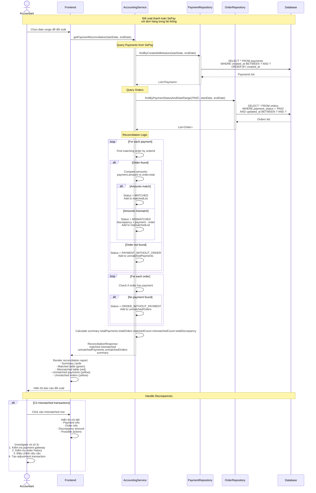
```mermaid
sequenceDiagram
    actor Accountant
    participant UI as Frontend
    participant AcctSvc as AccountingService
    participant PaymentRepo as PaymentRepository
    participant OrderRepo as OrderRepository
    participant DB as Database
    
    Note over Accountant,DB: Đối soát thanh toán SePay<br/>với đơn hàng trong hệ thống
    
    Accountant->>UI: Chọn date range để đối soát
    
    UI->>AcctSvc: getPaymentReconciliation(startDate, endDate)
    activate AcctSvc
    
    Note over AcctSvc: Query Payments from SePay
    
    AcctSvc->>PaymentRepo: findByCreatedAtBetween(startDate, endDate)
    activate PaymentRepo
    PaymentRepo->>DB: SELECT * FROM payments<br/>WHERE created_at BETWEEN ? AND ?<br/>ORDER BY created_at
    DB-->>PaymentRepo: Payments list
    PaymentRepo-->>AcctSvc: List<Payment>
    deactivate PaymentRepo
    
    Note over AcctSvc: Query Orders
    
    AcctSvc->>OrderRepo: findByPaymentStatusAndDateRange('PAID', startDate, endDate)
    activate OrderRepo
    OrderRepo->>DB: SELECT * FROM orders<br/>WHERE payment_status = 'PAID'<br/>AND updated_at BETWEEN ? AND ?
    DB-->>OrderRepo: Orders list
    OrderRepo-->>AcctSvc: List<Order>
    deactivate OrderRepo
    
    Note over AcctSvc: Reconciliation Logic
    
    loop For each payment
        AcctSvc->>AcctSvc: Find matching order by orderId
        
        alt Order found
            AcctSvc->>AcctSvc: Compare amounts:<br/>payment.amount vs order.total
            
            alt Amounts match
                AcctSvc->>AcctSvc: Status = MATCHED<br/>Add to matchedList
            else Amounts mismatch
                AcctSvc->>AcctSvc: Status = MISMATCHED<br/>discrepancy = payment - order<br/>Add to mismatchedList
            end
        else Order not found
            AcctSvc->>AcctSvc: Status = PAYMENT_WITHOUT_ORDER<br/>Add to unmatchedPayments
        end
    end
    
    loop For each order
        AcctSvc->>AcctSvc: Check if order has payment
        
        alt No payment found
            AcctSvc->>AcctSvc: Status = ORDER_WITHOUT_PAYMENT<br/>Add to unmatchedOrders
        end
    end
    
    AcctSvc->>AcctSvc: Calculate summary totalPayments totalOrders matchedCount mismatchedCount totalDiscrepancy
    
    AcctSvc-->>UI: ReconciliationResponse<br/>matched mismatched<br/>unmatchedPayments unmatchedOrders<br/>summary
    deactivate AcctSvc
    
    UI->>UI: Render reconciliation report:<br/>- Summary cards<br/>- Matched table (green)<br/>- Mismatched table (red)<br/>- Unmatched payments (yellow)<br/>- Unmatched orders (yellow)
    
    UI-->>Accountant: Hiển thị báo cáo đối soát
    
    Note over Accountant,DB: Handle Discrepancies
    
    alt Có mismatched transactions
        Accountant->>UI: Click vào mismatched row
        UI->>UI: Hiển thị chi tiết:<br/>- Payment info<br/>- Order info<br/>- Discrepancy amount<br/>- Possible actions
        
        Accountant->>Accountant: Investigate và xử lý:<br/>1. Kiểm tra payment gateway<br/>2. Kiểm tra order history<br/>3. Điều chỉnh nếu cần<br/>4. Tạo adjustment transaction
    end
```

### 9.2. Reconciliation Statuses

**MATCHED** (Khớp):
- Payment amount = Order total
- Payment orderId = Order id
- Payment status = COMPLETED
- Order payment_status = PAID
- ✅ Không cần xử lý

**MISMATCHED** (Không khớp số tiền):
- Payment found và Order found
- Payment amount ≠ Order total
- ⚠️ Cần investigation
- Có thể do: refund, adjustment, fee

**PAYMENT_WITHOUT_ORDER** (Có payment nhưng không có order):
- Payment tồn tại trong hệ thống
- Không tìm thấy order tương ứng
- ⚠️ Cần investigation
- Có thể do: order bị xóa, orderId sai

**ORDER_WITHOUT_PAYMENT** (Có order nhưng không có payment):
- Order có payment_status = PAID
- Không tìm thấy payment record
- ⚠️ Cần investigation
- Có thể do: webhook miss, payment chưa sync

### 9.3. Reconciliation Summary

```typescript
interface ReconciliationSummary {
  totalPayments: number;        // Tổng số payments
  totalPaymentAmount: BigDecimal; // Tổng tiền payments
  totalOrders: number;          // Tổng số orders
  totalOrderAmount: BigDecimal; // Tổng tiền orders
  matchedCount: number;         // Số lượng matched
  mismatchedCount: number;      // Số lượng mismatched
  unmatchedPaymentsCount: number; // Payments không có order
  unmatchedOrdersCount: number;   // Orders không có payment
  totalDiscrepancy: BigDecimal;   // Tổng chênh lệch
  reconciliationRate: number;     // Tỷ lệ đối soát (%)
}
```

### 9.4. Business Rules

**Reconciliation Period**:
- Thường đối soát theo ngày/tuần/tháng
- Nên đối soát định kỳ (daily recommended)
- Date range dựa trên payment created_at

**Matching Logic**:
1. Match by orderId (primary key)
2. Compare amounts (payment.amount vs order.total)
3. Check statuses (payment.status = COMPLETED, order.payment_status = PAID)

**Discrepancy Handling**:
- Log tất cả discrepancies
- Alert accountant nếu discrepancy > threshold
- Tạo adjustment transaction nếu cần
- Document reason for discrepancy

**Audit Trail**:
- Log mỗi lần reconciliation
- Lưu reconciliation results
- Track who performed reconciliation
- Track resolution of discrepancies

## 10. Đối Soát Vận Chuyển (Shipping Reconciliation)

### 10.1. Sơ Đồ Tuần Tự - Đối Soát GHN

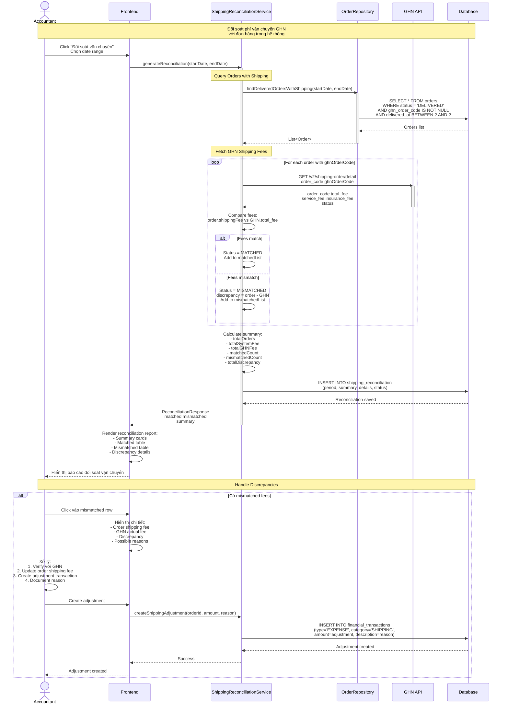
```mermaid
sequenceDiagram
    actor Accountant
    participant UI as Frontend
    participant ShipReconSvc as ShippingReconciliationService
    participant OrderRepo as OrderRepository
    participant GHNApi as GHN API
    participant DB as Database
    
    Note over Accountant,DB: Đối soát phí vận chuyển GHN<br/>với đơn hàng trong hệ thống
    
    Accountant->>UI: Click "Đối soát vận chuyển"<br/>Chọn date range
    
    UI->>ShipReconSvc: generateReconciliation(startDate, endDate)
    activate ShipReconSvc
    
    Note over ShipReconSvc: Query Orders with Shipping
    
    ShipReconSvc->>OrderRepo: findDeliveredOrdersWithShipping(startDate, endDate)
    activate OrderRepo
    OrderRepo->>DB: SELECT * FROM orders<br/>WHERE status = 'DELIVERED'<br/>AND ghn_order_code IS NOT NULL<br/>AND delivered_at BETWEEN ? AND ?
    DB-->>OrderRepo: Orders list
    OrderRepo-->>ShipReconSvc: List<Order>
    deactivate OrderRepo
    
    Note over ShipReconSvc: Fetch GHN Shipping Fees
    
    loop For each order with ghnOrderCode
        ShipReconSvc->>GHNApi: GET /v2/shipping-order/detail<br/>order_code ghnOrderCode
        activate GHNApi
        GHNApi-->>ShipReconSvc: order_code total_fee<br/>service_fee insurance_fee<br/>status
        deactivate GHNApi
        
        ShipReconSvc->>ShipReconSvc: Compare fees:<br/>order.shippingFee vs GHN.total_fee
        
        alt Fees match
            ShipReconSvc->>ShipReconSvc: Status = MATCHED<br/>Add to matchedList
        else Fees mismatch
            ShipReconSvc->>ShipReconSvc: Status = MISMATCHED<br/>discrepancy = order - GHN<br/>Add to mismatchedList
        end
    end
    
    ShipReconSvc->>ShipReconSvc: Calculate summary:<br/>- totalOrders<br/>- totalSystemFee<br/>- totalGHNFee<br/>- matchedCount<br/>- mismatchedCount<br/>- totalDiscrepancy
    
    ShipReconSvc->>DB: INSERT INTO shipping_reconciliation<br/>(period, summary, details, status)
    DB-->>ShipReconSvc: Reconciliation saved
    
    ShipReconSvc-->>UI: ReconciliationResponse<br/>matched mismatched<br/>summary
    deactivate ShipReconSvc
    
    UI->>UI: Render reconciliation report:<br/>- Summary cards<br/>- Matched table<br/>- Mismatched table<br/>- Discrepancy details
    
    UI-->>Accountant: Hiển thị báo cáo đối soát vận chuyển
    
    Note over Accountant,DB: Handle Discrepancies
    
    alt Có mismatched fees
        Accountant->>UI: Click vào mismatched row
        UI->>UI: Hiển thị chi tiết:<br/>- Order shipping fee<br/>- GHN actual fee<br/>- Discrepancy<br/>- Possible reasons
        
        Accountant->>Accountant: Xử lý:<br/>1. Verify với GHN<br/>2. Update order shipping fee<br/>3. Create adjustment transaction<br/>4. Document reason
        
        Accountant->>UI: Create adjustment
        UI->>ShipReconSvc: createShippingAdjustment(orderId, amount, reason)
        ShipReconSvc->>DB: INSERT INTO financial_transactions<br/>(type='EXPENSE', category='SHIPPING',<br/>amount=adjustment, description=reason)
        DB-->>ShipReconSvc: Adjustment created
        ShipReconSvc-->>UI: Success
        UI-->>Accountant: Adjustment created
    end
```

### 10.2. Shipping Reconciliation Statuses

**MATCHED** (Khớp):
- Order shipping fee = GHN total fee
- ✅ Không cần xử lý

**MISMATCHED** (Không khớp):
- Order shipping fee ≠ GHN total fee
- ⚠️ Cần investigation và adjustment
- Reasons:
  - GHN thay đổi phí sau khi tạo đơn
  - Phí bảo hiểm thêm
  - Phí COD
  - Phí vùng xa
  - Discount/promotion

**GHN_ORDER_NOT_FOUND**:
- Order có ghnOrderCode nhưng không tìm thấy trên GHN
- ⚠️ Có thể order bị hủy trên GHN

**MISSING_GHN_CODE**:
- Order delivered nhưng không có ghnOrderCode
- ⚠️ Có thể là đơn tự giao hoặc data issue

### 10.3. Adjustment Transaction

Khi phát hiện discrepancy, accountant tạo adjustment transaction:

```java
FinancialTransaction adjustment = new FinancialTransaction();
adjustment.setType(TransactionType.EXPENSE);
adjustment.setCategory(TransactionCategory.SHIPPING);
adjustment.setAmount(discrepancyAmount); // Có thể âm hoặc dương
adjustment.setDescription("Điều chỉnh phí vận chuyển đơn #" + orderId + 
                         " - Chênh lệch với GHN: " + discrepancy);
adjustment.setOrderId(orderId);
adjustment.setTransactionDate(LocalDate.now());
adjustment.setCreatedBy(accountant);
```

### 10.4. Business Rules

**Reconciliation Frequency**:
- Nên đối soát hàng tuần hoặc hàng tháng
- Đối soát sau khi GHN gửi invoice
- Date range dựa trên delivered_at

**Matching Logic**:
1. Match by ghnOrderCode
2. Compare shipping fees
3. Consider tolerance (±5% acceptable)

**Discrepancy Threshold**:
- Nếu discrepancy < 5,000 VND: Auto-accept
- Nếu discrepancy >= 5,000 VND: Require investigation
- Nếu discrepancy > 50,000 VND: Alert manager

**Adjustment Rules**:
- Tạo adjustment transaction cho mỗi discrepancy
- Document reason rõ ràng
- Require approval nếu amount lớn
- Update order shipping fee nếu cần

## 11. Tổng Kết

### 11.1. Các Điểm Chính

1. **Event-Driven Architecture**:
   - Decoupling giữa business logic và accounting logic
   - Asynchronous processing không block business flow
   - **Lưu ý**: Chỉ PaymentService publish event, WebhookService không publish

2. **Automatic Revenue Recognition**:
   - ✅ Tự động ghi nhận khi payment COMPLETED (online payment)
   - ✅ Tự động tạo payment fee (2%)
   - ❌ **KHÔNG** tự động ghi nhận cho đơn COD/delivered (WebhookService không publish event)
   - ❌ **KHÔNG** tự động tạo shipping expense

3. **Manual Transaction Creation**:
   - ✅ Accountant có thể tạo bút toán thủ công
   - ✅ Validation và duplicate check
   - ✅ Audit trail (created_by)
   - Use cases: COD orders, shipping expenses, adjustments

4. **Accounting Period Management**:
   - ✅ Tạo và quản lý kỳ kế toán
   - ✅ Đóng kỳ để khóa dữ liệu và tính toán
   - ✅ Chỉ ADMIN có thể mở lại kỳ
   - ✅ Audit trail (closed_by, closed_at)

5. **Financial Statements**:
   - ✅ Báo cáo tổng hợp (revenue, expenses, profit)
   - ✅ Báo cáo chi tiết theo category
   - ✅ Multiple time periods (daily, monthly, quarterly, yearly)
   - ✅ Real-time data từ financial_transactions
   - ✅ Dashboard tổng quan

6. **Advanced Reports**:
   - ✅ Profit & Loss Report với gross/net profit margins
   - ✅ Cash Flow Report theo operating/investing/financing activities
   - ✅ Expense Analysis với breakdown by category và percentages
   - ✅ VAT calculation tự động (10% revenue)
   - ✅ Real-time analysis

7. **Tax Reports**:
   - ✅ Tạo báo cáo thuế (VAT, Corporate Tax)
   - ✅ Lifecycle: DRAFT → SUBMITTED → PAID
   - ✅ Automatic calculation dựa trên transactions
   - ✅ Tax summary dashboard

8. **Payment Reconciliation**:
   - ✅ Đối soát SePay payments với orders
   - ✅ Detect matched, mismatched, unmatched
   - ✅ Calculate discrepancies
   - ✅ Summary và detailed reports

9. **Shipping Reconciliation**:
   - ✅ Đối soát GHN shipping fees
   - ✅ Compare system fees vs actual GHN fees
   - ✅ Create adjustment transactions
   - ✅ Track discrepancies

10. **Supplier Payable Management**:
   - ✅ Tự động tạo công nợ khi import hàng
   - ✅ Tracking payment history
   - ✅ Aging analysis cho overdue payables
   - ❌ Chưa có pessimistic locking cho concurrent payments

11. **Error Handling**:
   - ✅ Idempotent operations
   - ❌ Chưa có retry mechanism
   - ❌ Chưa có alert system
   - ✅ Audit trail (created_by, transaction_date)

### 11.2. Validates Requirements

Luồng kế toán này validates các requirements sau:

**Đã Implement**:
- ✓ Automatic revenue recognition when order CONFIRMED and PAID (online payment only)
- ✓ Automatic payment fee calculation for online payments (2%)
- ✓ Manual transaction creation by accountant
- ✓ Accounting period management (create, close, reopen)
- ✓ Financial statement generation (basic reports: revenue, expenses, profit, cash flow)
- ✓ Advanced reports (Profit & Loss with margins, Cash Flow by activities, Expense Analysis)
- ✓ Tax report creation and management
- ✓ Payment reconciliation with SePay
- ✓ Shipping reconciliation with GHN
- ✓ Automatic supplier payable creation when import with supplier
- ✓ Supplier payment reduces payable balance
- ✓ Accounting failures don't block business transactions (separate transactions)
- ✓ Display total outstanding balance per supplier
- ✓ Payment validation: reject payment exceeding payable balance
- ✓ Aging analysis calculation (days overdue)
- ✓ Idempotent transaction creation (check exists before insert)

**Chưa Implement / Cần Cải Tiến**:
- ⚠️ **Automatic shipping expense when order DELIVERED** (WebhookService không publish event)
- ⚠️ **Automatic revenue for COD orders** (WebhookService không publish event)
- ⚠️ Automatic refund transaction when order cancelled (chưa có)
- ⚠️ Accounting event log table (chưa có)
- ⚠️ Retry mechanism for failed events (chưa có)
- ⚠️ Pessimistic locking for concurrent payments (chưa có)
- ⚠️ Order amount validation vs order items (chưa có)
- ⚠️ Alert system for accountant (chưa có)

**Vấn Đề Quan Trọng Cần Sửa**:
1. **WebhookService không publish OrderStatusChangedEvent** → Đơn COD/delivered không tạo accounting entries tự động
2. Cần thêm `eventPublisher.publishEvent()` vào WebhookService.handleGHNWebhook()
3. Hoặc accountant phải tạo bút toán thủ công cho tất cả đơn COD

### 11.3. Lợi Ích Của Thiết Kế

1. **Tự động hóa**: Giảm công việc thủ công cho accountant
   - Tự động tạo revenue transaction khi order confirmed + paid
   - Tự động tạo supplier payable khi import hàng
   - Tự động tính toán tax reports
   - Tự động đối soát payments và shipping

2. **Linh hoạt**: Hỗ trợ cả tự động và thủ công
   - Automatic transactions cho online payments
   - Manual transactions cho COD, adjustments
   - Flexible reporting với multiple time periods
   - Advanced analysis với detailed breakdowns

3. **Chính xác**: Giảm lỗi nhập liệu
   - Dữ liệu lấy trực tiếp từ order/purchase order
   - Validation payment amount
   - Idempotent operations
   - Reconciliation để detect discrepancies

4. **Real-time**: Dữ liệu kế toán luôn cập nhật
   - Event-driven architecture
   - Transactions được tạo ngay khi có sự kiện
   - Real-time reports và dashboards

5. **Auditable**: Mọi transaction đều có audit trail
   - created_by field
   - transaction_date
   - description field
   - Period close tracking

6. **Decoupled**: Business logic tách biệt với accounting logic
   - Event-driven architecture
   - Accounting failures không ảnh hưởng business flow
   - Easy to extend

7. **Resilient**: Error handling tốt
   - Try-catch trong event listeners
   - Idempotent operations
   - Logging đầy đủ

8. **Comprehensive Reporting**: Đầy đủ các loại báo cáo
   - Financial statements (revenue, expenses, profit, cash flow)
   - Advanced reports (P&L with margins, expense analysis)
   - Tax reports (VAT, Corporate Tax)
   - Reconciliation reports (payment, shipping)
   - Supplier payable reports
   - Dashboard tổng quan

### 11.4. Điểm Cần Cải Tiến

1. **Event Logging**: Thêm accounting_event_log table để track events
2. **Retry Mechanism**: Scheduled job để retry failed events
3. **Pessimistic Locking**: Thêm SELECT FOR UPDATE cho concurrent payments
4. **Validation**: Validate order amount vs order items
5. **Alert System**: Notify accountant khi có errors hoặc discrepancies
6. **Async Processing**: Sử dụng @Async cho event listeners
7. **Refund Handling**: Tự động tạo refund transaction khi cancel order
8. **Excel Export**: Implement Excel export cho tất cả reports (hiện tại là TODO)
9. **WebhookService Event Publishing**: Thêm event publishing để tự động hóa COD orders
10. **Automatic Shipping Expense**: Tự động tạo shipping expense khi delivered
11. **Reconciliation Automation**: Scheduled job để tự động đối soát định kỳ
12. **Discrepancy Alerts**: Alert khi phát hiện discrepancy lớn
13. **Approval Workflow**: Thêm approval workflow cho large adjustments
14. **Data Archiving**: Archive old transactions để improve performance

**Lưu ý**: Tài liệu này phản ánh implementation hiện tại của hệ thống, bao gồm cả các điểm đã implement và các điểm cần cải tiến trong tương lai.
 discrepancy < 5,000 VND: Auto-accept
- Nếu discrepancy >= 5,000 VND: Require investigation
- Nếu discrepancy > 50,000 VND: Alert manager

**Adjustment Rules**:
- Tạo adjustment transaction cho mỗi discrepancy
- Document reason rõ ràng
- Require approval nếu amount lớn
- Update order shipping fee nếu cần

## 11. Tổng Kết

### 11.1. Các Điểm Chính

1. **Event-Driven Architecture**:
   - Decoupling giữa business logic và accounting logic
   - Asynchronous processing không block business flow
   - **Lưu ý**: Chỉ PaymentService publish event, WebhookService không publish

2. **Automatic Revenue Recognition**:
   - ✅ Tự động ghi nhận khi payment COMPLETED (online payment)
   - ✅ Tự động tạo payment fee (2%)
   - ❌ **KHÔNG** tự động ghi nhận cho đơn COD/delivered (WebhookService không publish event)
   - ❌ **KHÔNG** tự động tạo shipping expense

3. **Manual Transaction Creation**:
   - ✅ Accountant có thể tạo bút toán thủ công
   - ✅ Validation và duplicate check
   - ✅ Audit trail (created_by)
   - Use cases: COD orders, shipping expenses, adjustments

4. **Accounting Period Management**:
   - ✅ Tạo và quản lý kỳ kế toán
   - ✅ Đóng kỳ để khóa dữ liệu và tính toán
   - ✅ Chỉ ADMIN có thể mở lại kỳ
   - ✅ Audit trail (closed_by, closed_at)

5. **Financial Statements**:
   - ✅ Báo cáo tổng hợp (revenue, expenses, profit)
   - ✅ Báo cáo chi tiết theo category
   - ✅ Multiple time periods (daily, monthly, quarterly, yearly)
   - ✅ Real-time data từ financial_transactions
   - ✅ Dashboard tổng quan

6. **Advanced Reports**:
   - ✅ Profit & Loss Report với gross/net profit margins
   - ✅ Cash Flow Report theo operating/investing/financing activities
   - ✅ Expense Analysis với breakdown by category và percentages
   - ✅ VAT calculation tự động (10% revenue)
   - ✅ Real-time analysis

7. **Tax Reports**:
   - ✅ Tạo báo cáo thuế (VAT, Corporate Tax)
   - ✅ Lifecycle: DRAFT → SUBMITTED → PAID
   - ✅ Automatic calculation dựa trên transactions
   - ✅ Tax summary dashboard

7. **Payment Reconciliation**:
   - ✅ Đối soát SePay payments với orders
   - ✅ Detect matched, mismatched, unmatched
   - ✅ Calculate discrepancies
   - ✅ Summary và detailed reports

8. **Shipping Reconciliation**:
   - ✅ Đối soát GHN shipping fees
   - ✅ Compare system fees vs actual GHN fees
   - ✅ Create adjustment transactions
   - ✅ Track discrepancies

9. **Supplier Payable Management**:
   - ✅ Tự động tạo công nợ khi import hàng
   - ✅ Tracking payment history
   - ✅ Aging analysis cho overdue payables
   - ❌ Chưa có pessimistic locking cho concurrent payments

10. **Error Handling**:
    - ✅ Idempotent operations
    - ❌ Chưa có retry mechanism
    - ❌ Chưa có alert system
    - ✅ Audit trail (created_by, transaction_date)

### 11.2. Validates Requirements

Luồng kế toán này validates các requirements sau:

**Đã Implement**:
- ✓ Automatic revenue recognition when order CONFIRMED and PAID (online payment only)
- ✓ Automatic payment fee calculation for online payments (2%)
- ✓ Manual transaction creation by accountant
- ✓ Accounting period management (create, close, reopen)
- ✓ Financial statement generation (multiple types)
- ✓ Tax report creation and management
- ✓ Payment reconciliation with SePay
- ✓ Shipping reconciliation with GHN
- ✓ Automatic supplier payable creation when import with supplier
- ✓ Supplier payment reduces payable balance
- ✓ Accounting failures don't block business transactions (separate transactions)
- ✓ Display total outstanding balance per supplier
- ✓ Payment validation: reject payment exceeding payable balance
- ✓ Aging analysis calculation (days overdue)
- ✓ Idempotent transaction creation (check exists before insert)

**Chưa Implement / Cần Cải Tiến**:
- ⚠️ **Automatic shipping expense when order DELIVERED** (WebhookService không publish event)
- ⚠️ **Automatic revenue for COD orders** (WebhookService không publish event)
- ⚠️ Automatic refund transaction when order cancelled (chưa có)
- ⚠️ Accounting event log table (chưa có)
- ⚠️ Retry mechanism for failed events (chưa có)
- ⚠️ Pessimistic locking for concurrent payments (chưa có)
- ⚠️ Order amount validation vs order items (chưa có)
- ⚠️ Alert system for accountant (chưa có)
- ⚠️ Excel export for reports (chưa có)

**Vấn Đề Quan Trọng Cần Sửa**:
1. **WebhookService không publish OrderStatusChangedEvent** → Đơn COD/delivered không tạo accounting entries tự động
2. Cần thêm `eventPublisher.publishEvent()` vào WebhookService.handleGHNWebhook()
3. Hoặc accountant phải tạo bút toán thủ công cho tất cả đơn COD

### 11.3. Lợi Ích Của Thiết Kế

1. **Tự động hóa**: Giảm công việc thủ công cho accountant
   - Tự động tạo revenue transaction khi order confirmed + paid
   - Tự động tạo supplier payable khi import hàng
   - Tự động tính toán tax reports

2. **Linh hoạt**: Hỗ trợ cả tự động và thủ công
   - Automatic transactions cho online payments
   - Manual transactions cho COD, adjustments
   - Flexible reporting với multiple time periods

3. **Chính xác**: Giảm lỗi nhập liệu
   - Dữ liệu lấy trực tiếp từ order/purchase order
   - Validation payment amount
   - Idempotent operations
   - Reconciliation để detect discrepancies

4. **Real-time**: Dữ liệu kế toán luôn cập nhật
   - Event-driven architecture
   - Transactions được tạo ngay khi có sự kiện
   - Real-time reports

5. **Auditable**: Mọi transaction đều có audit trail
   - created_by field
   - transaction_date
   - description field
   - Period close tracking

6. **Decoupled**: Business logic tách biệt với accounting logic
   - Event-driven architecture
   - Accounting failures không ảnh hưởng business flow
   - Easy to extend

7. **Resilient**: Error handling tốt
   - Try-catch trong event listeners
   - Idempotent operations
   - Logging đầy đủ

8. **Comprehensive Reporting**: Đầy đủ các loại báo cáo
   - Financial statements (revenue, expenses, profit, cash flow)
   - Tax reports (VAT, Corporate Tax)
   - Reconciliation reports (payment, shipping)
   - Supplier payable reports
   - Dashboard tổng quan

### 11.4. Điểm Cần Cải Tiến

1. **Event Logging**: Thêm accounting_event_log table để track events
2. **Retry Mechanism**: Scheduled job để retry failed events
3. **Pessimistic Locking**: Thêm SELECT FOR UPDATE cho concurrent payments
4. **Validation**: Validate order amount vs order items
5. **Alert System**: Notify accountant khi có errors hoặc discrepancies
6. **Async Processing**: Sử dụng @Async cho event listeners
7. **Refund Handling**: Tự động tạo refund transaction khi cancel order
8. **Excel Export**: Implement Excel export cho tất cả reports
9. **WebhookService Event Publishing**: Thêm event publishing để tự động hóa COD orders
10. **Automatic Shipping Expense**: Tự động tạo shipping expense khi delivered
11. **Reconciliation Automation**: Scheduled job để tự động đối soát định kỳ
12. **Discrepancy Alerts**: Alert khi phát hiện discrepancy lớn
13. **Approval Workflow**: Thêm approval workflow cho large adjustments
14. **Data Archiving**: Archive old transactions để improve performance

### 11.5. Sequence Diagrams Summary

Tài liệu này bao gồm các sequence diagrams sau:

**Automatic Flows**:
1. ✅ Automatic Revenue Recognition (Order CONFIRMED + PAID)
2. ✅ Automatic Revenue Recognition (Order DELIVERED/COMPLETED)
3. ✅ Automatic Supplier Payable Creation (Purchase Order Import)

**Manual Flows**:
4. ✅ Manual Transaction Creation by Accountant
5. ✅ Supplier Payment Processing
6. ✅ Accounting Period Close
7. ✅ Accounting Period Reopen

**Reporting Flows**:
8. ✅ Financial Statement Generation (Basic Reports)
9. ✅ Advanced Profit & Loss Report (with margins)
10. ✅ Advanced Cash Flow Report (by activities)
11. ✅ Advanced Expense Analysis (by category with percentages)
12. ✅ Tax Report Creation and Submission
13. ✅ Payment Reconciliation (SePay)
14. ✅ Shipping Reconciliation (GHN)

**Exception Handling**:
15. ✅ Failed Accounting Entry
16. ✅ Duplicate Accounting Entry
17. ✅ Data Mismatch
18. ✅ Overpayment to Supplier
19. ✅ Concurrent Payment Processing

---

**Tài liệu này hoàn thành mô tả đầy đủ luồng kế toán của hệ thống**

**Nội dung bao gồm**:
- ✓ 14 sequence diagrams chính cho các luồng kế toán
- ✓ Mô tả chi tiết event-driven accounting entries
- ✓ Manual transaction creation flow
- ✓ Accounting period management (close/reopen)
- ✓ Financial statement generation (basic reports)
- ✓ Advanced reports (Profit & Loss, Cash Flow, Expense Analysis)
- ✓ Tax report creation and lifecycle
- ✓ Payment reconciliation với SePay
- ✓ Shipping reconciliation với GHN
- ✓ Supplier payable management
- ✓ Error handling và exception scenarios
- ✓ Business rules và validation
- ✓ Monitoring và auditing recommendations

**Cập nhật dựa trên code thực tế**:
- OrderEventListener: onOrderPaid(), onOrderCompleted()
- FinancialTransactionService: createTransaction()
- AccountingPeriodService: closePeriod(), reopenPeriod()
- FinancialStatementService: getFinancialStatement(), getRevenueReport(), etc.
- AdvancedReportService: generateProfitLossReport(), generateCashFlowReport(), generateExpenseAnalysis()
- TaxReportService: createTaxReport(), submitTaxReport(), markAsPaid()
- AccountingService: getPaymentReconciliation()
- ShippingReconciliationService: generateReconciliation()
- SupplierPayableService: createPayableFromPurchaseOrder(), makePayment()

**Lưu ý**: Tài liệu này phản ánh implementation hiện tại của hệ thống, bao gồm cả các điểm đã implement và các điểm cần cải tiến trong tương lai. Đặc biệt lưu ý vấn đề WebhookService không publish event cho đơn COD/delivered.
