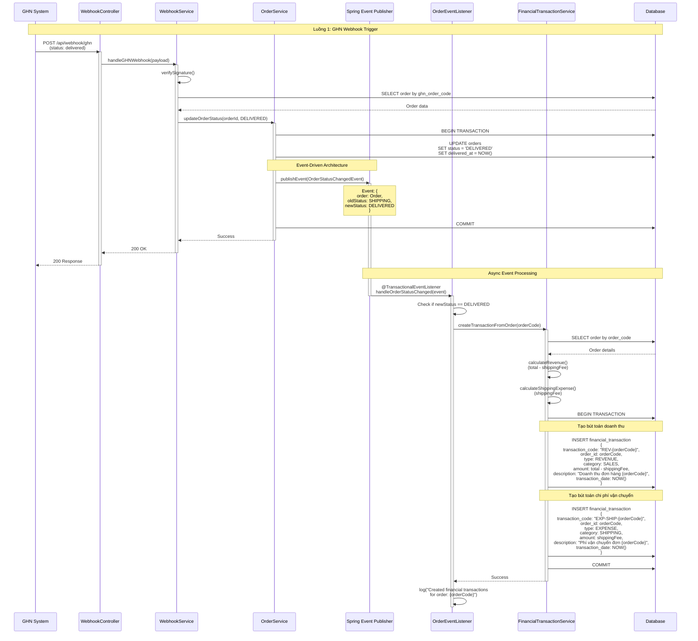
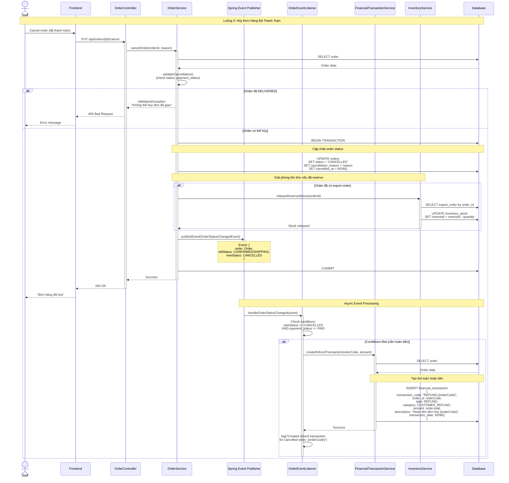
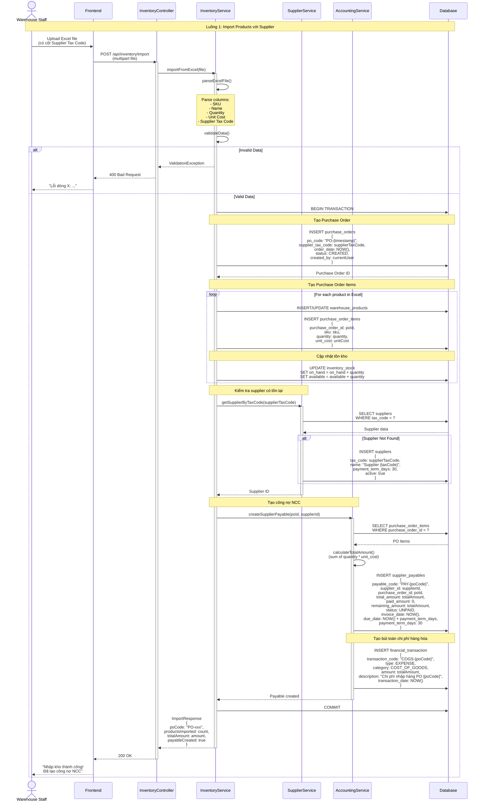
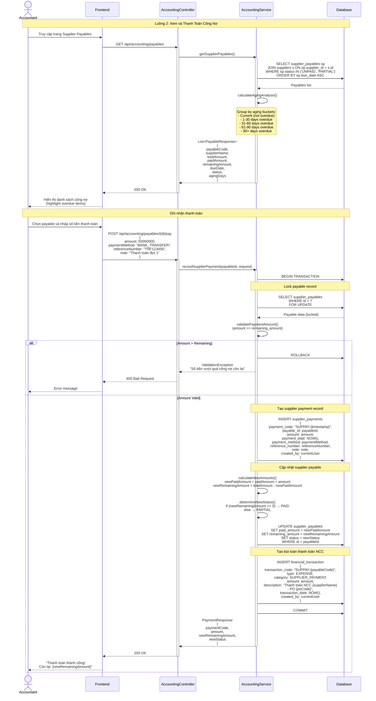
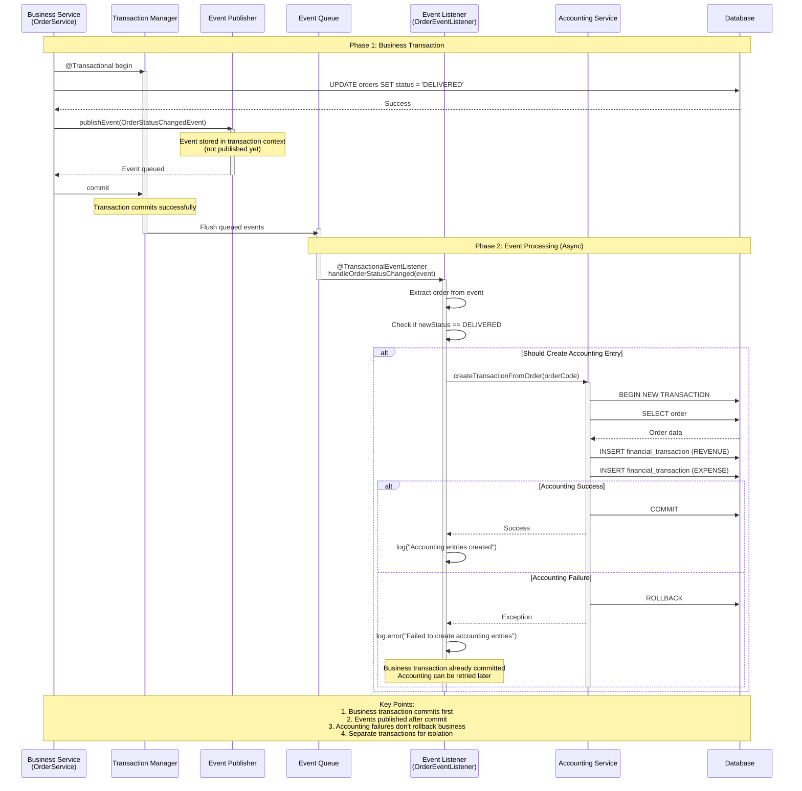
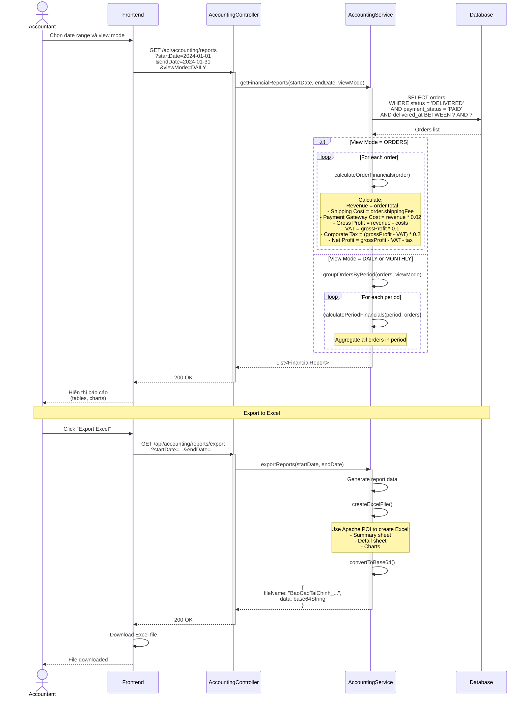

# Sơ Đồ Tuần Tự - Luồng Kế Toán (Accounting Flow)

## Tổng Quan

Tài liệu này mô tả chi tiết các luồng kế toán tự động trong hệ thống TMDT, bao gồm:
1. Ghi nhận doanh thu tự động (Automatic Revenue Recognition)
2. Quản lý công nợ nhà cung cấp (Supplier Payable Management)
3. Cơ chế event-driven accounting entries

Hệ thống kế toán được thiết kế theo mô hình event-driven, tự động ghi nhận các bút toán khi có sự kiện nghiệp vụ xảy ra.

## 1. Ghi Nhận Doanh Thu Tự Động (Automatic Revenue Recognition)

### 1.1. Kịch Bản Chuẩn

**Mô tả**: Hệ thống tự động ghi nhận doanh thu khi đơn hàng được giao thành công

**Trigger Events**:
- Order status chuyển sang DELIVERED
- Order status chuyển sang CONFIRMED và payment_status = PAID

**Các bước xử lý**:
1. OrderService cập nhật order status
2. Publish OrderStatusChangedEvent
3. OrderEventListener nhận event
4. Gọi FinancialTransactionService để tạo bút toán
5. Tạo financial_transaction với type = REVENUE
6. Tạo financial_transaction với type = EXPENSE (shipping cost)
7. Log kết quả

**Điều kiện tiên quyết**:
- Order đã được tạo và có order_code hợp lệ
- Order có total amount > 0
- Event listener đã được đăng ký

**Kết quả mong đợi**:
- Financial transactions được tạo thành công
- Doanh thu được ghi nhận chính xác
- Chi phí vận chuyển được ghi nhận


### 1.2. Sơ Đồ Tuần Tự - Ghi Nhận Doanh Thu Khi Đơn Hàng DELIVERED




### 1.3. Sơ Đồ Tuần Tự - Ghi Nhận Doanh Thu Khi Thanh Toán Online

```mermaid
sequenceDiagram
    participant SePay as SePay System
    participant WebhookCtrl as WebhookController
    participant PaymentSvc as PaymentService
    participant OrderSvc as OrderService
    participant EventPublisher as Spring Event Publisher
    participant EventListener as OrderEventListener
    participant FinTxnSvc as FinancialTransactionService
    participant DB as Database
    
    Note over SePay,DB: Luồng 2: SePay Payment Webhook
    
    SePay->>WebhookCtrl: POST /api/webhook/sepay<br/>(payment confirmed)
    activate WebhookCtrl
    
    WebhookCtrl->>PaymentSvc: handleSePayWebhook(payload)
    activate PaymentSvc
    
    PaymentSvc->>PaymentSvc: verifySignature()
    PaymentSvc->>DB: SELECT payment by payment_code
    DB-->>PaymentSvc: Payment data
    
    PaymentSvc->>PaymentSvc: validateAmount()<br/>(webhook amount == payment amount)
    
    alt Amount Match
        PaymentSvc->>DB: BEGIN TRANSACTION
        
        Note over PaymentSvc,DB: Cập nhật payment status
        
        PaymentSvc->>DB: UPDATE payments<br/>SET status = 'COMPLETED'<br/>SET paid_at = NOW()
        
        Note over PaymentSvc,DB: Cập nhật order payment status
        
        PaymentSvc->>DB: UPDATE orders<br/>SET payment_status = 'PAID'<br/>WHERE order_code = payment.order_id
        
        PaymentSvc->>DB: SELECT order by order_code
        DB-->>PaymentSvc: Order data
        
        Note over PaymentSvc,OrderSvc: Nếu order đang PENDING_PAYMENT, chuyển sang CONFIRMED
        
        alt Order status == PENDING_PAYMENT
            PaymentSvc->>OrderSvc: updateOrderStatus(orderId, CONFIRMED)
            activate OrderSvc
            
            OrderSvc->>DB: UPDATE orders<br/>SET status = 'CONFIRMED'<br/>SET confirmed_at = NOW()
            
            OrderSvc->>EventPublisher: publishEvent(OrderStatusChangedEvent)
            activate EventPublisher
            Note over EventPublisher: Event: {<br/>  order: Order,<br/>  oldStatus: PENDING_PAYMENT,<br/>  newStatus: CONFIRMED<br/>}
            deactivate EventPublisher
            
            OrderSvc-->>PaymentSvc: Success
            deactivate OrderSvc
        end
        
        Note over PaymentSvc,DB: Tạo bút toán thu tiền
        
        PaymentSvc->>DB: INSERT financial_transaction<br/>{<br/>  transaction_code: "PAY-{paymentCode}",<br/>  order_id: payment.order_id,<br/>  type: REVENUE,<br/>  category: PAYMENT_RECEIVED,<br/>  amount: payment.amount,<br/>  description: "Thu tiền online đơn {orderCode}",<br/>  transaction_date: NOW()<br/>}
        
        PaymentSvc->>DB: COMMIT
        
        PaymentSvc-->>WebhookCtrl: Success
        deactivate PaymentSvc
        WebhookCtrl-->>SePay: 200 OK
        deactivate WebhookCtrl
        
        Note over EventPublisher,DB: Async Event Processing (nếu có)
        
        EventPublisher->>EventListener: handleOrderStatusChanged(event)
        activate EventListener
        
        EventListener->>EventListener: Check conditions:<br/>newStatus == CONFIRMED<br/>AND payment_status == PAID
        
        alt Conditions Met
            EventListener->>FinTxnSvc: createTransactionFromOrder(orderCode)
            activate FinTxnSvc
            
            Note over FinTxnSvc: Tạo bút toán doanh thu<br/>(tương tự như DELIVERED flow)
            
            FinTxnSvc->>DB: INSERT financial_transaction (REVENUE)
            FinTxnSvc->>DB: INSERT financial_transaction (SHIPPING EXPENSE)
            
            FinTxnSvc-->>EventListener: Success
            deactivate FinTxnSvc
        end
        
        deactivate EventListener
        
    else Amount Mismatch
        PaymentSvc->>DB: UPDATE payments<br/>SET status = 'FAILED'<br/>SET failure_reason = 'Amount mismatch'
        
        PaymentSvc->>PaymentSvc: alertAccountant()<br/>("Payment amount mismatch for {orderCode}")
        
        PaymentSvc-->>WebhookCtrl: Success (but flagged)
        deactivate PaymentSvc
        WebhookCtrl-->>SePay: 200 OK
        deactivate WebhookCtrl
    end
```


### 1.4. Sơ Đồ Tuần Tự - Xử Lý Hoàn Tiền (Refund)




## 2. Quản Lý Công Nợ Nhà Cung Cấp (Supplier Payable Management)

### 2.1. Kịch Bản Chuẩn

**Mô tả**: Hệ thống tự động tạo công nợ NCC khi nhập hàng và quản lý thanh toán

**Trigger Events**:
- Purchase Order được tạo với supplier information
- Accountant ghi nhận thanh toán cho NCC

**Các bước xử lý**:
1. Warehouse staff import products via Excel với supplier info
2. Hệ thống tạo Purchase Order
3. Tạo Supplier Payable record
4. Accountant xem danh sách công nợ
5. Accountant ghi nhận thanh toán
6. Cập nhật payable status
7. Tạo financial transaction (EXPENSE)

**Điều kiện tiên quyết**:
- Supplier đã được tạo trong hệ thống
- Purchase Order có total amount > 0
- Payment amount <= remaining amount

**Kết quả mong đợi**:
- Supplier payable được tạo và cập nhật chính xác
- Financial transactions được ghi nhận
- Công nợ được theo dõi đầy đủ

### 2.2. Sơ Đồ Tuần Tự - Tạo Công Nợ NCC Khi Nhập Hàng




### 2.3. Sơ Đồ Tuần Tự - Thanh Toán Công Nợ NCC




## 3. Event-Driven Accounting Architecture

### 3.1. Tổng Quan Kiến Trúc

Hệ thống kế toán sử dụng kiến trúc event-driven để tự động hóa việc ghi nhận các bút toán:

**Ưu điểm**:
1. **Decoupling**: Business logic (Order, Payment) tách biệt với Accounting logic
2. **Asynchronous**: Không block business transactions nếu accounting fails
3. **Auditable**: Mọi event đều được log và có thể replay
4. **Scalable**: Dễ dàng thêm listeners mới cho các yêu cầu kế toán khác

**Components**:
- **Event Publishers**: OrderService, PaymentService, InventoryService
- **Event Listeners**: OrderEventListener, PaymentEventListener
- **Event Types**: OrderStatusChangedEvent, PaymentCompletedEvent
- **Transaction Services**: FinancialTransactionService, SupplierPayableService

### 3.2. Sơ Đồ Kiến Trúc Event-Driven

```mermaid
graph TB
    subgraph "Business Layer"
        OrderSvc[OrderService]
        PaymentSvc[PaymentService]
        InvSvc[InventoryService]
    end
    
    subgraph "Event Bus (Spring Events)"
        EventPublisher[Spring Event Publisher]
        EventQueue[Event Queue]
    end
    
    subgraph "Accounting Layer"
        OrderListener[OrderEventListener]
        PaymentListener[PaymentEventListener]
        FinTxnSvc[FinancialTransactionService]
        PayableSvc[SupplierPayableService]
    end
    
    subgraph "Data Layer"
        OrderDB[(orders)]
        PaymentDB[(payments)]
        FinTxnDB[(financial_transaction)]
        PayableDB[(supplier_payables)]
    end
    
    OrderSvc -->|publishEvent| EventPublisher
    PaymentSvc -->|publishEvent| EventPublisher
    InvSvc -->|publishEvent| EventPublisher
    
    EventPublisher --> EventQueue
    
    EventQueue -->|@TransactionalEventListener| OrderListener
    EventQueue -->|@TransactionalEventListener| PaymentListener
    
    OrderListener --> FinTxnSvc
    PaymentListener --> FinTxnSvc
    InvSvc --> PayableSvc
    
    FinTxnSvc --> FinTxnDB
    PayableSvc --> PayableDB
    PayableSvc --> FinTxnDB
    
    OrderSvc --> OrderDB
    PaymentSvc --> PaymentDB
    
    style EventPublisher fill:#e1f5ff
    style EventQueue fill:#e1f5ff
    style OrderListener fill:#fff4e1
    style PaymentListener fill:#fff4e1
    style FinTxnSvc fill:#e8f5e9
    style PayableSvc fill:#e8f5e9
```

### 3.3. Sơ Đồ Tuần Tự - Event Flow Chi Tiết




### 3.4. Event Types và Handlers

#### OrderStatusChangedEvent

```java
public class OrderStatusChangedEvent {
    private Order order;
    private OrderStatus oldStatus;
    private OrderStatus newStatus;
    private LocalDateTime timestamp;
}
```

**Triggers**:
- Order status changes from any state to another
- Published by OrderService.updateOrderStatus()

**Handlers**:
- OrderEventListener.handleOrderStatusChanged()
  - If newStatus == DELIVERED → Create revenue transaction
  - If newStatus == CONFIRMED && paymentStatus == PAID → Create revenue transaction
  - If newStatus == CANCELLED && paymentStatus == PAID → Create refund transaction

#### PaymentCompletedEvent

```java
public class PaymentCompletedEvent {
    private Payment payment;
    private Order order;
    private LocalDateTime timestamp;
}
```

**Triggers**:
- Payment status changes to COMPLETED
- Published by PaymentService.handleWebhook()

**Handlers**:
- PaymentEventListener.handlePaymentCompleted()
  - Create payment received transaction
  - Update order payment status
  - Trigger order confirmation if needed

### 3.5. Error Handling Strategy

#### Scenario 1: Accounting Service Failure

**Problem**: Financial transaction creation fails due to database error

**Handling**:
```java
@TransactionalEventListener
public void handleOrderStatusChanged(OrderStatusChangedEvent event) {
    try {
        financialTransactionService.createTransactionFromOrder(orderCode);
        log.info("Created financial transactions for order: {}", orderCode);
    } catch (Exception e) {
        log.error("Failed to create financial transactions for order: {}", orderCode, e);
        // Business transaction already committed
        // Alert accountant for manual intervention
        alertService.notifyAccountant("Accounting entry failed for order: " + orderCode);
    }
}
```

**Result**:
- Business transaction (order status update) is NOT rolled back
- Error is logged for investigation
- Accountant is notified to create entry manually
- System remains consistent

#### Scenario 2: Duplicate Event Processing

**Problem**: Event listener is triggered multiple times for same event

**Handling**:
```java
public void createTransactionFromOrder(String orderCode) {
    // Check if transaction already exists
    if (financialTransactionRepository.existsByOrderId(orderCode)) {
        log.warn("Financial transaction already exists for order: {}", orderCode);
        return; // Idempotent - skip duplicate
    }
    
    // Create new transaction
    FinancialTransaction transaction = new FinancialTransaction();
    // ... set fields
    financialTransactionRepository.save(transaction);
}
```

**Result**:
- Idempotent operation prevents duplicates
- Only one financial transaction per order
- Safe to retry

#### Scenario 3: Event Processing Timeout

**Problem**: Accounting service takes too long to process

**Handling**:
```java
@TransactionalEventListener
@Async
@Timeout(value = 30, unit = TimeUnit.SECONDS)
public void handleOrderStatusChanged(OrderStatusChangedEvent event) {
    // Process with timeout
    financialTransactionService.createTransactionFromOrder(orderCode);
}
```

**Result**:
- Async processing doesn't block business flow
- Timeout prevents hanging
- Failed events can be retried via scheduled job

### 3.6. Monitoring và Auditing

#### Accounting Event Log

```sql
CREATE TABLE accounting_event_log (
    id BIGINT PRIMARY KEY AUTO_INCREMENT,
    event_type VARCHAR(50) NOT NULL,
    order_id VARCHAR(50),
    event_data JSON,
    processing_status ENUM('PENDING', 'PROCESSED', 'FAILED'),
    error_message TEXT,
    created_at TIMESTAMP DEFAULT CURRENT_TIMESTAMP,
    processed_at TIMESTAMP,
    retry_count INT DEFAULT 0
);
```

**Usage**:
- Log all accounting events before processing
- Track processing status
- Enable retry for failed events
- Audit trail for compliance

#### Retry Mechanism

```java
@Scheduled(fixedDelay = 300000) // Every 5 minutes
public void retryFailedAccountingEvents() {
    List<AccountingEventLog> failedEvents = eventLogRepository
        .findByProcessingStatusAndRetryCountLessThan(
            ProcessingStatus.FAILED, 
            MAX_RETRY_COUNT
        );
    
    for (AccountingEventLog eventLog : failedEvents) {
        try {
            reprocessEvent(eventLog);
            eventLog.setProcessingStatus(ProcessingStatus.PROCESSED);
            eventLog.setProcessedAt(LocalDateTime.now());
        } catch (Exception e) {
            eventLog.setRetryCount(eventLog.getRetryCount() + 1);
            eventLog.setErrorMessage(e.getMessage());
        }
        eventLogRepository.save(eventLog);
    }
}
```


## 4. Kịch Bản Ngoại Lệ (Exception Scenarios)

### 4.1. Exception: Ghi Nhận Bút Toán Thất Bại

**Trigger**: Database error khi tạo financial_transaction

**Xử lý**:
1. Catch exception trong FinancialTransactionService
2. Log error với đầy đủ context (orderId, amount, stacktrace)
3. Không rollback business transaction (order vẫn DELIVERED)
4. Tạo alert cho accountant
5. Lưu vào accounting_event_log với status FAILED
6. Scheduler job sẽ retry sau 5 phút

**Kết quả**: 
- Business flow tiếp tục
- Bút toán được tạo sau khi retry thành công
- Hoặc accountant tạo thủ công nếu retry fail

### 4.2. Exception: Duplicate Accounting Entry

**Trigger**: Event được trigger nhiều lần (retry, bug)

**Xử lý**:
1. Check xem đã có transaction với orderId chưa
2. Nếu có: Skip và return success (idempotent)
3. Log warning để investigate
4. Không tạo duplicate entry

**Kết quả**: Chỉ có 1 bút toán duy nhất cho mỗi order

### 4.3. Exception: Số Liệu Không Khớp

**Trigger**: Order total != sum(order_items.subtotal)

**Xử lý**:
1. Validate trước khi ghi nhận
2. Nếu không khớp: Log error với chi tiết
3. Tạo financial_transaction với note "Cần kiểm tra"
4. Set flag needs_review = true
5. Alert accountant
6. Accountant điều chỉnh thủ công

**Kết quả**: Bút toán được tạo nhưng có flag cần review

### 4.4. Exception: Thanh Toán NCC Vượt Quá Công Nợ

**Trigger**: Payment amount > remaining_amount

**Xử lý**:
1. Validate trong recordSupplierPayment()
2. Nếu amount > remaining: Throw ValidationException
3. Rollback transaction
4. Return 400 Bad Request với message rõ ràng
5. Frontend hiển thị remaining amount
6. User sửa lại số tiền

**Kết quả**: Payment không được tạo, user nhập đúng số tiền

### 4.5. Exception: Concurrent Payment Processing

**Trigger**: Hai accountants thanh toán cùng lúc cho cùng payable

**Xử lý**:
1. Sử dụng SELECT FOR UPDATE để lock payable record
2. Transaction 1 lock và xử lý
3. Transaction 2 chờ lock release
4. Khi Transaction 2 xử lý, remaining_amount đã được cập nhật
5. Validate lại amount <= new remaining_amount
6. Nếu không hợp lệ: Reject với message

**Kết quả**: Tránh overpayment, data consistency được đảm bảo

## 5. Báo Cáo Kế Toán (Accounting Reports)

### 5.1. Sơ Đồ Tuần Tự - Tạo Báo Cáo Tài Chính



### 5.2. Các Loại Báo Cáo

#### 5.2.1. Báo Cáo Doanh Thu (Revenue Report)
- Tổng doanh thu theo kỳ
- Phân tích theo ngày/tuần/tháng
- So sánh với kỳ trước
- Top selling products

#### 5.2.2. Báo Cáo Công Nợ (Payables Report)
- Tổng công nợ theo NCC
- Aging analysis (current, 30d, 60d, 90d+)
- Overdue payables
- Payment history

#### 5.2.3. Báo Cáo Đối Soát (Reconciliation Report)
- Payment reconciliation status
- Matched vs Mismatched transactions
- Discrepancy amount
- Missing transactions

#### 5.2.4. Báo Cáo Lợi Nhuận (Profit Report)
- Gross profit
- Net profit after tax
- Profit margin
- Cost breakdown

## 6. Tổng Kết

### 6.1. Các Điểm Chính

1. **Event-Driven Architecture**:
   - Decoupling giữa business logic và accounting logic
   - Asynchronous processing không block business flow
   - Dễ dàng mở rộng với listeners mới

2. **Automatic Revenue Recognition**:
   - Tự động ghi nhận khi order DELIVERED
   - Tự động ghi nhận khi payment COMPLETED
   - Tự động tạo refund khi order CANCELLED

3. **Supplier Payable Management**:
   - Tự động tạo công nợ khi import hàng
   - Tracking payment history
   - Aging analysis cho overdue payables

4. **Error Handling**:
   - Idempotent operations
   - Retry mechanism
   - Manual intervention when needed
   - Audit trail

5. **Reporting**:
   - Real-time financial reports
   - Multiple view modes (daily, monthly, by order)
   - Excel export capability
   - Reconciliation tracking

### 6.2. Validates Requirements

Luồng kế toán này validates các requirements sau:

- **Requirement 7.1**: Automatic revenue recognition when order DELIVERED ✓
- **Requirement 7.2**: Automatic cash receipt entry when payment completed ✓
- **Requirement 7.3**: Automatic supplier payable when import with supplier ✓
- **Requirement 7.4**: Supplier payment reduces payable balance ✓
- **Requirement 7.5**: Accounting failures don't block business transactions ✓
- **Requirement 13.1**: Display total outstanding balance per supplier ✓
- **Requirement 13.2**: Payment reduces payable and creates accounting entry ✓
- **Requirement 13.3**: Aging analysis (current, 30d, 60d, 90d+) ✓
- **Requirement 13.4**: Net balance display for suppliers ✓
- **Requirement 13.5**: Reject payment exceeding payable balance ✓

### 6.3. Lợi Ích Của Thiết Kế

1. **Tự động hóa**: Giảm công việc thủ công cho accountant
2. **Chính xác**: Giảm lỗi nhập liệu
3. **Real-time**: Dữ liệu kế toán luôn cập nhật
4. **Auditable**: Mọi transaction đều có audit trail
5. **Scalable**: Dễ dàng thêm rules kế toán mới
6. **Resilient**: Error handling tốt, không làm gián đoạn business

---

**Tài liệu này hoàn thành task 8: Tạo sơ đồ tuần tự cho luồng kế toán**

Bao gồm:
- ✓ Sequence diagram: Automatic revenue recognition
- ✓ Sequence diagram: Supplier payable management  
- ✓ Mô tả event-driven accounting entries
- ✓ Validates Requirements: 7.1-7.5, 13.1-13.5
