# Sơ Đồ Tuần Tự - Luồng Vận Chuyển GHN

## Tổng Quan

Tài liệu này mô tả chi tiết luồng tích hợp với Giao Hàng Nhanh (GHN) bao gồm:
- Tạo đơn vận chuyển GHN
- Xử lý webhook từ GHN
- Cơ chế xử lý lỗi và retry

Hệ thống tích hợp với GHN API để tự động tạo đơn vận chuyển khi xuất kho và nhận cập nhật trạng thái thông qua webhook.

## Luồng 1: Tạo Đơn Vận Chuyển GHN

### 1.1. Kịch Bản Chuẩn (Happy Path)

**Mô tả**: Warehouse staff xuất kho và hệ thống tự động tạo đơn GHN

**Các bước**:
1. Warehouse staff tạo phiếu xuất kho cho đơn hàng CONFIRMED
2. Hệ thống validate tồn kho và serial numbers
3. Cập nhật inventory stock (giảm onHand)
4. Tạo export order với status COMPLETED
5. Kiểm tra điều kiện gọi GHN (không phải free ship nội thành)
6. Chuẩn bị dữ liệu GHN request:
   - Địa chỉ giao hàng (ward code, district ID)
   - Thông tin sản phẩm
   - COD amount (nếu thanh toán COD)
   - Service type và payment type
7. Gọi GHN API: POST /v2/shipping-order/create
8. GHN trả về order_code và expected_delivery_time
9. Lưu ghnOrderCode vào Order
10. Cập nhật order status thành READY_TO_SHIP

**Điều kiện tiên quyết**:
- Order ở trạng thái CONFIRMED
- Đủ available quantity
- Địa chỉ có đầy đủ ward code và district ID
- GHN API token và shop ID hợp lệ
- Không phải free ship nội thành Hà Nội

**Kết quả mong đợi**:
- Export order được tạo thành công
- Đơn GHN được tạo với order_code
- Order status chuyển sang READY_TO_SHIP
- ghnOrderCode được lưu vào database


### 1.2. Sơ Đồ Tuần Tự Chi Tiết - Tạo Đơn GHN

```mermaid
sequenceDiagram
    actor Staff as Warehouse Staff
    participant UI as Frontend
    participant InvCtrl as InventoryController
    participant InvSvc as InventoryService
    participant ShipSvc as ShippingService
    participant GHN as GHN API
    participant OrderSvc as OrderService
    participant DB as Database
    
    Note over Staff,DB: Phase 1: Tạo Phiếu Xuất Kho
    
    Staff->>UI: Chọn đơn hàng để xuất
    UI->>InvCtrl: POST /api/inventory/export-for-sale
    activate InvCtrl
    
    InvCtrl->>InvSvc: exportForSale(request)
    activate InvSvc
    
    InvSvc->>DB: SELECT order with items
    DB-->>InvSvc: Order data
    
    InvSvc->>InvSvc: validateOrderStatus()
    
    alt Order not CONFIRMED
        InvSvc-->>InvCtrl: InvalidStatusException
        InvCtrl-->>UI: 400 Bad Request
        UI-->>Staff: "Đơn hàng chưa được xác nhận"
    else Order CONFIRMED
        InvSvc->>DB: SELECT inventory_stock
        DB-->>InvSvc: Stock data
        
        InvSvc->>InvSvc: validateStockAvailability()
        
        alt Insufficient Stock
            InvSvc-->>InvCtrl: InsufficientStockException
            InvCtrl-->>UI: 400 Bad Request
            UI-->>Staff: "Sản phẩm X thiếu Y cái"
        else Stock Available
            InvSvc->>DB: BEGIN TRANSACTION
            
            loop For each serial number
                InvSvc->>DB: SELECT product_detail by serial
                DB-->>InvSvc: Product detail
                
                InvSvc->>InvSvc: validateSerialStatus()
                
                alt Serial not IN_STOCK
                    InvSvc->>DB: ROLLBACK
                    InvSvc-->>InvCtrl: InvalidSerialException
                    InvCtrl-->>UI: 400 Bad Request
                    UI-->>Staff: "Serial X đã được sử dụng"
                else Serial Valid
                    InvSvc->>DB: UPDATE product_detail<br/>(status = SOLD, sold_date = now)
                end
            end
            
            InvSvc->>DB: UPDATE inventory_stock<br/>(onHand -= quantity)
            
            InvSvc->>DB: INSERT export_order<br/>(status = COMPLETED)
            InvSvc->>DB: INSERT export_order_items
            
            InvSvc->>DB: COMMIT
            
            Note over InvSvc,GHN: Phase 2: Tự Động Tạo Đơn GHN
            
            InvSvc->>InvSvc: shouldCreateGHNOrder(order)
            
            alt Free Ship (Nội thành HN)
                InvSvc->>InvSvc: logInfo("Free ship, skip GHN")
                InvSvc-->>InvCtrl: ExportResponse (no GHN)
                InvCtrl-->>UI: 200 OK
                UI-->>Staff: "Xuất kho thành công (Giao nội bộ)"
            else Need GHN Shipping
                InvSvc->>ShipSvc: createGHNOrder(ghnRequest)
                activate ShipSvc
                
                ShipSvc->>ShipSvc: prepareGHNRequest()
                Note over ShipSvc: Build request with:<br/>- to_name, to_phone<br/>- to_address, to_ward_code<br/>- to_district_id<br/>- cod_amount, weight<br/>- service_type_id, items
                
                ShipSvc->>ShipSvc: validateWardCode()
                
                alt Ward Code Missing
                    ShipSvc->>ShipSvc: getWardCode(districtId, "")
                    Note over ShipSvc: Get first ward as fallback
                    
                    alt Cannot Get Ward Code
                        ShipSvc-->>InvSvc: RuntimeException<br/>"Thiếu mã phường/xã"
                        InvSvc-->>InvCtrl: Error Response
                        InvCtrl-->>UI: 500 Internal Server Error
                        UI-->>Staff: "Không thể tạo đơn GHN:<br/>Thiếu mã phường/xã"
                    end
                end
                
                ShipSvc->>GHN: POST /v2/shipping-order/create
                activate GHN
                
                Note over GHN: GHN validates:<br/>- Address (ward, district)<br/>- Weight/dimensions<br/>- Service availability
                
                alt GHN Error Response
                    GHN-->>ShipSvc: 400 Error<br/>{"code": 400, "message": "..."}
                    deactivate GHN
                    
                    ShipSvc->>ShipSvc: parseGHNError()
                    ShipSvc-->>InvSvc: RuntimeException<br/>"GHN Error: [message]"
                    
                    InvSvc->>InvSvc: logError(ghnError)
                    Note over InvSvc: Export order đã tạo,<br/>tồn kho đã giảm,<br/>nhưng GHN failed
                    
                    InvSvc-->>InvCtrl: Partial Success Response
                    InvCtrl-->>UI: 200 OK with warning
                    UI-->>Staff: "Xuất kho thành công<br/>⚠️ Lỗi tạo đơn GHN: [message]<br/>Vui lòng tạo thủ công"
                    
                else GHN Success
                    GHN-->>ShipSvc: 200 OK<br/>{"code": 200, "data": {...}}
                    deactivate GHN
                    
                    ShipSvc->>ShipSvc: parseGHNResponse()
                    Note over ShipSvc: Extract:<br/>- order_code (required)<br/>- sort_code<br/>- total_fee<br/>- expected_delivery_time
                    
                    ShipSvc-->>InvSvc: CreateGHNOrderResponse
                    deactivate ShipSvc
                    
                    InvSvc->>DB: UPDATE order<br/>SET ghn_order_code = ?<br/>SET ghn_shipping_status = 'created'<br/>SET ghn_created_at = now<br/>SET ghn_expected_delivery_time = ?
                    
                    InvSvc->>OrderSvc: updateOrderStatus(orderId, READY_TO_SHIP)
                    activate OrderSvc
                    OrderSvc->>DB: UPDATE order SET status = READY_TO_SHIP
                    deactivate OrderSvc
                    
                    InvSvc-->>InvCtrl: ExportResponse with GHN info
                    deactivate InvSvc
                    InvCtrl-->>UI: 200 OK
                    deactivate InvCtrl
                    UI-->>Staff: "Xuất kho thành công<br/>✅ Đơn GHN: [order_code]<br/>Dự kiến giao: [date]"
                end
            end
        end
    end
```


### 1.3. Kịch Bản Ngoại Lệ - Tạo Đơn GHN

#### Exception 1.1: Địa chỉ không hợp lệ với GHN
**Trigger**: GHN API trả về lỗi "Address not supported" hoặc "Invalid ward code"

**Xử lý**:
1. ShippingService catch exception từ GHN API response
2. Parse error message từ GHN (code 400, message field)
3. Log chi tiết lỗi với order ID và địa chỉ
4. Throw RuntimeException với message từ GHN
5. InventoryService catch exception
6. Export order đã được tạo và tồn kho đã giảm (không rollback)
7. Return partial success response với warning
8. Frontend hiển thị: "Xuất kho thành công, nhưng không thể tạo đơn GHN: [error]"
9. Staff có thể:
   - Kiểm tra lại địa chỉ trong order
   - Tạo đơn GHN thủ công sau khi sửa địa chỉ
   - Hoặc chuyển sang phương thức vận chuyển khác

**Kết quả**: 
- Export order: COMPLETED
- Inventory: Đã giảm
- Order status: Vẫn CONFIRMED (chưa có GHN)
- ghnOrderCode: null
- Cần xử lý thủ công

#### Exception 1.2: Vượt quá trọng lượng/kích thước
**Trigger**: GHN từ chối do package quá lớn/nặng (weight > limit)

**Xử lý**:
1. GHN API trả về error: "Weight exceeds limit" hoặc "Dimension too large"
2. ShippingService parse error và throw exception
3. InventoryService log error với chi tiết weight/dimensions
4. Return partial success với specific error message
5. Frontend hiển thị: "Xuất kho thành công, nhưng GHN từ chối: Vượt quá trọng lượng cho phép"
6. Staff có thể:
   - Chia đơn thành nhiều package nhỏ hơn
   - Chuyển sang dịch vụ vận chuyển khác (xe tải, etc.)
   - Liên hệ GHN để xin exception

**Kết quả**: Tương tự Exception 1.1, cần xử lý thủ công

#### Exception 1.3: GHN API timeout
**Trigger**: Request đến GHN quá 30 giây không response

**Xử lý**:
1. RestTemplate throw SocketTimeoutException
2. ShippingService catch timeout exception
3. Log error: "GHN API timeout for order [orderCode]"
4. Không chắc đơn GHN đã tạo hay chưa (uncertain state)
5. Có 2 chiến lược:

**Chiến lược A: Retry với idempotency check**
```java
try {
    // Attempt 1: Create GHN order
    response = callGHNApi(request);
} catch (SocketTimeoutException e) {
    // Attempt 2: Check if order exists
    try {
        GHNOrderDetailResponse detail = getGHNOrderDetail(orderCode);
        if (detail != null) {
            // Order was created, just timeout on response
            return detail;
        }
    } catch (Exception e2) {
        // Order not found, safe to retry
        response = callGHNApi(request); // Retry once
    }
}
```

**Chiến lược B: Manual intervention (hiện tại)**
```java
catch (SocketTimeoutException e) {
    log.error("GHN API timeout, manual check required");
    throw new RuntimeException("GHN timeout, vui lòng kiểm tra thủ công");
}
```

**Kết quả**: 
- Export order: COMPLETED
- Inventory: Đã giảm
- GHN order: Uncertain (có thể đã tạo hoặc chưa)
- Staff cần kiểm tra trên GHN dashboard
- Nếu chưa tạo: Tạo thủ công
- Nếu đã tạo: Cập nhật ghnOrderCode vào database

#### Exception 1.4: Thiếu ward code
**Trigger**: Order không có ward code hoặc ward code rỗng

**Xử lý**:
1. ShippingService check ward code trước khi gọi GHN
2. Nếu null hoặc empty:
   ```java
   if (wardCode == null || wardCode.trim().isEmpty()) {
       log.warn("No ward code, attempting to get default ward");
       wardCode = getWardCode(districtId, ""); // Get first ward
   }
   ```
3. getWardCode() gọi GHN API: GET /master-data/ward
4. Lấy ward đầu tiên của district làm fallback
5. Nếu vẫn không lấy được ward:
   ```java
   if (wardCode == null) {
       throw new RuntimeException("Không thể tạo đơn GHN: Thiếu mã phường/xã");
   }
   ```
6. Log warning: "Using fallback ward for order [orderCode]"
7. Tiếp tục tạo đơn GHN với ward fallback

**Kết quả**: 
- Nếu lấy được ward fallback: Đơn GHN được tạo (có thể sai địa chỉ)
- Nếu không lấy được: Exception, cần xử lý thủ công

#### Exception 1.5: GHN service unavailable
**Trigger**: GHN API trả về 503 Service Unavailable hoặc 500 Internal Server Error

**Xử lý**:
1. RestTemplate throw HttpServerErrorException
2. ShippingService catch và parse status code
3. Log error: "GHN service unavailable (503)"
4. Có thể implement retry với exponential backoff:
   ```java
   int maxRetries = 3;
   int retryDelay = 1000; // 1 second
   
   for (int i = 0; i < maxRetries; i++) {
       try {
           return callGHNApi(request);
       } catch (HttpServerErrorException e) {
           if (i == maxRetries - 1) throw e;
           Thread.sleep(retryDelay * (i + 1));
       }
   }
   ```
5. Nếu tất cả retry đều fail:
   - Log error với full stack trace
   - Return partial success
   - Alert admin về GHN downtime

**Kết quả**: Export order hoàn tất, GHN order chờ retry hoặc xử lý thủ công


### 1.4. Sơ Đồ Tuần Tự - Error Handling Scenarios

```mermaid
sequenceDiagram
    participant InvSvc as InventoryService
    participant ShipSvc as ShippingService
    participant GHN as GHN API
    participant DB as Database
    participant Admin as Admin Alert
    
    Note over InvSvc,Admin: Scenario 1: Address Invalid
    
    InvSvc->>ShipSvc: createGHNOrder(request)
    activate ShipSvc
    
    ShipSvc->>GHN: POST /v2/shipping-order/create
    activate GHN
    GHN-->>ShipSvc: 400 Bad Request<br/>{"code": 400, "message": "Invalid ward code"}
    deactivate GHN
    
    ShipSvc->>ShipSvc: parseError()
    ShipSvc->>ShipSvc: logError("GHN address invalid", orderId)
    ShipSvc-->>InvSvc: RuntimeException<br/>"GHN Error: Invalid ward code"
    deactivate ShipSvc
    
    InvSvc->>InvSvc: logWarning("GHN failed, export completed")
    InvSvc->>DB: Log error to ghn_errors table
    InvSvc-->>InvSvc: Return partial success
    
    Note over InvSvc,Admin: Scenario 2: Timeout with Retry
    
    InvSvc->>ShipSvc: createGHNOrder(request)
    activate ShipSvc
    
    ShipSvc->>GHN: POST /v2/shipping-order/create (Attempt 1)
    activate GHN
    Note over GHN: Timeout after 30s
    GHN--xShipSvc: SocketTimeoutException
    deactivate GHN
    
    ShipSvc->>ShipSvc: logWarning("Timeout, checking if order exists")
    
    ShipSvc->>GHN: POST /v2/shipping-order/detail
    activate GHN
    
    alt Order Not Found
        GHN-->>ShipSvc: 404 Not Found
        deactivate GHN
        
        ShipSvc->>ShipSvc: logInfo("Order not created, safe to retry")
        ShipSvc->>ShipSvc: sleep(2000ms)
        
        ShipSvc->>GHN: POST /v2/shipping-order/create (Attempt 2)
        activate GHN
        
        alt Retry Success
            GHN-->>ShipSvc: 200 OK with order_code
            deactivate GHN
            ShipSvc-->>InvSvc: CreateGHNOrderResponse
        else Retry Failed
            GHN--xShipSvc: Timeout again
            deactivate GHN
            ShipSvc->>ShipSvc: logError("Retry failed")
            ShipSvc-->>InvSvc: RuntimeException<br/>"GHN timeout after retry"
        end
        
    else Order Already Exists
        GHN-->>ShipSvc: 200 OK with order details
        deactivate GHN
        
        ShipSvc->>ShipSvc: logInfo("Order was created, just timeout on response")
        ShipSvc-->>InvSvc: CreateGHNOrderResponse<br/>(from detail API)
    end
    
    deactivate ShipSvc
    
    Note over InvSvc,Admin: Scenario 3: Service Unavailable with Exponential Backoff
    
    InvSvc->>ShipSvc: createGHNOrder(request)
    activate ShipSvc
    
    loop Retry with backoff (max 3 times)
        ShipSvc->>GHN: POST /v2/shipping-order/create
        activate GHN
        GHN-->>ShipSvc: 503 Service Unavailable
        deactivate GHN
        
        ShipSvc->>ShipSvc: logWarning("GHN unavailable, retry in Xs")
        ShipSvc->>ShipSvc: sleep(retryDelay * attempt)
        Note over ShipSvc: Delay: 1s, 2s, 3s
    end
    
    ShipSvc->>ShipSvc: logError("All retries failed")
    ShipSvc->>Admin: sendAlert("GHN service down")
    ShipSvc-->>InvSvc: RuntimeException<br/>"GHN service unavailable"
    deactivate ShipSvc
    
    InvSvc->>DB: INSERT ghn_failed_orders<br/>(order_id, error, retry_count)
    InvSvc-->>InvSvc: Return partial success with alert
```


## Luồng 2: Xử Lý Webhook GHN

### 2.1. Kịch Bản Chuẩn (Happy Path)

**Mô tả**: GHN gửi webhook khi có cập nhật trạng thái đơn hàng

**Các bước**:
1. GHN system phát hiện thay đổi trạng thái (picked, delivering, delivered, etc.)
2. GHN gửi HTTP POST request đến webhook endpoint
3. Hệ thống nhận webhook request
4. Verify signature để đảm bảo request từ GHN
5. Parse webhook payload (order_code, status, timestamp)
6. Tìm order trong database theo ghnOrderCode
7. Map GHN status sang OrderStatus của hệ thống
8. Cập nhật order status và ghnShippingStatus
9. Nếu status = "delivered":
   - Cập nhật deliveredAt timestamp
   - Cập nhật paymentStatus = PAID (nếu COD)
   - Trigger accounting event (ghi nhận doanh thu)
10. Lưu order vào database
11. Return HTTP 200 OK cho GHN

**Điều kiện tiên quyết**:
- Webhook endpoint đã được cấu hình trên GHN dashboard
- Order có ghnOrderCode trong database
- Webhook signature hợp lệ

**Kết quả mong đợi**:
- Order status được cập nhật tự động
- Không cần staff can thiệp thủ công
- GHN nhận được 200 OK và không retry

### 2.2. Sơ Đồ Tuần Tự Chi Tiết - Xử Lý Webhook

```mermaid
sequenceDiagram
    participant GHN as GHN System
    participant WebhookCtrl as WebhookController
    participant WebhookSvc as WebhookService
    participant OrderSvc as OrderService
    participant AcctSvc as AccountingService
    participant InvSvc as InventoryService
    participant DB as Database
    
    Note over GHN,DB: GHN phát hiện thay đổi trạng thái
    
    GHN->>WebhookCtrl: POST /api/webhook/ghn
    activate WebhookCtrl
    Note over GHN,WebhookCtrl: Headers:<br/>- Content-Type: application/json<br/>- X-GHN-Signature: [signature]<br/><br/>Body:<br/>{"order_code": "GHNXYZ",<br/> "status": "delivered",<br/> "timestamp": 1700123456}
    
    WebhookCtrl->>WebhookSvc: handleGHNWebhook(request)
    activate WebhookSvc
    
    WebhookSvc->>WebhookSvc: verifySignature(request)
    Note over WebhookSvc: Calculate HMAC-SHA256<br/>using secret key
    
    alt Invalid Signature
        WebhookSvc->>WebhookSvc: logWarning("Invalid signature")
        WebhookSvc-->>WebhookCtrl: 401 Unauthorized
        WebhookCtrl-->>GHN: 401 Response
        Note over GHN: GHN will retry<br/>after 5 minutes
    else Valid Signature
        WebhookSvc->>WebhookSvc: parsePayload()
        Note over WebhookSvc: Extract:<br/>- order_code<br/>- status<br/>- timestamp
        
        WebhookSvc->>DB: SELECT order<br/>WHERE ghn_order_code = ?
        DB-->>WebhookSvc: Order data
        
        alt Order Not Found
            WebhookSvc->>WebhookSvc: logWarning("Order not found", orderCode)
            WebhookSvc-->>WebhookCtrl: 404 Not Found
            WebhookCtrl-->>GHN: 404 Response
            Note over GHN: GHN stops retrying<br/>(order not in system)
        else Order Found
            WebhookSvc->>WebhookSvc: mapGHNStatusToOrderStatus(ghnStatus)
            Note over WebhookSvc: Mapping:<br/>- picked → SHIPPING<br/>- delivering → SHIPPING<br/>- delivered → DELIVERED<br/>- returned → CANCELLED<br/>- cancel → CANCELLED
            
            WebhookSvc->>DB: BEGIN TRANSACTION
            
            WebhookSvc->>DB: UPDATE order<br/>SET ghn_shipping_status = ?
            
            alt Status = picked/transporting/delivering
                WebhookSvc->>OrderSvc: updateOrderStatus(orderId, SHIPPING)
                activate OrderSvc
                
                OrderSvc->>DB: UPDATE order<br/>SET status = SHIPPING<br/>SET shipped_at = now
                
                OrderSvc-->>WebhookSvc: Success
                deactivate OrderSvc
                
            else Status = delivered
                WebhookSvc->>OrderSvc: updateOrderStatus(orderId, DELIVERED)
                activate OrderSvc
                
                OrderSvc->>DB: UPDATE order<br/>SET status = DELIVERED<br/>SET delivered_at = now<br/>SET payment_status = PAID
                
                OrderSvc-->>WebhookSvc: Success
                deactivate OrderSvc
                
                WebhookSvc->>AcctSvc: recordRevenue(orderId)
                activate AcctSvc
                
                AcctSvc->>DB: SELECT order with items
                DB-->>AcctSvc: Order data
                
                AcctSvc->>AcctSvc: calculateRevenue()
                AcctSvc->>AcctSvc: calculateShippingExpense()
                
                AcctSvc->>DB: INSERT financial_transaction<br/>(type=REVENUE, amount=order.total)
                
                AcctSvc->>DB: INSERT financial_transaction<br/>(type=EXPENSE, category=SHIPPING)
                
                AcctSvc-->>WebhookSvc: Success
                deactivate AcctSvc
                
            else Status = returned
                WebhookSvc->>OrderSvc: updateOrderStatus(orderId, CANCELLED)
                activate OrderSvc
                
                OrderSvc->>DB: UPDATE order<br/>SET status = CANCELLED<br/>SET cancelled_at = now<br/>SET cancel_reason = 'Trả hàng từ GHN'
                
                OrderSvc-->>WebhookSvc: Success
                deactivate OrderSvc
                
                WebhookSvc->>InvSvc: restoreInventory(orderId)
                activate InvSvc
                
                InvSvc->>DB: SELECT order_items
                DB-->>InvSvc: Items data
                
                loop For each item
                    InvSvc->>DB: UPDATE inventory_stock<br/>SET onHand += quantity
                    InvSvc->>DB: UPDATE product_detail<br/>SET status = IN_STOCK<br/>WHERE serial IN (...)
                end
                
                InvSvc-->>WebhookSvc: Success
                deactivate InvSvc
                
            else Status = cancel
                WebhookSvc->>OrderSvc: updateOrderStatus(orderId, CANCELLED)
                activate OrderSvc
                
                OrderSvc->>DB: UPDATE order<br/>SET status = CANCELLED<br/>SET cancelled_at = now<br/>SET cancel_reason = 'Hủy từ GHN'
                
                OrderSvc-->>WebhookSvc: Success
                deactivate OrderSvc
                
            else Status = delivery_fail
                WebhookSvc->>WebhookSvc: logWarning("Delivery failed", orderId)
                Note over WebhookSvc: Giữ nguyên SHIPPING<br/>Chờ GHN giao lại
                
            else Status = exception/damage/lost
                WebhookSvc->>WebhookSvc: logError("Order exception", orderId, status)
                WebhookSvc->>WebhookSvc: sendAdminAlert(orderId, status)
                Note over WebhookSvc: Cần xử lý thủ công
            end
            
            WebhookSvc->>DB: COMMIT
            
            WebhookSvc->>WebhookSvc: logInfo("Webhook processed", orderId, status)
            
            WebhookSvc-->>WebhookCtrl: 200 OK
            deactivate WebhookSvc
            WebhookCtrl-->>GHN: 200 Response
            deactivate WebhookCtrl
            Note over GHN: GHN stops retrying<br/>(success)
        end
    end
```




### 2.3. Kịch Bản Ngoại Lệ - Webhook Processing

#### Exception 2.1: Webhook signature không hợp lệ
**Trigger**: GHN gửi webhook nhưng signature không khớp

**Xử lý**:
1. WebhookService nhận request với header X-GHN-Signature
2. Calculate expected signature:
   ```java
   String expectedSignature = calculateHMAC(
       payload, 
       ghnSecretKey, 
       "HmacSHA256"
   );
   ```
3. So sánh với signature trong header
4. Nếu không khớp:
   ```java
   if (!expectedSignature.equals(receivedSignature)) {
       log.warn("Invalid webhook signature from IP: {}", request.getRemoteAddr());
       return ResponseEntity.status(401).body("Invalid signature");
   }
   ```
5. Return 401 Unauthorized
6. GHN sẽ retry sau 5 phút
7. Log warning để investigate (có thể là attack hoặc config sai)

**Kết quả**: 
- Webhook bị reject
- Order không được cập nhật
- GHN retry với signature đúng
- Nếu signature luôn sai: Cần check GHN secret key config

#### Exception 2.2: Webhook với order_code không tồn tại
**Trigger**: GHN gửi webhook cho order không có trong database

**Xử lý**:
1. WebhookService query database:
   ```java
   Optional<Order> orderOpt = orderRepository.findByGhnOrderCode(ghnOrderCode);
   ```
2. Nếu empty:
   ```java
   if (orderOpt.isEmpty()) {
       log.warn("Order not found for GHN code: {}", ghnOrderCode);
       return ResponseEntity.status(404).body("Order not found");
   }
   ```
3. Return 404 Not Found
4. GHN sẽ KHÔNG retry (404 = permanent failure)
5. Log để investigate:
   - Có thể là order của môi trường khác (test/prod)
   - Có thể là order đã bị xóa
   - Có thể là GHN gửi nhầm

**Kết quả**: 
- Webhook bị bỏ qua
- GHN không retry
- Cần manual investigation

#### Exception 2.3: Duplicate webhook
**Trigger**: GHN gửi webhook nhiều lần cho cùng status update

**Xử lý**:
1. WebhookService check current order status:
   ```java
   Order order = orderOpt.get();
   String currentGhnStatus = order.getGhnShippingStatus();
   String newGhnStatus = request.getStatus();
   ```
2. Nếu status giống nhau:
   ```java
   if (currentGhnStatus.equals(newGhnStatus)) {
       log.info("Duplicate webhook, status already updated: {}", newGhnStatus);
       return ResponseEntity.ok("Already processed");
   }
   ```
3. Return 200 OK ngay (idempotent)
4. Không xử lý lại
5. Log info để tracking

**Kết quả**: 
- Webhook được accept
- Không có side effects
- GHN không retry
- Idempotent behavior

#### Exception 2.4: Database error khi xử lý webhook
**Trigger**: Lỗi database trong quá trình cập nhật order

**Xử lý**:
1. WebhookService bắt đầu transaction
2. Cập nhật order status
3. Database throw exception (connection lost, deadlock, etc.)
4. Catch exception:
   ```java
   try {
       // Update order
       orderRepository.save(order);
   } catch (DataAccessException e) {
       log.error("Database error processing webhook: {}", e.getMessage());
       return ResponseEntity.status(500).body("Database error");
   }
   ```
5. Return 500 Internal Server Error
6. GHN sẽ retry sau 5 phút
7. Retry có thể thành công nếu database đã recover

**Kết quả**: 
- Webhook failed
- Order chưa được cập nhật
- GHN retry
- Có thể thành công ở lần retry

#### Exception 2.5: Accounting service error
**Trigger**: Lỗi khi ghi nhận doanh thu (order delivered)

**Xử lý**:
1. Order status đã được cập nhật thành DELIVERED
2. Gọi AccountingService.recordRevenue()
3. AccountingService throw exception:
   ```java
   try {
       accountingService.recordRevenue(orderId);
   } catch (Exception e) {
       log.error("Accounting error for order {}: {}", orderId, e.getMessage());
       // Don't fail the webhook
       // Create alert for accountant
       alertService.sendAlert("Accounting failed for order " + orderId);
   }
   ```
4. KHÔNG throw exception ra ngoài
5. Webhook vẫn return 200 OK
6. Order status vẫn là DELIVERED
7. Tạo alert cho accountant
8. Accountant có thể tạo bút toán thủ công sau

**Lý do không fail webhook**:
- Business transaction (delivery) đã hoàn tất
- Accounting là secondary concern
- Không muốn GHN retry (order đã delivered)
- Có thể fix accounting sau

**Kết quả**: 
- Webhook success
- Order: DELIVERED
- Accounting: Failed (cần xử lý thủ công)
- Alert được gửi cho accountant

#### Exception 2.6: Unknown GHN status
**Trigger**: GHN gửi status mới mà hệ thống chưa handle

**Xử lý**:
1. WebhookService nhận status không có trong mapping
2. Log warning:
   ```java
   default:
       log.warn("Unknown GHN status: {} for order {}", 
           ghnStatus, order.getOrderCode());
       // Don't update order status
       break;
   ```
3. Chỉ cập nhật ghnShippingStatus (raw value từ GHN)
4. KHÔNG cập nhật OrderStatus
5. Return 200 OK (để GHN không retry)
6. Alert admin về status mới
7. Admin có thể:
   - Thêm mapping cho status mới
   - Deploy update
   - Xử lý thủ công các order bị ảnh hưởng

**Kết quả**: 
- Webhook success
- ghnShippingStatus: Updated (raw value)
- OrderStatus: Không đổi
- Cần update code để handle status mới


### 2.4. Sơ Đồ Tuần Tự - Webhook Error Scenarios

```mermaid
sequenceDiagram
    participant GHN as GHN System
    participant WebhookCtrl as WebhookController
    participant WebhookSvc as WebhookService
    participant DB as Database
    participant Admin as Admin Alert
    
    Note over GHN,Admin: Scenario 1: Invalid Signature
    
    GHN->>WebhookCtrl: POST /api/webhook/ghn<br/>(with invalid signature)
    activate WebhookCtrl
    
    WebhookCtrl->>WebhookSvc: handleGHNWebhook(request)
    activate WebhookSvc
    
    WebhookSvc->>WebhookSvc: calculateExpectedSignature()
    WebhookSvc->>WebhookSvc: compareSignatures()
    
    alt Signatures Don't Match
        WebhookSvc->>WebhookSvc: logWarning("Invalid signature", remoteIP)
        WebhookSvc-->>WebhookCtrl: 401 Unauthorized
        deactivate WebhookSvc
        WebhookCtrl-->>GHN: 401 Response
        deactivate WebhookCtrl
        
        Note over GHN: Wait 5 minutes
        GHN->>WebhookCtrl: POST /api/webhook/ghn<br/>(retry with correct signature)
        activate WebhookCtrl
        WebhookCtrl->>WebhookSvc: handleGHNWebhook(request)
        activate WebhookSvc
        WebhookSvc->>WebhookSvc: verifySignature() ✅
        WebhookSvc->>DB: Process webhook...
        WebhookSvc-->>WebhookCtrl: 200 OK
        deactivate WebhookSvc
        WebhookCtrl-->>GHN: 200 Response
        deactivate WebhookCtrl
    end
    
    Note over GHN,Admin: Scenario 2: Order Not Found
    
    GHN->>WebhookCtrl: POST /api/webhook/ghn<br/>(order_code: "UNKNOWN123")
    activate WebhookCtrl
    
    WebhookCtrl->>WebhookSvc: handleGHNWebhook(request)
    activate WebhookSvc
    
    WebhookSvc->>WebhookSvc: verifySignature() ✅
    WebhookSvc->>DB: SELECT order<br/>WHERE ghn_order_code = 'UNKNOWN123'
    DB-->>WebhookSvc: Empty result
    
    WebhookSvc->>WebhookSvc: logWarning("Order not found", "UNKNOWN123")
    WebhookSvc-->>WebhookCtrl: 404 Not Found
    deactivate WebhookSvc
    WebhookCtrl-->>GHN: 404 Response
    deactivate WebhookCtrl
    
    Note over GHN: 404 = permanent failure<br/>No retry
    
    Note over GHN,Admin: Scenario 3: Database Error with Retry
    
    GHN->>WebhookCtrl: POST /api/webhook/ghn
    activate WebhookCtrl
    
    WebhookCtrl->>WebhookSvc: handleGHNWebhook(request)
    activate WebhookSvc
    
    WebhookSvc->>WebhookSvc: verifySignature() ✅
    WebhookSvc->>DB: SELECT order
    DB-->>WebhookSvc: Order data
    
    WebhookSvc->>DB: BEGIN TRANSACTION
    WebhookSvc->>DB: UPDATE order
    
    DB--xWebhookSvc: SQLException<br/>(Connection lost)
    
    WebhookSvc->>WebhookSvc: logError("Database error", exception)
    WebhookSvc-->>WebhookCtrl: 500 Internal Server Error
    deactivate WebhookSvc
    WebhookCtrl-->>GHN: 500 Response
    deactivate WebhookCtrl
    
    Note over GHN: Wait 5 minutes
    
    GHN->>WebhookCtrl: POST /api/webhook/ghn<br/>(retry)
    activate WebhookCtrl
    
    WebhookCtrl->>WebhookSvc: handleGHNWebhook(request)
    activate WebhookSvc
    
    WebhookSvc->>DB: SELECT order
    DB-->>WebhookSvc: Order data
    
    WebhookSvc->>DB: BEGIN TRANSACTION
    WebhookSvc->>DB: UPDATE order ✅
    WebhookSvc->>DB: COMMIT
    
    WebhookSvc-->>WebhookCtrl: 200 OK
    deactivate WebhookSvc
    WebhookCtrl-->>GHN: 200 Response
    deactivate WebhookCtrl
    
    Note over GHN,Admin: Scenario 4: Accounting Error (Non-blocking)
    
    GHN->>WebhookCtrl: POST /api/webhook/ghn<br/>(status: delivered)
    activate WebhookCtrl
    
    WebhookCtrl->>WebhookSvc: handleGHNWebhook(request)
    activate WebhookSvc
    
    WebhookSvc->>DB: UPDATE order<br/>SET status = DELIVERED ✅
    
    WebhookSvc->>WebhookSvc: recordRevenue(orderId)
    
    Note over WebhookSvc: Accounting service fails
    
    WebhookSvc->>WebhookSvc: catch(Exception)<br/>logError("Accounting failed")
    WebhookSvc->>Admin: sendAlert("Manual accounting needed")
    
    Note over WebhookSvc: Don't fail webhook!<br/>Order is delivered.
    
    WebhookSvc-->>WebhookCtrl: 200 OK
    deactivate WebhookSvc
    WebhookCtrl-->>GHN: 200 Response
    deactivate WebhookCtrl
    
    Note over Admin: Accountant creates<br/>entry manually
```




## Luồng 3: Retry Mechanism và Error Recovery

### 3.1. GHN Retry Policy

GHN có chính sách retry tự động cho webhook:

**Retry Schedule**:
- Lần 1: Ngay lập tức
- Lần 2: Sau 5 phút
- Lần 3: Sau 15 phút
- Lần 4: Sau 30 phút
- Lần 5: Sau 1 giờ
- Lần 6: Sau 2 giờ
- Lần 7: Sau 4 giờ
- Lần 8: Sau 8 giờ
- Lần 9: Sau 16 giờ
- Lần 10: Sau 24 giờ

**Stop Conditions**:
- HTTP 200 OK: Success, stop retry
- HTTP 404 Not Found: Permanent failure, stop retry
- HTTP 401 Unauthorized: Invalid signature, retry (có thể là temporary issue)
- HTTP 500/503: Temporary failure, continue retry

### 3.2. Hệ Thống Retry Policy (Tạo Đơn GHN)

Khi tạo đơn GHN failed, hệ thống có thể implement retry:

**Strategy 1: Immediate Retry (cho timeout)**
```java
public CreateGHNOrderResponse createGHNOrderWithRetry(CreateGHNOrderRequest request) {
    int maxRetries = 2;
    
    for (int attempt = 1; attempt <= maxRetries; attempt++) {
        try {
            return createGHNOrder(request);
        } catch (SocketTimeoutException e) {
            if (attempt == maxRetries) {
                throw new RuntimeException("GHN timeout after " + maxRetries + " attempts");
            }
            log.warn("GHN timeout, retry attempt {}/{}", attempt, maxRetries);
            Thread.sleep(2000); // Wait 2 seconds
        }
    }
}
```

**Strategy 2: Exponential Backoff (cho service unavailable)**
```java
public CreateGHNOrderResponse createGHNOrderWithBackoff(CreateGHNOrderRequest request) {
    int maxRetries = 3;
    int baseDelay = 1000; // 1 second
    
    for (int attempt = 1; attempt <= maxRetries; attempt++) {
        try {
            return createGHNOrder(request);
        } catch (HttpServerErrorException e) {
            if (attempt == maxRetries) {
                throw new RuntimeException("GHN service unavailable after retries");
            }
            
            int delay = baseDelay * (int) Math.pow(2, attempt - 1);
            log.warn("GHN unavailable, retry in {}ms", delay);
            Thread.sleep(delay);
        }
    }
}
```

**Strategy 3: Idempotency Check (cho uncertain state)**
```java
public CreateGHNOrderResponse createGHNOrderSafe(CreateGHNOrderRequest request, String orderCode) {
    try {
        return createGHNOrder(request);
    } catch (SocketTimeoutException e) {
        // Check if order was actually created
        try {
            GHNOrderDetailResponse detail = getGHNOrderDetail(orderCode);
            if (detail != null) {
                log.info("Order was created despite timeout");
                return convertToCreateResponse(detail);
            }
        } catch (Exception e2) {
            // Order not found, safe to retry
            log.info("Order not created, retrying...");
            return createGHNOrder(request);
        }
    }
}
```

### 3.3. Manual Recovery Procedures

Khi automatic retry thất bại, cần manual intervention:

#### Procedure 1: Tạo đơn GHN thủ công
1. Staff vào GHN dashboard
2. Tạo đơn mới với thông tin từ order
3. Copy GHN order_code
4. Cập nhật vào database:
   ```sql
   UPDATE orders 
   SET ghn_order_code = 'GHNXYZ123',
       ghn_shipping_status = 'created',
       ghn_created_at = NOW()
   WHERE id = 123;
   ```
5. Cập nhật order status:
   ```sql
   UPDATE orders 
   SET status = 'READY_TO_SHIP'
   WHERE id = 123;
   ```

#### Procedure 2: Sync status từ GHN
1. Nếu webhook bị miss, có thể poll GHN API:
   ```java
   @Scheduled(cron = "0 */30 * * * *") // Every 30 minutes
   public void syncGHNStatus() {
       List<Order> shippingOrders = orderRepository
           .findByStatusIn(Arrays.asList(
               OrderStatus.READY_TO_SHIP, 
               OrderStatus.SHIPPING
           ))
           .stream()
           .filter(o -> o.getGhnOrderCode() != null)
           .toList();
       
       for (Order order : shippingOrders) {
           try {
               GHNOrderDetailResponse detail = 
                   shippingService.getGHNOrderDetail(order.getGhnOrderCode());
               
               if (!detail.getStatus().equals(order.getGhnShippingStatus())) {
                   // Status changed, update order
                   webhookService.handleStatusUpdate(order, detail.getStatus());
               }
           } catch (Exception e) {
               log.error("Error syncing GHN status for order {}", 
                   order.getOrderCode(), e);
           }
       }
   }
   ```

#### Procedure 3: Rollback failed export
Nếu GHN failed và không thể tạo đơn:
1. Hủy export order:
   ```sql
   UPDATE export_orders 
   SET status = 'CANCELLED'
   WHERE order_id = 123;
   ```
2. Restore inventory:
   ```sql
   UPDATE inventory_stock 
   SET onHand = onHand + [quantity]
   WHERE warehouse_product_id = [id];
   
   UPDATE product_details 
   SET status = 'IN_STOCK', sold_date = NULL
   WHERE serial_number IN (...);
   ```
3. Reset order status:
   ```sql
   UPDATE orders 
   SET status = 'CONFIRMED'
   WHERE id = 123;
   ```
4. Staff có thể xuất kho lại sau khi fix vấn đề

### 3.4. Monitoring và Alerting

**Metrics cần theo dõi**:
1. GHN API success rate
2. GHN API response time
3. Webhook processing success rate
4. Number of orders stuck in READY_TO_SHIP
5. Number of failed GHN order creations

**Alerts cần thiết**:
1. GHN API down (nhiều 500/503 errors)
2. GHN API slow (response time > 10s)
3. Webhook signature failures (possible attack)
4. Orders stuck > 24h without GHN order
5. Accounting failures on delivered orders

**Dashboard metrics**:
```java
@RestController
@RequestMapping("/api/admin/ghn-metrics")
public class GHNMetricsController {
    
    @GetMapping("/success-rate")
    public Map<String, Object> getSuccessRate() {
        // Last 24 hours
        long total = orderRepository.countExportedOrders(LocalDateTime.now().minusDays(1));
        long withGHN = orderRepository.countWithGHNCode(LocalDateTime.now().minusDays(1));
        
        return Map.of(
            "total", total,
            "withGHN", withGHN,
            "successRate", (double) withGHN / total * 100
        );
    }
    
    @GetMapping("/stuck-orders")
    public List<Order> getStuckOrders() {
        // Orders in READY_TO_SHIP > 24h without GHN code
        return orderRepository.findStuckOrders(
            OrderStatus.READY_TO_SHIP,
            LocalDateTime.now().minusDays(1)
        );
    }
}
```


## Luồng 4: GHN Status Mapping

### 4.1. Bảng Mapping GHN Status → Order Status

| GHN Status | Mô tả | Order Status | Payment Status | Hành động |
|------------|-------|--------------|----------------|-----------|
| `ready_to_pick` | Chờ lấy hàng | READY_TO_SHIP | Không đổi | Cập nhật shipped_at nếu null |
| `picking` | Đang lấy hàng | READY_TO_SHIP | Không đổi | - |
| `picked` | Đã lấy hàng | SHIPPING | Không đổi | Cập nhật shipped_at |
| `storing` | Đang ở kho | SHIPPING | Không đổi | - |
| `transporting` | Đang vận chuyển | SHIPPING | Không đổi | - |
| `sorting` | Đang phân loại | SHIPPING | Không đổi | - |
| `delivering` | Đang giao hàng | SHIPPING | Không đổi | - |
| `money_collect_delivering` | Đang thu tiền | SHIPPING | Không đổi | - |
| `delivered` | Đã giao hàng | DELIVERED | PAID | Cập nhật delivered_at, ghi nhận doanh thu |
| `delivery_fail` | Giao thất bại | SHIPPING | Không đổi | Log warning, chờ giao lại |
| `waiting_to_return` | Chờ trả hàng | SHIPPING | Không đổi | Log warning |
| `return` | Đang trả hàng | SHIPPING | Không đổi | Log warning |
| `return_transporting` | Vận chuyển trả | SHIPPING | Không đổi | - |
| `return_sorting` | Phân loại trả | SHIPPING | Không đổi | - |
| `returning` | Đang trả về | SHIPPING | Không đổi | - |
| `return_fail` | Trả thất bại | SHIPPING | Không đổi | Log error |
| `returned` | Đã trả về shop | CANCELLED | Không đổi | Cập nhật cancelled_at, restore inventory |
| `cancel` | Đơn bị hủy | CANCELLED | Không đổi | Cập nhật cancelled_at |
| `exception` | Ngoại lệ | SHIPPING | Không đổi | Alert admin |
| `damage` | Hàng hư hỏng | SHIPPING | Không đổi | Alert admin |
| `lost` | Hàng thất lạc | SHIPPING | Không đổi | Alert admin |

### 4.2. Implementation Code

```java
private void updateOrderStatus(Order order, String ghnStatus) {
    LocalDateTime now = LocalDateTime.now();
    
    switch (ghnStatus) {
        case "ready_to_pick":
        case "picking":
            if (order.getStatus() == OrderStatus.CONFIRMED) {
                order.setStatus(OrderStatus.READY_TO_SHIP);
                if (order.getShippedAt() == null) {
                    order.setShippedAt(now);
                }
            }
            break;
            
        case "picked":
        case "storing":
        case "transporting":
        case "sorting":
        case "delivering":
        case "money_collect_delivering":
            if (order.getStatus() == OrderStatus.READY_TO_SHIP || 
                order.getStatus() == OrderStatus.CONFIRMED) {
                order.setStatus(OrderStatus.SHIPPING);
                if (order.getShippedAt() == null) {
                    order.setShippedAt(now);
                }
                log.info("Order {} status: {} → SHIPPING", 
                    order.getOrderCode(), order.getStatus());
            }
            break;
            
        case "delivered":
            order.setStatus(OrderStatus.DELIVERED);
            if (order.getDeliveredAt() == null) {
                order.setDeliveredAt(now);
            }
            order.setPaymentStatus(PaymentStatus.PAID);
            log.info("✅ Order {} delivered successfully", order.getOrderCode());
            break;
            
        case "delivery_fail":
            log.warn("⚠️ Delivery failed for order {}", order.getOrderCode());
            // Keep SHIPPING status, wait for retry
            break;
            
        case "waiting_to_return":
        case "return":
        case "return_transporting":
        case "return_sorting":
        case "returning":
            log.warn("⚠️ Order {} is being returned", order.getOrderCode());
            // Keep SHIPPING status
            break;
            
        case "return_fail":
            log.error("❌ Return failed for order {}", order.getOrderCode());
            break;
            
        case "returned":
            order.setStatus(OrderStatus.CANCELLED);
            if (order.getCancelledAt() == null) {
                order.setCancelledAt(now);
            }
            order.setCancelReason("Trả hàng từ GHN");
            log.info("📦 Order {} returned to shop", order.getOrderCode());
            break;
            
        case "cancel":
            order.setStatus(OrderStatus.CANCELLED);
            if (order.getCancelledAt() == null) {
                order.setCancelledAt(now);
            }
            order.setCancelReason("Hủy từ GHN");
            log.info("❌ Order {} cancelled by GHN", order.getOrderCode());
            break;
            
        case "exception":
        case "damage":
        case "lost":
            log.error("❌ Order {} has exception: {}", 
                order.getOrderCode(), ghnStatus);
            alertService.sendAlert(
                "GHN Exception", 
                String.format("Order %s: %s", order.getOrderCode(), ghnStatus)
            );
            break;
            
        default:
            log.warn("Unknown GHN status: {}", ghnStatus);
            break;
    }
}
```

### 4.3. Status Text Mapping (cho UI)

```java
private String getStatusText(String status) {
    if (status == null) return "Không xác định";
    
    switch (status) {
        case "ready_to_pick": return "Chờ lấy hàng";
        case "picking": return "Đang lấy hàng";
        case "cancel": return "Đã hủy";
        case "money_collect_picking": return "Đang thu tiền người gửi";
        case "picked": return "Đã lấy hàng";
        case "storing": return "Hàng đang nằm ở kho";
        case "transporting": return "Đang luân chuyển";
        case "sorting": return "Đang phân loại";
        case "delivering": return "Đang giao hàng";
        case "money_collect_delivering": return "Đang thu tiền người nhận";
        case "delivered": return "Đã giao hàng";
        case "delivery_fail": return "Giao hàng thất bại";
        case "waiting_to_return": return "Chờ trả hàng";
        case "return": return "Trả hàng";
        case "return_transporting": return "Đang luân chuyển hàng trả";
        case "return_sorting": return "Đang phân loại hàng trả";
        case "returning": return "Đang trả hàng";
        case "return_fail": return "Trả hàng thất bại";
        case "returned": return "Đã trả hàng";
        case "exception": return "Đơn hàng ngoại lệ";
        case "damage": return "Hàng bị hư hỏng";
        case "lost": return "Hàng bị thất lạc";
        default: return status;
    }
}
```

## Tổng Kết

### Điểm Mạnh Của Thiết Kế

1. **Tách biệt concerns**: 
   - Xuất kho (InventoryService) 
   - Tạo đơn GHN (ShippingService)
   - Xử lý webhook (WebhookService)

2. **Error handling toàn diện**:
   - Validate đầy đủ trước khi gọi GHN
   - Graceful degradation (export vẫn thành công nếu GHN fail)
   - Retry mechanism cho transient errors
   - Idempotency cho webhook

3. **Audit trail đầy đủ**:
   - Log mọi GHN API call
   - Lưu ghnShippingStatus (raw value từ GHN)
   - Timestamp cho mọi status change
   - Error logging cho troubleshooting

4. **Automatic synchronization**:
   - Webhook tự động cập nhật status
   - Không cần staff can thiệp thủ công
   - Real-time tracking

5. **Fallback mechanisms**:
   - Ward code fallback
   - Manual GHN order creation
   - Status sync job (backup cho webhook)
   - Manual inventory restore

### Các Điểm Cần Cải Thiện

1. **Retry logic**: 
   - Hiện tại chưa có automatic retry cho GHN API
   - Có thể implement exponential backoff

2. **Monitoring**:
   - Cần dashboard cho GHN metrics
   - Alert cho stuck orders
   - Performance monitoring

3. **Idempotency**:
   - Cần check duplicate GHN order creation
   - Implement idempotency key

4. **Testing**:
   - Cần integration tests với GHN sandbox
   - Mock GHN API cho unit tests
   - Test webhook với different scenarios

### Validation Với Requirements

**Requirement 5.1**: ✅ WHEN an order has status READY_TO_SHIP, THE System SHALL allow creation of GHN shipping order via API
- Implemented trong InventoryService.exportForSale()

**Requirement 5.2**: ✅ WHEN creating GHN order, THE System SHALL send shipping address, product information, COD amount, and service type
- Implemented trong ShippingService.createGHNOrder()

**Requirement 5.3**: ✅ WHEN GHN order is created successfully, THE System SHALL store ghnOrderCode and update order status to SHIPPING
- Implemented, cập nhật ghnOrderCode và status

**Requirement 5.4**: ✅ WHEN GHN API returns error, THE System SHALL display error message and keep order in READY_TO_SHIP status
- Implemented với graceful error handling

**Requirement 5.5**: ✅ WHEN GHN order creation fails due to network timeout, THE System SHALL allow retry without creating duplicate orders
- Có thể implement idempotency check

**Requirement 6.1**: ✅ WHEN GHN sends webhook notification, THE System SHALL authenticate the webhook request using signature verification
- Implemented trong WebhookService.verifySignature()

**Requirement 6.2**: ✅ WHEN webhook indicates delivery success, THE System SHALL update order status to DELIVERED
- Implemented trong updateOrderStatus()

**Requirement 6.3**: ✅ WHEN webhook indicates order return or cancellation, THE System SHALL update order status accordingly and trigger inventory restoration if needed
- Implemented với inventory restore

**Requirement 6.4**: ✅ WHEN webhook contains invalid order code, THE System SHALL log the error and return appropriate HTTP status
- Implemented, return 404

**Requirement 6.5**: ✅ WHEN webhook processing fails, THE System SHALL return HTTP 500 to trigger GHN retry mechanism
- Implemented với proper error handling
