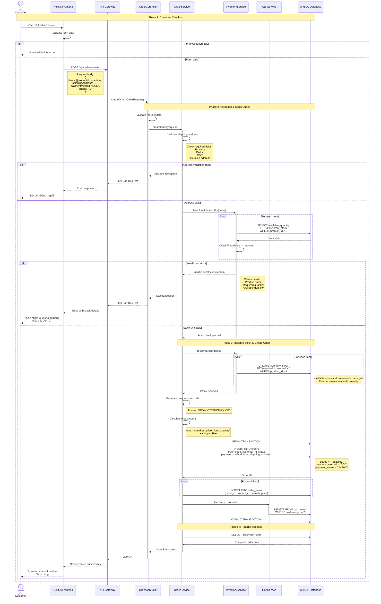
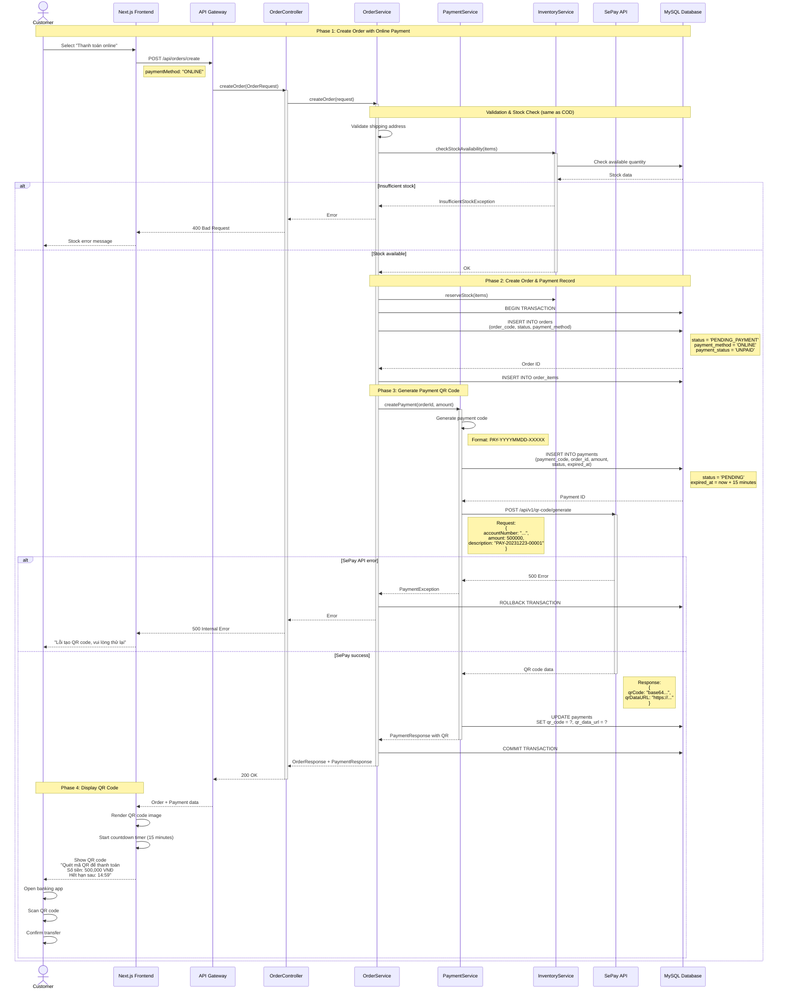
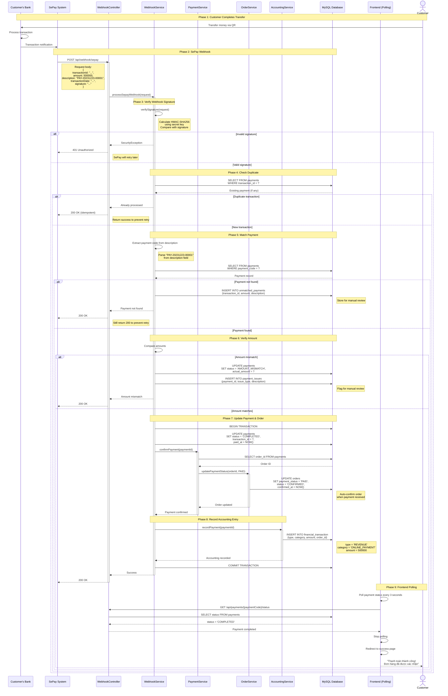
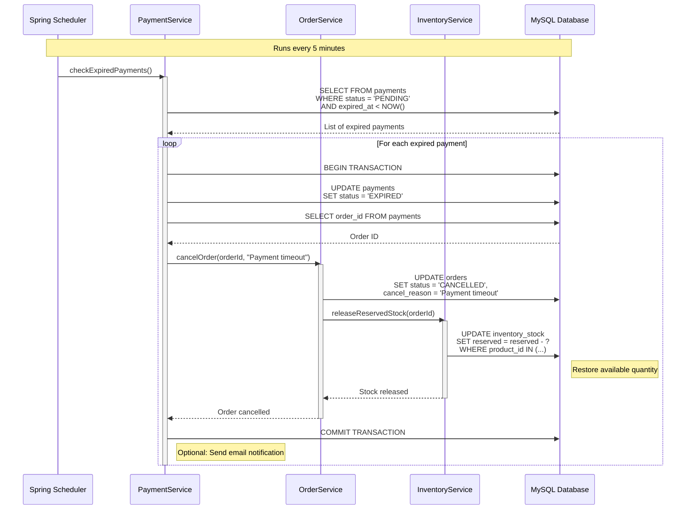
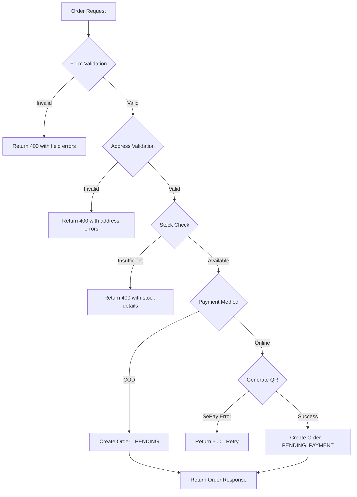

# Sơ Đồ Tuần Tự - Luồng Đặt Hàng (Order Flow)

## Tổng Quan

Tài liệu này mô tả chi tiết các sơ đồ tuần tự (sequence diagrams) cho luồng đặt hàng trong hệ thống TMDT, bao gồm:
- Luồng đặt hàng với thanh toán COD (Cash on Delivery)
- Luồng đặt hàng với thanh toán Online (SePay)
- Xử lý validation và error handling
- Tương tác giữa các components

**Requirements**: 1.1-1.5 (Quản lý đơn hàng), 8.1-8.5 (Thanh toán online)

---

## 1. Luồng Đặt Hàng COD (Cash on Delivery)

### 1.1. Mô Tả

Luồng này xử lý khi khách hàng chọn thanh toán khi nhận hàng (COD). Đơn hàng được tạo với trạng thái PENDING và chờ Sales staff xác nhận.

### 1.2. Các Bước Chính

1. Customer checkout với giỏ hàng
2. Nhập thông tin giao hàng (địa chỉ, số điện thoại)
3. Chọn phương thức thanh toán: COD
4. Hệ thống validate dữ liệu
5. Kiểm tra tồn kho (available quantity)
6. Reserve stock (tăng reserved quantity)
7. Tạo order với status PENDING
8. Trả về order confirmation

### 1.3. Sơ Đồ Tuần Tự



### 1.4. Validation Rules

#### Shipping Address Validation
- **Province**: Required, must exist in province table
- **District**: Required, must exist in district table and belong to selected province
- **Ward**: Required, must exist in ward table and belong to selected district
- **Detailed Address**: Required, min length 10 characters
- **Phone**: Required, format: 10 digits starting with 0

#### Stock Validation
- **Available Quantity**: Must be >= requested quantity for each item
- **Calculation**: available = onHand - reserved - damaged
- **Atomic Check**: All items must pass stock check before creating order

#### Business Rules
- **Order Code**: Unique, auto-generated, format: ORD-YYYYMMDD-XXXXX
- **Status**: New COD orders start with PENDING status
- **Payment Status**: UNPAID for COD orders
- **Stock Reservation**: Reserved quantity increases immediately upon order creation
- **Cart Clearing**: Cart is cleared only after successful order creation

### 1.5. Error Handling

| Error Type | HTTP Code | Error Message | User Action |
|------------|-----------|---------------|-------------|
| Invalid Address | 400 | "Địa chỉ giao hàng không hợp lệ" | Re-enter address |
| Insufficient Stock | 400 | "Sản phẩm X không đủ hàng (Cần: Y, Còn: Z)" | Reduce quantity or remove item |
| Invalid Phone | 400 | "Số điện thoại không hợp lệ" | Re-enter phone number |
| Database Error | 500 | "Lỗi hệ thống, vui lòng thử lại" | Retry or contact support |
| Network Timeout | 504 | "Kết nối timeout, vui lòng thử lại" | Retry |

---

## 2. Luồng Đặt Hàng Online Payment (SePay)

### 2.1. Mô Tả

Luồng này xử lý khi khách hàng chọn thanh toán online qua SePay. Hệ thống tạo đơn hàng với trạng thái PENDING_PAYMENT, generate QR code, và chờ webhook từ SePay để xác nhận thanh toán.

### 2.2. Các Bước Chính

1. Customer checkout và chọn Online Payment
2. Hệ thống tạo order với status PENDING_PAYMENT
3. Generate QR code từ SePay API
4. Customer quét QR và chuyển khoản
5. SePay gửi webhook notification
6. Hệ thống verify webhook và match payment
7. Update order status thành CONFIRMED
8. Ghi nhận bút toán kế toán

### 2.3. Sơ Đồ Tuần Tự - Tạo Đơn và Generate QR



### 2.4. Sơ Đồ Tuần Tự - Xử Lý Webhook SePay



### 2.5. Payment Timeout Handling



### 2.6. Business Rules - Online Payment

#### Payment Expiration
- **Timeout**: 15 minutes from order creation
- **Scheduler**: Runs every 5 minutes to check expired payments
- **Action**: Auto-cancel order and release reserved stock

#### Webhook Security
- **Signature Verification**: HMAC-SHA256 with secret key
- **Idempotency**: Check transaction_id to prevent duplicate processing
- **Response**: Always return 200 OK to prevent unnecessary retries

#### Payment Matching
- **Primary Key**: Payment code in transfer description (e.g., "PAY-20231223-00001")
- **Fallback**: Manual matching by admin if description is incorrect
- **Amount Verification**: Must match exactly, otherwise flag for review

#### Order Status Transition
- **On Payment Success**: PENDING_PAYMENT → CONFIRMED
- **On Payment Timeout**: PENDING_PAYMENT → CANCELLED
- **Stock Release**: Automatic when order is cancelled

---

## 3. Validation và Error Handling

### 3.1. Validation Points



### 3.2. Error Response Format

```json
{
  "success": false,
  "error": {
    "code": "INSUFFICIENT_STOCK",
    "message": "Không đủ hàng để đặt",
    "details": [
      {
        "productId": 123,
        "productName": "iPhone 15 Pro Max",
        "required": 5,
        "available": 2
      }
    ]
  },
  "timestamp": "2023-12-23T10:30:00Z"
}
```

### 3.3. Retry Strategy

| Scenario | Retry | Strategy |
|----------|-------|----------|
| Stock check fails | Yes | Immediate retry (user action) |
| SePay QR generation fails | Yes | Exponential backoff (3 attempts) |
| Webhook processing fails | Yes | SePay auto-retry (5 times, 5 min interval) |
| Database timeout | Yes | Spring @Retryable (3 attempts) |
| Payment timeout | No | Auto-cancel after 15 minutes |

---

## 4. Performance Considerations

### 4.1. Database Optimization

- **Indexes**: 
  - `orders(order_code)` - UNIQUE index for fast lookup
  - `orders(customer_id, status)` - Composite index for customer order list
  - `payments(payment_code)` - UNIQUE index for webhook matching
  - `inventory_stock(product_id)` - Index for stock checks

- **Transaction Isolation**: 
  - Use `READ_COMMITTED` for order creation
  - Use `SERIALIZABLE` for stock reservation to prevent race conditions

### 4.2. Concurrency Handling

```sql
-- Pessimistic locking for stock reservation
SELECT * FROM inventory_stock 
WHERE product_id = ? 
FOR UPDATE;

UPDATE inventory_stock 
SET reserved = reserved + ? 
WHERE product_id = ?;
```

### 4.3. Caching Strategy (Future Enhancement)

- Cache product information (price, name) for 5 minutes
- Cache province/district/ward data (rarely changes)
- Do NOT cache inventory stock (real-time data)

---

## 5. Monitoring và Logging

### 5.1. Key Metrics

- **Order Creation Rate**: Orders per minute
- **Payment Success Rate**: Successful payments / Total payments
- **Stock Check Latency**: Average time for stock validation
- **Webhook Processing Time**: Time from webhook receipt to order update

### 5.2. Log Events

```java
// Order creation
log.info("Order created: orderCode={}, customerId={}, total={}, paymentMethod={}", 
    orderCode, customerId, total, paymentMethod);

// Stock reservation
log.info("Stock reserved: productId={}, quantity={}, remainingAvailable={}", 
    productId, quantity, remainingAvailable);

// Payment webhook
log.info("Payment webhook received: transactionId={}, amount={}, paymentCode={}", 
    transactionId, amount, paymentCode);

// Payment matched
log.info("Payment matched: paymentCode={}, orderId={}, status={}", 
    paymentCode, orderId, newStatus);

// Error cases
log.error("Insufficient stock: productId={}, required={}, available={}", 
    productId, required, available);
log.error("Payment amount mismatch: expected={}, actual={}, paymentCode={}", 
    expected, actual, paymentCode);
```

---

## 6. Kết Luận

### 6.1. Điểm Mạnh

1. **Validation Toàn Diện**: Kiểm tra dữ liệu ở nhiều tầng (frontend, backend, database)
2. **Stock Management**: Reserve stock ngay khi tạo đơn để tránh overselling
3. **Payment Security**: Webhook signature verification, idempotency check
4. **Error Handling**: Chi tiết, user-friendly error messages
5. **Transaction Safety**: ACID compliance với database transactions

### 6.2. Trade-offs

1. **Stock Reservation**: Reserved stock có thể bị "lock" nếu customer không thanh toán
   - **Mitigation**: Auto-cancel sau 15 phút cho online payment
   
2. **Webhook Dependency**: Phụ thuộc vào SePay webhook cho payment confirmation
   - **Mitigation**: Polling mechanism trên frontend, manual matching option

3. **Database Load**: Multiple queries cho stock check và validation
   - **Mitigation**: Indexes, connection pooling, future caching

### 6.3. Future Improvements

1. **Async Processing**: Use message queue (RabbitMQ/Kafka) for webhook processing
2. **Caching**: Redis cache for product data and address data
3. **Rate Limiting**: Prevent abuse of order creation endpoint
4. **Notification**: Email/SMS notification for order status changes
5. **Analytics**: Real-time dashboard for order metrics

---

**Document Version**: 1.0  
**Last Updated**: 2023-12-23  
**Author**: System Analysis Team
