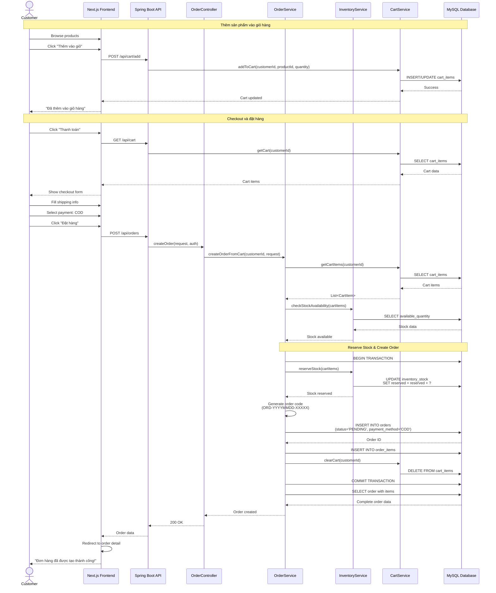
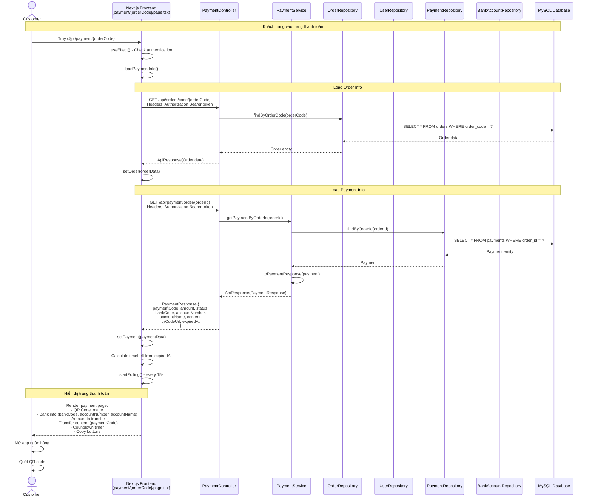
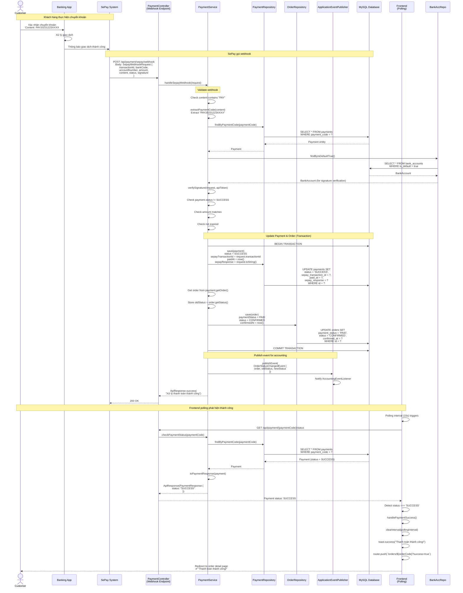

# Sơ Đồ Tuần Tự - Luồng Đặt Hàng và Thanh Toán

## Tổng Quan

Tài liệu này mô tả các sơ đồ tuần tự (sequence diagrams) cho luồng đặt hàng và thanh toán trong hệ thống TMDT:
- Luồng đặt hàng với thanh toán COD (Cash on Delivery)
- Luồng đặt hàng với thanh toán Online (SePay)
- Xử lý webhook từ SePay

**Requirements**: 
- 1.1-1.5 (Quản lý đơn hàng)
- 8.1-8.5 (Thanh toán online SePay)
- 9.1-9.3 (Tích hợp kế toán tự động)

---

## 1. Luồng Đặt Hàng COD (Cash on Delivery)

### 1.1. Sơ Đồ Tuần Tự



---

## 2. Luồng Thanh Toán Online (SePay) - Happy Path

### 2.1. Sơ Đồ Tuần Tự - Tạo Payment và Hiển thị QR Code



### 2.2. Sơ Đồ Tuần Tự - Xử Lý Webhook và Cập Nhật Trạng Thái



---

## 3. Key Components

### 3.1. Frontend Components

**PaymentPage** (`src/frontend/app/payment/[orderCode]/page.tsx`)
- Load order và payment info khi mount
- Hiển thị QR code và thông tin ngân hàng
- Countdown timer (15 phút)
- Polling payment status mỗi 15 giây
- Auto-redirect khi thanh toán thành công
- Nút hủy đơn hàng

### 3.2. Backend Components

**PaymentController** (`PaymentController.java`)
- `POST /api/payment/create` - Tạo payment mới (Customer/Admin)
- `GET /api/payment/{paymentCode}` - Lấy thông tin payment
- `GET /api/payment/order/{orderId}` - Lấy payment theo orderId
- `GET /api/payment/{paymentCode}/status` - Check trạng thái (Public)
- `POST /api/payment/sepay/webhook` - Webhook từ SePay (Public)
- `GET/POST /api/payment/test-webhook/{paymentCode}` - Test webhook (Dev)

**PaymentService** (`PaymentServiceImpl.java`)
- `createPayment()` - Tạo payment, generate QR code
- `getPaymentByCode()` - Lấy payment theo code
- `getPaymentByOrderId()` - Lấy payment theo orderId
- `handleSepayWebhook()` - Xử lý webhook, update payment & order
- `checkPaymentStatus()` - Check và auto-expire nếu hết hạn
- `expireOldPayments()` - Cron job expire payments cũ

### 3.3. DTOs

**CreatePaymentRequest**
```java
{
  orderId: Long,
  amount: Double,
  returnUrl: String (optional)
}
```

**PaymentResponse**
```java
{
  paymentId: Long,
  paymentCode: String,
  amount: Double,
  status: String,
  bankCode: String,
  accountNumber: String,
  accountName: String,
  content: String,
  qrCodeUrl: String,
  expiredAt: String,
  message: String
}
```

**SepayWebhookRequest**
```java
{
  transactionId: String,
  bankCode: String,
  accountNumber: String,
  amount: Double,
  content: String,
  transactionDate: String,
  status: String,
  signature: String
}
```

### 3.4. Entities

**Payment** (`Payment.java`)
- id, paymentCode (unique)
- order (OneToOne), user (ManyToOne)
- amount, method (SEPAY), status (PENDING/SUCCESS/EXPIRED/FAILED)
- sepayTransactionId, sepayBankCode, sepayAccountNumber, sepayAccountName
- sepayContent, sepayQrCode, sepayResponse
- createdAt, paidAt, expiredAt (15 phút), failureReason

**PaymentStatus** (Enum)
- PENDING - Chờ thanh toán
- SUCCESS - Thanh toán thành công
- EXPIRED - Hết hạn
- FAILED - Thất bại

**PaymentMethod** (Enum)
- SEPAY - Thanh toán qua SePay

---

## 4. Database Schema

### 4.1. Key Tables

**orders**
- order_id (PK)
- order_code (UNIQUE)
- customer_id (FK)
- payment_id (FK to payments)
- status (PENDING, PENDING_PAYMENT, CONFIRMED, ...)
- payment_method (COD, ONLINE)
- payment_status (UNPAID, PAID, PENDING)
- total
- shipping_address
- confirmed_at
- created_at

**order_items**
- order_item_id (PK)
- order_id (FK)
- product_id (FK)
- quantity
- price

**payments**
- id (PK)
- payment_code (UNIQUE) - Format: PAY20231223XXXX
- order_id (FK to orders)
- user_id (FK to users)
- amount
- method (SEPAY)
- status (PENDING, SUCCESS, EXPIRED, FAILED)
- sepay_transaction_id
- sepay_bank_code
- sepay_account_number
- sepay_account_name
- sepay_content
- sepay_qr_code (URL)
- sepay_response (TEXT)
- created_at
- paid_at
- expired_at (created_at + 15 minutes)
- failure_reason

**bank_accounts**
- id (PK)
- bank_code
- account_number
- account_name
- sepay_api_token
- is_default (boolean)

**inventory_stock**
- stock_id (PK)
- product_id (FK)
- on_hand
- reserved
- damaged
- available (computed: on_hand - reserved - damaged)

**financial_transactions**
- transaction_id (PK)
- order_id (FK)
- type (REVENUE, EXPENSE)
- category (ONLINE_PAYMENT, COD_PAYMENT, ...)
- amount
- transaction_date

---

## 5. Business Rules

### 5.1. Payment Flow
- **Payment Creation**: Tạo payment khi order đã tồn tại (không tạo cùng lúc với order)
- **Payment Code**: Format PAY + YYYYMMDD + 4 số random (e.g., PAY202312230001)
- **QR Code**: Generate bằng VietQR API với template 'qr_only'
- **Expiration**: Payment hết hạn sau 15 phút kể từ lúc tạo
- **Bank Account**: Lấy từ bank_accounts table (is_default = true), fallback về config

### 5.2. Order Status Transitions
- **COD Orders**: PENDING → CONFIRMED (manual) → PREPARING → READY_TO_SHIP → SHIPPING → DELIVERED
- **Online Payment Orders**: 
  - PENDING_PAYMENT (chờ thanh toán)
  - → CONFIRMED (auto sau khi thanh toán thành công)
  - → PREPARING → READY_TO_SHIP → SHIPPING → DELIVERED
- **Payment Expired**: PENDING_PAYMENT → CANCELLED (auto)

### 5.3. Payment Status
- **PENDING**: Chờ khách hàng chuyển khoản
- **SUCCESS**: Webhook xác nhận thanh toán thành công
- **EXPIRED**: Quá 15 phút chưa thanh toán
- **FAILED**: Lỗi trong quá trình xử lý

### 5.4. Webhook Processing
- **Content Matching**: Extract payment code từ transfer content (có thể có text thêm)
- **Signature Verification**: Verify với sepay_api_token từ bank_accounts
- **Amount Validation**: So sánh amount từ webhook với payment.amount
- **Idempotency**: Check payment.status != SUCCESS để tránh xử lý trùng
- **Response**: Luôn return 200 OK cho SePay

### 5.5. Frontend Polling
- **Interval**: 15 giây (tối ưu để giảm tải server)
- **Max Attempts**: 40 lần (10 phút)
- **Primary Method**: Webhook là chính, polling chỉ là fallback
- **Auto-redirect**: Khi detect status = SUCCESS

### 5.6. Accounting Integration
- **Trigger**: Publish OrderStatusChangedEvent khi order chuyển sang CONFIRMED
- **Listener**: AccountingEventListener tự động tạo financial_transaction
- **Type**: REVENUE
- **Category**: ONLINE_PAYMENT

---

## 6. API Endpoints

### 6.1. Order APIs

```
POST   /api/orders              - Create order from cart
GET    /api/orders              - Get customer's orders
GET    /api/orders/{orderId}    - Get order detail
GET    /api/orders/code/{code}  - Get order by code
PUT    /api/orders/{orderId}/cancel - Cancel order
```

### 6.2. Payment APIs

```
POST   /api/payment/create                    - Create payment (Customer/Admin)
GET    /api/payment/{paymentCode}             - Get payment info (Customer/Admin)
GET    /api/payment/order/{orderId}           - Get payment by orderId (Customer/Admin)
GET    /api/payment/{paymentCode}/status      - Check payment status (Public)
GET    /api/payment/my-payments               - Get user's payments (Customer/Admin)
POST   /api/payment/sepay/webhook             - SePay webhook (Public)
GET/POST /api/payment/test-webhook/{paymentCode} - Test webhook (Dev)
POST   /api/payment/admin/expire-old-payments - Manual expire (Admin)
```

### 6.3. Cart APIs

```
POST   /api/cart/add            - Add item to cart
GET    /api/cart                - Get cart items
DELETE /api/cart/item/{itemId}  - Remove item from cart
```

---

**Document Version**: 3.0  
**Last Updated**: 2024-12-25  
**Author**: System Analysis Team
