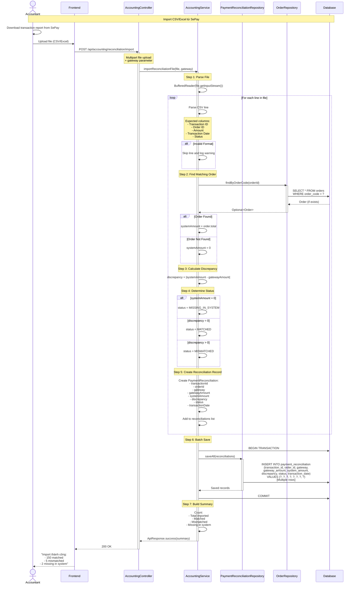
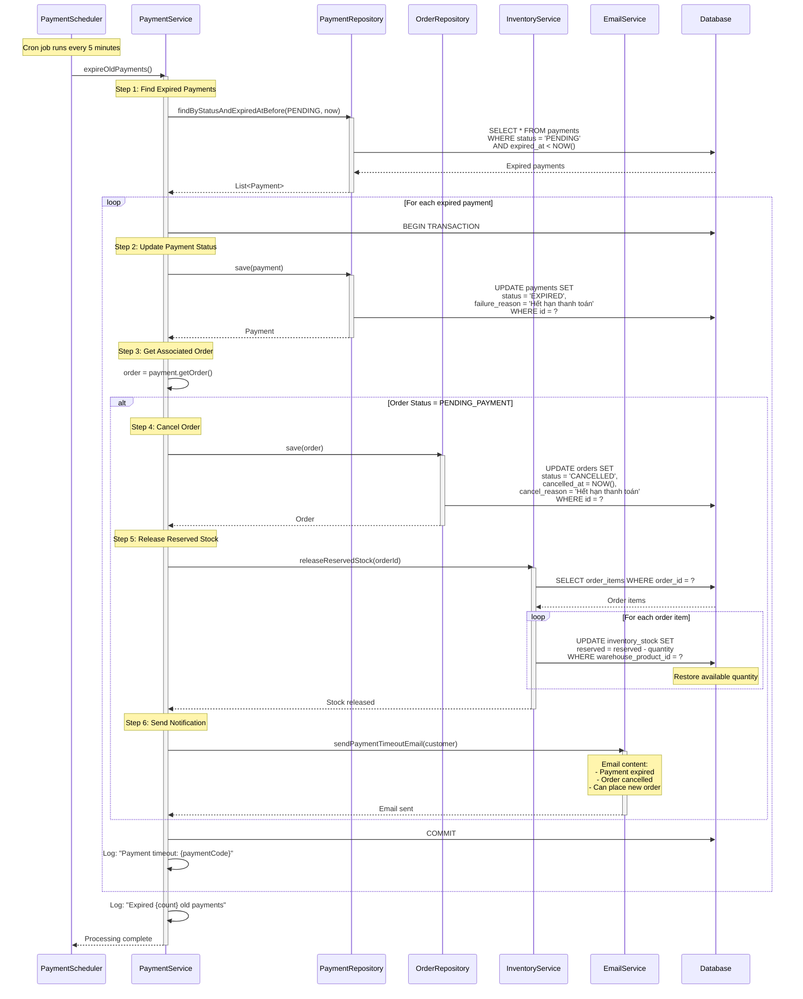
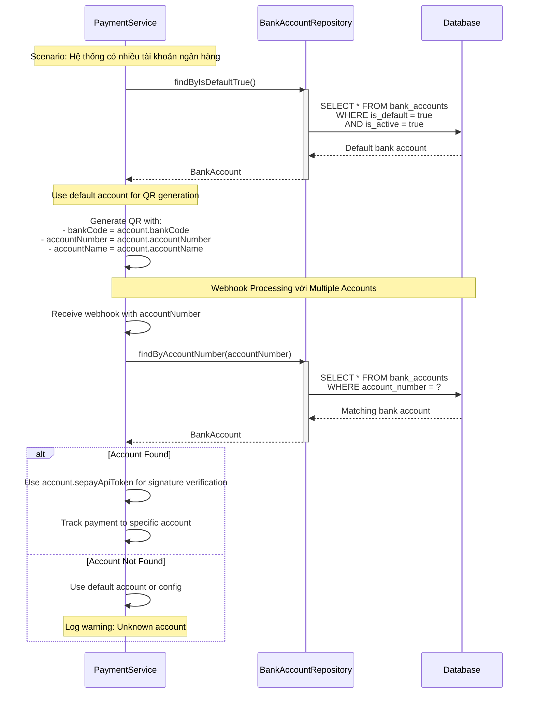

# Sơ Đồ Tuần Tự - Luồng Thanh Toán (Payment Flow)

## Tổng Quan

Tài liệu này mô tả chi tiết luồng thanh toán trong hệ thống TMDT, bao gồm:
- Luồng tạo thanh toán SePay
- Luồng xử lý webhook từ SePay
- Luồng đối soát thanh toán (Payment Reconciliation)
- Các kịch bản ngoại lệ và xử lý lỗi

## Yêu Cầu Liên Quan

- **Requirements 8.1-8.5**: Thanh Toán Online SePay
- **Requirements 14.1-14.5**: Multi-Account Banking

---

## 1. Sơ Đồ Tổng Quan - Luồng Thanh Toán SePay

### 1.1. Sơ Đồ Tổng Quan - Customer Payment Flow

```mermaid
sequenceDiagram
    actor Customer
    participant UI as Frontend
    participant PaymentCtrl as PaymentController
    participant PaymentSvc as PaymentService
    participant OrderRepo as OrderRepository
    participant PaymentRepo as PaymentRepository
    participant BankRepo as BankAccountRepository
    participant SePay as SePay API
    participant DB as Database
    
    Note over Customer,DB: Phase 1: Tạo Thanh Toán
    
    Customer->>UI: Chọn thanh toán online
    UI->>PaymentCtrl: POST /api/payment/create
    activate PaymentCtrl
    
    PaymentCtrl->>PaymentSvc: createPayment(request, userId)
    activate PaymentSvc
    
    Note over PaymentSvc: Step 1: Validate Order
    PaymentSvc->>OrderRepo: findById(orderId)
    activate OrderRepo
    OrderRepo->>DB: SELECT * FROM orders WHERE id = ?
    DB-->>OrderRepo: Order data
    OrderRepo-->>PaymentSvc: Order
    deactivate OrderRepo
    
    alt Order Not Found
        PaymentSvc-->>PaymentCtrl: RuntimeException<br/>"Không tìm thấy đơn hàng"
        PaymentCtrl-->>UI: 500 Internal Server Error
        UI-->>Customer: "Lỗi: Không tìm thấy đơn hàng"
    end
    
    Note over PaymentSvc: Step 2: Verify Ownership
    PaymentSvc->>PaymentSvc: Check customer.user.id == userId
    
    alt Not Owner
        PaymentSvc-->>PaymentCtrl: Error Response<br/>"Không có quyền thanh toán"
        PaymentCtrl-->>UI: 403 Forbidden
        UI-->>Customer: "Bạn không có quyền thanh toán đơn hàng này"
    end
    
    Note over PaymentSvc: Step 3: Check Duplicate Payment
    PaymentSvc->>PaymentRepo: findByOrderId(orderId)
    activate PaymentRepo
    PaymentRepo->>DB: SELECT * FROM payments WHERE order_id = ?
    DB-->>PaymentRepo: Payment (if exists)
    PaymentRepo-->>PaymentSvc: Optional<Payment>
    deactivate PaymentRepo
    
    alt Payment Already Exists
        PaymentSvc-->>PaymentCtrl: Error Response<br/>"Đơn hàng đã có thanh toán"
        PaymentCtrl-->>UI: 400 Bad Request
        UI-->>Customer: "Đơn hàng này đã có thanh toán"
    end
    
    Note over PaymentSvc: Step 4: Validate Amount
    PaymentSvc->>PaymentSvc: Check request.amount == order.total
    
    alt Amount Mismatch
        PaymentSvc-->>PaymentCtrl: Error Response<br/>"Số tiền không khớp"
        PaymentCtrl-->>UI: 400 Bad Request
        UI-->>Customer: "Số tiền thanh toán không khớp với đơn hàng"
    end
    
    Note over PaymentSvc: Step 5: Generate Payment Code
    PaymentSvc->>PaymentSvc: generatePaymentCode()
    Note over PaymentSvc: Format: PAY + YYYYMMDD + 4 random digits<br/>Example: PAY202312250123
    
    PaymentSvc->>PaymentRepo: existsByPaymentCode(code)
    PaymentRepo->>DB: SELECT COUNT(*) FROM payments WHERE payment_code = ?
    DB-->>PaymentRepo: Count
    PaymentRepo-->>PaymentSvc: Boolean
    
    alt Code Already Exists
        PaymentSvc->>PaymentSvc: generatePaymentCode() (retry)
    end
    
    Note over PaymentSvc: Step 6: Get Bank Account
    PaymentSvc->>BankRepo: findByIsDefaultTrue()
    activate BankRepo
    BankRepo->>DB: SELECT * FROM bank_accounts WHERE is_default = true
    DB-->>BankRepo: BankAccount (if exists)
    BankRepo-->>PaymentSvc: Optional<BankAccount>
    deactivate BankRepo
    
    alt No Default Bank Account
        PaymentSvc->>PaymentSvc: Use config values<br/>(sepayBankCode, sepayAccountNumber)
    end
    
    Note over PaymentSvc: Step 7: Generate QR Code
    PaymentSvc->>PaymentSvc: generateSepayQrCode()
    Note over PaymentSvc: VietQR Format:<br/>https://img.vietqr.io/image/{bank}-{account}-qr_only.jpg<br/>?amount={amount}&addInfo={paymentCode}
    
    Note over PaymentSvc: Step 8: Create Payment Record
    PaymentSvc->>DB: BEGIN TRANSACTION
    
    PaymentSvc->>PaymentRepo: save(payment)
    activate PaymentRepo
    PaymentRepo->>DB: INSERT INTO payments<br/>(payment_code, order_id, user_id, amount,<br/>method=SEPAY, status=PENDING,<br/>sepay_bank_code, sepay_account_number,<br/>sepay_qr_code, expired_at=now+15min)
    DB-->>PaymentRepo: Payment ID
    PaymentRepo-->>PaymentSvc: Payment
    deactivate PaymentRepo
    
    Note over PaymentSvc: Step 9: Update Order
    PaymentSvc->>OrderRepo: save(order)
    activate OrderRepo
    OrderRepo->>DB: UPDATE orders<br/>SET payment_id = ?, payment_status = 'PENDING'<br/>WHERE id = ?
    OrderRepo-->>PaymentSvc: Order
    deactivate OrderRepo
    
    PaymentSvc->>DB: COMMIT
    
    Note over PaymentSvc: Step 10: Build Response
    PaymentSvc->>PaymentSvc: toPaymentResponse(payment)
    
    PaymentSvc-->>PaymentCtrl: ApiResponse.success(PaymentResponse)
    deactivate PaymentSvc
    
    PaymentCtrl-->>UI: 200 OK<br/>{paymentId, paymentCode, qrCodeUrl, ...}
    deactivate PaymentCtrl
    
    UI->>UI: Display QR Code
    UI-->>Customer: Hiển thị mã QR và thông tin chuyển khoản
    
    Note over Customer,SePay: Phase 2: Customer Thực Hiện Chuyển Khoản
    
    Customer->>Customer: Mở app ngân hàng
    Customer->>Customer: Quét mã QR hoặc nhập thông tin
    Customer->>SePay: Chuyển khoản với nội dung: PAY202312250123
    
    Note over SePay: SePay nhận tiền và xử lý
    
    Note over Customer,DB: Phase 3: Frontend Polling Status
    
    loop Every 3 seconds (max 5 minutes)
        UI->>PaymentCtrl: GET /api/payment/{paymentCode}/status
        activate PaymentCtrl
        
        PaymentCtrl->>PaymentSvc: checkPaymentStatus(paymentCode)
        activate PaymentSvc
        
        PaymentSvc->>PaymentRepo: findByPaymentCode(paymentCode)
        PaymentRepo->>DB: SELECT * FROM payments WHERE payment_code = ?
        DB-->>PaymentRepo: Payment
        PaymentRepo-->>PaymentSvc: Payment
        
        alt Payment Expired
            PaymentSvc->>PaymentSvc: Check now > expiredAt
            PaymentSvc->>PaymentRepo: save(payment with status=EXPIRED)
            PaymentRepo->>DB: UPDATE payments SET status = 'EXPIRED'
        end
        
        PaymentSvc-->>PaymentCtrl: ApiResponse(PaymentResponse)
        deactivate PaymentSvc
        
        PaymentCtrl-->>UI: 200 OK {status: "PENDING"}
        deactivate PaymentCtrl
        
        UI->>UI: Check status
        
        alt Status = SUCCESS
            UI-->>Customer: "Thanh toán thành công!"
            UI->>UI: Redirect to success page
        else Status = EXPIRED
            UI-->>Customer: "Thanh toán đã hết hạn"
        else Status = PENDING
            UI->>UI: Continue polling
        end
    end
```

---

## 2. Sơ Đồ Chi Tiết - SePay Webhook Processing

### 2.1. Luồng Xử Lý Webhook Từ SePay

```mermaid
sequenceDiagram
    participant SePay as SePay System
    participant WebhookCtrl as PaymentController
    participant PaymentSvc as PaymentService
    participant PaymentRepo as PaymentRepository
    participant BankRepo as BankAccountRepository
    participant OrderRepo as OrderRepository
    participant EventPub as ApplicationEventPublisher
    participant AcctListener as OrderEventListener
    participant AcctSvc as AccountingService
    participant DB as Database
    
    Note over SePay,DB: Webhook Trigger: Customer đã chuyển khoản thành công
    
    SePay->>WebhookCtrl: POST /api/payment/sepay/webhook
    activate WebhookCtrl
    Note over WebhookCtrl: Request Body:<br/>{<br/>  content: "PAY202312250123",<br/>  amount: 500000,<br/>  transactionId: "TXN123456",<br/>  accountNumber: "1234567890",<br/>  bankCode: "VCB",<br/>  status: "SUCCESS"<br/>}
    
    WebhookCtrl->>PaymentSvc: handleSepayWebhook(request)
    activate PaymentSvc
    
    Note over PaymentSvc: Step 1: Quick Validation
    PaymentSvc->>PaymentSvc: Check content contains "PAY"
    
    alt Content Invalid
        PaymentSvc-->>WebhookCtrl: Error Response<br/>"Nội dung không chứa mã thanh toán"
        WebhookCtrl-->>SePay: 400 Bad Request
        Note over SePay: SePay sẽ retry sau 5 phút
    end
    
    Note over PaymentSvc: Step 2: Extract Payment Code
    PaymentSvc->>PaymentSvc: extractPaymentCode(content)
    Note over PaymentSvc: Handle cases:<br/>- "PAY202312250123"<br/>- "PAY202312250123 FT2533..."<br/>Extract first PAY + 12 digits
    
    Note over PaymentSvc: Step 3: Find Payment
    PaymentSvc->>PaymentRepo: findByPaymentCode(paymentCode)
    activate PaymentRepo
    PaymentRepo->>DB: SELECT * FROM payments<br/>WHERE payment_code = ?
    DB-->>PaymentRepo: Payment
    PaymentRepo-->>PaymentSvc: Payment
    deactivate PaymentRepo
    
    alt Payment Not Found
        PaymentSvc-->>WebhookCtrl: RuntimeException<br/>"Không tìm thấy thanh toán"
        WebhookCtrl-->>SePay: 404 Not Found
    end
    
    Note over PaymentSvc: Step 4: Get Bank Account & Verify Signature
    PaymentSvc->>BankRepo: findByIsDefaultTrue()
    activate BankRepo
    BankRepo->>DB: SELECT * FROM bank_accounts<br/>WHERE is_default = true
    DB-->>BankRepo: BankAccount
    BankRepo-->>PaymentSvc: BankAccount
    deactivate BankRepo
    
    alt Has API Token
        PaymentSvc->>PaymentSvc: verifySignature(request, apiToken)
        Note over PaymentSvc: Calculate signature:<br/>SHA256(transactionId + amount + content + apiToken)
        
        alt Signature Invalid
            PaymentSvc-->>WebhookCtrl: Error Response<br/>"Chữ ký không hợp lệ"
            WebhookCtrl-->>SePay: 401 Unauthorized
        end
    else No API Token
        Note over PaymentSvc: Skip signature verification<br/>(Development mode)
    end
    
    Note over PaymentSvc: Step 5: Check Already Processed
    PaymentSvc->>PaymentSvc: Check payment.status == SUCCESS
    
    alt Already Processed
        PaymentSvc-->>WebhookCtrl: Success Response<br/>"Thanh toán đã được xử lý"
        WebhookCtrl-->>SePay: 200 OK
        Note over SePay: Idempotency: Webhook có thể gọi nhiều lần
    end
    
    Note over PaymentSvc: Step 6: Validate Amount
    PaymentSvc->>PaymentSvc: Check payment.amount == request.amount
    
    alt Amount Mismatch
        PaymentSvc-->>WebhookCtrl: Error Response<br/>"Số tiền không khớp"
        WebhookCtrl-->>SePay: 400 Bad Request
        Note over PaymentSvc: Log error for manual review
    end
    
    Note over PaymentSvc: Step 7: Check Expiration
    PaymentSvc->>PaymentSvc: Check now > payment.expiredAt
    
    alt Payment Expired
        PaymentSvc->>PaymentRepo: save(payment)
        PaymentRepo->>DB: UPDATE payments<br/>SET status = 'EXPIRED',<br/>failure_reason = 'Thanh toán đã hết hạn'
        
        PaymentSvc-->>WebhookCtrl: Error Response<br/>"Thanh toán đã hết hạn"
        WebhookCtrl-->>SePay: 400 Bad Request
    end
    
    Note over PaymentSvc,DB: Step 8: Update Payment (Transaction)
    PaymentSvc->>DB: BEGIN TRANSACTION
    
    PaymentSvc->>PaymentRepo: save(payment)
    activate PaymentRepo
    PaymentRepo->>DB: UPDATE payments SET<br/>status = 'SUCCESS',<br/>sepay_transaction_id = ?,<br/>paid_at = NOW(),<br/>sepay_response = ?<br/>WHERE id = ?
    PaymentRepo-->>PaymentSvc: Payment
    deactivate PaymentRepo
    
    Note over PaymentSvc: Step 9: Update Order Status
    PaymentSvc->>OrderRepo: findById(payment.order.id)
    activate OrderRepo
    OrderRepo->>DB: SELECT * FROM orders WHERE id = ?
    DB-->>OrderRepo: Order
    OrderRepo-->>PaymentSvc: Order
    deactivate OrderRepo
    
    PaymentSvc->>PaymentSvc: Store oldStatus = order.status
    
    PaymentSvc->>OrderRepo: save(order)
    activate OrderRepo
    OrderRepo->>DB: UPDATE orders SET<br/>payment_status = 'PAID',<br/>status = 'CONFIRMED',<br/>confirmed_at = NOW()<br/>WHERE id = ?
    Note over DB: Status transition:<br/>PENDING_PAYMENT → CONFIRMED
    OrderRepo-->>PaymentSvc: Order
    deactivate OrderRepo
    
    PaymentSvc->>DB: COMMIT
    
    Note over PaymentSvc,AcctSvc: Step 10: Publish Event for Accounting
    PaymentSvc->>EventPub: publishEvent(OrderStatusChangedEvent)
    activate EventPub
    Note over EventPub: Event contains:<br/>- order<br/>- oldStatus: PENDING_PAYMENT<br/>- newStatus: CONFIRMED
    
    EventPub->>AcctListener: onOrderStatusChanged(event)
    activate AcctListener
    
    AcctListener->>AcctListener: Check if newStatus == DELIVERED
    
    alt Status = DELIVERED
        AcctListener->>AcctSvc: recordRevenue(order)
        activate AcctSvc
        
        AcctSvc->>DB: INSERT INTO financial_transaction<br/>(type='REVENUE', category='SALES',<br/>amount=order.total, order_id=order.id)
        
        AcctSvc-->>AcctListener: Success
        deactivate AcctSvc
    else Status != DELIVERED
        Note over AcctListener: Skip revenue recording<br/>(Only record when delivered)
    end
    
    AcctListener-->>EventPub: Event Processed
    deactivate AcctListener
    
    EventPub-->>PaymentSvc: Event Published
    deactivate EventPub
    
    alt Event Publishing Failed
        Note over PaymentSvc: Log error but don't fail payment<br/>Accounting can be corrected manually
    end
    
    PaymentSvc-->>WebhookCtrl: ApiResponse.success()<br/>"Xử lý thanh toán thành công"
    deactivate PaymentSvc
    
    WebhookCtrl-->>SePay: 200 OK
    deactivate WebhookCtrl
    
    Note over SePay: SePay marks webhook as delivered
```

---

## 3. Sơ Đồ Chi Tiết - Payment Reconciliation (Đối Soát Thanh Toán)

### 3.1. Luồng Đối Soát Thanh Toán

```mermaid
sequenceDiagram
    actor Accountant
    participant UI as Frontend
    participant AcctCtrl as AccountingController
    participant AcctSvc as AccountingService
    participant ReconRepo as PaymentReconciliationRepository
    participant OrderRepo as OrderRepository
    participant DB as Database
    
    Note over Accountant,DB: Phase 1: Request Reconciliation Report
    
    Accountant->>UI: Chọn khoảng thời gian đối soát
    Accountant->>UI: Chọn cổng thanh toán (SePay/ALL)
    
    UI->>AcctCtrl: POST /api/accounting/reconciliation
    activate AcctCtrl
    Note over AcctCtrl: Request Body:<br/>{<br/>  startDate: "2023-12-01",<br/>  endDate: "2023-12-31",<br/>  gateway: "SEPAY"<br/>}
    
    AcctCtrl->>AcctSvc: getPaymentReconciliation(request)
    activate AcctSvc
    
    Note over AcctSvc: Step 1: Convert Date Range
    AcctSvc->>AcctSvc: startDateTime = startDate.atStartOfDay()
    AcctSvc->>AcctSvc: endDateTime = endDate.atTime(23:59:59)
    
    Note over AcctSvc: Step 2: Get Reconciliation Data from Gateway
    
    alt Gateway = "ALL"
        AcctSvc->>ReconRepo: findByTransactionDateBetween(start, end)
    else Specific Gateway
        AcctSvc->>ReconRepo: findByGatewayAndTransactionDateBetween(gateway, start, end)
    end
    
    activate ReconRepo
    ReconRepo->>DB: SELECT * FROM payment_reconciliation<br/>WHERE transaction_date BETWEEN ? AND ?<br/>[AND gateway = ?]
    DB-->>ReconRepo: Reconciliation records
    ReconRepo-->>AcctSvc: List<PaymentReconciliation>
    deactivate ReconRepo
    
    Note over AcctSvc: Step 3: Build Reconciliation Map
    AcctSvc->>AcctSvc: Create Map<orderId, PaymentReconciliation>
    
    Note over AcctSvc: Step 4: Get Orders from System
    AcctSvc->>OrderRepo: findByCreatedAtBetween(start, end)
    activate OrderRepo
    OrderRepo->>DB: SELECT * FROM orders<br/>WHERE created_at BETWEEN ? AND ?<br/>AND payment_method = 'ONLINE'<br/>AND payment_status = 'PAID'
    DB-->>OrderRepo: Orders
    OrderRepo-->>AcctSvc: List<Order>
    deactivate OrderRepo
    
    Note over AcctSvc: Step 5: Match Orders with Gateway Data
    
    loop For each order
        AcctSvc->>AcctSvc: Get reconciliation = map.get(order.orderCode)
        
        alt Has Gateway Data (Matched)
            AcctSvc->>AcctSvc: Build item with:<br/>- orderId<br/>- orderCode<br/>- systemAmount = order.total<br/>- gatewayAmount = reconciliation.gatewayAmount<br/>- transactionId = reconciliation.transactionId<br/>- gateway = reconciliation.gateway<br/>- discrepancy = |systemAmount - gatewayAmount|<br/>- status = reconciliation.status
            
            Note over AcctSvc: Check if amounts match
            AcctSvc->>AcctSvc: Calculate discrepancy
            
            alt Amounts Match (discrepancy = 0)
                AcctSvc->>ReconRepo: save(reconciliation)
                ReconRepo->>DB: UPDATE payment_reconciliation<br/>SET status = 'MATCHED',<br/>discrepancy = 0
            else Amounts Mismatch
                AcctSvc->>ReconRepo: save(reconciliation)
                ReconRepo->>DB: UPDATE payment_reconciliation<br/>SET status = 'MISMATCHED',<br/>discrepancy = ?
            end
            
        else No Gateway Data (Missing)
            AcctSvc->>AcctSvc: Build item with:<br/>- orderId<br/>- orderCode<br/>- systemAmount = order.total<br/>- gatewayAmount = null<br/>- status = "MISSING_IN_GATEWAY"
            
            Note over AcctSvc: Order exists in system<br/>but no payment record from gateway
        end
        
        AcctSvc->>AcctSvc: Add item to results list
    end
    
    Note over AcctSvc: Step 6: Calculate Summary Statistics
    AcctSvc->>AcctSvc: totalOrders = results.size()
    AcctSvc->>AcctSvc: matchedCount = count(status == MATCHED)
    AcctSvc->>AcctSvc: mismatchedCount = count(status == MISMATCHED)
    AcctSvc->>AcctSvc: missingCount = count(status == MISSING_IN_GATEWAY)
    AcctSvc->>AcctSvc: totalDiscrepancy = sum(discrepancy)
    
    Note over AcctSvc: Step 7: Build Response
    AcctSvc->>AcctSvc: Create response with:<br/>- summary statistics<br/>- detailed reconciliation items<br/>- date range<br/>- gateway filter
    
    AcctSvc-->>AcctCtrl: ApiResponse.success(reconciliationData)
    deactivate AcctSvc
    
    AcctCtrl-->>UI: 200 OK
    deactivate AcctCtrl
    
    UI->>UI: Display reconciliation report
    UI-->>Accountant: Show:<br/>- Matched transactions (green)<br/>- Mismatched transactions (yellow)<br/>- Missing transactions (red)<br/>- Summary statistics
    
    Note over Accountant,UI: Phase 2: Review and Action
    
    alt Has Mismatched Transactions
        Accountant->>UI: Click on mismatched transaction
        UI->>UI: Show details:<br/>- System amount<br/>- Gateway amount<br/>- Difference<br/>- Transaction ID
        
        Accountant->>Accountant: Investigate discrepancy
        
        alt Need to Adjust System
            Accountant->>UI: Adjust order amount
            UI->>AcctCtrl: PUT /api/orders/{id}/adjust-amount
        else Need to Contact Gateway
            Accountant->>Accountant: Contact SePay support
        end
    end
    
    alt Has Missing Transactions
        Accountant->>UI: Click on missing transaction
        UI->>UI: Show order details
        
        Accountant->>Accountant: Check if payment actually received
        
        alt Payment Received but Not Recorded
            Accountant->>UI: Manually import transaction
            UI->>AcctCtrl: POST /api/accounting/reconciliation/import
        end
    end
```

### 3.2. Luồng Import Reconciliation File

---

## 4. Sơ Đồ Chi Tiết - Payment Timeout Handling

### 4.1. Scheduled Job - Expire Old Payments

---

## 5. Kịch Bản Ngoại Lệ (Exception Scenarios)

### 5.1. Exception: Amount Mismatch in Webhook

**Trigger**: SePay webhook có số tiền khác với số tiền trong payment record

**Xử lý**:
1. Webhook validation phát hiện: `payment.amount != request.amount`
2. Payment status không được cập nhật
3. Log error với chi tiết: expected amount, received amount, payment code
4. Alert accountant qua email/notification
5. Return error response to SePay (400 Bad Request)
6. SePay sẽ retry webhook sau 5 phút
7. Accountant review và xử lý thủ công

**Kết quả**: Payment vẫn ở trạng thái PENDING, chờ xử lý thủ công

### 5.2. Exception: Duplicate Webhook Calls

**Trigger**: SePay gọi webhook nhiều lần cho cùng một payment

**Xử lý**:
1. Webhook handler kiểm tra: `payment.status == SUCCESS`
2. Nếu đã processed, return success ngay lập tức
3. Không cập nhật database
4. Log: "Payment already processed: {paymentCode}"
5. Return 200 OK to SePay

**Kết quả**: Idempotency được đảm bảo, không có side effects

### 5.3. Exception: Payment Code Extraction Failed

**Trigger**: Webhook content không chứa payment code hợp lệ

**Xử lý**:
1. Quick validation: check content contains "PAY"
2. Nếu không có, return error ngay
3. Extract payment code: tìm pattern "PAY" + 12 digits
4. Nếu không tìm thấy, return error
5. Log warning với content nhận được
6. Return 400 Bad Request to SePay

**Kết quả**: Webhook bị reject, SePay sẽ retry

### 5.4. Exception: Signature Verification Failed

**Trigger**: Webhook signature không hợp lệ (có thể là giả mạo)

**Xử lý**:
1. Get bank account API token
2. Calculate expected signature: SHA256(transactionId + amount + content + apiToken)
3. Compare với signature trong request
4. Nếu không khớp:
   - Log error: "Invalid signature from SePay webhook"
   - Return 401 Unauthorized
   - Alert security team
5. Không cập nhật payment hoặc order

**Kết quả**: Webhook bị reject, bảo vệ khỏi giả mạo

### 5.5. Exception: Payment Already Expired When Webhook Arrives

**Trigger**: Customer chuyển khoản sau khi payment đã hết hạn (> 15 phút)

**Xử lý**:
1. Webhook arrives với valid payment code
2. Check: `now > payment.expiredAt`
3. Update payment status to EXPIRED
4. Set failure_reason = "Thanh toán đã hết hạn"
5. Return error to SePay
6. Log event for manual review
7. Accountant có thể:
   - Refund tiền cho customer
   - Hoặc tạo order mới và link payment

**Kết quả**: Payment marked as EXPIRED, cần xử lý thủ công

### 5.6. Exception: Order Already Cancelled When Webhook Arrives

**Trigger**: Order bị cancel (do timeout hoặc customer request) trước khi webhook đến

**Xử lý**:
1. Webhook arrives và update payment to SUCCESS
2. Try to update order status
3. Phát hiện order.status = CANCELLED
4. Không thay đổi order status
5. Payment vẫn được mark as SUCCESS
6. Create refund request tự động
7. Alert accountant để xử lý refund

**Kết quả**: Payment SUCCESS nhưng order CANCELLED, cần refund

### 5.7. Exception: Database Transaction Failed During Webhook

**Trigger**: Database error khi xử lý webhook (connection lost, deadlock, etc.)

**Xử lý**:
1. Webhook processing bắt đầu transaction
2. Database error xảy ra (SQLException, DeadlockException)
3. Transaction tự động rollback
4. Log error với full stack trace
5. Return 500 Internal Server Error to SePay
6. SePay sẽ retry webhook sau 5 phút
7. Retry có thể thành công nếu database đã recover

**Kết quả**: Webhook failed, SePay retry, eventual consistency

### 5.8. Exception: Event Publishing Failed

**Trigger**: Không thể publish OrderStatusChangedEvent cho accounting module

**Xử lý**:
1. Payment và Order đã được update thành công
2. Try to publish event
3. Event publishing fails (EventPublisher error)
4. Catch exception
5. Log error: "Failed to publish OrderStatusChangedEvent"
6. **Không rollback** payment/order updates
7. Continue và return success to SePay
8. Accounting entry có thể được tạo sau bằng manual trigger

**Kết quả**: Payment thành công, accounting có thể bị delay nhưng có thể fix

---

## 6. Multi-Account Banking Support

### 6.1. Sơ Đồ - Multiple Bank Accounts

**Benefits of Multi-Account Support**:
1. **Phân tách dòng tiền**: Có thể dùng tài khoản riêng cho từng loại giao dịch
2. **Tăng giới hạn**: Mỗi tài khoản có giới hạn giao dịch riêng
3. **Backup**: Nếu một tài khoản có vấn đề, có thể chuyển sang tài khoản khác
4. **Tracking**: Dễ dàng theo dõi dòng tiền theo từng tài khoản
5. **Reconciliation**: Đối soát chính xác hơn khi biết tiền vào tài khoản nào

---

## 7. Tổng Kết

### 7.1. Các Điểm Chính Của Luồng Thanh Toán

1. **Payment Creation**:
   - Validate order ownership và amount
   - Generate unique payment code (PAY + date + random)
   - Create QR code using VietQR format
   - Set expiration time (15 minutes)
   - Support multiple bank accounts

2. **Webhook Processing**:
   - Idempotent: có thể xử lý nhiều lần
   - Signature verification cho security
   - Amount matching validation
   - Automatic order status update (PENDING_PAYMENT → CONFIRMED)
   - Event-driven accounting integration

3. **Payment Reconciliation**:
   - Match system orders với gateway transactions
   - Identify discrepancies (amount mismatch)
   - Track missing transactions
   - Support CSV/Excel import from gateway
   - Generate reconciliation reports

4. **Timeout Handling**:
   - Scheduled job expires old payments
   - Automatic order cancellation
   - Stock reservation release
   - Customer notification

5. **Error Handling**:
   - Comprehensive validation at each step
   - Transaction rollback on errors
   - Retry mechanism for transient failures
   - Manual intervention for critical issues
   - Detailed logging for debugging

### 7.2. Security Measures

- **Signature Verification**: Prevent webhook forgery
- **Amount Validation**: Ensure payment matches order
- **Idempotency**: Prevent duplicate processing
- **Expiration**: Limit payment window
- **Ownership Check**: Verify user can pay for order

### 7.3. Integration Points

- **SePay API**: QR code generation
- **SePay Webhook**: Payment notification
- **Accounting Module**: Revenue recording via events
- **Inventory Module**: Stock reservation/release
- **Email Service**: Customer notifications
- **Scheduler**: Timeout handling

