# Sơ Đồ Tuần Tự Chi Tiết - Luồng Quản Lý Kho

## Tổng Quan

Tài liệu này mô tả chi tiết các sơ đồ tuần tự (sequence diagrams) cho luồng quản lý kho bao gồm:
- Nhập kho qua Excel Import
- Xuất kho cho đơn hàng
- Stock validation và serial number tracking

Các sơ đồ này validate Requirements 3.1-3.5 (Quản lý nhập kho), 4.1-4.5 (Quản lý xuất kho), và 15.1-15.5 (Serial number tracking).

---

## 1. Luồng Nhập Kho qua Excel Import

### 1.1. Sơ Đồ Tổng Quan - Excel Import Flow

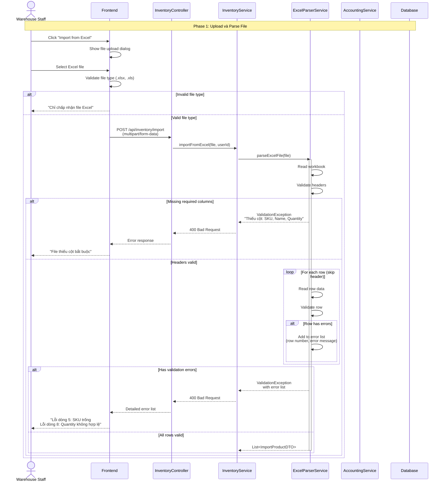
```mermaid
sequenceDiagram
    actor Staff as Warehouse Staff
    participant UI as Frontend
    participant InvCtrl as InventoryController
    participant InvSvc as InventoryService
    participant ExcelParser as ExcelParserService
    participant AcctSvc as AccountingService
    participant DB as Database
    
    Note over Staff,DB: Phase 1: Upload và Parse File
    
    Staff->>UI: Click "Import from Excel"
    UI->>UI: Show file upload dialog
    Staff->>UI: Select Excel file
    UI->>UI: Validate file type (.xlsx, .xls)
    
    alt Invalid file type
        UI-->>Staff: "Chỉ chấp nhận file Excel"
    else Valid file type
        UI->>InvCtrl: POST /api/inventory/import<br/>(multipart/form-data)
        activate InvCtrl
        
        InvCtrl->>InvSvc: importFromExcel(file, userId)
        activate InvSvc
        
        InvSvc->>ExcelParser: parseExcelFile(file)
        activate ExcelParser
        
        ExcelParser->>ExcelParser: Read workbook
        ExcelParser->>ExcelParser: Validate headers
        
        alt Missing required columns
            ExcelParser-->>InvSvc: ValidationException<br/>"Thiếu cột: SKU, Name, Quantity"
            InvSvc-->>InvCtrl: 400 Bad Request
            InvCtrl-->>UI: Error response
            UI-->>Staff: "File thiếu cột bắt buộc"
        else Headers valid
            loop For each row (skip header)
                ExcelParser->>ExcelParser: Read row data
                ExcelParser->>ExcelParser: Validate row
                
                alt Row has errors
                    ExcelParser->>ExcelParser: Add to error list<br/>(row number, error message)
                end
            end
            
            alt Has validation errors
                ExcelParser-->>InvSvc: ValidationException<br/>with error list
                InvSvc-->>InvCtrl: 400 Bad Request
                InvCtrl-->>UI: Detailed error list
                UI-->>Staff: "Lỗi dòng 5: SKU trống<br/>Lỗi dòng 8: Quantity không hợp lệ"
            else All rows valid
                ExcelParser-->>InvSvc: List<ImportProductDTO>
                deactivate ExcelParser
            end
        end
    end
```


### 1.2. Sơ Đồ Chi Tiết - Data Validation

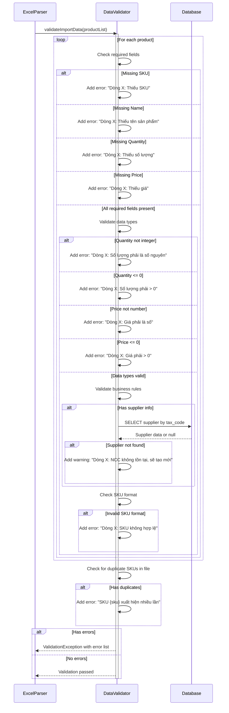
```mermaid
sequenceDiagram
    participant ExcelParser
    participant Validator as DataValidator
    participant DB as Database
    
    ExcelParser->>Validator: validateImportData(productList)
    activate Validator
    
    loop For each product
        Validator->>Validator: Check required fields
        
        alt Missing SKU
            Validator->>Validator: Add error: "Dòng X: Thiếu SKU"
        else Missing Name
            Validator->>Validator: Add error: "Dòng X: Thiếu tên sản phẩm"
        else Missing Quantity
            Validator->>Validator: Add error: "Dòng X: Thiếu số lượng"
        else Missing Price
            Validator->>Validator: Add error: "Dòng X: Thiếu giá"
        else All required fields present
            Validator->>Validator: Validate data types
            
            alt Quantity not integer
                Validator->>Validator: Add error: "Dòng X: Số lượng phải là số nguyên"
            else Quantity <= 0
                Validator->>Validator: Add error: "Dòng X: Số lượng phải > 0"
            else Price not number
                Validator->>Validator: Add error: "Dòng X: Giá phải là số"
            else Price <= 0
                Validator->>Validator: Add error: "Dòng X: Giá phải > 0"
            else Data types valid
                Validator->>Validator: Validate business rules
                
                alt Has supplier info
                    Validator->>DB: SELECT supplier by tax_code
                    DB-->>Validator: Supplier data or null
                    
                    alt Supplier not found
                        Validator->>Validator: Add warning: "Dòng X: NCC không tồn tại, sẽ tạo mới"
                    end
                end
                
                Validator->>Validator: Check SKU format
                alt Invalid SKU format
                    Validator->>Validator: Add error: "Dòng X: SKU không hợp lệ"
                end
            end
        end
    end
    
    Validator->>Validator: Check for duplicate SKUs in file
    
    alt Has duplicates
        Validator->>Validator: Add error: "SKU {sku} xuất hiện nhiều lần"
    end
    
    alt Has errors
        Validator-->>ExcelParser: ValidationException with error list
    else No errors
        Validator-->>ExcelParser: Validation passed
    end
    
    deactivate Validator
```

### 1.3. Sơ Đồ Chi Tiết - Database Transaction

```mermaid
sequenceDiagram
    participant InvSvc as InventoryService
    participant DB as Database
    participant AcctSvc as AccountingService
    
    Note over InvSvc,AcctSvc: Data validated, ready to persist
    
    InvSvc->>DB: BEGIN TRANSACTION
    activate DB
    
    InvSvc->>DB: INSERT purchase_order
    Note over DB: po_code = "PO-{YYYYMMDD}-{SEQ}"<br/>status = CREATED<br/>created_by = userId
    DB-->>InvSvc: Purchase Order ID
    
    loop For each product in import
        InvSvc->>DB: SELECT warehouse_product<br/>WHERE sku = ?
        DB-->>InvSvc: Warehouse Product or null
        
        alt Product exists
            InvSvc->>InvSvc: Use existing warehouse_product_id
        else Product not exists
            InvSvc->>DB: INSERT warehouse_product
            Note over DB: sku, internal_name,<br/>supplier_id (if provided)
            DB-->>InvSvc: New Warehouse Product ID
        end
        
        InvSvc->>DB: INSERT purchase_order_item
        Note over DB: purchase_order_id,<br/>warehouse_product_id,<br/>quantity, unit_cost
        DB-->>InvSvc: Purchase Order Item ID
        
        InvSvc->>DB: SELECT inventory_stock<br/>WHERE warehouse_product_id = ?
        DB-->>InvSvc: Stock record or null
        
        alt Stock exists
            InvSvc->>DB: UPDATE inventory_stock<br/>SET on_hand = on_hand + quantity
            Note over DB: available also increases<br/>(available = on_hand - reserved - damaged)
        else Stock not exists
            InvSvc->>DB: INSERT inventory_stock
            Note over DB: warehouse_product_id,<br/>on_hand = quantity,<br/>reserved = 0, damaged = 0
        end
        
        alt Has supplier
            InvSvc->>DB: SELECT supplier_payable<br/>WHERE supplier_id = ?<br/>AND status != PAID
            DB-->>InvSvc: Existing payable or null
            
            alt Payable exists
                InvSvc->>DB: UPDATE supplier_payable<br/>SET total_amount += item_total
                InvSvc->>DB: UPDATE remaining_amount += item_total
            else No existing payable
                InvSvc->>DB: INSERT supplier_payable
                Note over DB: payable_code,<br/>supplier_id,<br/>purchase_order_id,<br/>total_amount,<br/>remaining_amount,<br/>status = UNPAID
            end
        end
    end
    
    alt Has supplier payable
        InvSvc->>AcctSvc: recordSupplierPayable(purchaseOrderId)
        activate AcctSvc
        
        AcctSvc->>DB: INSERT financial_transaction
        Note over DB: type = EXPENSE,<br/>category = COST_OF_GOODS,<br/>amount = total_cost,<br/>description = "Công nợ NCC..."
        
        AcctSvc-->>InvSvc: Transaction recorded
        deactivate AcctSvc
    end
    
    alt All operations successful
        InvSvc->>DB: COMMIT
        DB-->>InvSvc: Transaction committed
        deactivate DB
        InvSvc->>InvSvc: Return success response
    else Any operation fails
        InvSvc->>DB: ROLLBACK
        DB-->>InvSvc: Transaction rolled back
        deactivate DB
        InvSvc->>InvSvc: Throw exception
    end
```


### 1.4. Sơ Đồ Chi Tiết - Error Handling Scenarios

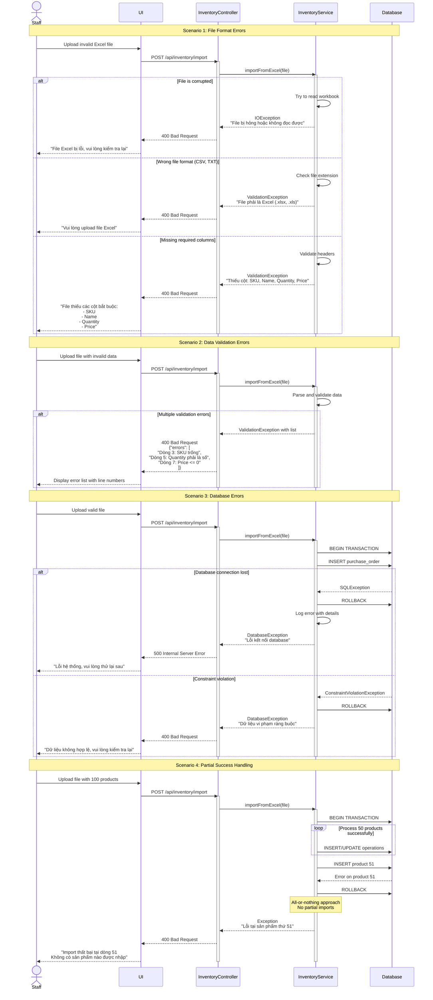
```mermaid
sequenceDiagram
    actor Staff
    participant UI
    participant InvCtrl as InventoryController
    participant InvSvc as InventoryService
    participant DB as Database
    
    Note over Staff,DB: Scenario 1: File Format Errors
    
    Staff->>UI: Upload invalid Excel file
    UI->>InvCtrl: POST /api/inventory/import
    activate InvCtrl
    
    InvCtrl->>InvSvc: importFromExcel(file)
    activate InvSvc
    
    alt File is corrupted
        InvSvc->>InvSvc: Try to read workbook
        InvSvc-->>InvCtrl: IOException<br/>"File bị hỏng hoặc không đọc được"
        InvCtrl-->>UI: 400 Bad Request
        UI-->>Staff: "File Excel bị lỗi, vui lòng kiểm tra lại"
        
    else Wrong file format (CSV, TXT)
        InvSvc->>InvSvc: Check file extension
        InvSvc-->>InvCtrl: ValidationException<br/>"File phải là Excel (.xlsx, .xls)"
        InvCtrl-->>UI: 400 Bad Request
        UI-->>Staff: "Vui lòng upload file Excel"
        
    else Missing required columns
        InvSvc->>InvSvc: Validate headers
        InvSvc-->>InvCtrl: ValidationException<br/>"Thiếu cột: SKU, Name, Quantity, Price"
        InvCtrl-->>UI: 400 Bad Request
        UI-->>Staff: "File thiếu các cột bắt buộc:<br/>- SKU<br/>- Name<br/>- Quantity<br/>- Price"
    end
    
    deactivate InvSvc
    deactivate InvCtrl
    
    Note over Staff,DB: Scenario 2: Data Validation Errors
    
    Staff->>UI: Upload file with invalid data
    UI->>InvCtrl: POST /api/inventory/import
    activate InvCtrl
    
    InvCtrl->>InvSvc: importFromExcel(file)
    activate InvSvc
    
    InvSvc->>InvSvc: Parse and validate data
    
    alt Multiple validation errors
        InvSvc-->>InvCtrl: ValidationException with list
        InvCtrl-->>UI: 400 Bad Request<br/>{"errors": [<br/>  "Dòng 3: SKU trống",<br/>  "Dòng 5: Quantity phải là số",<br/>  "Dòng 7: Price <= 0"<br/>]}
        UI-->>Staff: Display error list with line numbers
    end
    
    deactivate InvSvc
    deactivate InvCtrl
    
    Note over Staff,DB: Scenario 3: Database Errors
    
    Staff->>UI: Upload valid file
    UI->>InvCtrl: POST /api/inventory/import
    activate InvCtrl
    
    InvCtrl->>InvSvc: importFromExcel(file)
    activate InvSvc
    
    InvSvc->>DB: BEGIN TRANSACTION
    InvSvc->>DB: INSERT purchase_order
    
    alt Database connection lost
        DB-->>InvSvc: SQLException
        InvSvc->>DB: ROLLBACK
        InvSvc->>InvSvc: Log error with details
        InvSvc-->>InvCtrl: DatabaseException<br/>"Lỗi kết nối database"
        InvCtrl-->>UI: 500 Internal Server Error
        UI-->>Staff: "Lỗi hệ thống, vui lòng thử lại sau"
        
    else Constraint violation
        DB-->>InvSvc: ConstraintViolationException
        InvSvc->>DB: ROLLBACK
        InvSvc-->>InvCtrl: DatabaseException<br/>"Dữ liệu vi phạm ràng buộc"
        InvCtrl-->>UI: 400 Bad Request
        UI-->>Staff: "Dữ liệu không hợp lệ, vui lòng kiểm tra lại"
    end
    
    deactivate InvSvc
    deactivate InvCtrl
    
    Note over Staff,DB: Scenario 4: Partial Success Handling
    
    Staff->>UI: Upload file with 100 products
    UI->>InvCtrl: POST /api/inventory/import
    activate InvCtrl
    
    InvCtrl->>InvSvc: importFromExcel(file)
    activate InvSvc
    
    InvSvc->>DB: BEGIN TRANSACTION
    
    loop Process 50 products successfully
        InvSvc->>DB: INSERT/UPDATE operations
    end
    
    InvSvc->>DB: INSERT product 51
    DB-->>InvSvc: Error on product 51
    
    InvSvc->>DB: ROLLBACK
    Note over InvSvc: All-or-nothing approach<br/>No partial imports
    
    InvSvc-->>InvCtrl: Exception<br/>"Lỗi tại sản phẩm thứ 51"
    InvCtrl-->>UI: 400 Bad Request
    UI-->>Staff: "Import thất bại tại dòng 51<br/>Không có sản phẩm nào được nhập"
    
    deactivate InvSvc
    deactivate InvCtrl
```

---

## 2. Luồng Xuất Kho cho Đơn Hàng

### 2.1. Sơ Đồ Tổng Quan - Export Order Creation

```mermaid
sequenceDiagram
    actor Staff as Warehouse Staff
    participant UI as Frontend
    participant InvCtrl as InventoryController
    participant InvSvc as InventoryService
    participant OrderSvc as OrderService
    participant DB as Database
    
    Note over Staff,DB: Phase 1: Select Order and Validate
    
    Staff->>UI: View orders list (CONFIRMED status)
    UI->>InvCtrl: GET /api/inventory/orders/pending-export
    activate InvCtrl
    
    InvCtrl->>InvSvc: getOrdersPendingExport()
    activate InvSvc
    
    InvSvc->>DB: SELECT orders<br/>WHERE status = 'CONFIRMED'<br/>AND NOT EXISTS (export_order)
    DB-->>InvSvc: List of orders
    
    InvSvc-->>InvCtrl: List<OrderDTO>
    deactivate InvSvc
    InvCtrl-->>UI: 200 OK with orders
    deactivate InvCtrl
    
    UI-->>Staff: Display orders table
    
    Staff->>UI: Click "Tạo phiếu xuất" for order
    UI->>InvCtrl: POST /api/inventory/export/create
    Note over UI,InvCtrl: Request body: {orderId}
    activate InvCtrl
    
    InvCtrl->>InvSvc: createExportOrder(orderId, userId)
    activate InvSvc
    
    InvSvc->>DB: SELECT order with items
    DB-->>InvSvc: Order + OrderItems
    
    InvSvc->>InvSvc: validateOrderStatus()
    
    alt Status != CONFIRMED
        InvSvc-->>InvCtrl: InvalidStatusException<br/>"Đơn hàng chưa được xác nhận"
        InvCtrl-->>UI: 400 Bad Request
        UI-->>Staff: "Chỉ có thể xuất kho cho đơn đã xác nhận"
    else Status = CONFIRMED
        InvSvc->>InvSvc: checkStockAvailability(orderItems)
        activate InvSvc
        
        loop For each order item
            InvSvc->>DB: SELECT inventory_stock<br/>WHERE warehouse_product_id = ?
            DB-->>InvSvc: Stock data
            
            InvSvc->>InvSvc: Calculate available<br/>(on_hand - reserved - damaged)
            
            alt Available < Required
                InvSvc->>InvSvc: Add to insufficient list<br/>{product, required, available}
            end
        end
        
        alt Has insufficient items
            InvSvc-->>InvCtrl: InsufficientStockException<br/>with product details
            deactivate InvSvc
            InvCtrl-->>UI: 400 Bad Request<br/>{"insufficientProducts": [<br/>  {name: "Product A", required: 10, available: 5},<br/>  {name: "Product B", required: 3, available: 0}<br/>]}
            UI-->>Staff: "Không đủ hàng để xuất:<br/>- Product A: cần 10, có 5<br/>- Product B: cần 3, có 0"
        else All items available
            deactivate InvSvc
            
            InvSvc->>DB: BEGIN TRANSACTION
            
            InvSvc->>DB: INSERT export_order
            Note over DB: export_code = "EXP-{YYYYMMDD}-{SEQ}"<br/>status = PENDING<br/>order_id, created_by
            DB-->>InvSvc: Export Order ID
            
            loop For each order item
                InvSvc->>DB: INSERT export_order_item
                Note over DB: export_order_id,<br/>warehouse_product_id,<br/>quantity, sku
            end
            
            InvSvc->>DB: COMMIT
            
            InvSvc-->>InvCtrl: ExportOrderResponse
            deactivate InvSvc
            InvCtrl-->>UI: 200 OK with export order
            deactivate InvCtrl
            
            UI-->>Staff: "Phiếu xuất đã tạo: {exportCode}<br/>Vui lòng quét serial numbers"
        end
    end
```


### 2.2. Sơ Đồ Chi Tiết - Stock Availability Validation

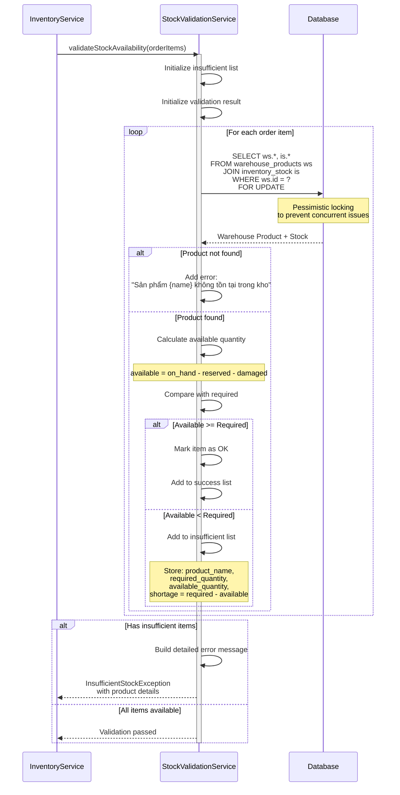
```mermaid
sequenceDiagram
    participant InvSvc as InventoryService
    participant StockValidator as StockValidationService
    participant DB as Database
    
    InvSvc->>StockValidator: validateStockAvailability(orderItems)
    activate StockValidator
    
    StockValidator->>StockValidator: Initialize insufficient list
    StockValidator->>StockValidator: Initialize validation result
    
    loop For each order item
        StockValidator->>DB: SELECT ws.*, is.*<br/>FROM warehouse_products ws<br/>JOIN inventory_stock is<br/>WHERE ws.id = ?<br/>FOR UPDATE
        Note over DB: Pessimistic locking<br/>to prevent concurrent issues
        
        DB-->>StockValidator: Warehouse Product + Stock
        
        alt Product not found
            StockValidator->>StockValidator: Add error:<br/>"Sản phẩm {name} không tồn tại trong kho"
        else Product found
            StockValidator->>StockValidator: Calculate available quantity
            Note over StockValidator: available = on_hand - reserved - damaged
            
            StockValidator->>StockValidator: Compare with required
            
            alt Available >= Required
                StockValidator->>StockValidator: Mark item as OK
                StockValidator->>StockValidator: Add to success list
            else Available < Required
                StockValidator->>StockValidator: Add to insufficient list
                Note over StockValidator: Store: product_name,<br/>required_quantity,<br/>available_quantity,<br/>shortage = required - available
            end
        end
    end
    
    alt Has insufficient items
        StockValidator->>StockValidator: Build detailed error message
        StockValidator-->>InvSvc: InsufficientStockException<br/>with product details
    else All items available
        StockValidator-->>InvSvc: Validation passed
    end
    
    deactivate StockValidator
```

### 2.3. Sơ Đồ Chi Tiết - Serial Number Scanning & Tracking

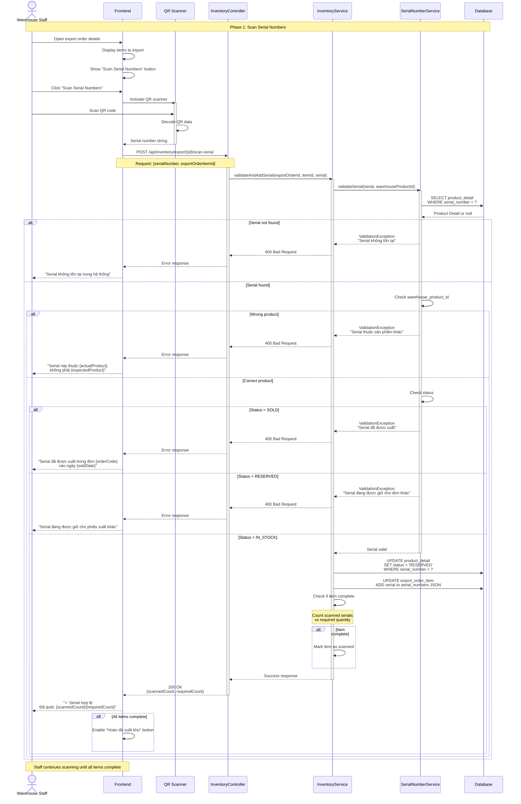
```mermaid
sequenceDiagram
    actor Staff as Warehouse Staff
    participant UI as Frontend
    participant Scanner as QR Scanner
    participant InvCtrl as InventoryController
    participant InvSvc as InventoryService
    participant SerialSvc as SerialNumberService
    participant DB as Database
    
    Note over Staff,DB: Phase 1: Scan Serial Numbers
    
    Staff->>UI: Open export order details
    UI->>UI: Display items to export
    UI->>UI: Show "Scan Serial Numbers" button
    
    Staff->>UI: Click "Scan Serial Numbers"
    UI->>Scanner: Activate QR scanner
    activate Scanner
    
    Staff->>Scanner: Scan QR code
    Scanner->>Scanner: Decode QR data
    Scanner-->>UI: Serial number string
    deactivate Scanner
    
    UI->>InvCtrl: POST /api/inventory/export/{id}/scan-serial
    Note over UI,InvCtrl: Request: {serialNumber, exportOrderItemId}
    activate InvCtrl
    
    InvCtrl->>InvSvc: validateAndAddSerial(exportOrderId, itemId, serial)
    activate InvSvc
    
    InvSvc->>SerialSvc: validateSerial(serial, warehouseProductId)
    activate SerialSvc
    
    SerialSvc->>DB: SELECT product_detail<br/>WHERE serial_number = ?
    DB-->>SerialSvc: Product Detail or null
    
    alt Serial not found
        SerialSvc-->>InvSvc: ValidationException<br/>"Serial không tồn tại"
        InvSvc-->>InvCtrl: 400 Bad Request
        InvCtrl-->>UI: Error response
        UI-->>Staff: "Serial không tồn tại trong hệ thống"
        
    else Serial found
        SerialSvc->>SerialSvc: Check warehouse_product_id
        
        alt Wrong product
            SerialSvc-->>InvSvc: ValidationException<br/>"Serial thuộc sản phẩm khác"
            InvSvc-->>InvCtrl: 400 Bad Request
            InvCtrl-->>UI: Error response
            UI-->>Staff: "Serial này thuộc {actualProduct},<br/>không phải {expectedProduct}"
            
        else Correct product
            SerialSvc->>SerialSvc: Check status
            
            alt Status = SOLD
                SerialSvc-->>InvSvc: ValidationException<br/>"Serial đã được xuất"
                InvSvc-->>InvCtrl: 400 Bad Request
                InvCtrl-->>UI: Error response
                UI-->>Staff: "Serial đã được xuất trong đơn {orderCode}<br/>vào ngày {soldDate}"
                
            else Status = RESERVED
                SerialSvc-->>InvSvc: ValidationException<br/>"Serial đang được giữ cho đơn khác"
                InvSvc-->>InvCtrl: 400 Bad Request
                InvCtrl-->>UI: Error response
                UI-->>Staff: "Serial đang được giữ cho phiếu xuất khác"
                
            else Status = IN_STOCK
                SerialSvc-->>InvSvc: Serial valid
                deactivate SerialSvc
                
                InvSvc->>DB: UPDATE product_detail<br/>SET status = 'RESERVED'<br/>WHERE serial_number = ?
                
                InvSvc->>DB: UPDATE export_order_item<br/>ADD serial to serial_numbers JSON
                
                InvSvc->>InvSvc: Check if item complete
                Note over InvSvc: Count scanned serials<br/>vs required quantity
                
                alt Item complete
                    InvSvc->>InvSvc: Mark item as scanned
                end
                
                InvSvc-->>InvCtrl: Success response
                deactivate InvSvc
                InvCtrl-->>UI: 200 OK<br/>{scannedCount, requiredCount}
                deactivate InvCtrl
                
                UI-->>Staff: "✓ Serial hợp lệ<br/>Đã quét: {scannedCount}/{requiredCount}"
                
                alt All items complete
                    UI->>UI: Enable "Hoàn tất xuất kho" button
                end
            end
        end
    end
    
    Note over Staff,UI: Staff continues scanning until all items complete
```


### 2.4. Sơ Đồ Chi Tiết - Complete Export Order

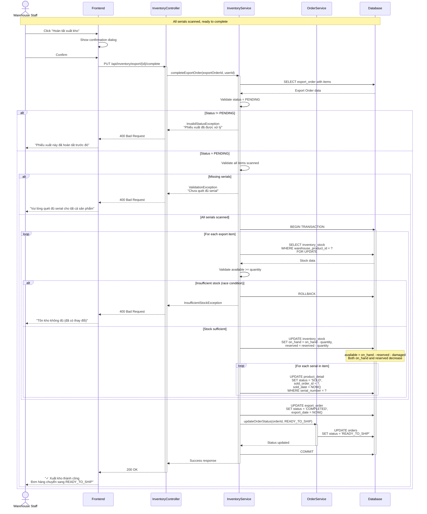
```mermaid
sequenceDiagram
    actor Staff as Warehouse Staff
    participant UI as Frontend
    participant InvCtrl as InventoryController
    participant InvSvc as InventoryService
    participant OrderSvc as OrderService
    participant DB as Database
    
    Note over Staff,DB: All serials scanned, ready to complete
    
    Staff->>UI: Click "Hoàn tất xuất kho"
    UI->>UI: Show confirmation dialog
    Staff->>UI: Confirm
    
    UI->>InvCtrl: PUT /api/inventory/export/{id}/complete
    activate InvCtrl
    
    InvCtrl->>InvSvc: completeExportOrder(exportOrderId, userId)
    activate InvSvc
    
    InvSvc->>DB: SELECT export_order with items
    DB-->>InvSvc: Export Order data
    
    InvSvc->>InvSvc: Validate status = PENDING
    
    alt Status != PENDING
        InvSvc-->>InvCtrl: InvalidStatusException<br/>"Phiếu xuất đã được xử lý"
        InvCtrl-->>UI: 400 Bad Request
        UI-->>Staff: "Phiếu xuất này đã hoàn tất trước đó"
    else Status = PENDING
        InvSvc->>InvSvc: Validate all items scanned
        
        alt Missing serials
            InvSvc-->>InvCtrl: ValidationException<br/>"Chưa quét đủ serial"
            InvCtrl-->>UI: 400 Bad Request
            UI-->>Staff: "Vui lòng quét đủ serial cho tất cả sản phẩm"
        else All serials scanned
            InvSvc->>DB: BEGIN TRANSACTION
            activate DB
            
            loop For each export item
                InvSvc->>DB: SELECT inventory_stock<br/>WHERE warehouse_product_id = ?<br/>FOR UPDATE
                DB-->>InvSvc: Stock data
                
                InvSvc->>InvSvc: Validate available >= quantity
                
                alt Insufficient stock (race condition)
                    InvSvc->>DB: ROLLBACK
                    InvSvc-->>InvCtrl: InsufficientStockException
                    InvCtrl-->>UI: 400 Bad Request
                    UI-->>Staff: "Tồn kho không đủ (đã có thay đổi)"
                else Stock sufficient
                    InvSvc->>DB: UPDATE inventory_stock<br/>SET on_hand = on_hand - quantity,<br/>reserved = reserved - quantity
                    Note over DB: available = on_hand - reserved - damaged<br/>Both on_hand and reserved decrease
                    
                    loop For each serial in item
                        InvSvc->>DB: UPDATE product_detail<br/>SET status = 'SOLD',<br/>sold_order_id = ?,<br/>sold_date = NOW()<br/>WHERE serial_number = ?
                    end
                end
            end
            
            InvSvc->>DB: UPDATE export_order<br/>SET status = 'COMPLETED',<br/>export_date = NOW()
            
            InvSvc->>OrderSvc: updateOrderStatus(orderId, READY_TO_SHIP)
            activate OrderSvc
            
            OrderSvc->>DB: UPDATE orders<br/>SET status = 'READY_TO_SHIP'
            
            OrderSvc-->>InvSvc: Status updated
            deactivate OrderSvc
            
            InvSvc->>DB: COMMIT
            deactivate DB
            
            InvSvc-->>InvCtrl: Success response
            deactivate InvSvc
            InvCtrl-->>UI: 200 OK
            deactivate InvCtrl
            
            UI-->>Staff: "✓ Xuất kho thành công<br/>Đơn hàng chuyển sang READY_TO_SHIP"
        end
    end
```

### 2.5. Sơ Đồ Chi Tiết - Cancel Export Order

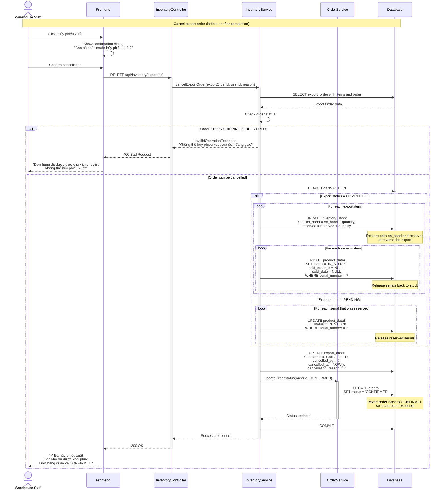
```mermaid
sequenceDiagram
    actor Staff as Warehouse Staff
    participant UI as Frontend
    participant InvCtrl as InventoryController
    participant InvSvc as InventoryService
    participant OrderSvc as OrderService
    participant DB as Database
    
    Note over Staff,DB: Cancel export order (before or after completion)
    
    Staff->>UI: Click "Hủy phiếu xuất"
    UI->>UI: Show confirmation dialog<br/>"Bạn có chắc muốn hủy phiếu xuất?"
    Staff->>UI: Confirm cancellation
    
    UI->>InvCtrl: DELETE /api/inventory/export/{id}
    activate InvCtrl
    
    InvCtrl->>InvSvc: cancelExportOrder(exportOrderId, userId, reason)
    activate InvSvc
    
    InvSvc->>DB: SELECT export_order with items and order
    DB-->>InvSvc: Export Order data
    
    InvSvc->>InvSvc: Check order status
    
    alt Order already SHIPPING or DELIVERED
        InvSvc-->>InvCtrl: InvalidOperationException<br/>"Không thể hủy phiếu xuất của đơn đang giao"
        InvCtrl-->>UI: 400 Bad Request
        UI-->>Staff: "Đơn hàng đã được giao cho vận chuyển,<br/>không thể hủy phiếu xuất"
    else Order can be cancelled
        InvSvc->>DB: BEGIN TRANSACTION
        activate DB
        
        alt Export status = COMPLETED
            loop For each export item
                InvSvc->>DB: UPDATE inventory_stock<br/>SET on_hand = on_hand + quantity,<br/>reserved = reserved + quantity
                Note over DB: Restore both on_hand and reserved<br/>to reverse the export
                
                loop For each serial in item
                    InvSvc->>DB: UPDATE product_detail<br/>SET status = 'IN_STOCK',<br/>sold_order_id = NULL,<br/>sold_date = NULL<br/>WHERE serial_number = ?
                    Note over DB: Release serials back to stock
                end
            end
        else Export status = PENDING
            loop For each serial that was reserved
                InvSvc->>DB: UPDATE product_detail<br/>SET status = 'IN_STOCK'<br/>WHERE serial_number = ?
                Note over DB: Release reserved serials
            end
        end
        
        InvSvc->>DB: UPDATE export_order<br/>SET status = 'CANCELLED',<br/>cancelled_by = ?,<br/>cancelled_at = NOW(),<br/>cancellation_reason = ?
        
        InvSvc->>OrderSvc: updateOrderStatus(orderId, CONFIRMED)
        activate OrderSvc
        
        OrderSvc->>DB: UPDATE orders<br/>SET status = 'CONFIRMED'
        Note over DB: Revert order back to CONFIRMED<br/>so it can be re-exported
        
        OrderSvc-->>InvSvc: Status updated
        deactivate OrderSvc
        
        InvSvc->>DB: COMMIT
        deactivate DB
        
        InvSvc-->>InvCtrl: Success response
        deactivate InvSvc
        InvCtrl-->>UI: 200 OK
        deactivate InvCtrl
        
        UI-->>Staff: "✓ Đã hủy phiếu xuất<br/>Tồn kho đã được khôi phục<br/>Đơn hàng quay về CONFIRMED"
    end
```


---

## 3. Luồng Serial Number Management

### 3.1. Sơ Đồ Chi Tiết - Generate Serial Numbers

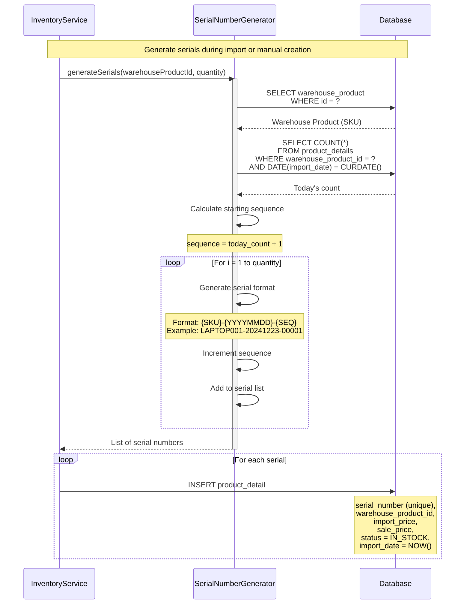
```mermaid
sequenceDiagram
    participant InvSvc as InventoryService
    participant SerialGen as SerialNumberGenerator
    participant DB as Database
    
    Note over InvSvc,DB: Generate serials during import or manual creation
    
    InvSvc->>SerialGen: generateSerials(warehouseProductId, quantity)
    activate SerialGen
    
    SerialGen->>DB: SELECT warehouse_product<br/>WHERE id = ?
    DB-->>SerialGen: Warehouse Product (SKU)
    
    SerialGen->>DB: SELECT COUNT(*)<br/>FROM product_details<br/>WHERE warehouse_product_id = ?<br/>AND DATE(import_date) = CURDATE()
    DB-->>SerialGen: Today's count
    
    SerialGen->>SerialGen: Calculate starting sequence
    Note over SerialGen: sequence = today_count + 1
    
    loop For i = 1 to quantity
        SerialGen->>SerialGen: Generate serial format
        Note over SerialGen: Format: {SKU}-{YYYYMMDD}-{SEQ}<br/>Example: LAPTOP001-20241223-00001
        
        SerialGen->>SerialGen: Increment sequence
        SerialGen->>SerialGen: Add to serial list
    end
    
    SerialGen-->>InvSvc: List of serial numbers
    deactivate SerialGen
    
    loop For each serial
        InvSvc->>DB: INSERT product_detail
        Note over DB: serial_number (unique),<br/>warehouse_product_id,<br/>import_price,<br/>sale_price,<br/>status = IN_STOCK,<br/>import_date = NOW()
    end
```

### 3.2. Sơ Đồ Chi Tiết - Serial Number Lifecycle

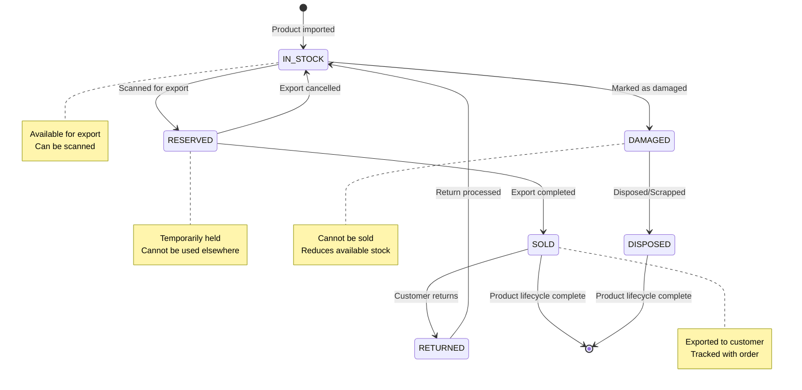
```mermaid
stateDiagram-v2
    [*] --> IN_STOCK: Product imported
    
    IN_STOCK --> RESERVED: Scanned for export
    RESERVED --> IN_STOCK: Export cancelled
    RESERVED --> SOLD: Export completed
    
    SOLD --> RETURNED: Customer returns
    RETURNED --> IN_STOCK: Return processed
    
    IN_STOCK --> DAMAGED: Marked as damaged
    DAMAGED --> DISPOSED: Disposed/Scrapped
    
    SOLD --> [*]: Product lifecycle complete
    DISPOSED --> [*]: Product lifecycle complete
    
    note right of IN_STOCK
        Available for export
        Can be scanned
    end note
    
    note right of RESERVED
        Temporarily held
        Cannot be used elsewhere
    end note
    
    note right of SOLD
        Exported to customer
        Tracked with order
    end note
    
    note right of DAMAGED
        Cannot be sold
        Reduces available stock
    end note
```

### 3.3. Sơ Đồ Chi Tiết - Serial Number Validation Rules

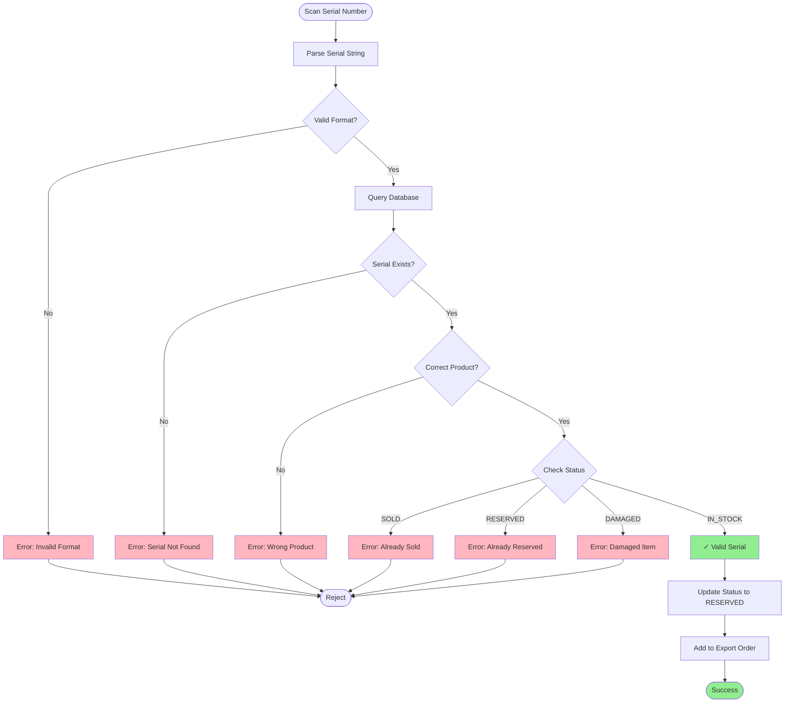
```mermaid
flowchart TD
    Start([Scan Serial Number]) --> Parse[Parse Serial String]
    Parse --> CheckFormat{Valid Format?}
    
    CheckFormat -->|No| ErrorFormat[Error: Invalid Format]
    CheckFormat -->|Yes| QueryDB[Query Database]
    
    QueryDB --> Exists{Serial Exists?}
    Exists -->|No| ErrorNotFound[Error: Serial Not Found]
    Exists -->|Yes| CheckProduct{Correct Product?}
    
    CheckProduct -->|No| ErrorWrongProduct[Error: Wrong Product]
    CheckProduct -->|Yes| CheckStatus{Check Status}
    
    CheckStatus -->|SOLD| ErrorSold[Error: Already Sold]
    CheckStatus -->|RESERVED| ErrorReserved[Error: Already Reserved]
    CheckStatus -->|DAMAGED| ErrorDamaged[Error: Damaged Item]
    CheckStatus -->|IN_STOCK| ValidSerial[✓ Valid Serial]
    
    ValidSerial --> UpdateStatus[Update Status to RESERVED]
    UpdateStatus --> AddToExport[Add to Export Order]
    AddToExport --> Success([Success])
    
    ErrorFormat --> End([Reject])
    ErrorNotFound --> End
    ErrorWrongProduct --> End
    ErrorSold --> End
    ErrorReserved --> End
    ErrorDamaged --> End
    
    style ValidSerial fill:#90EE90
    style Success fill:#90EE90
    style ErrorFormat fill:#FFB6C1
    style ErrorNotFound fill:#FFB6C1
    style ErrorWrongProduct fill:#FFB6C1
    style ErrorSold fill:#FFB6C1
    style ErrorReserved fill:#FFB6C1
    style ErrorDamaged fill:#FFB6C1
```


---

## 4. Luồng Stock Validation và Concurrency Control

### 4.1. Sơ Đồ Chi Tiết - Optimistic Locking for Stock Updates

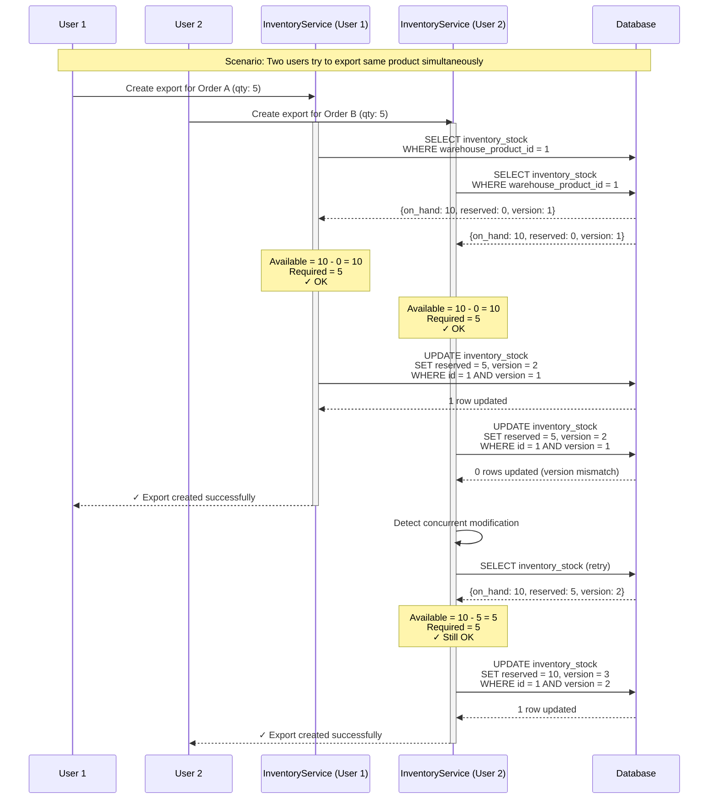
```mermaid
sequenceDiagram
    participant User1 as User 1
    participant User2 as User 2
    participant InvSvc1 as InventoryService (User 1)
    participant InvSvc2 as InventoryService (User 2)
    participant DB as Database
    
    Note over User1,DB: Scenario: Two users try to export same product simultaneously
    
    User1->>InvSvc1: Create export for Order A (qty: 5)
    User2->>InvSvc2: Create export for Order B (qty: 5)
    
    activate InvSvc1
    activate InvSvc2
    
    InvSvc1->>DB: SELECT inventory_stock<br/>WHERE warehouse_product_id = 1
    InvSvc2->>DB: SELECT inventory_stock<br/>WHERE warehouse_product_id = 1
    
    DB-->>InvSvc1: {on_hand: 10, reserved: 0, version: 1}
    DB-->>InvSvc2: {on_hand: 10, reserved: 0, version: 1}
    
    Note over InvSvc1: Available = 10 - 0 = 10<br/>Required = 5<br/>✓ OK
    Note over InvSvc2: Available = 10 - 0 = 10<br/>Required = 5<br/>✓ OK
    
    InvSvc1->>DB: UPDATE inventory_stock<br/>SET reserved = 5, version = 2<br/>WHERE id = 1 AND version = 1
    
    DB-->>InvSvc1: 1 row updated
    
    InvSvc2->>DB: UPDATE inventory_stock<br/>SET reserved = 5, version = 2<br/>WHERE id = 1 AND version = 1
    
    DB-->>InvSvc2: 0 rows updated (version mismatch)
    
    InvSvc1-->>User1: ✓ Export created successfully
    deactivate InvSvc1
    
    InvSvc2->>InvSvc2: Detect concurrent modification
    InvSvc2->>DB: SELECT inventory_stock (retry)
    DB-->>InvSvc2: {on_hand: 10, reserved: 5, version: 2}
    
    Note over InvSvc2: Available = 10 - 5 = 5<br/>Required = 5<br/>✓ Still OK
    
    InvSvc2->>DB: UPDATE inventory_stock<br/>SET reserved = 10, version = 3<br/>WHERE id = 1 AND version = 2
    
    DB-->>InvSvc2: 1 row updated
    
    InvSvc2-->>User2: ✓ Export created successfully
    deactivate InvSvc2
```

### 4.2. Sơ Đồ Chi Tiết - Pessimistic Locking for Critical Operations

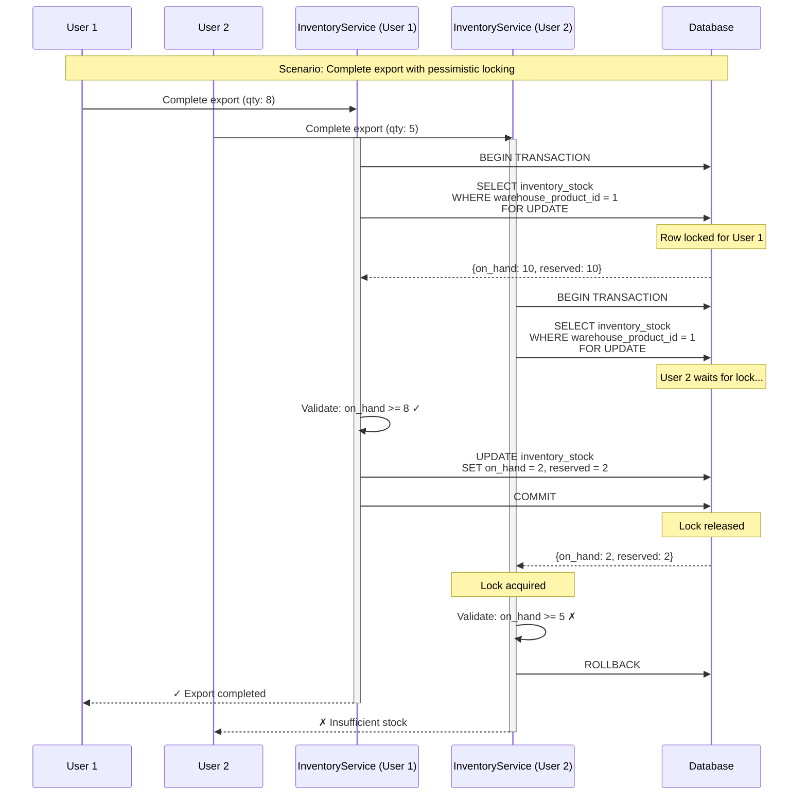
```mermaid
sequenceDiagram
    participant User1 as User 1
    participant User2 as User 2
    participant InvSvc1 as InventoryService (User 1)
    participant InvSvc2 as InventoryService (User 2)
    participant DB as Database
    
    Note over User1,DB: Scenario: Complete export with pessimistic locking
    
    User1->>InvSvc1: Complete export (qty: 8)
    User2->>InvSvc2: Complete export (qty: 5)
    
    activate InvSvc1
    activate InvSvc2
    
    InvSvc1->>DB: BEGIN TRANSACTION
    InvSvc1->>DB: SELECT inventory_stock<br/>WHERE warehouse_product_id = 1<br/>FOR UPDATE
    Note over DB: Row locked for User 1
    
    DB-->>InvSvc1: {on_hand: 10, reserved: 10}
    
    InvSvc2->>DB: BEGIN TRANSACTION
    InvSvc2->>DB: SELECT inventory_stock<br/>WHERE warehouse_product_id = 1<br/>FOR UPDATE
    Note over DB: User 2 waits for lock...
    
    InvSvc1->>InvSvc1: Validate: on_hand >= 8 ✓
    InvSvc1->>DB: UPDATE inventory_stock<br/>SET on_hand = 2, reserved = 2
    
    InvSvc1->>DB: COMMIT
    Note over DB: Lock released
    
    DB-->>InvSvc2: {on_hand: 2, reserved: 2}
    Note over InvSvc2: Lock acquired
    
    InvSvc2->>InvSvc2: Validate: on_hand >= 5 ✗
    InvSvc2->>DB: ROLLBACK
    
    InvSvc1-->>User1: ✓ Export completed
    deactivate InvSvc1
    
    InvSvc2-->>User2: ✗ Insufficient stock
    deactivate InvSvc2
```

### 4.3. Sơ Đồ Chi Tiết - Stock Reconciliation

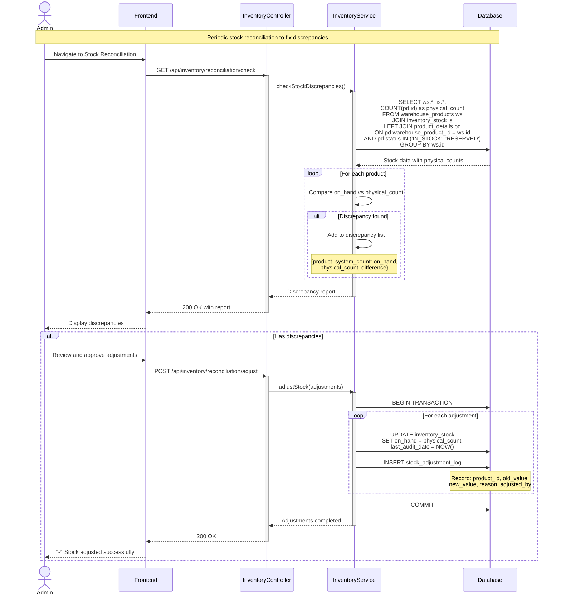
```mermaid
sequenceDiagram
    actor Admin
    participant UI as Frontend
    participant InvCtrl as InventoryController
    participant InvSvc as InventoryService
    participant DB as Database
    
    Note over Admin,DB: Periodic stock reconciliation to fix discrepancies
    
    Admin->>UI: Navigate to Stock Reconciliation
    UI->>InvCtrl: GET /api/inventory/reconciliation/check
    activate InvCtrl
    
    InvCtrl->>InvSvc: checkStockDiscrepancies()
    activate InvSvc
    
    InvSvc->>DB: SELECT ws.*, is.*,<br/>COUNT(pd.id) as physical_count<br/>FROM warehouse_products ws<br/>JOIN inventory_stock is<br/>LEFT JOIN product_details pd<br/>  ON pd.warehouse_product_id = ws.id<br/>  AND pd.status IN ('IN_STOCK', 'RESERVED')<br/>GROUP BY ws.id
    
    DB-->>InvSvc: Stock data with physical counts
    
    loop For each product
        InvSvc->>InvSvc: Compare on_hand vs physical_count
        
        alt Discrepancy found
            InvSvc->>InvSvc: Add to discrepancy list
            Note over InvSvc: {product, system_count: on_hand,<br/>physical_count, difference}
        end
    end
    
    InvSvc-->>InvCtrl: Discrepancy report
    deactivate InvSvc
    InvCtrl-->>UI: 200 OK with report
    deactivate InvCtrl
    
    UI-->>Admin: Display discrepancies
    
    alt Has discrepancies
        Admin->>UI: Review and approve adjustments
        UI->>InvCtrl: POST /api/inventory/reconciliation/adjust
        activate InvCtrl
        
        InvCtrl->>InvSvc: adjustStock(adjustments)
        activate InvSvc
        
        InvSvc->>DB: BEGIN TRANSACTION
        
        loop For each adjustment
            InvSvc->>DB: UPDATE inventory_stock<br/>SET on_hand = physical_count,<br/>last_audit_date = NOW()
            
            InvSvc->>DB: INSERT stock_adjustment_log
            Note over DB: Record: product_id, old_value,<br/>new_value, reason, adjusted_by
        end
        
        InvSvc->>DB: COMMIT
        
        InvSvc-->>InvCtrl: Adjustments completed
        deactivate InvSvc
        InvCtrl-->>UI: 200 OK
        deactivate InvCtrl
        
        UI-->>Admin: "✓ Stock adjusted successfully"
    end
```


---

## 5. Error Scenarios và Exception Handling

### 5.1. Comprehensive Error Handling Flow

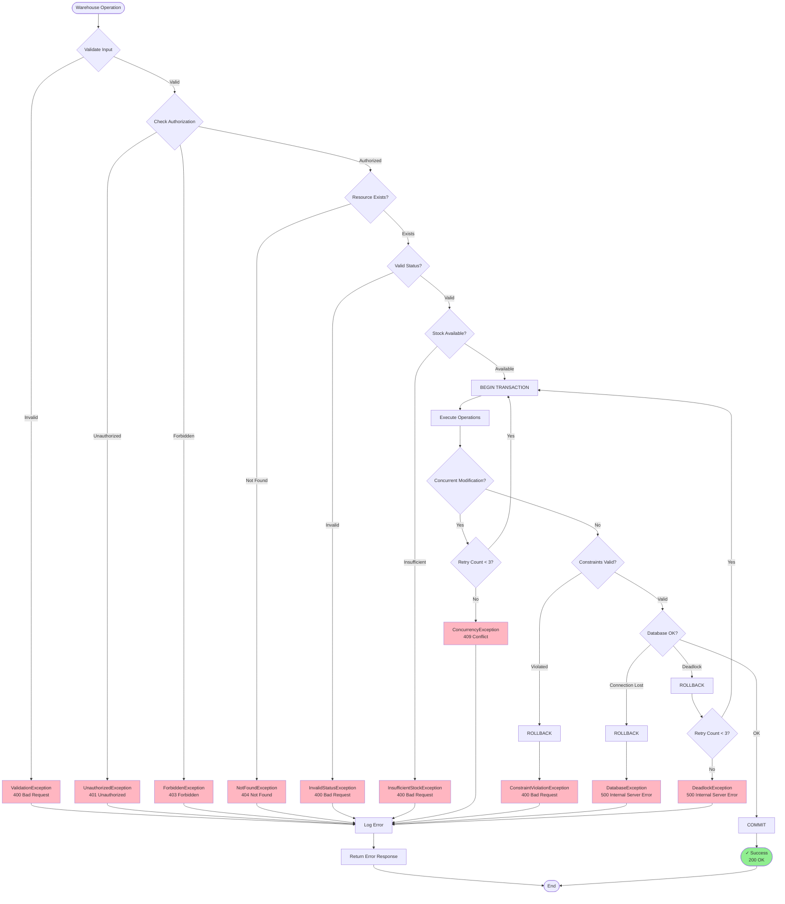
```mermaid
flowchart TD
    Start([Warehouse Operation]) --> ValidateInput{Validate Input}
    
    ValidateInput -->|Invalid| E1[ValidationException<br/>400 Bad Request]
    ValidateInput -->|Valid| CheckAuth{Check Authorization}
    
    CheckAuth -->|Unauthorized| E2[UnauthorizedException<br/>401 Unauthorized]
    CheckAuth -->|Forbidden| E3[ForbiddenException<br/>403 Forbidden]
    CheckAuth -->|Authorized| CheckResource{Resource Exists?}
    
    CheckResource -->|Not Found| E4[NotFoundException<br/>404 Not Found]
    CheckResource -->|Exists| CheckStatus{Valid Status?}
    
    CheckStatus -->|Invalid| E5[InvalidStatusException<br/>400 Bad Request]
    CheckStatus -->|Valid| CheckStock{Stock Available?}
    
    CheckStock -->|Insufficient| E6[InsufficientStockException<br/>400 Bad Request]
    CheckStock -->|Available| BeginTx[BEGIN TRANSACTION]
    
    BeginTx --> ExecuteOps[Execute Operations]
    ExecuteOps --> CheckConcurrency{Concurrent Modification?}
    
    CheckConcurrency -->|Yes| Retry{Retry Count < 3?}
    Retry -->|Yes| BeginTx
    Retry -->|No| E7[ConcurrencyException<br/>409 Conflict]
    
    CheckConcurrency -->|No| CheckConstraints{Constraints Valid?}
    
    CheckConstraints -->|Violated| Rollback1[ROLLBACK]
    Rollback1 --> E8[ConstraintViolationException<br/>400 Bad Request]
    
    CheckConstraints -->|Valid| CheckDB{Database OK?}
    
    CheckDB -->|Connection Lost| Rollback2[ROLLBACK]
    Rollback2 --> E9[DatabaseException<br/>500 Internal Server Error]
    
    CheckDB -->|Deadlock| Rollback3[ROLLBACK]
    Rollback3 --> Retry2{Retry Count < 3?}
    Retry2 -->|Yes| BeginTx
    Retry2 -->|No| E10[DeadlockException<br/>500 Internal Server Error]
    
    CheckDB -->|OK| Commit[COMMIT]
    Commit --> Success([✓ Success<br/>200 OK])
    
    E1 --> LogError[Log Error]
    E2 --> LogError
    E3 --> LogError
    E4 --> LogError
    E5 --> LogError
    E6 --> LogError
    E7 --> LogError
    E8 --> LogError
    E9 --> LogError
    E10 --> LogError
    
    LogError --> ReturnError[Return Error Response]
    ReturnError --> End([End])
    
    Success --> End
    
    style Success fill:#90EE90
    style E1 fill:#FFB6C1
    style E2 fill:#FFB6C1
    style E3 fill:#FFB6C1
    style E4 fill:#FFB6C1
    style E5 fill:#FFB6C1
    style E6 fill:#FFB6C1
    style E7 fill:#FFB6C1
    style E8 fill:#FFB6C1
    style E9 fill:#FFB6C1
    style E10 fill:#FFB6C1
```

### 5.2. Rollback Scenarios

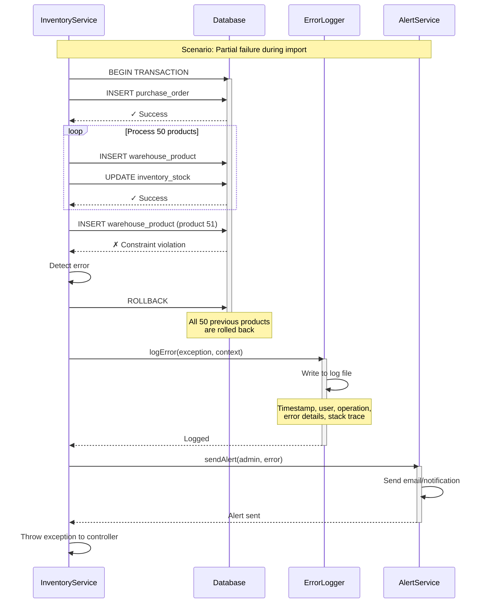
```mermaid
sequenceDiagram
    participant InvSvc as InventoryService
    participant DB as Database
    participant Logger as ErrorLogger
    participant Alert as AlertService
    
    Note over InvSvc,Alert: Scenario: Partial failure during import
    
    InvSvc->>DB: BEGIN TRANSACTION
    activate DB
    
    InvSvc->>DB: INSERT purchase_order
    DB-->>InvSvc: ✓ Success
    
    loop Process 50 products
        InvSvc->>DB: INSERT warehouse_product
        InvSvc->>DB: UPDATE inventory_stock
        DB-->>InvSvc: ✓ Success
    end
    
    InvSvc->>DB: INSERT warehouse_product (product 51)
    DB-->>InvSvc: ✗ Constraint violation
    
    InvSvc->>InvSvc: Detect error
    InvSvc->>DB: ROLLBACK
    Note over DB: All 50 previous products<br/>are rolled back
    
    deactivate DB
    
    InvSvc->>Logger: logError(exception, context)
    activate Logger
    Logger->>Logger: Write to log file
    Note over Logger: Timestamp, user, operation,<br/>error details, stack trace
    Logger-->>InvSvc: Logged
    deactivate Logger
    
    InvSvc->>Alert: sendAlert(admin, error)
    activate Alert
    Alert->>Alert: Send email/notification
    Alert-->>InvSvc: Alert sent
    deactivate Alert
    
    InvSvc->>InvSvc: Throw exception to controller
```

---

## 6. Performance Considerations

### 6.1. Batch Processing for Large Imports

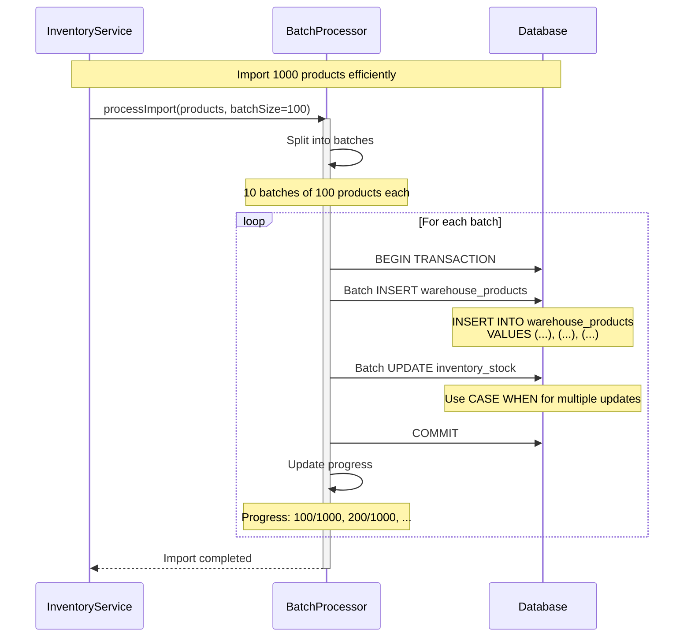
```mermaid
sequenceDiagram
    participant InvSvc as InventoryService
    participant BatchProcessor
    participant DB as Database
    
    Note over InvSvc,DB: Import 1000 products efficiently
    
    InvSvc->>BatchProcessor: processImport(products, batchSize=100)
    activate BatchProcessor
    
    BatchProcessor->>BatchProcessor: Split into batches
    Note over BatchProcessor: 10 batches of 100 products each
    
    loop For each batch
        BatchProcessor->>DB: BEGIN TRANSACTION
        
        BatchProcessor->>DB: Batch INSERT warehouse_products
        Note over DB: INSERT INTO warehouse_products<br/>VALUES (...), (...), (...)
        
        BatchProcessor->>DB: Batch UPDATE inventory_stock
        Note over DB: Use CASE WHEN for multiple updates
        
        BatchProcessor->>DB: COMMIT
        
        BatchProcessor->>BatchProcessor: Update progress
        Note over BatchProcessor: Progress: 100/1000, 200/1000, ...
    end
    
    BatchProcessor-->>InvSvc: Import completed
    deactivate BatchProcessor
```

### 6.2. Index Strategy for Performance

```sql
-- Indexes for warehouse operations

-- Fast lookup by SKU
CREATE INDEX idx_warehouse_products_sku 
ON warehouse_products(sku);

-- Fast lookup by serial number
CREATE UNIQUE INDEX idx_product_details_serial 
ON product_details(serial_number);

-- Fast stock queries
CREATE INDEX idx_inventory_stock_warehouse_product 
ON inventory_stock(warehouse_product_id);

-- Fast export order queries
CREATE INDEX idx_export_orders_status 
ON export_orders(status);

CREATE INDEX idx_export_orders_order_id 
ON export_orders(order_id);

-- Fast product detail queries by status
CREATE INDEX idx_product_details_status 
ON product_details(status, warehouse_product_id);

-- Composite index for stock validation
CREATE INDEX idx_inventory_stock_availability 
ON inventory_stock(warehouse_product_id, on_hand, reserved, damaged);
```

---

## 7. Tổng Kết

### 7.1. Key Takeaways

**Luồng Nhập Kho**:
- ✓ Validate dữ liệu Excel kỹ lưỡng trước khi import
- ✓ Sử dụng transaction để đảm bảo atomicity
- ✓ Tự động tạo supplier payable khi có thông tin NCC
- ✓ Ghi nhận bút toán kế toán cho công nợ

**Luồng Xuất Kho**:
- ✓ Validate stock availability trước khi tạo phiếu xuất
- ✓ Sử dụng serial number tracking cho traceability
- ✓ Pessimistic locking khi complete export để tránh race condition
- ✓ Tự động cập nhật order status sang READY_TO_SHIP

**Serial Number Management**:
- ✓ Format chuẩn: {SKU}-{YYYYMMDD}-{SEQUENCE}
- ✓ Lifecycle: IN_STOCK → RESERVED → SOLD
- ✓ Validation rules nghiêm ngặt khi scan
- ✓ Có thể rollback khi cancel export

**Concurrency Control**:
- ✓ Optimistic locking cho read-heavy operations
- ✓ Pessimistic locking cho critical sections
- ✓ Retry mechanism cho transient failures
- ✓ Proper error handling và rollback

### 7.2. Requirements Validation

| Requirement | Validated By | Status |
|-------------|--------------|--------|
| 3.1 - Parse Excel data | Section 1.1, 1.2 | ✓ |
| 3.2 - Create import transaction | Section 1.3 | ✓ |
| 3.3 - Increase stock quantity | Section 1.3 | ✓ |
| 3.4 - Create supplier payable | Section 1.3 | ✓ |
| 3.5 - Reject invalid import | Section 1.2, 1.4 | ✓ |
| 4.1 - Validate stock availability | Section 2.1, 2.2 | ✓ |
| 4.2 - Generate/scan serial numbers | Section 2.3, 3.1 | ✓ |
| 4.3 - Decrease stock on export | Section 2.4 | ✓ |
| 4.4 - Reject insufficient stock | Section 2.1, 2.2 | ✓ |
| 4.5 - Restore stock on cancel | Section 2.5 | ✓ |
| 15.1 - Generate unique serials | Section 3.1 | ✓ |
| 15.2 - Validate serial on scan | Section 2.3, 3.3 | ✓ |
| 15.3 - Mark serial as assigned | Section 2.3, 2.4 | ✓ |
| 15.4 - Display serials in export | Section 2.3 | ✓ |
| 15.5 - Reject invalid serial | Section 2.3, 3.3 | ✓ |

**Tất cả requirements đã được validate thông qua các sequence diagrams chi tiết.**

---

## Phụ Lục: Sample Data Flow

### Import Example
```
Input Excel:
SKU         | Name      | Quantity | Price  | Supplier
LAPTOP001   | Laptop A  | 10       | 15000  | SUPPLIER001
MOUSE002    | Mouse B   | 50       | 200    | SUPPLIER001

Result:
- Purchase Order: PO-20241223-001
- Warehouse Products: 2 records (or updated if exists)
- Inventory Stock: on_hand += quantities
- Supplier Payable: Total = (10*15000) + (50*200) = 160,000
- Financial Transaction: EXPENSE, COST_OF_GOODS, 160,000
```

### Export Example
```
Input:
Order ID: 123
Order Items:
  - Product: LAPTOP001, Quantity: 2
  - Product: MOUSE002, Quantity: 5

Process:
1. Validate stock: LAPTOP001 (available: 10 >= 2 ✓), MOUSE002 (available: 50 >= 5 ✓)
2. Create Export Order: EXP-20241223-001
3. Scan serials:
   - LAPTOP001-20241223-00001
   - LAPTOP001-20241223-00002
   - MOUSE002-20241223-00001
   - MOUSE002-20241223-00002
   - MOUSE002-20241223-00003
   - MOUSE002-20241223-00004
   - MOUSE002-20241223-00005
4. Complete export:
   - LAPTOP001: on_hand: 10→8, reserved: 0→0
   - MOUSE002: on_hand: 50→45, reserved: 0→0
   - Order status: CONFIRMED → READY_TO_SHIP
   - Serials: IN_STOCK → SOLD
```

