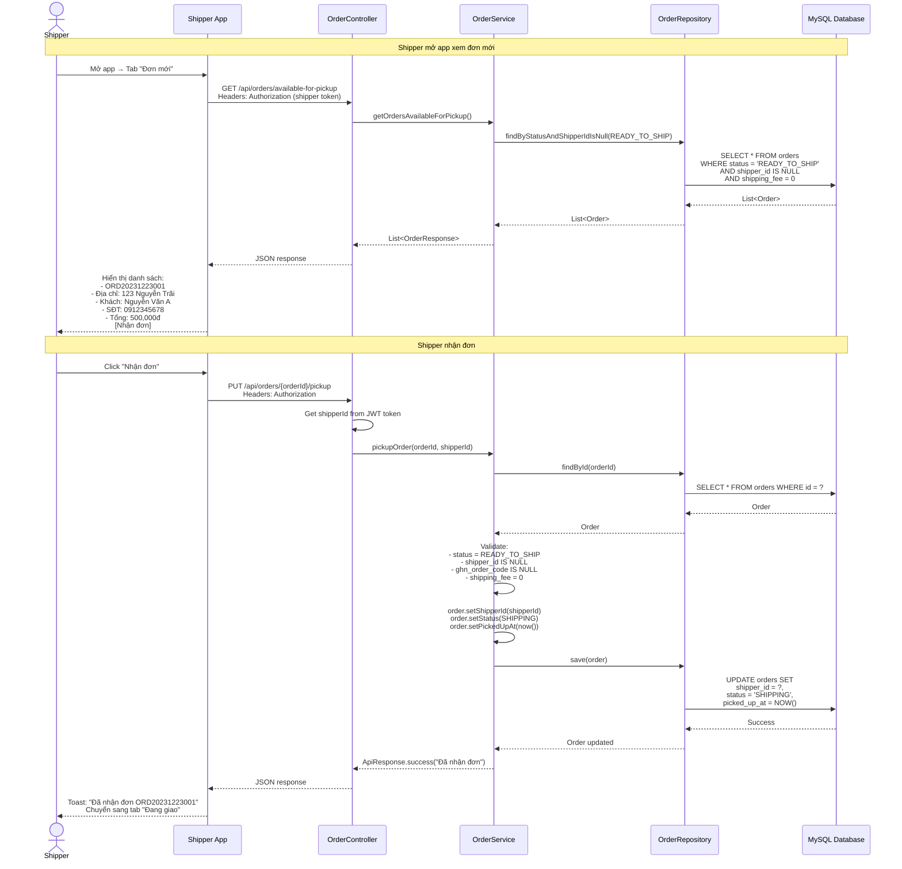

# Luồng Shipper Tự Nhận Đơn

## Tổng Quan

Shipper tự nhận đơn khi có mặt tại cửa hàng. Mỗi ca chỉ có 1 shipper, không cần admin phân đơn. Ai đến trước nhận trước.

---

## SƠ ĐỒ TUẦN TỰ



---

## API ENDPOINTS

### 1. Lấy danh sách đơn có thể nhận

**Endpoint**: `GET /api/orders/available-for-pickup`

**Auth**: Shipper only

**Controller**:
```java
@GetMapping("/available-for-pickup")
@PreAuthorize("hasAuthority('SHIPPER')")
public ApiResponse getOrdersAvailableForPickup() {
    return orderService.getOrdersAvailableForPickup();
}
```

**Service**:
```java
public ApiResponse getOrdersAvailableForPickup() {
    List<Order> orders = orderRepository
        .findByStatusAndShipperIdIsNullAndShippingFeeAndGhnOrderCodeIsNull(
            OrderStatus.READY_TO_SHIP, 0.0
        );
    
    List<OrderResponse> responses = orders.stream()
        .map(this::toOrderResponse)
        .collect(Collectors.toList());
    
    return ApiResponse.success("Đơn hàng có thể nhận", responses);
}
```

**SQL**:
```sql
SELECT * FROM orders 
WHERE status = 'READY_TO_SHIP'
  AND shipper_id IS NULL
  AND shipping_fee = 0
  AND ghn_order_code IS NULL
ORDER BY created_at ASC;
```

**Response**:
```json
{
  "success": true,
  "message": "Đơn hàng có thể nhận",
  "data": [
    {
      "orderId": 123,
      "orderCode": "ORD20231223001",
      "customerName": "Nguyễn Văn A",
      "customerPhone": "0912345678",
      "shippingAddress": "123 Nguyễn Trãi, Thanh Xuân, Hà Nội",
      "total": 500000,
      "paymentMethod": "COD",
      "itemCount": 3
    }
  ]
}
```

---

### 2. Shipper nhận đơn

**Endpoint**: `PUT /api/orders/{orderId}/pickup`

**Auth**: Shipper only

**Controller**:
```java
@PutMapping("/{orderId}/pickup")
@PreAuthorize("hasAuthority('SHIPPER')")
public ApiResponse pickupOrder(
    @PathVariable Long orderId,
    Authentication authentication
) {
    Long shipperId = getShipperIdFromAuth(authentication);
    return orderService.pickupOrder(orderId, shipperId);
}

private Long getShipperIdFromAuth(Authentication authentication) {
    String email = authentication.getName();
    Employee shipper = employeeRepository.findByEmail(email)
        .orElseThrow(() -> new RuntimeException("Không tìm thấy shipper"));
    return shipper.getId();
}
```

**Service**:
```java
@Transactional
public ApiResponse pickupOrder(Long orderId, Long shipperId) {
    // Get order
    Order order = orderRepository.findById(orderId)
        .orElseThrow(() -> new RuntimeException("Không tìm thấy đơn hàng"));
    
    // Validate
    if (order.getStatus() != OrderStatus.READY_TO_SHIP) {
        return ApiResponse.error("Đơn hàng chưa sẵn sàng giao");
    }
    
    if (order.getShipperId() != null) {
        return ApiResponse.error("Đơn hàng đã được shipper khác nhận");
    }
    
    if (order.getGhnOrderCode() != null) {
        return ApiResponse.error("Đơn hàng đang giao qua GHN");
    }
    
    if (order.getShippingFee() > 0) {
        return ApiResponse.error("Đơn hàng này giao qua GHN");
    }
    
    // Update order
    order.setShipperId(shipperId);
    order.setStatus(OrderStatus.SHIPPING);
    order.setPickedUpAt(LocalDateTime.now());
    
    orderRepository.save(order);
    
    log.info("Shipper {} picked up order {}", shipperId, order.getOrderCode());
    
    return ApiResponse.success("Đã nhận đơn " + order.getOrderCode());
}
```

**SQL**:
```sql
UPDATE orders 
SET shipper_id = 123,
    status = 'SHIPPING',
    picked_up_at = '2023-12-23 14:30:00'
WHERE id = 456;
```

**Response**:
```json
{
  "success": true,
  "message": "Đã nhận đơn ORD20231223001",
  "data": null
}
```

---

### 3. Xem đơn đang giao

**Endpoint**: `GET /api/orders/my-deliveries`

**Auth**: Shipper only

**Controller**:
```java
@GetMapping("/my-deliveries")
@PreAuthorize("hasAuthority('SHIPPER')")
public ApiResponse getMyDeliveries(Authentication authentication) {
    Long shipperId = getShipperIdFromAuth(authentication);
    return orderService.getMyDeliveries(shipperId);
}
```

**Service**:
```java
public ApiResponse getMyDeliveries(Long shipperId) {
    List<Order> orders = orderRepository.findByShipperIdAndStatus(
        shipperId,
        OrderStatus.SHIPPING
    );
    
    List<OrderResponse> responses = orders.stream()
        .map(this::toOrderResponse)
        .collect(Collectors.toList());
    
    return ApiResponse.success("Đơn hàng đang giao", responses);
}
```

---

### 4. Hoàn thành giao hàng

**Endpoint**: `PUT /api/orders/{orderId}/complete-delivery`

**Request Body**:
```json
{
  "status": "DELIVERED",
  "note": "Đã giao hàng thành công"
}
```

**Controller**:
```java
@PutMapping("/{orderId}/complete-delivery")
@PreAuthorize("hasAuthority('SHIPPER')")
public ApiResponse completeDelivery(
    @PathVariable Long orderId,
    @RequestBody CompleteDeliveryRequest request,
    Authentication authentication
) {
    Long shipperId = getShipperIdFromAuth(authentication);
    return orderService.completeDelivery(orderId, shipperId, request);
}
```

**Service**:
```java
@Transactional
public ApiResponse completeDelivery(Long orderId, Long shipperId, CompleteDeliveryRequest request) {
    Order order = orderRepository.findById(orderId)
        .orElseThrow(() -> new RuntimeException("Không tìm thấy đơn hàng"));
    
    // Validate
    if (!order.getShipperId().equals(shipperId)) {
        return ApiResponse.error("Bạn không phải shipper của đơn hàng này");
    }
    
    if (order.getStatus() != OrderStatus.SHIPPING) {
        return ApiResponse.error("Đơn hàng không ở trạng thái đang giao");
    }
    
    // Update order
    order.setStatus(OrderStatus.DELIVERED);
    order.setDeliveredAt(LocalDateTime.now());
    order.setDeliveryNote(request.getNote());
    
    orderRepository.save(order);
    
    return ApiResponse.success("Đã cập nhật trạng thái giao hàng");
}
```

---

## DATABASE

**orders table** (thêm columns):
```sql
ALTER TABLE orders 
ADD COLUMN shipper_id BIGINT,
ADD COLUMN picked_up_at DATETIME,
ADD COLUMN delivery_note TEXT,
ADD FOREIGN KEY (shipper_id) REFERENCES employees(id);
```

---

## SHIPPER APP UI

### Tab "Đơn mới"

```
┌─────────────────────────────────────────┐
│ Đơn Mới (3)                             │
├─────────────────────────────────────────┤
│                                         │
│ ┌─────────────────────────────────┐   │
│ │ ORD20231223001                  │   │
│ │ 📦 3 sản phẩm                   │   │
│ │ 📍 123 Nguyễn Trãi, Thanh Xuân  │   │
│ │ 👤 Nguyễn Văn A - 0912345678    │   │
│ │ 💰 500,000đ (COD)               │   │
│ │                                 │   │
│ │          [Nhận đơn]             │   │
│ └─────────────────────────────────┘   │
└─────────────────────────────────────────┘
```

### Tab "Đang giao"

```
┌─────────────────────────────────────────┐
│ Đang Giao (2)                           │
├─────────────────────────────────────────┤
│                                         │
│ ┌─────────────────────────────────┐   │
│ │ ORD20231223001                  │   │
│ │ 📍 123 Nguyễn Trãi              │   │
│ │ 👤 Nguyễn Văn A - 0912345678    │   │
│ │ 💰 500,000đ (COD)               │   │
│ │                                 │   │
│ │ [Xem bản đồ] [Đã giao]         │   │
│ └─────────────────────────────────┘   │
└─────────────────────────────────────────┘
```

---

## TÓM TẮT

**Luồng**:
1. Shipper mở app → Tab "Đơn mới"
2. Xem danh sách đơn READY_TO_SHIP (chưa có shipper)
3. Click "Nhận đơn"
4. Hệ thống update: shipper_id, status = SHIPPING
5. Đơn chuyển sang tab "Đang giao"
6. Shipper giao hàng → Click "Đã giao"
7. Hệ thống update: status = DELIVERED

**Key points**:
- **Không cần admin**: Shipper tự nhận
- **Ai đến trước nhận trước**: Mỗi ca 1 shipper
- **Chỉ đơn nội thành**: shipping_fee = 0
- **Không liên quan ShippingService**: Không gọi GHN API

---

**Document Version**: 1.0  
**Last Updated**: 2024-12-25
