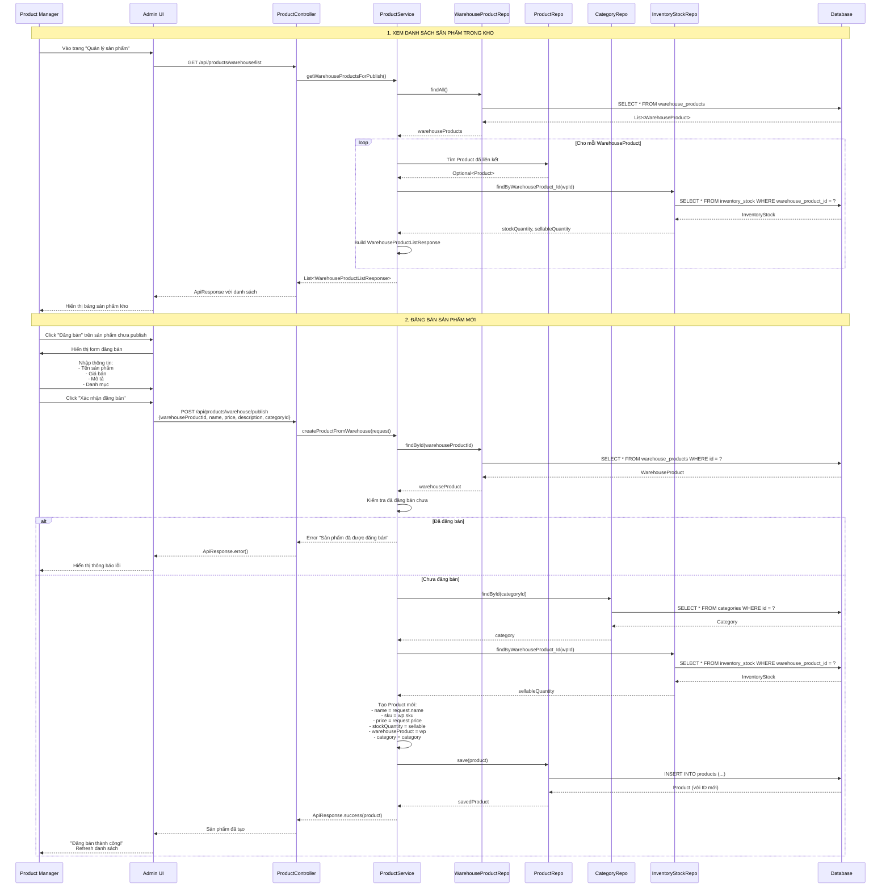
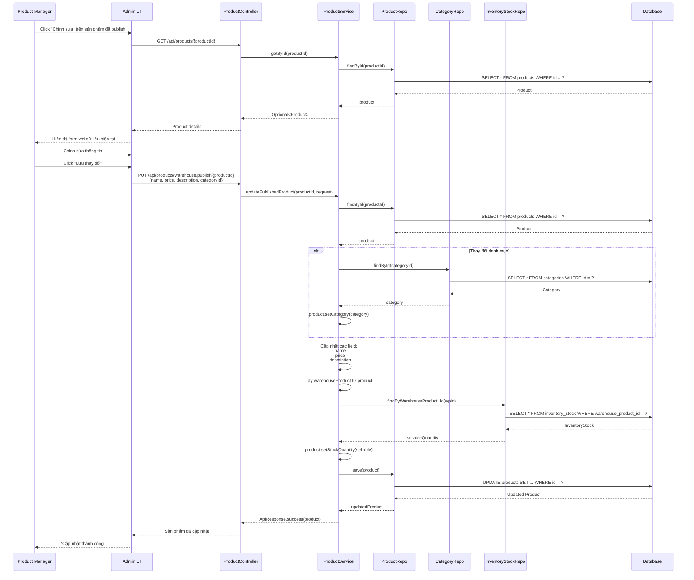
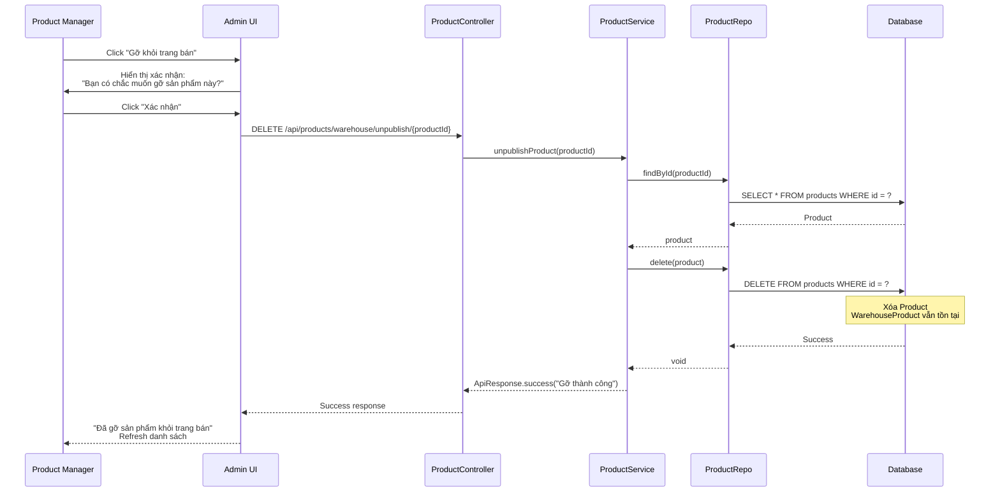
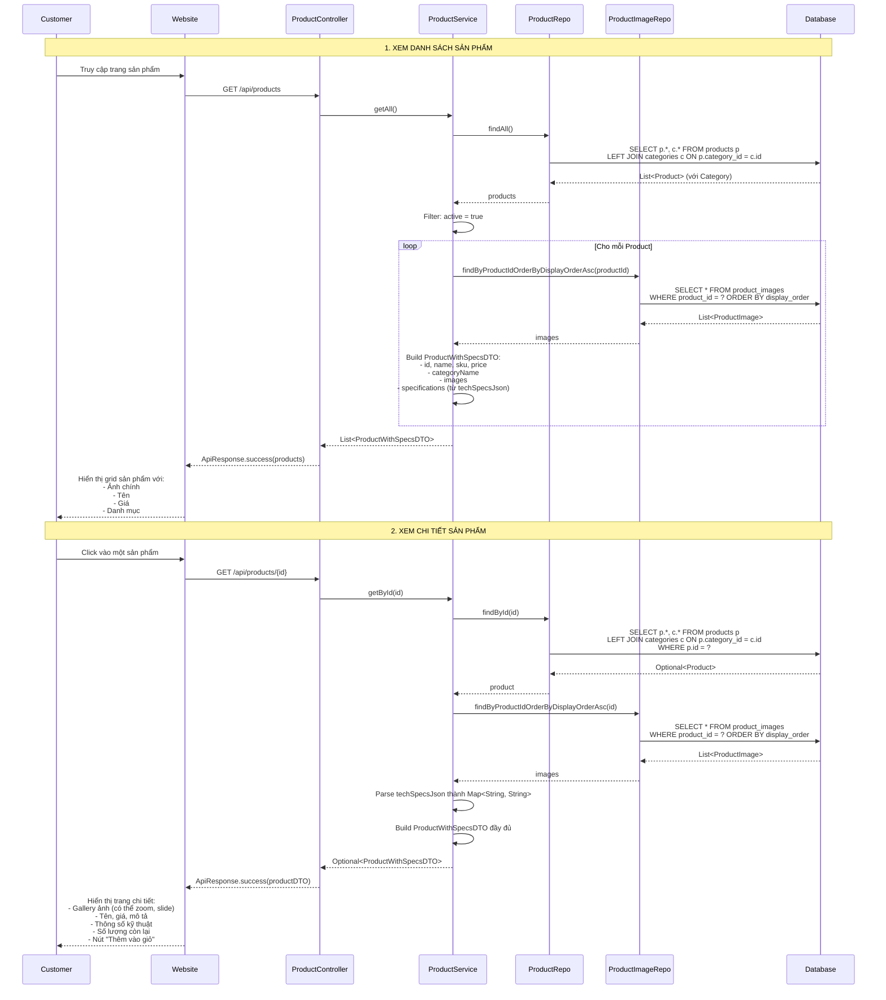
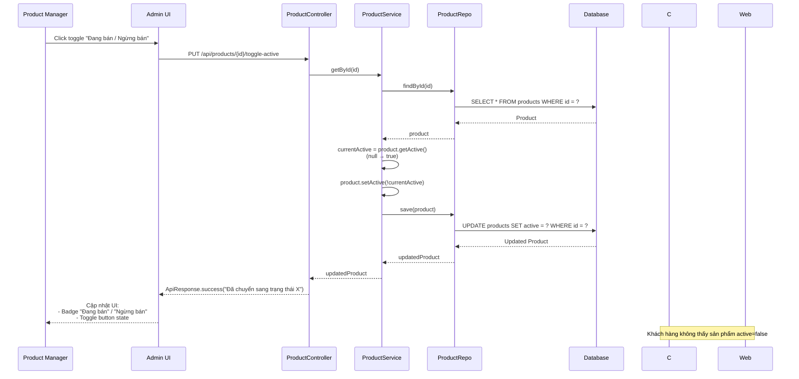
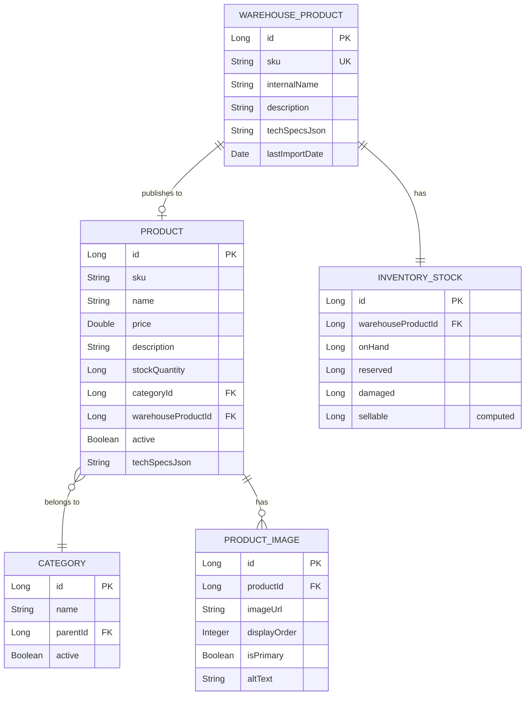

```mermaid
sequenceDiagram
    participant PM as Product Manager
    participant UI as Admin UI
    participant API as ProductController
    participant Service as ProductService
    participant PRepo as ProductRepo
    participant ImgRepo as ProductImageRepo
    participant Cloud as Cloudinary
    participant DB as Database
    
    Note over PM,DB: 1. THÊM HÌNH ẢNH MỚI
    
    PM->>UI: Click "Thêm ảnh"
    UI->>PM: Hiển thị dialog upload
    PM->>UI: Chọn file ảnh
    UI->>Cloud: Upload ảnh
    Cloud-->>UI: imageUrl
    
    UI->>API: POST /api/products/{productId}/images<br/>{imageUrl, isPrimary}
    API->>Service: addProductImage(productId, imageUrl, isPrimary)
    
    Service->>PRepo: findById(productId)
    PRepo->>DB: SELECT * FROM products WHERE id = ?
    DB-->>PRepo: Product
    PRepo-->>Service: product
    
    alt isPrimary = true
        Service->>ImgRepo: findByProductIdAndIsPrimaryTrue(productId)
        ImgRepo->>DB: SELECT * FROM product_images<br/>WHERE product_id = ? AND is_primary = true
        DB-->>ImgRepo: Optional<ProductImage>
        ImgRepo-->>Service: currentPrimaryImage
        
        Service->>Service: currentPrimaryImage.setIsPrimary(false)
        Service->>ImgRepo: save(currentPrimaryImage)
        ImgRepo->>DB: UPDATE product_images SET is_primary = false
    end
    
    Service->>ImgRepo: countByProductId(productId)
    ImgRepo->>DB: SELECT COUNT(*) FROM product_images WHERE product_id = ?
    DB-->>ImgRepo: count
    ImgRepo-->>Service: displayOrder = count
    
    Service->>Service: Tạo ProductImage mới:<br/>- imageUrl<br/>- displayOrder<br/>- isPrimary
    
    Service->>ImgRepo: save(productImage)
    ImgRepo->>DB: INSERT INTO product_images (...)
    DB-->>ImgRepo: ProductImage (với ID)
    ImgRepo-->>Service: savedImage
    
    Service-->>API: ApiResponse.success(imageDTO)
    API-->>UI: Ảnh đã thêm
    UI-->>PM: Hiển thị ảnh mới trong gallery
    
    Note over PM,DB: 2. ĐẶT ẢNH CHÍNH
    
    PM->>UI: Click "Đặt làm ảnh chính" trên một ảnh
    UI->>API: PUT /api/products/{productId}/images/{imageId}/primary
    API->>Service: setPrimaryImage(productId, imageId)
    
    Service->>ImgRepo: findByProductIdOrderByDisplayOrderAsc(productId)
    ImgRepo->>DB: SELECT * FROM product_images<br/>WHERE product_id = ? ORDER BY display_order
    DB-->>ImgRepo: List<ProductImage>
    ImgRepo-->>Service: allImages
    
    Service->>Service: Loop: Set tất cả isPrimary = false
    Service->>ImgRepo: saveAll(allImages)
    ImgRepo->>DB: UPDATE product_images SET is_primary = false
    
    Service->>ImgRepo: findById(imageId)
    ImgRepo->>DB: SELECT * FROM product_images WHERE id = ?
    DB-->>ImgRepo: ProductImage
    ImgRepo-->>Service: selectedImage
    
    Service->>Service: selectedImage.setIsPrimary(true)
    Service->>ImgRepo: save(selectedImage)
    ImgRepo->>DB: UPDATE product_images SET is_primary = true WHERE id = ?
    DB-->>ImgRepo: Updated image
    ImgRepo-->>Service: primaryImage
    
    Service-->>API: ApiResponse.success(imageDTO)
    API-->>UI: Success
    UI-->>PM: Cập nhật UI, ảnh chính có badge "Chính"
    
    Note over PM,DB: 3. XÓA HÌNH ẢNH
    
    PM->>UI: Click "Xóa" trên một ảnh
    UI->>PM: Xác nhận "Bạn có chắc muốn xóa?"
    PM->>UI: Click "Xác nhận"
    
    UI->>API: DELETE /api/products/images/{imageId}
    API->>Service: deleteProductImage(imageId)
    
    Service->>ImgRepo: findById(imageId)
    ImgRepo->>DB: SELECT * FROM product_images WHERE id = ?
    DB-->>ImgRepo: ProductImage
    ImgRepo-->>Service: image (productId, wasPrimary)
    
    Service->>ImgRepo: delete(image)
    ImgRepo->>DB: DELETE FROM product_images WHERE id = ?
    DB-->>ImgRepo: Success
    
    alt wasPrimary = true
        Service->>ImgRepo: findByProductIdOrderByDisplayOrderAsc(productId)
        ImgRepo->>DB: SELECT * FROM product_images<br/>WHERE product_id = ? ORDER BY display_order LIMIT 1
        DB-->>ImgRepo: List<ProductImage>
        ImgRepo-->>Service: remainingImages
        
        alt Còn ảnh khác
            Service->>Service: firstImage.setIsPrimary(true)
            Service->>ImgRepo: save(firstImage)
            ImgRepo->>DB: UPDATE product_images SET is_primary = true
        end
    end
    
    Service-->>API: ApiResponse.success("Xóa thành công")
    API-->>UI: Success
    UI-->>PM: Xóa ảnh khỏi gallery
    
    Note over PM,DB: 4. SẮP XẾP LẠI THỨ TỰ ẢNH
    
    PM->>UI: Kéo thả ảnh để sắp xếp
    UI->>UI: Cập nhật thứ tự trong UI
    PM->>UI: Click "Lưu thứ tự"
    
    UI->>API: PUT /api/products/{productId}/images/reorder<br/>{imageIds: [3, 1, 2, 4]}
    API->>Service: reorderProductImages(productId, imageIds)
    
    loop Cho mỗi imageId
        Service->>ImgRepo: findById(imageId)
        ImgRepo->>DB: SELECT * FROM product_images WHERE id = ?
        DB-->>ImgRepo: ProductImage
        ImgRepo-->>Service: image
        
        Service->>Service: image.setDisplayOrder(index)
        Service->>ImgRepo: save(image)
        ImgRepo->>DB: UPDATE product_images SET display_order = ? WHERE id = ?
    end
    
    Service-->>API: ApiResponse.success("Sắp xếp thành công")
    API-->>UI: Success
    UI-->>PM: "Đã lưu thứ tự ảnh"
```

# Sơ Đồ Tuần Tự - Quản Lý Sản Phẩm và Đăng Bán Từ Kho

## Tổng Quan

Tài liệu này mô tả các sơ đồ tuần tự (sequence diagrams) cho luồng nghiệp vụ quản lý sản phẩm, đặc biệt là quy trình đăng bán sản phẩm từ kho lên trang bán hàng.

---

## 1. Sơ Đồ Tổng Quan - Luồng Đăng Bán Sản Phẩm Từ Kho

### Mô tả
Luồng này cho phép Product Manager/Admin lấy sản phẩm từ kho (WarehouseProduct) và đăng bán lên trang web (Product) để khách hàng có thể mua.

### Sơ Đồ Tuần Tự



---

## 2. Sơ Đồ Chi Tiết - Cập Nhật Sản Phẩm Đã Đăng Bán

### Mô tả
Sau khi đăng bán, Product Manager có thể cập nhật thông tin sản phẩm (tên, giá, mô tả, danh mục).

### Sơ Đồ Tuần Tự




---

## 3. Sơ Đồ - Gỡ Sản Phẩm Khỏi Trang Bán (Unpublish)

### Mô tả
Product Manager có thể gỡ sản phẩm khỏi trang bán (xóa Product nhưng giữ nguyên WarehouseProduct).

### Sơ Đồ Tuần Tự



---

## 4. Sơ Đồ - Quản Lý Hình Ảnh Sản Phẩm

### Mô tả
Product Manager thêm, xóa, sắp xếp hình ảnh cho sản phẩm đã đăng bán.

### Sơ Đồ Tuần Tự



---

## 5. Sơ Đồ - Khách Hàng Xem Sản Phẩm

### Mô tả
Khách hàng xem danh sách và chi tiết sản phẩm đã được đăng bán.

### Sơ Đồ Tuần Tự



---

## 6. Sơ Đồ - Bật/Tắt Trạng Thái Bán (Toggle Active)

### Mô tả
Product Manager có thể tạm ngừng bán hoặc mở lại bán sản phẩm mà không cần xóa.

### Sơ Đồ Tuần Tự



---

## 7. Tổng Hợp Các API Endpoints

### Bảng API cho Product Manager/Admin

| Endpoint | Method | Mô tả | Request Body | Response |
|----------|--------|-------|--------------|----------|
| `/api/products/warehouse/list` | GET | Lấy danh sách sản phẩm kho | - | List<WarehouseProductListResponse> |
| `/api/products/warehouse/publish` | POST | Đăng bán sản phẩm từ kho | CreateProductFromWarehouseRequest | Product |
| `/api/products/warehouse/publish/{id}` | PUT | Cập nhật sản phẩm đã đăng | CreateProductFromWarehouseRequest | Product |
| `/api/products/warehouse/unpublish/{id}` | DELETE | Gỡ sản phẩm khỏi trang bán | - | Success message |
| `/api/products/{id}/toggle-active` | PUT | Bật/tắt trạng thái bán | - | Product |
| `/api/products/{id}/images` | POST | Thêm ảnh sản phẩm | {imageUrl, isPrimary} | ProductImageDTO |
| `/api/products/{id}/images/{imgId}/primary` | PUT | Đặt ảnh chính | - | ProductImageDTO |
| `/api/products/images/{imgId}` | DELETE | Xóa ảnh | - | Success message |
| `/api/products/{id}/images/reorder` | PUT | Sắp xếp lại ảnh | {imageIds: []} | Success message |

### Bảng API cho Khách Hàng

| Endpoint | Method | Mô tả | Query Params | Response |
|----------|--------|-------|--------------|----------|
| `/api/products` | GET | Danh sách sản phẩm (active=true) | - | List<ProductWithSpecsDTO> |
| `/api/products/{id}` | GET | Chi tiết sản phẩm | - | ProductWithSpecsDTO |
| `/api/products/search-by-specs` | GET | Tìm theo thông số | keyword | List<Product> |
| `/api/products/filter-by-specs` | GET | Lọc theo thông số | key, value | List<Product> |

---

## 8. Luồng Dữ Liệu và Quan Hệ

### Mối Quan Hệ Giữa Các Entity



### Luồng Dữ Liệu Khi Đăng Bán

```
1. WarehouseProduct (Kho)
   ↓ (Product Manager chọn)
2. Nhập thông tin: name, price, description, category
   ↓
3. Lấy sellableQuantity từ InventoryStock
   ↓
4. Tạo Product mới
   ↓ (liên kết)
5. Product.warehouseProductId → WarehouseProduct.id
   ↓
6. Khách hàng thấy Product trên website
```

### Đồng Bộ Số Lượng Tồn Kho

```
InventoryStock.sellable (Source of Truth)
   ↓ (sync khi update)
Product.stockQuantity (Display cho khách hàng)
```

**Khi nào sync:**
- Khi đăng bán sản phẩm mới
- Khi cập nhật sản phẩm đã đăng
- Khi nhập/xuất kho (tự động qua event)

---

## 9. Kết Luận

### Điểm Mạnh Của Thiết Kế

1. **Tách biệt rõ ràng**: WarehouseProduct (nội bộ) vs Product (public)
2. **Linh hoạt**: Có thể publish/unpublish mà không mất dữ liệu kho
3. **Quản lý ảnh độc lập**: Dễ dàng thêm/xóa/sắp xếp ảnh
4. **Đồng bộ tồn kho**: Luôn lấy từ InventoryStock (single source of truth)
5. **Soft delete**: Dùng active flag thay vì xóa cứng

### Các Bước Trong Quy Trình Đăng Bán

1. **Nhập hàng vào kho** → Tạo WarehouseProduct + InventoryStock
2. **Product Manager xem danh sách kho** → API trả về sản phẩm chưa publish
3. **Chọn sản phẩm và đăng bán** → Tạo Product liên kết với WarehouseProduct
4. **Thêm hình ảnh** → Upload Cloudinary, lưu ProductImage
5. **Khách hàng xem và mua** → Chỉ thấy Product có active=true
6. **Cập nhật/Gỡ bán** → Update hoặc delete Product (WarehouseProduct vẫn tồn tại)
