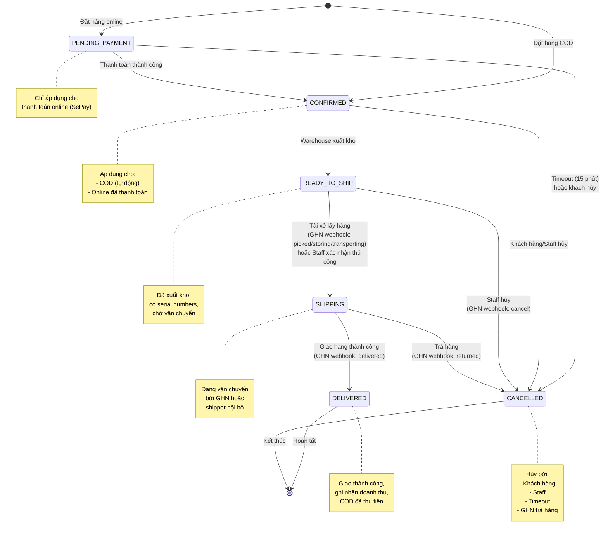
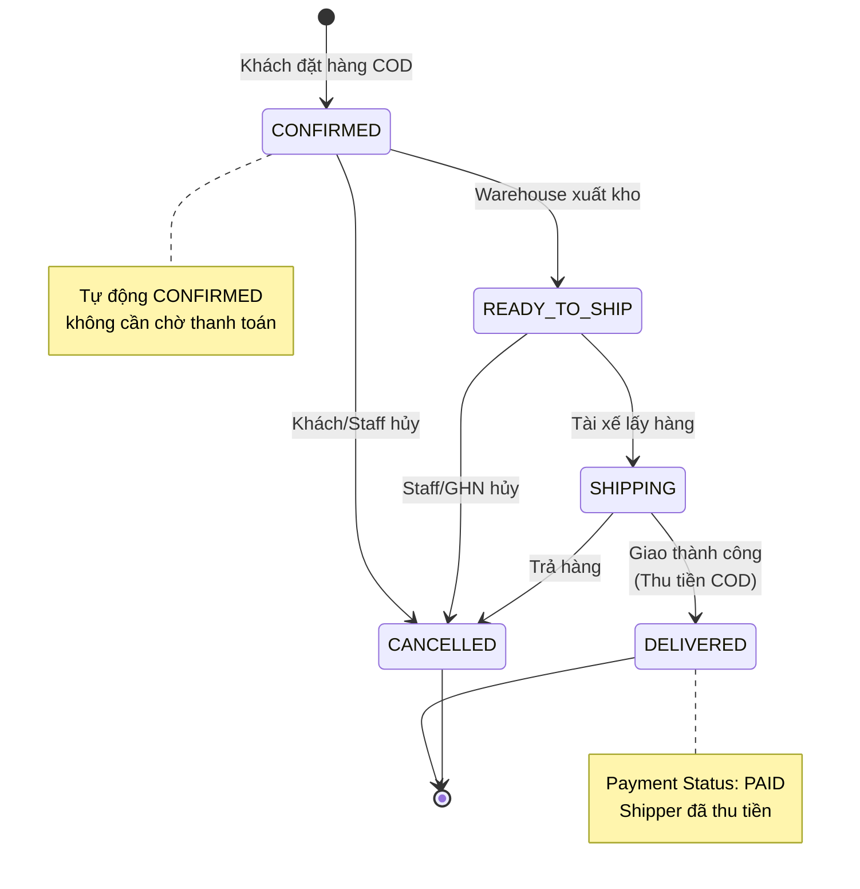
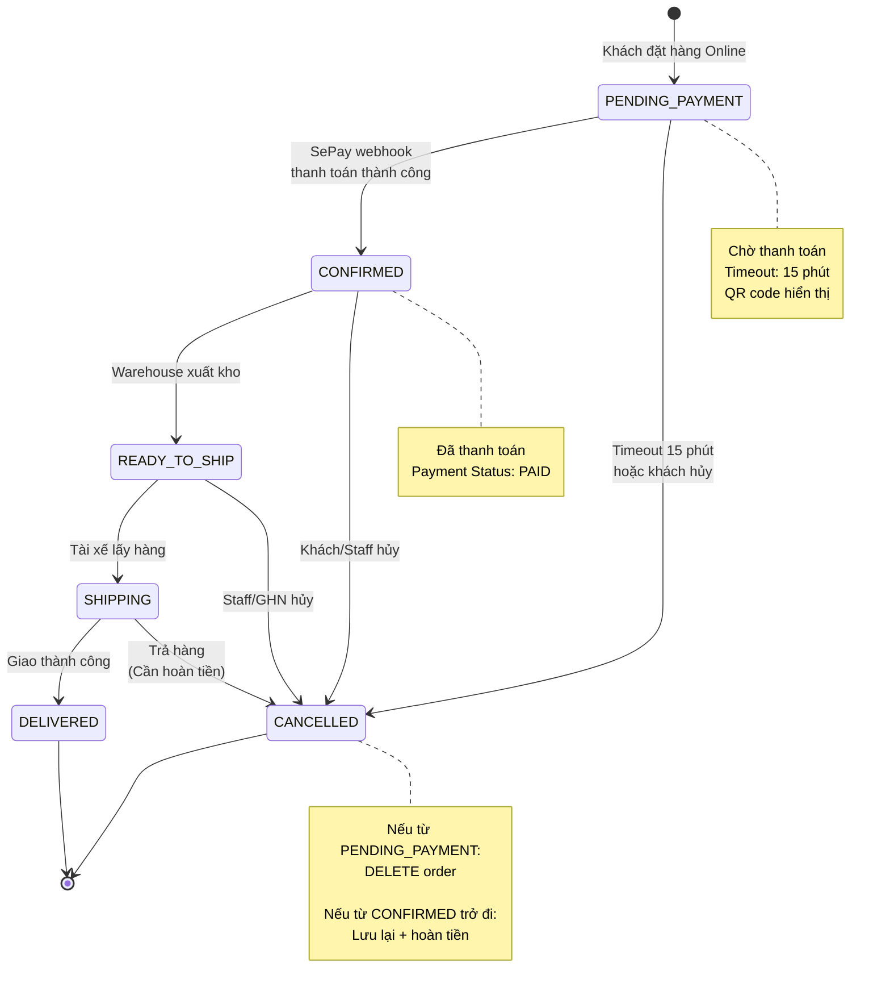
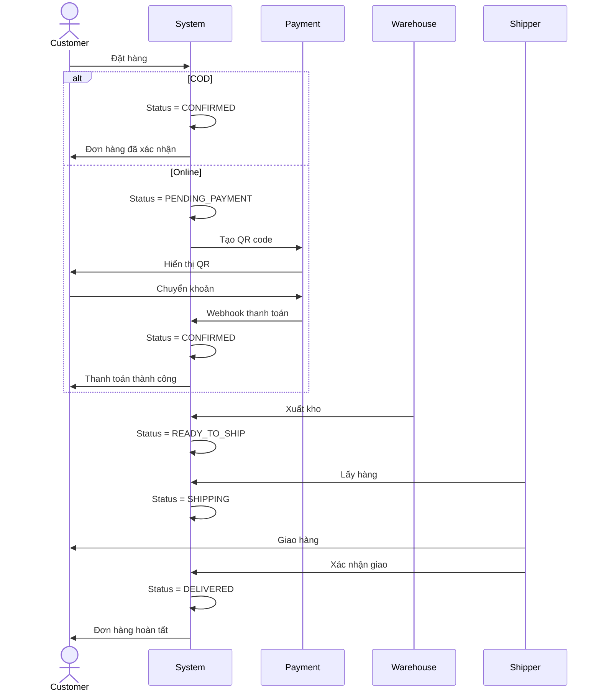
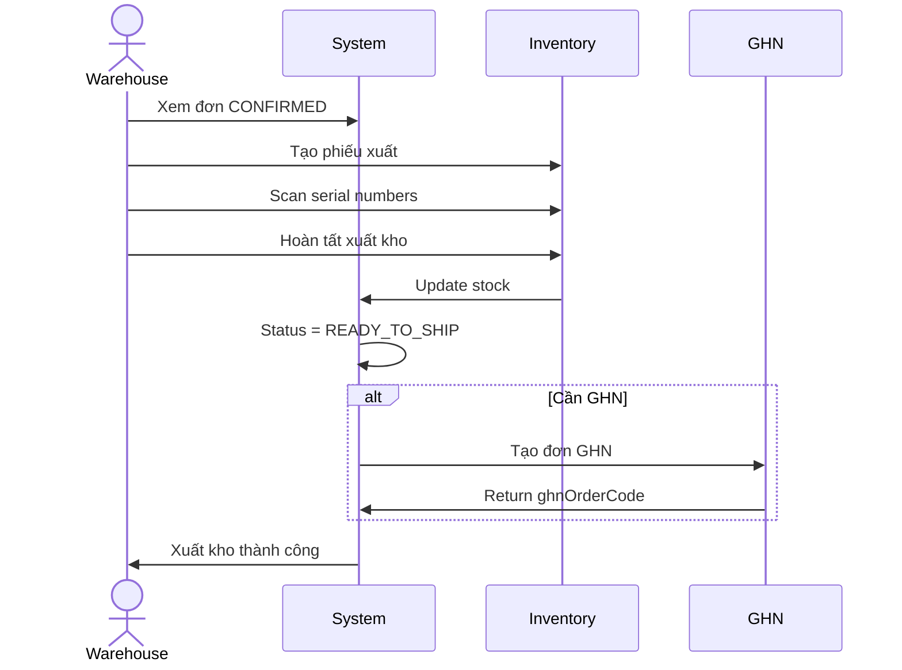
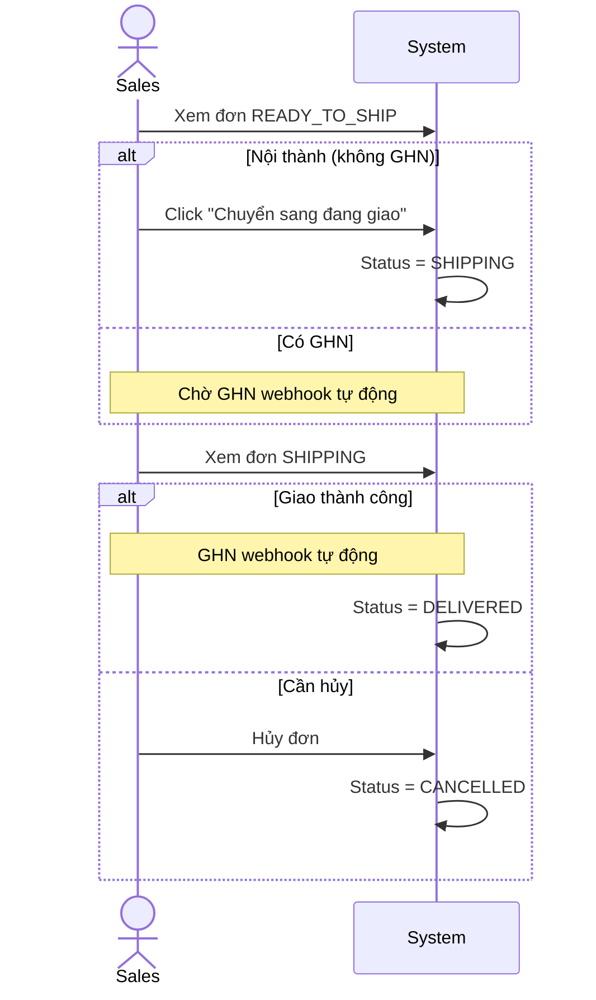

# Sơ Đồ State Machine - Trạng Thái Đơn Hàng

## Tổng Quan

Tài liệu này mô tả chi tiết state machine cho các trạng thái đơn hàng trong hệ thống TMDT, bao gồm:
- Sơ đồ trạng thái (State Diagram)
- Điều kiện chuyển trạng thái (Transition Conditions)
- Business rules cho từng transition
- Các trạng thái hợp lệ và không hợp lệ

## Danh Sách Trạng Thái

### Trạng Thái Chính

1. **PENDING_PAYMENT** - Chờ thanh toán (đơn online)
2. **CONFIRMED** - Đã xác nhận, chờ xuất kho
3. **READY_TO_SHIP** - Đã xuất kho, chờ tài xế lấy hàng
4. **PICKED_UP** - Tài xế đã lấy hàng (deprecated, không sử dụng)
5. **SHIPPING** - Đang giao hàng
6. **DELIVERY_FAILED** - Giao hàng thất bại (deprecated, không sử dụng)
7. **DELIVERED** - Đã giao hàng thành công
8. **COMPLETED** - Hoàn thành (deprecated, không sử dụng)
9. **CANCELLED** - Đã hủy
10. **RETURNED** - Đã trả hàng (deprecated, không sử dụng)
11. **PROCESSING** - Đang xử lý (deprecated, không sử dụng)

### Trạng Thái Đang Sử Dụng

Hệ thống hiện tại sử dụng các trạng thái sau:
- PENDING_PAYMENT
- CONFIRMED
- READY_TO_SHIP
- SHIPPING
- DELIVERED
- CANCELLED

## Sơ Đồ State Machine




## Chi Tiết Các Transition

### 1. [*] → PENDING_PAYMENT

**Điều kiện:**
- Khách hàng chọn phương thức thanh toán Online (SePay)
- Giỏ hàng không rỗng
- Tất cả sản phẩm có đủ tồn kho (available quantity)
- Địa chỉ giao hàng hợp lệ (province, district, ward, address)

**Hành động:**
- Tạo order với status = PENDING_PAYMENT
- Tạo payment record với QR code
- Reserve stock (tăng reserved quantity)
- Set expiredAt = now + 15 phút
- Không xóa cart (giữ lại để khách có thể quay lại)

**Business Rules:**
- Đơn hàng có thời gian timeout 15 phút
- Nếu không thanh toán trong 15 phút → tự động CANCELLED
- Stock được reserve để không bán cho người khác
- Khách hàng có thể hủy đơn bất cứ lúc nào

**Actor:** Customer (Frontend)

**Code Reference:** `OrderServiceImpl.createOrderFromCart()`


### 2. [*] → CONFIRMED

**Điều kiện:**
- Khách hàng chọn phương thức thanh toán COD
- Giỏ hàng không rỗng
- Tất cả sản phẩm có đủ tồn kho (available quantity)
- Địa chỉ giao hàng hợp lệ

**Hành động:**
- Tạo order với status = CONFIRMED
- Reserve stock (tăng reserved quantity)
- Set confirmedAt = now
- Xóa cart items
- Không tạo payment record (COD thu tiền khi giao)

**Business Rules:**
- Đơn COD tự động CONFIRMED, không cần chờ thanh toán
- Khách hàng có thể hủy đơn trước khi xuất kho
- Staff có thể hủy đơn bất cứ lúc nào trước khi giao hàng

**Actor:** Customer (Frontend)

**Code Reference:** `OrderServiceImpl.createOrderFromCart()`

---

### 3. PENDING_PAYMENT → CONFIRMED

**Điều kiện:**
- Payment status = COMPLETED
- SePay webhook xác nhận thanh toán thành công
- Số tiền thanh toán khớp với order total

**Hành động:**
- Update order status = CONFIRMED
- Update payment status = COMPLETED
- Set confirmedAt = now
- Xóa cart items
- Tạo financial transaction (ghi nhận tiền vào)

**Business Rules:**
- Webhook từ SePay phải verify signature
- Nếu số tiền không khớp → flag cho accountant review
- Sau khi CONFIRMED, đơn hàng sẵn sàng cho warehouse xuất kho

**Actor:** SePay Webhook (Automatic)

**Code Reference:** `PaymentService.handleWebhook()`

---

### 4. PENDING_PAYMENT → CANCELLED

**Điều kiện (Timeout):**
- Payment expiredAt < now
- Payment status vẫn là PENDING
- Scheduler job chạy mỗi 5 phút

**Điều kiện (Khách hủy):**
- Khách hàng click "Hủy đơn"
- Order status = PENDING_PAYMENT

**Hành động:**
- Delete order (không lưu lại)
- Delete payment record
- Release reserved stock (giảm reserved quantity)
- Gửi email thông báo (nếu timeout)

**Business Rules:**
- Đơn PENDING_PAYMENT bị hủy sẽ bị XÓA hoàn toàn khỏi DB
- Không lưu lịch sử vì chưa có giao dịch thực tế
- Stock được giải phóng ngay lập tức

**Actor:** 
- PaymentScheduler (Automatic - Timeout)
- Customer (Manual - Cancel)

**Code Reference:** 
- `PaymentScheduler.checkExpiredPayments()`
- `OrderServiceImpl.cancelOrderByCustomer()`


### 5. CONFIRMED → READY_TO_SHIP

**Điều kiện:**
- Warehouse staff tạo export order (phiếu xuất kho)
- Warehouse staff hoàn tất export order
- Tất cả sản phẩm đã được assign serial numbers (QR codes)
- Available quantity đủ cho tất cả items

**Hành động:**
- Update order status = READY_TO_SHIP
- Giảm available quantity (onHand - reserved - damaged)
- Giảm reserved quantity
- Lưu serial numbers vào order_items
- Tạo GHN order (nếu cần vận chuyển GHN)
- Set ghnOrderCode, ghnCreatedAt

**Business Rules:**
- Chỉ warehouse staff mới có quyền xuất kho
- Phải scan/generate serial number cho từng sản phẩm
- Nếu là nội thành Hà Nội → không tạo GHN order
- Nếu cần GHN → tạo GHN order và lưu ghnOrderCode
- Sau khi xuất kho, không thể hủy đơn dễ dàng (cần hoàn nhập kho)

**Actor:** Warehouse Staff

**Code Reference:** `InventoryServiceImpl.completeExportOrder()`

---

### 6. CONFIRMED → CANCELLED

**Điều kiện:**
- Khách hàng hoặc Staff yêu cầu hủy
- Order chưa xuất kho (chưa có export order)
- Status = CONFIRMED

**Hành động:**
- Update order status = CANCELLED
- Set cancelledAt = now
- Set cancelReason
- Release reserved stock (giảm reserved quantity)
- Nếu đã thanh toán online → cần hoàn tiền (TODO)

**Business Rules:**
- Khách hàng chỉ có thể hủy trước khi xuất kho
- Staff có thể hủy bất cứ lúc nào (trừ DELIVERED)
- Đơn CONFIRMED bị hủy vẫn được LƯU LẠI trong DB (khác với PENDING_PAYMENT)
- Stock được giải phóng ngay lập tức

**Actor:** Customer hoặc Staff

**Code Reference:** 
- `OrderServiceImpl.cancelOrderByCustomer()`
- `OrderServiceImpl.cancelOrder()`

---

### 7. READY_TO_SHIP → SHIPPING (GHN Webhook)

**Điều kiện:**
- GHN webhook gửi status: "picked", "storing", "transporting", "sorting", "delivering"
- Order có ghnOrderCode
- Webhook signature hợp lệ

**Hành động:**
- Update order status = SHIPPING
- Update ghnShippingStatus = webhook status
- Set shippedAt = now (nếu chưa có)

**Business Rules:**
- Transition này hoàn toàn tự động từ GHN
- Không cần can thiệp thủ công
- GHN sẽ retry webhook nếu server trả về lỗi

**Actor:** GHN Webhook (Automatic)

**Code Reference:** `WebhookServiceImpl.handleGHNWebhook()`


### 8. READY_TO_SHIP → SHIPPING (Manual)

**Điều kiện:**
- Sales staff click "Chuyển sang đang giao"
- Order status = READY_TO_SHIP
- Đơn hàng nội thành (không dùng GHN) hoặc cần xử lý thủ công

**Hành động:**
- Update order status = SHIPPING
- Set shippedAt = now
- Publish OrderStatusChangedEvent (cho accounting module)

**Business Rules:**
- Chỉ áp dụng cho đơn nội thành hoặc trường hợp đặc biệt
- Sales staff có quyền chuyển trạng thái thủ công
- Dùng khi không có GHN webhook (ví dụ: shipper nội bộ)

**Actor:** Sales Staff

**Code Reference:** `OrderServiceImpl.markShippingFromReady()`

---

### 9. READY_TO_SHIP → CANCELLED

**Điều kiện (Staff hủy):**
- Staff yêu cầu hủy đơn
- Order status = READY_TO_SHIP
- Đã xuất kho nhưng chưa giao cho shipper

**Điều kiện (GHN hủy):**
- GHN webhook gửi status: "cancel"
- GHN từ chối đơn hàng (địa chỉ không hợp lệ, vượt trọng lượng, etc.)

**Hành động:**
- Update order status = CANCELLED
- Set cancelledAt = now
- Set cancelReason
- Cần hoàn nhập kho (restore stock)
- Hủy export order
- Restore available quantity

**Business Rules:**
- Hủy sau khi xuất kho phức tạp hơn (cần hoàn nhập)
- Phải kiểm tra serial numbers và restore stock
- Nếu đã thanh toán → cần hoàn tiền

**Actor:** Staff hoặc GHN Webhook

**Code Reference:** 
- `OrderServiceImpl.cancelOrder()`
- `WebhookServiceImpl.handleGHNWebhook()`

---

### 10. SHIPPING → DELIVERED

**Điều kiện:**
- GHN webhook gửi status: "delivered"
- Shipper xác nhận giao hàng thành công
- Khách hàng đã nhận hàng

**Hành động:**
- Update order status = DELIVERED
- Update payment status = PAID (COD đã thu tiền)
- Set deliveredAt = now
- Tạo financial transaction (ghi nhận doanh thu)
- Publish OrderStatusChangedEvent (accounting tự động ghi nhận)

**Business Rules:**
- Đây là trạng thái cuối cùng thành công
- Không thể hủy đơn sau khi DELIVERED
- Doanh thu được ghi nhận tự động
- COD: tiền được coi là đã thu
- Online: tiền đã thu từ trước

**Actor:** GHN Webhook (Automatic)

**Code Reference:** 
- `WebhookServiceImpl.handleGHNWebhook()`
- `OrderEventListener.onOrderStatusChanged()`


### 11. SHIPPING → CANCELLED

**Điều kiện:**
- GHN webhook gửi status: "returned"
- Khách hàng từ chối nhận hàng
- Giao hàng thất bại nhiều lần
- Khách hàng không liên lạc được

**Hành động:**
- Update order status = CANCELLED
- Set cancelledAt = now
- Set cancelReason = "Trả hàng từ GHN"
- Cần hoàn nhập kho khi hàng về
- Nếu đã thanh toán online → hoàn tiền

**Business Rules:**
- Trường hợp này xảy ra khi giao hàng thất bại
- Hàng sẽ được GHN trả về shop
- Cần kiểm tra tình trạng hàng khi nhận lại
- Phải hoàn tiền cho khách (nếu đã thanh toán online)
- COD: không mất tiền vì chưa thu

**Actor:** GHN Webhook (Automatic)

**Code Reference:** `WebhookServiceImpl.handleGHNWebhook()`

---

## Bảng Ma Trận Chuyển Trạng Thái

| Từ Trạng Thái | Đến Trạng Thái | Điều Kiện | Actor | Tự Động/Thủ Công |
|---------------|----------------|-----------|-------|------------------|
| [Start] | PENDING_PAYMENT | Đặt hàng online | Customer | Tự động |
| [Start] | CONFIRMED | Đặt hàng COD | Customer | Tự động |
| PENDING_PAYMENT | CONFIRMED | Thanh toán thành công | SePay Webhook | Tự động |
| PENDING_PAYMENT | CANCELLED | Timeout hoặc khách hủy | Scheduler/Customer | Tự động/Thủ công |
| CONFIRMED | READY_TO_SHIP | Warehouse xuất kho | Warehouse Staff | Thủ công |
| CONFIRMED | CANCELLED | Khách/Staff hủy | Customer/Staff | Thủ công |
| READY_TO_SHIP | SHIPPING | Tài xế lấy hàng | GHN Webhook/Staff | Tự động/Thủ công |
| READY_TO_SHIP | CANCELLED | Staff/GHN hủy | Staff/GHN Webhook | Thủ công/Tự động |
| SHIPPING | DELIVERED | Giao thành công | GHN Webhook | Tự động |
| SHIPPING | CANCELLED | Trả hàng | GHN Webhook | Tự động |

## Các Transition Không Hợp Lệ

Các chuyển trạng thái sau đây **KHÔNG được phép**:

1. **PENDING_PAYMENT → READY_TO_SHIP**: Phải qua CONFIRMED trước
2. **PENDING_PAYMENT → SHIPPING**: Phải thanh toán và xuất kho trước
3. **CONFIRMED → SHIPPING**: Phải xuất kho (READY_TO_SHIP) trước
4. **CONFIRMED → DELIVERED**: Phải qua READY_TO_SHIP và SHIPPING
5. **READY_TO_SHIP → DELIVERED**: Phải qua SHIPPING trước
6. **DELIVERED → bất kỳ trạng thái nào**: DELIVERED là trạng thái cuối, không thể thay đổi
7. **CANCELLED → bất kỳ trạng thái nào**: CANCELLED là trạng thái cuối, không thể thay đổi
8. **SHIPPING → CONFIRMED**: Không thể quay lại trạng thái trước
9. **SHIPPING → READY_TO_SHIP**: Không thể quay lại trạng thái trước
10. **DELIVERED → CANCELLED**: Không thể hủy đơn đã giao thành công


## Business Rules Chi Tiết

### Rule 1: Stock Management

**Reserved Quantity:**
- Khi tạo đơn (PENDING_PAYMENT hoặc CONFIRMED): `reserved += quantity`
- Khi xuất kho (READY_TO_SHIP): `reserved -= quantity`, `available -= quantity`
- Khi hủy đơn: `reserved -= quantity` (restore stock)

**Available Quantity:**
- Formula: `available = onHand - reserved - damaged`
- Chỉ giảm khi xuất kho thực tế (READY_TO_SHIP)
- Tăng lại khi hủy đơn đã xuất kho

### Rule 2: Payment Status

**UNPAID:**
- Tất cả đơn mới tạo (COD và Online)
- COD giữ UNPAID cho đến khi DELIVERED

**PAID:**
- Online: khi SePay webhook xác nhận thanh toán
- COD: khi chuyển sang DELIVERED (shipper đã thu tiền)

### Rule 3: Timeout Handling

**PENDING_PAYMENT Timeout:**
- Thời gian: 15 phút kể từ khi tạo đơn
- Scheduler chạy mỗi 5 phút
- Hành động: DELETE order (không lưu lại)
- Lý do: Chưa có giao dịch thực tế, không cần lưu lịch sử

### Rule 4: Cancellation Rules

**Khách hàng có thể hủy:**
- PENDING_PAYMENT: Bất cứ lúc nào
- CONFIRMED: Trước khi xuất kho
- READY_TO_SHIP: Không được phép (phải liên hệ staff)
- SHIPPING: Không được phép (phải liên hệ staff)
- DELIVERED: Không được phép

**Staff có thể hủy:**
- PENDING_PAYMENT: Có (nhưng thường để timeout tự động)
- CONFIRMED: Có
- READY_TO_SHIP: Có (cần hoàn nhập kho)
- SHIPPING: Không (chỉ GHN mới có thể trả hàng)
- DELIVERED: Không

### Rule 5: GHN Integration

**Khi nào tạo GHN order:**
- Khi warehouse hoàn tất xuất kho (CONFIRMED → READY_TO_SHIP)
- Chỉ tạo nếu không phải nội thành Hà Nội
- Lưu ghnOrderCode để tracking

**GHN Status Mapping:**
- `ready_to_pick`, `picking` → Giữ READY_TO_SHIP
- `picked`, `storing`, `transporting`, `sorting`, `delivering` → SHIPPING
- `delivered` → DELIVERED
- `returned`, `cancel` → CANCELLED

### Rule 6: Accounting Integration

**Ghi nhận doanh thu:**
- Trigger: Order status → DELIVERED
- Event: OrderStatusChangedEvent
- Listener: OrderEventListener
- Action: Tạo financial_transaction (REVENUE)

**Ghi nhận thanh toán:**
- Online: Khi SePay webhook xác nhận
- COD: Khi chuyển sang DELIVERED


## Sơ Đồ Chi Tiết Theo Phương Thức Thanh Toán

### Luồng COD (Cash On Delivery)



### Luồng Online Payment (SePay)



## Sơ Đồ Luồng Theo Actor

### Customer Flow




### Warehouse Staff Flow



### Sales Staff Flow



## Error Handling và Edge Cases

### Case 1: GHN API Timeout

**Tình huống:**
- Warehouse hoàn tất xuất kho
- Gọi GHN API để tạo đơn
- GHN API timeout hoặc lỗi

**Xử lý:**
- Order vẫn chuyển sang READY_TO_SHIP
- ghnOrderCode = null
- Staff có thể retry tạo GHN order
- Hoặc chuyển thủ công sang SHIPPING (nội bộ xử lý)

### Case 2: Webhook Duplicate

**Tình huống:**
- GHN gửi webhook nhiều lần (retry)
- Cùng một status update

**Xử lý:**
- Idempotent: Kiểm tra status hiện tại
- Nếu đã ở trạng thái đúng → skip
- Log warning nhưng không lỗi

### Case 3: Stock Không Đủ Khi Xuất Kho

**Tình huống:**
- Order ở CONFIRMED
- Warehouse tạo export order
- Available quantity không đủ (concurrent orders)

**Xử lý:**
- Reject export order creation
- Hiển thị lỗi cụ thể: "Sản phẩm X không đủ hàng"
- Order vẫn ở CONFIRMED
- Staff cần xử lý thủ công (hủy hoặc chờ nhập thêm)

### Case 4: Hủy Đơn Đã Xuất Kho

**Tình huống:**
- Order ở READY_TO_SHIP hoặc SHIPPING
- Staff cần hủy đơn

**Xử lý:**
- Cho phép hủy nhưng phức tạp hơn
- Cần hoàn nhập kho (reverse export order)
- Restore available quantity
- Kiểm tra serial numbers
- Nếu đã thanh toán online → hoàn tiền


### Case 5: Payment Webhook Sau Khi Timeout

**Tình huống:**
- Order PENDING_PAYMENT timeout → CANCELLED (deleted)
- Khách vẫn chuyển khoản sau đó
- SePay webhook đến

**Xử lý:**
- Không tìm thấy order (đã bị xóa)
- Log warning
- Tạo unmatched payment record
- Accountant xử lý thủ công (hoàn tiền)

### Case 6: GHN Trả Hàng Về

**Tình huống:**
- Order đang SHIPPING
- Khách từ chối nhận hàng
- GHN webhook: "returned"

**Xử lý:**
- Order → CANCELLED
- cancelReason = "Trả hàng từ GHN"
- Chờ hàng về kho
- Warehouse cần hoàn nhập kho thủ công
- Nếu online payment → hoàn tiền cho khách

## Validation Rules

### Status Transition Validation

```java
// Pseudo code for validation
boolean isValidTransition(OrderStatus from, OrderStatus to) {
    Map<OrderStatus, List<OrderStatus>> validTransitions = Map.of(
        PENDING_PAYMENT, List.of(CONFIRMED, CANCELLED),
        CONFIRMED, List.of(READY_TO_SHIP, CANCELLED),
        READY_TO_SHIP, List.of(SHIPPING, CANCELLED),
        SHIPPING, List.of(DELIVERED, CANCELLED)
    );
    
    return validTransitions.get(from).contains(to);
}
```

### Business Validation

**Trước khi tạo đơn:**
- ✅ Cart không rỗng
- ✅ Tất cả sản phẩm có đủ available quantity
- ✅ Địa chỉ giao hàng hợp lệ (province, district, ward)
- ✅ Payment method hợp lệ (COD hoặc SEPAY)

**Trước khi xuất kho:**
- ✅ Order status = CONFIRMED
- ✅ Available quantity đủ cho tất cả items
- ✅ Tất cả items đã có serial numbers

**Trước khi chuyển SHIPPING:**
- ✅ Order status = READY_TO_SHIP
- ✅ Đã xuất kho (có export order)
- ✅ Có ghnOrderCode (nếu dùng GHN) hoặc staff xác nhận thủ công

**Trước khi DELIVERED:**
- ✅ Order status = SHIPPING
- ✅ GHN webhook xác nhận hoặc staff xác nhận

**Trước khi hủy:**
- ✅ Order status != DELIVERED
- ✅ Nếu đã xuất kho → cần hoàn nhập
- ✅ Nếu đã thanh toán online → cần hoàn tiền

## Monitoring và Logging

### Key Metrics

1. **Order Status Distribution:**
   - Số lượng đơn ở mỗi trạng thái
   - Thời gian trung bình ở mỗi trạng thái

2. **Transition Success Rate:**
   - % đơn chuyển từ PENDING_PAYMENT → CONFIRMED
   - % đơn chuyển từ CONFIRMED → DELIVERED
   - % đơn bị CANCELLED ở mỗi giai đoạn

3. **Timeout Rate:**
   - % đơn PENDING_PAYMENT bị timeout
   - Thời gian trung bình từ tạo đơn đến thanh toán

4. **GHN Integration:**
   - % đơn tạo GHN thành công
   - % đơn giao thành công qua GHN
   - % đơn bị trả hàng

### Critical Logs

```java
// Khi tạo đơn
log.info("Created order {} - Status: {}, Payment: {}", 
    orderCode, status, paymentMethod);

// Khi chuyển trạng thái
log.info("Order {} status changed: {} → {}", 
    orderCode, oldStatus, newStatus);

// Khi xuất kho
log.info("Order {} exported - Available: {} → {}", 
    orderCode, oldAvailable, newAvailable);

// Khi nhận GHN webhook
log.info("GHN webhook - Order: {}, Status: {}", 
    ghnOrderCode, ghnStatus);

// Khi ghi nhận doanh thu
log.info("Revenue recorded - Order: {}, Amount: {}", 
    orderCode, amount);
```


## Tổng Kết

### Điểm Mạnh Của Thiết Kế

1. **Rõ ràng và dễ hiểu:**
   - Mỗi trạng thái có ý nghĩa rõ ràng
   - Transition logic đơn giản, dễ maintain

2. **Tự động hóa cao:**
   - Payment webhook tự động xác nhận thanh toán
   - GHN webhook tự động cập nhật trạng thái vận chuyển
   - Accounting tự động ghi nhận doanh thu

3. **Xử lý lỗi tốt:**
   - Timeout tự động cho payment
   - Retry mechanism cho GHN API
   - Idempotent webhook handling

4. **Audit trail đầy đủ:**
   - Lưu timestamp cho mỗi trạng thái
   - Lưu lý do hủy đơn
   - Log chi tiết mọi transition

### Hạn Chế và Cải Tiến

1. **Thiếu trạng thái trung gian:**
   - Không có PROCESSING giữa CONFIRMED và READY_TO_SHIP
   - Không có RETURNING cho trường hợp đang trả hàng

2. **Hoàn tiền chưa tự động:**
   - Cần tích hợp API hoàn tiền tự động
   - Hiện tại phải xử lý thủ công

3. **Không có partial fulfillment:**
   - Không hỗ trợ xuất kho từng phần
   - Phải xuất đủ tất cả items cùng lúc

4. **Thiếu notification:**
   - Chưa có email/SMS tự động cho khách hàng
   - Chưa có alert cho staff khi có vấn đề

### Đề Xuất Cải Tiến

1. **Thêm trạng thái:**
   - PROCESSING: Đang chuẩn bị hàng (giữa CONFIRMED và READY_TO_SHIP)
   - RETURNING: Đang trả hàng về (giữa SHIPPING và CANCELLED)
   - REFUNDING: Đang hoàn tiền

2. **Tự động hóa thêm:**
   - Email notification cho mỗi status change
   - SMS cho khách khi SHIPPING và DELIVERED
   - Auto-refund integration

3. **Partial fulfillment:**
   - Cho phép xuất kho từng phần
   - Split order thành nhiều shipments

4. **Better error handling:**
   - Retry queue cho failed webhooks
   - Dead letter queue cho unprocessable orders
   - Admin dashboard cho manual intervention

## Tham Chiếu

### Code References

- **OrderStatus Enum:** `src/main/java/com/doan/WEB_TMDT/module/order/entity/OrderStatus.java`
- **Order Entity:** `src/main/java/com/doan/WEB_TMDT/module/order/entity/Order.java`
- **OrderServiceImpl:** `src/main/java/com/doan/WEB_TMDT/module/order/service/impl/OrderServiceImpl.java`
- **WebhookServiceImpl:** `src/main/java/com/doan/WEB_TMDT/module/webhook/service/impl/WebhookServiceImpl.java`
- **InventoryServiceImpl:** `src/main/java/com/doan/WEB_TMDT/module/inventory/service/impl/InventoryServiceImpl.java`
- **PaymentScheduler:** `src/main/java/com/doan/WEB_TMDT/scheduler/PaymentScheduler.java`

### Requirements References

- **Requirement 1:** Quản Lý Đơn Hàng Khách Hàng (1.1-1.5)
- **Requirement 2:** Xử Lý Trạng Thái Đơn Hàng (2.1-2.5)
- **Requirement 4:** Quản Lý Xuất Kho (4.1-4.5)
- **Requirement 5:** Tích Hợp GHN Vận Chuyển (5.1-5.5)
- **Requirement 6:** Webhook GHN Tracking (6.1-6.5)
- **Requirement 8:** Thanh Toán Online SePay (8.1-8.5)

### Related Documents

- **Design Document:** `.kiro/specs/bao-cao-do-an/design.md`
- **Requirements Document:** `.kiro/specs/bao-cao-do-an/requirements.md`
- **Sequence Diagram - Order Flow:** `.kiro/specs/bao-cao-do-an/sequence-diagram-order-flow.md`
- **Sequence Diagram - GHN Flow:** `.kiro/specs/bao-cao-do-an/sequence-diagram-ghn-flow.md`
- **Sequence Diagram - Payment Flow:** `.kiro/specs/bao-cao-do-an/sequence-diagram-payment-flow.md`

---

**Document Version:** 1.0  
**Last Updated:** December 23, 2024  
**Author:** System Analysis Team
