# Sơ Đồ Kiến Trúc Hệ Thống - E-Commerce System

## Tổng Quan

Tài liệu này mô tả chi tiết kiến trúc hệ thống thương mại điện tử, bao gồm:
- Kiến trúc phân tầng (Layered Architecture)
- Sơ đồ thành phần và phụ thuộc (Component Diagram)
- Sơ đồ triển khai (Deployment Diagram)
- Trực quan hóa công nghệ (Technology Stack Visualization)

---

## 1. Kiến Trúc Phân Tầng (Layered Architecture)

### 1.1. Tổng Quan Kiến Trúc

Hệ thống được thiết kế theo mô hình kiến trúc phân tầng (Layered Architecture) với 4 tầng chính:

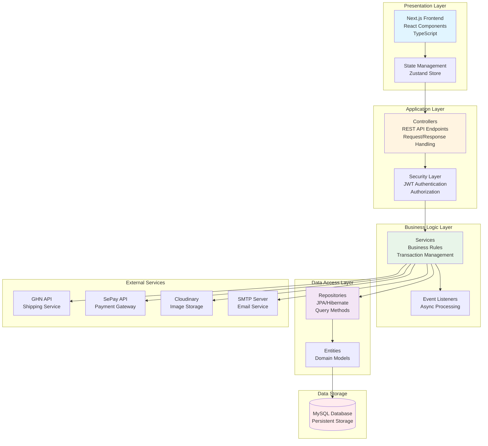

### 1.2. Chi Tiết Từng Tầng

#### Tầng 1: Presentation Layer (Tầng Giao Diện)
**Công nghệ**: Next.js 14, React 18, TypeScript, Tailwind CSS

**Trách nhiệm**:
- Hiển thị giao diện người dùng
- Xử lý tương tác người dùng
- Quản lý state phía client (Zustand)
- Gọi API đến backend
- Routing và navigation

**Thành phần chính**:
- Pages: `/admin`, `/employee`, `/warehouse`, `/customer`
- Components: Reusable UI components
- Store: `authStore`, `cartStore`, `languageStore`
- API Client: Axios với interceptors

#### Tầng 2: Application Layer (Tầng Ứng Dụng)
**Công nghệ**: Spring Boot 3.5.6, Spring MVC, Spring Security

**Trách nhiệm**:
- Xử lý HTTP requests/responses
- Xác thực và phân quyền (JWT)
- Validation dữ liệu đầu vào
- Exception handling
- API documentation (Swagger)

**Thành phần chính**:
- Controllers: REST API endpoints
- Security: JWT filter, authentication
- DTOs: Request/Response objects
- Exception Handlers: Global error handling


#### Tầng 3: Business Logic Layer (Tầng Nghiệp Vụ)
**Công nghệ**: Spring Boot Services, Spring Events

**Trách nhiệm**:
- Xử lý logic nghiệp vụ
- Quản lý transactions
- Tích hợp với external services
- Event-driven processing
- Business rules validation

**Thành phần chính**:
- Services: Business logic implementation
- Event Listeners: Async event processing
- Validators: Business rules validation
- Mappers: Entity ↔ DTO conversion

#### Tầng 4: Data Access Layer (Tầng Truy Cập Dữ Liệu)
**Công nghệ**: Spring Data JPA, Hibernate, MySQL Connector

**Trách nhiệm**:
- Truy vấn và lưu trữ dữ liệu
- ORM mapping
- Transaction management
- Query optimization
- Database connection pooling

**Thành phần chính**:
- Repositories: JPA repositories
- Entities: Domain models
- Custom Queries: JPQL/Native SQL
- Database Configuration

---

## 2. Sơ Đồ Thành Phần và Phụ Thuộc (Component Diagram)

### 2.1. Module Dependencies - Backend

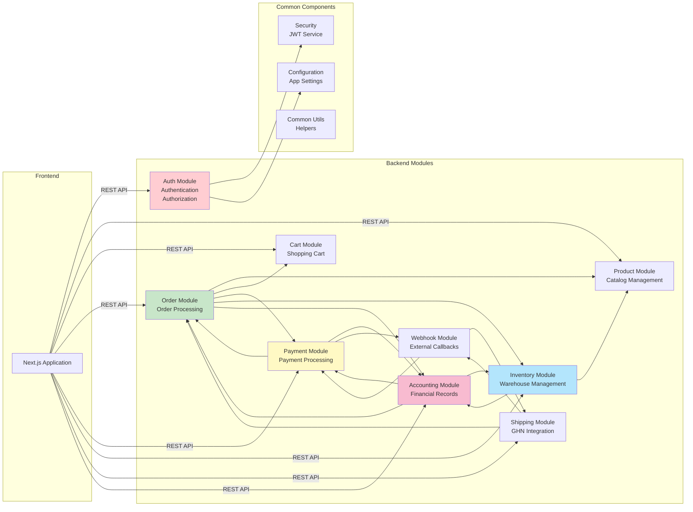

### 2.2. Module Structure Detail

#### Auth Module
**Package**: `com.doan.WEB_TMDT.module.auth`

**Components**:
- `AuthController`: Login, register, logout
- `AuthService`: Authentication logic
- `UserService`: User management
- `EmployeeRegistrationService`: Employee approval
- Entities: `User`, `Customer`, `Employee`, `Position`, `Role`

**Dependencies**:
- Security (JWT)
- Email Service
- Database

#### Product Module
**Package**: `com.doan.WEB_TMDT.module.product`

**Components**:
- `ProductController`: CRUD operations
- `ProductService`: Business logic
- `CategoryService`: Category management
- Entities: `Product`, `Category`, `ProductImage`

**Dependencies**:
- Cloudinary (image upload)
- Inventory Module
- Database


#### Order Module
**Package**: `com.doan.WEB_TMDT.module.order`

**Components**:
- `OrderController`: Order management
- `OrderService`: Order processing
- Entities: `Order`, `OrderItem`, `OrderStatus`

**Dependencies**:
- Cart Module (checkout)
- Product Module (validation)
- Inventory Module (stock reservation)
- Payment Module (payment processing)
- Accounting Module (revenue recording)
- Database

#### Payment Module
**Package**: `com.doan.WEB_TMDT.module.payment`

**Components**:
- `PaymentController`: Payment operations
- `PaymentService`: Payment processing
- `BankAccountService`: Multi-account management
- Entities: `Payment`, `BankAccount`

**Dependencies**:
- SePay API
- Order Module
- Accounting Module
- Webhook Module
- Database

#### Inventory Module
**Package**: `com.doan.WEB_TMDT.module.inventory`

**Components**:
- `InventoryController`: Warehouse operations
- `InventoryService`: Stock management
- `ExportOrderService`: Export processing
- `PurchaseOrderService`: Import processing
- Entities: `WarehouseProduct`, `InventoryStock`, `ExportOrder`, `PurchaseOrder`, `Supplier`

**Dependencies**:
- Product Module
- Accounting Module (supplier payables)
- Excel Processing (Apache POI)
- Database

#### Shipping Module
**Package**: `com.doan.WEB_TMDT.module.shipping`

**Components**:
- `ShippingController`: Shipping operations
- `ShippingService`: GHN integration
- No entities (uses Order entity)

**Dependencies**:
- GHN API
- Order Module
- Webhook Module
- Database


#### Accounting Module
**Package**: `com.doan.WEB_TMDT.module.accounting`

**Components**:
- `AccountingController`: Financial operations
- `AccountingService`: Transaction recording
- `OrderEventListener`: Event-driven accounting
- Entities: `FinancialTransaction`, `SupplierPayable`, `SupplierPayment`, `PaymentReconciliation`, `AccountingPeriod`, `TaxReport`

**Dependencies**:
- Order Module (revenue)
- Payment Module (cash receipts)
- Inventory Module (supplier payables)
- Spring Events
- Database

#### Webhook Module
**Package**: `com.doan.WEB_TMDT.module.webhook`

**Components**:
- `WebhookController`: Webhook endpoints
- `WebhookService`: Webhook processing
- No entities

**Dependencies**:
- Payment Module (SePay webhooks)
- Shipping Module (GHN webhooks)
- Signature verification
- Database

---

## 3. Sơ Đồ Triển Khai (Deployment Diagram)

### 3.1. Production Deployment Architecture

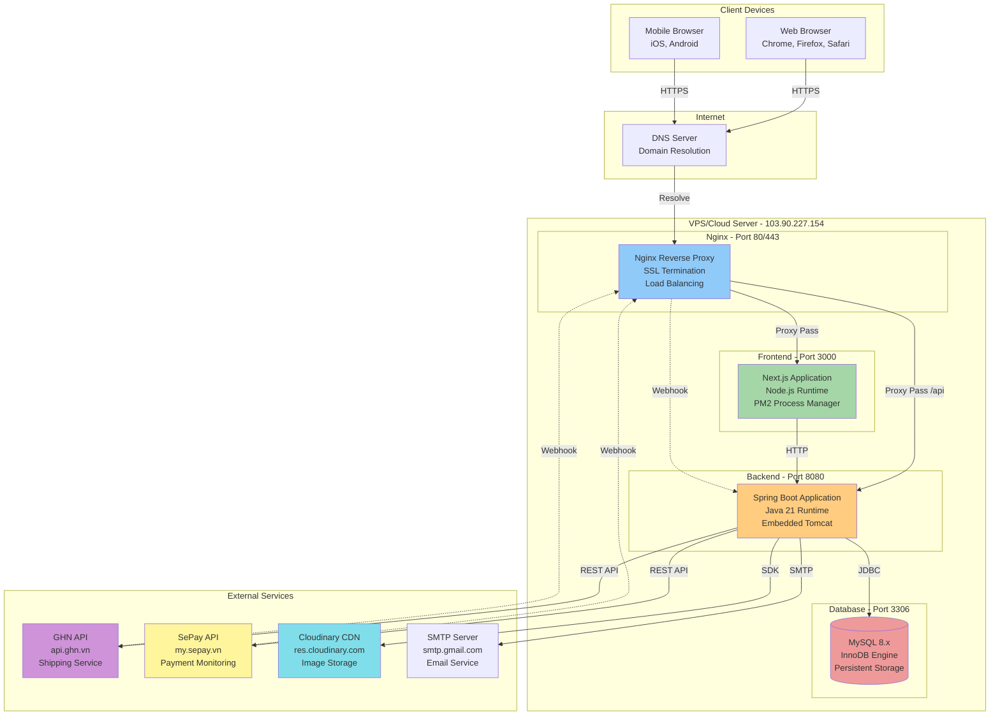

### 3.2. Deployment Details

#### Server Configuration
- **Server**: VPS/Cloud Server
- **IP**: 103.90.227.154
- **OS**: Linux (Ubuntu/CentOS)
- **RAM**: 4GB+ recommended
- **Storage**: 50GB+ SSD

#### Port Mapping
| Service | Internal Port | External Port | Protocol |
|---------|--------------|---------------|----------|
| Nginx | - | 80, 443 | HTTP/HTTPS |
| Next.js | 3000 | - | HTTP |
| Spring Boot | 8080 | - | HTTP |
| MySQL | 3306 | - | TCP |

#### URL Structure
- **Frontend**: `https://hoanghamobile.com`
- **Backend API**: `https://hoanghamobile.com/api`
- **Swagger UI**: `https://hoanghamobile.com/api/swagger-ui.html`
- **Admin Panel**: `https://hoanghamobile.com/admin`
- **Employee Portal**: `https://hoanghamobile.com/employee`


#### Nginx Configuration
```nginx
server {
    listen 80;
    server_name hoanghamobile.com;
    return 301 https://$server_name$request_uri;
}

server {
    listen 443 ssl http2;
    server_name hoanghamobile.com;
    
    ssl_certificate /etc/ssl/certs/cert.pem;
    ssl_certificate_key /etc/ssl/private/key.pem;
    
    # Frontend
    location / {
        proxy_pass http://localhost:3000;
        proxy_http_version 1.1;
        proxy_set_header Upgrade $http_upgrade;
        proxy_set_header Connection 'upgrade';
        proxy_set_header Host $host;
        proxy_cache_bypass $http_upgrade;
    }
    
    # Backend API
    location /api {
        proxy_pass http://localhost:8080;
        proxy_set_header Host $host;
        proxy_set_header X-Real-IP $remote_addr;
        proxy_set_header X-Forwarded-For $proxy_add_x_forwarded_for;
        proxy_set_header X-Forwarded-Proto $scheme;
    }
}
```

#### Process Management (PM2)
```bash
# Frontend
pm2 start npm --name "frontend" -- start
pm2 startup
pm2 save

# Backend (alternative to systemd)
pm2 start "java -jar target/WEB_TMDT-0.0.1-SNAPSHOT.jar" --name "backend"
```

---

## 4. Trực Quan Hóa Công Nghệ (Technology Stack Visualization)

### 4.1. Full Stack Overview

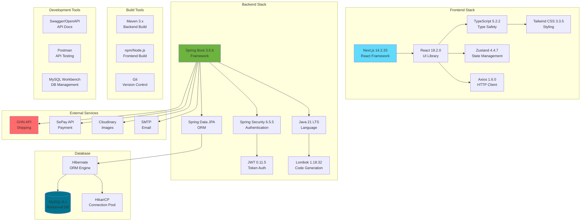

### 4.2. Technology Stack Summary

#### Frontend Technologies
| Category | Technology | Version | Purpose |
|----------|-----------|---------|---------|
| **Framework** | Next.js | 14.2.33 | React framework with SSR |
| **UI Library** | React | 18.2.0 | Component-based UI |
| **Language** | TypeScript | 5.2.2 | Type-safe JavaScript |
| **Styling** | Tailwind CSS | 3.3.5 | Utility-first CSS |
| **State** | Zustand | 4.4.7 | Lightweight state management |
| **HTTP** | Axios | 1.6.0 | Promise-based HTTP client |
| **Icons** | React Icons | 4.12.0 | Icon library |
| **Carousel** | Swiper | 11.0.0 | Touch slider |
| **Toast** | Sonner | 2.0.7 | Notifications |
| **Excel** | XLSX | 0.18.5 | Excel file handling |
| **QR Code** | html5-qrcode | 2.3.8 | QR scanning |
| **Print** | react-to-print | 3.2.0 | Print functionality |


#### Backend Technologies
| Category | Technology | Version | Purpose |
|----------|-----------|---------|---------|
| **Framework** | Spring Boot | 3.5.6 | Java application framework |
| **Language** | Java | 21 LTS | Programming language |
| **Security** | Spring Security | 6.5.5 | Authentication & authorization |
| **JWT** | JJWT | 0.11.5 | JSON Web Token |
| **ORM** | Spring Data JPA | 3.5.6 | Database abstraction |
| **ORM Engine** | Hibernate | 6.x | JPA implementation |
| **Validation** | Bean Validation | 3.0 | Input validation |
| **Code Gen** | Lombok | 1.18.32 | Boilerplate reduction |
| **API Docs** | SpringDoc OpenAPI | 2.5.0 | Swagger UI |
| **Excel** | Apache POI | 5.2.5 | Excel processing |
| **JSON** | org.json | 20240303 | JSON manipulation |
| **Images** | Cloudinary SDK | 1.36.0 | Image upload |
| **Email** | Spring Mail | 3.5.6 | Email sending |
| **Build** | Maven | 3.x | Dependency management |

#### Database Technologies
| Category | Technology | Version | Purpose |
|----------|-----------|---------|---------|
| **RDBMS** | MySQL | 8.x | Primary database |
| **Engine** | InnoDB | - | Storage engine |
| **Connector** | MySQL Connector/J | Runtime | JDBC driver |
| **Pool** | HikariCP | - | Connection pooling |
| **Charset** | utf8mb4 | - | Unicode support |

#### External Services
| Service | Purpose | Integration |
|---------|---------|-------------|
| **GHN** | Shipping & logistics | REST API + Webhook |
| **SePay** | Payment monitoring | REST API + Webhook |
| **Cloudinary** | Image storage & CDN | SDK |
| **SMTP** | Email notifications | JavaMailSender |

---

## 5. Data Flow Architecture

### 5.1. Request-Response Flow

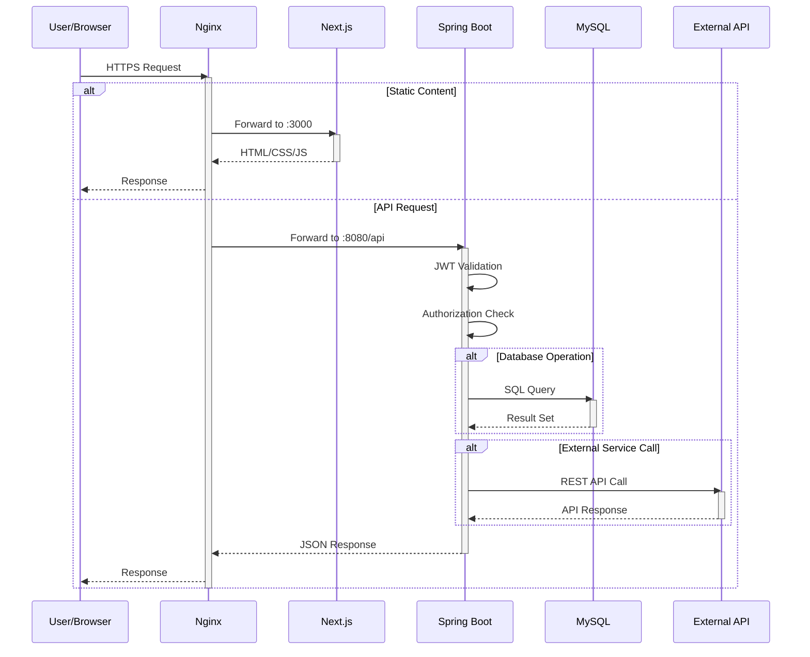


### 5.2. Authentication Flow

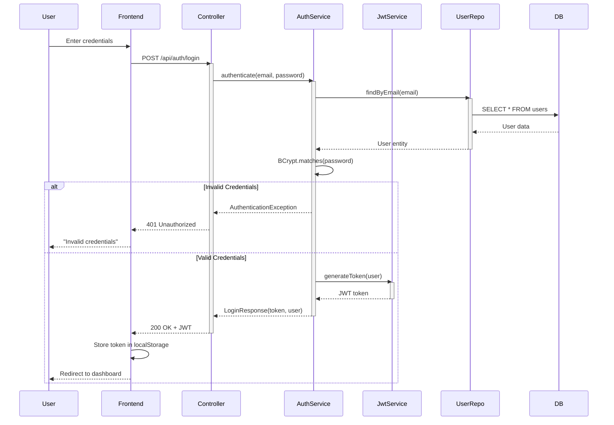

### 5.3. Order Processing Flow

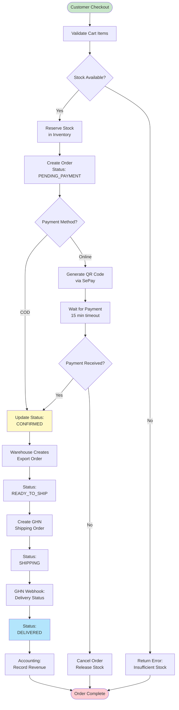


---

## 6. Security Architecture

### 6.1. Security Layers

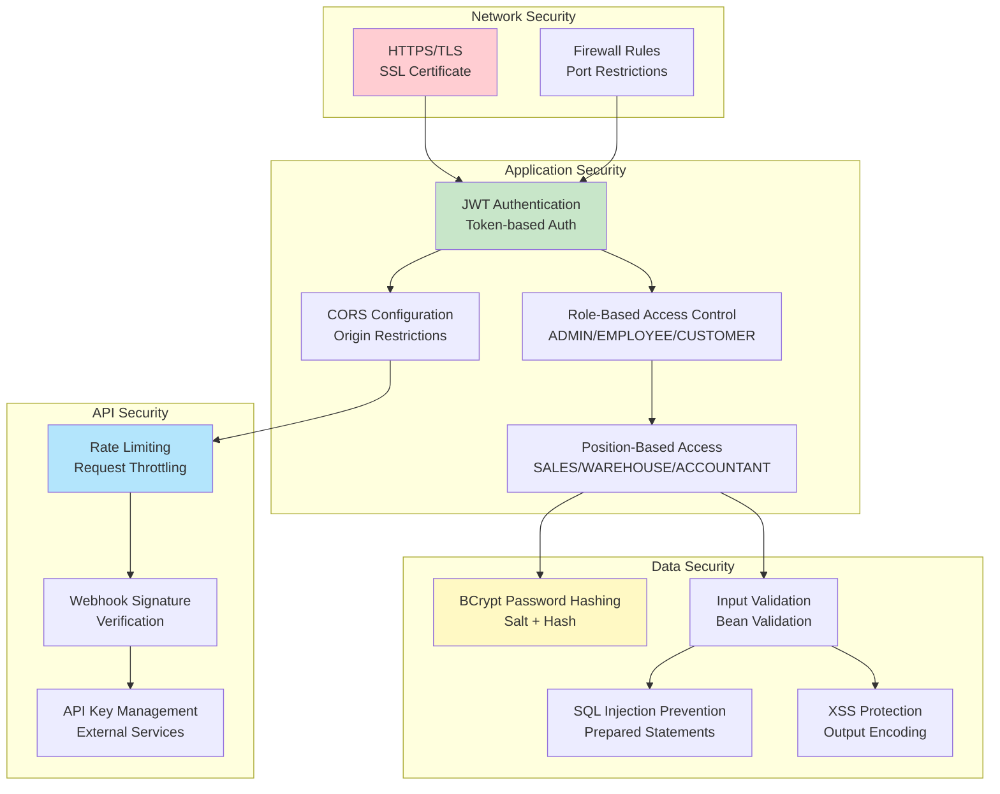

### 6.2. Authentication & Authorization Matrix

| Role | Position | Access Level | Permissions |
|------|----------|--------------|-------------|
| **CUSTOMER** | - | Public | Browse products, Place orders, View own orders |
| **EMPLOYEE** | SALES | Staff | Confirm orders, View customer info |
| **EMPLOYEE** | WAREHOUSE | Staff | Manage inventory, Create export/import orders |
| **EMPLOYEE** | SHIPPER | Staff | View shipping orders, Update delivery status |
| **EMPLOYEE** | ACCOUNTANT | Staff | View financial reports, Manage payables |
| **EMPLOYEE** | PRODUCT_MANAGER | Staff | Manage products, categories |
| **ADMIN** | - | Full | All permissions, User management, System config |

---

## 7. Scalability & Performance

### 7.1. Current Architecture Characteristics

**Scalability Type**: Vertical Scaling (Single Server)

**Performance Optimizations**:
- Database connection pooling (HikariCP)
- JPA lazy loading
- Database indexing on frequently queried columns
- CDN for static assets (Cloudinary)
- Next.js SSR for faster initial page load
- Nginx caching for static content

### 7.2. Future Scaling Options

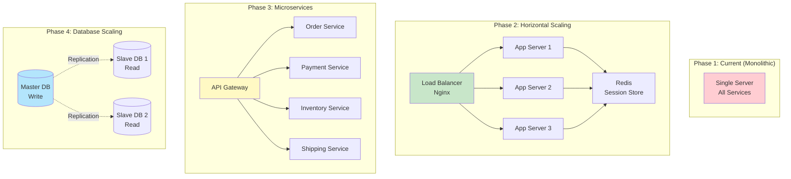

---

## 8. Monitoring & Logging

### 8.1. Logging Strategy

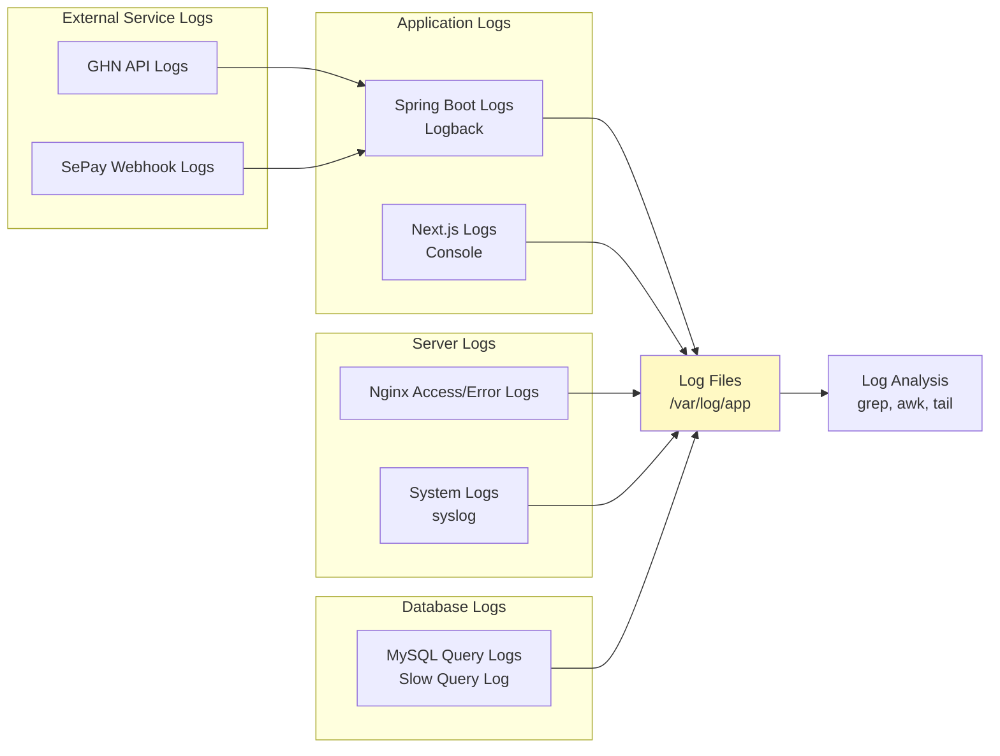

### 8.2. Monitoring Metrics

**Application Metrics**:
- Request count and response time
- Error rate and exception tracking
- Database query performance
- Memory and CPU usage
- Thread pool utilization

**Business Metrics**:
- Order creation rate
- Payment success rate
- Inventory stock levels
- Revenue and profit
- Customer registration rate

---

## 9. Backup & Disaster Recovery

### 9.1. Backup Strategy

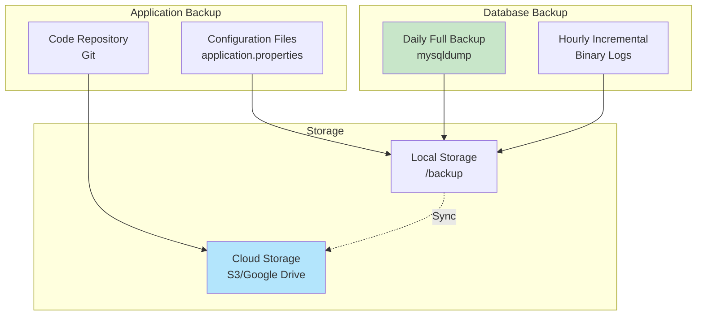

### 9.2. Recovery Procedures

**Database Recovery**:
1. Stop application services
2. Restore from latest full backup
3. Apply incremental backups
4. Verify data integrity
5. Restart services

**Application Recovery**:
1. Pull latest code from Git
2. Restore configuration files
3. Rebuild application (Maven/npm)
4. Deploy to server
5. Verify functionality

---

## 10. Development Workflow

### 10.1. Development Process

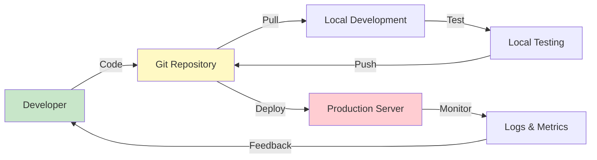

### 10.2. Build & Deploy Process

**Backend Build**:
```bash
# Clean and build
mvn clean package -DskipTests

# Run locally
mvn spring-boot:run

# Deploy to server
scp target/WEB_TMDT-0.0.1-SNAPSHOT.jar user@server:/app/
ssh user@server "systemctl restart backend"
```

**Frontend Build**:
```bash
# Install dependencies
npm install

# Build for production
npm run build

# Deploy to server
rsync -avz .next/ user@server:/app/frontend/.next/
ssh user@server "pm2 restart frontend"
```

---

## 11. API Documentation

### 11.1. Swagger/OpenAPI Integration

**Access URL**: `http://localhost:8080/swagger-ui.html`

**Features**:
- Interactive API documentation
- Try-it-out functionality
- Request/response examples
- Authentication testing
- Schema definitions

### 11.2. API Endpoint Categories

| Category | Base Path | Description |
|----------|-----------|-------------|
| **Auth** | `/api/auth` | Authentication & registration |
| **Products** | `/api/products` | Product catalog |
| **Cart** | `/api/cart` | Shopping cart operations |
| **Orders** | `/api/orders` | Order management |
| **Payments** | `/api/payments` | Payment processing |
| **Inventory** | `/api/inventory` | Warehouse operations |
| **Shipping** | `/api/shipping` | Shipping & GHN |
| **Accounting** | `/api/accounting` | Financial operations |
| **Webhooks** | `/api/webhook` | External callbacks |

---

## 12. Kết Luận

### 12.1. Điểm Mạnh Của Kiến Trúc

✅ **Phân tầng rõ ràng**: Dễ bảo trì và mở rộng
✅ **Công nghệ hiện đại**: Spring Boot 3.5.6, Next.js 14, Java 21
✅ **Bảo mật tốt**: JWT, BCrypt, RBAC, HTTPS
✅ **Tích hợp linh hoạt**: GHN, SePay, Cloudinary
✅ **Event-driven**: Kế toán tự động qua Spring Events
✅ **RESTful API**: Chuẩn REST, dễ tích hợp
✅ **Documentation**: Swagger UI tự động

### 12.2. Hạn Chế Hiện Tại

⚠️ **Single server**: Chưa có load balancing
⚠️ **No caching**: Chưa sử dụng Redis
⚠️ **Monolithic**: Chưa tách microservices
⚠️ **Manual deployment**: Chưa có CI/CD pipeline
⚠️ **Limited monitoring**: Chưa có monitoring tool chuyên dụng

### 12.3. Đề Xuất Cải Tiến

🔄 **Short-term** (1-3 tháng):
- Implement Redis caching
- Add monitoring tools (Prometheus, Grafana)
- Setup CI/CD pipeline (Jenkins, GitHub Actions)
- Implement rate limiting
- Add comprehensive logging

🔄 **Mid-term** (3-6 tháng):
- Horizontal scaling with load balancer
- Database read replicas
- CDN for frontend assets
- Automated backup system
- Performance optimization

🔄 **Long-term** (6-12 tháng):
- Migrate to microservices architecture
- Implement message queue (RabbitMQ, Kafka)
- Container orchestration (Docker, Kubernetes)
- Multi-region deployment
- Advanced analytics and reporting

---

**Tài liệu này mô tả đầy đủ kiến trúc hệ thống thương mại điện tử, từ tầng giao diện đến tầng dữ liệu, bao gồm cả tích hợp với các dịch vụ bên ngoài và chiến lược triển khai.**

**Ngày tạo**: 2024
**Phiên bản**: 1.0
**Trạng thái**: Production Ready ✅
