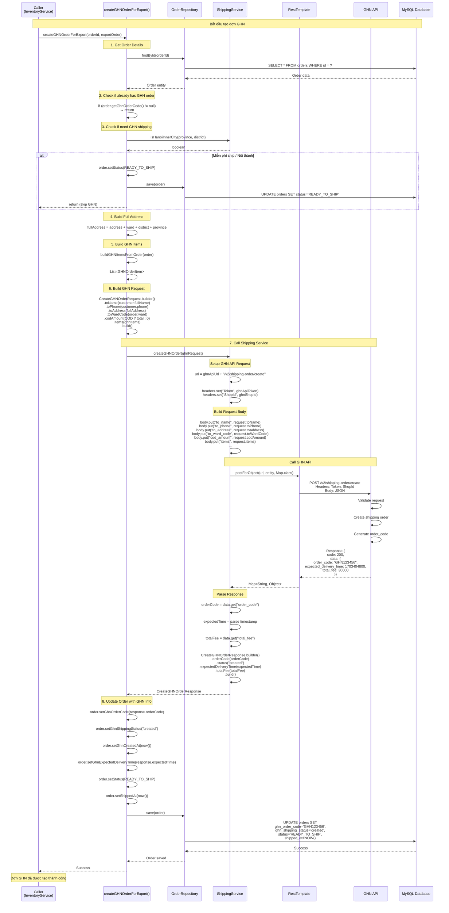

# Tạo Đơn Giao Hàng Nhanh (GHN) - Chi Tiết

## Tổng Quan

Mô tả luồng tạo đơn vận chuyển trên hệ thống GHN, từ khi có thông tin đơn hàng đến khi nhận được mã vận đơn GHN.

---

## SƠ ĐỒ TUẦN TỰ



---

## BƯỚC 1: CHUẨN BỊ THÔNG TIN ĐƠN HÀNG

### Input: Order Entity

**Thông tin cần có**:
```java
Order order = {
    orderId: 123,
    orderCode: "ORD20231223XXXX",
    customer: {
        fullName: "Nguyễn Văn A",
        phone: "0912345678"
    },
    address: "123 Nguyễn Trãi",
    ward: "26734",              // Ward code (bắt buộc)
    wardName: "Phường Thanh Xuân Trung",
    district: "Thanh Xuân",
    province: "Hà Nội",
    note: "Giao giờ hành chính",
    paymentMethod: "COD",
    total: 60030000,
    shippingFee: 30000,
    items: [
        {
            productName: "iPhone 15 Pro Max",
            sku: "IP15PM",
            quantity: 2,
            price: 30000000
        }
    ]
}
```

---

## BƯỚC 2: BUILD FULL ADDRESS

**Method**: `createGHNOrderForExport()` trong `InventoryServiceImpl.java`

**Code**:
```java
String wardDisplay = (order.getWardName() != null && !order.getWardName().isEmpty()) 
    ? order.getWardName() 
    : order.getWard();

String fullAddress = String.join(", ", 
    order.getAddress(),           // "123 Nguyễn Trãi"
    wardDisplay,                  // "Phường Thanh Xuân Trung"
    order.getDistrict(),          // "Thanh Xuân"
    order.getProvince()           // "Hà Nội"
);
```

**Kết quả**:
```
"123 Nguyễn Trãi, Phường Thanh Xuân Trung, Thanh Xuân, Hà Nội"
```

---

## BƯỚC 3: BUILD GHN ORDER REQUEST

**Method**: `createGHNOrderForExport()`

**Code**:
```java
CreateGHNOrderRequest ghnRequest = CreateGHNOrderRequest.builder()
    .toName(order.getCustomer().getFullName())
    .toPhone(order.getCustomer().getPhone())
    .toAddress(fullAddress)
    .toWardCode(order.getWard())
    .toDistrictId(getDistrictIdForGHN(order.getProvince(), order.getDistrict()))
    .note(order.getNote())
    .codAmount("COD".equals(order.getPaymentMethod()) ? order.getTotal().intValue() : 0)
    .weight(1000)
    .length(20)
    .width(20)
    .height(10)
    .serviceTypeId(2)
    .paymentTypeId("COD".equals(order.getPaymentMethod()) ? 2 : 1)
    .items(buildGHNItemsFromOrder(order))
    .build();
```

### Giải thích các field:

**Thông tin người nhận**:
- `toName`: Tên người nhận (từ customer.fullName)
- `toPhone`: SĐT người nhận (từ customer.phone)
- `toAddress`: Địa chỉ đầy đủ (đã build ở bước 2)
- `toWardCode`: Mã phường/xã (bắt buộc, từ order.ward)
- `toDistrictId`: ID quận/huyện theo GHN (cần map từ tên district)

**Thông tin đơn hàng**:
- `note`: Ghi chú giao hàng (từ order.note)
- `codAmount`: Số tiền thu hộ (nếu COD = order.total, nếu online = 0)
- `weight`: Khối lượng (gram) - default 1000g = 1kg
- `length`, `width`, `height`: Kích thước (cm) - default 20x20x10

**Cấu hình dịch vụ**:
- `serviceTypeId`: Loại dịch vụ
  - `2`: Giao hàng tiêu chuẩn (Standard)
  - `5`: Giao hàng nhanh (Express)
- `paymentTypeId`: Người trả phí ship
  - `1`: Shop trả (đã thanh toán online)
  - `2`: Người nhận trả (COD)

**Danh sách sản phẩm**:
- `items`: List sản phẩm (build từ order.items)

---

### Helper Method: buildGHNItemsFromOrder()

**Code**:
```java
private List<GHNOrderItem> buildGHNItemsFromOrder(Order order) {
    List<GHNOrderItem> items = new ArrayList<>();
    
    for (OrderItem item : order.getItems()) {
        items.add(GHNOrderItem.builder()
            .name(item.getProductName())
            .code(item.getProduct().getSku())
            .quantity(item.getQuantity())
            .price(item.getPrice().intValue())
            .build());
    }
    
    return items;
}
```

**Kết quả**:
```java
[
    {
        name: "iPhone 15 Pro Max",
        code: "IP15PM",
        quantity: 2,
        price: 30000000
    }
]
```

---

## BƯỚC 4: GỌI SHIPPING SERVICE

**Code**:
```java
CreateGHNOrderResponse ghnResponse = shippingService.createGHNOrder(ghnRequest);
```

**Service**: `ShippingServiceImpl.java`

**Method**: `createGHNOrder(CreateGHNOrderRequest request)`

---

## BƯỚC 5: SETUP GHN API REQUEST

**File**: `ShippingServiceImpl.java`

### 5.1. Setup URL và Headers

**Code**:
```java
String url = ghnApiUrl + "/v2/shipping-order/create";

HttpHeaders headers = new HttpHeaders();
headers.set("Token", ghnApiToken);
headers.set("ShopId", ghnShopId.toString());
headers.setContentType(MediaType.APPLICATION_JSON);
```

**Config** (từ `application.properties`):
```properties
ghn.api.url=https://dev-online-gateway.ghn.vn
ghn.api.token=your_ghn_token_here
ghn.shop.id=123456
```

**Headers**:
```
Token: your_ghn_token_here
ShopId: 123456
Content-Type: application/json
```

---

### 5.2. Build Request Body

**Code**:
```java
Map<String, Object> body = new HashMap<>();
body.put("to_name", request.getToName());
body.put("to_phone", request.getToPhone());
body.put("to_address", request.getToAddress());
body.put("to_ward_code", request.getToWardCode());
body.put("to_district_id", request.getToDistrictId());
body.put("note", request.getNote());
body.put("required_note", "KHONGCHOXEMHANG");
body.put("cod_amount", request.getCodAmount());
body.put("weight", request.getWeight());
body.put("length", request.getLength());
body.put("width", request.getWidth());
body.put("height", request.getHeight());
body.put("service_type_id", request.getServiceTypeId());
body.put("payment_type_id", request.getPaymentTypeId());

// Add items
List<Map<String, Object>> items = new ArrayList<>();
for (GHNOrderItem item : request.getItems()) {
    Map<String, Object> itemMap = new HashMap<>();
    itemMap.put("name", item.getName());
    itemMap.put("code", item.getCode());
    itemMap.put("quantity", item.getQuantity());
    itemMap.put("price", item.getPrice());
    items.add(itemMap);
}
body.put("items", items);
```

**Request Body JSON**:
```json
{
  "to_name": "Nguyễn Văn A",
  "to_phone": "0912345678",
  "to_address": "123 Nguyễn Trãi, Phường Thanh Xuân Trung, Thanh Xuân, Hà Nội",
  "to_ward_code": "26734",
  "to_district_id": 1485,
  "note": "Giao giờ hành chính",
  "required_note": "KHONGCHOXEMHANG",
  "cod_amount": 60030000,
  "weight": 1000,
  "length": 20,
  "width": 20,
  "height": 10,
  "service_type_id": 2,
  "payment_type_id": 2,
  "items": [
    {
      "name": "iPhone 15 Pro Max",
      "code": "IP15PM",
      "quantity": 2,
      "price": 30000000
    }
  ]
}
```

---

## BƯỚC 6: CALL GHN API

**Code**:
```java
HttpEntity<Map<String, Object>> entity = new HttpEntity<>(body, headers);

Map<String, Object> response = restTemplate.postForObject(url, entity, Map.class);
```

**HTTP Request**:
```
POST https://dev-online-gateway.ghn.vn/v2/shipping-order/create
Headers:
  Token: your_ghn_token_here
  ShopId: 123456
  Content-Type: application/json

Body: (JSON như trên)
```

---

## BƯỚC 7: PARSE GHN RESPONSE

**Code**:
```java
if (response != null && response.get("code").equals(200)) {
    Map<String, Object> data = (Map<String, Object>) response.get("data");
    
    // Parse order_code (bắt buộc)
    String orderCode = data.get("order_code") != null ? 
        data.get("order_code").toString() : null;
    
    if (orderCode == null) {
        throw new RuntimeException("GHN không trả về mã đơn hàng");
    }
    
    // Parse sort_code (có thể null)
    String sortCode = data.get("sort_code") != null ? 
        data.get("sort_code").toString() : null;
    
    // Parse total_fee (có thể null)
    Double totalFee = null;
    Object feeValue = data.get("total_fee");
    if (feeValue != null) {
        totalFee = ((Number) feeValue).doubleValue();
    }
    
    // Parse expected_delivery_time (timestamp)
    LocalDateTime expectedDeliveryTime = null;
    Object timeValue = data.get("expected_delivery_time");
    
    if (timeValue instanceof Number) {
        long timestamp = ((Number) timeValue).longValue();
        expectedDeliveryTime = LocalDateTime.ofInstant(
            Instant.ofEpochSecond(timestamp), 
            ZoneId.systemDefault()
        );
    }
    
    return CreateGHNOrderResponse.builder()
        .orderCode(orderCode)
        .status("created")
        .expectedDeliveryTime(expectedDeliveryTime)
        .sortCode(sortCode)
        .totalFee(totalFee)
        .build();
}
```

**GHN Response**:
```json
{
  "code": 200,
  "message": "Success",
  "data": {
    "order_code": "GHN123456",
    "sort_code": "HN-01-A",
    "total_fee": 30000,
    "expected_delivery_time": 1703404800
  }
}
```

**Parse kết quả**:
```java
CreateGHNOrderResponse {
    orderCode: "GHN123456",
    status: "created",
    expectedDeliveryTime: LocalDateTime("2023-12-25 10:00:00"),
    sortCode: "HN-01-A",
    totalFee: 30000.0
}
```

---

## BƯỚC 8: UPDATE ORDER VỚI THÔNG TIN GHN

**Quay lại**: `createGHNOrderForExport()` trong `InventoryServiceImpl.java`

**Code**:
```java
// Update order with GHN info
order.setGhnOrderCode(ghnResponse.getOrderCode());
order.setGhnShippingStatus("created");
order.setGhnCreatedAt(LocalDateTime.now());
order.setGhnExpectedDeliveryTime(ghnResponse.getExpectedDeliveryTime());

// Update order status
order.setStatus(OrderStatus.READY_TO_SHIP);
order.setShippedAt(LocalDateTime.now());

orderRepository.save(order);
```

**SQL**:
```sql
UPDATE orders 
SET ghn_order_code = 'GHN123456',
    ghn_shipping_status = 'created',
    ghn_created_at = '2023-12-23 14:30:00',
    ghn_expected_delivery_time = '2023-12-25 10:00:00',
    status = 'READY_TO_SHIP',
    shipped_at = '2023-12-23 14:30:00'
WHERE id = 123;
```

---

## BƯỚC 9: RETURN RESPONSE

**Response**:
```java
CreateGHNOrderResponse {
    orderCode: "GHN123456",
    status: "created",
    expectedDeliveryTime: "2023-12-25 10:00:00",
    sortCode: "HN-01-A",
    totalFee: 30000.0
}
```

---

## TÓM TẮT FLOW

### Input:
- Order entity với thông tin khách hàng, địa chỉ, sản phẩm

### Process:
1. **Build full address** → "123 Nguyễn Trãi, Phường Thanh Xuân Trung, Thanh Xuân, Hà Nội"

2. **Build GHN request** → `CreateGHNOrderRequest` với:
   - Thông tin người nhận (name, phone, address, ward_code, district_id)
   - Thông tin đơn hàng (note, cod_amount, weight, dimensions)
   - Cấu hình dịch vụ (service_type_id, payment_type_id)
   - Danh sách sản phẩm (items)

3. **Call ShippingService** → `shippingService.createGHNOrder()`

4. **Setup GHN API** → Headers (Token, ShopId), Body (JSON)

5. **Call GHN API** → `POST https://dev-online-gateway.ghn.vn/v2/shipping-order/create`

6. **Parse response** → Lấy `order_code`, `expected_delivery_time`, `total_fee`

7. **Update order** → Lưu `ghn_order_code`, status = `READY_TO_SHIP`

### Output:
- GHN order code: `GHN123456`
- Expected delivery time: `2023-12-25 10:00:00`
- Order status: `READY_TO_SHIP`

---

## KEY COMPONENTS

### DTOs:

**CreateGHNOrderRequest**:
```java
{
    toName: String,
    toPhone: String,
    toAddress: String,
    toWardCode: String,
    toDistrictId: Integer,
    note: String,
    codAmount: Integer,
    weight: Integer,
    length: Integer,
    width: Integer,
    height: Integer,
    serviceTypeId: Integer,
    paymentTypeId: Integer,
    items: List<GHNOrderItem>
}
```

**GHNOrderItem**:
```java
{
    name: String,
    code: String,
    quantity: Integer,
    price: Integer
}
```

**CreateGHNOrderResponse**:
```java
{
    orderCode: String,
    status: String,
    expectedDeliveryTime: LocalDateTime,
    sortCode: String,
    totalFee: Double
}
```

### Services:

**ShippingService**:
- Method: `createGHNOrder(CreateGHNOrderRequest request)`
- Return: `CreateGHNOrderResponse`

### External API:

**GHN API**:
- URL: `https://dev-online-gateway.ghn.vn/v2/shipping-order/create`
- Method: `POST`
- Auth: Token + ShopId trong headers
- Response: JSON với order_code

---

## ERROR HANDLING

### Nếu GHN API fail:
```java
try {
    CreateGHNOrderResponse ghnResponse = shippingService.createGHNOrder(ghnRequest);
} catch (Exception e) {
    log.error("Failed to create GHN order: {}", e.getMessage());
    // Không fail toàn bộ process
    // Admin có thể tạo GHN order sau
}
```

### Common errors:
- **Ward code invalid**: Kiểm tra ward code có đúng format GHN không
- **District ID not found**: Cần map district name → district_id của GHN
- **Token invalid**: Kiểm tra token trong config
- **Shop ID invalid**: Kiểm tra shop_id trong config

---

**Document Version**: 1.0  
**Last Updated**: 2024-12-25
