# Sơ Đồ Use Case Tổng Quan - Hệ Thống TMDT

## 1. Tổng Quan

Hệ thống Thương Mại Điện Tử bao gồm **6 actors chính** và **50+ use cases** được tổ chức thành 9 modules chức năng.

## 2. Danh Sách Actors

### 2.1. Actors Người Dùng

1. **Customer (Khách hàng)**
   - Người dùng cuối mua sắm trên website
   - Quyền: Browse sản phẩm, đặt hàng, thanh toán, theo dõi đơn hàng

2. **Sales Staff (Nhân viên bán hàng)**
   - Position: SALE
   - Quyền: Quản lý đơn hàng, xác nhận đơn, cập nhật trạng thái

3. **Warehouse Staff (Nhân viên kho)**
   - Position: WAREHOUSE
   - Quyền: Quản lý nhập/xuất kho, quản lý tồn kho, quản lý NCC

4. **Accountant (Kế toán)**
   - Position: ACCOUNTANT
   - Quyền: Xem báo cáo tài chính, quản lý công nợ, thanh toán NCC

5. **Shipper (Người giao hàng)**
   - Position: SHIPPER
   - Quyền: Xem đơn cần giao, cập nhật trạng thái giao hàng

6. **Admin (Quản trị viên)**
   - Quyền: Tất cả chức năng, phê duyệt nhân viên, cấu hình hệ thống

### 2.2. Actors Hệ Thống Bên Ngoài

7. **GHN System** - Hệ thống vận chuyển Giao Hàng Nhanh
8. **SePay System** - Hệ thống thanh toán online
9. **Cloudinary** - Dịch vụ lưu trữ ảnh

## 3. Sơ Đồ Use Case Tổng Quan

```mermaid
graph TB
    subgraph "Hệ Thống TMDT"
        subgraph "Module Auth"
            UC1[Đăng ký tài khoản]
            UC2[Đăng nhập]
            UC3[Quản lý profile]
            UC4[Đổi mật khẩu]
        end
        
        subgraph "Module Product"
            UC5[Xem danh sách sản phẩm]
            UC6[Xem chi tiết sản phẩm]
            UC7[Tìm kiếm sản phẩm]
            UC8[Quản lý danh mục]
            UC9[Quản lý sản phẩm]
            UC10[Upload ảnh sản phẩm]
        end
        
        subgraph "Module Cart & Order"
            UC11[Quản lý giỏ hàng]
            UC12[Tạo đơn hàng]
            UC13[Xem đơn hàng]
            UC14[Xác nhận đơn hàng]
            UC15[Cập nhật trạng thái đơn]
            UC16[Hủy đơn hàng]
        end
        
        subgraph "Module Payment"
            UC17[Thanh toán COD]
            UC18[Thanh toán Online]
            UC19[Tạo QR Code]
            UC20[Xử lý webhook thanh toán]
        end
        
        subgraph "Module Inventory"
            UC21[Quản lý nhà cung cấp]
            UC22[Nhập kho]
            UC23[Xuất kho]
            UC24[Quản lý tồn kho]
            UC25[Kiểm kê kho]
            UC26[Import Excel]
        end
        
        subgraph "Module Shipping"
            UC27[Tính phí vận chuyển]
            UC28[Tạo đơn GHN]
            UC29[Theo dõi vận chuyển]
            UC30[Xử lý webhook GHN]
        end
        
        subgraph "Module Accounting"
            UC31[Xem giao dịch tài chính]
            UC32[Báo cáo tài chính]
            UC33[Quản lý công nợ NCC]
            UC34[Thanh toán NCC]
            UC35[Đối soát thanh toán]
            UC36[Báo cáo thuế]
        end
    end
    
    Customer([Customer])
    Sales([Sales Staff])
    Warehouse([Warehouse Staff])
    Accountant([Accountant])
    Shipper([Shipper])
    Admin([Admin])
    GHN([GHN System])
    SePay([SePay System])
    
    Customer --> UC1
    Customer --> UC2
    Customer --> UC3
    Customer --> UC5
    Customer --> UC6
    Customer --> UC7
    Customer --> UC11
    Customer --> UC12
    Customer --> UC13
    Customer --> UC17
    Customer --> UC18
    
    Sales --> UC13
    Sales --> UC14
    Sales --> UC15
    Sales --> UC16
    Sales --> UC29
    
    Warehouse --> UC21
    Warehouse --> UC22
    Warehouse --> UC23
    Warehouse --> UC24
    Warehouse --> UC25
    Warehouse --> UC26
    
    Accountant --> UC31
    Accountant --> UC32
    Accountant --> UC33
    Accountant --> UC34
    Accountant --> UC35
    Accountant --> UC36
    
    Shipper --> UC13
    Shipper --> UC15
    
    Admin --> UC8
    Admin --> UC9
    Admin --> UC10
    Admin --> UC14
    
    GHN --> UC27
    GHN --> UC28
    GHN --> UC30
    
    SePay --> UC19
    SePay --> UC20
```

## 4. Mô Tả Chi Tiết Use Cases Theo Actor

### 4.1. Customer (Khách hàng)

#### UC1: Đăng ký tài khoản
- **Mô tả**: Khách hàng tạo tài khoản mới trên hệ thống
- **Precondition**: Chưa có tài khoản
- **Postcondition**: Tài khoản được tạo, có thể đăng nhập
- **Main Flow**:
  1. Nhập email, password, thông tin cá nhân
  2. Hệ thống validate dữ liệu
  3. Tạo user và customer record
  4. Gửi email xác nhận (optional)

#### UC2: Đăng nhập
- **Mô tả**: Đăng nhập vào hệ thống
- **Precondition**: Đã có tài khoản
- **Postcondition**: Nhận JWT token, truy cập được các chức năng
- **Main Flow**:
  1. Nhập email và password
  2. Hệ thống xác thực credentials
  3. Generate JWT token
  4. Trả về token và user info

#### UC5: Xem danh sách sản phẩm
- **Mô tả**: Browse catalog sản phẩm
- **Precondition**: Không cần đăng nhập
- **Postcondition**: Hiển thị danh sách sản phẩm
- **Main Flow**:
  1. Truy cập trang sản phẩm
  2. Có thể filter theo category, price range
  3. Có thể sort theo giá, tên, mới nhất
  4. Pagination

#### UC11: Quản lý giỏ hàng
- **Mô tả**: Thêm/xóa/cập nhật sản phẩm trong giỏ
- **Precondition**: Đã đăng nhập
- **Postcondition**: Giỏ hàng được cập nhật
- **Main Flow**:
  1. Thêm sản phẩm vào giỏ
  2. Xem giỏ hàng
  3. Cập nhật số lượng
  4. Xóa sản phẩm

#### UC12: Tạo đơn hàng
- **Mô tả**: Checkout và tạo đơn hàng
- **Precondition**: Có sản phẩm trong giỏ, đã đăng nhập
- **Postcondition**: Đơn hàng được tạo, stock được reserve
- **Main Flow**:
  1. Nhập địa chỉ giao hàng
  2. Chọn phương thức thanh toán
  3. Xác nhận đơn hàng
  4. Hệ thống tạo order và reserve stock

#### UC18: Thanh toán Online
- **Mô tả**: Thanh toán qua SePay
- **Precondition**: Đơn hàng đã tạo
- **Postcondition**: Payment record được tạo, QR code hiển thị
- **Main Flow**:
  1. Chọn thanh toán online
  2. Hệ thống tạo payment record
  3. Generate QR code từ SePay
  4. Khách hàng quét QR và chuyển khoản
  5. SePay gửi webhook xác nhận

### 4.2. Sales Staff (Nhân viên bán hàng)

#### UC14: Xác nhận đơn hàng
- **Mô tả**: Sales staff xác nhận đơn hàng từ khách
- **Precondition**: Đơn hàng ở trạng thái PENDING hoặc CONFIRMED
- **Postcondition**: Đơn hàng chuyển sang CONFIRMED
- **Main Flow**:
  1. Xem danh sách đơn hàng pending
  2. Kiểm tra thông tin đơn hàng
  3. Xác nhận đơn
  4. Hệ thống cập nhật status

#### UC15: Cập nhật trạng thái đơn
- **Mô tả**: Cập nhật trạng thái đơn hàng qua các giai đoạn
- **Precondition**: Có quyền cập nhật
- **Postcondition**: Trạng thái đơn được cập nhật
- **Main Flow**:
  1. Chọn đơn hàng
  2. Chọn trạng thái mới (theo state machine)
  3. Hệ thống validate transition
  4. Cập nhật status

#### UC29: Theo dõi vận chuyển
- **Mô tả**: Xem trạng thái vận chuyển từ GHN
- **Precondition**: Đơn đã tạo GHN order
- **Postcondition**: Hiển thị tracking info
- **Main Flow**:
  1. Nhập order code hoặc GHN code
  2. Gọi GHN API tracking
  3. Hiển thị timeline vận chuyển

### 4.3. Warehouse Staff (Nhân viên kho)

#### UC22: Nhập kho
- **Mô tả**: Nhập hàng vào kho từ nhà cung cấp
- **Precondition**: Có purchase order
- **Postcondition**: Tồn kho tăng, công nợ NCC được tạo
- **Main Flow**:
  1. Tạo purchase order
  2. Nhập thông tin sản phẩm (SKU, quantity, price)
  3. Có thể import từ Excel
  4. Nhập serial numbers (nếu có)
  5. Hoàn tất nhập kho
  6. Hệ thống cập nhật inventory_stock
  7. Tạo supplier_payable (nếu có NCC)

#### UC23: Xuất kho
- **Mô tả**: Xuất hàng cho đơn hàng
- **Precondition**: Đơn hàng CONFIRMED, đủ tồn kho
- **Postcondition**: Tồn kho giảm, đơn chuyển READY_TO_SHIP
- **Main Flow**:
  1. Chọn đơn hàng cần xuất
  2. Hệ thống check available quantity
  3. Tạo export order
  4. Quét serial numbers
  5. Hoàn tất xuất kho
  6. Cập nhật inventory_stock
  7. Cập nhật order status

#### UC24: Quản lý tồn kho
- **Mô tả**: Xem và quản lý tồn kho
- **Precondition**: Có quyền warehouse
- **Postcondition**: Hiển thị thông tin tồn kho
- **Main Flow**:
  1. Xem danh sách sản phẩm kho
  2. Hiển thị: onHand, reserved, available
  3. Filter theo SKU, category, supplier
  4. Cảnh báo low stock

#### UC26: Import Excel
- **Mô tả**: Import hàng loạt sản phẩm từ Excel
- **Precondition**: File Excel đúng format
- **Postcondition**: Sản phẩm được tạo/cập nhật
- **Main Flow**:
  1. Upload file Excel
  2. Hệ thống parse file
  3. Validate dữ liệu
  4. Tạo/cập nhật warehouse_products
  5. Cập nhật inventory_stock
  6. Trả về kết quả import

### 4.4. Accountant (Kế toán)

#### UC31: Xem giao dịch tài chính
- **Mô tả**: Xem lịch sử các giao dịch tài chính
- **Precondition**: Có quyền accountant
- **Postcondition**: Hiển thị danh sách transactions
- **Main Flow**:
  1. Truy cập trang transactions
  2. Filter theo type (REVENUE, EXPENSE, REFUND)
  3. Filter theo date range
  4. Filter theo category
  5. Export Excel (optional)

#### UC32: Báo cáo tài chính
- **Mô tả**: Xem các báo cáo tài chính
- **Precondition**: Có quyền accountant
- **Postcondition**: Hiển thị báo cáo
- **Main Flow**:
  1. Chọn loại báo cáo (Revenue, Profit/Loss, Cash Flow)
  2. Chọn date range
  3. Hệ thống tính toán
  4. Hiển thị charts và tables
  5. Export PDF/Excel

#### UC33: Quản lý công nợ NCC
- **Mô tả**: Xem và quản lý công nợ nhà cung cấp
- **Precondition**: Có quyền accountant
- **Postcondition**: Hiển thị danh sách payables
- **Main Flow**:
  1. Xem danh sách supplier_payables
  2. Hiển thị: total_amount, paid_amount, remaining_amount
  3. Filter theo supplier, status, due_date
  4. Aging analysis (current, 30d, 60d, 90d+)

#### UC34: Thanh toán NCC
- **Mô tả**: Ghi nhận thanh toán cho nhà cung cấp
- **Precondition**: Có payable chưa thanh toán hết
- **Postcondition**: Payable được cập nhật, transaction được tạo
- **Main Flow**:
  1. Chọn payable cần thanh toán
  2. Nhập số tiền thanh toán
  3. Chọn payment method
  4. Nhập reference number
  5. Xác nhận thanh toán
  6. Hệ thống tạo supplier_payment
  7. Cập nhật payable (paid_amount, remaining_amount)
  8. Tạo financial_transaction (EXPENSE)

#### UC35: Đối soát thanh toán
- **Mô tả**: Đối soát giữa hệ thống và gateway
- **Precondition**: Có quyền accountant
- **Postcondition**: Hiển thị kết quả đối soát
- **Main Flow**:
  1. Chọn date range
  2. Chọn gateway (SePay, COD)
  3. Hệ thống so sánh system_amount vs gateway_amount
  4. Hiển thị discrepancy
  5. Xử lý chênh lệch (nếu có)

### 4.5. Shipper (Người giao hàng)

#### UC13: Xem đơn hàng (Shipper view)
- **Mô tả**: Xem đơn hàng cần giao
- **Precondition**: Có quyền shipper
- **Postcondition**: Hiển thị danh sách đơn
- **Main Flow**:
  1. Xem đơn hàng READY_TO_SHIP, SHIPPING
  2. Filter theo địa chỉ, ngày
  3. Xem chi tiết đơn

#### UC15: Cập nhật trạng thái đơn (Shipper)
- **Mô tả**: Cập nhật trạng thái giao hàng
- **Precondition**: Đơn đang SHIPPING
- **Postcondition**: Trạng thái được cập nhật
- **Main Flow**:
  1. Chọn đơn đang giao
  2. Cập nhật: Đang giao → Đã giao
  3. Xác nhận giao hàng thành công
  4. Hệ thống cập nhật status = DELIVERED

### 4.6. Admin (Quản trị viên)

#### UC8: Quản lý danh mục
- **Mô tả**: CRUD operations cho categories
- **Precondition**: Có quyền admin
- **Postcondition**: Category được tạo/cập nhật/xóa
- **Main Flow**:
  1. Tạo category mới (name, description, parent)
  2. Cập nhật category
  3. Xóa category (soft delete)
  4. Quản lý category hierarchy

#### UC9: Quản lý sản phẩm
- **Mô tả**: CRUD operations cho products
- **Precondition**: Có quyền admin hoặc product_manager
- **Postcondition**: Product được tạo/cập nhật/xóa
- **Main Flow**:
  1. Tạo product mới
  2. Nhập thông tin: name, category, price, description
  3. Upload ảnh
  4. Publish product
  5. Cập nhật product
  6. Ẩn/hiện product

#### UC10: Upload ảnh sản phẩm
- **Mô tả**: Upload ảnh lên Cloudinary
- **Precondition**: Có quyền admin/product_manager
- **Postcondition**: Ảnh được lưu, URL được trả về
- **Main Flow**:
  1. Chọn file ảnh
  2. Upload lên Cloudinary
  3. Nhận URL
  4. Lưu vào product_images table
  5. Đánh dấu ảnh chính (is_primary)

### 4.7. GHN System (Hệ thống bên ngoài)

#### UC27: Tính phí vận chuyển
- **Mô tả**: Tính phí ship từ GHN
- **Precondition**: Có địa chỉ giao hàng
- **Postcondition**: Trả về shipping fee
- **Main Flow**:
  1. Gửi request đến GHN API
  2. Payload: from_district, to_district, weight, service_type
  3. GHN tính phí
  4. Trả về fee

#### UC28: Tạo đơn GHN
- **Mô tả**: Tạo đơn vận chuyển trên GHN
- **Precondition**: Đơn hàng READY_TO_SHIP
- **Postcondition**: GHN order được tạo, order_code được lưu
- **Main Flow**:
  1. Chuẩn bị payload (address, products, COD amount)
  2. Gọi GHN API create order
  3. Nhận order_code
  4. Lưu ghnOrderCode vào database
  5. Cập nhật order status = SHIPPING

#### UC30: Xử lý webhook GHN
- **Mô tả**: Nhận và xử lý webhook từ GHN
- **Precondition**: GHN gửi webhook
- **Postcondition**: Order status được cập nhật
- **Main Flow**:
  1. Nhận webhook POST request
  2. Verify signature
  3. Parse payload
  4. Map GHN status → Order status
  5. Cập nhật order
  6. Nếu DELIVERED: Trigger accounting

### 4.8. SePay System (Hệ thống thanh toán)

#### UC19: Tạo QR Code
- **Mô tả**: Generate QR code thanh toán
- **Precondition**: Payment record đã tạo
- **Postcondition**: QR code URL được trả về
- **Main Flow**:
  1. Gửi request đến SePay API
  2. Payload: amount, content (payment_code), account_number
  3. SePay generate QR
  4. Trả về QR code URL

#### UC20: Xử lý webhook thanh toán
- **Mô tả**: Nhận và xử lý webhook từ SePay
- **Precondition**: Khách hàng đã chuyển khoản
- **Postcondition**: Payment và order được cập nhật
- **Main Flow**:
  1. Nhận webhook POST request
  2. Verify signature
  3. Parse transaction data
  4. Match payment by payment_code
  5. Verify amount
  6. Cập nhật payment status = COMPLETED
  7. Cập nhật order payment_status = PAID
  8. Tạo financial_transaction

## 5. Ma Trận Phân Quyền

| Use Case | Customer | Sales | Warehouse | Accountant | Shipper | Admin |
|----------|----------|-------|-----------|------------|---------|-------|
| UC1: Đăng ký tài khoản | ✅ | ❌ | ❌ | ❌ | ❌ | ❌ |
| UC2: Đăng nhập | ✅ | ✅ | ✅ | ✅ | ✅ | ✅ |
| UC3: Quản lý profile | ✅ | ✅ | ✅ | ✅ | ✅ | ✅ |
| UC5: Xem sản phẩm | ✅ | ✅ | ✅ | ✅ | ✅ | ✅ |
| UC6: Chi tiết sản phẩm | ✅ | ✅ | ✅ | ✅ | ✅ | ✅ |
| UC7: Tìm kiếm sản phẩm | ✅ | ✅ | ✅ | ✅ | ✅ | ✅ |
| UC8: Quản lý danh mục | ❌ | ❌ | ❌ | ❌ | ❌ | ✅ |
| UC9: Quản lý sản phẩm | ❌ | ❌ | ❌ | ❌ | ❌ | ✅ |
| UC10: Upload ảnh | ❌ | ❌ | ❌ | ❌ | ❌ | ✅ |
| UC11: Giỏ hàng | ✅ | ❌ | ❌ | ❌ | ❌ | ❌ |
| UC12: Tạo đơn hàng | ✅ | ❌ | ❌ | ❌ | ❌ | ❌ |
| UC13: Xem đơn hàng | ✅ | ✅ | ❌ | ❌ | ✅ | ✅ |
| UC14: Xác nhận đơn | ❌ | ✅ | ❌ | ❌ | ❌ | ✅ |
| UC15: Cập nhật trạng thái | ❌ | ✅ | ❌ | ❌ | ✅ | ✅ |
| UC16: Hủy đơn | ✅ | ✅ | ❌ | ❌ | ❌ | ✅ |
| UC17: Thanh toán COD | ✅ | ❌ | ❌ | ❌ | ❌ | ❌ |
| UC18: Thanh toán Online | ✅ | ❌ | ❌ | ❌ | ❌ | ❌ |
| UC21: Quản lý NCC | ❌ | ❌ | ✅ | ❌ | ❌ | ✅ |
| UC22: Nhập kho | ❌ | ❌ | ✅ | ❌ | ❌ | ✅ |
| UC23: Xuất kho | ❌ | ❌ | ✅ | ❌ | ❌ | ✅ |
| UC24: Quản lý tồn kho | ❌ | ❌ | ✅ | ❌ | ❌ | ✅ |
| UC25: Kiểm kê kho | ❌ | ❌ | ✅ | ❌ | ❌ | ✅ |
| UC26: Import Excel | ❌ | ❌ | ✅ | ❌ | ❌ | ✅ |
| UC27: Tính phí ship | System | System | System | System | System | System |
| UC28: Tạo đơn GHN | ❌ | ✅ | ✅ | ❌ | ❌ | ✅ |
| UC29: Theo dõi ship | ❌ | ✅ | ✅ | ❌ | ❌ | ✅ |
| UC31: Xem giao dịch | ❌ | ❌ | ❌ | ✅ | ❌ | ✅ |
| UC32: Báo cáo TC | ❌ | ❌ | ❌ | ✅ | ❌ | ✅ |
| UC33: Quản lý công nợ | ❌ | ❌ | ❌ | ✅ | ❌ | ✅ |
| UC34: Thanh toán NCC | ❌ | ❌ | ❌ | ✅ | ❌ | ✅ |
| UC35: Đối soát | ❌ | ❌ | ❌ | ✅ | ❌ | ✅ |
| UC36: Báo cáo thuế | ❌ | ❌ | ❌ | ✅ | ❌ | ✅ |

## 6. Thống Kê Use Cases

### 6.1. Theo Actor

| Actor | Số Use Cases | Tỷ lệ |
|-------|--------------|-------|
| Customer | 12 | 33% |
| Sales Staff | 6 | 17% |
| Warehouse Staff | 7 | 19% |
| Accountant | 6 | 17% |
| Shipper | 2 | 6% |
| Admin | 36 (ALL) | 100% |
| GHN System | 3 | 8% |
| SePay System | 2 | 6% |

### 6.2. Theo Module

| Module | Số Use Cases | Tỷ lệ |
|--------|--------------|-------|
| Auth | 4 | 11% |
| Product | 6 | 17% |
| Cart & Order | 6 | 17% |
| Payment | 4 | 11% |
| Inventory | 6 | 17% |
| Shipping | 4 | 11% |
| Accounting | 6 | 17% |
| **TỔNG** | **36** | **100%** |

## 7. Quan Hệ Giữa Use Cases

### 7.1. Include Relationships

- **UC12 (Tạo đơn hàng)** include **UC27 (Tính phí vận chuyển)**
- **UC18 (Thanh toán Online)** include **UC19 (Tạo QR Code)**
- **UC22 (Nhập kho)** include **UC33 (Quản lý công nợ NCC)** - tạo payable
- **UC23 (Xuất kho)** include **UC24 (Quản lý tồn kho)** - cập nhật stock
- **UC28 (Tạo đơn GHN)** include **UC27 (Tính phí vận chuyển)**

### 7.2. Extend Relationships

- **UC5 (Xem sản phẩm)** extend by **UC7 (Tìm kiếm sản phẩm)**
- **UC13 (Xem đơn hàng)** extend by **UC29 (Theo dõi vận chuyển)**
- **UC31 (Xem giao dịch)** extend by **UC32 (Báo cáo tài chính)**

### 7.3. Generalization

- **UC15 (Cập nhật trạng thái đơn)** có nhiều specializations:
  - Sales: PENDING → CONFIRMED
  - Warehouse: CONFIRMED → READY_TO_SHIP
  - Shipper: SHIPPING → DELIVERED

## 8. Kết Luận

Hệ thống TMDT bao gồm:
- **6 actors người dùng** với phân quyền rõ ràng
- **3 actors hệ thống bên ngoài** (GHN, SePay, Cloudinary)
- **36 use cases chính** phân bố đều qua 7 modules
- **Phân quyền chặt chẽ** theo role và position
- **Tích hợp tốt** với external systems qua webhooks và APIs

Sơ đồ Use Case này cung cấp cái nhìn tổng quan về chức năng hệ thống và vai trò của từng actor, phục vụ cho việc phân tích, thiết kế và triển khai hệ thống.
