# Entity Relationship Diagram (ERD) - Straight Lines

```mermaid
erDiagram
    users ||--o| customers : "has"
    users ||--o| employees : "has"
    users ||--|| carts : "has"
    users ||--o{ orders : "places"
    users ||--o{ payments : "makes"
    
    customers }o--|| users : "belongs to"
    
    employees }o--|| users : "belongs to"
    
    categories ||--o{ categories : "parent-child"
    categories ||--o{ products : "contains"
    
    products }o--|| categories : "belongs to"
    products ||--o| product_details : "has detail"
    products ||--o| warehouse_products : "linked to"
    
    warehouse_products ||--o| products : "published as"
    warehouse_products ||--o{ product_details : "has serials"
    warehouse_products ||--o{ warehouse_product_images : "has images"
    warehouse_products ||--o{ product_specifications : "has specs"
    warehouse_products }o--o| suppliers : "supplied by"
    warehouse_products ||--o{ inventory_stock : "tracked in"
    warehouse_products ||--o{ purchase_order_items : "ordered in"
    warehouse_products ||--o{ export_order_items : "exported in"
    
    product_details }o--|| warehouse_products : "belongs to"
    product_details }o--o| purchase_order_items : "received from"
    product_details ||--o| products : "published as"
    
    suppliers ||--o{ purchase_orders : "receives"
    suppliers ||--o{ warehouse_products : "supplies"
    
    purchase_orders }o--|| suppliers : "from"
    purchase_orders ||--o{ purchase_order_items : "contains"
    
    purchase_order_items }o--|| purchase_orders : "belongs to"
    purchase_order_items }o--|| warehouse_products : "for product"
    purchase_order_items ||--o{ product_details : "creates serials"
    
    export_orders ||--o{ export_order_items : "contains"
    
    export_order_items }o--|| export_orders : "belongs to"
    export_order_items }o--o| warehouse_products : "exports"
    
    inventory_stock }o--|| warehouse_products : "tracks"
    
    product_specifications }o--|| warehouse_products : "describes"
    
    warehouse_product_images }o--|| warehouse_products : "illustrates"
    
    carts ||--|| users : "belongs to"
    carts ||--o{ cart_items : "contains"
    
    cart_items }o--|| carts : "in"
    cart_items }o--|| products : "references"
    
    orders }o--|| users : "placed by"
    orders ||--o{ order_items : "contains"
    orders ||--o| payments : "paid by"
    
    order_items }o--|| orders : "belongs to"
    order_items }o--|| products : "references"
    
    payments }o--|| users : "made by"
    payments ||--|| orders : "for"
    
    users {
        bigint id PK
        varchar email UK
        varchar password
        enum role
        enum status
    }
    
    customers {
        bigint id PK
        bigint user_id FK,UK
        varchar full_name
        varchar phone UK
        varchar gender
        date birth_date
        varchar address
    }
    
    employees {
        bigint id PK
        bigint user_id FK
        enum position
        varchar full_name
        varchar phone
        varchar address
        boolean first_login
    }
    
    employee_registration {
        bigint id PK
        varchar full_name
        varchar email UK
        varchar phone UK
        varchar address
        enum position
        varchar note
        boolean approved
        timestamp created_at
        timestamp approved_at
    }
    
    otp_verification {
        bigint id PK
        varchar email
        varchar encoded_password
        varchar full_name
        varchar phone
        varchar address
        varchar otp_code
        timestamp created_at
        timestamp expires_at
        boolean verified
    }
    
    categories {
        bigint id PK
        varchar name
        varchar slug UK
        text description
        varchar image_url
        int display_order
        boolean active
        bigint parent_id FK
    }
    
    products {
        bigint id PK
        bigint category_id FK
        varchar name
        decimal price
        varchar sku UK
        text description
        varchar image_url
        bigint stock_quantity
        text tech_specs_json
        bigint product_detail_id FK
        bigint warehouse_product_id FK
    }
    
    warehouse_products {
        bigint id PK
        varchar sku UK
        varchar internal_name
        text tech_specs_json
        text description
        bigint supplier_id FK
        timestamp last_import_date
    }
    
    product_details {
        bigint id PK
        varchar serial_number UK
        decimal import_price
        decimal sale_price
        timestamp import_date
        enum status
        bigint warehouse_product_id FK
        bigint purchase_order_item_id FK
        int warranty_months
        bigint sold_order_id
        timestamp sold_date
        varchar note
    }
    
    warehouse_product_images {
        bigint id PK
        varchar url
        bigint warehouse_product_id FK
    }
    
    product_specifications {
        bigint id PK
        bigint warehouse_product_id FK
        varchar spec_key
        varchar spec_value
    }
    
    suppliers {
        bigint id PK
        varchar name
        varchar contact_name
        varchar phone
        varchar email
        varchar address
        varchar tax_code UK
        varchar bank_account
        varchar payment_term
        boolean active
        boolean auto_created
    }
    
    purchase_orders {
        bigint id PK
        varchar po_code UK
        varchar supplier_tax_code FK
        timestamp order_date
        timestamp received_date
        enum status
        varchar created_by
        varchar note
    }
    
    purchase_order_items {
        bigint id PK
        bigint purchase_order_id FK
        varchar sku UK
        bigint warehouse_product_id FK
        bigint quantity
        decimal unit_cost
        int warranty_months
        varchar note
    }
    
    export_orders {
        bigint id PK
        varchar export_code UK
        timestamp export_date
        varchar created_by
        varchar reason
        varchar note
        enum status
    }
    
    export_order_items {
        bigint id PK
        bigint export_order_id FK
        bigint warehouse_product_id FK
        varchar sku
        bigint quantity
        text serial_numbers
        decimal total_cost
    }
    
    inventory_stock {
        bigint id PK
        bigint warehouse_product_id FK,UK
        bigint on_hand
        bigint reserved
        bigint damaged
        date last_audit_date
    }
    
    carts {
        bigint id PK
        bigint user_id FK,UK
        timestamp created_at
        timestamp updated_at
    }
    
    cart_items {
        bigint id PK
        bigint cart_id FK
        bigint product_id FK
        int quantity
        decimal price
        timestamp added_at
    }
    
    orders {
        bigint id PK
        varchar order_code UK
        bigint user_id FK
        varchar customer_name
        varchar customer_phone
        varchar customer_email
        text shipping_address
        text note
        decimal subtotal
        decimal shipping_fee
        decimal discount
        decimal total
        enum payment_status
        bigint payment_id
        timestamp paid_at
        enum status
        timestamp created_at
        timestamp confirmed_at
        timestamp shipped_at
        timestamp delivered_at
        timestamp cancelled_at
        varchar cancel_reason
    }
    
    order_items {
        bigint id PK
        bigint order_id FK
        bigint product_id FK
        varchar product_name
        decimal price
        int quantity
        decimal subtotal
        varchar serial_number
    }
    
    payments {
        bigint id PK
        varchar payment_code UK
        bigint order_id FK
        bigint user_id FK
        decimal amount
        enum method
        enum status
        varchar sepay_transaction_id
        varchar sepay_bank_code
        varchar sepay_account_number
        varchar sepay_account_name
        varchar sepay_content
        varchar sepay_qr_code
        text sepay_response
        timestamp created_at
        timestamp paid_at
        timestamp expired_at
        varchar failure_reason
    }
```

## Giải thích các mối quan hệ:

### Authentication & Authorization
- **users** ↔ **customers**: One-to-One (1 user có thể là 1 customer)
- **users** ↔ **employees**: One-to-One (1 user có thể là 1 employee)
- **employee_registration**: Bảng độc lập cho đăng ký nhân viên chờ duyệt
- **otp_verification**: Bảng độc lập cho xác thực OTP

### Product Management
- **categories** ↔ **categories**: Self-referencing (danh mục cha-con)
- **categories** ↔ **products**: One-to-Many (1 danh mục có nhiều sản phẩm)
- **products** ↔ **product_details**: One-to-One (1 sản phẩm có 1 chi tiết)
- **products** ↔ **warehouse_products**: One-to-One (1 sản phẩm liên kết với 1 sản phẩm kho)

### Warehouse Management
- **warehouse_products** ↔ **product_details**: One-to-Many (1 sản phẩm kho có nhiều serial)
- **warehouse_products** ↔ **warehouse_product_images**: One-to-Many (1 sản phẩm kho có nhiều ảnh)
- **warehouse_products** ↔ **product_specifications**: One-to-Many (1 sản phẩm kho có nhiều thông số kỹ thuật)
- **warehouse_products** ↔ **suppliers**: Many-to-One (nhiều sản phẩm kho từ 1 nhà cung cấp)
- **warehouse_products** ↔ **inventory_stock**: One-to-Many (1 sản phẩm kho có nhiều bản ghi tồn kho)

### Purchase Orders
- **suppliers** ↔ **purchase_orders**: One-to-Many (1 nhà cung cấp có nhiều đơn đặt hàng)
- **purchase_orders** ↔ **purchase_order_items**: One-to-Many (1 đơn đặt hàng có nhiều mục)
- **purchase_order_items** ↔ **warehouse_products**: Many-to-One (nhiều mục đặt hàng cho 1 sản phẩm kho)
- **purchase_order_items** ↔ **product_details**: One-to-Many (1 mục đặt hàng tạo nhiều serial)

### Export Orders
- **export_orders** ↔ **export_order_items**: One-to-Many (1 phiếu xuất có nhiều mục)
- **export_order_items** ↔ **warehouse_products**: Many-to-One (nhiều mục xuất cho 1 sản phẩm kho)

### Shopping Cart
- **users** ↔ **carts**: One-to-One (1 user có 1 giỏ hàng)
- **carts** ↔ **cart_items**: One-to-Many (1 giỏ hàng có nhiều mục)
- **cart_items** ↔ **products**: Many-to-One (nhiều mục giỏ hàng tham chiếu 1 sản phẩm)

### Orders & Payments
- **users** ↔ **orders**: One-to-Many (1 user có nhiều đơn hàng)
- **orders** ↔ **order_items**: One-to-Many (1 đơn hàng có nhiều mục)
- **order_items** ↔ **products**: Many-to-One (nhiều mục đơn hàng tham chiếu 1 sản phẩm)
- **orders** ↔ **payments**: One-to-One (1 đơn hàng có 1 thanh toán)
- **users** ↔ **payments**: One-to-Many (1 user có nhiều thanh toán)

## Chú thích ký hiệu:
- `||--||` : One-to-One (bắt buộc cả 2 phía)
- `||--o|` : One-to-One (tùy chọn 1 phía)
- `||--o{` : One-to-Many
- `}o--||` : Many-to-One
- `}o--o{` : Many-to-Many
- `PK` : Primary Key
- `FK` : Foreign Key
- `UK` : Unique Key
