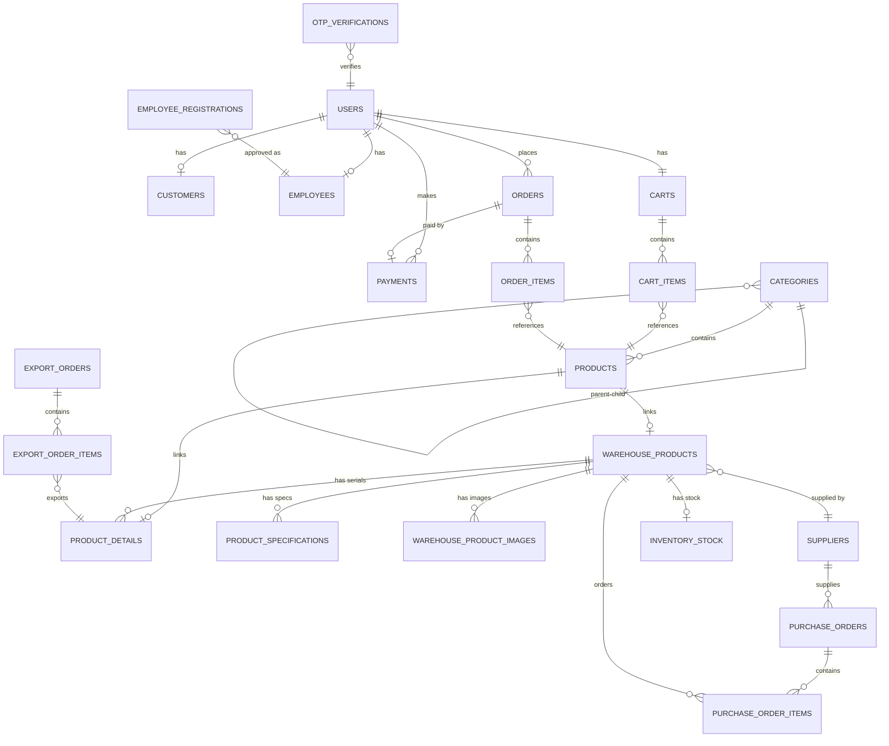

# Sơ Đồ Database - WEB_TMDT

## 1. Entity Relationship Diagram (ERD)



## 2. Chi Tiết Các Bảng

### 2.1 Module Auth (Xác thực & Phân quyền)

#### USERS
```sql
CREATE TABLE users (
    id BIGINT PRIMARY KEY AUTO_INCREMENT,
    email VARCHAR(255) UNIQUE NOT NULL,
    password VARCHAR(255) NOT NULL,
    role ENUM('ADMIN', 'PRODUCT_MANAGER', 'WAREHOUSE_MANAGER', 'CUSTOMER') NOT NULL,
    status ENUM('ACTIVE', 'INACTIVE', 'BANNED') NOT NULL DEFAULT 'ACTIVE',
    created_at TIMESTAMP DEFAULT CURRENT_TIMESTAMP
);
```

**Mối quan hệ**:
- 1-1 với CUSTOMERS
- 1-1 với EMPLOYEES
- 1-1 với CARTS
- 1-N với ORDERS
- 1-N với PAYMENTS

#### CUSTOMERS
```sql
CREATE TABLE customers (
    id BIGINT PRIMARY KEY AUTO_INCREMENT,
    user_id BIGINT NOT NULL UNIQUE,
    full_name VARCHAR(255) NOT NULL,
    phone VARCHAR(20) UNIQUE NOT NULL,
    gender VARCHAR(10),
    birth_date DATE,
    address TEXT,
    FOREIGN KEY (user_id) REFERENCES users(id) ON DELETE CASCADE
);
```

#### EMPLOYEES
```sql
CREATE TABLE employees (
    id BIGINT PRIMARY KEY AUTO_INCREMENT,
    user_id BIGINT UNIQUE,
    position ENUM('ADMIN', 'PRODUCT_MANAGER', 'WAREHOUSE_MANAGER'),
    full_name VARCHAR(255),
    phone VARCHAR(20),
    address TEXT,
    first_login BOOLEAN NOT NULL DEFAULT TRUE,
    FOREIGN KEY (user_id) REFERENCES users(id) ON DELETE CASCADE
);
```

#### EMPLOYEE_REGISTRATIONS
```sql
CREATE TABLE employee_registrations (
    id BIGINT PRIMARY KEY AUTO_INCREMENT,
    email VARCHAR(255) UNIQUE NOT NULL,
    full_name VARCHAR(255) NOT NULL,
    phone VARCHAR(20) NOT NULL,
    position ENUM('PRODUCT_MANAGER', 'WAREHOUSE_MANAGER') NOT NULL,
    status ENUM('PENDING', 'APPROVED', 'REJECTED') DEFAULT 'PENDING',
    created_at TIMESTAMP DEFAULT CURRENT_TIMESTAMP,
    approved_by BIGINT,
    approved_at TIMESTAMP,
    employee_id BIGINT,
    FOREIGN KEY (employee_id) REFERENCES employees(id)
);
```

#### OTP_VERIFICATIONS
```sql
CREATE TABLE otp_verifications (
    id BIGINT PRIMARY KEY AUTO_INCREMENT,
    user_id BIGINT,
    email VARCHAR(255) NOT NULL,
    otp_code VARCHAR(6) NOT NULL,
    created_at TIMESTAMP DEFAULT CURRENT_TIMESTAMP,
    expires_at TIMESTAMP NOT NULL,
    verified BOOLEAN DEFAULT FALSE,
    FOREIGN KEY (user_id) REFERENCES users(id) ON DELETE CASCADE
);
```

### 2.2 Module Product (Sản phẩm & Danh mục)

#### CATEGORIES
```sql
CREATE TABLE categories (
    id BIGINT PRIMARY KEY AUTO_INCREMENT,
    name VARCHAR(255) NOT NULL,
    slug VARCHAR(255) UNIQUE,
    description TEXT,
    image_url VARCHAR(500),
    display_order INT,
    active BOOLEAN DEFAULT TRUE,
    parent_id BIGINT,
    FOREIGN KEY (parent_id) REFERENCES categories(id) ON DELETE CASCADE
);
```

**Đặc điểm**: Hỗ trợ phân cấp (hierarchical) với parent-child relationship

#### PRODUCTS
```sql
CREATE TABLE products (
    id BIGINT PRIMARY KEY AUTO_INCREMENT,
    category_id BIGINT,
    name VARCHAR(255) NOT NULL,
    price DOUBLE,
    sku VARCHAR(255) UNIQUE,
    description TEXT,
    image_url VARCHAR(500),
    stock_quantity BIGINT,
    tech_specs_json TEXT,
    product_detail_id BIGINT,
    warehouse_product_id BIGINT,
    FOREIGN KEY (category_id) REFERENCES categories(id),
    FOREIGN KEY (warehouse_product_id) REFERENCES warehouse_products(id)
);
```

**Mối quan hệ**:
- N-1 với CATEGORIES
- 1-1 với WAREHOUSE_PRODUCTS (sản phẩm được publish từ kho)
- 1-1 với PRODUCT_DETAILS

### 2.3 Module Inventory (Quản lý kho)

#### WAREHOUSE_PRODUCTS
```sql
CREATE TABLE warehouse_products (
    id BIGINT PRIMARY KEY AUTO_INCREMENT,
    sku VARCHAR(64) UNIQUE NOT NULL,
    internal_name VARCHAR(255) NOT NULL,
    tech_specs_json TEXT,
    description TEXT,
    supplier_id BIGINT,
    last_import_date TIMESTAMP,
    FOREIGN KEY (supplier_id) REFERENCES suppliers(id)
);
```

**Mối quan hệ**:
- 1-N với PRODUCT_DETAILS (serial tracking)
- 1-N với PRODUCT_SPECIFICATIONS
- 1-N với WAREHOUSE_PRODUCT_IMAGES
- N-1 với SUPPLIERS
- 1-1 với INVENTORY_STOCK

#### PRODUCT_DETAILS
```sql
CREATE TABLE product_details (
    id BIGINT PRIMARY KEY AUTO_INCREMENT,
    warehouse_product_id BIGINT NOT NULL,
    serial_number VARCHAR(255) UNIQUE NOT NULL,
    status ENUM('IN_STOCK', 'RESERVED', 'SOLD', 'DAMAGED', 'RETURNED') DEFAULT 'IN_STOCK',
    import_date TIMESTAMP,
    import_price DOUBLE,
    purchase_order_id BIGINT,
    export_order_id BIGINT,
    notes TEXT,
    FOREIGN KEY (warehouse_product_id) REFERENCES warehouse_products(id),
    FOREIGN KEY (purchase_order_id) REFERENCES purchase_orders(id),
    FOREIGN KEY (export_order_id) REFERENCES export_orders(id)
);
```

**Đặc điểm**: Theo dõi từng serial number của sản phẩm

#### PRODUCT_SPECIFICATIONS
```sql
CREATE TABLE product_specifications (
    id BIGINT PRIMARY KEY AUTO_INCREMENT,
    warehouse_product_id BIGINT NOT NULL,
    spec_key VARCHAR(100) NOT NULL,
    spec_value VARCHAR(500),
    FOREIGN KEY (warehouse_product_id) REFERENCES warehouse_products(id) ON DELETE CASCADE
);
```

#### WAREHOUSE_PRODUCT_IMAGES
```sql
CREATE TABLE warehouse_product_images (
    id BIGINT PRIMARY KEY AUTO_INCREMENT,
    warehouse_product_id BIGINT NOT NULL,
    image_url VARCHAR(500) NOT NULL,
    display_order INT DEFAULT 0,
    FOREIGN KEY (warehouse_product_id) REFERENCES warehouse_products(id) ON DELETE CASCADE
);
```

#### INVENTORY_STOCK
```sql
CREATE TABLE inventory_stock (
    id BIGINT PRIMARY KEY AUTO_INCREMENT,
    warehouse_product_id BIGINT NOT NULL UNIQUE,
    on_hand BIGINT NOT NULL DEFAULT 0,      -- Tồn thực tế
    reserved BIGINT NOT NULL DEFAULT 0,     -- Đã giữ chỗ cho đơn
    damaged BIGINT NOT NULL DEFAULT 0,      -- Sản phẩm lỗi
    last_audit_date DATE,
    FOREIGN KEY (warehouse_product_id) REFERENCES warehouse_products(id)
);
```

**Công thức tính**:
- `sellable = on_hand - reserved - damaged` (Có thể bán)
- `available = on_hand - reserved` (Còn trong kho)

#### SUPPLIERS
```sql
CREATE TABLE suppliers (
    id BIGINT PRIMARY KEY AUTO_INCREMENT,
    auto_created BOOLEAN NOT NULL DEFAULT FALSE,
    name VARCHAR(255) NOT NULL,
    contact_name VARCHAR(255),
    phone VARCHAR(20),
    email VARCHAR(255),
    address TEXT,
    tax_code VARCHAR(50) UNIQUE NOT NULL,
    bank_account VARCHAR(50),
    payment_term TEXT,
    active BOOLEAN NOT NULL DEFAULT TRUE
);
```

#### PURCHASE_ORDERS (Đơn đặt hàng nhập kho)
```sql
CREATE TABLE purchase_orders (
    id BIGINT PRIMARY KEY AUTO_INCREMENT,
    po_code VARCHAR(50) UNIQUE NOT NULL,
    supplier_tax_code VARCHAR(50) NOT NULL,
    order_date TIMESTAMP,
    received_date TIMESTAMP,
    status ENUM('CREATED', 'RECEIVED', 'CANCELED'),
    created_by VARCHAR(255),
    note TEXT,
    FOREIGN KEY (supplier_tax_code) REFERENCES suppliers(tax_code)
);
```

#### PURCHASE_ORDER_ITEMS
```sql
CREATE TABLE purchase_order_items (
    id BIGINT PRIMARY KEY AUTO_INCREMENT,
    purchase_order_id BIGINT NOT NULL,
    warehouse_product_id BIGINT NOT NULL,
    quantity INT NOT NULL,
    unit_price DOUBLE NOT NULL,
    FOREIGN KEY (purchase_order_id) REFERENCES purchase_orders(id) ON DELETE CASCADE,
    FOREIGN KEY (warehouse_product_id) REFERENCES warehouse_products(id)
);
```

#### EXPORT_ORDERS (Phiếu xuất kho)
```sql
CREATE TABLE export_orders (
    id BIGINT PRIMARY KEY AUTO_INCREMENT,
    export_code VARCHAR(50) UNIQUE NOT NULL,
    export_date TIMESTAMP,
    created_by VARCHAR(255),
    reason VARCHAR(255),
    note TEXT,
    status ENUM('PENDING', 'COMPLETED', 'CANCELED')
);
```

#### EXPORT_ORDER_ITEMS
```sql
CREATE TABLE export_order_items (
    id BIGINT PRIMARY KEY AUTO_INCREMENT,
    export_order_id BIGINT NOT NULL,
    product_detail_id BIGINT NOT NULL,
    FOREIGN KEY (export_order_id) REFERENCES export_orders(id) ON DELETE CASCADE,
    FOREIGN KEY (product_detail_id) REFERENCES product_details(id)
);
```

### 2.4 Module Cart (Giỏ hàng)

#### CARTS
```sql
CREATE TABLE carts (
    id BIGINT PRIMARY KEY AUTO_INCREMENT,
    user_id BIGINT NOT NULL UNIQUE,
    created_at TIMESTAMP DEFAULT CURRENT_TIMESTAMP,
    updated_at TIMESTAMP DEFAULT CURRENT_TIMESTAMP ON UPDATE CURRENT_TIMESTAMP,
    FOREIGN KEY (user_id) REFERENCES users(id) ON DELETE CASCADE
);
```

#### CART_ITEMS
```sql
CREATE TABLE cart_items (
    id BIGINT PRIMARY KEY AUTO_INCREMENT,
    cart_id BIGINT NOT NULL,
    product_id BIGINT NOT NULL,
    quantity INT NOT NULL DEFAULT 1,
    price DOUBLE NOT NULL,
    added_at TIMESTAMP DEFAULT CURRENT_TIMESTAMP,
    FOREIGN KEY (cart_id) REFERENCES carts(id) ON DELETE CASCADE,
    FOREIGN KEY (product_id) REFERENCES products(id) ON DELETE CASCADE
);
```

### 2.5 Module Order (Đơn hàng)

#### ORDERS
```sql
CREATE TABLE orders (
    id BIGINT PRIMARY KEY AUTO_INCREMENT,
    order_code VARCHAR(50) UNIQUE NOT NULL,
    user_id BIGINT NOT NULL,
    
    -- Thông tin giao hàng
    customer_name VARCHAR(255) NOT NULL,
    customer_phone VARCHAR(20) NOT NULL,
    customer_email VARCHAR(255) NOT NULL,
    shipping_address TEXT NOT NULL,
    note TEXT,
    
    -- Giá tiền
    subtotal DOUBLE NOT NULL,
    shipping_fee DOUBLE NOT NULL,
    discount DOUBLE NOT NULL DEFAULT 0,
    total DOUBLE NOT NULL,
    
    -- Thanh toán
    payment_status ENUM('UNPAID', 'PENDING', 'PAID', 'FAILED', 'REFUNDED') NOT NULL,
    payment_id BIGINT,
    paid_at TIMESTAMP,
    
    -- Trạng thái đơn hàng
    status ENUM('PENDING', 'CONFIRMED', 'PROCESSING', 'SHIPPING', 'DELIVERED', 'CANCELLED') NOT NULL,
    
    -- Timestamps
    created_at TIMESTAMP DEFAULT CURRENT_TIMESTAMP,
    confirmed_at TIMESTAMP,
    shipped_at TIMESTAMP,
    delivered_at TIMESTAMP,
    cancelled_at TIMESTAMP,
    cancel_reason TEXT,
    
    FOREIGN KEY (user_id) REFERENCES users(id)
);
```

#### ORDER_ITEMS
```sql
CREATE TABLE order_items (
    id BIGINT PRIMARY KEY AUTO_INCREMENT,
    order_id BIGINT NOT NULL,
    product_id BIGINT NOT NULL,
    product_name VARCHAR(255) NOT NULL,
    product_sku VARCHAR(255),
    quantity INT NOT NULL,
    price DOUBLE NOT NULL,
    subtotal DOUBLE NOT NULL,
    FOREIGN KEY (order_id) REFERENCES orders(id) ON DELETE CASCADE,
    FOREIGN KEY (product_id) REFERENCES products(id)
);
```

### 2.6 Module Payment (Thanh toán)

#### PAYMENTS
```sql
CREATE TABLE payments (
    id BIGINT PRIMARY KEY AUTO_INCREMENT,
    payment_code VARCHAR(50) UNIQUE NOT NULL,
    order_id BIGINT NOT NULL,
    user_id BIGINT NOT NULL,
    amount DOUBLE NOT NULL,
    method ENUM('SEPAY', 'COD', 'BANK_TRANSFER') NOT NULL,
    status ENUM('PENDING', 'PAID', 'FAILED', 'EXPIRED', 'REFUNDED') NOT NULL,
    
    -- SePay specific
    sepay_transaction_id VARCHAR(255),
    sepay_bank_code VARCHAR(50),
    sepay_account_number VARCHAR(50),
    sepay_account_name VARCHAR(255),
    sepay_content VARCHAR(500),
    sepay_qr_code VARCHAR(500),
    sepay_response TEXT,
    
    -- Timestamps
    created_at TIMESTAMP DEFAULT CURRENT_TIMESTAMP,
    paid_at TIMESTAMP,
    expired_at TIMESTAMP,
    failure_reason TEXT,
    
    FOREIGN KEY (order_id) REFERENCES orders(id),
    FOREIGN KEY (user_id) REFERENCES users(id)
);
```

## 3. Indexes & Performance

### Recommended Indexes

```sql
-- Users
CREATE INDEX idx_users_email ON users(email);
CREATE INDEX idx_users_role ON users(role);

-- Products
CREATE INDEX idx_products_category ON products(category_id);
CREATE INDEX idx_products_sku ON products(sku);
CREATE INDEX idx_products_name ON products(name);

-- Warehouse Products
CREATE INDEX idx_warehouse_products_sku ON warehouse_products(sku);
CREATE INDEX idx_warehouse_products_supplier ON warehouse_products(supplier_id);

-- Product Details
CREATE INDEX idx_product_details_serial ON product_details(serial_number);
CREATE INDEX idx_product_details_status ON product_details(status);
CREATE INDEX idx_product_details_warehouse_product ON product_details(warehouse_product_id);

-- Orders
CREATE INDEX idx_orders_user ON orders(user_id);
CREATE INDEX idx_orders_code ON orders(order_code);
CREATE INDEX idx_orders_status ON orders(status);
CREATE INDEX idx_orders_created_at ON orders(created_at);

-- Payments
CREATE INDEX idx_payments_order ON payments(order_id);
CREATE INDEX idx_payments_user ON payments(user_id);
CREATE INDEX idx_payments_status ON payments(status);

-- Purchase Orders
CREATE INDEX idx_purchase_orders_code ON purchase_orders(po_code);
CREATE INDEX idx_purchase_orders_supplier ON purchase_orders(supplier_tax_code);
CREATE INDEX idx_purchase_orders_status ON purchase_orders(status);
```

## 4. Luồng Dữ Liệu Chính

### 4.1 Luồng Nhập Hàng
```
1. Tạo PURCHASE_ORDER (status: CREATED)
2. Thêm PURCHASE_ORDER_ITEMS
3. Complete PO:
   - Tạo PRODUCT_DETAILS cho mỗi serial
   - Cập nhật INVENTORY_STOCK (on_hand += quantity)
   - Cập nhật PURCHASE_ORDER (status: RECEIVED)
```

### 4.2 Luồng Publish Sản Phẩm
```
1. Chọn WAREHOUSE_PRODUCT
2. Tạo PRODUCT mới:
   - Link warehouse_product_id
   - Copy thông tin (name, description, specs)
   - Set stock_quantity từ INVENTORY_STOCK
3. Sản phẩm hiển thị trên website
```

### 4.3 Luồng Đặt Hàng
```
1. Tạo ORDER (status: PENDING, payment_status: UNPAID)
2. Tạo ORDER_ITEMS từ CART_ITEMS
3. Tạo PAYMENT (status: PENDING)
4. Webhook từ SePay:
   - Cập nhật PAYMENT (status: PAID)
   - Cập nhật ORDER (payment_status: PAID, status: CONFIRMED)
5. Xuất kho:
   - Tạo EXPORT_ORDER
   - Cập nhật PRODUCT_DETAILS (status: SOLD)
   - Cập nhật INVENTORY_STOCK (on_hand -= quantity)
```

## 5. Ràng Buộc & Business Rules

### Inventory Rules
- `on_hand >= reserved + damaged`
- `sellable = on_hand - reserved - damaged >= 0`
- Không thể xuất kho nếu `sellable < quantity`

### Order Rules
- Order chỉ có thể CONFIRMED khi payment_status = PAID
- Không thể CANCEL order khi status = DELIVERED
- Order CANCELLED phải có cancel_reason

### Product Rules
- Product.stock_quantity phải sync với INVENTORY_STOCK.sellable
- Product chỉ có thể publish nếu INVENTORY_STOCK.sellable > 0
- SKU phải unique trong cả PRODUCTS và WAREHOUSE_PRODUCTS

### Payment Rules
- Payment expires sau 15 phút nếu không thanh toán
- Một ORDER chỉ có một PAYMENT active
- Payment.amount phải bằng Order.total
