# Sơ Đồ Chi Tiết Hệ Thống - WEB_TMDT

## 1. Sơ Đồ Use Case (Use Case Diagram)

### 1.1 Use Case - Customer (Khách hàng)

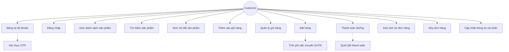
```mermaid
graph TB
    Customer((Customer))
    
    Customer --> UC1[Đăng ký tài khoản]
    Customer --> UC2[Đăng nhập]
    Customer --> UC3[Xem danh sách sản phẩm]
    Customer --> UC4[Tìm kiếm sản phẩm]
    Customer --> UC5[Xem chi tiết sản phẩm]
    Customer --> UC6[Thêm vào giỏ hàng]
    Customer --> UC7[Quản lý giỏ hàng]
    Customer --> UC8[Đặt hàng]
    Customer --> UC9[Thanh toán SePay]
    Customer --> UC10[Xem lịch sử đơn hàng]
    Customer --> UC11[Hủy đơn hàng]
    Customer --> UC12[Cập nhật thông tin cá nhân]
    
    UC1 -.-> UC13[Xác thực OTP]
    UC8 -.-> UC14[Tính phí vận chuyển GHTK]
    UC9 -.-> UC15[Quét QR thanh toán]
```

### 1.2 Use Case - Product Manager (Quản lý sản phẩm)

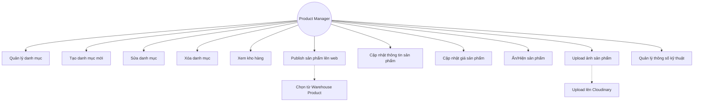
```mermaid
graph TB
    PM((Product Manager))
    
    PM --> UC1[Quản lý danh mục]
    PM --> UC2[Tạo danh mục mới]
    PM --> UC3[Sửa danh mục]
    PM --> UC4[Xóa danh mục]
    PM --> UC5[Xem kho hàng]
    PM --> UC6[Publish sản phẩm lên web]
    PM --> UC7[Cập nhật thông tin sản phẩm]
    PM --> UC8[Cập nhật giá sản phẩm]
    PM --> UC9[Ẩn/Hiện sản phẩm]
    PM --> UC10[Upload ảnh sản phẩm]
    PM --> UC11[Quản lý thông số kỹ thuật]
    
    UC6 -.-> UC12[Chọn từ Warehouse Product]
    UC10 -.-> UC13[Upload lên Cloudinary]
```

### 1.3 Use Case - Warehouse Manager (Quản lý kho)

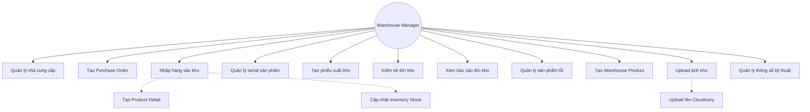
```mermaid
graph TB
    WM((Warehouse Manager))
    
    WM --> UC1[Quản lý nhà cung cấp]
    WM --> UC2[Tạo Purchase Order]
    WM --> UC3[Nhập hàng vào kho]
    WM --> UC4[Quản lý serial sản phẩm]
    WM --> UC5[Tạo phiếu xuất kho]
    WM --> UC6[Kiểm kê tồn kho]
    WM --> UC7[Xem báo cáo tồn kho]
    WM --> UC8[Quản lý sản phẩm lỗi]
    WM --> UC9[Tạo Warehouse Product]
    WM --> UC10[Upload ảnh kho]
    WM --> UC11[Quản lý thông số kỹ thuật]
    
    UC3 -.-> UC12[Tạo Product Detail]
    UC3 -.-> UC13[Cập nhật Inventory Stock]
    UC10 -.-> UC14[Upload lên Cloudinary]
```

### 1.4 Use Case - Admin

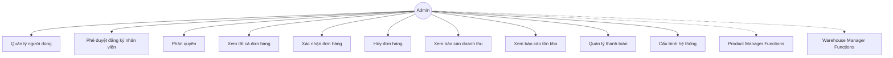
```mermaid
graph TB
    Admin((Admin))
    
    Admin --> UC1[Quản lý người dùng]
    Admin --> UC2[Phê duyệt đăng ký nhân viên]
    Admin --> UC3[Phân quyền]
    Admin --> UC4[Xem tất cả đơn hàng]
    Admin --> UC5[Xác nhận đơn hàng]
    Admin --> UC6[Hủy đơn hàng]
    Admin --> UC7[Xem báo cáo doanh thu]
    Admin --> UC8[Xem báo cáo tồn kho]
    Admin --> UC9[Quản lý thanh toán]
    Admin --> UC10[Cấu hình hệ thống]
    
    Admin -.-> PM[Product Manager Functions]
    Admin -.-> WM[Warehouse Manager Functions]
```

## 2. Sơ Đồ Luồng Hoạt Động (Activity Diagram)

### 2.1 Luồng Đăng Ký Khách Hàng

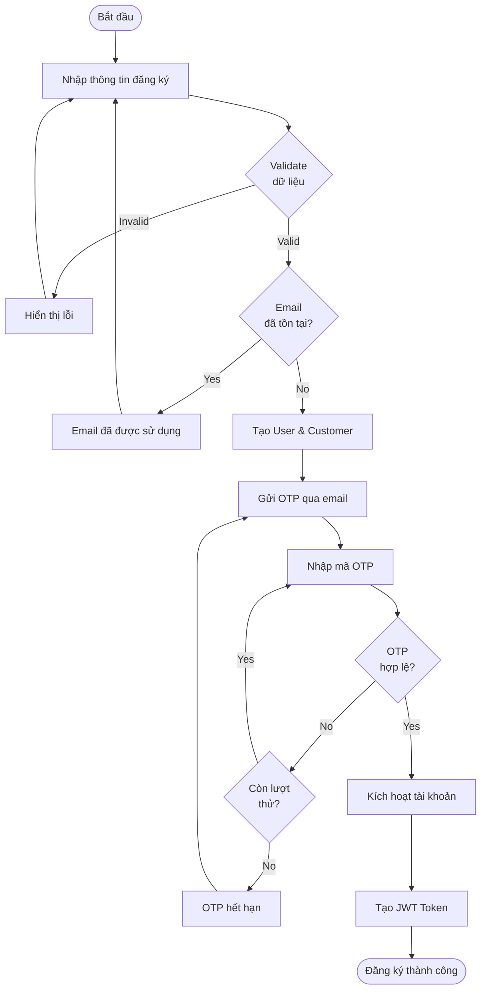
```mermaid
flowchart TD
    Start([Bắt đầu]) --> Input[Nhập thông tin đăng ký]
    Input --> Validate{Validate<br/>dữ liệu}
    Validate -->|Invalid| Error1[Hiển thị lỗi]
    Error1 --> Input
    
    Validate -->|Valid| CheckEmail{Email<br/>đã tồn tại?}
    CheckEmail -->|Yes| Error2[Email đã được sử dụng]
    Error2 --> Input
    
    CheckEmail -->|No| CreateUser[Tạo User & Customer]
    CreateUser --> SendOTP[Gửi OTP qua email]
    SendOTP --> InputOTP[Nhập mã OTP]
    
    InputOTP --> ValidateOTP{OTP<br/>hợp lệ?}
    ValidateOTP -->|No| CheckRetry{Còn lượt<br/>thử?}
    CheckRetry -->|Yes| InputOTP
    CheckRetry -->|No| Error3[OTP hết hạn]
    Error3 --> SendOTP
    
    ValidateOTP -->|Yes| ActivateAccount[Kích hoạt tài khoản]
    ActivateAccount --> GenToken[Tạo JWT Token]
    GenToken --> End([Đăng ký thành công])
```

### 2.2 Luồng Đặt Hàng & Thanh Toán

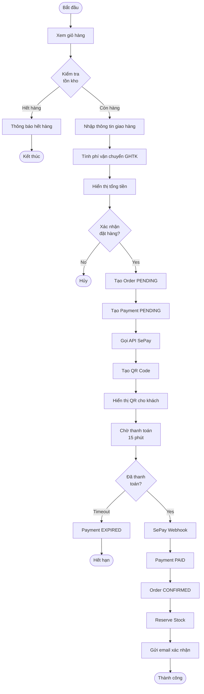
```mermaid
flowchart TD
    Start([Bắt đầu]) --> ViewCart[Xem giỏ hàng]
    ViewCart --> CheckStock{Kiểm tra<br/>tồn kho}
    CheckStock -->|Hết hàng| Error1[Thông báo hết hàng]
    Error1 --> End1([Kết thúc])
    
    CheckStock -->|Còn hàng| InputInfo[Nhập thông tin giao hàng]
    InputInfo --> CalcShipping[Tính phí vận chuyển GHTK]
    CalcShipping --> ShowTotal[Hiển thị tổng tiền]
    
    ShowTotal --> Confirm{Xác nhận<br/>đặt hàng?}
    Confirm -->|No| End2([Hủy])
    
    Confirm -->|Yes| CreateOrder[Tạo Order PENDING]
    CreateOrder --> CreatePayment[Tạo Payment PENDING]
    CreatePayment --> CallSePay[Gọi API SePay]
    CallSePay --> GenQR[Tạo QR Code]
    GenQR --> ShowQR[Hiển thị QR cho khách]
    
    ShowQR --> WaitPayment[Chờ thanh toán<br/>15 phút]
    WaitPayment --> CheckPayment{Đã thanh<br/>toán?}
    
    CheckPayment -->|Timeout| ExpirePayment[Payment EXPIRED]
    ExpirePayment --> End3([Hết hạn])
    
    CheckPayment -->|Yes| Webhook[SePay Webhook]
    Webhook --> UpdatePayment[Payment PAID]
    UpdatePayment --> UpdateOrder[Order CONFIRMED]
    UpdateOrder --> ReserveStock[Reserve Stock]
    ReserveStock --> SendEmail[Gửi email xác nhận]
    SendEmail --> End4([Thành công])
```

### 2.3 Luồng Nhập Hàng Vào Kho

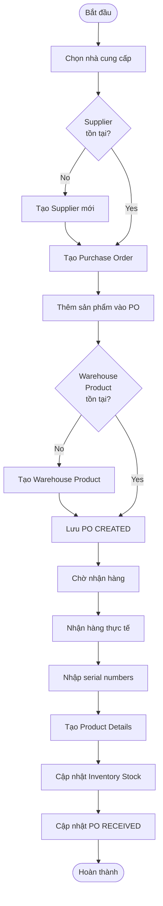
```mermaid
flowchart TD
    Start([Bắt đầu]) --> SelectSupplier[Chọn nhà cung cấp]
    SelectSupplier --> CheckSupplier{Supplier<br/>tồn tại?}
    CheckSupplier -->|No| CreateSupplier[Tạo Supplier mới]
    CreateSupplier --> CreatePO
    CheckSupplier -->|Yes| CreatePO[Tạo Purchase Order]
    
    CreatePO --> AddItems[Thêm sản phẩm vào PO]
    AddItems --> CheckWP{Warehouse<br/>Product<br/>tồn tại?}
    CheckWP -->|No| CreateWP[Tạo Warehouse Product]
    CreateWP --> SavePO
    CheckWP -->|Yes| SavePO[Lưu PO CREATED]
    
    SavePO --> WaitReceive[Chờ nhận hàng]
    WaitReceive --> ReceiveGoods[Nhận hàng thực tế]
    ReceiveGoods --> InputSerials[Nhập serial numbers]
    
    InputSerials --> CreateDetails[Tạo Product Details]
    CreateDetails --> UpdateStock[Cập nhật Inventory Stock]
    UpdateStock --> UpdatePO[Cập nhật PO RECEIVED]
    UpdatePO --> End([Hoàn thành])
```

### 2.4 Luồng Publish Sản Phẩm Lên Web

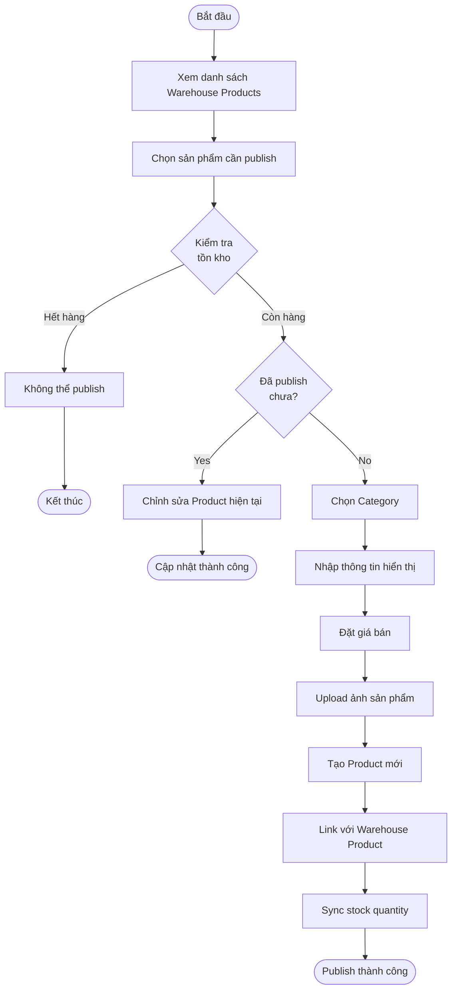
```mermaid
flowchart TD
    Start([Bắt đầu]) --> ViewWarehouse[Xem danh sách Warehouse Products]
    ViewWarehouse --> SelectWP[Chọn sản phẩm cần publish]
    
    SelectWP --> CheckStock{Kiểm tra<br/>tồn kho}
    CheckStock -->|Hết hàng| Error[Không thể publish]
    Error --> End1([Kết thúc])
    
    CheckStock -->|Còn hàng| CheckPublished{Đã publish<br/>chưa?}
    CheckPublished -->|Yes| EditProduct[Chỉnh sửa Product hiện tại]
    EditProduct --> End2([Cập nhật thành công])
    
    CheckPublished -->|No| SelectCategory[Chọn Category]
    SelectCategory --> InputInfo[Nhập thông tin hiển thị]
    InputInfo --> SetPrice[Đặt giá bán]
    SetPrice --> UploadImages[Upload ảnh sản phẩm]
    UploadImages --> CreateProduct[Tạo Product mới]
    CreateProduct --> LinkWP[Link với Warehouse Product]
    LinkWP --> SyncStock[Sync stock quantity]
    SyncStock --> End3([Publish thành công])
```

## 3. Sơ Đồ Trạng Thái (State Diagram)

### 3.1 Trạng Thái Đơn Hàng (Order Status)

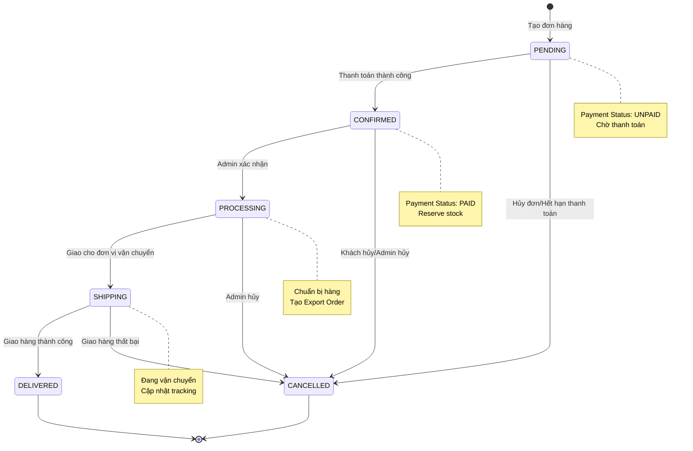
```mermaid
stateDiagram-v2
    [*] --> PENDING: Tạo đơn hàng
    
    PENDING --> CONFIRMED: Thanh toán thành công
    PENDING --> CANCELLED: Hủy đơn/Hết hạn thanh toán
    
    CONFIRMED --> PROCESSING: Admin xác nhận
    CONFIRMED --> CANCELLED: Khách hủy/Admin hủy
    
    PROCESSING --> SHIPPING: Giao cho đơn vị vận chuyển
    PROCESSING --> CANCELLED: Admin hủy
    
    SHIPPING --> DELIVERED: Giao hàng thành công
    SHIPPING --> CANCELLED: Giao hàng thất bại
    
    DELIVERED --> [*]
    CANCELLED --> [*]
    
    note right of PENDING
        Payment Status: UNPAID
        Chờ thanh toán
    end note
    
    note right of CONFIRMED
        Payment Status: PAID
        Reserve stock
    end note
    
    note right of PROCESSING
        Chuẩn bị hàng
        Tạo Export Order
    end note
    
    note right of SHIPPING
        Đang vận chuyển
        Cập nhật tracking
    end note
```

### 3.2 Trạng Thái Thanh Toán (Payment Status)

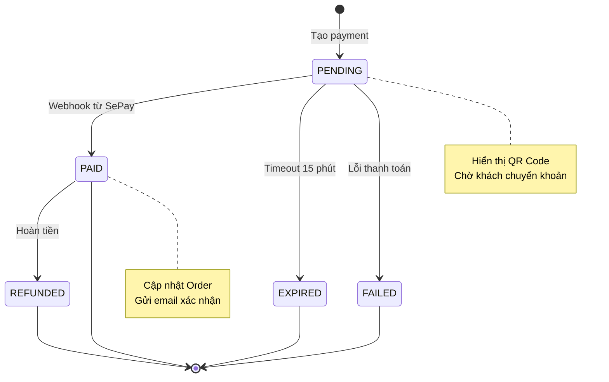
```mermaid
stateDiagram-v2
    [*] --> PENDING: Tạo payment
    
    PENDING --> PAID: Webhook từ SePay
    PENDING --> EXPIRED: Timeout 15 phút
    PENDING --> FAILED: Lỗi thanh toán
    
    PAID --> REFUNDED: Hoàn tiền
    
    EXPIRED --> [*]
    FAILED --> [*]
    REFUNDED --> [*]
    PAID --> [*]
    
    note right of PENDING
        Hiển thị QR Code
        Chờ khách chuyển khoản
    end note
    
    note right of PAID
        Cập nhật Order
        Gửi email xác nhận
    end note
```

### 3.3 Trạng Thái Product Detail (Serial Status)

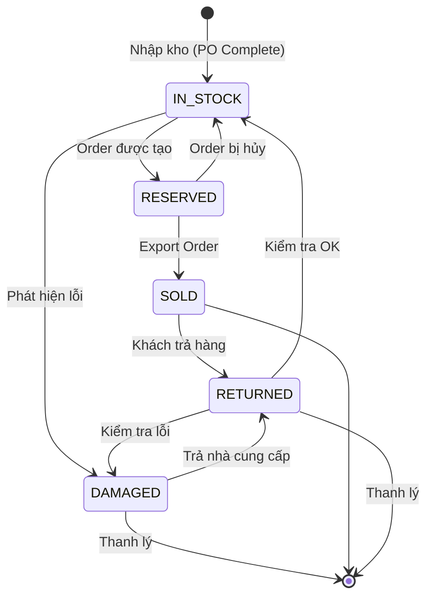
```mermaid
stateDiagram-v2
    [*] --> IN_STOCK: Nhập kho (PO Complete)
    
    IN_STOCK --> RESERVED: Order được tạo
    IN_STOCK --> DAMAGED: Phát hiện lỗi
    
    RESERVED --> SOLD: Export Order
    RESERVED --> IN_STOCK: Order bị hủy
    
    DAMAGED --> RETURNED: Trả nhà cung cấp
    DAMAGED --> [*]: Thanh lý
    
    SOLD --> RETURNED: Khách trả hàng
    SOLD --> [*]
    
    RETURNED --> IN_STOCK: Kiểm tra OK
    RETURNED --> DAMAGED: Kiểm tra lỗi
    RETURNED --> [*]: Thanh lý
```

## 4. Sơ Đồ Tuần Tự (Sequence Diagram)

### 4.1 Sequence - Đăng Nhập với JWT

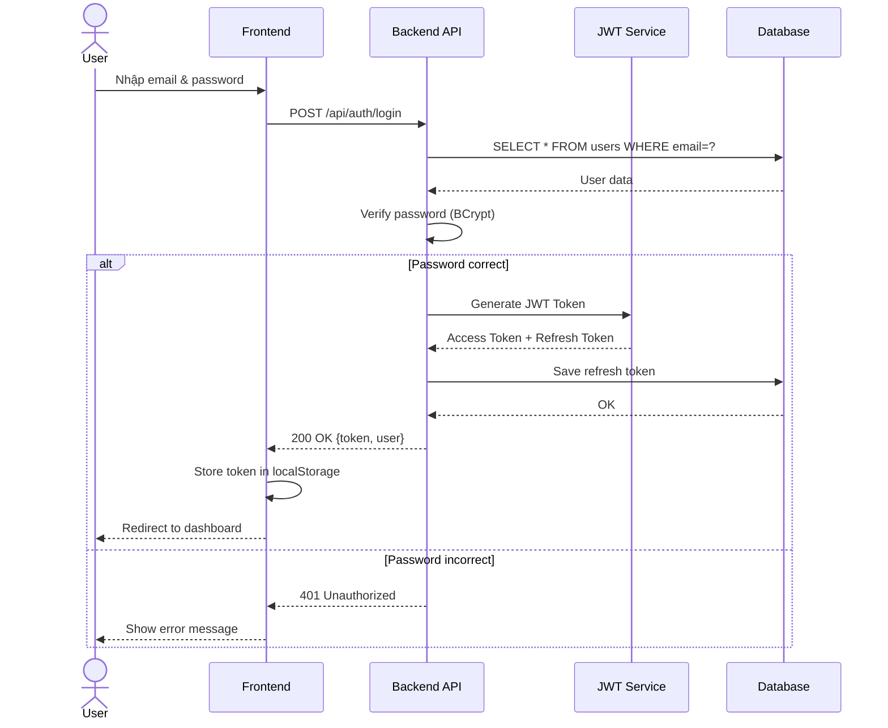
```mermaid
sequenceDiagram
    actor User
    participant FE as Frontend
    participant API as Backend API
    participant JWT as JWT Service
    participant DB as Database
    
    User->>FE: Nhập email & password
    FE->>API: POST /api/auth/login
    
    API->>DB: SELECT * FROM users WHERE email=?
    DB-->>API: User data
    
    API->>API: Verify password (BCrypt)
    
    alt Password correct
        API->>JWT: Generate JWT Token
        JWT-->>API: Access Token + Refresh Token
        
        API->>DB: Save refresh token
        DB-->>API: OK
        
        API-->>FE: 200 OK {token, user}
        FE->>FE: Store token in localStorage
        FE-->>User: Redirect to dashboard
    else Password incorrect
        API-->>FE: 401 Unauthorized
        FE-->>User: Show error message
    end
```

### 4.2 Sequence - Thêm Sản Phẩm Vào Giỏ

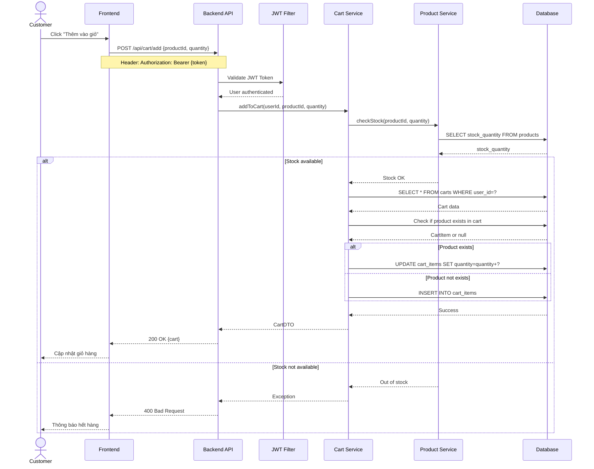
```mermaid
sequenceDiagram
    actor Customer
    participant FE as Frontend
    participant API as Backend API
    participant Auth as JWT Filter
    participant CartSvc as Cart Service
    participant ProdSvc as Product Service
    participant DB as Database
    
    Customer->>FE: Click "Thêm vào giỏ"
    FE->>API: POST /api/cart/add {productId, quantity}
    Note over FE,API: Header: Authorization: Bearer {token}
    
    API->>Auth: Validate JWT Token
    Auth-->>API: User authenticated
    
    API->>CartSvc: addToCart(userId, productId, quantity)
    
    CartSvc->>ProdSvc: checkStock(productId, quantity)
    ProdSvc->>DB: SELECT stock_quantity FROM products
    DB-->>ProdSvc: stock_quantity
    
    alt Stock available
        ProdSvc-->>CartSvc: Stock OK
        
        CartSvc->>DB: SELECT * FROM carts WHERE user_id=?
        DB-->>CartSvc: Cart data
        
        CartSvc->>DB: Check if product exists in cart
        DB-->>CartSvc: CartItem or null
        
        alt Product exists
            CartSvc->>DB: UPDATE cart_items SET quantity=quantity+?
        else Product not exists
            CartSvc->>DB: INSERT INTO cart_items
        end
        
        DB-->>CartSvc: Success
        CartSvc-->>API: CartDTO
        API-->>FE: 200 OK {cart}
        FE-->>Customer: Cập nhật giỏ hàng
    else Stock not available
        ProdSvc-->>CartSvc: Out of stock
        CartSvc-->>API: Exception
        API-->>FE: 400 Bad Request
        FE-->>Customer: Thông báo hết hàng
    end
```

### 4.3 Sequence - Webhook Thanh Toán SePay

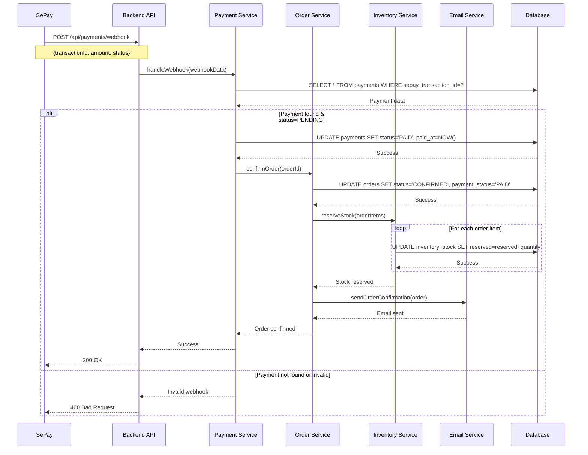
```mermaid
sequenceDiagram
    participant SePay
    participant API as Backend API
    participant PaySvc as Payment Service
    participant OrderSvc as Order Service
    participant InvSvc as Inventory Service
    participant Email as Email Service
    participant DB as Database
    
    SePay->>API: POST /api/payments/webhook
    Note over SePay,API: {transactionId, amount, status}
    
    API->>PaySvc: handleWebhook(webhookData)
    
    PaySvc->>DB: SELECT * FROM payments WHERE sepay_transaction_id=?
    DB-->>PaySvc: Payment data
    
    alt Payment found & status=PENDING
        PaySvc->>DB: UPDATE payments SET status='PAID', paid_at=NOW()
        DB-->>PaySvc: Success
        
        PaySvc->>OrderSvc: confirmOrder(orderId)
        
        OrderSvc->>DB: UPDATE orders SET status='CONFIRMED', payment_status='PAID'
        DB-->>OrderSvc: Success
        
        OrderSvc->>InvSvc: reserveStock(orderItems)
        
        loop For each order item
            InvSvc->>DB: UPDATE inventory_stock SET reserved=reserved+quantity
            DB-->>InvSvc: Success
        end
        
        InvSvc-->>OrderSvc: Stock reserved
        
        OrderSvc->>Email: sendOrderConfirmation(order)
        Email-->>OrderSvc: Email sent
        
        OrderSvc-->>PaySvc: Order confirmed
        PaySvc-->>API: Success
        API-->>SePay: 200 OK
    else Payment not found or invalid
        PaySvc-->>API: Invalid webhook
        API-->>SePay: 400 Bad Request
    end
```

### 4.4 Sequence - Complete Purchase Order

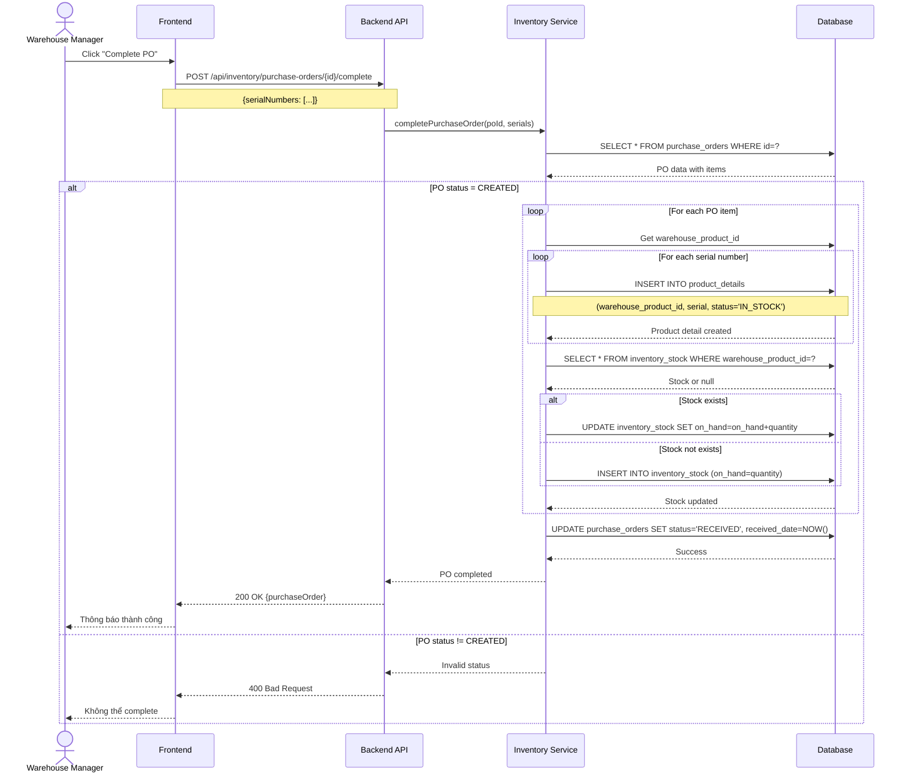
```mermaid
sequenceDiagram
    actor WM as Warehouse Manager
    participant FE as Frontend
    participant API as Backend API
    participant InvSvc as Inventory Service
    participant DB as Database
    
    WM->>FE: Click "Complete PO"
    FE->>API: POST /api/inventory/purchase-orders/{id}/complete
    Note over FE,API: {serialNumbers: [...]}
    
    API->>InvSvc: completePurchaseOrder(poId, serials)
    
    InvSvc->>DB: SELECT * FROM purchase_orders WHERE id=?
    DB-->>InvSvc: PO data with items
    
    alt PO status = CREATED
        loop For each PO item
            InvSvc->>DB: Get warehouse_product_id
            
            loop For each serial number
                InvSvc->>DB: INSERT INTO product_details
                Note over InvSvc,DB: (warehouse_product_id, serial, status='IN_STOCK')
                DB-->>InvSvc: Product detail created
            end
            
            InvSvc->>DB: SELECT * FROM inventory_stock WHERE warehouse_product_id=?
            DB-->>InvSvc: Stock or null
            
            alt Stock exists
                InvSvc->>DB: UPDATE inventory_stock SET on_hand=on_hand+quantity
            else Stock not exists
                InvSvc->>DB: INSERT INTO inventory_stock (on_hand=quantity)
            end
            
            DB-->>InvSvc: Stock updated
        end
        
        InvSvc->>DB: UPDATE purchase_orders SET status='RECEIVED', received_date=NOW()
        DB-->>InvSvc: Success
        
        InvSvc-->>API: PO completed
        API-->>FE: 200 OK {purchaseOrder}
        FE-->>WM: Thông báo thành công
    else PO status != CREATED
        InvSvc-->>API: Invalid status
        API-->>FE: 400 Bad Request
        FE-->>WM: Không thể complete
    end
```

## 5. Sơ Đồ Lớp (Class Diagram)

### 5.1 Class Diagram - Auth Module

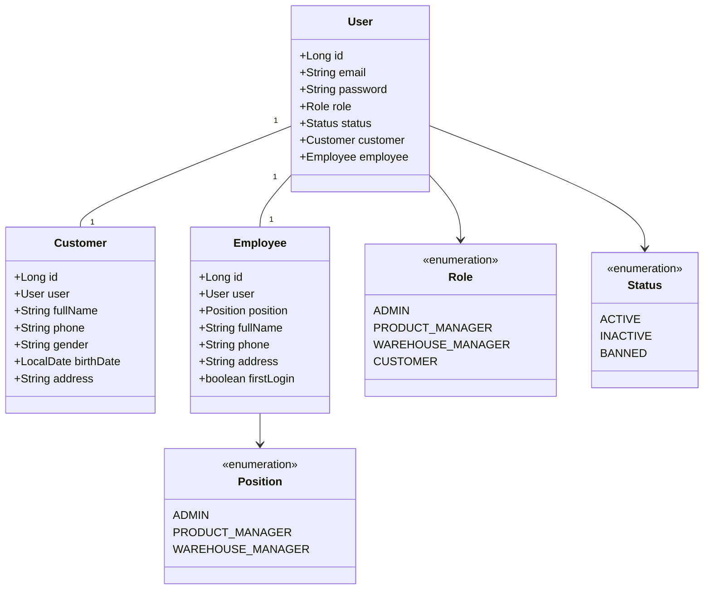
```mermaid
classDiagram
    class User {
        +Long id
        +String email
        +String password
        +Role role
        +Status status
        +Customer customer
        +Employee employee
    }
    
    class Customer {
        +Long id
        +User user
        +String fullName
        +String phone
        +String gender
        +LocalDate birthDate
        +String address
    }
    
    class Employee {
        +Long id
        +User user
        +Position position
        +String fullName
        +String phone
        +String address
        +boolean firstLogin
    }
    
    class Role {
        <<enumeration>>
        ADMIN
        PRODUCT_MANAGER
        WAREHOUSE_MANAGER
        CUSTOMER
    }
    
    class Status {
        <<enumeration>>
        ACTIVE
        INACTIVE
        BANNED
    }
    
    class Position {
        <<enumeration>>
        ADMIN
        PRODUCT_MANAGER
        WAREHOUSE_MANAGER
    }
    
    User "1" -- "1" Customer
    User "1" -- "1" Employee
    User --> Role
    User --> Status
    Employee --> Position
```

### 5.2 Class Diagram - Product & Inventory Module

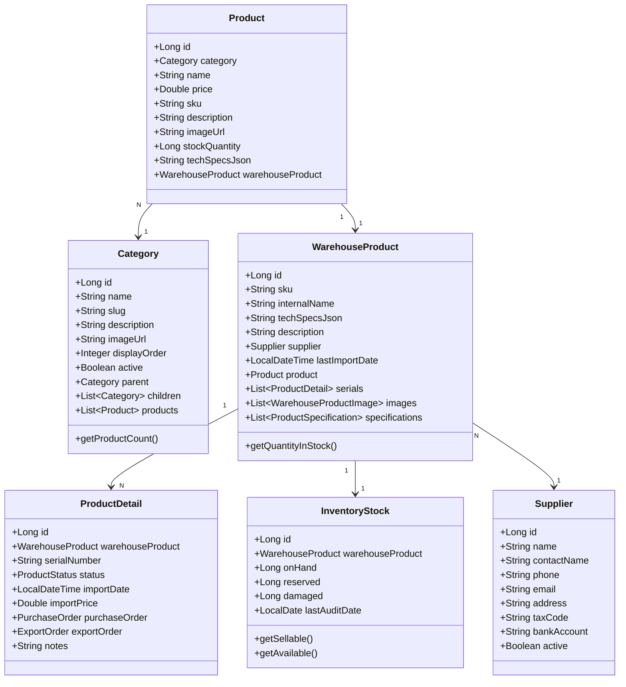
```mermaid
classDiagram
    class Product {
        +Long id
        +Category category
        +String name
        +Double price
        +String sku
        +String description
        +String imageUrl
        +Long stockQuantity
        +String techSpecsJson
        +WarehouseProduct warehouseProduct
    }
    
    class Category {
        +Long id
        +String name
        +String slug
        +String description
        +String imageUrl
        +Integer displayOrder
        +Boolean active
        +Category parent
        +List~Category~ children
        +List~Product~ products
        +getProductCount()
    }
    
    class WarehouseProduct {
        +Long id
        +String sku
        +String internalName
        +String techSpecsJson
        +String description
        +Supplier supplier
        +LocalDateTime lastImportDate
        +Product product
        +List~ProductDetail~ serials
        +List~WarehouseProductImage~ images
        +List~ProductSpecification~ specifications
        +getQuantityInStock()
    }
    
    class ProductDetail {
        +Long id
        +WarehouseProduct warehouseProduct
        +String serialNumber
        +ProductStatus status
        +LocalDateTime importDate
        +Double importPrice
        +PurchaseOrder purchaseOrder
        +ExportOrder exportOrder
        +String notes
    }
    
    class InventoryStock {
        +Long id
        +WarehouseProduct warehouseProduct
        +Long onHand
        +Long reserved
        +Long damaged
        +LocalDate lastAuditDate
        +getSellable()
        +getAvailable()
    }
    
    class Supplier {
        +Long id
        +String name
        +String contactName
        +String phone
        +String email
        +String address
        +String taxCode
        +String bankAccount
        +Boolean active
    }
    
    Product "N" --> "1" Category
    Product "1" --> "1" WarehouseProduct
    WarehouseProduct "1" --> "N" ProductDetail
    WarehouseProduct "1" --> "1" InventoryStock
    WarehouseProduct "N" --> "1" Supplier
```

### 5.3 Class Diagram - Order & Payment Module

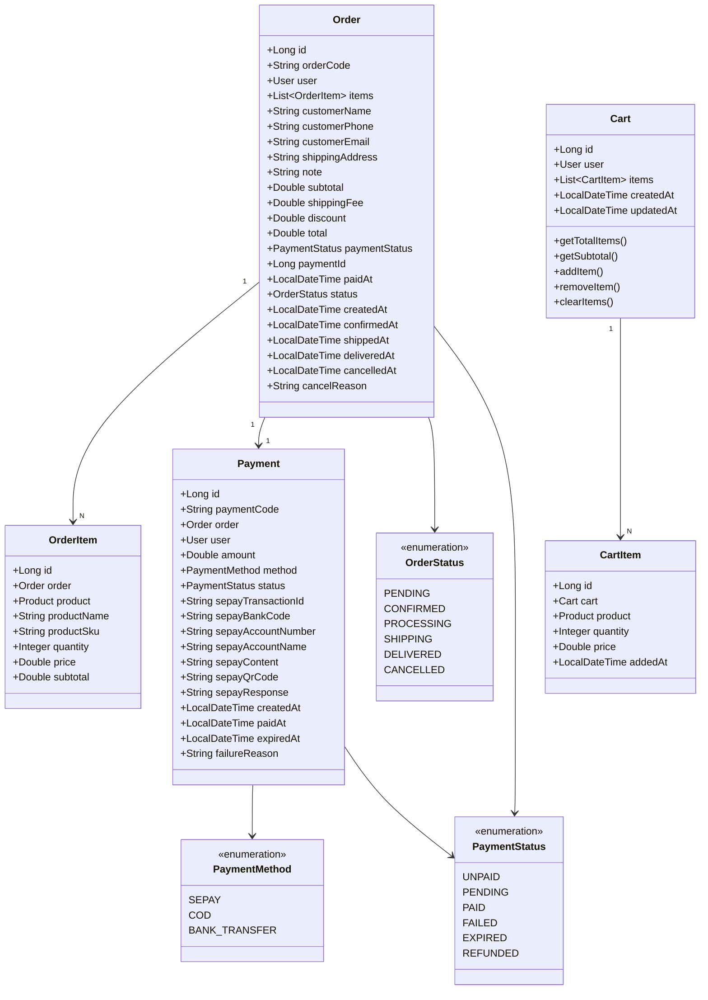
```mermaid
classDiagram
    class Order {
        +Long id
        +String orderCode
        +User user
        +List~OrderItem~ items
        +String customerName
        +String customerPhone
        +String customerEmail
        +String shippingAddress
        +String note
        +Double subtotal
        +Double shippingFee
        +Double discount
        +Double total
        +PaymentStatus paymentStatus
        +Long paymentId
        +LocalDateTime paidAt
        +OrderStatus status
        +LocalDateTime createdAt
        +LocalDateTime confirmedAt
        +LocalDateTime shippedAt
        +LocalDateTime deliveredAt
        +LocalDateTime cancelledAt
        +String cancelReason
    }
    
    class OrderItem {
        +Long id
        +Order order
        +Product product
        +String productName
        +String productSku
        +Integer quantity
        +Double price
        +Double subtotal
    }
    
    class Payment {
        +Long id
        +String paymentCode
        +Order order
        +User user
        +Double amount
        +PaymentMethod method
        +PaymentStatus status
        +String sepayTransactionId
        +String sepayBankCode
        +String sepayAccountNumber
        +String sepayAccountName
        +String sepayContent
        +String sepayQrCode
        +String sepayResponse
        +LocalDateTime createdAt
        +LocalDateTime paidAt
        +LocalDateTime expiredAt
        +String failureReason
    }
    
    class Cart {
        +Long id
        +User user
        +List~CartItem~ items
        +LocalDateTime createdAt
        +LocalDateTime updatedAt
        +getTotalItems()
        +getSubtotal()
        +addItem()
        +removeItem()
        +clearItems()
    }
    
    class CartItem {
        +Long id
        +Cart cart
        +Product product
        +Integer quantity
        +Double price
        +LocalDateTime addedAt
    }
    
    class OrderStatus {
        <<enumeration>>
        PENDING
        CONFIRMED
        PROCESSING
        SHIPPING
        DELIVERED
        CANCELLED
    }
    
    class PaymentStatus {
        <<enumeration>>
        UNPAID
        PENDING
        PAID
        FAILED
        EXPIRED
        REFUNDED
    }
    
    class PaymentMethod {
        <<enumeration>>
        SEPAY
        COD
        BANK_TRANSFER
    }
    
    Order "1" --> "N" OrderItem
    Order "1" --> "1" Payment
    Order --> OrderStatus
    Order --> PaymentStatus
    Payment --> PaymentMethod
    Payment --> PaymentStatus
    Cart "1" --> "N" CartItem
```

## 6. Sơ Đồ Triển Khai (Deployment Diagram)

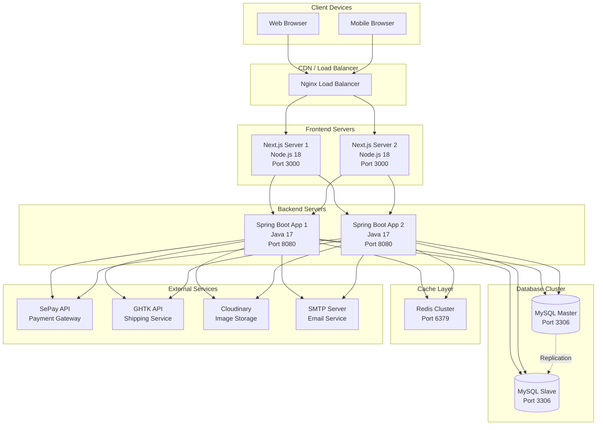
```mermaid
graph TB
    subgraph "Client Devices"
        Browser[Web Browser]
        Mobile[Mobile Browser]
    end
    
    subgraph "CDN / Load Balancer"
        LB[Nginx Load Balancer]
    end
    
    subgraph "Frontend Servers"
        FE1[Next.js Server 1<br/>Node.js 18<br/>Port 3000]
        FE2[Next.js Server 2<br/>Node.js 18<br/>Port 3000]
    end
    
    subgraph "Backend Servers"
        BE1[Spring Boot App 1<br/>Java 17<br/>Port 8080]
        BE2[Spring Boot App 2<br/>Java 17<br/>Port 8080]
    end
    
    subgraph "Database Cluster"
        DBM[(MySQL Master<br/>Port 3306)]
        DBS[(MySQL Slave<br/>Port 3306)]
    end
    
    subgraph "Cache Layer"
        Redis[Redis Cluster<br/>Port 6379]
    end
    
    subgraph "External Services"
        SePay[SePay API<br/>Payment Gateway]
        GHTK[GHTK API<br/>Shipping Service]
        Cloudinary[Cloudinary<br/>Image Storage]
        SMTP[SMTP Server<br/>Email Service]
    end
    
    Browser --> LB
    Mobile --> LB
    
    LB --> FE1
    LB --> FE2
    
    FE1 --> BE1
    FE1 --> BE2
    FE2 --> BE1
    FE2 --> BE2
    
    BE1 --> DBM
    BE2 --> DBM
    BE1 --> DBS
    BE2 --> DBS
    
    BE1 --> Redis
    BE2 --> Redis
    
    DBM -.Replication.-> DBS
    
    BE1 --> SePay
    BE2 --> SePay
    BE1 --> GHTK
    BE2 --> GHTK
    BE1 --> Cloudinary
    BE2 --> Cloudinary
    BE1 --> SMTP
    BE2 --> SMTP
```

## 7. Sơ Đồ Component (Component Diagram)

### 7.1 Backend Components

```mermaid
graph TB
    subgraph "Presentation Layer"
        AuthCtrl[AuthController]
        ProdCtrl[ProductController]
        CartCtrl[CartController]
        OrderCtrl[OrderController]
        PayCtrl[PaymentController]
        InvCtrl[InventoryController]
    end
    
    subgraph "Security Layer"
        JWTFilter[JWT Authentication Filter]
        SecConfig[Security Configuration]
    end
    
    subgraph "Business Logic Layer"
        AuthSvc[AuthService]
        UserSvc[UserService]
        ProdSvc[ProductService]
        CatSvc[CategoryService]
        CartSvc[CartService]
        OrderSvc[OrderService]
        PaySvc[PaymentService]
        InvSvc[InventoryService]
        SupSvc[SupplierService]
    end
    
    subgraph "Data Access Layer"
        UserRepo[UserRepository]
        CustRepo[CustomerRepository]
        EmpRepo[EmployeeRepository]
        ProdRepo[ProductRepository]
        CatRepo[CategoryRepository]
        CartRepo[CartRepository]
        OrderRepo[OrderRepository]
        PayRepo[PaymentRepository]
        InvRepo[InventoryRepository]
        SupRepo[SupplierRepository]
    end
    
    subgraph "External Integration"
        SePay[SePay Client]
        GHTK[GHTK Client]
        Cloud[Cloudinary Client]
        Email[Email Service]
    end
    
    JWTFilter --> AuthCtrl
    JWTFilter --> ProdCtrl
    JWTFilter --> CartCtrl
    JWTFilter --> OrderCtrl
    JWTFilter --> PayCtrl
    JWTFilter --> InvCtrl
    
    AuthCtrl --> AuthSvc
    AuthCtrl --> UserSvc
    ProdCtrl --> ProdSvc
    ProdCtrl --> CatSvc
    CartCtrl --> CartSvc
    OrderCtrl --> OrderSvc
    PayCtrl --> PaySvc
    InvCtrl --> InvSvc
    InvCtrl --> SupSvc
    
    AuthSvc --> UserRepo
    AuthSvc --> CustRepo
    AuthSvc --> EmpRepo
    UserSvc --> UserRepo
    ProdSvc --> ProdRepo
    CatSvc --> CatRepo
    CartSvc --> CartRepo
    OrderSvc --> OrderRepo
    PaySvc --> PayRepo
    InvSvc --> InvRepo
    SupSvc --> SupRepo
    
    PaySvc --> SePay
    OrderSvc --> GHTK
    ProdSvc --> Cloud
    InvSvc --> Cloud
    AuthSvc --> Email
    OrderSvc --> Email
```

### 7.2 Frontend Components

```mermaid
graph TB
    subgraph "Pages"
        Home[Home Page]
        Products[Products Page]
        ProductDetail[Product Detail Page]
        Cart[Cart Page]
        Checkout[Checkout Page]
        Orders[Orders Page]
        AdminDash[Admin Dashboard]
        PMDash[Product Manager Dashboard]
        WMDash[Warehouse Manager Dashboard]
    end
    
    subgraph "Components"
        Header[Header Component]
        Footer[Footer Component]
        ProductCard[Product Card]
        CategoryNav[Category Navigation]
        CartWidget[Cart Widget]
        OrderStatus[Order Status]
        PaymentQR[Payment QR Code]
    end
    
    subgraph "State Management"
        AuthStore[Auth Store - Zustand]
        CartStore[Cart Store - Zustand]
        ProductStore[Product Store - Zustand]
    end
    
    subgraph "Services"
        API[API Client - Axios]
        AuthService[Auth Service]
        ProductService[Product Service]
        CartService[Cart Service]
        OrderService[Order Service]
    end
    
    subgraph "Utilities"
        I18n[i18n - Translations]
        Theme[Theme Provider]
        Router[Next.js Router]
    end
    
    Home --> Header
    Home --> Footer
    Home --> ProductCard
    Products --> CategoryNav
    ProductDetail --> PaymentQR
    Cart --> CartWidget
    Orders --> OrderStatus
    
    Home --> AuthStore
    Cart --> CartStore
    Products --> ProductStore
    
    AuthStore --> AuthService
    CartStore --> CartService
    ProductStore --> ProductService
    
    AuthService --> API
    ProductService --> API
    CartService --> API
    OrderService --> API
    
    Home --> I18n
    Home --> Theme
    Home --> Router
```

## 8. Sơ Đồ Dữ Liệu Chi Tiết (Detailed ERD)

### 8.1 ERD - Auth & User Management

```mermaid
erDiagram
    USERS ||--o| CUSTOMERS : has
    USERS ||--o| EMPLOYEES : has
    USERS ||--o{ OTP_VERIFICATIONS : verifies
    EMPLOYEES ||--o{ EMPLOYEE_REGISTRATIONS : "approved from"
    
    USERS {
        bigint id PK
        varchar email UK
        varchar password
        enum role
        enum status
        timestamp created_at
    }
    
    CUSTOMERS {
        bigint id PK
        bigint user_id FK,UK
        varchar full_name
        varchar phone UK
        varchar gender
        date birth_date
        text address
    }
    
    EMPLOYEES {
        bigint id PK
        bigint user_id FK,UK
        enum position
        varchar full_name
        varchar phone
        text address
        boolean first_login
    }
    
    OTP_VERIFICATIONS {
        bigint id PK
        bigint user_id FK
        varchar email
        varchar otp_code
        timestamp created_at
        timestamp expires_at
        boolean verified
    }
    
    EMPLOYEE_REGISTRATIONS {
        bigint id PK
        varchar email UK
        varchar full_name
        varchar phone
        enum position
        enum status
        timestamp created_at
        bigint approved_by FK
        timestamp approved_at
        bigint employee_id FK
    }
```

### 8.2 ERD - Product & Inventory

```mermaid
erDiagram
    CATEGORIES ||--o{ CATEGORIES : "parent-child"
    CATEGORIES ||--o{ PRODUCTS : contains
    PRODUCTS ||--|| WAREHOUSE_PRODUCTS : "published from"
    WAREHOUSE_PRODUCTS ||--o{ PRODUCT_DETAILS : "has serials"
    WAREHOUSE_PRODUCTS ||--|| INVENTORY_STOCK : "has stock"
    WAREHOUSE_PRODUCTS ||--o{ PRODUCT_SPECIFICATIONS : "has specs"
    WAREHOUSE_PRODUCTS ||--o{ WAREHOUSE_PRODUCT_IMAGES : "has images"
    WAREHOUSE_PRODUCTS }o--|| SUPPLIERS : "supplied by"
    
    CATEGORIES {
        bigint id PK
        varchar name
        varchar slug UK
        text description
        varchar image_url
        int display_order
        boolean active
        bigint parent_id FK
    }
    
    PRODUCTS {
        bigint id PK
        bigint category_id FK
        varchar name
        double price
        varchar sku UK
        text description
        varchar image_url
        bigint stock_quantity
        text tech_specs_json
        bigint warehouse_product_id FK,UK
    }
    
    WAREHOUSE_PRODUCTS {
        bigint id PK
        varchar sku UK
        varchar internal_name
        text tech_specs_json
        text description
        bigint supplier_id FK
        timestamp last_import_date
    }
    
    PRODUCT_DETAILS {
        bigint id PK
        bigint warehouse_product_id FK
        varchar serial_number UK
        enum status
        timestamp import_date
        double import_price
        bigint purchase_order_id FK
        bigint export_order_id FK
        text notes
    }
    
    INVENTORY_STOCK {
        bigint id PK
        bigint warehouse_product_id FK,UK
        bigint on_hand
        bigint reserved
        bigint damaged
        date last_audit_date
    }
    
    PRODUCT_SPECIFICATIONS {
        bigint id PK
        bigint warehouse_product_id FK
        varchar spec_key
        varchar spec_value
    }
    
    WAREHOUSE_PRODUCT_IMAGES {
        bigint id PK
        bigint warehouse_product_id FK
        varchar image_url
        int display_order
    }
    
    SUPPLIERS {
        bigint id PK
        varchar name
        varchar contact_name
        varchar phone
        varchar email
        text address
        varchar tax_code UK
        varchar bank_account
        text payment_term
        boolean active
    }
```

### 8.3 ERD - Order & Payment

```mermaid
erDiagram
    USERS ||--o{ ORDERS : places
    USERS ||--|| CARTS : has
    USERS ||--o{ PAYMENTS : makes
    ORDERS ||--o{ ORDER_ITEMS : contains
    ORDERS ||--o| PAYMENTS : "paid by"
    CARTS ||--o{ CART_ITEMS : contains
    PRODUCTS ||--o{ ORDER_ITEMS : "ordered in"
    PRODUCTS ||--o{ CART_ITEMS : "added to"
    
    ORDERS {
        bigint id PK
        varchar order_code UK
        bigint user_id FK
        varchar customer_name
        varchar customer_phone
        varchar customer_email
        text shipping_address
        text note
        double subtotal
        double shipping_fee
        double discount
        double total
        enum payment_status
        bigint payment_id FK
        timestamp paid_at
        enum status
        timestamp created_at
        timestamp confirmed_at
        timestamp shipped_at
        timestamp delivered_at
        timestamp cancelled_at
        text cancel_reason
    }
    
    ORDER_ITEMS {
        bigint id PK
        bigint order_id FK
        bigint product_id FK
        varchar product_name
        varchar product_sku
        int quantity
        double price
        double subtotal
    }
    
    PAYMENTS {
        bigint id PK
        varchar payment_code UK
        bigint order_id FK,UK
        bigint user_id FK
        double amount
        enum method
        enum status
        varchar sepay_transaction_id
        varchar sepay_bank_code
        varchar sepay_account_number
        varchar sepay_account_name
        varchar sepay_content
        varchar sepay_qr_code
        text sepay_response
        timestamp created_at
        timestamp paid_at
        timestamp expired_at
        text failure_reason
    }
    
    CARTS {
        bigint id PK
        bigint user_id FK,UK
        timestamp created_at
        timestamp updated_at
    }
    
    CART_ITEMS {
        bigint id PK
        bigint cart_id FK
        bigint product_id FK
        int quantity
        double price
        timestamp added_at
    }
```

### 8.4 ERD - Purchase & Export Orders

```mermaid
erDiagram
    SUPPLIERS ||--o{ PURCHASE_ORDERS : supplies
    PURCHASE_ORDERS ||--o{ PURCHASE_ORDER_ITEMS : contains
    PURCHASE_ORDER_ITEMS }o--|| WAREHOUSE_PRODUCTS : orders
    PRODUCT_DETAILS }o--|| PURCHASE_ORDERS : "imported via"
    EXPORT_ORDERS ||--o{ EXPORT_ORDER_ITEMS : contains
    EXPORT_ORDER_ITEMS }o--|| PRODUCT_DETAILS : exports
    
    PURCHASE_ORDERS {
        bigint id PK
        varchar po_code UK
        varchar supplier_tax_code FK
        timestamp order_date
        timestamp received_date
        enum status
        varchar created_by
        text note
    }
    
    PURCHASE_ORDER_ITEMS {
        bigint id PK
        bigint purchase_order_id FK
        bigint warehouse_product_id FK
        int quantity
        double unit_price
    }
    
    EXPORT_ORDERS {
        bigint id PK
        varchar export_code UK
        timestamp export_date
        varchar created_by
        varchar reason
        text note
        enum status
    }
    
    EXPORT_ORDER_ITEMS {
        bigint id PK
        bigint export_order_id FK
        bigint product_detail_id FK
    }
```

## 9. Sơ Đồ Quy Trình Nghiệp Vụ (Business Process Diagram)

### 9.1 Quy Trình Quản Lý Đơn Hàng Hoàn Chỉnh

```mermaid
flowchart TB
    Start([Khách hàng đặt hàng]) --> CreateOrder[Tạo Order PENDING]
    CreateOrder --> CreatePayment[Tạo Payment PENDING]
    CreatePayment --> ShowQR[Hiển thị QR Code]
    
    ShowQR --> WaitPayment{Chờ thanh toán<br/>15 phút}
    
    WaitPayment -->|Timeout| Expire[Payment EXPIRED]
    Expire --> NotifyExpire[Thông báo hết hạn]
    NotifyExpire --> End1([Kết thúc])
    
    WaitPayment -->|Webhook| VerifyPayment{Xác thực<br/>thanh toán}
    VerifyPayment -->|Invalid| Reject[Từ chối]
    Reject --> End2([Kết thúc])
    
    VerifyPayment -->|Valid| UpdatePayment[Payment PAID]
    UpdatePayment --> ConfirmOrder[Order CONFIRMED]
    ConfirmOrder --> ReserveStock[Reserve Stock]
    ReserveStock --> SendConfirmEmail[Gửi email xác nhận]
    
    SendConfirmEmail --> AdminReview{Admin<br/>xem xét}
    AdminReview -->|Hủy| CancelOrder[Order CANCELLED]
    CancelOrder --> ReleaseStock[Release Stock]
    ReleaseStock --> RefundPayment[Hoàn tiền]
    RefundPayment --> End3([Kết thúc])
    
    AdminReview -->|Xác nhận| ProcessOrder[Order PROCESSING]
    ProcessOrder --> CreateExport[Tạo Export Order]
    CreateExport --> PickItems[Lấy hàng từ kho]
    PickItems --> UpdateSerials[Cập nhật Product Details]
    UpdateSerials --> UpdateStock[Cập nhật Inventory Stock]
    UpdateStock --> PackOrder[Đóng gói]
    
    PackOrder --> ShipOrder[Order SHIPPING]
    ShipOrder --> CallGHTK[Gọi GHTK API]
    CallGHTK --> GetTracking[Lấy tracking number]
    GetTracking --> NotifyShipping[Thông báo đang giao]
    
    NotifyShipping --> WaitDelivery{Chờ giao hàng}
    WaitDelivery -->|Thất bại| ShipFailed[Giao hàng thất bại]
    ShipFailed --> ReturnStock[Trả hàng về kho]
    ReturnStock --> CancelOrder
    
    WaitDelivery -->|Thành công| DeliverOrder[Order DELIVERED]
    DeliverOrder --> SendThankEmail[Gửi email cảm ơn]
    SendThankEmail --> End4([Hoàn thành])
```

### 9.2 Quy Trình Quản Lý Kho Hàng

```mermaid
flowchart TB
    Start([Bắt đầu]) --> NeedStock{Cần nhập<br/>hàng?}
    
    NeedStock -->|Yes| CheckSupplier{Supplier<br/>tồn tại?}
    CheckSupplier -->|No| CreateSupplier[Tạo Supplier]
    CreateSupplier --> CreatePO
    CheckSupplier -->|Yes| CreatePO[Tạo Purchase Order]
    
    CreatePO --> AddItems[Thêm items vào PO]
    AddItems --> CheckWP{Warehouse<br/>Product<br/>tồn tại?}
    CheckWP -->|No| CreateWP[Tạo Warehouse Product]
    CreateWP --> SavePO
    CheckWP -->|Yes| SavePO[Lưu PO CREATED]
    
    SavePO --> WaitGoods[Chờ hàng về]
    WaitGoods --> ReceiveGoods[Nhận hàng]
    ReceiveGoods --> InspectGoods{Kiểm tra<br/>chất lượng}
    
    InspectGoods -->|Lỗi| RejectGoods[Từ chối hàng]
    RejectGoods --> CancelPO[Cancel PO]
    CancelPO --> End1([Kết thúc])
    
    InspectGoods -->|OK| InputSerials[Nhập serial numbers]
    InputSerials --> CreateDetails[Tạo Product Details]
    CreateDetails --> UpdateStock[Cập nhật Inventory Stock]
    UpdateStock --> CompletePO[Complete PO]
    CompletePO --> NotifyPM[Thông báo Product Manager]
    
    NotifyPM --> PMReview{PM xem xét<br/>publish?}
    PMReview -->|No| StoreOnly[Chỉ lưu kho]
    StoreOnly --> End2([Kết thúc])
    
    PMReview -->|Yes| SelectCategory[Chọn Category]
    SelectCategory --> SetPrice[Đặt giá bán]
    SetPrice --> UploadImages[Upload ảnh]
    UploadImages --> PublishProduct[Publish Product]
    PublishProduct --> SyncStock[Sync stock quantity]
    SyncStock --> End3([Sản phẩm lên web])
```

## 10. Sơ Đồ Bảo Mật (Security Architecture)

```mermaid
graph TB
    subgraph "Client Layer"
        Browser[Browser/Mobile]
    end
    
    subgraph "Security Gateway"
        HTTPS[HTTPS/TLS 1.3]
        CORS[CORS Policy]
        RateLimit[Rate Limiting]
    end
    
    subgraph "Authentication Layer"
        JWTFilter[JWT Filter]
        TokenValidator[Token Validator]
        RefreshToken[Refresh Token Handler]
    end
    
    subgraph "Authorization Layer"
        RoleCheck[Role-Based Access Control]
        PermCheck[Permission Checker]
        ResourceOwner[Resource Ownership Check]
    end
    
    subgraph "Application Layer"
        Controllers[Controllers]
        Services[Services]
    end
    
    subgraph "Data Security"
        Encryption[Password Encryption BCrypt]
        SQLInjection[SQL Injection Prevention JPA]
        XSS[XSS Protection]
        CSRF[CSRF Protection]
    end
    
    subgraph "Audit & Logging"
        AuditLog[Audit Logging]
        SecurityLog[Security Event Log]
        ErrorLog[Error Logging]
    end
    
    Browser --> HTTPS
    HTTPS --> CORS
    CORS --> RateLimit
    RateLimit --> JWTFilter
    
    JWTFilter --> TokenValidator
    TokenValidator --> RefreshToken
    RefreshToken --> RoleCheck
    
    RoleCheck --> PermCheck
    PermCheck --> ResourceOwner
    ResourceOwner --> Controllers
    
    Controllers --> Services
    Services --> Encryption
    Services --> SQLInjection
    Services --> XSS
    Services --> CSRF
    
    JWTFilter --> AuditLog
    Controllers --> SecurityLog
    Services --> ErrorLog
```

## 11. Sơ Đồ Tích Hợp (Integration Diagram)

```mermaid
graph TB
    subgraph "WEB_TMDT System"
        Backend[Spring Boot Backend]
        Frontend[Next.js Frontend]
    end
    
    subgraph "Payment Integration"
        SePay[SePay API]
        SePayWebhook[SePay Webhook Handler]
    end
    
    subgraph "Shipping Integration"
        GHTK[GHTK API]
        GHTKCalc[Fee Calculator]
        GHTKTrack[Tracking Service]
    end
    
    subgraph "Storage Integration"
        Cloudinary[Cloudinary API]
        CloudUpload[Upload Handler]
        CloudTransform[Image Transformation]
    end
    
    subgraph "Email Integration"
        SMTP[SMTP Server]
        EmailTemplate[Email Templates]
        EmailQueue[Email Queue]
    end
    
    Frontend -->|REST API| Backend
    
    Backend -->|Create Payment| SePay
    SePay -->|QR Code| Backend
    SePay -->|Webhook| SePayWebhook
    SePayWebhook -->|Update Status| Backend
    
    Backend -->|Calculate Fee| GHTKCalc
    Backend -->|Create Order| GHTK
    Backend -->|Track Order| GHTKTrack
    
    Backend -->|Upload Image| CloudUpload
    CloudUpload -->|Store| Cloudinary
    Backend -->|Get Image| CloudTransform
    
    Backend -->|Send Email| EmailQueue
    EmailQueue -->|Process| EmailTemplate
    EmailTemplate -->|Send| SMTP
```

## 12. Tổng Kết Các Sơ Đồ

### Danh Sách Sơ Đồ Đã Tạo:

1. **Use Case Diagram** - 4 actors (Customer, Product Manager, Warehouse Manager, Admin)
2. **Activity Diagram** - 4 luồng chính (Đăng ký, Đặt hàng, Nhập kho, Publish sản phẩm)
3. **State Diagram** - 3 state machines (Order, Payment, Product Detail)
4. **Sequence Diagram** - 4 tương tác (Login, Add to Cart, Webhook, Complete PO)
5. **Class Diagram** - 3 modules (Auth, Product/Inventory, Order/Payment)
6. **Deployment Diagram** - Kiến trúc triển khai đầy đủ
7. **Component Diagram** - Backend & Frontend components
8. **ERD Detailed** - 4 nhóm bảng chi tiết
9. **Business Process Diagram** - 2 quy trình nghiệp vụ
10. **Security Architecture** - Kiến trúc bảo mật
11. **Integration Diagram** - Tích hợp với external services

### Cách Sử Dụng:

- Tất cả sơ đồ sử dụng **Mermaid syntax**
- Có thể render trực tiếp trên GitHub, GitLab, hoặc các Markdown viewer hỗ trợ Mermaid
- Có thể export sang PNG/SVG bằng các công cụ như Mermaid Live Editor
- Phù hợp cho tài liệu kỹ thuật, báo cáo đồ án, và documentation
