# SƠ ĐỒ LỚP THỰC THỂ QUAN HỆ (ERD) - HỆ THỐNG TMĐT

## 📊 Tổng quan hệ thống

Hệ thống quản lý thương mại điện tử bao gồm 8 module chính:
1. **Authentication & Authorization** - Quản lý người dùng
2. **Product Management** - Quản lý sản phẩm
3. **Cart & Order** - Giỏ hàng và đơn hàng
4. **Inventory Management** - Quản lý kho hàng
5. **Payment** - Thanh toán
6. **Accounting** - Kế toán
7. **Shipping** - Vận chuyển (GHN)
8. **Webhook** - Tích hợp bên ngoài

---

## 🔐 MODULE 1: AUTHENTICATION & AUTHORIZATION

### Entity: User
**Bảng:** `users`
**Mô tả:** Tài khoản đăng nhập chung cho cả Customer và Employee

| Thuộc tính | Kiểu | Ràng buộc | Mô tả |
|------------|------|-----------|-------|
| id | Long | PK, Auto | ID người dùng |
| email | String | UNIQUE, NOT NULL | Email đăng nhập |
| password | String | NOT NULL | Mật khẩu (đã mã hóa) |
| role | Enum | NOT NULL | CUSTOMER, ADMIN, WAREHOUSE_MANAGER, SALES, ACCOUNTANT, SHIPPER |
| status | Enum | NOT NULL | ACTIVE, INACTIVE, BANNED |

**Quan hệ:**
- `1-1` với Customer (mappedBy = "user")
- `1-1` với Employee (mappedBy = "user")

---

### Entity: Customer
**Bảng:** `customers`
**Mô tả:** Thông tin khách hàng

| Thuộc tính | Kiểu | Ràng buộc | Mô tả |
|------------|------|-----------|-------|
| id | Long | PK, Auto | ID khách hàng |
| user_id | Long | FK, NOT NULL | Liên kết User |
| fullName | String | NOT NULL | Họ tên |
| phone | String | UNIQUE, NOT NULL | Số điện thoại |
| gender | String | | Giới tính |
| birthDate | LocalDate | | Ngày sinh |
| address | String | | Địa chỉ |

**Quan hệ:**
- `1-1` với User (owner)
- `1-N` với Order
- `1-1` với Cart

---

### Entity: Employee
**Bảng:** `employees`
**Mô tả:** Thông tin nhân viên

| Thuộc tính | Kiểu | Ràng buộc | Mô tả |
|------------|------|-----------|-------|
| id | Long | PK, Auto | ID nhân viên |
| user_id | Long | FK | Liên kết User |
| position | Enum | | ADMIN, WAREHOUSE_MANAGER, SALES, ACCOUNTANT, SHIPPER |
| fullName | String | | Họ tên |
| phone | String | | Số điện thoại |
| address | String | | Địa chỉ |
| firstLogin | Boolean | NOT NULL | Lần đầu đăng nhập |

**Quan hệ:**
- `1-1` với User (owner)

---

## 📦 MODULE 2: PRODUCT MANAGEMENT

### Entity: Category
**Bảng:** `categories`
**Mô tả:** Danh mục sản phẩm (có phân cấp)

| Thuộc tính | Kiểu | Ràng buộc | Mô tả |
|------------|------|-----------|-------|
| id | Long | PK, Auto | ID danh mục |
| name | String | NOT NULL | Tên danh mục |
| slug | String | UNIQUE | URL-friendly name |
| description | String | | Mô tả |
| imageUrl | String | | Ảnh đại diện |
| displayOrder | Integer | | Thứ tự hiển thị |
| active | Boolean | | Hiển thị/ẩn |
| parent_id | Long | FK | Danh mục cha |

**Quan hệ:**
- `N-1` với Category (self-reference, parent)
- `1-N` với Category (children)
- `1-N` với Product

---

### Entity: Product
**Bảng:** `products`
**Mô tả:** Sản phẩm hiển thị trên website (đã publish)

| Thuộc tính | Kiểu | Ràng buộc | Mô tả |
|------------|------|-----------|-------|
| id | Long | PK, Auto | ID sản phẩm |
| category_id | Long | FK | Danh mục |
| name | String | NOT NULL | Tên sản phẩm |
| price | Double | | Giá bán |
| sku | String | UNIQUE | Mã SKU |
| description | TEXT | | Mô tả chi tiết |
| stockQuantity | Long | | Tồn kho thực tế |
| reservedQuantity | Long | | Số lượng đang giữ |
| techSpecsJson | TEXT | | Thông số kỹ thuật (JSON) |
| product_detail_id | Long | FK | Liên kết ProductDetail |
| warehouse_product_id | Long | FK | Liên kết WarehouseProduct |
| active | Boolean | | Đang bán/ngừng bán |

**Quan hệ:**
- `N-1` với Category
- `1-N` với ProductImage
- `1-1` với ProductDetail
- `1-1` với WarehouseProduct
- `1-N` với CartItem
- `1-N` với OrderItem

---

### Entity: ProductImage
**Bảng:** `product_images`
**Mô tả:** Hình ảnh sản phẩm (nhiều ảnh cho 1 sản phẩm)

| Thuộc tính | Kiểu | Ràng buộc | Mô tả |
|------------|------|-----------|-------|
| id | Long | PK, Auto | ID ảnh |
| product_id | Long | FK, NOT NULL | Sản phẩm |
| imageUrl | String(500) | NOT NULL | URL ảnh |
| displayOrder | Integer | NOT NULL | Thứ tự hiển thị |
| isPrimary | Boolean | NOT NULL | Ảnh chính (thumbnail) |
| altText | String(255) | | Text mô tả (SEO) |
| createdAt | LocalDateTime | | Ngày tạo |

**Quan hệ:**
- `N-1` với Product

---

## 🛒 MODULE 3: CART & ORDER

### Entity: Cart
**Bảng:** `carts`
**Mô tả:** Giỏ hàng của khách hàng

| Thuộc tính | Kiểu | Ràng buộc | Mô tả |
|------------|------|-----------|-------|
| id | Long | PK, Auto | ID giỏ hàng |
| customer_id | Long | FK, UNIQUE, NOT NULL | Khách hàng |
| createdAt | LocalDateTime | NOT NULL | Ngày tạo |
| updatedAt | LocalDateTime | | Ngày cập nhật |

**Quan hệ:**
- `1-1` với Customer
- `1-N` với CartItem

---

### Entity: CartItem
**Bảng:** `cart_items`
**Mô tả:** Sản phẩm trong giỏ hàng

| Thuộc tính | Kiểu | Ràng buộc | Mô tả |
|------------|------|-----------|-------|
| id | Long | PK, Auto | ID item |
| cart_id | Long | FK, NOT NULL | Giỏ hàng |
| product_id | Long | FK, NOT NULL | Sản phẩm |
| quantity | Integer | NOT NULL | Số lượng |
| price | Double | NOT NULL | Giá tại thời điểm thêm |
| addedAt | LocalDateTime | NOT NULL | Ngày thêm |

**Quan hệ:**
- `N-1` với Cart
- `N-1` với Product

---

### Entity: Order
**Bảng:** `orders`
**Mô tả:** Đơn hàng

| Thuộc tính | Kiểu | Ràng buộc | Mô tả |
|------------|------|-----------|-------|
| id | Long | PK, Auto | ID đơn hàng |
| orderCode | String | UNIQUE, NOT NULL | Mã đơn: ORD20231119001 |
| customer_id | Long | FK, NOT NULL | Khách hàng |
| shippingAddress | TEXT | NOT NULL | Địa chỉ giao hàng |
| province | String | | Tỉnh/Thành phố |
| district | String | | Quận/Huyện |
| ward | String | | Mã phường/xã (GHN) |
| wardName | String | | Tên phường/xã |
| address | String | | Địa chỉ cụ thể |
| note | String | | Ghi chú |
| subtotal | Double | NOT NULL | Tổng tiền hàng |
| shippingFee | Double | NOT NULL | Phí vận chuyển |
| discount | Double | NOT NULL | Giảm giá |
| total | Double | NOT NULL | Tổng thanh toán |
| paymentStatus | Enum | NOT NULL | UNPAID, PAID, REFUNDED |
| paymentMethod | String(20) | | COD, SEPAY, VNPAY |
| paymentId | Long | | Reference Payment |
| status | Enum | NOT NULL | PENDING_PAYMENT, CONFIRMED, READY_TO_SHIP, SHIPPING, DELIVERED, CANCELLED |
| createdAt | LocalDateTime | NOT NULL | Ngày tạo |
| confirmedAt | LocalDateTime | | Ngày xác nhận |
| shippedAt | LocalDateTime | | Ngày giao hàng |
| deliveredAt | LocalDateTime | | Ngày đã giao |
| cancelledAt | LocalDateTime | | Ngày hủy |
| cancelReason | String | | Lý do hủy |
| ghnOrderCode | String | | Mã vận đơn GHN |
| ghnShippingStatus | String | | Trạng thái GHN |
| ghnCreatedAt | LocalDateTime | | Ngày tạo đơn GHN |
| ghnExpectedDeliveryTime | LocalDateTime | | Thời gian giao dự kiến |

**Quan hệ:**
- `N-1` với Customer
- `1-N` với OrderItem
- `1-1` với Payment

---

### Entity: OrderItem
**Bảng:** `order_items`
**Mô tả:** Chi tiết sản phẩm trong đơn hàng

| Thuộc tính | Kiểu | Ràng buộc | Mô tả |
|------------|------|-----------|-------|
| id | Long | PK, Auto | ID item |
| order_id | Long | FK, NOT NULL | Đơn hàng |
| product_id | Long | FK, NOT NULL | Sản phẩm |
| productName | String | NOT NULL | Tên sản phẩm (snapshot) |
| price | Double | NOT NULL | Giá tại thời điểm mua |
| quantity | Integer | NOT NULL | Số lượng |
| subtotal | Double | NOT NULL | Thành tiền |
| serialNumber | String | | Serial (nếu có) |
| reserved | Boolean | NOT NULL | Đã giữ hàng |
| exported | Boolean | NOT NULL | Đã xuất kho |

**Quan hệ:**
- `N-1` với Order
- `N-1` với Product

---

## 🏭 MODULE 4: INVENTORY MANAGEMENT

### Entity: Supplier
**Bảng:** `suppliers`
**Mô tả:** Nhà cung cấp

| Thuộc tính | Kiểu | Ràng buộc | Mô tả |
|------------|------|-----------|-------|
| id | Long | PK, Auto | ID nhà cung cấp |
| autoCreated | Boolean | NOT NULL | Tự động tạo |
| name | String(255) | NOT NULL | Tên nhà cung cấp |
| contactName | String | | Người liên hệ |
| phone | String | | Số điện thoại |
| email | String | | Email |
| address | String | | Địa chỉ |
| taxCode | String | UNIQUE, NOT NULL | Mã số thuế |
| bankAccount | String | | Tài khoản ngân hàng |
| paymentTerm | String | | Điều khoản thanh toán |
| paymentTermDays | Integer | | Số ngày nợ (30, 60, 90) |
| active | Boolean | NOT NULL | Đang hoạt động |

**Quan hệ:**
- `1-N` với PurchaseOrder
- `1-N` với WarehouseProduct
- `1-N` với SupplierPayable

---

### Entity: WarehouseProduct
**Bảng:** `warehouse_products`
**Mô tả:** Sản phẩm trong kho (chưa publish)

| Thuộc tính | Kiểu | Ràng buộc | Mô tả |
|------------|------|-----------|-------|
| id | Long | PK, Auto | ID sản phẩm kho |
| sku | String(64) | UNIQUE, NOT NULL | Mã SKU |
| internalName | String | NOT NULL | Tên kỹ thuật |
| techSpecsJson | TEXT | | Thông số kỹ thuật (JSON) |
| description | TEXT | | Mô tả |
| supplier_id | Long | FK | Nhà cung cấp |
| lastImportDate | LocalDateTime | | Ngày nhập gần nhất |

**Quan hệ:**
- `N-1` với Supplier
- `1-1` với Product (mappedBy)
- `1-N` với ProductDetail (serials)
- `1-N` với WarehouseProductImage
- `1-N` với ProductSpecification
- `1-N` với InventoryStock

---

### Entity: ProductDetail
**Bảng:** `product_details`
**Mô tả:** Chi tiết sản phẩm theo serial/IMEI

| Thuộc tính | Kiểu | Ràng buộc | Mô tả |
|------------|------|-----------|-------|
| id | Long | PK, Auto | ID chi tiết |
| serialNumber | String(64) | UNIQUE, NOT NULL | Serial/IMEI |
| importPrice | Double | NOT NULL | Giá nhập |
| salePrice | Double | | Giá bán thực tế |
| importDate | LocalDateTime | | Ngày nhập kho |
| status | Enum | NOT NULL | IN_STOCK, RESERVED, SOLD, DAMAGED, RETURNED |
| warehouse_product_id | Long | FK, NOT NULL | Sản phẩm kho |
| purchase_order_item_id | Long | FK | Phiếu nhập |
| warrantyMonths | Integer | | Thời hạn bảo hành (tháng) |
| soldOrderId | Long | | Đơn hàng đã bán |
| soldDate | LocalDateTime | | Ngày bán |
| note | String | | Ghi chú |

**Quan hệ:**
- `N-1` với WarehouseProduct
- `N-1` với PurchaseOrderItem
- `1-1` với Product (mappedBy)

---

### Entity: PurchaseOrder
**Bảng:** `purchase_orders`
**Mô tả:** Đơn đặt hàng nhà cung cấp

| Thuộc tính | Kiểu | Ràng buộc | Mô tả |
|------------|------|-----------|-------|
| id | Long | PK, Auto | ID đơn đặt hàng |
| poCode | String(50) | UNIQUE, NOT NULL | Mã PO |
| supplier_tax_code | String | FK, NOT NULL | Mã số thuế NCC |
| orderDate | LocalDateTime | | Ngày đặt hàng |
| receivedDate | LocalDateTime | | Ngày nhập thực tế |
| status | Enum | | CREATED, RECEIVED, CANCELED |
| createdBy | String | | Người tạo |
| note | String | | Ghi chú |

**Quan hệ:**
- `N-1` với Supplier (via taxCode)
- `1-N` với PurchaseOrderItem
- `1-N` với SupplierPayable

---

### Entity: PurchaseOrderItem
**Bảng:** `purchase_order_items`
**Mô tả:** Chi tiết sản phẩm trong đơn đặt hàng

| Thuộc tính | Kiểu | Ràng buộc | Mô tả |
|------------|------|-----------|-------|
| id | Long | PK, Auto | ID item |
| purchase_order_id | Long | FK, NOT NULL | Đơn đặt hàng |
| sku | String(64) | NOT NULL | Mã SKU |
| warehouse_product_id | Long | FK | Sản phẩm kho |
| quantity | Long | | Số lượng đặt |
| unitCost | Double | | Giá nhập |
| warrantyMonths | Integer | | Bảo hành (tháng) |
| note | String | | Ghi chú |

**Quan hệ:**
- `N-1` với PurchaseOrder
- `N-1` với WarehouseProduct
- `1-N` với ProductDetail

---

### Entity: ExportOrder
**Bảng:** `export_orders`
**Mô tả:** Phiếu xuất kho

| Thuộc tính | Kiểu | Ràng buộc | Mô tả |
|------------|------|-----------|-------|
| id | Long | PK, Auto | ID phiếu xuất |
| exportCode | String(50) | UNIQUE, NOT NULL | Mã phiếu: PX20251101-001 |
| exportDate | LocalDateTime | | Ngày xuất kho |
| createdBy | String | | Người xuất |
| reason | String | | Lý do: bán hàng/hủy/đổi trả/bảo hành |
| note | String | | Ghi chú |
| status | Enum | | PENDING, COMPLETED, CANCELLED |
| orderId | Long | | Reference Order |

**Quan hệ:**
- `1-N` với ExportOrderItem

---

### Entity: ExportOrderItem
**Bảng:** `export_order_items`
**Mô tả:** Chi tiết sản phẩm xuất kho

| Thuộc tính | Kiểu | Ràng buộc | Mô tả |
|------------|------|-----------|-------|
| id | Long | PK, Auto | ID item |
| export_order_id | Long | FK | Phiếu xuất |
| serialNumber | String | | Serial xuất |
| quantity | Integer | | Số lượng |
| note | String | | Ghi chú |

**Quan hệ:**
- `N-1` với ExportOrder

---

### Entity: InventoryStock
**Bảng:** `inventory_stock`
**Mô tả:** Tồn kho theo sản phẩm

| Thuộc tính | Kiểu | Ràng buộc | Mô tả |
|------------|------|-----------|-------|
| id | Long | PK, Auto | ID tồn kho |
| warehouse_product_id | Long | FK, UNIQUE, NOT NULL | Sản phẩm kho |
| onHand | Long | NOT NULL | Tồn thực tế |
| reserved | Long | NOT NULL | Đã giữ chỗ |
| damaged | Long | NOT NULL | Sản phẩm lỗi |
| lastAuditDate | LocalDate | | Ngày kiểm kê |

**Quan hệ:**
- `N-1` với WarehouseProduct

---

### Entity: ProductSpecification
**Bảng:** `product_specifications`
**Mô tả:** Thông số kỹ thuật (dạng bảng để search)

| Thuộc tính | Kiểu | Ràng buộc | Mô tả |
|------------|------|-----------|-------|
| id | Long | PK, Auto | ID thông số |
| warehouse_product_id | Long | FK | Sản phẩm kho |
| specKey | String | | Tên thông số (CPU, RAM, ...) |
| specValue | String | | Giá trị |

**Quan hệ:**
- `N-1` với WarehouseProduct

---

### Entity: WarehouseProductImage
**Bảng:** `warehouse_product_images`
**Mô tả:** Hình ảnh sản phẩm kho

| Thuộc tính | Kiểu | Ràng buộc | Mô tả |
|------------|------|-----------|-------|
| id | Long | PK, Auto | ID ảnh |
| warehouse_product_id | Long | FK | Sản phẩm kho |
| imageUrl | String | | URL ảnh |
| displayOrder | Integer | | Thứ tự hiển thị |

**Quan hệ:**
- `N-1` với WarehouseProduct

---

## 💳 MODULE 5: PAYMENT

### Entity: Payment
**Bảng:** `payments`
**Mô tả:** Thanh toán đơn hàng

| Thuộc tính | Kiểu | Ràng buộc | Mô tả |
|------------|------|-----------|-------|
| id | Long | PK, Auto | ID thanh toán |
| paymentCode | String | UNIQUE, NOT NULL | Mã: PAY20231119001 |
| order_id | Long | FK, NOT NULL | Đơn hàng |
| user_id | Long | FK, NOT NULL | Người dùng |
| amount | Double | NOT NULL | Số tiền |
| method | Enum | NOT NULL | SEPAY, VNPAY, COD |
| status | Enum | NOT NULL | PENDING, SUCCESS, FAILED, EXPIRED |
| sepayTransactionId | String | | Mã giao dịch SePay |
| sepayBankCode | String | | Mã ngân hàng |
| sepayAccountNumber | String | | Số tài khoản |
| sepayAccountName | String | | Tên tài khoản |
| sepayContent | String | | Nội dung chuyển khoản |
| sepayQrCode | String | | URL QR Code |
| sepayResponse | TEXT | | Response SePay (JSON) |
| createdAt | LocalDateTime | NOT NULL | Ngày tạo |
| paidAt | LocalDateTime | | Ngày thanh toán |
| expiredAt | LocalDateTime | | Ngày hết hạn (15 phút) |
| failureReason | String | | Lý do thất bại |

**Quan hệ:**
- `1-1` với Order
- `N-1` với User

---

### Entity: BankAccount
**Bảng:** `bank_accounts`
**Mô tả:** Tài khoản ngân hàng nhận tiền

| Thuộc tính | Kiểu | Ràng buộc | Mô tả |
|------------|------|-----------|-------|
| id | Long | PK, Auto | ID tài khoản |
| bankCode | String | NOT NULL | MBBank, VCB, TCB, ACB |
| bankName | String | NOT NULL | Tên ngân hàng |
| accountNumber | String | NOT NULL | Số tài khoản |
| accountName | String | NOT NULL | Tên tài khoản |
| description | String(500) | | Ghi chú |
| sepayApiToken | String(255) | | API token SePay |
| sepayMerchantId | String(100) | | Merchant ID SePay |
| isActive | Boolean | NOT NULL | Đang dùng |
| isDefault | Boolean | NOT NULL | Tài khoản mặc định |
| createdAt | LocalDateTime | NOT NULL | Ngày tạo |
| updatedAt | LocalDateTime | | Ngày cập nhật |

---

## 📊 MODULE 6: ACCOUNTING

### Entity: FinancialTransaction
**Bảng:** `financial_transactions`
**Mô tả:** Giao dịch tài chính

| Thuộc tính | Kiểu | Ràng buộc | Mô tả |
|------------|------|-----------|-------|
| id | Long | PK, Auto | ID giao dịch |
| transactionCode | String | UNIQUE, NOT NULL | Mã giao dịch |
| type | Enum | NOT NULL | REVENUE, EXPENSE, REFUND |
| category | Enum | NOT NULL | SALES, SHIPPING, PAYMENT_FEE, TAX, SUPPLIER_PAYMENT |
| amount | Double | NOT NULL | Số tiền |
| orderId | Long | | Reference Order |
| supplierId | Long | | Reference Supplier |
| description | String(1000) | | Mô tả |
| transactionDate | LocalDateTime | NOT NULL | Ngày giao dịch |
| createdAt | LocalDateTime | | Ngày tạo |
| createdBy | String | | Người tạo |

**Quan hệ:**
- Reference với Order (không dùng FK)
- Reference với Supplier (không dùng FK)

---

### Entity: AccountingPeriod
**Bảng:** `accounting_periods`
**Mô tả:** Kỳ kế toán

| Thuộc tính | Kiểu | Ràng buộc | Mô tả |
|------------|------|-----------|-------|
| id | Long | PK, Auto | ID kỳ |
| name | String | NOT NULL | Tháng 12/2024 |
| startDate | LocalDate | NOT NULL | Ngày bắt đầu |
| endDate | LocalDate | NOT NULL | Ngày kết thúc |
| status | Enum | NOT NULL | OPEN, CLOSED |
| totalRevenue | Double | | Tổng doanh thu |
| totalExpense | Double | | Tổng chi phí |
| netProfit | Double | | Lợi nhuận ròng |
| discrepancyRate | Double | | Tỷ lệ sai lệch (%) |
| closedAt | LocalDateTime | | Ngày đóng sổ |
| closedBy | String | | Người đóng sổ |
| createdAt | LocalDateTime | | Ngày tạo |

---

### Entity: SupplierPayable
**Bảng:** `supplier_payables`
**Mô tả:** Công nợ phải trả nhà cung cấp

| Thuộc tính | Kiểu | Ràng buộc | Mô tả |
|------------|------|-----------|-------|
| id | Long | PK, Auto | ID công nợ |
| payableCode | String | UNIQUE, NOT NULL | Mã: AP-YYYYMMDD-XXXX |
| supplier_id | Long | FK, NOT NULL | Nhà cung cấp |
| purchase_order_id | Long | FK, NOT NULL | Đơn đặt hàng |
| totalAmount | BigDecimal | NOT NULL | Tổng tiền phải trả |
| paidAmount | BigDecimal | NOT NULL | Đã trả |
| remainingAmount | BigDecimal | NOT NULL | Còn nợ |
| status | Enum | NOT NULL | UNPAID, PARTIAL, PAID, OVERDUE |
| invoiceDate | LocalDate | NOT NULL | Ngày hóa đơn |
| dueDate | LocalDate | NOT NULL | Ngày hạn thanh toán |
| paymentTermDays | Integer | | Số ngày nợ |
| note | String | | Ghi chú |
| createdAt | LocalDateTime | NOT NULL | Ngày tạo |
| updatedAt | LocalDateTime | | Ngày cập nhật |
| createdBy | String | | Người tạo |

**Quan hệ:**
- `N-1` với Supplier
- `N-1` với PurchaseOrder
- `1-N` với SupplierPayment

---

### Entity: SupplierPayment
**Bảng:** `supplier_payments`
**Mô tả:** Thanh toán cho nhà cung cấp

| Thuộc tính | Kiểu | Ràng buộc | Mô tả |
|------------|------|-----------|-------|
| id | Long | PK, Auto | ID thanh toán |
| paymentCode | String | UNIQUE, NOT NULL | Mã: PAY-YYYYMMDD-XXXX |
| payable_id | Long | FK, NOT NULL | Công nợ |
| amount | BigDecimal | NOT NULL | Số tiền thanh toán |
| paymentDate | LocalDate | NOT NULL | Ngày thanh toán |
| paymentMethod | Enum | NOT NULL | CASH, BANK_TRANSFER, CHECK |
| referenceNumber | String | | Số tham chiếu |
| note | String | | Ghi chú |
| createdAt | LocalDateTime | NOT NULL | Ngày tạo |
| createdBy | String | | Người tạo |

**Quan hệ:**
- `N-1` với SupplierPayable

---

### Entity: PaymentReconciliation
**Bảng:** `payment_reconciliation`
**Mô tả:** Đối soát thanh toán

| Thuộc tính | Kiểu | Ràng buộc | Mô tả |
|------------|------|-----------|-------|
| id | Long | PK, Auto | ID đối soát |
| orderId | Long | | Đơn hàng |
| paymentId | Long | | Thanh toán |
| bankTransactionId | String | | Mã giao dịch ngân hàng |
| amount | Double | | Số tiền |
| status | Enum | | MATCHED, UNMATCHED, PENDING |
| reconciliationDate | LocalDateTime | | Ngày đối soát |
| note | String | | Ghi chú |
| createdAt | LocalDateTime | | Ngày tạo |

---

### Entity: TaxReport
**Bảng:** `tax_reports`
**Mô tả:** Báo cáo thuế

| Thuộc tính | Kiểu | Ràng buộc | Mô tả |
|------------|------|-----------|-------|
| id | Long | PK, Auto | ID báo cáo |
| periodId | Long | | Kỳ kế toán |
| reportType | Enum | | VAT, INCOME_TAX |
| totalRevenue | Double | | Tổng doanh thu |
| taxableAmount | Double | | Doanh thu chịu thuế |
| taxAmount | Double | | Số tiền thuế |
| reportDate | LocalDateTime | | Ngày báo cáo |
| status | Enum | | DRAFT, SUBMITTED |
| createdAt | LocalDateTime | | Ngày tạo |
| createdBy | String | | Người tạo |

---

## 🚚 MODULE 7: SHIPPING (GHN Integration)

**Lưu ý:** Module Shipping không có entity riêng, thông tin vận chuyển được lưu trực tiếp trong Order entity:
- `ghnOrderCode`: Mã vận đơn GHN
- `ghnShippingStatus`: Trạng thái vận chuyển
- `ghnCreatedAt`: Ngày tạo đơn GHN
- `ghnExpectedDeliveryTime`: Thời gian giao hàng dự kiến

---

## 🔔 MODULE 8: WEBHOOK

**Lưu ý:** Module Webhook xử lý các sự kiện từ bên ngoài (SePay, GHN) và cập nhật vào các entity tương ứng (Payment, Order).

---

## 📋 TỔNG HỢP QUAN HỆ CHÍNH

### Quan hệ 1-1 (One-to-One)
1. **User ↔ Customer**: Một user là một khách hàng
2. **User ↔ Employee**: Một user là một nhân viên
3. **Customer ↔ Cart**: Một khách hàng có một giỏ hàng
4. **Order ↔ Payment**: Một đơn hàng có một thanh toán
5. **Product ↔ ProductDetail**: Một sản phẩm có một chi tiết serial
6. **Product ↔ WarehouseProduct**: Một sản phẩm liên kết một sản phẩm kho

### Quan hệ 1-N (One-to-Many)
1. **Category → Category**: Danh mục cha - con (self-reference)
2. **Category → Product**: Một danh mục có nhiều sản phẩm
3. **Product → ProductImage**: Một sản phẩm có nhiều ảnh
4. **Customer → Order**: Một khách hàng có nhiều đơn hàng
5. **Order → OrderItem**: Một đơn hàng có nhiều sản phẩm
6. **Cart → CartItem**: Một giỏ hàng có nhiều sản phẩm
7. **Supplier → PurchaseOrder**: Một NCC có nhiều đơn đặt hàng
8. **Supplier → WarehouseProduct**: Một NCC cung cấp nhiều sản phẩm
9. **PurchaseOrder → PurchaseOrderItem**: Một đơn có nhiều sản phẩm
10. **WarehouseProduct → ProductDetail**: Một sản phẩm kho có nhiều serial
11. **WarehouseProduct → ProductSpecification**: Một sản phẩm có nhiều thông số
12. **WarehouseProduct → WarehouseProductImage**: Một sản phẩm có nhiều ảnh
13. **PurchaseOrderItem → ProductDetail**: Một item có nhiều serial
14. **ExportOrder → ExportOrderItem**: Một phiếu xuất có nhiều sản phẩm
15. **SupplierPayable → SupplierPayment**: Một công nợ có nhiều lần thanh toán

### Quan hệ N-1 (Many-to-One)
1. **Product → Category**: Nhiều sản phẩm thuộc một danh mục
2. **OrderItem → Product**: Nhiều order item tham chiếu một sản phẩm
3. **CartItem → Product**: Nhiều cart item tham chiếu một sản phẩm
4. **Payment → User**: Nhiều thanh toán của một user

---

## 🎨 SƠ ĐỒ ERD DẠNG MERMAID

```mermaid
erDiagram
    %% ========== MODULE 1: AUTHENTICATION ==========
    User ||--o| Customer : "has"
    User ||--o| Employee : "has"
    
    User {
        Long id PK
        String email UK
        String password
        Enum role
        Enum status
    }
    
    Customer {
        Long id PK
        Long user_id FK
        String fullName
        String phone UK
        String gender
        LocalDate birthDate
        String address
    }
    
    Employee {
        Long id PK
        Long user_id FK
        Enum position
        String fullName
        String phone
        String address
        Boolean firstLogin
    }
    
    %% ========== MODULE 2: PRODUCT ==========
    Category ||--o{ Category : "parent-child"
    Category ||--o{ Product : "contains"
    Product ||--o{ ProductImage : "has"
    Product ||--|| ProductDetail : "links"
    Product ||--|| WarehouseProduct : "links"
    
    Category {
        Long id PK
        String name
        String slug UK
        String description
        String imageUrl
        Integer displayOrder
        Boolean active
        Long parent_id FK
    }
    
    Product {
        Long id PK
        Long category_id FK
        String name
        Double price
        String sku UK
        String description
        Long stockQuantity
        Long reservedQuantity
        String techSpecsJson
        Long product_detail_id FK
        Long warehouse_product_id FK
        Boolean active
    }
    
    ProductImage {
        Long id PK
        Long product_id FK
        String imageUrl
        Integer displayOrder
        Boolean isPrimary
        String altText
        LocalDateTime createdAt
    }
    
    %% ========== MODULE 3: CART & ORDER ==========
    Customer ||--|| Cart : "owns"
    Cart ||--o{ CartItem : "contains"
    CartItem }o--|| Product : "references"
    
    Customer ||--o{ Order : "places"
    Order ||--o{ OrderItem : "contains"
    OrderItem }o--|| Product : "references"
    Order ||--|| Payment : "has"
    
    Cart {
        Long id PK
        Long customer_id FK
        LocalDateTime createdAt
        LocalDateTime updatedAt
    }
    
    CartItem {
        Long id PK
        Long cart_id FK
        Long product_id FK
        Integer quantity
        Double price
        LocalDateTime addedAt
    }
    
    Order {
        Long id PK
        String orderCode UK
        Long customer_id FK
        String shippingAddress
        String province
        String district
        String ward
        String wardName
        String address
        String note
        Double subtotal
        Double shippingFee
        Double discount
        Double total
        Enum paymentStatus
        String paymentMethod
        Long paymentId
        Enum status
        LocalDateTime createdAt
        String ghnOrderCode
        String ghnShippingStatus
    }
    
    OrderItem {
        Long id PK
        Long order_id FK
        Long product_id FK
        String productName
        Double price
        Integer quantity
        Double subtotal
        String serialNumber
        Boolean reserved
        Boolean exported
    }
    
    %% ========== MODULE 4: INVENTORY ==========
    Supplier ||--o{ PurchaseOrder : "supplies"
    Supplier ||--o{ WarehouseProduct : "provides"
    
    PurchaseOrder ||--o{ PurchaseOrderItem : "contains"
    PurchaseOrderItem }o--|| WarehouseProduct : "orders"
    PurchaseOrderItem ||--o{ ProductDetail : "receives"
    
    WarehouseProduct ||--o{ ProductDetail : "has-serials"
    WarehouseProduct ||--o{ ProductSpecification : "has-specs"
    WarehouseProduct ||--o{ WarehouseProductImage : "has-images"
    WarehouseProduct ||--o{ InventoryStock : "tracks"
    
    ExportOrder ||--o{ ExportOrderItem : "contains"
    
    Supplier {
        Long id PK
        Boolean autoCreated
        String name
        String contactName
        String phone
        String email
        String address
        String taxCode UK
        String bankAccount
        String paymentTerm
        Integer paymentTermDays
        Boolean active
    }
    
    WarehouseProduct {
        Long id PK
        String sku UK
        String internalName
        String techSpecsJson
        String description
        Long supplier_id FK
        LocalDateTime lastImportDate
    }
    
    ProductDetail {
        Long id PK
        String serialNumber UK
        Double importPrice
        Double salePrice
        LocalDateTime importDate
        Enum status
        Long warehouse_product_id FK
        Long purchase_order_item_id FK
        Integer warrantyMonths
        Long soldOrderId
        LocalDateTime soldDate
        String note
    }
    
    PurchaseOrder {
        Long id PK
        String poCode UK
        String supplier_tax_code FK
        LocalDateTime orderDate
        LocalDateTime receivedDate
        Enum status
        String createdBy
        String note
    }
    
    PurchaseOrderItem {
        Long id PK
        Long purchase_order_id FK
        String sku
        Long warehouse_product_id FK
        Long quantity
        Double unitCost
        Integer warrantyMonths
        String note
    }
    
    ExportOrder {
        Long id PK
        String exportCode UK
        LocalDateTime exportDate
        String createdBy
        String reason
        String note
        Enum status
        Long orderId
    }
    
    ExportOrderItem {
        Long id PK
        Long export_order_id FK
        String serialNumber
        Integer quantity
        String note
    }
    
    InventoryStock {
        Long id PK
        Long warehouse_product_id FK
        Long onHand
        Long reserved
        Long damaged
        LocalDate lastAuditDate
    }
    
    ProductSpecification {
        Long id PK
        Long warehouse_product_id FK
        String specKey
        String specValue
    }
    
    WarehouseProductImage {
        Long id PK
        Long warehouse_product_id FK
        String imageUrl
        Integer displayOrder
    }
    
    %% ========== MODULE 5: PAYMENT ==========
    User ||--o{ Payment : "makes"
    
    Payment {
        Long id PK
        String paymentCode UK
        Long order_id FK
        Long user_id FK
        Double amount
        Enum method
        Enum status
        String sepayTransactionId
        String sepayBankCode
        String sepayAccountNumber
        String sepayAccountName
        String sepayContent
        String sepayQrCode
        String sepayResponse
        LocalDateTime createdAt
        LocalDateTime paidAt
        LocalDateTime expiredAt
        String failureReason
    }
    
    BankAccount {
        Long id PK
        String bankCode
        String bankName
        String accountNumber
        String accountName
        String description
        String sepayApiToken
        String sepayMerchantId
        Boolean isActive
        Boolean isDefault
        LocalDateTime createdAt
        LocalDateTime updatedAt
    }
    
    %% ========== MODULE 6: ACCOUNTING ==========
    Supplier ||--o{ SupplierPayable : "owes"
    PurchaseOrder ||--o{ SupplierPayable : "creates"
    SupplierPayable ||--o{ SupplierPayment : "receives"
    
    FinancialTransaction {
        Long id PK
        String transactionCode UK
        Enum type
        Enum category
        Double amount
        Long orderId
        Long supplierId
        String description
        LocalDateTime transactionDate
        LocalDateTime createdAt
        String createdBy
    }
    
    AccountingPeriod {
        Long id PK
        String name
        LocalDate startDate
        LocalDate endDate
        Enum status
        Double totalRevenue
        Double totalExpense
        Double netProfit
        Double discrepancyRate
        LocalDateTime closedAt
        String closedBy
        LocalDateTime createdAt
    }
    
    SupplierPayable {
        Long id PK
        String payableCode UK
        Long supplier_id FK
        Long purchase_order_id FK
        BigDecimal totalAmount
        BigDecimal paidAmount
        BigDecimal remainingAmount
        Enum status
        LocalDate invoiceDate
        LocalDate dueDate
        Integer paymentTermDays
        String note
        LocalDateTime createdAt
        LocalDateTime updatedAt
        String createdBy
    }
    
    SupplierPayment {
        Long id PK
        String paymentCode UK
        Long payable_id FK
        BigDecimal amount
        LocalDate paymentDate
        Enum paymentMethod
        String referenceNumber
        String note
        LocalDateTime createdAt
        String createdBy
    }
    
    PaymentReconciliation {
        Long id PK
        Long orderId
        Long paymentId
        String bankTransactionId
        Double amount
        Enum status
        LocalDateTime reconciliationDate
        String note
        LocalDateTime createdAt
    }
    
    TaxReport {
        Long id PK
        Long periodId
        Enum reportType
        Double totalRevenue
        Double taxableAmount
        Double taxAmount
        LocalDateTime reportDate
        Enum status
        LocalDateTime createdAt
        String createdBy
    }
```



---

## 📝 GHI CHÚ QUAN TRỌNG

### 1. Phân biệt Product vs WarehouseProduct
- **WarehouseProduct**: Sản phẩm trong kho, chưa publish, quản lý bởi Warehouse Manager
- **Product**: Sản phẩm đã publish lên website, khách hàng có thể mua
- Liên kết: `Product.warehouse_product_id → WarehouseProduct.id`

### 2. Quản lý Serial/IMEI
- **ProductDetail**: Lưu từng serial/IMEI riêng biệt
- Mỗi serial có giá nhập riêng, trạng thái riêng (IN_STOCK, SOLD, DAMAGED...)
- Khi bán hàng, cập nhật `soldOrderId` và `soldDate`

### 3. Luồng đơn hàng
```
PENDING_PAYMENT → CONFIRMED → READY_TO_SHIP → SHIPPING → DELIVERED
                      ↓
                  CANCELLED
```

### 4. Luồng thanh toán
```
PENDING → SUCCESS (hoặc FAILED/EXPIRED)
```

### 5. Tích hợp GHN
- Thông tin vận chuyển lưu trực tiếp trong Order
- Webhook từ GHN cập nhật `ghnShippingStatus`

### 6. Kế toán tự động
- Khi Order DELIVERED → Tạo FinancialTransaction (REVENUE)
- Khi PurchaseOrder RECEIVED → Tạo SupplierPayable
- Khi thanh toán NCC → Tạo SupplierPayment và FinancialTransaction (EXPENSE)

---

## 🔍 ENUM VALUES

### Role
- CUSTOMER
- ADMIN
- WAREHOUSE_MANAGER
- SALES
- ACCOUNTANT
- SHIPPER

### Status (User)
- ACTIVE
- INACTIVE
- BANNED

### Position (Employee)
- ADMIN
- WAREHOUSE_MANAGER
- SALES
- ACCOUNTANT
- SHIPPER

### OrderStatus
- PENDING_PAYMENT
- CONFIRMED
- READY_TO_SHIP
- SHIPPING
- DELIVERED
- CANCELLED

### PaymentStatus (Order)
- UNPAID
- PAID
- REFUNDED

### PaymentStatus (Payment)
- PENDING
- SUCCESS
- FAILED
- EXPIRED

### PaymentMethod (Payment)
- SEPAY
- VNPAY
- COD

### ProductStatus
- IN_STOCK
- RESERVED
- SOLD
- DAMAGED
- RETURNED

### POStatus
- CREATED
- RECEIVED
- CANCELED

### ExportStatus
- PENDING
- COMPLETED
- CANCELLED

### TransactionType
- REVENUE
- EXPENSE
- REFUND

### TransactionCategory
- SALES
- SHIPPING
- PAYMENT_FEE
- TAX
- SUPPLIER_PAYMENT
- REFUND
- OTHER

### PeriodStatus
- OPEN
- CLOSED

### PayableStatus
- UNPAID
- PARTIAL
- PAID
- OVERDUE

### PaymentMethod (Supplier)
- CASH
- BANK_TRANSFER
- CHECK

---

**Tạo bởi:** Kiro AI Assistant  
**Ngày:** 25/12/2024  
**Phiên bản:** 1.0
