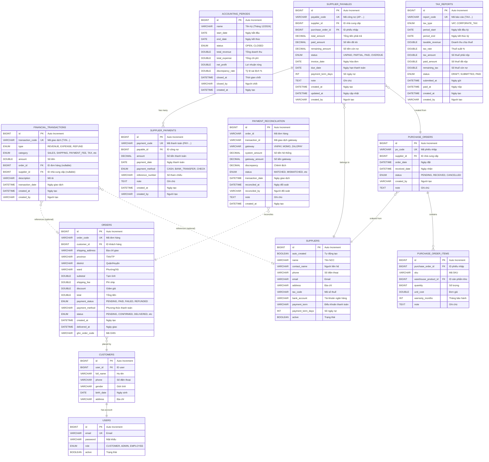

# 📊 SƠ ĐỒ DATABASE - MODULE KẾ TOÁN

## 📋 TỔNG QUAN

Module Kế Toán (Accounting) quản lý toàn bộ các giao dịch tài chính, công nợ nhà cung cấp, đối soát thanh toán và báo cáo thuế trong hệ thống TMDT.

## 🗂️ CÁC BẢNG CHÍNH

### 1. **financial_transactions** - Giao Dịch Tài Chính
### 2. **accounting_periods** - Kỳ Kế Toán  
### 3. **supplier_payables** - Công Nợ Phải Trả NCC
### 4. **supplier_payments** - Thanh Toán Cho NCC
### 5. **payment_reconciliation** - Đối Soát Thanh Toán
### 6. **tax_reports** - Báo Cáo Thuế

---

## 🏗️ CLASS DIAGRAM - KIẾN TRÚC PHÂN TẦNG (Layered Architecture)

```mermaid
classDiagram
    %% ========================================
    %% CONTROLLER LAYER - Tầng điều khiển
    %% ========================================
    
    class AccountingController {
        <<Controller>>
        -financialTransactionService: FinancialTransactionService
        -accountingPeriodService: AccountingPeriodService
        +getFinancialStatement(periodId) ResponseEntity
        +getTransactions(filters) ResponseEntity
        +createTransaction(request) ResponseEntity
        +getDashboardSummary() ResponseEntity
        +exportReport(periodId) ResponseEntity
    }
    
    class SupplierPayableController {
        <<Controller>>
        -supplierPayableService: SupplierPayableService
        -supplierPaymentService: SupplierPaymentService
        +getAllPayables(filters) ResponseEntity
        +getPayableById(id) ResponseEntity
        +createPayment(payableId, request) ResponseEntity
        +getPaymentHistory(payableId) ResponseEntity
        +getOverduePayables() ResponseEntity
        +getAgingReport() ResponseEntity
    }
    
    class TaxReportController {
        <<Controller>>
        -taxReportService: TaxReportService
        +getAllTaxReports(filters) ResponseEntity
        +getTaxReportById(id) ResponseEntity
        +createTaxReport(request) ResponseEntity
        +calculateTaxableRevenue(periodStart, periodEnd) ResponseEntity
        +submitTaxReport(id) ResponseEntity
        +markAsPaid(id, amount) ResponseEntity
        +recalculateTax(id) ResponseEntity
    }
    
    class PaymentReconciliationController {
        <<Controller>>
        -reconciliationService: PaymentReconciliationService
        +getAllReconciliations(filters) ResponseEntity
        +reconcilePayment(orderId) ResponseEntity
        +getMismatchedPayments() ResponseEntity
        +resolveDiscrepancy(id, note) ResponseEntity
    }
    
    %% ========================================
    %% SERVICE LAYER - Tầng nghiệp vụ
    %% ========================================
    
    class FinancialTransactionService {
        <<Service>>
        -transactionRepository: FinancialTransactionRepository
        -accountingPeriodService: AccountingPeriodService
        +createTransaction(dto) FinancialTransaction
        +getTransactionsByPeriod(periodId) List~FinancialTransaction~
        +getTransactionsByType(type) List~FinancialTransaction~
        +getTransactionsByOrder(orderId) List~FinancialTransaction~
        +getTransactionsBySupplier(supplierId) List~FinancialTransaction~
        +calculateTotalRevenue(startDate, endDate) Double
        +calculateTotalExpense(startDate, endDate) Double
        +generateTransactionCode() String
    }
    
    class AccountingPeriodService {
        <<Service>>
        -periodRepository: AccountingPeriodRepository
        -transactionService: FinancialTransactionService
        +createPeriod(dto) AccountingPeriod
        +getCurrentPeriod() AccountingPeriod
        +closePeriod(periodId, closedBy) AccountingPeriod
        +calculatePeriodSummary(periodId) PeriodSummary
        +updatePeriodTotals(periodId) void
        +canModifyPeriod(periodId) boolean
    }
    
    class SupplierPayableService {
        <<Service>>
        -payableRepository: SupplierPayableRepository
        -supplierRepository: SupplierRepository
        -purchaseOrderRepository: PurchaseOrderRepository
        +createPayable(purchaseOrderId) SupplierPayable
        +getPayablesBySupplier(supplierId) List~SupplierPayable~
        +getOverduePayables() List~SupplierPayable~
        +updatePayableStatus(payableId) void
        +calculateAgingReport() AgingReport
        +getTotalPayablesBySupplier(supplierId) BigDecimal
    }
    
    class SupplierPaymentService {
        <<Service>>
        -paymentRepository: SupplierPaymentRepository
        -payableService: SupplierPayableService
        -transactionService: FinancialTransactionService
        +createPayment(payableId, dto) SupplierPayment
        +getPaymentsByPayable(payableId) List~SupplierPayment~
        +getPaymentsBySupplier(supplierId) List~SupplierPayment~
        +processPayment(payment) void
        +generatePaymentCode() String
    }
    
    class TaxReportService {
        <<Service>>
        -taxReportRepository: TaxReportRepository
        -transactionService: FinancialTransactionService
        +createTaxReport(dto) TaxReport
        +calculateTaxableRevenue(startDate, endDate) Double
        +calculateTaxAmount(revenue, taxType) Double
        +submitReport(reportId) TaxReport
        +markAsPaid(reportId, amount) TaxReport
        +recalculateTax(reportId) TaxReport
        +generateReportCode() String
    }
    
    class PaymentReconciliationService {
        <<Service>>
        -reconciliationRepository: PaymentReconciliationRepository
        -orderRepository: OrderRepository
        +reconcilePayment(orderId) PaymentReconciliation
        +getMismatchedPayments() List~PaymentReconciliation~
        +calculateDiscrepancy(systemAmount, gatewayAmount) BigDecimal
        +resolveDiscrepancy(reconciliationId, note) void
    }
    
    %% ========================================
    %% REPOSITORY LAYER - Tầng truy xuất dữ liệu
    %% ========================================
    
    class FinancialTransactionRepository {
        <<Repository>>
        <<interface>>
        +findByType(type) List~FinancialTransaction~
        +findByCategory(category) List~FinancialTransaction~
        +findByOrderId(orderId) List~FinancialTransaction~
        +findBySupplierId(supplierId) List~FinancialTransaction~
        +findByTransactionDateBetween(start, end) List~FinancialTransaction~
        +sumAmountByTypeAndDateRange(type, start, end) Double
    }
    
    class AccountingPeriodRepository {
        <<Repository>>
        <<interface>>
        +findByStatus(status) List~AccountingPeriod~
        +findByStartDateLessThanEqualAndEndDateGreaterThanEqual(date) Optional~AccountingPeriod~
        +findCurrentPeriod() Optional~AccountingPeriod~
    }
    
    class SupplierPayableRepository {
        <<Repository>>
        <<interface>>
        +findBySupplierId(supplierId) List~SupplierPayable~
        +findByStatus(status) List~SupplierPayable~
        +findByDueDateBeforeAndStatusNot(date, status) List~SupplierPayable~
        +sumRemainingAmountBySupplierId(supplierId) BigDecimal
    }
    
    class SupplierPaymentRepository {
        <<Repository>>
        <<interface>>
        +findByPayableId(payableId) List~SupplierPayment~
        +findByPaymentDateBetween(start, end) List~SupplierPayment~
    }
    
    class TaxReportRepository {
        <<Repository>>
        <<interface>>
        +findByTaxType(taxType) List~TaxReport~
        +findByStatus(status) List~TaxReport~
        +findByPeriodStartAndPeriodEnd(start, end) Optional~TaxReport~
    }
    
    class PaymentReconciliationRepository {
        <<Repository>>
        <<interface>>
        +findByStatus(status) List~PaymentReconciliation~
        +findByOrderId(orderId) Optional~PaymentReconciliation~
        +findByGateway(gateway) List~PaymentReconciliation~
    }
    
    %% ========================================
    %% ENTITY LAYER - Tầng thực thể
    %% ========================================
    
    class FinancialTransaction {
        <<Entity>>
        -id: Long
        -transactionCode: String
        -type: TransactionType
        -category: TransactionCategory
        -amount: Double
        -orderId: Long
        -supplierId: Long
        -description: String
        -transactionDate: LocalDateTime
        -createdAt: LocalDateTime
        -createdBy: String
        +generateTransactionCode() String
        +isRevenue() boolean
        +isExpense() boolean
    }
    
    class AccountingPeriod {
        <<Entity>>
        -id: Long
        -name: String
        -startDate: LocalDate
        -endDate: LocalDate
        -status: PeriodStatus
        -totalRevenue: Double
        -totalExpense: Double
        -netProfit: Double
        -discrepancyRate: Double
        -closedAt: LocalDateTime
        -closedBy: String
        +calculateNetProfit() Double
        +closePeriod(closedBy) void
        +canModify() boolean
    }
    
    class SupplierPayable {
        <<Entity>>
        -id: Long
        -payableCode: String
        -supplier: Supplier
        -purchaseOrder: PurchaseOrder
        -totalAmount: BigDecimal
        -paidAmount: BigDecimal
        -remainingAmount: BigDecimal
        -status: PayableStatus
        -invoiceDate: LocalDate
        -dueDate: LocalDate
        +calculateRemainingAmount() BigDecimal
        +updateStatus() void
        +isOverdue() boolean
    }
    
    class SupplierPayment {
        <<Entity>>
        -id: Long
        -paymentCode: String
        -payable: SupplierPayable
        -amount: BigDecimal
        -paymentDate: LocalDate
        -paymentMethod: PaymentMethod
        -referenceNumber: String
        +generatePaymentCode() String
        +validateAmount() boolean
    }
    
    class TaxReport {
        <<Entity>>
        -id: Long
        -reportCode: String
        -taxType: TaxType
        -periodStart: LocalDate
        -periodEnd: LocalDate
        -taxableRevenue: Double
        -taxRate: Double
        -taxAmount: Double
        -paidAmount: Double
        -remainingTax: Double
        -status: TaxStatus
        +calculateTaxAmount() Double
        +submit() void
        +markAsPaid(amount) void
    }
    
    class PaymentReconciliation {
        <<Entity>>
        -id: Long
        -orderId: String
        -transactionId: String
        -gateway: String
        -systemAmount: BigDecimal
        -gatewayAmount: BigDecimal
        -discrepancy: BigDecimal
        -status: ReconciliationStatus
        +calculateDiscrepancy() BigDecimal
        +isMatched() boolean
    }
    
    %% ========================================
    %% DTO CLASSES - Data Transfer Objects
    %% ========================================
    
    class TransactionDTO {
        <<DTO>>
        +type: String
        +category: String
        +amount: Double
        +orderId: Long
        +supplierId: Long
        +description: String
        +transactionDate: LocalDateTime
    }
    
    class PayableDTO {
        <<DTO>>
        +supplierId: Long
        +purchaseOrderId: Long
        +totalAmount: BigDecimal
        +invoiceDate: LocalDate
        +paymentTermDays: Integer
        +note: String
    }
    
    class PaymentDTO {
        <<DTO>>
        +payableId: Long
        +amount: BigDecimal
        +paymentDate: LocalDate
        +paymentMethod: String
        +referenceNumber: String
        +note: String
    }
    
    class TaxReportDTO {
        <<DTO>>
        +taxType: String
        +periodStart: LocalDate
        +periodEnd: LocalDate
        +taxableRevenue: Double
        +taxRate: Double
    }
    
    %% ========================================
    %% RELATIONSHIPS - Mối quan hệ giữa các tầng
    %% ========================================
    
    %% Controller -> Service
    AccountingController --> FinancialTransactionService : uses
    AccountingController --> AccountingPeriodService : uses
    SupplierPayableController --> SupplierPayableService : uses
    SupplierPayableController --> SupplierPaymentService : uses
    TaxReportController --> TaxReportService : uses
    PaymentReconciliationController --> PaymentReconciliationService : uses
    
    %% Service -> Repository
    FinancialTransactionService --> FinancialTransactionRepository : uses
    FinancialTransactionService --> AccountingPeriodService : uses
    AccountingPeriodService --> AccountingPeriodRepository : uses
    AccountingPeriodService --> FinancialTransactionService : uses
    SupplierPayableService --> SupplierPayableRepository : uses
    SupplierPaymentService --> SupplierPaymentRepository : uses
    SupplierPaymentService --> SupplierPayableService : uses
    SupplierPaymentService --> FinancialTransactionService : uses
    TaxReportService --> TaxReportRepository : uses
    TaxReportService --> FinancialTransactionService : uses
    PaymentReconciliationService --> PaymentReconciliationRepository : uses
    
    %% Repository -> Entity
    FinancialTransactionRepository ..> FinancialTransaction : manages
    AccountingPeriodRepository ..> AccountingPeriod : manages
    SupplierPayableRepository ..> SupplierPayable : manages
    SupplierPaymentRepository ..> SupplierPayment : manages
    TaxReportRepository ..> TaxReport : manages
    PaymentReconciliationRepository ..> PaymentReconciliation : manages
    
    %% Controller -> DTO
    AccountingController ..> TransactionDTO : uses
    SupplierPayableController ..> PayableDTO : uses
    SupplierPayableController ..> PaymentDTO : uses
    TaxReportController ..> TaxReportDTO : uses
    
    %% Service -> Entity
    FinancialTransactionService ..> FinancialTransaction : creates/updates
    AccountingPeriodService ..> AccountingPeriod : creates/updates
    SupplierPayableService ..> SupplierPayable : creates/updates
    SupplierPaymentService ..> SupplierPayment : creates/updates
    TaxReportService ..> TaxReport : creates/updates
    PaymentReconciliationService ..> PaymentReconciliation : creates/updates
    
    %% ========================================
    %% NOTES
    %% ========================================
    
    note for AccountingController "REST API endpoints\n@RestController\n@RequestMapping('/api/accounting')"
    note for FinancialTransactionService "Business logic\n@Service\n@Transactional"
    note for FinancialTransactionRepository "Data access\nextends JpaRepository"
    note for FinancialTransaction "JPA Entity\n@Entity\n@Table('financial_transactions')"
```



### 📋 Giải Thích Kiến Trúc Phân Tầng

#### 1. **Controller Layer (Tầng Điều Khiển)**
- **Vai trò**: Tiếp nhận HTTP requests, validate input, gọi service, trả về response
- **Annotation**: `@RestController`, `@RequestMapping`
- **Các Controller**:
  - `AccountingController`: Quản lý giao dịch tài chính và kỳ kế toán
  - `SupplierPayableController`: Quản lý công nợ và thanh toán NCC
  - `TaxReportController`: Quản lý báo cáo thuế
  - `PaymentReconciliationController`: Đối soát thanh toán

#### 2. **Service Layer (Tầng Nghiệp Vụ)**
- **Vai trò**: Xử lý logic nghiệp vụ, transaction management
- **Annotation**: `@Service`, `@Transactional`
- **Các Service**:
  - `FinancialTransactionService`: Logic giao dịch tài chính
  - `AccountingPeriodService`: Logic kỳ kế toán
  - `SupplierPayableService`: Logic công nợ NCC
  - `SupplierPaymentService`: Logic thanh toán NCC
  - `TaxReportService`: Logic báo cáo thuế
  - `PaymentReconciliationService`: Logic đối soát

#### 3. **Repository Layer (Tầng Truy Xuất Dữ Liệu)**
- **Vai trò**: Truy xuất database, CRUD operations
- **Annotation**: `@Repository`, extends `JpaRepository`
- **Các Repository**: Mỗi entity có một repository tương ứng

#### 4. **Entity Layer (Tầng Thực Thể)**
- **Vai trò**: Ánh xạ với database tables
- **Annotation**: `@Entity`, `@Table`
- **Các Entity**: 6 entity chính của module kế toán

#### 5. **DTO Layer (Data Transfer Objects)**
- **Vai trò**: Truyền dữ liệu giữa các tầng, validate input
- **Annotation**: `@Data`, `@Valid`
- **Các DTO**: TransactionDTO, PayableDTO, PaymentDTO, TaxReportDTO

### 🔄 Luồng Xử Lý Request

```
Client Request
    ↓
Controller (validate, parse)
    ↓
Service (business logic)
    ↓
Repository (database query)
    ↓
Entity (data mapping)
    ↓
Database
```

### 🎯 Nguyên Tắc Thiết Kế

1. **Separation of Concerns**: Mỗi tầng có trách nhiệm riêng
2. **Dependency Injection**: Sử dụng Spring DI
3. **Single Responsibility**: Mỗi class có một nhiệm vụ duy nhất
4. **Open/Closed Principle**: Mở cho mở rộng, đóng cho sửa đổi
5. **Interface Segregation**: Repository extends JpaRepository

---

## 🎨 CLASS DIAGRAM (Mermaid) - CẢI TIẾN

```mermaid
classDiagram
    %% ========================================
    %% MODULE KẾ TOÁN - ACCOUNTING
    %% ========================================
    
    %% Entity: FinancialTransaction
    class FinancialTransaction {
        -id: Long
        -transactionCode: String
        -type: TransactionType
        -category: TransactionCategory
        -amount: Double
        -orderId: Long
        -supplierId: Long
        -description: String
        -transactionDate: LocalDateTime
        -createdAt: LocalDateTime
        -createdBy: String
        +generateTransactionCode() String
        +isRevenue() boolean
        +isExpense() boolean
        +getFormattedAmount() String
        +belongsToOrder(Long orderId) boolean
        +belongsToSupplier(Long supplierId) boolean
    }

    
    %% Entity: AccountingPeriod
    class AccountingPeriod {
        -id: Long
        -name: String
        -startDate: LocalDate
        -endDate: LocalDate
        -status: PeriodStatus
        -totalRevenue: Double
        -totalExpense: Double
        -netProfit: Double
        -discrepancyRate: Double
        -closedAt: LocalDateTime
        -closedBy: String
        -createdAt: LocalDateTime
        +calculateNetProfit() Double
        +calculateDiscrepancyRate() Double
        +closePeriod(String closedBy) void
        +isOpen() boolean
        +isClosed() boolean
        +canModify() boolean
        +addRevenue(Double amount) void
        +addExpense(Double amount) void
        +containsDate(LocalDate date) boolean
    }
    
    %% Entity: SupplierPayable
    class SupplierPayable {
        -id: Long
        -payableCode: String
        -supplier: Supplier
        -purchaseOrder: PurchaseOrder
        -totalAmount: BigDecimal
        -paidAmount: BigDecimal
        -remainingAmount: BigDecimal
        -status: PayableStatus
        -invoiceDate: LocalDate
        -dueDate: LocalDate
        -paymentTermDays: Integer
        -note: String
        -createdAt: LocalDateTime
        -updatedAt: LocalDateTime
        -createdBy: String
        +generatePayableCode() String
        +calculateRemainingAmount() BigDecimal
        +updateStatus() void
        +addPayment(BigDecimal amount) void
        +isOverdue() boolean
        +isPaid() boolean
        +isPartiallyPaid() boolean
        +getDaysOverdue() Integer
        +getPaymentProgress() Double
    }

    
    %% Entity: SupplierPayment
    class SupplierPayment {
        -id: Long
        -paymentCode: String
        -payable: SupplierPayable
        -amount: BigDecimal
        -paymentDate: LocalDate
        -paymentMethod: PaymentMethod
        -referenceNumber: String
        -note: String
        -createdAt: LocalDateTime
        -createdBy: String
        +generatePaymentCode() String
        +validateAmount() boolean
        +isCashPayment() boolean
        +isBankTransfer() boolean
        +getFormattedAmount() String
    }
    
    %% Entity: PaymentReconciliation
    class PaymentReconciliation {
        -id: Long
        -orderId: String
        -transactionId: String
        -gateway: String
        -systemAmount: BigDecimal
        -gatewayAmount: BigDecimal
        -discrepancy: BigDecimal
        -status: ReconciliationStatus
        -transactionDate: LocalDateTime
        -reconciledAt: LocalDateTime
        -reconciledBy: String
        -note: String
        -createdAt: LocalDateTime
        +calculateDiscrepancy() BigDecimal
        +isMatched() boolean
        +isMismatched() boolean
        +hasDiscrepancy() boolean
        +reconcile(String reconciledBy) void
        +getDiscrepancyPercentage() Double
    }

    
    %% Entity: TaxReport
    class TaxReport {
        -id: Long
        -reportCode: String
        -taxType: TaxType
        -periodStart: LocalDate
        -periodEnd: LocalDate
        -taxableRevenue: Double
        -taxRate: Double
        -taxAmount: Double
        -paidAmount: Double
        -remainingTax: Double
        -status: TaxStatus
        -submittedAt: LocalDateTime
        -paidAt: LocalDateTime
        -createdAt: LocalDateTime
        -createdBy: String
        +generateReportCode() String
        +calculateTaxAmount() Double
        +calculateRemainingTax() Double
        +submit() void
        +markAsPaid(Double amount) void
        +isDraft() boolean
        +isSubmitted() boolean
        +isPaid() boolean
        +isVAT() boolean
        +isCorporateTax() boolean
    }
    
    %% ========================================
    %% ENUMS - KẾ TOÁN
    %% ========================================
    
    class TransactionType {
        <<enumeration>>
        REVENUE
        EXPENSE
        REFUND
        +getDisplayName() String
        +isPositive() boolean
    }
    
    class TransactionCategory {
        <<enumeration>>
        SALES
        SHIPPING
        PAYMENT_FEE
        TAX
        SUPPLIER_PAYMENT
        REFUND
        OTHER_REVENUE
        OTHER_EXPENSE
        +getDisplayName() String
        +getTransactionType() TransactionType
    }

    
    class PayableStatus {
        <<enumeration>>
        UNPAID
        PARTIAL
        PAID
        OVERDUE
        +getDisplayName() String
        +getColor() String
        +canPay() boolean
    }
    
    class PaymentMethod {
        <<enumeration>>
        CASH
        BANK_TRANSFER
        CHECK
        +getDisplayName() String
        +requiresReference() boolean
    }
    
    class PeriodStatus {
        <<enumeration>>
        OPEN
        CLOSED
        +getDisplayName() String
        +canModify() boolean
    }
    
    class ReconciliationStatus {
        <<enumeration>>
        MATCHED
        MISMATCHED
        MISSING_IN_SYSTEM
        MISSING_IN_GATEWAY
        +getDisplayName() String
        +requiresAction() boolean
    }
    
    class TaxType {
        <<enumeration>>
        VAT
        CORPORATE_TAX
        +getDisplayName() String
        +getDefaultRate() Double
    }
    
    class TaxStatus {
        <<enumeration>>
        DRAFT
        SUBMITTED
        PAID
        +getDisplayName() String
        +canEdit() boolean
    }
    
    class PaymentStatus {
        <<enumeration>>
        PENDING
        PAID
        FAILED
        REFUNDED
        +getDisplayName() String
    }
    
    class OrderStatus {
        <<enumeration>>
        PENDING
        CONFIRMED
        READY_TO_PICK
        READY_TO_SHIP
        SHIPPING
        DELIVERED
        CANCELLED
        +getDisplayName() String
    }
    
    class POStatus {
        <<enumeration>>
        PENDING
        RECEIVED
        CANCELLED
        +getDisplayName() String
    }

    
    %% ========================================
    %% MODULE LIÊN QUAN - INVENTORY
    %% ========================================
    
    class Supplier {
        -id: Long
        -autoCreated: Boolean
        -name: String
        -contactName: String
        -phone: String
        -email: String
        -address: String
        -taxCode: String
        -bankAccount: String
        -paymentTerm: String
        -paymentTermDays: Integer
        -active: Boolean
        +getTotalPayables() BigDecimal
        +getTotalPaid() BigDecimal
        +getTotalRemaining() BigDecimal
        +hasOverduePayables() boolean
    }
    
    class PurchaseOrder {
        -id: Long
        -poCode: String
        -supplier: Supplier
        -orderDate: LocalDateTime
        -receivedDate: LocalDateTime
        -status: POStatus
        -createdBy: String
        -note: String
        -items: List~PurchaseOrderItem~
        +calculateTotalAmount() BigDecimal
        +isReceived() boolean
        +canCreatePayable() boolean
    }

    
    %% ========================================
    %% MODULE LIÊN QUAN - ORDER
    %% ========================================
    
    class Order {
        -id: Long
        -orderCode: String
        -customer: Customer
        -items: List~OrderItem~
        -shippingAddress: String
        -province: String
        -district: String
        -ward: String
        -wardName: String
        -address: String
        -note: String
        -subtotal: Double
        -shippingFee: Double
        -discount: Double
        -total: Double
        -paymentStatus: PaymentStatus
        -paymentMethod: String
        -paymentId: Long
        -status: OrderStatus
        -createdAt: LocalDateTime
        -confirmedAt: LocalDateTime
        -shippedAt: LocalDateTime
        -deliveredAt: LocalDateTime
        -cancelledAt: LocalDateTime
        -cancelReason: String
        -ghnOrderCode: String
        -ghnShippingStatus: String
        +isDelivered() boolean
        +canCreateTransaction() boolean
    }
    
    class Customer {
        -id: Long
        -user: User
        -fullName: String
        -phone: String
        -gender: String
        -birthDate: LocalDate
        -address: String
    }
    
    class OrderItem {
        -id: Long
        -order: Order
        -product: Product
        -productName: String
        -price: Double
        -quantity: Integer
        -subtotal: Double
        -serialNumber: String
        -reserved: Boolean
        -exported: Boolean
    }
    
    class PurchaseOrderItem {
        -id: Long
        -purchaseOrder: PurchaseOrder
        -sku: String
        -warehouseProduct: WarehouseProduct
        -quantity: Long
        -unitCost: Double
        -warrantyMonths: Integer
        -note: String
        -productDetails: List~ProductDetail~
        +calculateTotal() BigDecimal
    }

    
    %% ========================================
    %% MỐI QUAN HỆ - RELATIONSHIPS
    %% ========================================
    
    %% Quan hệ trong module Accounting
    FinancialTransaction "0..*" --> "1" TransactionType : type
    FinancialTransaction "0..*" --> "1" TransactionCategory : category
    FinancialTransaction "0..*" ..> "0..1" Order : orderId (optional)
    FinancialTransaction "0..*" ..> "0..1" Supplier : supplierId (optional)
    
    AccountingPeriod "1" --> "1" PeriodStatus : status
    
    SupplierPayable "0..*" --> "1" Supplier : supplier
    SupplierPayable "0..1" --> "1" PurchaseOrder : purchaseOrder
    SupplierPayable "1" --> "1" PayableStatus : status
    SupplierPayable "1" o-- "0..*" SupplierPayment : payments
    
    SupplierPayment "0..*" --> "1" SupplierPayable : payable
    SupplierPayment "1" --> "1" PaymentMethod : paymentMethod
    
    PaymentReconciliation "0..*" ..> "1" Order : orderId (reference)
    PaymentReconciliation "1" --> "1" ReconciliationStatus : status
    
    TaxReport "1" --> "1" TaxType : taxType
    TaxReport "1" --> "1" TaxStatus : status
    
    %% Quan hệ giữa các module
    PurchaseOrder "0..*" --> "1" Supplier : supplier
    PurchaseOrder "1" *-- "1..*" PurchaseOrderItem : items (composition)
    PurchaseOrder "1" --> "1" POStatus : status
    
    PurchaseOrderItem "0..*" --> "1" PurchaseOrder : purchaseOrder
    PurchaseOrderItem "0..*" --> "1" WarehouseProduct : warehouseProduct
    PurchaseOrderItem "1" *-- "0..*" ProductDetail : productDetails (composition)
    
    %% Quan hệ từ Order
    Order "0..*" --> "1" Customer : customer
    Order "1" --> "1" PaymentStatus : paymentStatus
    Order "1" --> "1" OrderStatus : status
    Order "1" *-- "1..*" OrderItem : items (composition)
    
    OrderItem "0..*" --> "1" Order : order
    OrderItem "0..*" --> "1" Product : product
    
    Customer "1" --> "1" User : user
    
    %% ========================================
    %% GHI CHÚ QUAN HỆ
    %% ========================================
    
    note for FinancialTransaction "Tự động tạo khi:\n- Order DELIVERED (REVENUE)\n- SupplierPayment created (EXPENSE)\n- Refund processed (REFUND)"
    
    note for SupplierPayable "Tự động tạo khi:\n- PurchaseOrder RECEIVED\n- Status tự động update khi payment"
    
    note for AccountingPeriod "Tự động tính:\n- totalRevenue từ transactions\n- totalExpense từ transactions\n- netProfit = revenue - expense"
    
    note for TaxReport "Tự động tính thuế:\n- VAT: 10% doanh thu\n- CORPORATE_TAX: 20% lợi nhuận"
```



---

## 🗄️ ERD DIAGRAM (Entity Relationship Diagram)



### 📋 Giải Thích Ký Hiệu ERD

| Ký Hiệu | Ý Nghĩa | Ví Dụ |
|---------|---------|-------|
| `||--o{` | One-to-Many (1:N) | 1 SupplierPayable có nhiều SupplierPayments |
| `}o--||` | Many-to-One (N:1) | Nhiều SupplierPayables thuộc 1 Supplier |
| `||--||` | One-to-One (1:1) | 1 Customer có 1 User |
| `}o..o\|` | Many-to-Optional-One | Nhiều Transactions tham chiếu 0 hoặc 1 Order |
| `PK` | Primary Key | Khóa chính |
| `FK` | Foreign Key | Khóa ngoại |
| `UK` | Unique Key | Khóa duy nhất |

### 🔗 Các Mối Quan Hệ Chính

#### 1. **Trong Module Kế Toán**
- `SUPPLIER_PAYABLES` ← `SUPPLIER_PAYMENTS` (1:N)
  - Một công nợ có nhiều lần thanh toán
  
- `SUPPLIERS` → `SUPPLIER_PAYABLES` (1:N)
  - Một nhà cung cấp có nhiều công nợ
  
- `PURCHASE_ORDERS` → `SUPPLIER_PAYABLES` (1:1)
  - Một phiếu nhập tạo một công nợ

#### 2. **Liên Kết với Module Khác**
- `FINANCIAL_TRANSACTIONS` ⇢ `ORDERS` (N:0..1)
  - Giao dịch có thể tham chiếu đơn hàng (optional)
  
- `FINANCIAL_TRANSACTIONS` ⇢ `SUPPLIERS` (N:0..1)
  - Giao dịch có thể tham chiếu nhà cung cấp (optional)
  
- `PAYMENT_RECONCILIATION` ⇢ `ORDERS` (N:1)
  - Đối soát tham chiếu đơn hàng

#### 3. **Module Inventory**
- `SUPPLIERS` → `PURCHASE_ORDERS` (1:N)
  - Một NCC có nhiều phiếu nhập
  
- `PURCHASE_ORDERS` → `PURCHASE_ORDER_ITEMS` (1:N)
  - Một phiếu nhập có nhiều items

#### 4. **Module Order**
- `CUSTOMERS` → `ORDERS` (1:N)
  - Một khách hàng có nhiều đơn hàng
  
- `CUSTOMERS` ← `USERS` (1:1)
  - Một customer có một user account

---

## 📊 CHI TIẾT CÁC BẢNG

### 1. **financial_transactions** - Giao Dịch Tài Chính

Bảng này lưu trữ tất cả các giao dịch tài chính trong hệ thống.

| Cột | Kiểu Dữ Liệu | Mô Tả |
|-----|--------------|-------|
| `id` | BIGINT | Primary Key, Auto Increment |
| `transaction_code` | VARCHAR(255) | Mã giao dịch duy nhất (TXN...) |
| `type` | ENUM | Loại giao dịch: REVENUE, EXPENSE, REFUND |
| `category` | ENUM | Danh mục: SALES, SHIPPING, PAYMENT_FEE, TAX, SUPPLIER_PAYMENT, REFUND, OTHER_REVENUE, OTHER_EXPENSE |
| `amount` | DOUBLE | Số tiền giao dịch |
| `order_id` | BIGINT | ID đơn hàng (nếu có) |
| `supplier_id` | BIGINT | ID nhà cung cấp (nếu có) |
| `description` | VARCHAR(1000) | Mô tả giao dịch |
| `transaction_date` | DATETIME | Ngày giao dịch |
| `created_at` | DATETIME | Ngày tạo record |
| `created_by` | VARCHAR(255) | Người tạo |

**Indexes:**
- `idx_transaction_code` ON `transaction_code`
- `idx_type` ON `type`
- `idx_category` ON `category`
- `idx_order_id` ON `order_id`
- `idx_supplier_id` ON `supplier_id`
- `idx_transaction_date` ON `transaction_date`

**Business Rules:**
- Tự động tạo `transaction_code` nếu không có
- `type` = REVENUE: Ghi nhận doanh thu (khi đơn hàng DELIVERED)
- `type` = EXPENSE: Ghi nhận chi phí (thanh toán NCC, phí vận chuyển)
- `type` = REFUND: Hoàn tiền khách hàng


---

### 2. **accounting_periods** - Kỳ Kế Toán

Bảng quản lý các kỳ kế toán (tháng, quý, năm).

| Cột | Kiểu Dữ Liệu | Mô Tả |
|-----|--------------|-------|
| `id` | BIGINT | Primary Key, Auto Increment |
| `name` | VARCHAR(255) | Tên kỳ (VD: "Tháng 12/2024") |
| `start_date` | DATE | Ngày bắt đầu kỳ |
| `end_date` | DATE | Ngày kết thúc kỳ |
| `status` | ENUM | Trạng thái: OPEN, CLOSED |
| `total_revenue` | DOUBLE | Tổng doanh thu trong kỳ |
| `total_expense` | DOUBLE | Tổng chi phí trong kỳ |
| `net_profit` | DOUBLE | Lợi nhuận ròng (revenue - expense) |
| `discrepancy_rate` | DOUBLE | Tỷ lệ sai lệch (%) |
| `closed_at` | DATETIME | Thời gian chốt kỳ |
| `closed_by` | VARCHAR(255) | Người chốt kỳ |
| `created_at` | DATETIME | Ngày tạo |

**Indexes:**
- `idx_start_date` ON `start_date`
- `idx_end_date` ON `end_date`
- `idx_status` ON `status`

**Business Rules:**
- Khi `status` = CLOSED: Không thể sửa các giao dịch trong kỳ
- Tự động tính `net_profit` = `total_revenue` - `total_expense`
- `discrepancy_rate` = (Chênh lệch / Tổng doanh thu) * 100


---

### 3. **supplier_payables** - Công Nợ Phải Trả NCC

Bảng quản lý công nợ phải trả cho nhà cung cấp.

| Cột | Kiểu Dữ Liệu | Mô Tả |
|-----|--------------|-------|
| `id` | BIGINT | Primary Key, Auto Increment |
| `payable_code` | VARCHAR(255) | Mã công nợ (AP-YYYYMMDD-XXXX) |
| `supplier_id` | BIGINT | Foreign Key → suppliers.id |
| `purchase_order_id` | BIGINT | Foreign Key → purchase_orders.id |
| `total_amount` | DECIMAL(15,2) | Tổng tiền phải trả |
| `paid_amount` | DECIMAL(15,2) | Số tiền đã trả |
| `remaining_amount` | DECIMAL(15,2) | Số tiền còn nợ |
| `status` | ENUM | Trạng thái: UNPAID, PARTIAL, PAID, OVERDUE |
| `invoice_date` | DATE | Ngày hóa đơn (ngày nhập hàng) |
| `due_date` | DATE | Ngày hạn thanh toán |
| `payment_term_days` | INT | Số ngày nợ (từ supplier) |
| `note` | TEXT | Ghi chú |
| `created_at` | DATETIME | Ngày tạo |
| `updated_at` | DATETIME | Ngày cập nhật |
| `created_by` | VARCHAR(255) | Người tạo |

**Indexes:**
- `idx_payable_code` ON `payable_code` (UNIQUE)
- `idx_supplier_id` ON `supplier_id`
- `idx_purchase_order_id` ON `purchase_order_id`
- `idx_status` ON `status`
- `idx_due_date` ON `due_date`

**Business Rules:**
- `remaining_amount` = `total_amount` - `paid_amount`
- Tự động cập nhật `status`:
  - `remaining_amount` = 0 → PAID
  - `paid_amount` > 0 AND `remaining_amount` > 0 → PARTIAL
  - `due_date` < NOW() AND `remaining_amount` > 0 → OVERDUE
  - Còn lại → UNPAID


---

### 4. **supplier_payments** - Thanh Toán Cho NCC

Bảng ghi nhận các lần thanh toán cho nhà cung cấp.

| Cột | Kiểu Dữ Liệu | Mô Tả |
|-----|--------------|-------|
| `id` | BIGINT | Primary Key, Auto Increment |
| `payment_code` | VARCHAR(255) | Mã thanh toán (PAY-YYYYMMDD-XXXX) |
| `payable_id` | BIGINT | Foreign Key → supplier_payables.id |
| `amount` | DECIMAL(15,2) | Số tiền thanh toán |
| `payment_date` | DATE | Ngày thanh toán |
| `payment_method` | ENUM | Phương thức: CASH, BANK_TRANSFER, CHECK |
| `reference_number` | VARCHAR(255) | Số tham chiếu (số CK, số séc) |
| `note` | TEXT | Ghi chú |
| `created_at` | DATETIME | Ngày tạo |
| `created_by` | VARCHAR(255) | Người tạo |

**Indexes:**
- `idx_payment_code` ON `payment_code` (UNIQUE)
- `idx_payable_id` ON `payable_id`
- `idx_payment_date` ON `payment_date`

**Business Rules:**
- Khi tạo payment mới:
  1. Cập nhật `paid_amount` trong `supplier_payables`
  2. Tính lại `remaining_amount`
  3. Cập nhật `status` của payable
  4. Tạo `financial_transaction` với type=EXPENSE, category=SUPPLIER_PAYMENT


---

### 5. **payment_reconciliation** - Đối Soát Thanh Toán

Bảng đối soát thanh toán giữa hệ thống và cổng thanh toán (VNPAY, MOMO, ZALOPAY).

| Cột | Kiểu Dữ Liệu | Mô Tả |
|-----|--------------|-------|
| `id` | BIGINT | Primary Key, Auto Increment |
| `order_id` | VARCHAR(255) | Mã đơn hàng |
| `transaction_id` | VARCHAR(255) | Mã giao dịch từ gateway |
| `gateway` | VARCHAR(50) | Tên cổng: VNPAY, MOMO, ZALOPAY |
| `system_amount` | DECIMAL(15,2) | Số tiền trong hệ thống |
| `gateway_amount` | DECIMAL(15,2) | Số tiền từ gateway |
| `discrepancy` | DECIMAL(15,2) | Chênh lệch (system - gateway) |
| `status` | ENUM | Trạng thái: MATCHED, MISMATCHED, MISSING_IN_SYSTEM, MISSING_IN_GATEWAY |
| `transaction_date` | DATETIME | Ngày giao dịch |
| `reconciled_at` | DATETIME | Ngày đối soát |
| `reconciled_by` | VARCHAR(255) | Người đối soát |
| `note` | TEXT | Ghi chú |
| `created_at` | DATETIME | Ngày tạo |

**Indexes:**
- `idx_order_id` ON `order_id`
- `idx_transaction_id` ON `transaction_id`
- `idx_status` ON `status`
- `idx_transaction_date` ON `transaction_date`

**Business Rules:**
- `discrepancy` = `system_amount` - `gateway_amount`
- `status` = MATCHED nếu `discrepancy` = 0
- `status` = MISMATCHED nếu `discrepancy` ≠ 0


---

### 6. **tax_reports** - Báo Cáo Thuế

Bảng quản lý báo cáo thuế (VAT, thuế TNDN).

| Cột | Kiểu Dữ Liệu | Mô Tả |
|-----|--------------|-------|
| `id` | BIGINT | Primary Key, Auto Increment |
| `report_code` | VARCHAR(255) | Mã báo cáo (TAX...) |
| `tax_type` | ENUM | Loại thuế: VAT, CORPORATE_TAX |
| `period_start` | DATE | Ngày bắt đầu kỳ |
| `period_end` | DATE | Ngày kết thúc kỳ |
| `taxable_revenue` | DOUBLE | Doanh thu chịu thuế |
| `tax_rate` | DOUBLE | Thuế suất (%) |
| `tax_amount` | DOUBLE | Số thuế phải nộp |
| `paid_amount` | DOUBLE | Số thuế đã nộp |
| `remaining_tax` | DOUBLE | Số thuế còn nợ |
| `status` | ENUM | Trạng thái: DRAFT, SUBMITTED, PAID |
| `submitted_at` | DATETIME | Ngày gửi báo cáo |
| `paid_at` | DATETIME | Ngày nộp thuế |
| `created_at` | DATETIME | Ngày tạo |
| `created_by` | VARCHAR(255) | Người tạo |

**Indexes:**
- `idx_report_code` ON `report_code` (UNIQUE)
- `idx_tax_type` ON `tax_type`
- `idx_status` ON `status`
- `idx_period_start` ON `period_start`
- `idx_period_end` ON `period_end`

**Business Rules:**
- `tax_amount` = `taxable_revenue` * `tax_rate` / 100
- `remaining_tax` = `tax_amount` - `paid_amount`
- VAT: Thuế suất 10%
- CORPORATE_TAX: Thuế suất 20%


---

## 🔗 MỐI QUAN HỆ VỚI CÁC MODULE KHÁC

### 1. **Với Module ORDER (Đơn Hàng)**

```
financial_transactions.order_id → orders.id
payment_reconciliation.order_id → orders.order_code
```

**Luồng nghiệp vụ:**
1. Khi đơn hàng chuyển sang trạng thái `DELIVERED`:
   - Tự động tạo `FinancialTransaction` với:
     - `type` = REVENUE
     - `category` = SALES
     - `amount` = order.total
     - `order_id` = order.id
     - `description` = "Doanh thu từ đơn hàng {orderCode}"

2. Khi khách hàng thanh toán online:
   - Tạo `FinancialTransaction` với:
     - `type` = REVENUE
     - `category` = PAYMENT_FEE (nếu có phí)
     - `amount` = phí thanh toán
     - `order_id` = order.id

3. Đối soát thanh toán:
   - Tạo record trong `payment_reconciliation`
   - So sánh số tiền trong hệ thống vs cổng thanh toán


---

### 2. **Với Module INVENTORY (Kho Hàng)**

```
supplier_payables.supplier_id → suppliers.id
supplier_payables.purchase_order_id → purchase_orders.id
financial_transactions.supplier_id → suppliers.id
```

**Luồng nghiệp vụ:**
1. Khi tạo phiếu nhập hàng (`PurchaseOrder`) với supplier:
   - Tự động tạo `SupplierPayable`:
     - `supplier_id` = supplier.id
     - `purchase_order_id` = po.id
     - `total_amount` = tổng tiền nhập hàng
     - `due_date` = invoice_date + supplier.paymentTermDays
     - `status` = UNPAID

2. Khi thanh toán cho nhà cung cấp:
   - Tạo `SupplierPayment`
   - Cập nhật `paid_amount` và `remaining_amount` trong `SupplierPayable`
   - Tạo `FinancialTransaction` với:
     - `type` = EXPENSE
     - `category` = SUPPLIER_PAYMENT
     - `amount` = số tiền thanh toán
     - `supplier_id` = supplier.id

3. Theo dõi công nợ:
   - Tính tổng công nợ theo supplier
   - Phân tích aging (nợ quá hạn 30, 60, 90 ngày)


---

## 📈 LUỒNG DỮ LIỆU CHÍNH

### Luồng 1: Ghi Nhận Doanh Thu

```
Order (DELIVERED) 
    → Event: OrderStatusChangedEvent
    → OrderEventListener.handleOrderDelivered()
    → Tạo FinancialTransaction (REVENUE, SALES)
    → Cập nhật AccountingPeriod.totalRevenue
```

### Luồng 2: Quản Lý Công Nợ NCC

```
PurchaseOrder (CREATED)
    → Tạo SupplierPayable (UNPAID)
    → SupplierPayment (thanh toán)
    → Cập nhật SupplierPayable (PARTIAL/PAID)
    → Tạo FinancialTransaction (EXPENSE, SUPPLIER_PAYMENT)
    → Cập nhật AccountingPeriod.totalExpense
```

### Luồng 3: Đối Soát Thanh Toán

```
Payment Gateway Webhook
    → Lấy thông tin giao dịch
    → So sánh với Order.total
    → Tạo PaymentReconciliation
    → Cập nhật status (MATCHED/MISMATCHED)
```

### Luồng 4: Báo Cáo Thuế

```
Kết thúc kỳ kế toán
    → Tính tổng doanh thu chịu thuế
    → Tạo TaxReport (VAT 10%, CORPORATE_TAX 20%)
    → Tính tax_amount
    → Gửi báo cáo (SUBMITTED)
    → Nộp thuế (PAID)
```


---

## 🎯 CÁC CHỨC NĂNG CHÍNH

### 1. Quản Lý Giao Dịch Tài Chính
- ✅ Ghi nhận tự động doanh thu khi đơn hàng giao thành công
- ✅ Ghi nhận chi phí thanh toán nhà cung cấp
- ✅ Ghi nhận phí vận chuyển, phí thanh toán
- ✅ Phân loại giao dịch theo type và category
- ✅ Tra cứu giao dịch theo ngày, loại, danh mục

### 2. Quản Lý Công Nợ Nhà Cung Cấp
- ✅ Tự động tạo công nợ khi nhập hàng
- ✅ Theo dõi số tiền đã trả / còn nợ
- ✅ Cảnh báo công nợ quá hạn (OVERDUE)
- ✅ Thanh toán công nợ (toàn bộ hoặc từng phần)
- ✅ Báo cáo aging analysis (30, 60, 90 ngày)

### 3. Đối Soát Thanh Toán
- ✅ So sánh số tiền hệ thống vs cổng thanh toán
- ✅ Phát hiện chênh lệch (MISMATCHED)
- ✅ Xử lý giao dịch thiếu (MISSING_IN_SYSTEM/GATEWAY)
- ✅ Ghi nhận người đối soát và thời gian

### 4. Quản Lý Kỳ Kế Toán
- ✅ Tạo kỳ kế toán (tháng, quý, năm)
- ✅ Tính tổng doanh thu, chi phí, lợi nhuận
- ✅ Chốt kỳ kế toán (CLOSED)
- ✅ Tính tỷ lệ sai lệch

### 5. Báo Cáo Thuế
- ✅ Tạo báo cáo thuế VAT (10%)
- ✅ Tạo báo cáo thuế TNDN (20%)
- ✅ Tính số thuế phải nộp
- ✅ Theo dõi số thuế đã nộp / còn nợ
- ✅ Quản lý trạng thái báo cáo (DRAFT, SUBMITTED, PAID)


---

## 📊 THỐNG KÊ DATABASE

| Thông Tin | Giá Trị |
|-----------|---------|
| **Tổng số bảng** | 6 bảng chính |
| **Tổng số enum** | 8 enums |
| **Foreign Keys** | 4 FKs |
| **Indexes** | ~25 indexes |
| **Triggers** | 0 (sử dụng @PrePersist, @PreUpdate) |

---

## 🔐 PHÂN QUYỀN TRUY CẬP

| Role | Quyền Truy Cập |
|------|----------------|
| **ADMIN** | Full access (tất cả chức năng) |
| **ACCOUNTANT** | - Xem/tạo/sửa giao dịch tài chính<br>- Quản lý công nợ NCC<br>- Đối soát thanh toán<br>- Quản lý kỳ kế toán<br>- Báo cáo thuế |
| **WAREHOUSE_MANAGER** | - Xem công nợ NCC<br>- Xem giao dịch liên quan đến nhập hàng |
| **SALES** | - Xem giao dịch liên quan đến đơn hàng |

---

## 📝 GHI CHÚ QUAN TRỌNG

### 1. Tự Động Hóa
- **Event-Driven**: Sử dụng Spring Events để tự động tạo giao dịch tài chính
- **@PrePersist**: Tự động tạo mã code, set giá trị mặc định
- **@PreUpdate**: Tự động cập nhật status, tính toán lại số liệu

### 2. Tính Toàn Vẹn Dữ Liệu
- Sử dụng `BigDecimal` cho các trường tiền tệ (độ chính xác cao)
- Foreign Key constraints đảm bảo tham chiếu hợp lệ
- Unique constraints trên các mã code

### 3. Performance
- Indexes trên các cột thường xuyên query
- Lazy loading cho các relationship
- Pagination cho danh sách lớn

### 4. Audit Trail
- Lưu `created_by`, `created_at` cho mọi record
- Lưu `updated_at` cho các bảng quan trọng
- Không xóa vật lý, chỉ đánh dấu inactive

---

## 🚀 HƯỚNG PHÁT TRIỂN

### Tính Năng Cần Bổ Sung
1. ❌ **Journal Entries** - Bút toán kế toán chi tiết
2. ❌ **Chart of Accounts** - Hệ thống tài khoản kế toán
3. ❌ **Budget Management** - Quản lý ngân sách
4. ❌ **Cash Flow Statement** - Báo cáo lưu chuyển tiền tệ
5. ❌ **Profit & Loss Statement** - Báo cáo lãi lỗ chi tiết
6. ❌ **Balance Sheet** - Bảng cân đối kế toán
7. ❌ **Multi-Currency Support** - Hỗ trợ đa tiền tệ
8. ❌ **Approval Workflow** - Quy trình phê duyệt thanh toán

---

**Tài liệu này được tạo tự động từ source code**  
**Ngày tạo:** 2024-12-25  
**Version:** 1.0


---

## 🏛️ SƠ ĐỒ KIẾN TRÚC PHÂN TẦNG - PACKAGE DIAGRAM

### Cấu Trúc Package

```
com.doan.WEB_TMDT.module.accounting/
│
├── controller/                    # REST API Controllers
│   ├── AccountingController
│   ├── SupplierPayableController
│   └── TaxReportController
│
├── service/                       # Service Interfaces
│   ├── FinancialTransactionService
│   ├── AccountingPeriodService
│   ├── SupplierPayableService
│   ├── SupplierPaymentService
│   └── TaxReportService
│
├── service/impl/                  # Service Implementations
│   ├── FinancialTransactionServiceImpl
│   ├── AccountingPeriodServiceImpl
│   ├── SupplierPayableServiceImpl
│   ├── SupplierPaymentServiceImpl
│   └── TaxReportServiceImpl
│
├── repository/                    # JPA Repositories
│   ├── FinancialTransactionRepository
│   ├── AccountingPeriodRepository
│   ├── SupplierPayableRepository
│   ├── SupplierPaymentRepository
│   └── TaxReportRepository
│
├── entity/                        # JPA Entities
│   ├── FinancialTransaction
│   ├── AccountingPeriod
│   ├── SupplierPayable
│   ├── SupplierPayment
│   ├── PaymentReconciliation
│   └── TaxReport
│
└── dto/                          # Data Transfer Objects
    ├── TransactionDTO
    ├── PayableDTO
    ├── PaymentDTO
    └── TaxReportDTO
```

### Sơ Đồ Lớp Theo Kiến Trúc (Giống Ảnh)

```
┌─────────────────────────────────────────────────────────────────────────────┐
│                          CONTROLLER LAYER                                    │
│  @RestController, @RequestMapping("/api/accounting")                        │
├─────────────────────────────────────────────────────────────────────────────┤
│                                                                              │
│  ┌──────────────────────┐  ┌──────────────────────┐  ┌──────────────────┐ │
│  │ AccountingController │  │SupplierPayableCtrl   │  │ TaxReportCtrl    │ │
│  ├──────────────────────┤  ├──────────────────────┤  ├──────────────────┤ │
│  │ -transactionService  │  │ -payableService      │  │ -taxReportService│ │
│  │ -periodService       │  │ -paymentService      │  │                  │ │
│  ├──────────────────────┤  ├──────────────────────┤  ├──────────────────┤ │
│  │ +getTransactions()   │  │ +getAllPayables()    │  │ +getAllReports() │ │
│  │ +createTransaction() │  │ +createPayment()     │  │ +createReport()  │ │
│  │ +getDashboard()      │  │ +getOverdue()        │  │ +submitReport()  │ │
│  └──────────────────────┘  └──────────────────────┘  └──────────────────┘ │
│                                                                              │
└──────────────────────────────────┬───────────────────────────────────────────┘
                                   │ uses
                                   ▼
┌─────────────────────────────────────────────────────────────────────────────┐
│                          SERVICE INTERFACE LAYER                             │
│  @Service (interfaces)                                                       │
├─────────────────────────────────────────────────────────────────────────────┤
│                                                                              │
│  ┌────────────────────────┐  ┌────────────────────┐  ┌──────────────────┐ │
│  │FinancialTransaction    │  │SupplierPayable     │  │ TaxReport        │ │
│  │Service <<interface>>   │  │Service <<interface>>│  │Service <<if>>    │ │
│  ├────────────────────────┤  ├────────────────────┤  ├──────────────────┤ │
│  │ +createTransaction()   │  │ +createPayable()   │  │ +createReport()  │ │
│  │ +getByPeriod()         │  │ +getBySupplier()   │  │ +calculateTax()  │ │
│  │ +calculateRevenue()    │  │ +getOverdue()      │  │ +submitReport()  │ │
│  └────────────────────────┘  └────────────────────┘  └──────────────────┘ │
│                                                                              │
└──────────────────────────────────┬───────────────────────────────────────────┘
                                   │ implements
                                   ▼
┌─────────────────────────────────────────────────────────────────────────────┐
│                     SERVICE IMPLEMENTATION LAYER                             │
│  @Service, @Transactional                                                    │
├─────────────────────────────────────────────────────────────────────────────┤
│                                                                              │
│  ┌────────────────────────┐  ┌────────────────────┐  ┌──────────────────┐ │
│  │FinancialTransaction    │  │SupplierPayable     │  │ TaxReport        │ │
│  │ServiceImpl             │  │ServiceImpl         │  │ServiceImpl       │ │
│  ├────────────────────────┤  ├────────────────────┤  ├──────────────────┤ │
│  │ -transactionRepo       │  │ -payableRepo       │  │ -taxReportRepo   │ │
│  │ -periodService         │  │ -supplierRepo      │  │ -transactionSvc  │ │
│  ├────────────────────────┤  ├────────────────────┤  ├──────────────────┤ │
│  │ +createTransaction()   │  │ +createPayable()   │  │ +createReport()  │ │
│  │ +getByPeriod()         │  │ +getBySupplier()   │  │ +calculateTax()  │ │
│  │ +calculateRevenue()    │  │ +updateStatus()    │  │ +submitReport()  │ │
│  └────────────────────────┘  └────────────────────┘  └──────────────────┘ │
│                                                                              │
└──────────────────────────────────┬───────────────────────────────────────────┘
                                   │ uses
                                   ▼
┌─────────────────────────────────────────────────────────────────────────────┐
│                          REPOSITORY LAYER                                    │
│  @Repository, extends JpaRepository<Entity, Long>                           │
├─────────────────────────────────────────────────────────────────────────────┤
│                                                                              │
│  ┌────────────────────────┐  ┌────────────────────┐  ┌──────────────────┐ │
│  │FinancialTransaction    │  │SupplierPayable     │  │ TaxReport        │ │
│  │Repository <<if>>       │  │Repository <<if>>   │  │Repository <<if>> │ │
│  ├────────────────────────┤  ├────────────────────┤  ├──────────────────┤ │
│  │ +findByType()          │  │ +findBySupplier()  │  │ +findByTaxType() │ │
│  │ +findByCategory()      │  │ +findByStatus()    │  │ +findByStatus()  │ │
│  │ +findByOrderId()       │  │ +findOverdue()     │  │ +findByPeriod()  │ │
│  │ +sumAmountByType()     │  │ +sumRemaining()    │  │                  │ │
│  └────────────────────────┘  └────────────────────┘  └──────────────────┘ │
│                                                                              │
└──────────────────────────────────┬───────────────────────────────────────────┘
                                   │ manages
                                   ▼
┌─────────────────────────────────────────────────────────────────────────────┐
│                            ENTITY LAYER                                      │
│  @Entity, @Table                                                             │
├─────────────────────────────────────────────────────────────────────────────┤
│                                                                              │
│  ┌────────────────────────┐  ┌────────────────────┐  ┌──────────────────┐ │
│  │FinancialTransaction    │  │SupplierPayable     │  │ TaxReport        │ │
│  ├────────────────────────┤  ├────────────────────┤  ├──────────────────┤ │
│  │ -id: Long              │  │ -id: Long          │  │ -id: Long        │ │
│  │ -transactionCode       │  │ -payableCode       │  │ -reportCode      │ │
│  │ -type: Enum            │  │ -supplier          │  │ -taxType: Enum   │ │
│  │ -category: Enum        │  │ -purchaseOrder     │  │ -periodStart     │ │
│  │ -amount: Double        │  │ -totalAmount       │  │ -periodEnd       │ │
│  │ -orderId: Long         │  │ -paidAmount        │  │ -taxableRevenue  │ │
│  │ -supplierId: Long      │  │ -remainingAmount   │  │ -taxRate         │ │
│  │ -description           │  │ -status: Enum      │  │ -taxAmount       │ │
│  │ -transactionDate       │  │ -dueDate           │  │ -status: Enum    │ │
│  ├────────────────────────┤  ├────────────────────┤  ├──────────────────┤ │
│  │ +generateCode()        │  │ +calculateRemain() │  │ +calculateTax()  │ │
│  │ +isRevenue()           │  │ +updateStatus()    │  │ +submit()        │ │
│  │ +isExpense()           │  │ +isOverdue()       │  │ +markAsPaid()    │ │
│  └────────────────────────┘  └────────────────────┘  └──────────────────┘ │
│                                                                              │
│  ┌────────────────────────┐  ┌────────────────────┐                        │
│  │AccountingPeriod        │  │SupplierPayment     │                        │
│  ├────────────────────────┤  ├────────────────────┤                        │
│  │ -id: Long              │  │ -id: Long          │                        │
│  │ -name: String          │  │ -paymentCode       │                        │
│  │ -startDate             │  │ -payable           │                        │
│  │ -endDate               │  │ -amount            │                        │
│  │ -status: Enum          │  │ -paymentDate       │                        │
│  │ -totalRevenue          │  │ -paymentMethod     │                        │
│  │ -totalExpense          │  │ -referenceNumber   │                        │
│  │ -netProfit             │  ├────────────────────┤                        │
│  ├────────────────────────┤  │ +generateCode()    │                        │
│  │ +calculateProfit()     │  │ +validateAmount()  │                        │
│  │ +closePeriod()         │  └────────────────────┘                        │
│  │ +canModify()           │                                                 │
│  └────────────────────────┘                                                 │
│                                                                              │
└──────────────────────────────────────────────────────────────────────────────┘
```

### Mô Tả Chi Tiết Các Tầng

#### 1. **Controller Layer** (Tầng Điều Khiển)
- **Package**: `com.doan.WEB_TMDT.module.accounting.controller`
- **Annotation**: `@RestController`, `@RequestMapping`
- **Nhiệm vụ**:
  - Tiếp nhận HTTP requests từ client
  - Validate input data
  - Gọi service layer để xử lý logic
  - Trả về HTTP response (JSON)
- **Các Controller**:
  - `AccountingController`: API cho giao dịch tài chính và kỳ kế toán
  - `SupplierPayableController`: API cho công nợ và thanh toán NCC
  - `TaxReportController`: API cho báo cáo thuế

#### 2. **Service Interface Layer** (Tầng Interface Nghiệp Vụ)
- **Package**: `com.doan.WEB_TMDT.module.accounting.service`
- **Annotation**: Không có (chỉ là interface)
- **Nhiệm vụ**:
  - Định nghĩa contract cho business logic
  - Cho phép loose coupling
  - Dễ dàng mock trong testing
- **Các Interface**:
  - `FinancialTransactionService`
  - `AccountingPeriodService`
  - `SupplierPayableService`
  - `SupplierPaymentService`
  - `TaxReportService`

#### 3. **Service Implementation Layer** (Tầng Triển Khai Nghiệp Vụ)
- **Package**: `com.doan.WEB_TMDT.module.accounting.service.impl`
- **Annotation**: `@Service`, `@Transactional`
- **Nhiệm vụ**:
  - Implement business logic thực tế
  - Quản lý transaction
  - Gọi repository để truy xuất dữ liệu
  - Xử lý exception
- **Các Implementation**:
  - `FinancialTransactionServiceImpl`
  - `AccountingPeriodServiceImpl`
  - `SupplierPayableServiceImpl`
  - `SupplierPaymentServiceImpl`
  - `TaxReportServiceImpl`

#### 4. **Repository Layer** (Tầng Truy Xuất Dữ Liệu)
- **Package**: `com.doan.WEB_TMDT.module.accounting.repository`
- **Annotation**: `@Repository`
- **Extends**: `JpaRepository<Entity, Long>`
- **Nhiệm vụ**:
  - CRUD operations
  - Custom query methods
  - Spring Data JPA tự động implement
- **Các Repository**:
  - `FinancialTransactionRepository`
  - `AccountingPeriodRepository`
  - `SupplierPayableRepository`
  - `SupplierPaymentRepository`
  - `TaxReportRepository`

#### 5. **Entity Layer** (Tầng Thực Thể)
- **Package**: `com.doan.WEB_TMDT.module.accounting.entity`
- **Annotation**: `@Entity`, `@Table`
- **Nhiệm vụ**:
  - Ánh xạ với database tables
  - Chứa business logic đơn giản
  - Định nghĩa relationships
- **Các Entity**:
  - `FinancialTransaction`
  - `AccountingPeriod`
  - `SupplierPayable`
  - `SupplierPayment`
  - `PaymentReconciliation`
  - `TaxReport`

### Luồng Xử Lý Request (Request Flow)

```
1. Client gửi HTTP Request
        ↓
2. Controller nhận request
   - Validate input
   - Parse parameters
        ↓
3. Controller gọi Service Interface
        ↓
4. Service Implementation xử lý logic
   - Business rules
   - Calculations
   - Validations
        ↓
5. Service gọi Repository
        ↓
6. Repository truy xuất Database
   - JPA queries
   - CRUD operations
        ↓
7. Entity mapping với Database
   - ORM (Object-Relational Mapping)
        ↓
8. Trả kết quả ngược lại
   Repository → Service → Controller → Client
```

### Dependency Injection Flow

```
@RestController
    ↓ @Autowired
Service Interface
    ↓ @Autowired (implementation)
Service Implementation
    ↓ @Autowired
Repository Interface
    ↓ Spring Data JPA auto-implements
JpaRepository
```

### Design Patterns Được Sử Dụng

1. **Layered Architecture**: Phân tầng rõ ràng (5 tầng)
2. **Dependency Injection**: Spring IoC Container
3. **Repository Pattern**: Tách biệt data access
4. **Service Layer Pattern**: Tách biệt business logic
5. **DTO Pattern**: Transfer data giữa layers
6. **Interface Segregation**: Service interfaces
7. **Singleton Pattern**: Spring beans mặc định là singleton

### Ưu Điểm Của Kiến Trúc Này

✅ **Separation of Concerns**: Mỗi tầng có trách nhiệm riêng biệt
✅ **Testability**: Dễ dàng unit test từng tầng
✅ **Maintainability**: Dễ bảo trì và mở rộng
✅ **Reusability**: Service có thể tái sử dụng
✅ **Loose Coupling**: Các tầng độc lập với nhau
✅ **Scalability**: Dễ dàng scale từng tầng

---

**Tài liệu này mô tả kiến trúc phân tầng của Module Kế Toán**  
**Ngày cập nhật:** 2024-12-28  
**Version:** 2.0
