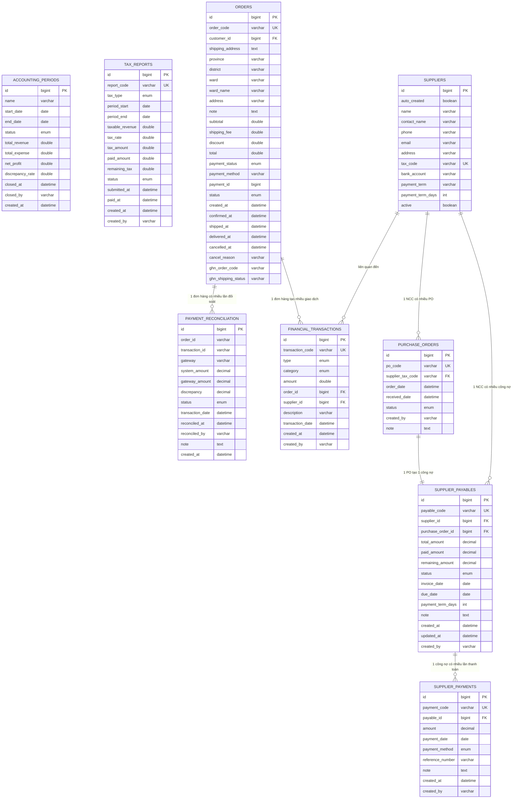

# 🗄️ ENTITY RELATIONSHIP DIAGRAM - MODULE KẾ TOÁN

## 📋 GIỚI THIỆU

Sơ đồ ERD này mô tả chi tiết cấu trúc database của Module Kế Toán và mối quan hệ với các module khác trong hệ thống TMDT.

---

## 🎨 ERD DIAGRAM (Mermaid - Database Style)



---


## 📊 GIẢI THÍCH MỐI QUAN HỆ

### 1. **SUPPLIER_PAYABLES ↔ SUPPLIER_PAYMENTS** (1:N)

```
Mối quan hệ: One-to-Many (1:N)
Ý nghĩa: Một công nợ có thể có nhiều lần thanh toán

┌─────────────────────┐         ┌──────────────────────┐
│ SUPPLIER_PAYABLES   │ 1     N │ SUPPLIER_PAYMENTS    │
│                     │─────────│                      │
│ - id (PK)           │         │ - id (PK)            │
│ - payable_code      │         │ - payment_code       │
│ - total_amount      │         │ - payable_id (FK) ───┤
│ - paid_amount       │         │ - amount             │
│ - remaining_amount  │         │ - payment_date       │
│ - status            │         │ - payment_method     │
└─────────────────────┘         └──────────────────────┘

Business Logic:
- Khi tạo SupplierPayment mới:
  1. Cập nhật paid_amount trong SupplierPayable
  2. Tính lại remaining_amount = total_amount - paid_amount
  3. Cập nhật status (UNPAID → PARTIAL → PAID)
  4. Tạo FinancialTransaction (EXPENSE, SUPPLIER_PAYMENT)
```

---

### 2. **SUPPLIERS ↔ SUPPLIER_PAYABLES** (1:N)

```
Mối quan hệ: One-to-Many (1:N)
Ý nghĩa: Một nhà cung cấp có nhiều công nợ

┌─────────────────────┐         ┌──────────────────────┐
│ SUPPLIERS           │ 1     N │ SUPPLIER_PAYABLES    │
│                     │─────────│                      │
│ - id (PK)           │         │ - id (PK)            │
│ - name              │         │ - supplier_id (FK) ──┤
│ - tax_code (UK)     │         │ - payable_code       │
│ - payment_term_days │         │ - total_amount       │
│ - active            │         │ - due_date           │
└─────────────────────┘         └──────────────────────┘

Business Logic:
- Khi tạo PurchaseOrder với supplier:
  1. Tự động tạo SupplierPayable
  2. due_date = invoice_date + supplier.payment_term_days
  3. Link supplier_id từ PurchaseOrder
```

---

### 3. **PURCHASE_ORDERS ↔ SUPPLIER_PAYABLES** (1:1)

```
Mối quan hệ: One-to-One (1:1)
Ý nghĩa: Mỗi phiếu nhập hàng tạo ra một công nợ

┌─────────────────────┐         ┌──────────────────────┐
│ PURCHASE_ORDERS     │ 1     1 │ SUPPLIER_PAYABLES    │
│                     │─────────│                      │
│ - id (PK)           │         │ - id (PK)            │
│ - po_code (UK)      │         │ - purchase_order_id ─┤
│ - supplier_tax_code │         │ - payable_code       │
│ - order_date        │         │ - invoice_date       │
│ - status            │         │ - total_amount       │
└─────────────────────┘         └──────────────────────┘

Business Logic:
- Khi PurchaseOrder.status = RECEIVED:
  1. Tạo SupplierPayable mới
  2. total_amount = tổng tiền nhập hàng
  3. invoice_date = PurchaseOrder.received_date
  4. status = UNPAID
```


---

### 4. **SUPPLIERS ↔ PURCHASE_ORDERS** (1:N)

```
Mối quan hệ: One-to-Many (1:N)
Ý nghĩa: Một nhà cung cấp có nhiều phiếu nhập hàng

┌─────────────────────┐         ┌──────────────────────┐
│ SUPPLIERS           │ 1     N │ PURCHASE_ORDERS      │
│                     │─────────│                      │
│ - id (PK)           │         │ - id (PK)            │
│ - tax_code (UK) ────┼─────────┤ - supplier_tax_code  │
│ - name              │         │ - po_code            │
│ - payment_term_days │         │ - order_date         │
└─────────────────────┘         └──────────────────────┘

Business Logic:
- Foreign Key: supplier_tax_code → suppliers.tax_code
- Khi tạo PurchaseOrder, phải chọn Supplier
- Lấy payment_term_days từ Supplier để tính due_date
```

---

### 5. **ORDERS ↔ FINANCIAL_TRANSACTIONS** (1:N - Optional)

```
Mối quan hệ: One-to-Many (1:N) - Optional Reference
Ý nghĩa: Một đơn hàng có thể tạo nhiều giao dịch tài chính

┌─────────────────────┐         ┌──────────────────────┐
│ ORDERS              │ 1     N │ FINANCIAL_TRANS...   │
│                     │────────│                      │
│ - id (PK)           │         │ - id (PK)            │
│ - order_code        │         │ - order_id (FK) ─────┤
│ - total             │         │ - type               │
│ - status            │         │ - category           │
│ - payment_status    │         │ - amount             │
└─────────────────────┘         └──────────────────────┘

Business Logic:
- Khi Order.status = DELIVERED:
  → Tạo FinancialTransaction (REVENUE, SALES, amount = order.total)
  
- Khi Order.payment_status = PAID (online):
  → Tạo FinancialTransaction (REVENUE, PAYMENT_FEE, amount = phí)
  
- Khi Order.status = CANCELLED và đã thanh toán:
  → Tạo FinancialTransaction (REFUND, REFUND, amount = order.total)
```

---

### 6. **SUPPLIERS ↔ FINANCIAL_TRANSACTIONS** (1:N - Optional)

```
Mối quan hệ: One-to-Many (1:N) - Optional Reference
Ý nghĩa: Một nhà cung cấp có nhiều giao dịch tài chính liên quan

┌─────────────────────┐         ┌──────────────────────┐
│ SUPPLIERS           │ 1     N │ FINANCIAL_TRANS...   │
│                     │─────────│                      │
│ - id (PK)           │         │ - id (PK)            │
│ - name              │         │ - supplier_id (FK) ──┤
│ - tax_code          │         │ - type               │
└─────────────────────┘         │ - category           │
                                │ - amount             │
                                └──────────────────────┘

Business Logic:
- Khi thanh toán cho NCC (SupplierPayment):
  → Tạo FinancialTransaction (EXPENSE, SUPPLIER_PAYMENT, supplier_id)
  
- Khi nhập hàng từ NCC:
  → Có thể tạo FinancialTransaction để ghi nhận chi phí
```


---

### 7. **ORDERS ↔ PAYMENT_RECONCILIATION** (1:N)

```
Mối quan hệ: One-to-Many (1:N) - Reference by order_code
Ý nghĩa: Một đơn hàng có thể có nhiều lần đối soát

┌─────────────────────┐         ┌──────────────────────┐
│ ORDERS              │ 1     N │ PAYMENT_RECONCIL...  │
│                     │─────────│                      │
│ - id (PK)           │         │ - id (PK)            │
│ - order_code (UK) ──┼─────────┤ - order_id (string)  │
│ - total             │         │ - transaction_id     │
│ - payment_method    │         │ - gateway            │
│ - payment_status    │         │ - system_amount      │
└─────────────────────┘         │ - gateway_amount     │
                                │ - discrepancy        │
                                │ - status             │
                                └──────────────────────┘

Business Logic:
- Đối soát thanh toán online (VNPAY, MOMO, ZALOPAY)
- So sánh system_amount (từ Order) vs gateway_amount
- discrepancy = system_amount - gateway_amount
- status = MATCHED nếu discrepancy = 0
- status = MISMATCHED nếu discrepancy ≠ 0
```

---

## 🔑 FOREIGN KEY CONSTRAINTS

### Bảng SUPPLIER_PAYABLES

```sql
ALTER TABLE supplier_payables
ADD CONSTRAINT fk_payable_supplier 
    FOREIGN KEY (supplier_id) 
    REFERENCES suppliers(id)
    ON DELETE RESTRICT
    ON UPDATE CASCADE;

ALTER TABLE supplier_payables
ADD CONSTRAINT fk_payable_purchase_order 
    FOREIGN KEY (purchase_order_id) 
    REFERENCES purchase_orders(id)
    ON DELETE RESTRICT
    ON UPDATE CASCADE;
```

### Bảng SUPPLIER_PAYMENTS

```sql
ALTER TABLE supplier_payments
ADD CONSTRAINT fk_payment_payable 
    FOREIGN KEY (payable_id) 
    REFERENCES supplier_payables(id)
    ON DELETE RESTRICT
    ON UPDATE CASCADE;
```

### Bảng PURCHASE_ORDERS

```sql
ALTER TABLE purchase_orders
ADD CONSTRAINT fk_po_supplier 
    FOREIGN KEY (supplier_tax_code) 
    REFERENCES suppliers(tax_code)
    ON DELETE RESTRICT
    ON UPDATE CASCADE;
```

### Bảng FINANCIAL_TRANSACTIONS

```sql
-- Optional FKs (nullable)
ALTER TABLE financial_transactions
ADD CONSTRAINT fk_transaction_order 
    FOREIGN KEY (order_id) 
    REFERENCES orders(id)
    ON DELETE SET NULL
    ON UPDATE CASCADE;

ALTER TABLE financial_transactions
ADD CONSTRAINT fk_transaction_supplier 
    FOREIGN KEY (supplier_id) 
    REFERENCES suppliers(id)
    ON DELETE SET NULL
    ON UPDATE CASCADE;
```


---

## 📐 CARDINALITY (Bản Số)

| Quan Hệ | Cardinality | Mô Tả |
|---------|-------------|-------|
| **Supplier → SupplierPayable** | 1:N | Một NCC có nhiều công nợ |
| **Supplier → PurchaseOrder** | 1:N | Một NCC có nhiều PO |
| **PurchaseOrder → SupplierPayable** | 1:1 | Một PO tạo một công nợ |
| **SupplierPayable → SupplierPayment** | 1:N | Một công nợ có nhiều lần thanh toán |
| **Order → FinancialTransaction** | 1:N | Một đơn hàng tạo nhiều giao dịch |
| **Supplier → FinancialTransaction** | 1:N | Một NCC có nhiều giao dịch |
| **Order → PaymentReconciliation** | 1:N | Một đơn hàng có nhiều lần đối soát |

---

## 🎨 SƠ ĐỒ VISUAL PARADIGM STYLE

Để vẽ giống Visual Paradigm, sử dụng các ký hiệu sau:

### Ký Hiệu Quan Hệ

```
1. One-to-One (1:1)
   [Table A] ────── [Table B]
   
2. One-to-Many (1:N)
   [Table A] ────< [Table B]
   hoặc
   [Table A] ──┬── [Table B]
              └── [Table B]
              
3. Many-to-Many (N:M)
   [Table A] >────< [Table B]
   
4. Optional (nullable FK)
   [Table A] ----o [Table B]
   
5. Mandatory (not null FK)
   [Table A] ────| [Table B]
```

### Ví Dụ Cụ Thể

```
┌─────────────────────────┐
│ SUPPLIERS               │
│ ─────────────────────── │
│ PK  id                  │
│ UK  tax_code            │
│     name                │
│     payment_term_days   │
└─────────────────────────┘
            │ 1
            │
            │ N
┌─────────────────────────┐
│ SUPPLIER_PAYABLES       │
│ ─────────────────────── │
│ PK  id                  │
│ FK  supplier_id         │◄────┐
│ FK  purchase_order_id   │     │
│     total_amount        │     │
│     paid_amount         │     │
│     remaining_amount    │     │
│     status              │     │
└─────────────────────────┘     │
            │ 1                  │
            │                    │
            │ N                  │
┌─────────────────────────┐     │
│ SUPPLIER_PAYMENTS       │     │
│ ─────────────────────── │     │
│ PK  id                  │     │
│ FK  payable_id          │─────┘
│     amount              │
│     payment_date        │
│     payment_method      │
└─────────────────────────┘
```


---

## 🔄 LUỒNG DỮ LIỆU CHI TIẾT

### Luồng 1: Nhập Hàng → Công Nợ → Thanh Toán

```
Step 1: Tạo Purchase Order
┌─────────────────────┐
│ PURCHASE_ORDERS     │
│ - po_code: PO001    │
│ - supplier_id: 1    │
│ - status: CREATED   │
└─────────────────────┘
           │
           │ Khi status = RECEIVED
           ▼
Step 2: Tự động tạo Supplier Payable
┌─────────────────────┐
│ SUPPLIER_PAYABLES   │
│ - payable_code: AP001│
│ - supplier_id: 1    │
│ - po_id: 1          │
│ - total: 10,000,000 │
│ - paid: 0           │
│ - remaining: 10M    │
│ - status: UNPAID    │
└─────────────────────┘
           │
           │ Khi thanh toán
           ▼
Step 3: Tạo Supplier Payment
┌─────────────────────┐
│ SUPPLIER_PAYMENTS   │
│ - payment_code: PAY001│
│ - payable_id: 1     │
│ - amount: 5,000,000 │
│ - method: BANK_TRANSFER│
└─────────────────────┘
           │
           │ Trigger update
           ▼
Step 4: Cập nhật Payable
┌─────────────────────┐
│ SUPPLIER_PAYABLES   │
│ - paid: 5,000,000   │
│ - remaining: 5M     │
│ - status: PARTIAL   │
└─────────────────────┘
           │
           │ Đồng thời
           ▼
Step 5: Tạo Financial Transaction
┌─────────────────────┐
│ FINANCIAL_TRANS...  │
│ - type: EXPENSE     │
│ - category: SUPPLIER_PAYMENT│
│ - amount: 5,000,000 │
│ - supplier_id: 1    │
└─────────────────────┘
```


---

### Luồng 2: Đơn Hàng → Giao Dịch Tài Chính

```
Step 1: Khách hàng đặt hàng
┌─────────────────────┐
│ ORDERS              │
│ - order_code: ORD001│
│ - total: 2,000,000  │
│ - status: PENDING   │
│ - payment_status: UNPAID│
└─────────────────────┘
           │
           │ Khi status = DELIVERED
           ▼
Step 2: Tự động tạo Financial Transaction (Doanh thu)
┌─────────────────────┐
│ FINANCIAL_TRANS...  │
│ - type: REVENUE     │
│ - category: SALES   │
│ - amount: 2,000,000 │
│ - order_id: 1       │
│ - description: "Doanh thu từ ORD001"│
└─────────────────────┘
           │
           │ Nếu thanh toán online
           ▼
Step 3: Tạo Financial Transaction (Phí thanh toán)
┌─────────────────────┐
│ FINANCIAL_TRANS...  │
│ - type: EXPENSE     │
│ - category: PAYMENT_FEE│
│ - amount: 20,000    │
│ - order_id: 1       │
└─────────────────────┘
           │
           │ Đồng thời
           ▼
Step 4: Đối soát thanh toán
┌─────────────────────┐
│ PAYMENT_RECONCIL... │
│ - order_id: ORD001  │
│ - system_amount: 2M │
│ - gateway_amount: 2M│
│ - discrepancy: 0    │
│ - status: MATCHED   │
└─────────────────────┘
```

---

## 📋 CHECKLIST THIẾT KẾ DATABASE

### ✅ Đã Hoàn Thành

- [x] Định nghĩa tất cả entities
- [x] Xác định Primary Keys
- [x] Xác định Foreign Keys
- [x] Xác định Unique Constraints
- [x] Thiết kế Indexes
- [x] Định nghĩa Enums
- [x] Xác định mối quan hệ (1:1, 1:N, N:M)
- [x] Xác định Cardinality
- [x] Xác định ON DELETE/UPDATE behaviors
- [x] Thiết kế Audit columns (created_at, created_by)

### ⚠️ Cần Cải Thiện

- [ ] Thêm soft delete (deleted_at)
- [ ] Thêm updated_by cho audit trail
- [ ] Thêm version column cho optimistic locking
- [ ] Thêm CHECK constraints
- [ ] Thêm triggers cho business logic phức tạp
- [ ] Partition tables cho dữ liệu lớn
- [ ] Archiving strategy cho dữ liệu cũ

---

## 🎯 KẾT LUẬN

Sơ đồ ERD này mô tả đầy đủ:

1. **Cấu trúc database** của Module Kế Toán
2. **Mối quan hệ** giữa các bảng (1:1, 1:N)
3. **Foreign Key constraints** và referential integrity
4. **Luồng dữ liệu** từ nghiệp vụ đến database
5. **Tích hợp** với các module khác (Order, Inventory)

Thiết kế này đảm bảo:
- ✅ Tính toàn vẹn dữ liệu (Data Integrity)
- ✅ Chuẩn hóa database (3NF)
- ✅ Performance tốt (Indexes)
- ✅ Dễ bảo trì và mở rộng
- ✅ Audit trail đầy đủ

---

**Tài liệu này được tạo để hỗ trợ vẽ ERD bằng Visual Paradigm**  
**Ngày tạo:** 2024-12-25  
**Version:** 1.0
