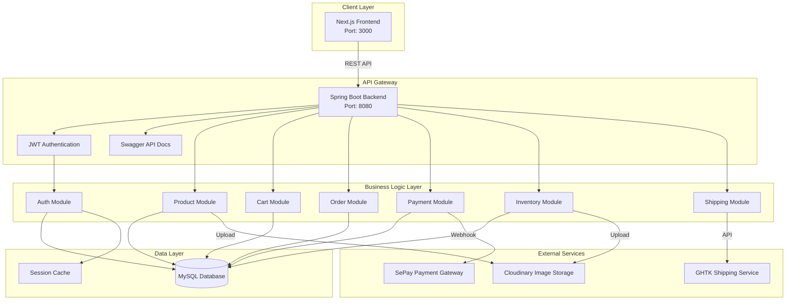
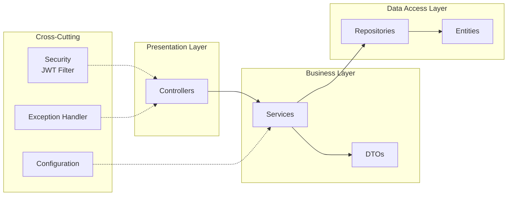
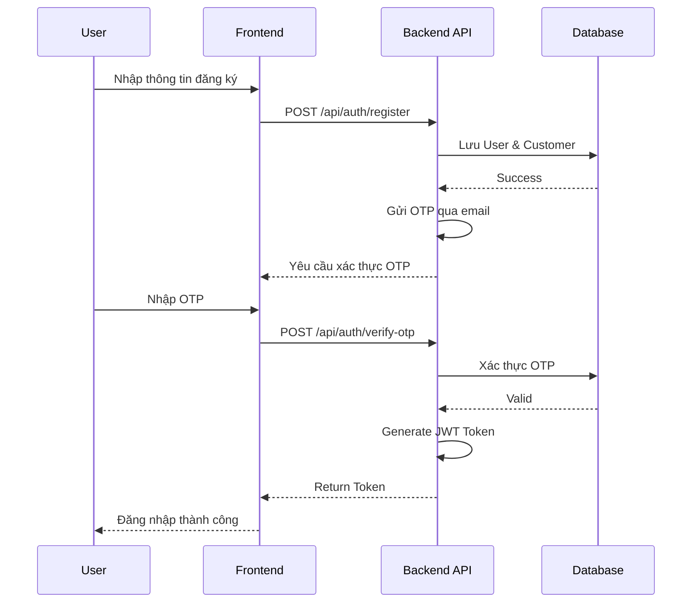
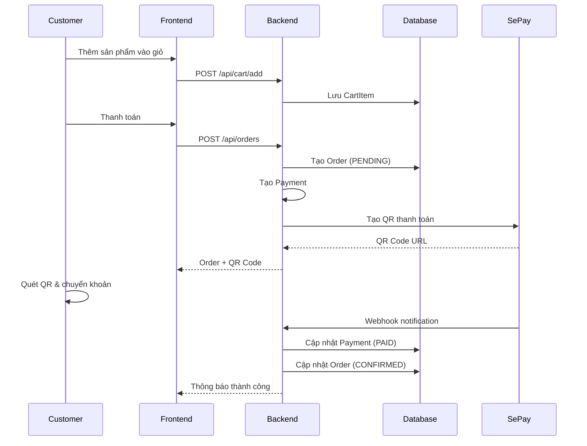
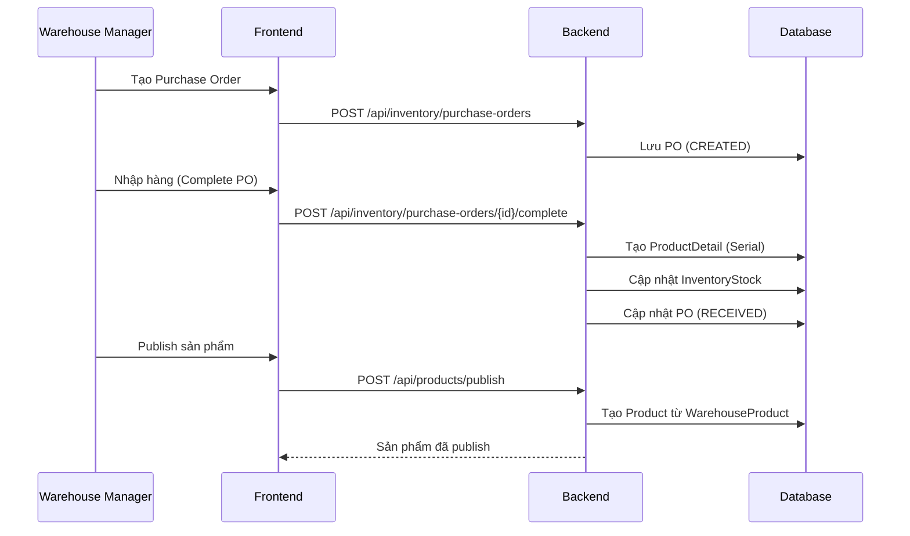
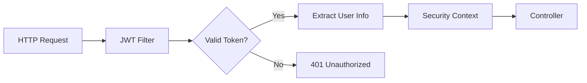
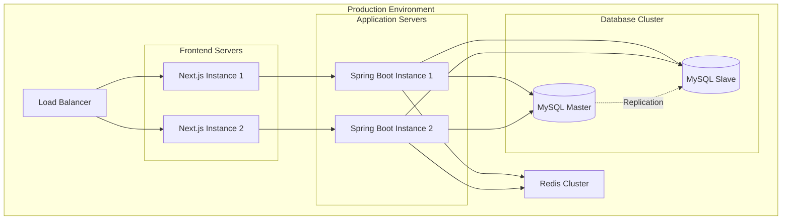

# Sơ Đồ Kiến Trúc Hệ Thống - WEB_TMDT

## 1. Tổng Quan Kiến Trúc Hệ Thống

## 2. Kiến Trúc Module (Layered Architecture)

## 3. Chi Tiết Các Module

### 3.1 Auth Module
- **Chức năng**: Xác thực, phân quyền, quản lý người dùng
- **Components**:
  - User Management (Customer, Employee)
  - Role-Based Access Control (ADMIN, PRODUCT_MANAGER, WAREHOUSE_MANAGER, CUSTOMER)
  - JWT Token Generation & Validation
  - OTP Verification
  - Employee Registration Approval

### 3.2 Product Module
- **Chức năng**: Quản lý sản phẩm và danh mục
- **Components**:
  - Category Management (Hierarchical)
  - Product CRUD
  - Product Publishing from Warehouse
  - Technical Specifications
  - Product Images

### 3.3 Cart Module
- **Chức năng**: Giỏ hàng
- **Components**:
  - Add/Remove/Update Cart Items
  - Cart Calculation
  - User-specific Cart

### 3.4 Order Module
- **Chức năng**: Quản lý đơn hàng
- **Components**:
  - Order Creation
  - Order Status Tracking
  - Order History
  - Order Cancellation

### 3.5 Payment Module
- **Chức năng**: Xử lý thanh toán
- **Components**:
  - SePay Integration
  - Payment QR Code Generation
  - Webhook Handler
  - Payment Status Tracking

### 3.6 Inventory Module
- **Chức năng**: Quản lý kho hàng
- **Components**:
  - Warehouse Product Management
  - Purchase Orders (PO)
  - Export Orders
  - Stock Management
  - Supplier Management
  - Product Serial Tracking

### 3.7 Shipping Module
- **Chức năng**: Tính phí vận chuyển
- **Components**:
  - GHTK Integration
  - Shipping Fee Calculation

## 4. Luồng Xử Lý Chính

### 4.1 Luồng Đăng Ký & Đăng Nhập

### 4.2 Luồng Mua Hàng

### 4.3 Luồng Quản Lý Kho

## 5. Bảo Mật

### 5.1 Authentication Flow

### 5.2 Authorization
- **Role-based Access Control (RBAC)**
  - ADMIN: Toàn quyền
  - PRODUCT_MANAGER: Quản lý sản phẩm, danh mục
  - WAREHOUSE_MANAGER: Quản lý kho, nhập/xuất hàng
  - CUSTOMER: Mua hàng, xem đơn hàng

## 6. Công Nghệ Sử Dụng

### Backend
- **Framework**: Spring Boot 3.x
- **Language**: Java 17+
- **Database**: MySQL
- **ORM**: JPA/Hibernate
- **Security**: Spring Security + JWT
- **API Documentation**: Swagger/OpenAPI
- **Build Tool**: Maven

### Frontend
- **Framework**: Next.js 14 (React)
- **Language**: TypeScript
- **Styling**: Tailwind CSS
- **State Management**: Zustand
- **HTTP Client**: Axios

### External Services
- **Payment**: SePay
- **Shipping**: GHTK
- **Image Storage**: Cloudinary

## 7. Deployment Architecture

## 8. Monitoring & Logging

- **Application Logs**: SLF4J + Logback
- **Performance Monitoring**: Spring Boot Actuator
- **Error Tracking**: Exception Handler với logging
- **API Monitoring**: Swagger UI + Request/Response logging
