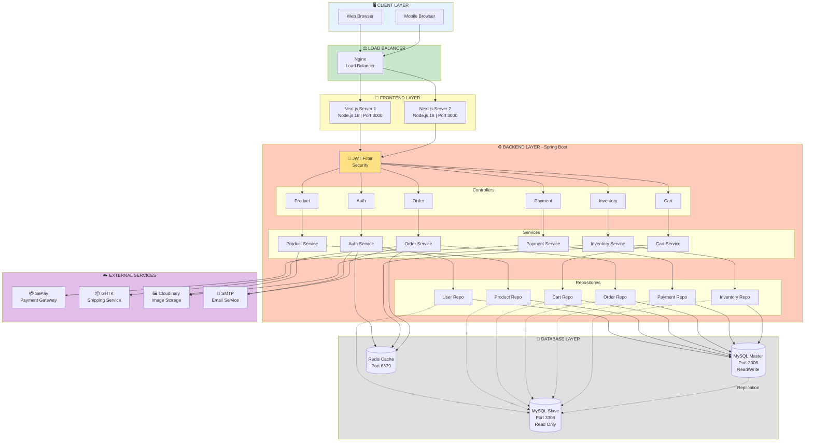

# Sơ Đồ Kiến Trúc Hệ Thống - WEB_TMDT

## Kiến Trúc Tổng Thể



## Mô Tả Chi Tiết

### 🖥️ Client Layer
- **Web Browser**: Trình duyệt desktop
- **Mobile Browser**: Trình duyệt mobile

### ⚖️ Load Balancer
- **Nginx**: Phân tải request đến các frontend servers
- Hỗ trợ HTTPS/SSL termination

### 🎨 Frontend Layer
- **Technology**: Next.js 14 + TypeScript
- **Runtime**: Node.js 18
- **Port**: 3000
- **Instances**: 2 servers (High Availability)
- **Features**:
  - Server-Side Rendering (SSR)
  - Static Site Generation (SSG)
  - API Routes
  - Image Optimization

### ⚙️ Backend Layer
- **Technology**: Spring Boot 3.x + Java 17
- **Port**: 8080
- **Instances**: 2 servers (High Availability)
- **Architecture**: Layered (Controller → Service → Repository)

#### Controllers
- **AuthController**: Đăng ký, đăng nhập, xác thực
- **ProductController**: Quản lý sản phẩm, danh mục
- **CartController**: Quản lý giỏ hàng
- **OrderController**: Quản lý đơn hàng
- **PaymentController**: Xử lý thanh toán
- **InventoryController**: Quản lý kho hàng

#### Services (Business Logic)
- Xử lý logic nghiệp vụ
- Validation
- Transaction management

#### Repositories (Data Access)
- JPA/Hibernate
- CRUD operations
- Custom queries

#### Security
- **JWT Filter**: Xác thực token
- **Role-Based Access Control**: ADMIN, PRODUCT_MANAGER, WAREHOUSE_MANAGER, CUSTOMER

### 💾 Database Layer

#### MySQL Master-Slave
- **Master**: Read/Write operations
- **Slave**: Read-only operations (Load balancing)
- **Replication**: Async replication từ Master → Slave
- **Port**: 3306

#### Redis Cache
- **Purpose**: Session storage, caching
- **Port**: 6379
- **Data**: User sessions, cart data, frequently accessed data

### ☁️ External Services

#### 💳 SePay - Payment Gateway
- Tạo QR Code thanh toán
- Webhook notification
- Transaction tracking

#### 📦 GHTK - Shipping Service
- Tính phí vận chuyển
- Tạo đơn giao hàng
- Tracking đơn hàng

#### 🖼️ Cloudinary - Image Storage
- Upload ảnh sản phẩm
- Image transformation
- CDN delivery

#### 📧 SMTP - Email Service
- Gửi email xác nhận đăng ký
- Gửi email xác nhận đơn hàng
- Gửi OTP

## Luồng Request

### 1. User Request Flow
```
Browser → Nginx → Frontend Server → Backend Controller → JWT Filter
→ Service → Repository → Database → Response
```

### 2. Authentication Flow
```
Login Request → AuthController → AuthService → UserRepository
→ MySQL → Verify Password → Generate JWT → Redis (Store Session)
→ Return Token
```

### 3. Order Flow
```
Create Order → OrderController → OrderService → Create Payment
→ PaymentService → SePay API → Generate QR → Return to User
→ User Pays → SePay Webhook → Update Payment → Update Order
→ Reserve Stock → Send Email
```

## Công Nghệ Sử Dụng

| Layer | Technology | Version |
|-------|-----------|---------|
| Frontend | Next.js | 14.x |
| Frontend Runtime | Node.js | 18.x |
| Backend | Spring Boot | 3.x |
| Backend Language | Java | 17 |
| Database | MySQL | 8.0 |
| Cache | Redis | 7.x |
| Load Balancer | Nginx | Latest |
| Payment | SePay API | - |
| Shipping | GHTK API | - |
| Storage | Cloudinary | - |

## Phân Quyền (RBAC)

| Role | Mô Tả | Quyền |
|------|-------|-------|
| **ADMIN** | Quản trị viên | Toàn quyền hệ thống |
| **PRODUCT_MANAGER** | Quản lý sản phẩm | Quản lý sản phẩm, danh mục, publish |
| **WAREHOUSE_MANAGER** | Quản lý kho | Quản lý kho, nhập/xuất hàng, serial |
| **CUSTOMER** | Khách hàng | Mua hàng, xem đơn hàng, giỏ hàng |

## Đặc Điểm Nổi Bật

### High Availability
- 2 Frontend servers
- 2 Backend servers
- MySQL Master-Slave replication
- Load balancing với Nginx

### Security
- JWT Authentication
- Role-Based Access Control
- HTTPS/TLS encryption
- Password hashing (BCrypt)
- SQL Injection prevention (JPA)

### Performance
- Redis caching
- Database read replicas
- CDN for images (Cloudinary)
- Connection pooling

### Scalability
- Horizontal scaling (thêm servers)
- Database replication
- Stateless backend (JWT)
- Microservices-ready architecture
