# Sơ Đồ UML Chuẩn - WEB_TMDT

## Hướng Dẫn Sử Dụng

Các sơ đồ dưới đây sử dụng **PlantUML syntax**. Để render:
1. Sử dụng PlantUML plugin trong IDE (IntelliJ, VSCode)
2. Truy cập [PlantUML Online Server](http://www.plantuml.com/plantuml/uml/)
3. Sử dụng PlantUML CLI tool

---

## 1. Class Diagram - Auth Module

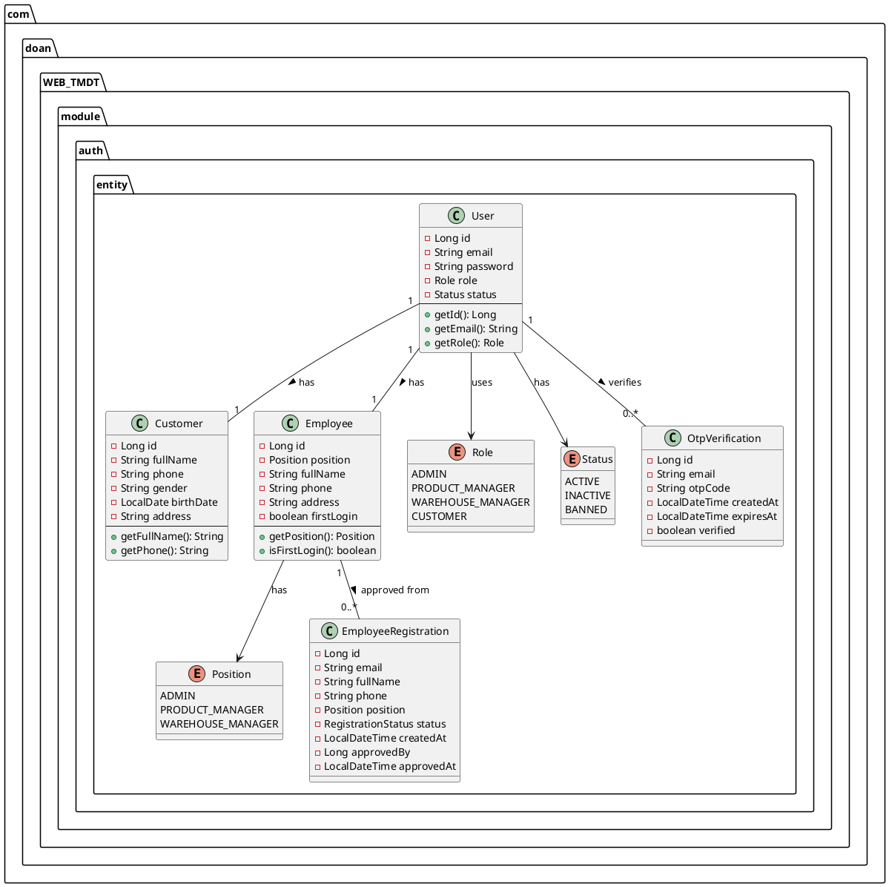

## 2. Class Diagram - Product & Inventory Module

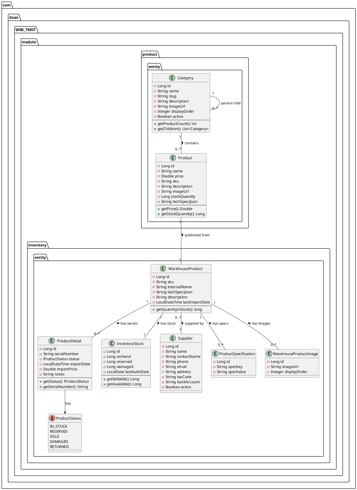

## 3. Class Diagram - Order & Payment Module

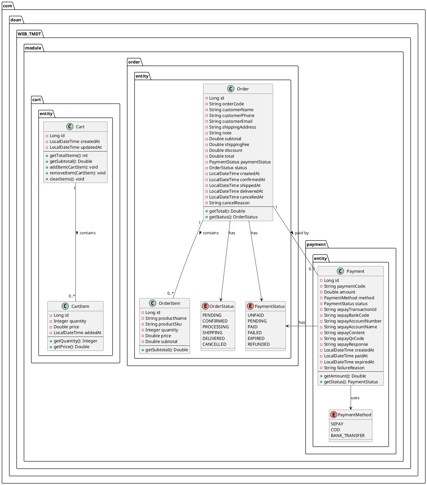

## 4. Sequence Diagram - User Login Flow

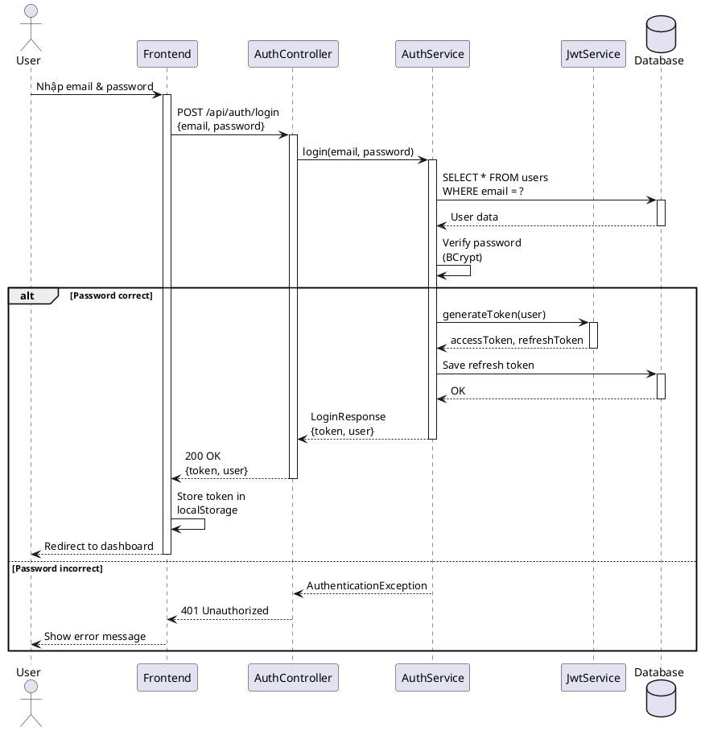

## 5. Sequence Diagram - Order & Payment Flow

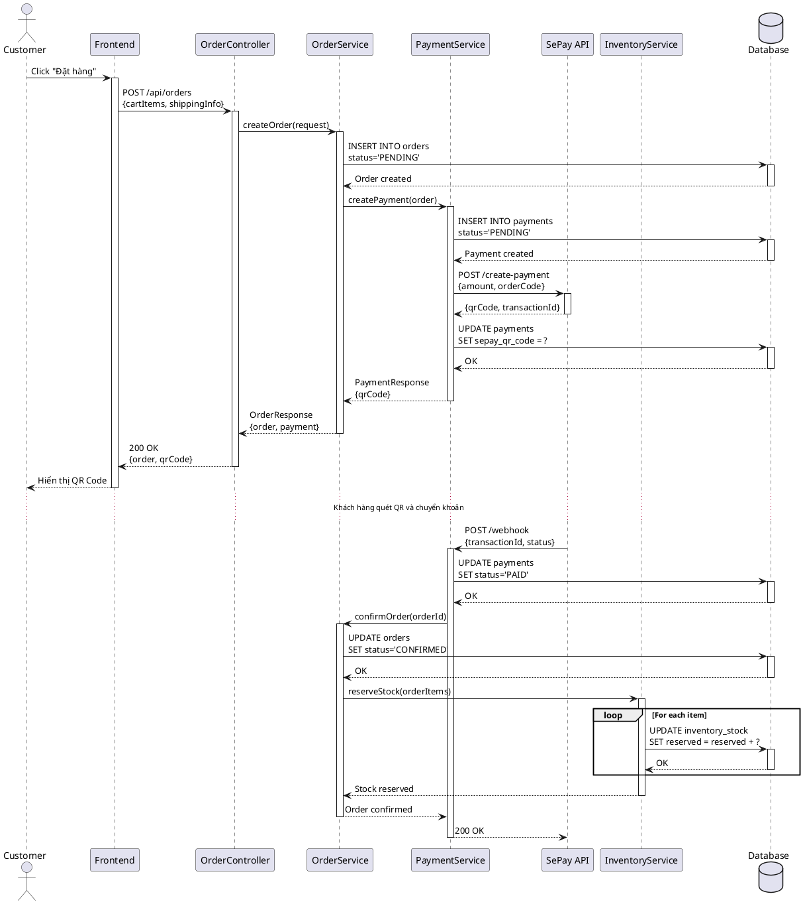

## 6. Sequence Diagram - Complete Purchase Order

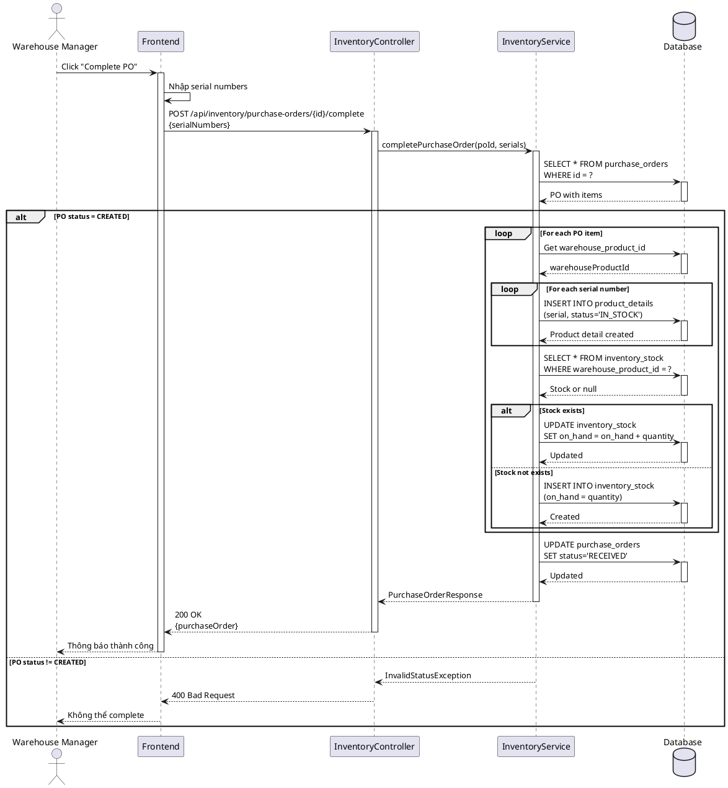

## 7. State Machine Diagram - Order Status

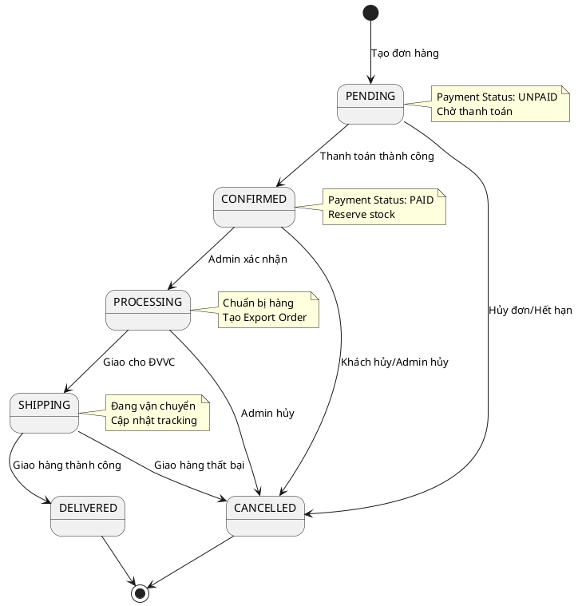

## 8. State Machine Diagram - Payment Status

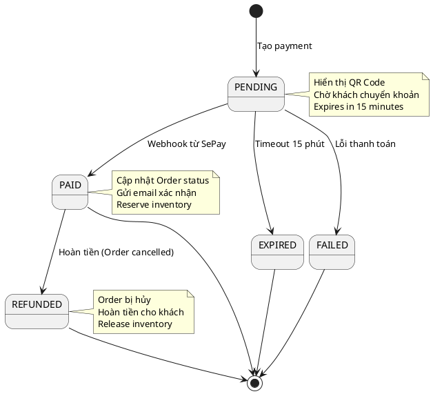

## 9. State Machine Diagram - Product Detail Status

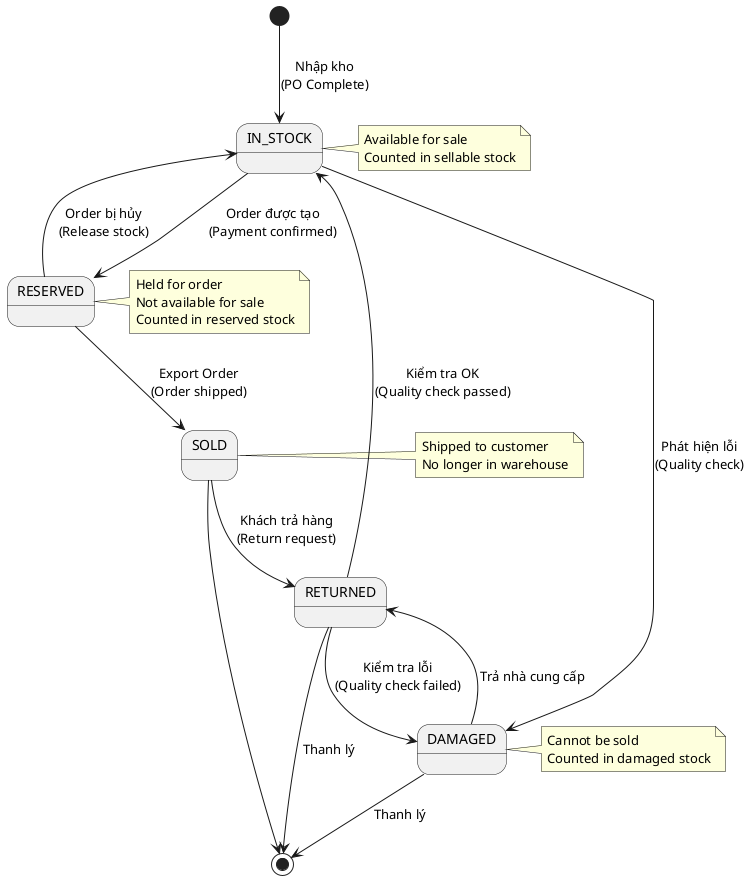

## 10. Use Case Diagram - Customer

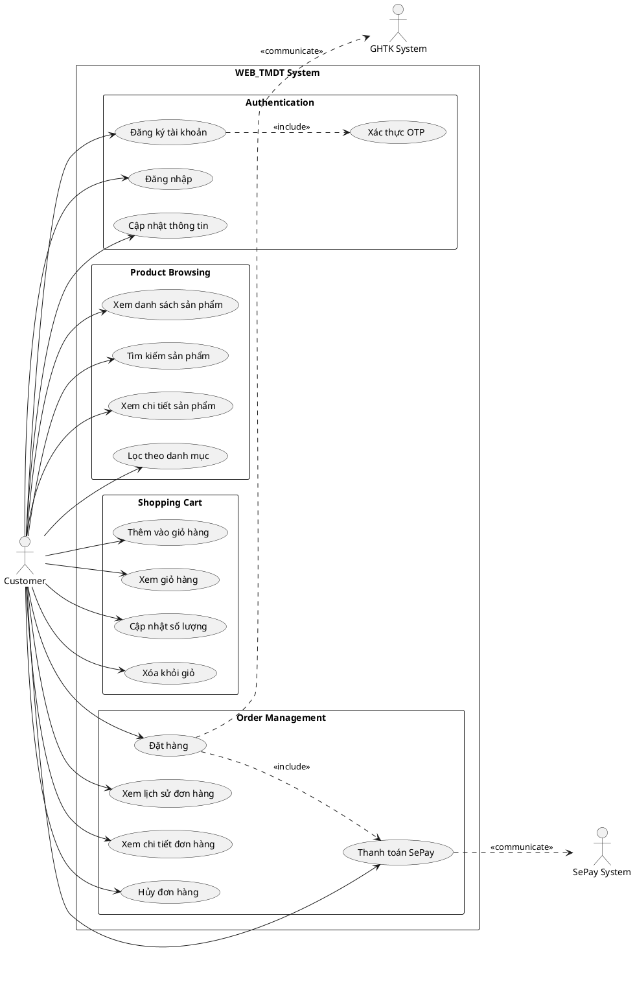

## 11. Use Case Diagram - Warehouse Manager

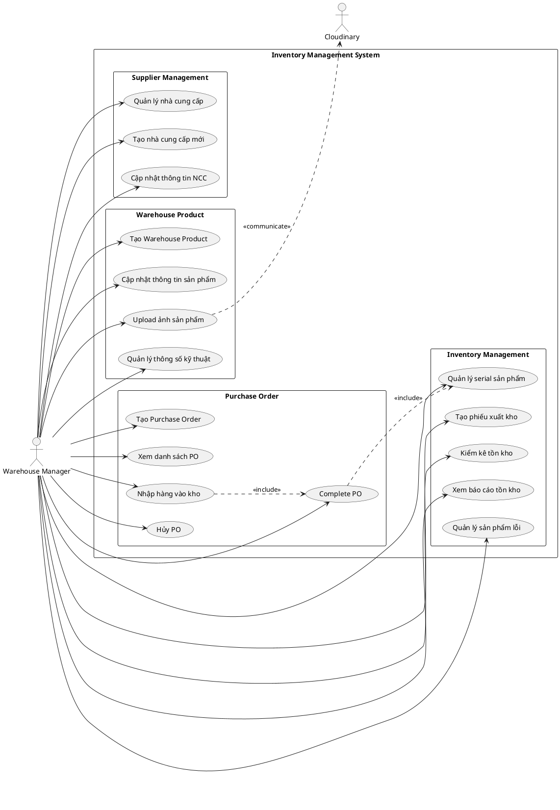

## 12. Use Case Diagram - Product Manager

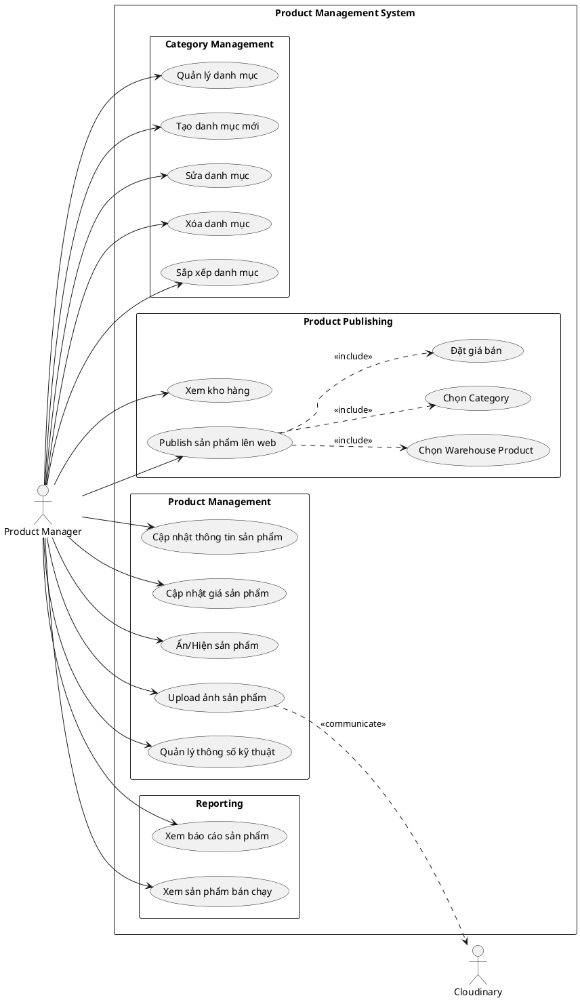

## 13. Component Diagram - Backend Architecture

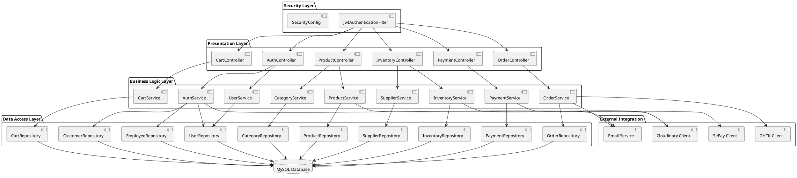

## 14. Deployment Diagram - Production Environment

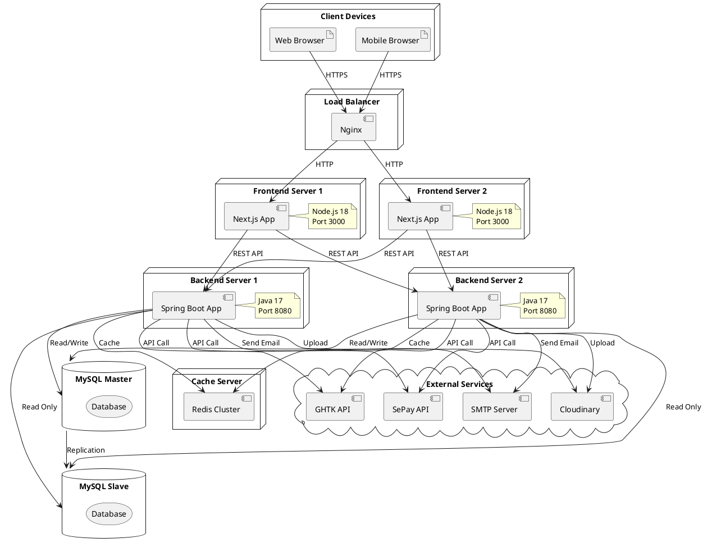

## 15. Activity Diagram - Complete Order Flow

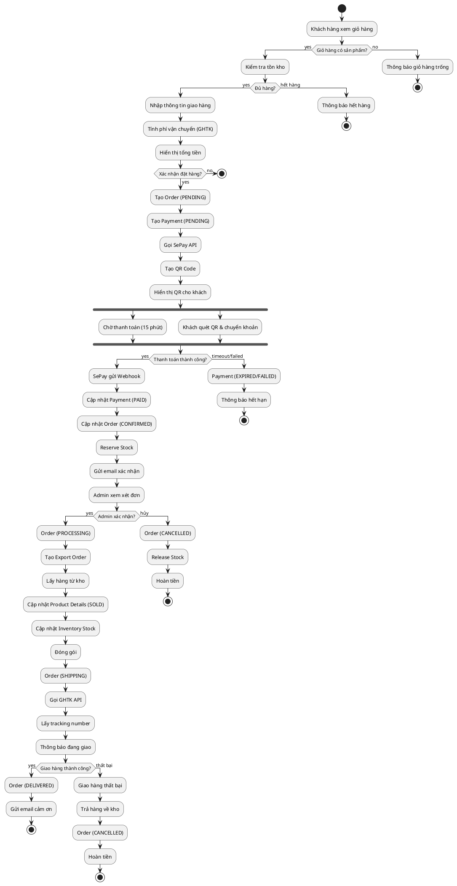

---

## Tổng Kết

File này chứa **15 sơ đồ UML chuẩn** sử dụng PlantUML:

### Class Diagrams (3)
1. Auth Module
2. Product & Inventory Module  
3. Order & Payment Module

### Sequence Diagrams (3)
4. User Login Flow
5. Order & Payment Flow
6. Complete Purchase Order

### State Machine Diagrams (3)
7. Order Status
8. Payment Status
9. Product Detail Status

### Use Case Diagrams (3)
10. Customer Use Cases
11. Warehouse Manager Use Cases
12. Product Manager Use Cases

### Component & Deployment (2)
13. Backend Component Diagram
14. Deployment Diagram

### Activity Diagram (1)
15. Complete Order Flow

Tất cả sơ đồ đều theo chuẩn UML 2.0 và có thể render bằng PlantUML.
