# Sequence Diagram - Module Kế Toán (Accounting Module)

## Tổng quan
Tài liệu này mô tả chi tiết các luồng nghiệp vụ kế toán từ góc nhìn người dùng (Frontend) tương tác với các layer Backend theo đúng code thực tế.

## Kiến trúc Backend
```
Frontend → Controller → Service → Repository → Entity (JPA/Hibernate) → Database
```

## Các Entity trong hệ thống
1. **FinancialTransaction** - Giao dịch tài chính
2. **AccountingPeriod** - Kỳ kế toán
3. **TaxReport** - Báo cáo thuế
4. **SupplierPayable** - Công nợ nhà cung cấp
5. **SupplierPayment** - Thanh toán cho nhà cung cấp
6. **PaymentReconciliation** - Đối soát thanh toán

## Các chức năng chính
1. Tổng quan kế toán (Dashboard)
2. Giao dịch tài chính (Financial Transactions)
3. Kỳ kế toán (Accounting Periods)
4. Quản lý thuế (Tax Management)
5. Báo cáo nâng cao (Advanced Reports)
6. Đối soát vận chuyển (Shipping Reconciliation)
7. Công nợ nhà cung cấp (Supplier Payables)

---

## 1. TỔNG QUAN KẾ TOÁN (Dashboard)

### Mô tả
Người dùng (Admin/Accountant) truy cập trang tổng quan để xem thống kê tài chính tổng hợp.

### Frontend: `/admin/accounting/page.tsx`

### Sequence Diagram

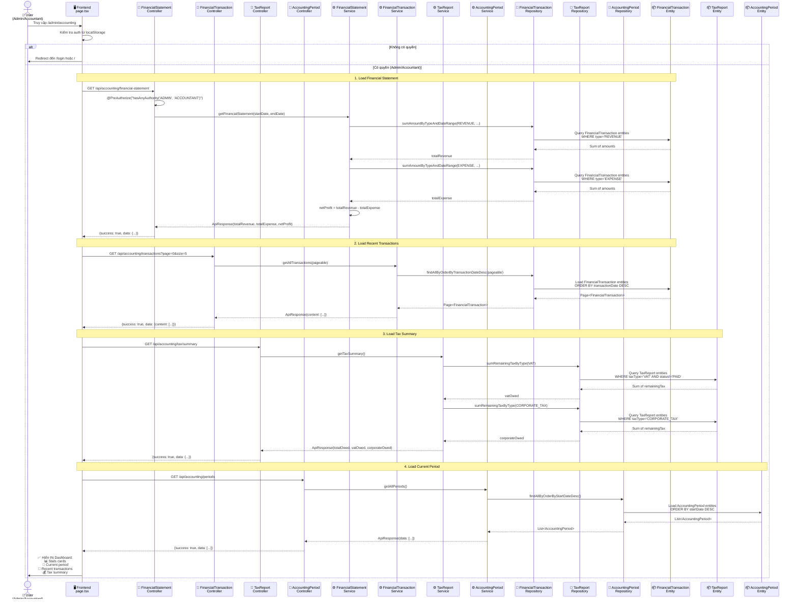
```mermaid
sequenceDiagram
    actor User as 👤 User<br/>(Admin/Accountant)
    participant FE as 🖥️ Frontend<br/>page.tsx
    participant API1 as 🔌 FinancialStatement<br/>Controller
    participant API2 as 🔌 FinancialTransaction<br/>Controller
    participant API3 as 🔌 TaxReport<br/>Controller
    participant API4 as 🔌 AccountingPeriod<br/>Controller
    participant S1 as ⚙️ FinancialStatement<br/>Service
    participant S2 as ⚙️ FinancialTransaction<br/>Service
    participant S3 as ⚙️ TaxReport<br/>Service
    participant S4 as ⚙️ AccountingPeriod<br/>Service
    participant R1 as 💾 FinancialTransaction<br/>Repository
    participant R2 as 💾 TaxReport<br/>Repository
    participant R3 as 💾 AccountingPeriod<br/>Repository
    participant E1 as 📦 FinancialTransaction<br/>Entity
    participant E2 as 📦 TaxReport<br/>Entity
    participant E3 as 📦 AccountingPeriod<br/>Entity
    
    User->>FE: Truy cập /admin/accounting
    FE->>FE: Kiểm tra auth từ localStorage
    
    alt Không có quyền
        FE->>User: Redirect đến /login hoặc /
    else Có quyền (Admin/Accountant)
        
        Note over FE,E1: 1. Load Financial Statement
        FE->>API1: GET /api/accounting/financial-statement
        API1->>API1: @PreAuthorize("hasAnyAuthority('ADMIN', 'ACCOUNTANT')")
        API1->>S1: getFinancialStatement(startDate, endDate)
        S1->>R1: sumAmountByTypeAndDateRange(REVENUE, ...)
        R1->>E1: Query FinancialTransaction entities<br/>WHERE type='REVENUE'
        E1-->>R1: Sum of amounts
        R1-->>S1: totalRevenue
        
        S1->>R1: sumAmountByTypeAndDateRange(EXPENSE, ...)
        R1->>E1: Query FinancialTransaction entities<br/>WHERE type='EXPENSE'
        E1-->>R1: Sum of amounts
        R1-->>S1: totalExpense
        
        S1->>S1: netProfit = totalRevenue - totalExpense
        S1-->>API1: ApiResponse(totalRevenue, totalExpense, netProfit)
        API1-->>FE: {success: true, data: {...}}
        
        Note over FE,E1: 2. Load Recent Transactions
        FE->>API2: GET /api/accounting/transactions?page=0&size=5
        API2->>S2: getAllTransactions(pageable)
        S2->>R1: findAllByOrderByTransactionDateDesc(pageable)
        R1->>E1: Load FinancialTransaction entities<br/>ORDER BY transactionDate DESC
        E1-->>R1: Page<FinancialTransaction>
        R1-->>S2: Page<FinancialTransaction>
        S2-->>API2: ApiResponse(content: [...])
        API2-->>FE: {success: true, data: {content: [...]}}
        
        Note over FE,E2: 3. Load Tax Summary
        FE->>API3: GET /api/accounting/tax/summary
        API3->>S3: getTaxSummary()
        S3->>R2: sumRemainingTaxByType(VAT)
        R2->>E2: Query TaxReport entities<br/>WHERE taxType='VAT' AND status!='PAID'
        E2-->>R2: Sum of remainingTax
        R2-->>S3: vatOwed
        
        S3->>R2: sumRemainingTaxByType(CORPORATE_TAX)
        R2->>E2: Query TaxReport entities<br/>WHERE taxType='CORPORATE_TAX'
        E2-->>R2: Sum of remainingTax
        R2-->>S3: corporateOwed
        
        S3-->>API3: ApiResponse(totalOwed, vatOwed, corporateOwed)
        API3-->>FE: {success: true, data: {...}}
        
        Note over FE,E3: 4. Load Current Period
        FE->>API4: GET /api/accounting/periods
        API4->>S4: getAllPeriods()
        S4->>R3: findAllByOrderByStartDateDesc()
        R3->>E3: Load AccountingPeriod entities<br/>ORDER BY startDate DESC
        E3-->>R3: List<AccountingPeriod>
        R3-->>S4: List<AccountingPeriod>
        S4-->>API4: ApiResponse(data: [...])
        API4-->>FE: {success: true, data: [...]}
        
        FE->>User: ✅ Hiển thị Dashboard:<br/>📊 Stats cards<br/>📅 Current period<br/>📝 Recent transactions<br/>💰 Tax summary
    end
```

---


## 2. GIAO DỊCH TÀI CHÍNH (Financial Transactions)

### 2.1 Xem danh sách giao dịch

**Frontend**: `/admin/accounting/transactions/page.tsx`  
**Controller**: `FinancialTransactionController`  
**Service**: `FinancialTransactionService`  
**Repository**: `FinancialTransactionRepository`  
**Entity**: `FinancialTransaction`

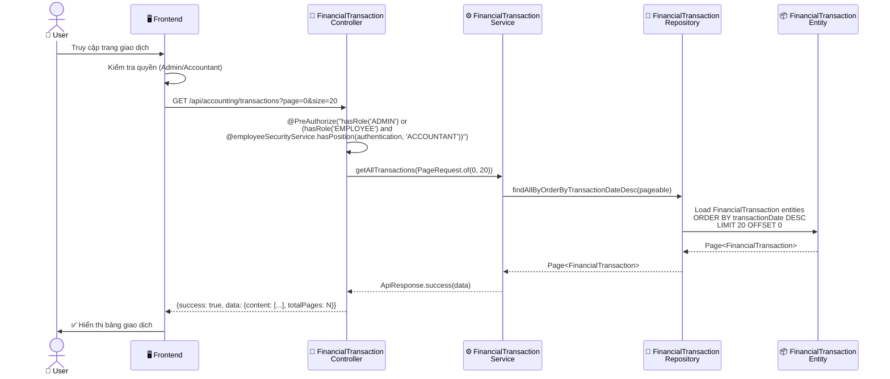
```mermaid
sequenceDiagram
    actor User as 👤 User
    participant FE as 🖥️ Frontend
    participant Ctrl as 🔌 FinancialTransaction<br/>Controller
    participant Svc as ⚙️ FinancialTransaction<br/>Service
    participant Repo as 💾 FinancialTransaction<br/>Repository
    participant Entity as 📦 FinancialTransaction<br/>Entity
    
    User->>FE: Truy cập trang giao dịch
    FE->>FE: Kiểm tra quyền (Admin/Accountant)
    
    FE->>Ctrl: GET /api/accounting/transactions?page=0&size=20
    Ctrl->>Ctrl: @PreAuthorize("hasRole('ADMIN') or<br/>(hasRole('EMPLOYEE') and<br/>@employeeSecurityService.hasPosition(authentication, 'ACCOUNTANT'))")
    Ctrl->>Svc: getAllTransactions(PageRequest.of(0, 20))
    Svc->>Repo: findAllByOrderByTransactionDateDesc(pageable)
    Repo->>Entity: Load FinancialTransaction entities<br/>ORDER BY transactionDate DESC<br/>LIMIT 20 OFFSET 0
    Entity-->>Repo: Page<FinancialTransaction>
    Repo-->>Svc: Page<FinancialTransaction>
    Svc-->>Ctrl: ApiResponse.success(data)
    Ctrl-->>FE: {success: true, data: {content: [...], totalPages: N}}
    
    FE->>User: ✅ Hiển thị bảng giao dịch
```

### 2.2 Tìm kiếm giao dịch theo khoảng thời gian

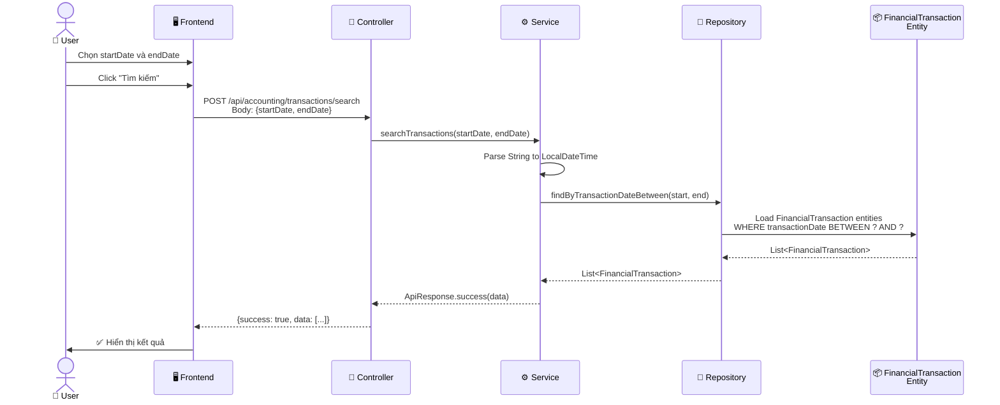
```mermaid
sequenceDiagram
    actor User as 👤 User
    participant FE as 🖥️ Frontend
    participant Ctrl as 🔌 Controller
    participant Svc as ⚙️ Service
    participant Repo as 💾 Repository
    participant Entity as 📦 FinancialTransaction<br/>Entity
    
    User->>FE: Chọn startDate và endDate
    User->>FE: Click "Tìm kiếm"
    
    FE->>Ctrl: POST /api/accounting/transactions/search<br/>Body: {startDate, endDate}
    Ctrl->>Svc: searchTransactions(startDate, endDate)
    Svc->>Svc: Parse String to LocalDateTime
    Svc->>Repo: findByTransactionDateBetween(start, end)
    Repo->>Entity: Load FinancialTransaction entities<br/>WHERE transactionDate BETWEEN ? AND ?
    Entity-->>Repo: List<FinancialTransaction>
    Repo-->>Svc: List<FinancialTransaction>
    Svc-->>Ctrl: ApiResponse.success(data)
    Ctrl-->>FE: {success: true, data: [...]}
    
    FE->>User: ✅ Hiển thị kết quả
```

### 2.3 Tạo giao dịch mới

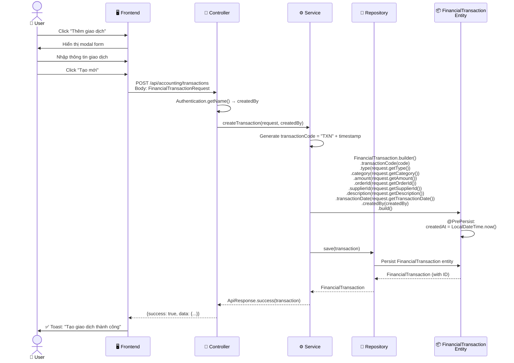
```mermaid
sequenceDiagram
    actor User as 👤 User
    participant FE as 🖥️ Frontend
    participant Ctrl as 🔌 Controller
    participant Svc as ⚙️ Service
    participant Repo as 💾 Repository
    participant Entity as 📦 FinancialTransaction<br/>Entity
    
    User->>FE: Click "Thêm giao dịch"
    FE->>User: Hiển thị modal form
    
    User->>FE: Nhập thông tin giao dịch
    User->>FE: Click "Tạo mới"
    
    FE->>Ctrl: POST /api/accounting/transactions<br/>Body: FinancialTransactionRequest
    Ctrl->>Ctrl: Authentication.getName() → createdBy
    Ctrl->>Svc: createTransaction(request, createdBy)
    
    Svc->>Svc: Generate transactionCode = "TXN" + timestamp
    Svc->>Entity: FinancialTransaction.builder()<br/>.transactionCode(code)<br/>.type(request.getType())<br/>.category(request.getCategory())<br/>.amount(request.getAmount())<br/>.orderId(request.getOrderId())<br/>.supplierId(request.getSupplierId())<br/>.description(request.getDescription())<br/>.transactionDate(request.getTransactionDate())<br/>.createdBy(createdBy)<br/>.build()
    Entity->>Entity: @PrePersist:<br/>createdAt = LocalDateTime.now()
    
    Svc->>Repo: save(transaction)
    Repo->>Entity: Persist FinancialTransaction entity
    Entity-->>Repo: FinancialTransaction (with ID)
    Repo-->>Svc: FinancialTransaction
    Svc-->>Ctrl: ApiResponse.success(transaction)
    Ctrl-->>FE: {success: true, data: {...}}
    
    FE->>User: ✅ Toast: "Tạo giao dịch thành công"
```

### 2.4 Cập nhật giao dịch

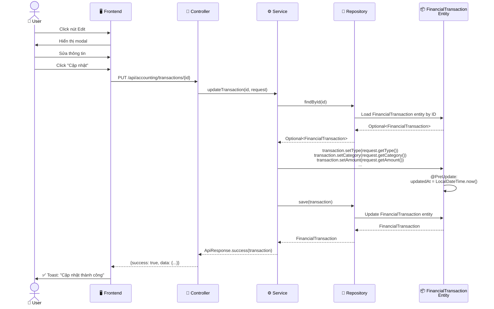
```mermaid
sequenceDiagram
    actor User as 👤 User
    participant FE as 🖥️ Frontend
    participant Ctrl as 🔌 Controller
    participant Svc as ⚙️ Service
    participant Repo as 💾 Repository
    participant Entity as 📦 FinancialTransaction<br/>Entity
    
    User->>FE: Click nút Edit
    FE->>User: Hiển thị modal
    User->>FE: Sửa thông tin
    User->>FE: Click "Cập nhật"
    
    FE->>Ctrl: PUT /api/accounting/transactions/{id}
    Ctrl->>Svc: updateTransaction(id, request)
    Svc->>Repo: findById(id)
    Repo->>Entity: Load FinancialTransaction entity by ID
    Entity-->>Repo: Optional<FinancialTransaction>
    Repo-->>Svc: Optional<FinancialTransaction>
    
    Svc->>Entity: transaction.setType(request.getType())<br/>transaction.setCategory(request.getCategory())<br/>transaction.setAmount(request.getAmount())<br/>...
    Entity->>Entity: @PreUpdate:<br/>updatedAt = LocalDateTime.now()
    
    Svc->>Repo: save(transaction)
    Repo->>Entity: Update FinancialTransaction entity
    Entity-->>Repo: FinancialTransaction
    Repo-->>Svc: FinancialTransaction
    Svc-->>Ctrl: ApiResponse.success(transaction)
    Ctrl-->>FE: {success: true, data: {...}}
    
    FE->>User: ✅ Toast: "Cập nhật thành công"
```

### 2.5 Xóa giao dịch

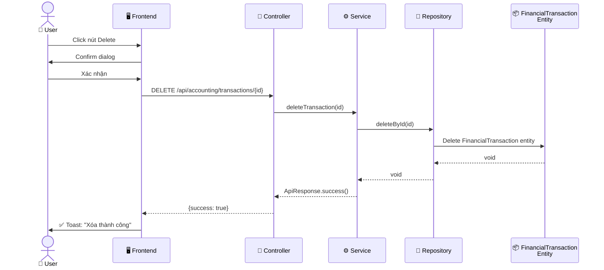
```mermaid
sequenceDiagram
    actor User as 👤 User
    participant FE as 🖥️ Frontend
    participant Ctrl as 🔌 Controller
    participant Svc as ⚙️ Service
    participant Repo as 💾 Repository
    participant Entity as 📦 FinancialTransaction<br/>Entity
    
    User->>FE: Click nút Delete
    FE->>User: Confirm dialog
    User->>FE: Xác nhận
    
    FE->>Ctrl: DELETE /api/accounting/transactions/{id}
    Ctrl->>Svc: deleteTransaction(id)
    Svc->>Repo: deleteById(id)
    Repo->>Entity: Delete FinancialTransaction entity
    Entity-->>Repo: void
    Repo-->>Svc: void
    Svc-->>Ctrl: ApiResponse.success()
    Ctrl-->>FE: {success: true}
    
    FE->>User: ✅ Toast: "Xóa thành công"
```

### Entity: FinancialTransaction

```java
@Entity
@Table(name = "financial_transactions")
public class FinancialTransaction {
    @Id
    @GeneratedValue(strategy = GenerationType.IDENTITY)
    private Long id;
    
    @Column(nullable = false, unique = true)
    private String transactionCode;
    
    @Enumerated(EnumType.STRING)
    private TransactionType type; // REVENUE, EXPENSE, REFUND
    
    @Enumerated(EnumType.STRING)
    private TransactionCategory category; // SALES, SHIPPING, PAYMENT_FEE, TAX, etc.
    
    private Double amount;
    private Long orderId;
    private Long supplierId;
    private String description;
    private LocalDateTime transactionDate;
    private String createdBy;
    private LocalDateTime createdAt;
    private LocalDateTime updatedAt;
    
    @PrePersist
    protected void onCreate() {
        createdAt = LocalDateTime.now();
    }
    
    @PreUpdate
    protected void onUpdate() {
        updatedAt = LocalDateTime.now();
    }
}
```

---


## 3. KỲ KẾ TOÁN (Accounting Periods)

### 3.1 Xem danh sách kỳ kế toán

**Frontend**: `/admin/accounting/periods/page.tsx`  
**Controller**: `AccountingPeriodController`  
**Service**: `AccountingPeriodService`  
**Repository**: `AccountingPeriodRepository`  
**Entity**: `AccountingPeriod`

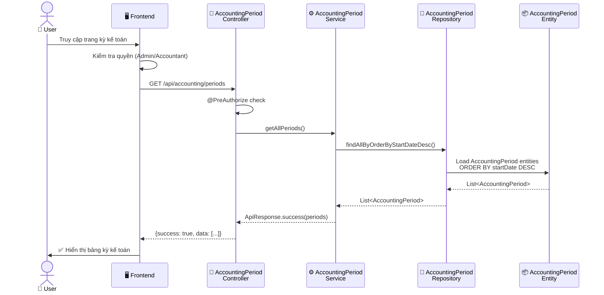
```mermaid
sequenceDiagram
    actor User as 👤 User
    participant FE as 🖥️ Frontend
    participant Ctrl as 🔌 AccountingPeriod<br/>Controller
    participant Svc as ⚙️ AccountingPeriod<br/>Service
    participant Repo as 💾 AccountingPeriod<br/>Repository
    participant Entity as 📦 AccountingPeriod<br/>Entity
    
    User->>FE: Truy cập trang kỳ kế toán
    FE->>FE: Kiểm tra quyền (Admin/Accountant)
    
    FE->>Ctrl: GET /api/accounting/periods
    Ctrl->>Ctrl: @PreAuthorize check
    Ctrl->>Svc: getAllPeriods()
    Svc->>Repo: findAllByOrderByStartDateDesc()
    Repo->>Entity: Load AccountingPeriod entities<br/>ORDER BY startDate DESC
    Entity-->>Repo: List<AccountingPeriod>
    Repo-->>Svc: List<AccountingPeriod>
    Svc-->>Ctrl: ApiResponse.success(periods)
    Ctrl-->>FE: {success: true, data: [...]}
    
    FE->>User: ✅ Hiển thị bảng kỳ kế toán
```

### 3.2 Tạo kỳ kế toán mới

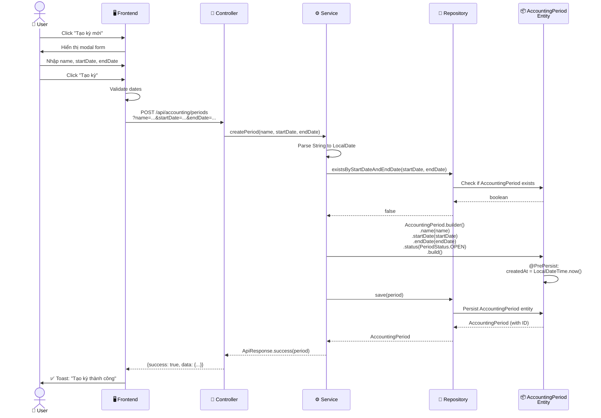
```mermaid
sequenceDiagram
    actor User as 👤 User
    participant FE as 🖥️ Frontend
    participant Ctrl as 🔌 Controller
    participant Svc as ⚙️ Service
    participant Repo as 💾 Repository
    participant Entity as 📦 AccountingPeriod<br/>Entity
    
    User->>FE: Click "Tạo kỳ mới"
    FE->>User: Hiển thị modal form
    
    User->>FE: Nhập name, startDate, endDate
    User->>FE: Click "Tạo kỳ"
    
    FE->>FE: Validate dates
    FE->>Ctrl: POST /api/accounting/periods<br/>?name=...&startDate=...&endDate=...
    Ctrl->>Svc: createPeriod(name, startDate, endDate)
    Svc->>Svc: Parse String to LocalDate
    Svc->>Repo: existsByStartDateAndEndDate(startDate, endDate)
    Repo->>Entity: Check if AccountingPeriod exists
    Entity-->>Repo: boolean
    Repo-->>Svc: false
    
    Svc->>Entity: AccountingPeriod.builder()<br/>.name(name)<br/>.startDate(startDate)<br/>.endDate(endDate)<br/>.status(PeriodStatus.OPEN)<br/>.build()
    Entity->>Entity: @PrePersist:<br/>createdAt = LocalDateTime.now()
    
    Svc->>Repo: save(period)
    Repo->>Entity: Persist AccountingPeriod entity
    Entity-->>Repo: AccountingPeriod (with ID)
    Repo-->>Svc: AccountingPeriod
    Svc-->>Ctrl: ApiResponse.success(period)
    Ctrl-->>FE: {success: true, data: {...}}
    
    FE->>User: ✅ Toast: "Tạo kỳ thành công"
```

### 3.3 Chốt kỳ kế toán

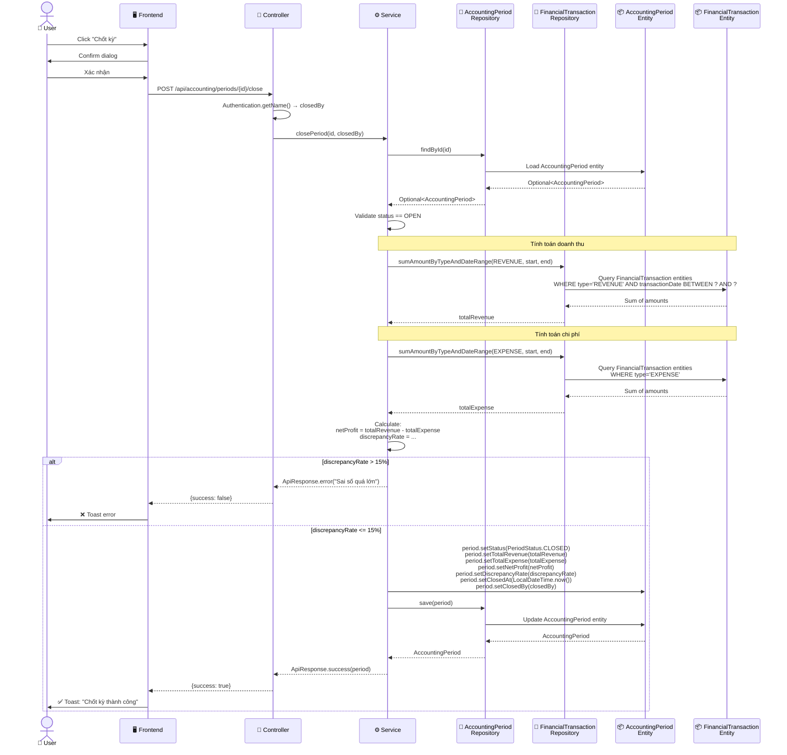
```mermaid
sequenceDiagram
    actor User as 👤 User
    participant FE as 🖥️ Frontend
    participant Ctrl as 🔌 Controller
    participant Svc as ⚙️ Service
    participant Repo1 as 💾 AccountingPeriod<br/>Repository
    participant Repo2 as 💾 FinancialTransaction<br/>Repository
    participant E1 as 📦 AccountingPeriod<br/>Entity
    participant E2 as 📦 FinancialTransaction<br/>Entity
    
    User->>FE: Click "Chốt kỳ"
    FE->>User: Confirm dialog
    User->>FE: Xác nhận
    
    FE->>Ctrl: POST /api/accounting/periods/{id}/close
    Ctrl->>Ctrl: Authentication.getName() → closedBy
    Ctrl->>Svc: closePeriod(id, closedBy)
    
    Svc->>Repo1: findById(id)
    Repo1->>E1: Load AccountingPeriod entity
    E1-->>Repo1: Optional<AccountingPeriod>
    Repo1-->>Svc: Optional<AccountingPeriod>
    
    Svc->>Svc: Validate status == OPEN
    
    Note over Svc,E2: Tính toán doanh thu
    Svc->>Repo2: sumAmountByTypeAndDateRange(REVENUE, start, end)
    Repo2->>E2: Query FinancialTransaction entities<br/>WHERE type='REVENUE' AND transactionDate BETWEEN ? AND ?
    E2-->>Repo2: Sum of amounts
    Repo2-->>Svc: totalRevenue
    
    Note over Svc,E2: Tính toán chi phí
    Svc->>Repo2: sumAmountByTypeAndDateRange(EXPENSE, start, end)
    Repo2->>E2: Query FinancialTransaction entities<br/>WHERE type='EXPENSE'
    E2-->>Repo2: Sum of amounts
    Repo2-->>Svc: totalExpense
    
    Svc->>Svc: Calculate:<br/>netProfit = totalRevenue - totalExpense<br/>discrepancyRate = ...
    
    alt discrepancyRate > 15%
        Svc-->>Ctrl: ApiResponse.error("Sai số quá lớn")
        Ctrl-->>FE: {success: false}
        FE->>User: ❌ Toast error
    else discrepancyRate <= 15%
        Svc->>E1: period.setStatus(PeriodStatus.CLOSED)<br/>period.setTotalRevenue(totalRevenue)<br/>period.setTotalExpense(totalExpense)<br/>period.setNetProfit(netProfit)<br/>period.setDiscrepancyRate(discrepancyRate)<br/>period.setClosedAt(LocalDateTime.now())<br/>period.setClosedBy(closedBy)
        
        Svc->>Repo1: save(period)
        Repo1->>E1: Update AccountingPeriod entity
        E1-->>Repo1: AccountingPeriod
        Repo1-->>Svc: AccountingPeriod
        Svc-->>Ctrl: ApiResponse.success(period)
        Ctrl-->>FE: {success: true}
        
        FE->>User: ✅ Toast: "Chốt kỳ thành công"
    end
```

### 3.4 Mở khóa kỳ kế toán (Chỉ Admin)

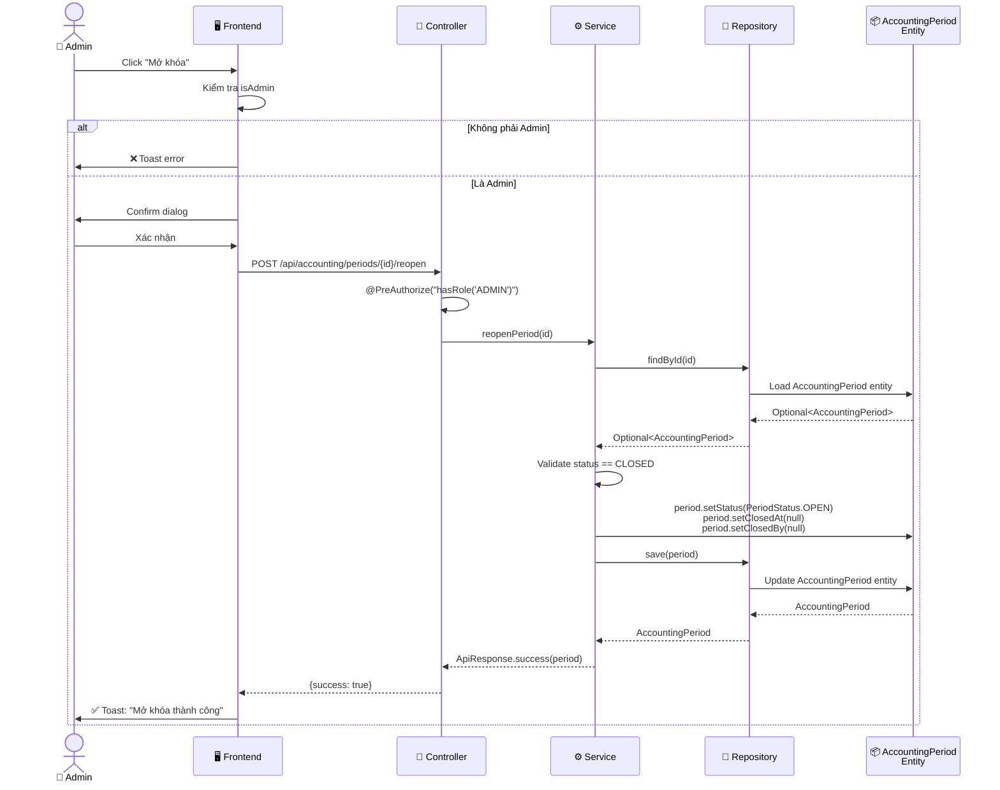
```mermaid
sequenceDiagram
    actor User as 👤 Admin
    participant FE as 🖥️ Frontend
    participant Ctrl as 🔌 Controller
    participant Svc as ⚙️ Service
    participant Repo as 💾 Repository
    participant Entity as 📦 AccountingPeriod<br/>Entity
    
    User->>FE: Click "Mở khóa"
    FE->>FE: Kiểm tra isAdmin
    
    alt Không phải Admin
        FE->>User: ❌ Toast error
    else Là Admin
        FE->>User: Confirm dialog
        User->>FE: Xác nhận
        
        FE->>Ctrl: POST /api/accounting/periods/{id}/reopen
        Ctrl->>Ctrl: @PreAuthorize("hasRole('ADMIN')")
        Ctrl->>Svc: reopenPeriod(id)
        
        Svc->>Repo: findById(id)
        Repo->>Entity: Load AccountingPeriod entity
        Entity-->>Repo: Optional<AccountingPeriod>
        Repo-->>Svc: Optional<AccountingPeriod>
        
        Svc->>Svc: Validate status == CLOSED
        Svc->>Entity: period.setStatus(PeriodStatus.OPEN)<br/>period.setClosedAt(null)<br/>period.setClosedBy(null)
        
        Svc->>Repo: save(period)
        Repo->>Entity: Update AccountingPeriod entity
        Entity-->>Repo: AccountingPeriod
        Repo-->>Svc: AccountingPeriod
        Svc-->>Ctrl: ApiResponse.success(period)
        Ctrl-->>FE: {success: true}
        
        FE->>User: ✅ Toast: "Mở khóa thành công"
    end
```

### Entity: AccountingPeriod

```java
@Entity
@Table(name = "accounting_periods")
public class AccountingPeriod {
    @Id
    @GeneratedValue(strategy = GenerationType.IDENTITY)
    private Long id;
    
    @Column(nullable = false)
    private String name;
    
    @Column(nullable = false)
    private LocalDate startDate;
    
    @Column(nullable = false)
    private LocalDate endDate;
    
    @Enumerated(EnumType.STRING)
    @Column(nullable = false)
    private PeriodStatus status; // OPEN, CLOSED
    
    private Double totalRevenue;
    private Double totalExpense;
    private Double netProfit;
    private Double discrepancyRate;
    
    private LocalDateTime closedAt;
    private String closedBy;
    private LocalDateTime createdAt;
    
    @PrePersist
    protected void onCreate() {
        createdAt = LocalDateTime.now();
    }
}
```

---


## 4. QUẢN LÝ THUẾ (Tax Management)

### 4.1 Xem tổng quan thuế

**Frontend**: `/admin/accounting/tax/page.tsx`  
**Controller**: `TaxReportController`  
**Service**: `TaxReportService`  
**Repository**: `TaxReportRepository`  
**Entity**: `TaxReport`

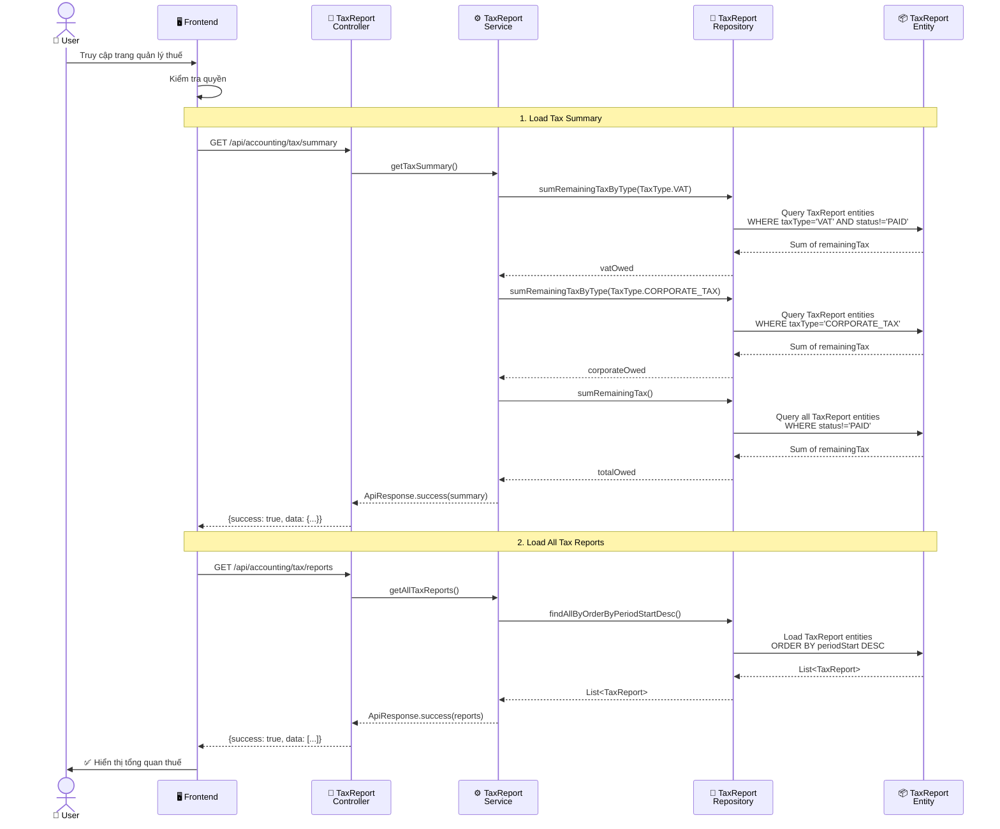
```mermaid
sequenceDiagram
    actor User as 👤 User
    participant FE as 🖥️ Frontend
    participant Ctrl as 🔌 TaxReport<br/>Controller
    participant Svc as ⚙️ TaxReport<br/>Service
    participant Repo as 💾 TaxReport<br/>Repository
    participant Entity as 📦 TaxReport<br/>Entity
    
    User->>FE: Truy cập trang quản lý thuế
    FE->>FE: Kiểm tra quyền
    
    Note over FE,Entity: 1. Load Tax Summary
    FE->>Ctrl: GET /api/accounting/tax/summary
    Ctrl->>Svc: getTaxSummary()
    
    Svc->>Repo: sumRemainingTaxByType(TaxType.VAT)
    Repo->>Entity: Query TaxReport entities<br/>WHERE taxType='VAT' AND status!='PAID'
    Entity-->>Repo: Sum of remainingTax
    Repo-->>Svc: vatOwed
    
    Svc->>Repo: sumRemainingTaxByType(TaxType.CORPORATE_TAX)
    Repo->>Entity: Query TaxReport entities<br/>WHERE taxType='CORPORATE_TAX'
    Entity-->>Repo: Sum of remainingTax
    Repo-->>Svc: corporateOwed
    
    Svc->>Repo: sumRemainingTax()
    Repo->>Entity: Query all TaxReport entities<br/>WHERE status!='PAID'
    Entity-->>Repo: Sum of remainingTax
    Repo-->>Svc: totalOwed
    
    Svc-->>Ctrl: ApiResponse.success(summary)
    Ctrl-->>FE: {success: true, data: {...}}
    
    Note over FE,Entity: 2. Load All Tax Reports
    FE->>Ctrl: GET /api/accounting/tax/reports
    Ctrl->>Svc: getAllTaxReports()
    Svc->>Repo: findAllByOrderByPeriodStartDesc()
    Repo->>Entity: Load TaxReport entities<br/>ORDER BY periodStart DESC
    Entity-->>Repo: List<TaxReport>
    Repo-->>Svc: List<TaxReport>
    Svc-->>Ctrl: ApiResponse.success(reports)
    Ctrl-->>FE: {success: true, data: [...]}
    
    FE->>User: ✅ Hiển thị tổng quan thuế
```

### 4.2 Tạo báo cáo thuế mới

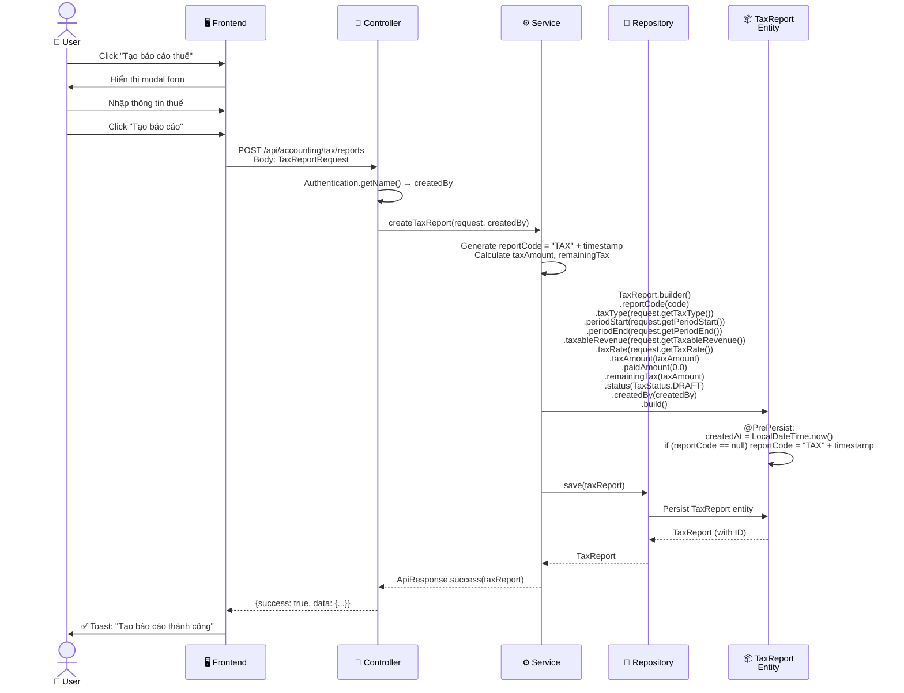
```mermaid
sequenceDiagram
    actor User as 👤 User
    participant FE as 🖥️ Frontend
    participant Ctrl as 🔌 Controller
    participant Svc as ⚙️ Service
    participant Repo as 💾 Repository
    participant Entity as 📦 TaxReport<br/>Entity
    
    User->>FE: Click "Tạo báo cáo thuế"
    FE->>User: Hiển thị modal form
    
    User->>FE: Nhập thông tin thuế
    User->>FE: Click "Tạo báo cáo"
    
    FE->>Ctrl: POST /api/accounting/tax/reports<br/>Body: TaxReportRequest
    Ctrl->>Ctrl: Authentication.getName() → createdBy
    Ctrl->>Svc: createTaxReport(request, createdBy)
    
    Svc->>Svc: Generate reportCode = "TAX" + timestamp<br/>Calculate taxAmount, remainingTax
    
    Svc->>Entity: TaxReport.builder()<br/>.reportCode(code)<br/>.taxType(request.getTaxType())<br/>.periodStart(request.getPeriodStart())<br/>.periodEnd(request.getPeriodEnd())<br/>.taxableRevenue(request.getTaxableRevenue())<br/>.taxRate(request.getTaxRate())<br/>.taxAmount(taxAmount)<br/>.paidAmount(0.0)<br/>.remainingTax(taxAmount)<br/>.status(TaxStatus.DRAFT)<br/>.createdBy(createdBy)<br/>.build()
    Entity->>Entity: @PrePersist:<br/>createdAt = LocalDateTime.now()<br/>if (reportCode == null) reportCode = "TAX" + timestamp
    
    Svc->>Repo: save(taxReport)
    Repo->>Entity: Persist TaxReport entity
    Entity-->>Repo: TaxReport (with ID)
    Repo-->>Svc: TaxReport
    Svc-->>Ctrl: ApiResponse.success(taxReport)
    Ctrl-->>FE: {success: true, data: {...}}
    
    FE->>User: ✅ Toast: "Tạo báo cáo thành công"
```

### 4.3 Nộp báo cáo thuế

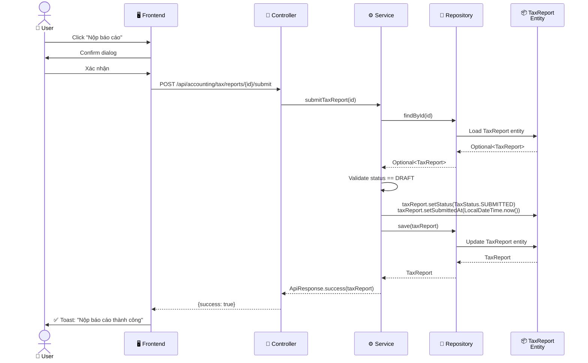
```mermaid
sequenceDiagram
    actor User as 👤 User
    participant FE as 🖥️ Frontend
    participant Ctrl as 🔌 Controller
    participant Svc as ⚙️ Service
    participant Repo as 💾 Repository
    participant Entity as 📦 TaxReport<br/>Entity
    
    User->>FE: Click "Nộp báo cáo"
    FE->>User: Confirm dialog
    User->>FE: Xác nhận
    
    FE->>Ctrl: POST /api/accounting/tax/reports/{id}/submit
    Ctrl->>Svc: submitTaxReport(id)
    
    Svc->>Repo: findById(id)
    Repo->>Entity: Load TaxReport entity
    Entity-->>Repo: Optional<TaxReport>
    Repo-->>Svc: Optional<TaxReport>
    
    Svc->>Svc: Validate status == DRAFT
    Svc->>Entity: taxReport.setStatus(TaxStatus.SUBMITTED)<br/>taxReport.setSubmittedAt(LocalDateTime.now())
    
    Svc->>Repo: save(taxReport)
    Repo->>Entity: Update TaxReport entity
    Entity-->>Repo: TaxReport
    Repo-->>Svc: TaxReport
    Svc-->>Ctrl: ApiResponse.success(taxReport)
    Ctrl-->>FE: {success: true}
    
    FE->>User: ✅ Toast: "Nộp báo cáo thành công"
```

### 4.4 Đánh dấu đã thanh toán thuế

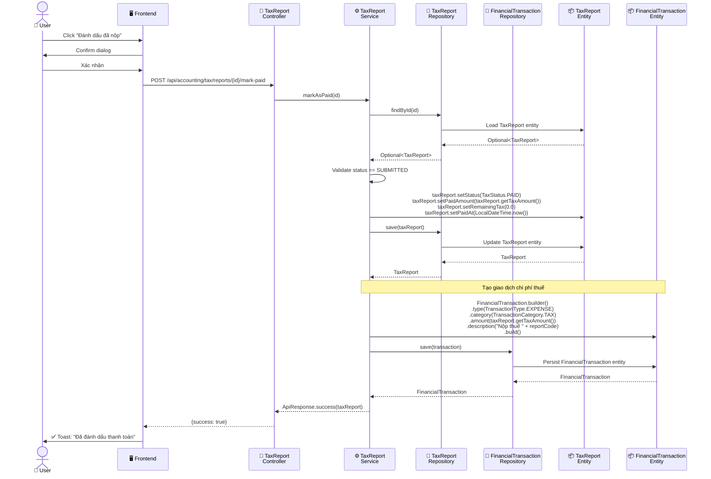
```mermaid
sequenceDiagram
    actor User as 👤 User
    participant FE as 🖥️ Frontend
    participant Ctrl as 🔌 TaxReport<br/>Controller
    participant Svc as ⚙️ TaxReport<br/>Service
    participant Repo1 as 💾 TaxReport<br/>Repository
    participant Repo2 as 💾 FinancialTransaction<br/>Repository
    participant E1 as 📦 TaxReport<br/>Entity
    participant E2 as 📦 FinancialTransaction<br/>Entity
    
    User->>FE: Click "Đánh dấu đã nộp"
    FE->>User: Confirm dialog
    User->>FE: Xác nhận
    
    FE->>Ctrl: POST /api/accounting/tax/reports/{id}/mark-paid
    Ctrl->>Svc: markAsPaid(id)
    
    Svc->>Repo1: findById(id)
    Repo1->>E1: Load TaxReport entity
    E1-->>Repo1: Optional<TaxReport>
    Repo1-->>Svc: Optional<TaxReport>
    
    Svc->>Svc: Validate status == SUBMITTED
    Svc->>E1: taxReport.setStatus(TaxStatus.PAID)<br/>taxReport.setPaidAmount(taxReport.getTaxAmount())<br/>taxReport.setRemainingTax(0.0)<br/>taxReport.setPaidAt(LocalDateTime.now())
    
    Svc->>Repo1: save(taxReport)
    Repo1->>E1: Update TaxReport entity
    E1-->>Repo1: TaxReport
    Repo1-->>Svc: TaxReport
    
    Note over Svc,E2: Tạo giao dịch chi phí thuế
    Svc->>E2: FinancialTransaction.builder()<br/>.type(TransactionType.EXPENSE)<br/>.category(TransactionCategory.TAX)<br/>.amount(taxReport.getTaxAmount())<br/>.description("Nộp thuế " + reportCode)<br/>.build()
    
    Svc->>Repo2: save(transaction)
    Repo2->>E2: Persist FinancialTransaction entity
    E2-->>Repo2: FinancialTransaction
    Repo2-->>Svc: FinancialTransaction
    
    Svc-->>Ctrl: ApiResponse.success(taxReport)
    Ctrl-->>FE: {success: true}
    
    FE->>User: ✅ Toast: "Đã đánh dấu thanh toán"
```

### Entity: TaxReport

```java
@Entity
@Table(name = "tax_reports")
public class TaxReport {
    @Id
    @GeneratedValue(strategy = GenerationType.IDENTITY)
    private Long id;
    
    @Column(nullable = false, unique = true)
    private String reportCode;
    
    @Enumerated(EnumType.STRING)
    @Column(nullable = false)
    private TaxType taxType; // VAT, CORPORATE_TAX
    
    @Column(nullable = false)
    private LocalDate periodStart;
    
    @Column(nullable = false)
    private LocalDate periodEnd;
    
    private Double taxableRevenue;
    private Double taxRate;
    private Double taxAmount;
    private Double paidAmount;
    private Double remainingTax;
    
    @Enumerated(EnumType.STRING)
    @Column(nullable = false)
    private TaxStatus status; // DRAFT, SUBMITTED, PAID
    
    private LocalDateTime submittedAt;
    private LocalDateTime paidAt;
    private LocalDateTime createdAt;
    private String createdBy;
    
    @PrePersist
    protected void onCreate() {
        createdAt = LocalDateTime.now();
        if (reportCode == null) {
            reportCode = "TAX" + System.currentTimeMillis();
        }
        if (remainingTax == null && taxAmount != null && paidAmount != null) {
            remainingTax = taxAmount - paidAmount;
        }
    }
}
```

---


## 5. ĐỐI SOÁT VẬN CHUYỂN (Shipping Reconciliation)

### 5.1 Xem đối soát vận chuyển

**Frontend**: `/admin/accounting/shipping/page.tsx`  
**Controller**: `ShippingReconciliationController`  
**Service**: `ShippingReconciliationService`  
**Repository**: `OrderRepository`, `FinancialTransactionRepository`  
**Entity**: `Order`, `FinancialTransaction`

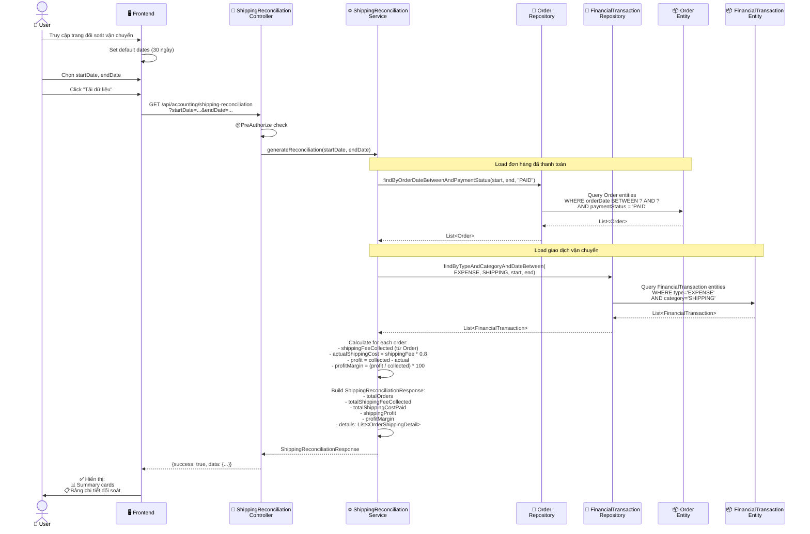
```mermaid
sequenceDiagram
    actor User as 👤 User
    participant FE as 🖥️ Frontend
    participant Ctrl as 🔌 ShippingReconciliation<br/>Controller
    participant Svc as ⚙️ ShippingReconciliation<br/>Service
    participant Repo1 as 💾 Order<br/>Repository
    participant Repo2 as 💾 FinancialTransaction<br/>Repository
    participant E1 as 📦 Order<br/>Entity
    participant E2 as 📦 FinancialTransaction<br/>Entity
    
    User->>FE: Truy cập trang đối soát vận chuyển
    FE->>FE: Set default dates (30 ngày)
    
    User->>FE: Chọn startDate, endDate
    User->>FE: Click "Tải dữ liệu"
    
    FE->>Ctrl: GET /api/accounting/shipping-reconciliation<br/>?startDate=...&endDate=...
    Ctrl->>Ctrl: @PreAuthorize check
    Ctrl->>Svc: generateReconciliation(startDate, endDate)
    
    Note over Svc,E1: Load đơn hàng đã thanh toán
    Svc->>Repo1: findByOrderDateBetweenAndPaymentStatus(start, end, "PAID")
    Repo1->>E1: Query Order entities<br/>WHERE orderDate BETWEEN ? AND ?<br/>AND paymentStatus = 'PAID'
    E1-->>Repo1: List<Order>
    Repo1-->>Svc: List<Order>
    
    Note over Svc,E2: Load giao dịch vận chuyển
    Svc->>Repo2: findByTypeAndCategoryAndDateBetween(<br/>EXPENSE, SHIPPING, start, end)
    Repo2->>E2: Query FinancialTransaction entities<br/>WHERE type='EXPENSE'<br/>AND category='SHIPPING'
    E2-->>Repo2: List<FinancialTransaction>
    Repo2-->>Svc: List<FinancialTransaction>
    
    Svc->>Svc: Calculate for each order:<br/>- shippingFeeCollected (từ Order)<br/>- actualShippingCost = shippingFee * 0.8<br/>- profit = collected - actual<br/>- profitMargin = (profit / collected) * 100
    
    Svc->>Svc: Build ShippingReconciliationResponse:<br/>- totalOrders<br/>- totalShippingFeeCollected<br/>- totalShippingCostPaid<br/>- shippingProfit<br/>- profitMargin<br/>- details: List<OrderShippingDetail>
    
    Svc-->>Ctrl: ShippingReconciliationResponse
    Ctrl-->>FE: {success: true, data: {...}}
    
    FE->>User: ✅ Hiển thị:<br/>📊 Summary cards<br/>📋 Bảng chi tiết đối soát
```

### Entities Involved

**Order Entity** (từ module order):
```java
@Entity
@Table(name = "orders")
public class Order {
    @Id
    private Long id;
    private LocalDateTime orderDate;
    private Double shippingFee; // Phí vận chuyển thu từ khách
    private String paymentStatus; // PAID, PENDING, etc.
    private String shippingAddress;
    // ...
}
```

**FinancialTransaction Entity**:
```java
@Entity
@Table(name = "financial_transactions")
public class FinancialTransaction {
    @Id
    private Long id;
    private TransactionType type; // EXPENSE
    private TransactionCategory category; // SHIPPING
    private Double amount; // Chi phí vận chuyển thực tế
    private LocalDateTime transactionDate;
    private Long orderId;
    // ...
}
```

---


## 6. CÔNG NỢ NHÀ CUNG CẤP (Supplier Payables)

### 6.1 Xem danh sách công nợ

**Frontend**: `/admin/accounting/payables/page.tsx`  
**Controller**: `SupplierPayableController`  
**Service**: `SupplierPayableService`  
**Repository**: `SupplierPayableRepository`  
**Entity**: `SupplierPayable`

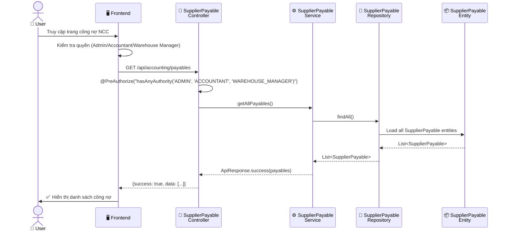
```mermaid
sequenceDiagram
    actor User as 👤 User
    participant FE as 🖥️ Frontend
    participant Ctrl as 🔌 SupplierPayable<br/>Controller
    participant Svc as ⚙️ SupplierPayable<br/>Service
    participant Repo as 💾 SupplierPayable<br/>Repository
    participant Entity as 📦 SupplierPayable<br/>Entity
    
    User->>FE: Truy cập trang công nợ NCC
    FE->>FE: Kiểm tra quyền (Admin/Accountant/Warehouse Manager)
    
    FE->>Ctrl: GET /api/accounting/payables
    Ctrl->>Ctrl: @PreAuthorize("hasAnyAuthority('ADMIN', 'ACCOUNTANT', 'WAREHOUSE_MANAGER')")
    Ctrl->>Svc: getAllPayables()
    Svc->>Repo: findAll()
    Repo->>Entity: Load all SupplierPayable entities
    Entity-->>Repo: List<SupplierPayable>
    Repo-->>Svc: List<SupplierPayable>
    Svc-->>Ctrl: ApiResponse.success(payables)
    Ctrl-->>FE: {success: true, data: [...]}
    
    FE->>User: ✅ Hiển thị danh sách công nợ
```

### 6.2 Xem công nợ quá hạn

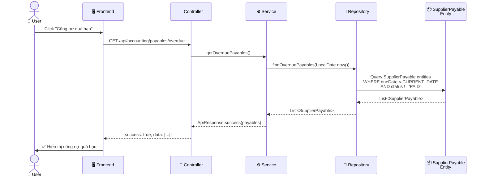
```mermaid
sequenceDiagram
    actor User as 👤 User
    participant FE as 🖥️ Frontend
    participant Ctrl as 🔌 Controller
    participant Svc as ⚙️ Service
    participant Repo as 💾 Repository
    participant Entity as 📦 SupplierPayable<br/>Entity
    
    User->>FE: Click "Công nợ quá hạn"
    
    FE->>Ctrl: GET /api/accounting/payables/overdue
    Ctrl->>Svc: getOverduePayables()
    Svc->>Repo: findOverduePayables(LocalDate.now())
    Repo->>Entity: Query SupplierPayable entities<br/>WHERE dueDate < CURRENT_DATE<br/>AND status != 'PAID'
    Entity-->>Repo: List<SupplierPayable>
    Repo-->>Svc: List<SupplierPayable>
    Svc-->>Ctrl: ApiResponse.success(payables)
    Ctrl-->>FE: {success: true, data: [...]}
    
    FE->>User: ✅ Hiển thị công nợ quá hạn
```

### 6.3 Xem công nợ sắp đến hạn

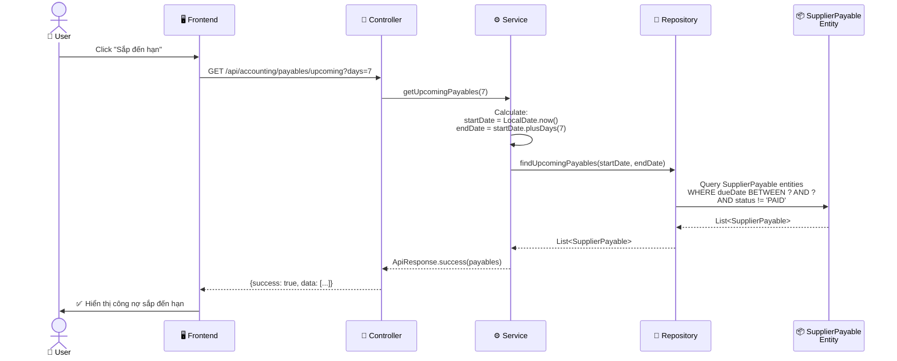
```mermaid
sequenceDiagram
    actor User as 👤 User
    participant FE as 🖥️ Frontend
    participant Ctrl as 🔌 Controller
    participant Svc as ⚙️ Service
    participant Repo as 💾 Repository
    participant Entity as 📦 SupplierPayable<br/>Entity
    
    User->>FE: Click "Sắp đến hạn"
    
    FE->>Ctrl: GET /api/accounting/payables/upcoming?days=7
    Ctrl->>Svc: getUpcomingPayables(7)
    Svc->>Svc: Calculate:<br/>startDate = LocalDate.now()<br/>endDate = startDate.plusDays(7)
    Svc->>Repo: findUpcomingPayables(startDate, endDate)
    Repo->>Entity: Query SupplierPayable entities<br/>WHERE dueDate BETWEEN ? AND ?<br/>AND status != 'PAID'
    Entity-->>Repo: List<SupplierPayable>
    Repo-->>Svc: List<SupplierPayable>
    Svc-->>Ctrl: ApiResponse.success(payables)
    Ctrl-->>FE: {success: true, data: [...]}
    
    FE->>User: ✅ Hiển thị công nợ sắp đến hạn
```

### 6.4 Thanh toán công nợ

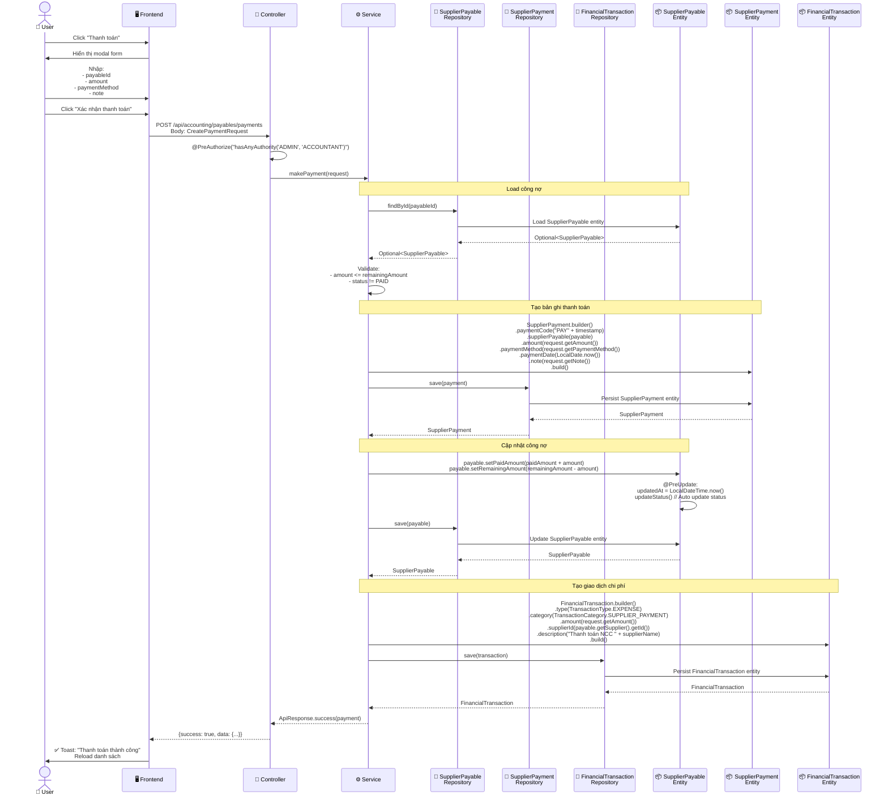
```mermaid
sequenceDiagram
    actor User as 👤 User
    participant FE as 🖥️ Frontend
    participant Ctrl as 🔌 Controller
    participant Svc as ⚙️ Service
    participant Repo1 as 💾 SupplierPayable<br/>Repository
    participant Repo2 as 💾 SupplierPayment<br/>Repository
    participant Repo3 as 💾 FinancialTransaction<br/>Repository
    participant E1 as 📦 SupplierPayable<br/>Entity
    participant E2 as 📦 SupplierPayment<br/>Entity
    participant E3 as 📦 FinancialTransaction<br/>Entity
    
    User->>FE: Click "Thanh toán"
    FE->>User: Hiển thị modal form
    
    User->>FE: Nhập:<br/>- payableId<br/>- amount<br/>- paymentMethod<br/>- note
    User->>FE: Click "Xác nhận thanh toán"
    
    FE->>Ctrl: POST /api/accounting/payables/payments<br/>Body: CreatePaymentRequest
    Ctrl->>Ctrl: @PreAuthorize("hasAnyAuthority('ADMIN', 'ACCOUNTANT')")
    Ctrl->>Svc: makePayment(request)
    
    Note over Svc,E1: Load công nợ
    Svc->>Repo1: findById(payableId)
    Repo1->>E1: Load SupplierPayable entity
    E1-->>Repo1: Optional<SupplierPayable>
    Repo1-->>Svc: Optional<SupplierPayable>
    
    Svc->>Svc: Validate:<br/>- amount <= remainingAmount<br/>- status != PAID
    
    Note over Svc,E2: Tạo bản ghi thanh toán
    Svc->>E2: SupplierPayment.builder()<br/>.paymentCode("PAY" + timestamp)<br/>.supplierPayable(payable)<br/>.amount(request.getAmount())<br/>.paymentMethod(request.getPaymentMethod())<br/>.paymentDate(LocalDate.now())<br/>.note(request.getNote())<br/>.build()
    
    Svc->>Repo2: save(payment)
    Repo2->>E2: Persist SupplierPayment entity
    E2-->>Repo2: SupplierPayment
    Repo2-->>Svc: SupplierPayment
    
    Note over Svc,E1: Cập nhật công nợ
    Svc->>E1: payable.setPaidAmount(paidAmount + amount)<br/>payable.setRemainingAmount(remainingAmount - amount)
    E1->>E1: @PreUpdate:<br/>updatedAt = LocalDateTime.now()<br/>updateStatus() // Auto update status
    
    Svc->>Repo1: save(payable)
    Repo1->>E1: Update SupplierPayable entity
    E1-->>Repo1: SupplierPayable
    Repo1-->>Svc: SupplierPayable
    
    Note over Svc,E3: Tạo giao dịch chi phí
    Svc->>E3: FinancialTransaction.builder()<br/>.type(TransactionType.EXPENSE)<br/>.category(TransactionCategory.SUPPLIER_PAYMENT)<br/>.amount(request.getAmount())<br/>.supplierId(payable.getSupplier().getId())<br/>.description("Thanh toán NCC " + supplierName)<br/>.build()
    
    Svc->>Repo3: save(transaction)
    Repo3->>E3: Persist FinancialTransaction entity
    E3-->>Repo3: FinancialTransaction
    Repo3-->>Svc: FinancialTransaction
    
    Svc-->>Ctrl: ApiResponse.success(payment)
    Ctrl-->>FE: {success: true, data: {...}}
    
    FE->>User: ✅ Toast: "Thanh toán thành công"<br/>Reload danh sách
```

### 6.5 Xem lịch sử thanh toán

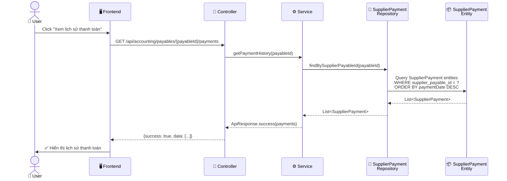
```mermaid
sequenceDiagram
    actor User as 👤 User
    participant FE as 🖥️ Frontend
    participant Ctrl as 🔌 Controller
    participant Svc as ⚙️ Service
    participant Repo as 💾 SupplierPayment<br/>Repository
    participant Entity as 📦 SupplierPayment<br/>Entity
    
    User->>FE: Click "Xem lịch sử thanh toán"
    
    FE->>Ctrl: GET /api/accounting/payables/{payableId}/payments
    Ctrl->>Svc: getPaymentHistory(payableId)
    Svc->>Repo: findBySupplierPayableId(payableId)
    Repo->>Entity: Query SupplierPayment entities<br/>WHERE supplier_payable_id = ?<br/>ORDER BY paymentDate DESC
    Entity-->>Repo: List<SupplierPayment>
    Repo-->>Svc: List<SupplierPayment>
    Svc-->>Ctrl: ApiResponse.success(payments)
    Ctrl-->>FE: {success: true, data: [...]}
    
    FE->>User: ✅ Hiển thị lịch sử thanh toán
```

### Entity: SupplierPayable

```java
@Entity
@Table(name = "supplier_payables")
public class SupplierPayable {
    @Id
    @GeneratedValue(strategy = GenerationType.IDENTITY)
    private Long id;
    
    @Column(nullable = false, unique = true)
    private String payableCode; // "AP-YYYYMMDD-XXXX"
    
    @ManyToOne
    @JoinColumn(name = "supplier_id", nullable = false)
    private Supplier supplier;
    
    @ManyToOne
    @JoinColumn(name = "purchase_order_id", nullable = false)
    private PurchaseOrder purchaseOrder;
    
    @Column(nullable = false, precision = 15, scale = 2)
    private BigDecimal totalAmount;
    
    @Column(nullable = false, precision = 15, scale = 2)
    private BigDecimal paidAmount;
    
    @Column(nullable = false, precision = 15, scale = 2)
    private BigDecimal remainingAmount;
    
    @Enumerated(EnumType.STRING)
    @Column(nullable = false)
    private PayableStatus status; // UNPAID, PARTIAL, PAID, OVERDUE
    
    @Column(nullable = false)
    private LocalDate invoiceDate;
    
    @Column(nullable = false)
    private LocalDate dueDate;
    
    private Integer paymentTermDays;
    private String note;
    private LocalDateTime createdAt;
    private LocalDateTime updatedAt;
    private String createdBy;
    
    @PrePersist
    protected void onCreate() {
        createdAt = LocalDateTime.now();
        if (remainingAmount == null) {
            remainingAmount = totalAmount;
        }
        if (paidAmount == null) {
            paidAmount = BigDecimal.ZERO;
        }
    }
    
    @PreUpdate
    protected void onUpdate() {
        updatedAt = LocalDateTime.now();
        updateStatus();
    }
    
    public void updateStatus() {
        if (remainingAmount.compareTo(BigDecimal.ZERO) == 0) {
            status = PayableStatus.PAID;
        } else if (paidAmount.compareTo(BigDecimal.ZERO) > 0) {
            status = PayableStatus.PARTIAL;
        } else if (LocalDate.now().isAfter(dueDate)) {
            status = PayableStatus.OVERDUE;
        } else {
            status = PayableStatus.UNPAID;
        }
    }
}
```

### Entity: SupplierPayment

```java
@Entity
@Table(name = "supplier_payments")
public class SupplierPayment {
    @Id
    @GeneratedValue(strategy = GenerationType.IDENTITY)
    private Long id;
    
    @Column(nullable = false, unique = true)
    private String paymentCode; // "PAY" + timestamp
    
    @ManyToOne
    @JoinColumn(name = "supplier_payable_id", nullable = false)
    private SupplierPayable supplierPayable;
    
    @Column(nullable = false, precision = 15, scale = 2)
    private BigDecimal amount;
    
    @Enumerated(EnumType.STRING)
    @Column(nullable = false)
    private PaymentMethod paymentMethod; // CASH, BANK_TRANSFER, etc.
    
    @Column(nullable = false)
    private LocalDate paymentDate;
    
    private String note;
    private LocalDateTime createdAt;
    private String createdBy;
    
    @PrePersist
    protected void onCreate() {
        createdAt = LocalDateTime.now();
    }
}
```

---


## 7. BÁO CÁO NÂNG CAO (Advanced Reports)

### 7.1 Báo cáo lãi lỗ (Profit & Loss Report)

**Frontend**: `/admin/accounting/advanced-reports/page.tsx`  
**Controller**: `AdvancedReportController`  
**Service**: `AdvancedReportService`  
**Repository**: `FinancialTransactionRepository`  
**Entity**: `FinancialTransaction`

```mermaid
sequenceDiagram
    actor User as 👤 User
    participant FE as 🖥️ Frontend
    participant Ctrl as 🔌 AdvancedReport<br/>Controller
    participant Svc as ⚙️ AdvancedReport<br/>Service
    participant Repo as 💾 FinancialTransaction<br/>Repository
    participant Entity as 📦 FinancialTransaction<br/>Entity
    
    User->>FE: Truy cập trang báo cáo nâng cao
    User->>FE: Chọn "Báo cáo lãi lỗ"
    User->>FE: Nhập startDate, endDate, groupBy
    User->>FE: Click "Tạo báo cáo"
    
    FE->>Ctrl: POST /api/accounting/reports/profit-loss<br/>Body: AdvancedReportRequest
    Ctrl->>Ctrl: @PreAuthorize("hasRole('ADMIN') or<br/>@employeeSecurityService.hasPosition(authentication, 'ACCOUNTANT')")
    Ctrl->>Svc: generateProfitLossReport(request)
    
    Note over Svc,Entity: Load doanh thu theo category
    Svc->>Repo: findByTypeAndTransactionDateBetween(REVENUE, start, end)
    Repo->>Entity: Query FinancialTransaction entities<br/>WHERE type='REVENUE'<br/>AND transactionDate BETWEEN ? AND ?
    Entity-->>Repo: List<FinancialTransaction>
    Repo-->>Svc: List<FinancialTransaction>
    
    Note over Svc,Entity: Load chi phí theo category
    Svc->>Repo: findByTypeAndTransactionDateBetween(EXPENSE, start, end)
    Repo->>Entity: Query FinancialTransaction entities<br/>WHERE type='EXPENSE'
    Entity-->>Repo: List<FinancialTransaction>
    Repo-->>Svc: List<FinancialTransaction>
    
    Svc->>Svc: Group by category and calculate:<br/>- Revenue by category (SALES, etc.)<br/>- Expense by category (SHIPPING, TAX, etc.)<br/>- Gross profit = Total revenue - COGS<br/>- Operating expenses<br/>- Net profit = Gross profit - Operating expenses<br/>- Profit margin = (Net profit / Total revenue) * 100
    
    Svc->>Svc: Build AdvancedReportResponse:<br/>- reportType: "PROFIT_LOSS"<br/>- period: {startDate, endDate}<br/>- summary: {totalRevenue, totalExpense, netProfit, profitMargin}<br/>- breakdown: [{category, amount, percentage}, ...]<br/>- chartData: [...]
    
    Svc-->>Ctrl: AdvancedReportResponse
    Ctrl-->>FE: {success: true, data: {...}}
    
    FE->>User: ✅ Hiển thị báo cáo lãi lỗ:<br/>📊 Charts (Revenue vs Expense)<br/>📋 Breakdown by category<br/>💰 Summary metrics
```

### 7.2 Báo cáo dòng tiền (Cash Flow Report)

```mermaid
sequenceDiagram
    actor User as 👤 User
    participant FE as 🖥️ Frontend
    participant Ctrl as 🔌 Controller
    participant Svc as ⚙️ Service
    participant Repo as 💾 Repository
    participant Entity as 📦 FinancialTransaction<br/>Entity
    
    User->>FE: Chọn "Báo cáo dòng tiền"
    User->>FE: Nhập startDate, endDate
    User->>FE: Click "Tạo báo cáo"
    
    FE->>Ctrl: POST /api/accounting/reports/cash-flow<br/>Body: AdvancedReportRequest
    Ctrl->>Svc: generateCashFlowReport(request)
    
    Note over Svc,Entity: Load tất cả giao dịch
    Svc->>Repo: findByTransactionDateBetween(start, end)
    Repo->>Entity: Query FinancialTransaction entities<br/>WHERE transactionDate BETWEEN ? AND ?<br/>ORDER BY transactionDate ASC
    Entity-->>Repo: List<FinancialTransaction>
    Repo-->>Svc: List<FinancialTransaction>
    
    Svc->>Svc: Calculate cash flow:<br/>- Opening balance (from previous period)<br/>- Cash inflows (REVENUE transactions)<br/>- Cash outflows (EXPENSE transactions)<br/>- Net cash flow = Inflows - Outflows<br/>- Closing balance = Opening + Net cash flow<br/>- Group by time period (daily/weekly/monthly)
    
    Svc->>Svc: Build AdvancedReportResponse:<br/>- reportType: "CASH_FLOW"<br/>- summary: {openingBalance, totalInflows, totalOutflows, netCashFlow, closingBalance}<br/>- timeline: [{date, inflows, outflows, balance}, ...]<br/>- chartData: [...]
    
    Svc-->>Ctrl: AdvancedReportResponse
    Ctrl-->>FE: {success: true, data: {...}}
    
    FE->>User: ✅ Hiển thị báo cáo dòng tiền:<br/>📈 Timeline chart<br/>💵 Cash flow summary<br/>📊 Inflows vs Outflows
```

### 7.3 Phân tích chi phí (Expense Analysis)

```mermaid
sequenceDiagram
    actor User as 👤 User
    participant FE as 🖥️ Frontend
    participant Ctrl as 🔌 Controller
    participant Svc as ⚙️ Service
    participant Repo as 💾 Repository
    participant Entity as 📦 FinancialTransaction<br/>Entity
    
    User->>FE: Chọn "Phân tích chi phí"
    User->>FE: Nhập startDate, endDate
    User->>FE: Click "Tạo báo cáo"
    
    FE->>Ctrl: POST /api/accounting/reports/expense-analysis<br/>Body: AdvancedReportRequest
    Ctrl->>Svc: generateExpenseAnalysis(request)
    
    Note over Svc,Entity: Load chi phí theo category
    Svc->>Repo: findByTypeAndTransactionDateBetween(EXPENSE, start, end)
    Repo->>Entity: Query FinancialTransaction entities<br/>WHERE type='EXPENSE'<br/>AND transactionDate BETWEEN ? AND ?
    Entity-->>Repo: List<FinancialTransaction>
    Repo-->>Svc: List<FinancialTransaction>
    
    Svc->>Svc: Analyze expenses:<br/>- Group by category (SHIPPING, TAX, SUPPLIER_PAYMENT, etc.)<br/>- Calculate total per category<br/>- Calculate percentage of total<br/>- Identify top expense categories<br/>- Compare with previous period (if available)<br/>- Calculate growth rate
    
    Svc->>Svc: Build AdvancedReportResponse:<br/>- reportType: "EXPENSE_ANALYSIS"<br/>- summary: {totalExpenses, averagePerDay, topCategory}<br/>- breakdown: [{category, amount, percentage, trend}, ...]<br/>- comparison: {currentPeriod, previousPeriod, growthRate}<br/>- chartData: [pie chart, trend chart]
    
    Svc-->>Ctrl: AdvancedReportResponse
    Ctrl-->>FE: {success: true, data: {...}}
    
    FE->>User: ✅ Hiển thị phân tích chi phí:<br/>🥧 Pie chart by category<br/>📊 Expense breakdown<br/>📈 Trend analysis<br/>🔍 Top expense categories
```

---

## TÓM TẮT KIẾN TRÚC

### Luồng dữ liệu tổng quát

```
User (Frontend)
    ↓ HTTP Request
Controller (@RestController, @PreAuthorize)
    ↓ Method call
Service (@Service, Business Logic)
    ↓ Method call
Repository (@Repository, JPA)
    ↓ JPA/Hibernate
Entity (@Entity, Domain Model)
    ↓ SQL Query
Database (MySQL/PostgreSQL)
```

### Các Entity chính trong module Accounting

1. **FinancialTransaction** - Giao dịch tài chính (thu/chi)
2. **AccountingPeriod** - Kỳ kế toán (OPEN/CLOSED)
3. **TaxReport** - Báo cáo thuế (VAT, TNDN)
4. **SupplierPayable** - Công nợ phải trả NCC
5. **SupplierPayment** - Thanh toán cho NCC
6. **PaymentReconciliation** - Đối soát thanh toán

### Các Repository chính

1. **FinancialTransactionRepository** - CRUD + Custom queries cho giao dịch
2. **AccountingPeriodRepository** - CRUD + Query theo status, dates
3. **TaxReportRepository** - CRUD + Sum queries cho thuế
4. **SupplierPayableRepository** - CRUD + Query overdue, upcoming
5. **SupplierPaymentRepository** - CRUD + Query payment history

### Các Controller chính

1. **FinancialTransactionController** - `/api/accounting/transactions`
2. **AccountingPeriodController** - `/api/accounting/periods`
3. **TaxReportController** - `/api/accounting/tax`
4. **SupplierPayableController** - `/api/accounting/payables`
5. **FinancialStatementController** - `/api/accounting/financial-statement`
6. **AdvancedReportController** - `/api/accounting/reports`
7. **ShippingReconciliationController** - `/api/accounting/shipping-reconciliation`

### Security & Authorization

Tất cả endpoints đều được bảo vệ bởi:
- `@PreAuthorize("hasRole('ADMIN')")` - Chỉ Admin
- `@PreAuthorize("hasRole('ADMIN') or (hasRole('EMPLOYEE') and @employeeSecurityService.hasPosition(authentication, 'ACCOUNTANT'))")` - Admin hoặc Accountant
- `@PreAuthorize("hasAnyAuthority('ADMIN', 'ACCOUNTANT', 'WAREHOUSE_MANAGER')")` - Nhiều roles

### Database Tables

```sql
-- Giao dịch tài chính
financial_transactions (id, transaction_code, type, category, amount, order_id, supplier_id, description, transaction_date, created_by, created_at, updated_at)

-- Kỳ kế toán
accounting_periods (id, name, start_date, end_date, status, total_revenue, total_expense, net_profit, discrepancy_rate, closed_at, closed_by, created_at)

-- Báo cáo thuế
tax_reports (id, report_code, tax_type, period_start, period_end, taxable_revenue, tax_rate, tax_amount, paid_amount, remaining_tax, status, submitted_at, paid_at, created_at, created_by)

-- Công nợ NCC
supplier_payables (id, payable_code, supplier_id, purchase_order_id, total_amount, paid_amount, remaining_amount, status, invoice_date, due_date, payment_term_days, note, created_at, updated_at, created_by)

-- Thanh toán NCC
supplier_payments (id, payment_code, supplier_payable_id, amount, payment_method, payment_date, note, created_at, created_by)
```

---

## KẾT LUẬN

Tài liệu này mô tả đầy đủ các luồng nghiệp vụ kế toán từ Frontend đến Backend với đúng tên Controller, Service, Repository và Entity theo code thực tế. Mỗi sequence diagram cho thấy rõ:

1. **User interaction** - Người dùng thao tác trên giao diện
2. **Frontend logic** - Validation, state management
3. **API calls** - HTTP requests với đúng endpoint
4. **Controller layer** - Authentication, authorization
5. **Service layer** - Business logic, calculations
6. **Repository layer** - Data access methods
7. **Entity layer** - Domain models, lifecycle hooks
8. **Database** - Actual data persistence

Tất cả đều dựa trên code backend thực tế đã được implement.
