# Sequence Diagram - Module Quản Lý Đơn Hàng (Order Management Module)

## Tổng quan
Tài liệu này mô tả chi tiết các luồng nghiệp vụ quản lý đơn hàng từ góc nhìn người dùng (Frontend) tương tác với các layer Backend theo đúng code thực tế.

## Kiến trúc Backend
```
Frontend → Controller → Service → Repository → Entity (JPA/Hibernate) → Database
```

## Các Entity trong hệ thống
1. **Order** - Đơn hàng
2. **OrderItem** - Chi tiết sản phẩm trong đơn hàng
3. **Customer** - Khách hàng (từ module auth)
4. **Product** - Sản phẩm (từ module product)

## Các Enum
- **OrderStatus**: PENDING_PAYMENT, CONFIRMED, READY_TO_SHIP, PICKED_UP, SHIPPING, DELIVERY_FAILED, DELIVERED, COMPLETED, CANCELLED, RETURNED
- **PaymentStatus**: UNPAID, PENDING, PAID, FAILED, REFUNDED

## Các chức năng chính
1. Xem danh sách đơn hàng (Admin/Employee)
2. Xem chi tiết đơn hàng
3. Tạo đơn hàng (Customer)
4. Xác nhận đơn hàng (Admin/Sales)
5. Cập nhật trạng thái đơn hàng
6. Hủy đơn hàng
7. Theo dõi vận chuyển
8. Thống kê đơn hàng

---

## 1. XEM DANH SÁCH ĐỐN HÀNG (Admin/Employee)

### Mô tả
Người dùng (Admin/Employee) truy cập trang quản lý đơn hàng để xem danh sách tất cả đơn hàng với các bộ lọc.

### Frontend: `/admin/orders/page.tsx` hoặc `/employee/orders/page.tsx`

### Sequence Diagram

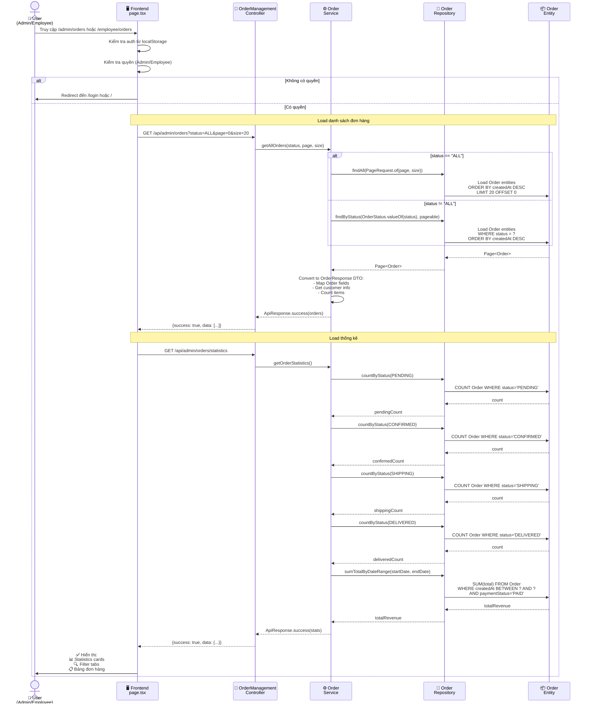

---

## 2. XEM CHI TIẾT ĐƠN HÀNG

### Mô tả
Người dùng click vào một đơn hàng để xem thông tin chi tiết bao gồm thông tin khách hàng, sản phẩm, thanh toán và lịch sử.

### Frontend: `/admin/orders/[id]/page.tsx` hoặc `/employee/orders/[id]/page.tsx`

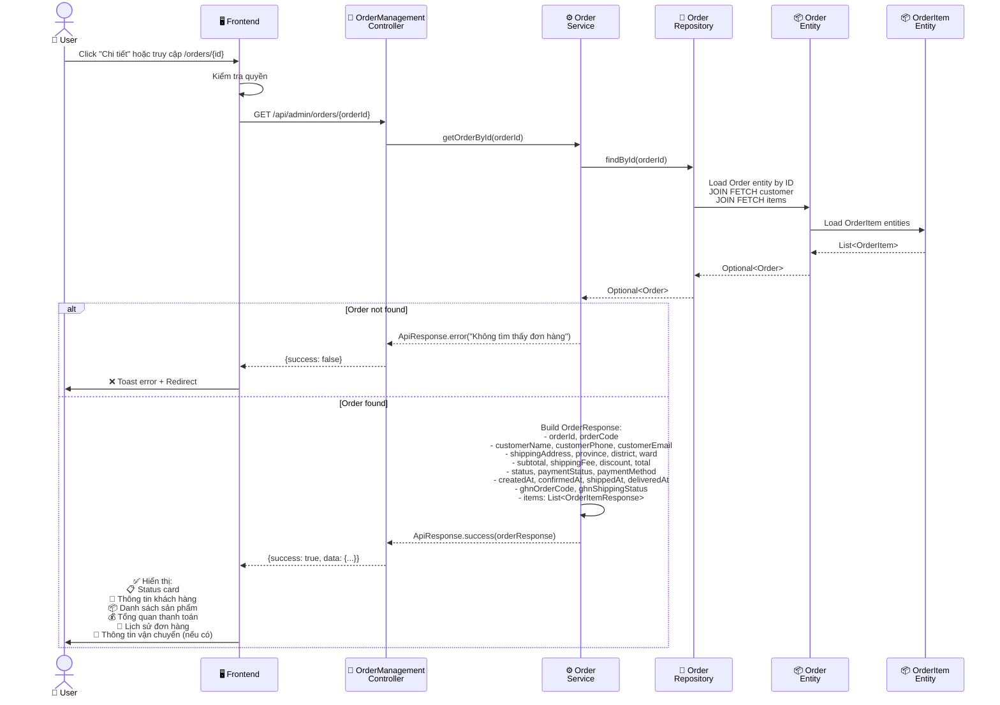

---

## 3. TẠO ĐƠN HÀNG (Customer)

### Mô tả
Khách hàng tạo đơn hàng từ giỏ hàng, nhập thông tin giao hàng và chọn phương thức thanh toán.

### Frontend: Customer checkout page

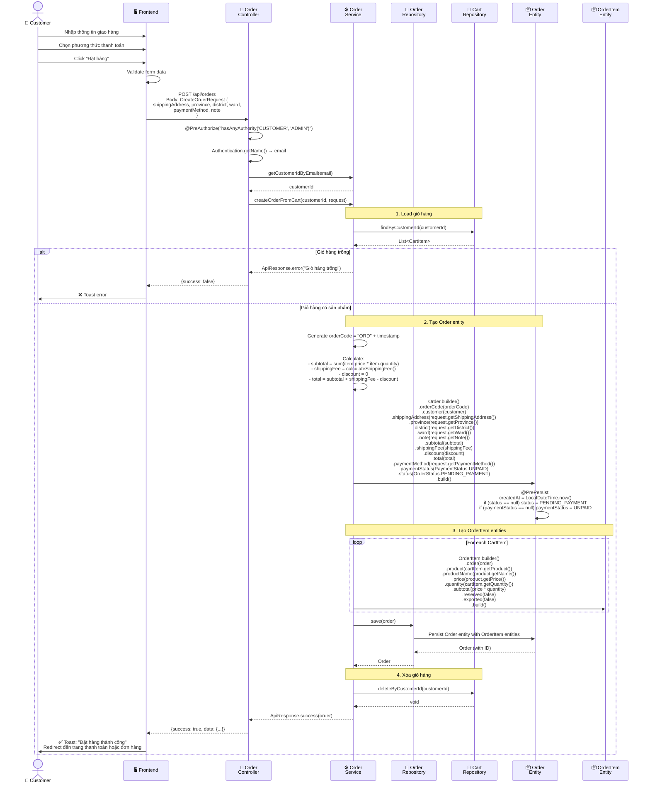

---

## 4. XÁC NHẬN ĐƠN HÀNG (Admin/Sales)

### Mô tả
Nhân viên bán hàng hoặc Admin xác nhận đơn hàng sau khi kiểm tra thông tin và thanh toán.

### Frontend: Admin/Employee orders page

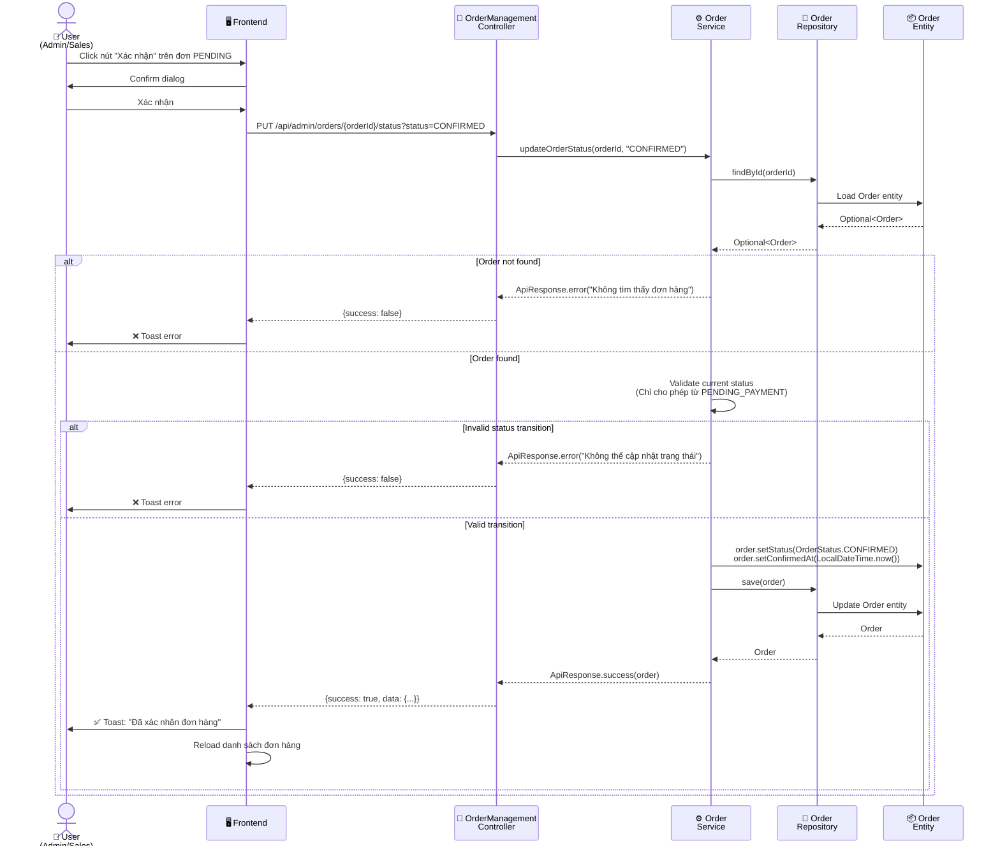

---

## 5. XUẤT KHO VÀ CHUYỂN SANG READY_TO_SHIP

### Mô tả
Sau khi đơn hàng được xác nhận (CONFIRMED), nhân viên kho xuất hàng. Khi xuất kho thành công, đơn hàng tự động chuyển sang READY_TO_SHIP.

### Frontend: Warehouse export page

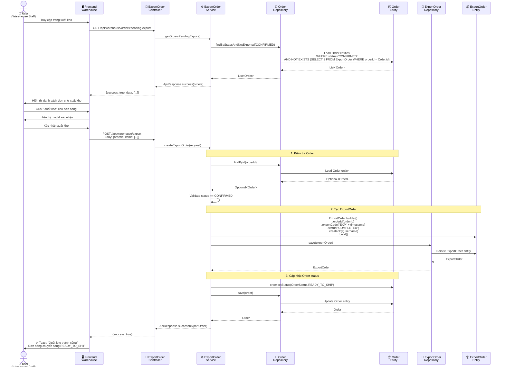

---

## 6. CHUYỂN SANG ĐANG GIAO HÀNG (SHIPPING)

### Mô tả
Sau khi đơn hàng ở trạng thái READY_TO_SHIP, nhân viên bán hàng cập nhật sang SHIPPING khi tài xế đã lấy hàng.

### Frontend: Admin/Employee orders page

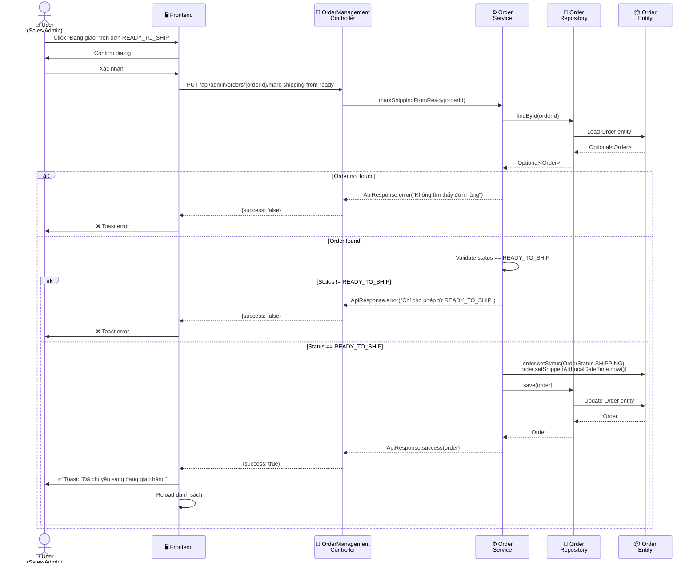

---

## 7. XÁC NHẬN ĐÃ GIAO HÀNG (DELIVERED)

### Mô tả
Khi đơn hàng đã được giao thành công, nhân viên cập nhật trạng thái sang DELIVERED.

### Frontend: Admin/Employee orders page

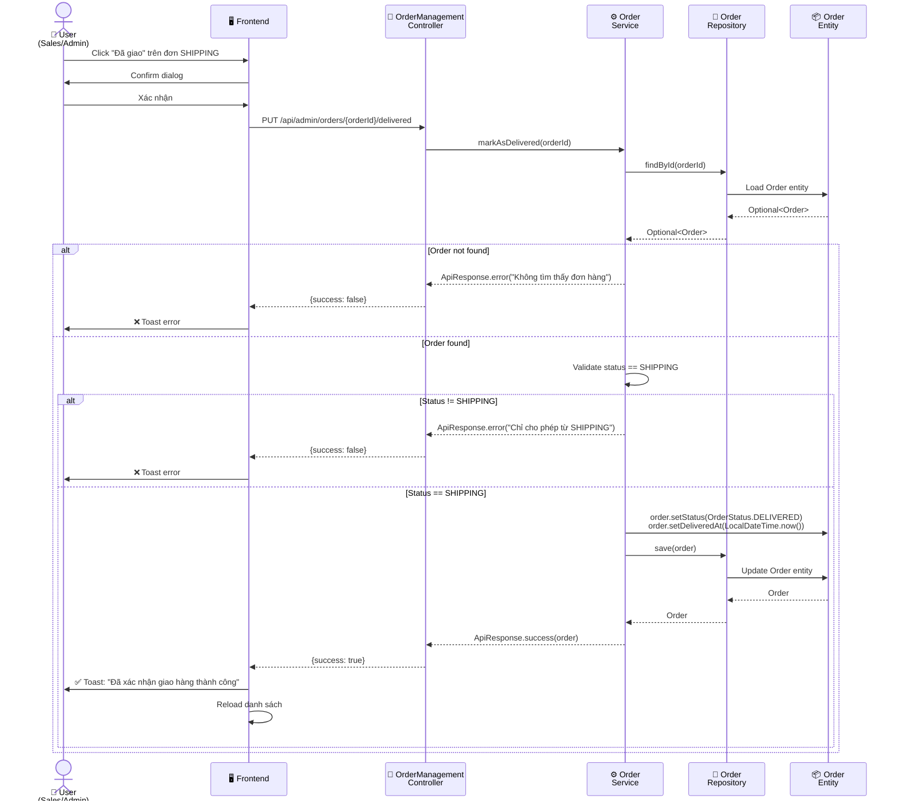

---

## 8. HỦY ĐƠN HÀNG

### 8.1 Hủy bởi Customer

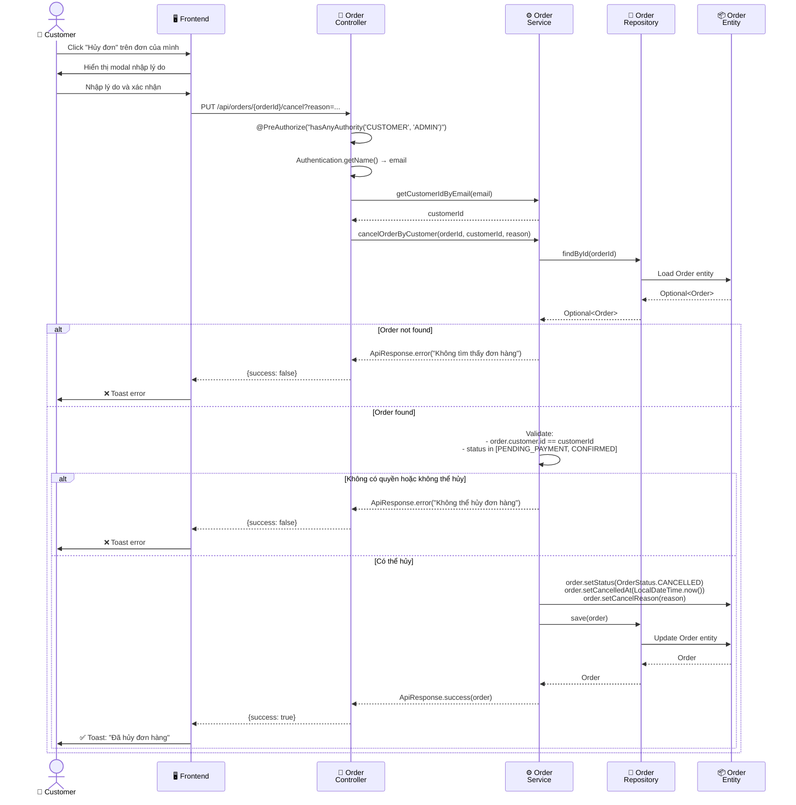

### 8.2 Hủy bởi Admin/Staff

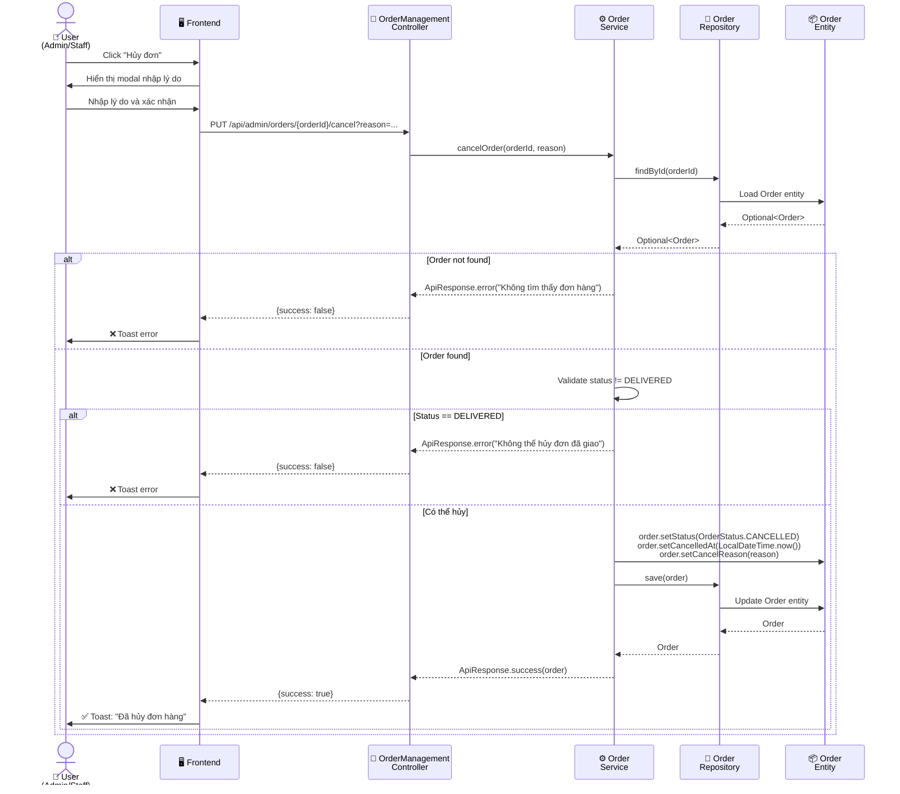

---

## 9. THEO DÕI VẬN CHUYỂN GHN

### Mô tả
Xem trạng thái vận chuyển từ GHN (Giao Hàng Nhanh) cho đơn hàng đã tạo vận đơn.

### Frontend: Order detail page

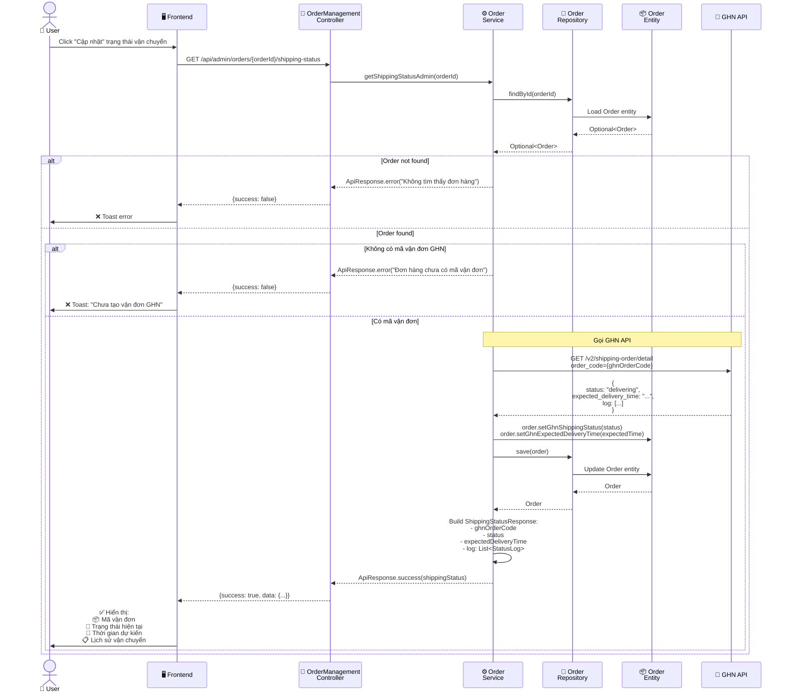

---

## 10. THỐNG KÊ ĐƠN HÀNG

### Mô tả
Xem thống kê tổng quan về đơn hàng theo trạng thái và doanh thu.

### Frontend: Dashboard hoặc Orders page

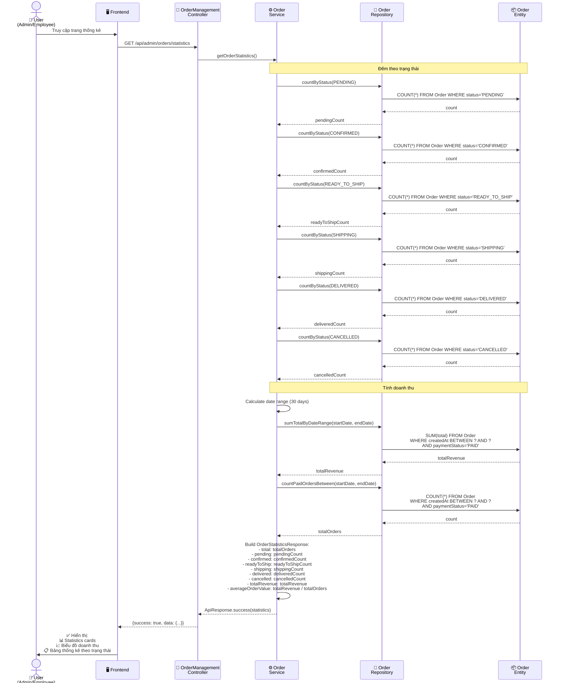

---

## 11. LUỒNG TRẠNG THÁI ĐƠN HÀNG (Order Status Flow)

### Sơ đồ luồng trạng thái

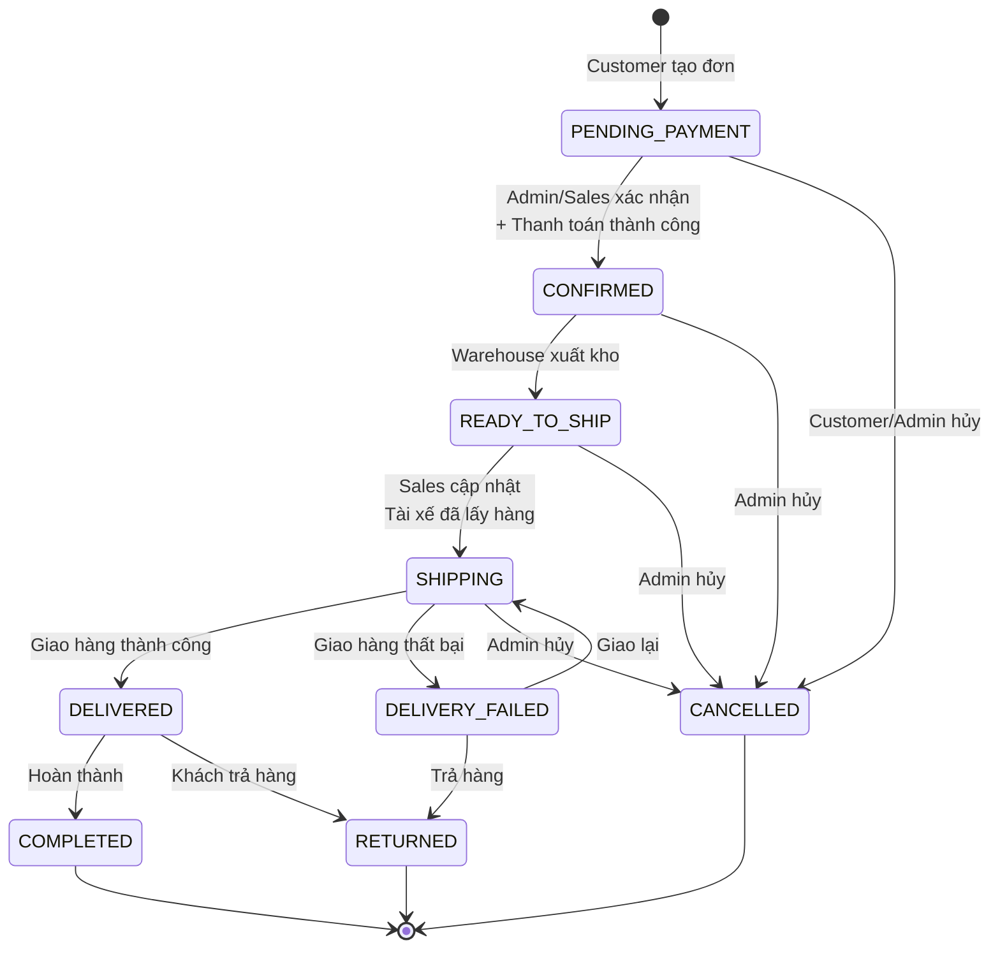

### Quy tắc chuyển trạng thái

| Từ trạng thái | Sang trạng thái | Người thực hiện | Điều kiện |
|---------------|-----------------|-----------------|-----------|
| PENDING_PAYMENT | CONFIRMED | Admin/Sales | Đã thanh toán hoặc COD |
| PENDING_PAYMENT | CANCELLED | Customer/Admin | Bất kỳ lúc nào |
| CONFIRMED | READY_TO_SHIP | System (auto) | Sau khi xuất kho thành công |
| CONFIRMED | CANCELLED | Admin | Trước khi xuất kho |
| READY_TO_SHIP | SHIPPING | Sales/Admin | Tài xế đã lấy hàng |
| READY_TO_SHIP | CANCELLED | Admin | Trước khi giao |
| SHIPPING | DELIVERED | Sales/Admin | Giao hàng thành công |
| SHIPPING | DELIVERY_FAILED | System/Admin | Giao hàng thất bại |
| SHIPPING | CANCELLED | Admin | Đặc biệt |
| DELIVERY_FAILED | SHIPPING | Admin | Giao lại |
| DELIVERY_FAILED | RETURNED | Admin | Trả hàng |
| DELIVERED | COMPLETED | System (auto) | Sau 7 ngày không khiếu nại |
| DELIVERED | RETURNED | Admin | Khách yêu cầu trả hàng |

---

## 12. ENTITY DEFINITIONS

### Entity: Order

```java
@Entity
@Table(name = "orders")
@Getter
@Setter
@NoArgsConstructor
@AllArgsConstructor
@Builder
public class Order {
    
    @Id
    @GeneratedValue(strategy = GenerationType.IDENTITY)
    private Long id;
    
    @Column(unique = true, nullable = false)
    private String orderCode; // Mã đơn hàng: ORD20231119001
    
    @ManyToOne(fetch = FetchType.LAZY)
    @JoinColumn(name = "customer_id", nullable = false)
    private Customer customer;
    
    @OneToMany(mappedBy = "order", cascade = CascadeType.ALL, orphanRemoval = true)
    private List<OrderItem> items;
    
    // Thông tin giao hàng
    @Column(nullable = false, columnDefinition = "TEXT")
    private String shippingAddress;
    
    private String province;  // Tỉnh/Thành phố
    private String district;  // Quận/Huyện
    private String ward;      // Phường/Xã ward code (for GHN API)
    private String wardName;  // Tên phường/xã (for display)
    private String address;   // Địa chỉ cụ thể (số nhà, tên đường)
    
    private String note; // Ghi chú của khách hàng
    
    // Giá tiền
    @Column(nullable = false)
    private Double subtotal; // Tổng tiền hàng
    
    @Column(nullable = false)
    private Double shippingFee; // Phí vận chuyển
    
    @Column(nullable = false)
    private Double discount; // Giảm giá
    
    @Column(nullable = false)
    private Double total; // Tổng thanh toán
    
    // Thanh toán
    @Enumerated(EnumType.STRING)
    @Column(nullable = false)
    private PaymentStatus paymentStatus;
    
    @Column(length = 20)
    private String paymentMethod; // COD, SEPAY, VNPAY, etc.
    
    private Long paymentId; // Reference đến Payment entity
    
    // Trạng thái đơn hàng
    @Enumerated(EnumType.STRING)
    @Column(nullable = false)
    private OrderStatus status;
    
    @Column(nullable = false)
    private LocalDateTime createdAt;
    
    private LocalDateTime confirmedAt; // Xác nhận đơn
    
    private LocalDateTime shippedAt; // Giao hàng
    
    private LocalDateTime deliveredAt; // Đã giao
    
    private LocalDateTime cancelledAt; // Hủy đơn
    
    private String cancelReason; // Lý do hủy
    
    // GHN Shipping Integration
    private String ghnOrderCode; // Mã vận đơn GHN
    
    private String ghnShippingStatus; // Trạng thái vận chuyển từ GHN
    
    private LocalDateTime ghnCreatedAt; // Thời gian tạo đơn GHN
    
    private LocalDateTime ghnExpectedDeliveryTime; // Thời gian giao hàng dự kiến
    
    @PrePersist
    protected void onCreate() {
        createdAt = LocalDateTime.now();
        if (status == null) {
            status = OrderStatus.PENDING_PAYMENT;
        }
        if (paymentStatus == null) {
            paymentStatus = PaymentStatus.UNPAID;
        }
    }
}
```

### Entity: OrderItem

```java
@Entity
@Table(name = "order_items")
@Getter
@Setter
@NoArgsConstructor
@AllArgsConstructor
@Builder
public class OrderItem {
    
    @Id
    @GeneratedValue(strategy = GenerationType.IDENTITY)
    private Long id;
    
    @ManyToOne(fetch = FetchType.LAZY)
    @JoinColumn(name = "order_id", nullable = false)
    private Order order;
    
    @ManyToOne(fetch = FetchType.LAZY)
    @JoinColumn(name = "product_id", nullable = false)
    private Product product;
    
    @Column(nullable = false)
    private String productName; // Lưu tên sản phẩm tại thời điểm mua
    
    @Column(nullable = false)
    private Double price; // Giá tại thời điểm mua
    
    @Column(nullable = false)
    private Integer quantity;
    
    @Column(nullable = false)
    private Double subtotal; // price * quantity
    
    private String serialNumber; // Serial nếu là sản phẩm có serial
    
    @Column(nullable = false)
    private Boolean reserved = false; // Đã giữ hàng chưa
    
    @Column(nullable = false)
    private Boolean exported = false; // Đã xuất kho chưa
}
```

### Enum: OrderStatus

```java
public enum OrderStatus {
    PENDING_PAYMENT,    // Chờ thanh toán (đơn online)
    CONFIRMED,          // Đã xác nhận - Chờ xuất kho
    READY_TO_SHIP,      // Đã xuất kho - Chờ tài xế lấy hàng
    PICKED_UP,          // Tài xế đã lấy hàng
    SHIPPING,           // Đang giao hàng
    DELIVERY_FAILED,    // Giao hàng thất bại
    DELIVERED,          // Đã giao hàng
    COMPLETED,          // Hoàn thành
    CANCELLED,          // Đã hủy
    RETURNED            // Đã trả hàng
}
```

### Enum: PaymentStatus

```java
public enum PaymentStatus {
    UNPAID,         // Chưa thanh toán
    PENDING,        // Đang chờ thanh toán
    PAID,           // Đã thanh toán
    FAILED,         // Thanh toán thất bại
    REFUNDED        // Đã hoàn tiền
}
```

---

## 13. API ENDPOINTS SUMMARY

### Customer Endpoints (`/api/orders`)

| Method | Endpoint | Description | Auth |
|--------|----------|-------------|------|
| POST | `/api/orders` | Tạo đơn hàng từ giỏ hàng | CUSTOMER, ADMIN |
| GET | `/api/orders` | Lấy danh sách đơn hàng của customer | CUSTOMER, ADMIN |
| GET | `/api/orders/{orderId}` | Lấy chi tiết đơn hàng | CUSTOMER, ADMIN |
| GET | `/api/orders/code/{orderCode}` | Lấy đơn hàng theo mã | CUSTOMER, ADMIN |
| PUT | `/api/orders/{orderId}/cancel` | Hủy đơn hàng (Customer) | CUSTOMER, ADMIN |
| GET | `/api/orders/{orderId}/shipping-status` | Xem trạng thái vận chuyển | CUSTOMER, ADMIN |

### Admin/Employee Endpoints (`/api/admin/orders`)

| Method | Endpoint | Description | Auth |
|--------|----------|-------------|------|
| GET | `/api/admin/orders` | Lấy tất cả đơn hàng (có filter) | ADMIN, EMPLOYEE |
| GET | `/api/admin/orders/{orderId}` | Lấy chi tiết đơn hàng | ADMIN, EMPLOYEE |
| GET | `/api/admin/orders/statistics` | Thống kê đơn hàng | ADMIN, EMPLOYEE |
| PUT | `/api/admin/orders/{orderId}/status` | Cập nhật trạng thái | ADMIN, EMPLOYEE |
| PUT | `/api/admin/orders/{orderId}/mark-shipping-from-ready` | Chuyển READY_TO_SHIP → SHIPPING | ADMIN, EMPLOYEE |
| PUT | `/api/admin/orders/{orderId}/delivered` | Đánh dấu đã giao | ADMIN, EMPLOYEE |
| PUT | `/api/admin/orders/{orderId}/cancel` | Hủy đơn hàng (Admin) | ADMIN, EMPLOYEE |
| GET | `/api/admin/orders/{orderId}/shipping-status` | Xem trạng thái vận chuyển | ADMIN, EMPLOYEE |

---

## 14. BUSINESS RULES

### Quy tắc tạo đơn hàng
1. Giỏ hàng phải có ít nhất 1 sản phẩm
2. Tất cả sản phẩm phải còn hàng (available quantity > 0)
3. Địa chỉ giao hàng phải đầy đủ: province, district, ward, address
4. Mã đơn hàng tự động: `ORD{timestamp}`
5. Trạng thái mặc định: `PENDING_PAYMENT`
6. PaymentStatus mặc định: `UNPAID`

### Quy tắc xác nhận đơn hàng
1. Chỉ xác nhận được đơn ở trạng thái `PENDING_PAYMENT`
2. Phải kiểm tra thanh toán (nếu không phải COD)
3. Sau khi xác nhận: status → `CONFIRMED`
4. Lưu thời gian xác nhận: `confirmedAt`

### Quy tắc xuất kho
1. Chỉ xuất kho đơn ở trạng thái `CONFIRMED`
2. Kiểm tra tồn kho trước khi xuất
3. Tạo phiếu xuất kho (ExportOrder)
4. Cập nhật số lượng tồn kho
5. Tự động chuyển Order sang `READY_TO_SHIP`

### Quy tắc giao hàng
1. Chỉ chuyển sang `SHIPPING` từ `READY_TO_SHIP`
2. Lưu thời gian bắt đầu giao: `shippedAt`
3. Có thể tích hợp với GHN để tạo vận đơn
4. Cập nhật trạng thái vận chuyển từ GHN webhook

### Quy tắc hoàn thành
1. Chỉ đánh dấu `DELIVERED` từ `SHIPPING`
2. Lưu thời gian giao hàng: `deliveredAt`
3. Tự động chuyển sang `COMPLETED` sau 7 ngày (nếu không có khiếu nại)

### Quy tắc hủy đơn
1. **Customer** chỉ hủy được đơn ở trạng thái: `PENDING_PAYMENT`, `CONFIRMED`
2. **Admin** có thể hủy đơn ở bất kỳ trạng thái nào (trừ `DELIVERED`, `COMPLETED`)
3. Phải nhập lý do hủy
4. Lưu thời gian hủy: `cancelledAt`
5. Nếu đã xuất kho: phải tạo phiếu nhập kho trả lại

---

## 15. INTEGRATION POINTS

### 1. Module Warehouse (Kho)
- **Xuất kho**: Khi Order chuyển từ `CONFIRMED` → `READY_TO_SHIP`
- **Nhập kho trả lại**: Khi Order bị hủy sau khi đã xuất kho
- **Kiểm tra tồn kho**: Trước khi tạo đơn hàng

### 2. Module Payment (Thanh toán)
- **Tạo Payment**: Khi Customer chọn phương thức thanh toán online
- **Cập nhật PaymentStatus**: Khi thanh toán thành công/thất bại
- **Webhook**: Nhận thông báo từ cổng thanh toán (SePay, VNPay)

### 3. Module Accounting (Kế toán)
- **Tạo FinancialTransaction**: Khi đơn hàng `DELIVERED`
  - Type: `REVENUE`
  - Category: `SALES`
  - Amount: `order.total`
- **Đối soát vận chuyển**: Tính toán chi phí và lợi nhuận vận chuyển

### 4. GHN Shipping API
- **Tạo vận đơn**: Khi Order ở trạng thái `READY_TO_SHIP`
- **Webhook**: Nhận cập nhật trạng thái vận chuyển
- **Tracking**: Lấy thông tin chi tiết vận đơn

### 5. Module Inventory (Tồn kho)
- **Giữ hàng (Reserve)**: Khi Order được xác nhận
- **Xuất hàng (Export)**: Khi tạo phiếu xuất kho
- **Trả hàng (Return)**: Khi đơn bị hủy hoặc trả hàng

---

## 16. NOTES

### Performance Considerations
1. **Pagination**: Luôn sử dụng phân trang cho danh sách đơn hàng
2. **Lazy Loading**: Sử dụng `@ManyToOne(fetch = FetchType.LAZY)` cho các quan hệ
3. **Indexing**: Đánh index cho các cột: `orderCode`, `status`, `createdAt`, `customerId`
4. **Caching**: Cache thống kê đơn hàng (statistics) với TTL 5 phút

### Security Considerations
1. **Authorization**: Kiểm tra quyền truy cập cho mỗi endpoint
2. **Customer Isolation**: Customer chỉ xem được đơn hàng của mình
3. **Audit Log**: Ghi log mọi thay đổi trạng thái đơn hàng
4. **Rate Limiting**: Giới hạn số lần tạo đơn hàng trong 1 phút

### Error Handling
1. **Order Not Found**: Trả về 404 với message rõ ràng
2. **Invalid Status Transition**: Trả về 400 với message giải thích
3. **Insufficient Stock**: Trả về 400 với thông tin sản phẩm hết hàng
4. **Payment Failed**: Trả về 400 và giữ đơn hàng ở `PENDING_PAYMENT`

---

**Tài liệu được tạo dựa trên code thực tế của hệ thống**  
**Ngày cập nhật**: 2024-12-25
